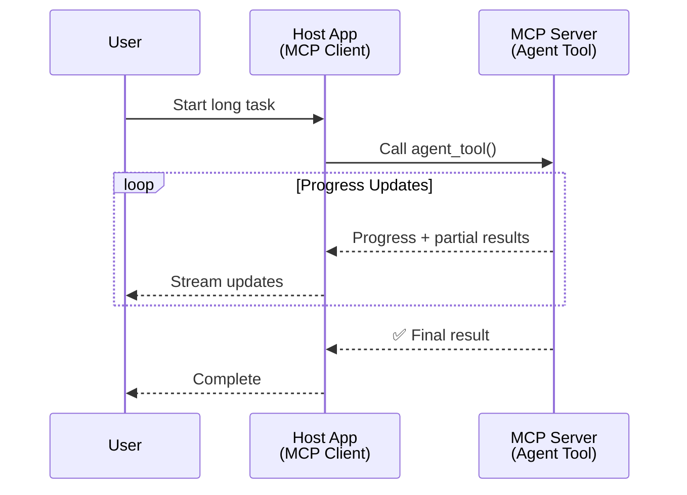
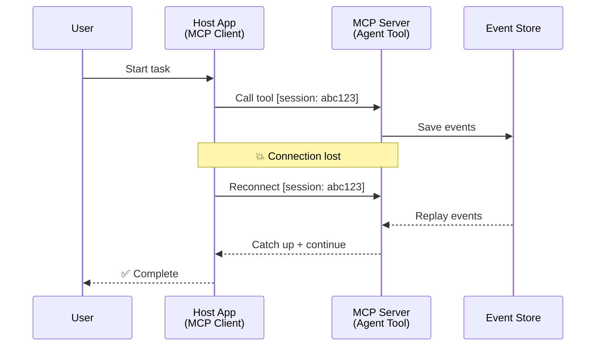
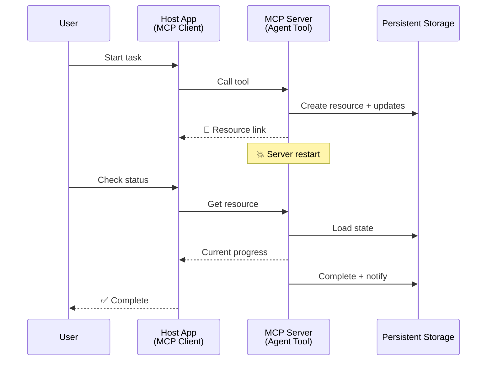
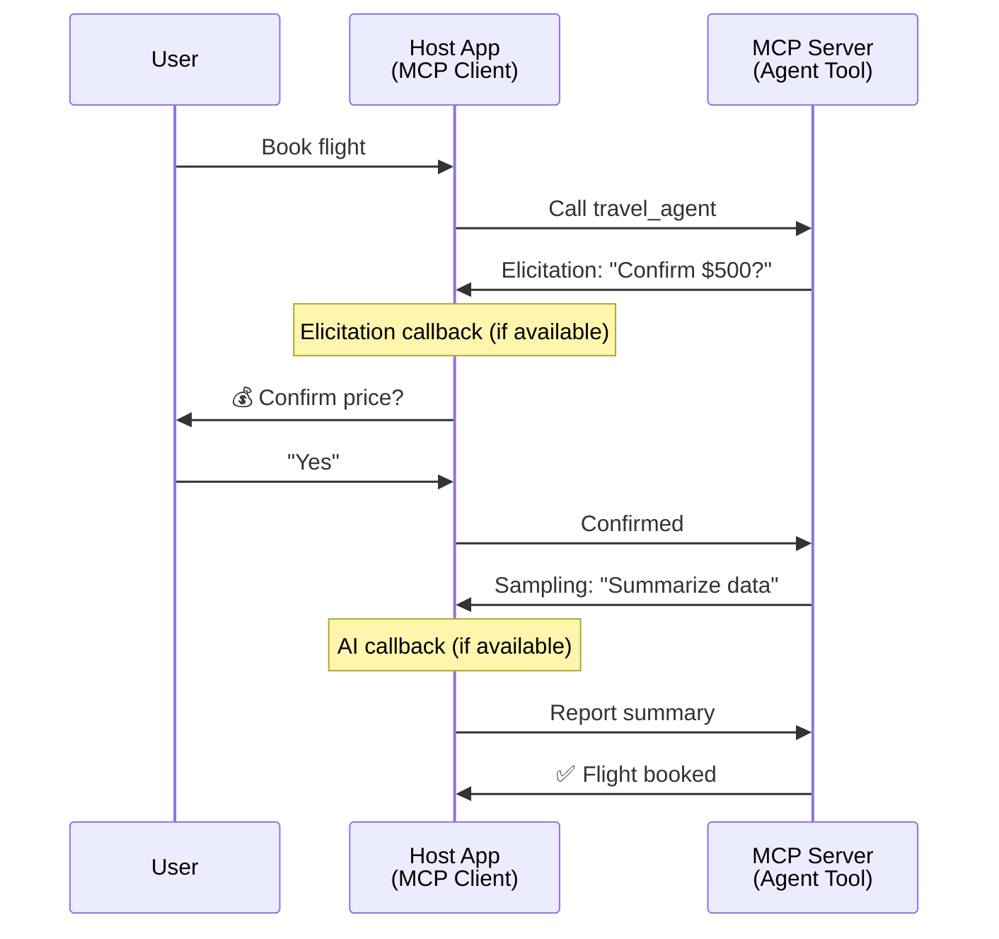
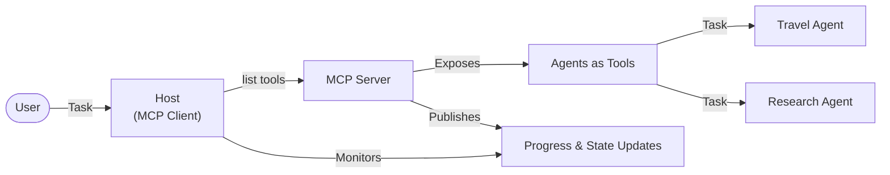

<!--
CO_OP_TRANSLATOR_METADATA:
{
  "original_hash": "5cc6836626047aa055e8960c8484a7d0",
  "translation_date": "2025-08-21T13:38:05+00:00",
  "source_file": "11-mcp/code_samples/mcp-agents/README.md",
  "language_code": "bg"
}
-->
# Създаване на системи за комуникация между агенти с MCP

> Накратко - Можете ли да изградите комуникация между агенти с MCP? Да!

MCP значително се разви отвъд първоначалната си цел „осигуряване на контекст за LLMs“. С последните подобрения, включително [възобновяеми потоци](https://modelcontextprotocol.io/docs/concepts/transports#resumability-and-redelivery), [елицитация](https://modelcontextprotocol.io/specification/2025-06-18/client/elicitation), [семплиране](https://modelcontextprotocol.io/specification/2025-06-18/client/sampling) и известия ([напредък](https://modelcontextprotocol.io/specification/2025-06-18/basic/utilities/progress) и [ресурси](https://modelcontextprotocol.io/specification/2025-06-18/schema#resourceupdatednotification)), MCP вече предоставя стабилна основа за изграждане на сложни системи за комуникация между агенти.

## Заблудата за агент/инструмент

С увеличаването на броя разработчици, които изследват инструменти с агентно поведение (работят за дълги периоди, може да изискват допълнителен вход по време на изпълнение и др.), често срещано погрешно схващане е, че MCP не е подходящ, главно защото ранните примери за неговия примитивен инструмент се фокусираха върху прости модели на заявка-отговор.

Това възприятие е остаряло. Спецификацията на MCP значително се подобри през последните месеци с възможности, които затварят пропастта за изграждане на дългосрочно агентно поведение:

- **Поточно предаване и частични резултати**: Актуализации в реално време за напредъка по време на изпълнение
- **Възобновяемост**: Клиентите могат да се свържат отново и да продължат след прекъсване
- **Устойчивост**: Резултатите оцеляват след рестартиране на сървъра (например чрез връзки към ресурси)
- **Многоходови взаимодействия**: Интерактивен вход по време на изпълнение чрез елицитация и семплиране

Тези функции могат да бъдат комбинирани за създаване на сложни агентни и мултиагентни приложения, всички внедрени върху MCP протокола.

За справка, ще наричаме агент „инструмент“, който е достъпен на MCP сървър. Това предполага наличието на хост приложение, което реализира MCP клиент, установява сесия със сървъра и може да извиква агента.

## Какво прави MCP инструмент „агентен“?

Преди да преминем към реализацията, нека установим какви инфраструктурни възможности са необходими за поддръжка на дългосрочни агенти.

> Ще дефинираме агент като субект, който може да работи автономно за продължителни периоди, способен да се справя със сложни задачи, които може да изискват множество взаимодействия или корекции въз основа на обратна връзка в реално време.

### 1. Поточно предаване и частични резултати

Традиционните модели на заявка-отговор не работят за дългосрочни задачи. Агенти трябва да предоставят:

- Актуализации за напредъка в реално време
- Междинни резултати

**Поддръжка от MCP**: Известията за актуализация на ресурси позволяват поточно предаване на частични резултати, въпреки че това изисква внимателен дизайн, за да се избегнат конфликти с модела 1:1 заявка/отговор на JSON-RPC.

| Функция                     | Пример за употреба                                                                                                                                                                       | Поддръжка от MCP                                                                          |
| --------------------------- | --------------------------------------------------------------------------------------------------------------------------------------------------------------------------------------- | ----------------------------------------------------------------------------------------- |
| Актуализации за напредъка   | Потребителят заявява задача за миграция на кодова база. Агентът предава напредъка: „10% - Анализиране на зависимости... 25% - Конвертиране на TypeScript файлове... 50% - Актуализиране на импорти...“ | ✅ Известия за напредък                                                                    |
| Частични резултати          | Задача „Генериране на книга“ предава частични резултати, напр. 1) Очертание на сюжетната линия, 2) Списък с глави, 3) Всяка глава, когато е завършена. Хостът може да инспектира, анулира или пренасочи на всеки етап. | ✅ Известията могат да бъдат „разширени“, за да включват частични резултати, вижте предложения в PR 383, 776 |

<div align="center" style="font-style: italic; font-size: 0.95em; margin-bottom: 0.5em;">
<strong>Фигура 1:</strong> Тази диаграма илюстрира как MCP агент предава актуализации за напредъка в реално време и частични резултати към хост приложението по време на дългосрочна задача, позволявайки на потребителя да следи изпълнението в реално време.
</div>



### 2. Възобновяемост

Агентите трябва да се справят с прекъсвания на мрежата безпроблемно:

- Свързване отново след прекъсване на клиента
- Продължаване от мястото, където са спрели (повторно изпращане на съобщения)

**Поддръжка от MCP**: MCP StreamableHTTP транспорт днес поддържа възобновяване на сесия и повторно изпращане на съобщения с идентификатори на сесии и идентификатори на последни събития. Важна бележка тук е, че сървърът трябва да реализира EventStore, който позволява повторно изпращане на събития при повторно свързване на клиента.  
Имайте предвид, че има предложение от общността (PR #975), което изследва транспортно-независими възобновяеми потоци.

| Функция       | Пример за употреба                                                                                                                                                   | Поддръжка от MCP                                                                |
| ------------- | -------------------------------------------------------------------------------------------------------------------------------------------------------------------- | -------------------------------------------------------------------------------- |
| Възобновяемост | Клиентът се прекъсва по време на дългосрочна задача. При повторно свързване сесията се възобновява с повторно изпратени пропуснати събития, продължавайки безпроблемно от мястото, където е спряла. | ✅ StreamableHTTP транспорт с идентификатори на сесии, повторно изпращане на събития и EventStore |

<div align="center" style="font-style: italic; font-size: 0.95em; margin-bottom: 0.5em;">
<strong>Фигура 2:</strong> Тази диаграма показва как StreamableHTTP транспортът и EventStore на MCP позволяват безпроблемно възобновяване на сесията: ако клиентът се прекъсне, той може да се свърже отново и да повтори пропуснатите събития, продължавайки задачата без загуба на напредък.
</div>



### 3. Устойчивост

Дългосрочните агенти се нуждаят от постоянна състояние:

- Резултатите оцеляват след рестартиране на сървъра
- Статусът може да бъде извлечен извън сесията
- Проследяване на напредъка между сесиите

**Поддръжка от MCP**: MCP вече поддържа тип връщане на връзка към ресурс за извиквания на инструменти. Днес възможен модел е да се проектира инструмент, който създава ресурс и веднага връща връзка към ресурс. Инструментът може да продължи да се занимава със задачата във фонов режим и да актуализира ресурса. От своя страна клиентът може да избере да проверява състоянието на този ресурс, за да получи частични или пълни резултати (въз основа на това какви актуализации на ресурса предоставя сървърът) или да се абонира за ресурса за известия за актуализация.

Едно ограничение тук е, че проверката на ресурси или абонирането за актуализации може да консумира ресурси с последствия при мащабиране. Има предложение от общността (включително #992), което изследва възможността за включване на уеб куки или тригери, които сървърът може да извика, за да уведоми клиента/хост приложението за актуализации.

| Функция     | Пример за употреба                                                                                                                                        | Поддръжка от MCP                                                        |
| ----------- | --------------------------------------------------------------------------------------------------------------------------------------------------------- | ----------------------------------------------------------------------- |
| Устойчивост | Сървърът се срива по време на задача за миграция на данни. Резултатите и напредъкът оцеляват след рестартиране, клиентът може да провери състоянието и да продължи от постоянен ресурс. | ✅ Връзки към ресурси с постоянна памет и известия за статус |

Днес често срещан модел е да се проектира инструмент, който създава ресурс и веднага връща връзка към ресурс. Инструментът може във фонов режим да се занимава със задачата, да издава известия за ресурси, които служат като актуализации за напредък или включват частични резултати, и да актуализира съдържанието в ресурса според нуждите.

<div align="center" style="font-style: italic; font-size: 0.95em; margin-bottom: 0.5em;">
<strong>Фигура 3:</strong> Тази диаграма демонстрира как MCP агентите използват постоянни ресурси и известия за статус, за да гарантират, че дългосрочните задачи оцеляват след рестартиране на сървъра, позволявайки на клиентите да проверяват напредъка и да извличат резултати дори след неуспехи.
</div>



### 4. Многоходови взаимодействия

Агентите често се нуждаят от допълнителен вход по време на изпълнение:

- Човешко уточнение или одобрение
- AI помощ за сложни решения
- Динамично регулиране на параметри

**Поддръжка от MCP**: Напълно поддържано чрез семплиране (за AI вход) и елицитация (за човешки вход).

| Функция                  | Пример за употреба                                                                                                                                     | Поддръжка от MCP                                           |
| ------------------------ | ----------------------------------------------------------------------------------------------------------------------------------------------------- | --------------------------------------------------------- |
| Многоходови взаимодействия | Агента за резервация на пътувания иска потвърждение за цена от потребителя, след това иска от AI да обобщи данните за пътуването преди да завърши транзакцията. | ✅ Елицитация за човешки вход, семплиране за AI вход |

<div align="center" style="font-style: italic; font-size: 0.95em; margin-bottom: 0.5em;">
<strong>Фигура 4:</strong> Тази диаграма показва как MCP агентите могат интерактивно да изискват човешки вход или да поискат AI помощ по време на изпълнение, поддържайки сложни, многоходови работни потоци като потвърждения и динамично вземане на решения.
</div>



## Реализиране на дългосрочни агенти с MCP - Преглед на кода

Като част от тази статия предоставяме [репозитория с код](https://github.com/victordibia/ai-tutorials/tree/main/MCP%20Agents), който съдържа пълна реализация на дългосрочни агенти, използвайки MCP Python SDK със StreamableHTTP транспорт за възобновяване на сесия и повторно изпращане на съобщения. Реализацията демонстрира как възможностите на MCP могат да бъдат комбинирани за създаване на сложни агентни поведения.

Специално реализираме сървър с два основни агентни инструмента:

- **Агент за пътувания** - Симулира услуга за резервация на пътувания с потвърждение на цена чрез елицитация
- **Агент за изследвания** - Извършва изследователски задачи с AI-асистирани обобщения чрез семплиране

И двата агента демонстрират актуализации за напредъка в реално време, интерактивни потвърждения и пълни възможности за възобновяване на сесия.

### Основни концепции за реализация

Следващите секции показват реализацията на сървърната страна на агента и обработката на хост клиента за всяка възможност:

#### Поточно предаване и актуализации за напредъка - Статус на задачата в реално време

Поточното предаване позволява на агентите да предоставят актуализации за напредъка в реално време по време на дългосрочни задачи, като информират потребителите за статуса на задачата и междинните резултати.

**Реализация на сървъра (агентът изпраща известия за напредък):**

```python
# From server/server.py - Travel agent sending progress updates
for i, step in enumerate(steps):
    await ctx.session.send_progress_notification(
        progress_token=ctx.request_id,
        progress=i * 25,
        total=100,
        message=step,
        related_request_id=str(ctx.request_id)
    )
    await anyio.sleep(2)  # Simulate work

# Alternative: Log messages for detailed step-by-step updates
await ctx.session.send_log_message(
    level="info",
    data=f"Processing step {current_step}/{steps} ({progress_percent}%)",
    logger="long_running_agent",
    related_request_id=ctx.request_id,
)
```

**Реализация на клиента (хостът получава актуализации за напредък):**

```python
# From client/client.py - Client handling real-time notifications
async def message_handler(message) -> None:
    if isinstance(message, types.ServerNotification):
        if isinstance(message.root, types.LoggingMessageNotification):
            console.print(f"📡 [dim]{message.root.params.data}[/dim]")
        elif isinstance(message.root, types.ProgressNotification):
            progress = message.root.params
            console.print(f"🔄 [yellow]{progress.message} ({progress.progress}/{progress.total})[/yellow]")

# Register message handler when creating session
async with ClientSession(
    read_stream, write_stream,
    message_handler=message_handler
) as session:
```

#### Елицитация - Искане за потребителски вход

Елицитацията позволява на агентите да изискват потребителски вход по време на изпълнение. Това е от съществено значение за потвърждения, уточнения или одобрения по време на дългосрочни задачи.

**Реализация на сървъра (агентът изисква потвърждение):**

```python
# From server/server.py - Travel agent requesting price confirmation
elicit_result = await ctx.session.elicit(
    message=f"Please confirm the estimated price of $1200 for your trip to {destination}",
    requestedSchema=PriceConfirmationSchema.model_json_schema(),
    related_request_id=ctx.request_id,
)

if elicit_result and elicit_result.action == "accept":
    # Continue with booking
    logger.info(f"User confirmed price: {elicit_result.content}")
elif elicit_result and elicit_result.action == "decline":
    # Cancel the booking
    booking_cancelled = True
```

**Реализация на клиента (хостът предоставя обратна връзка за елицитация):**

```python
# From client/client.py - Client handling elicitation requests
async def elicitation_callback(context, params):
    console.print(f"💬 Server is asking for confirmation:")
    console.print(f"   {params.message}")

    response = console.input("Do you accept? (y/n): ").strip().lower()

    if response in ['y', 'yes']:
        return types.ElicitResult(
            action="accept",
            content={"confirm": True, "notes": "Confirmed by user"}
        )
    else:
        return types.ElicitResult(
            action="decline",
            content={"confirm": False, "notes": "Declined by user"}
        )

# Register the callback when creating the session
async with ClientSession(
    read_stream, write_stream,
    elicitation_callback=elicitation_callback
) as session:
```

#### Семплиране - Искане за AI помощ

Семплирането позволява на агентите да изискват помощ от LLM за сложни решения или генериране на съдържание по време на изпълнение. Това позволява хибридни човешко-AI работни потоци.

**Реализация на сървъра (агентът изисква AI помощ):**

```python
# From server/server.py - Research agent requesting AI summary
sampling_result = await ctx.session.create_message(
    messages=[
        SamplingMessage(
            role="user",
            content=TextContent(type="text", text=f"Please summarize the key findings for research on: {topic}")
        )
    ],
    max_tokens=100,
    related_request_id=ctx.request_id,
)

if sampling_result and sampling_result.content:
    if sampling_result.content.type == "text":
        sampling_summary = sampling_result.content.text
        logger.info(f"Received sampling summary: {sampling_summary}")
```

**Реализация на клиента (хостът предоставя обратна връзка за семплиране):**

```python
# From client/client.py - Client handling sampling requests
async def sampling_callback(context, params):
    message_text = params.messages[0].content.text if params.messages else 'No message'
    console.print(f"🧠 Server requested sampling: {message_text}")

    # In a real application, this could call an LLM API
    # For demo purposes, we provide a mock response
    mock_response = "Based on current research, MCP has evolved significantly..."

    return types.CreateMessageResult(
        role="assistant",
        content=types.TextContent(type="text", text=mock_response),
        model="interactive-client",
        stopReason="endTurn"
    )

# Register the callback when creating the session
async with ClientSession(
    read_stream, write_stream,
    sampling_callback=sampling_callback,
    elicitation_callback=elicitation_callback
) as session:
```

#### Възобновяемост - Непрекъснатост на сесията при прекъсвания

Възобновяемостта гарантира, че дългосрочните задачи на агента могат да оцелеят при прекъсвания на клиента и да продължат безпроблемно при повторно свързване. Това се реализира чрез хранилища на събития и токени за възобновяване.

**Реализация на хранилище на събития (сървърът съхранява състоянието на сесията):**

```python
# From server/event_store.py - Simple in-memory event store
class SimpleEventStore(EventStore):
    def __init__(self):
        self._events: list[tuple[StreamId, EventId, JSONRPCMessage]] = []
        self._event_id_counter = 0

    async def store_event(self, stream_id: StreamId, message: JSONRPCMessage) -> EventId:
        """Store an event and return its ID."""
        self._event_id_counter += 1
        event_id = str(self._event_id_counter)
        self._events.append((stream_id, event_id, message))
        return event_id

    async def replay_events_after(self, last_event_id: EventId, send_callback: EventCallback) -> StreamId | None:
        """Replay events after the specified ID for resumption."""
        # Find events after the last known event and replay them
        for _, event_id, message in self._events[start_index:]:
            await send_callback(EventMessage(message, event_id))

# From server/server.py - Passing event store to session manager
def create_server_app(event_store: Optional[EventStore] = None) -> Starlette:
    server = ResumableServer()

    # Create session manager with event store for resumption
    session_manager = StreamableHTTPSessionManager(
        app=server,
        event_store=event_store,  # Event store enables session resumption
        json_response=False,
        security_settings=security_settings,
    )

    return Starlette(routes=[Mount("/mcp", app=session_manager.handle_request)])

# Usage: Initialize with event store
event_store = SimpleEventStore()
app = create_server_app(event_store)
```

**Метаданни на клиента с токен за възобновяване (клиентът се свързва отново, използвайки съхранено състояние):**

```python
# From client/client.py - Client resumption with metadata
if existing_tokens and existing_tokens.get("resumption_token"):
    # Use existing resumption token to continue where we left off
    metadata = ClientMessageMetadata(
        resumption_token=existing_tokens["resumption_token"],
    )
else:
    # Create callback to save resumption token when received
    def enhanced_callback(token: str):
        protocol_version = getattr(session, 'protocol_version', None)
        token_manager.save_tokens(session_id, token, protocol_version, command, args)

    metadata = ClientMessageMetadata(
        on_resumption_token_update=enhanced_callback,
    )

# Send request with resumption metadata
result = await session.send_request(
    types.ClientRequest(
        types.CallToolRequest(
            method="tools/call",
            params=types.CallToolRequestParams(name=command, arguments=args)
        )
    ),
    types.CallToolResult,
    metadata=metadata,
)
```

Хост приложението поддържа идентификатори на сесии и токени за възобновяване локално, позволявайки му да се свърже отново към съществуващи сесии без загуба на напредък или състояние.

### Организация на кода

<div align="center" style="font-style: italic; font-size: 0.95em; margin-bottom: 0.5em;">
<strong>Фигура 5:</strong> Архитектура на система за агенти, базирана на MCP
</div>



**Основни файлове:**

- **`server/server.py`** - MCP сървър с възможност за възобновяване, включващ агенти за пътувания и изследвания, които демонстрират елицитация, семплиране и актуализации за напредък
- **`client/client.py`** - Интерактивно хост приложение с поддръжка за възобновяване, обработка на обратни връзки и управление на токени
- **`server/event_store.py`** - Реализация на хранилище на събития, позволяващо възобновяване на сесия и повторно изпращане на съобщения

## Разширяване към комуникация между множество агенти с MCP

Горната реализация може да бъде разширена към системи с множество агенти чрез подобряване на интелигентността и обхвата на хост приложението:

- **Интел

**Отказ от отговорност**:  
Този документ е преведен с помощта на AI услуга за превод [Co-op Translator](https://github.com/Azure/co-op-translator). Въпреки че се стремим към точност, моля, имайте предвид, че автоматизираните преводи може да съдържат грешки или неточности. Оригиналният документ на неговия оригинален език трябва да се счита за авторитетен източник. За критична информация се препоръчва професионален човешки превод. Ние не носим отговорност за каквито и да е недоразумения или погрешни интерпретации, произтичащи от използването на този превод.