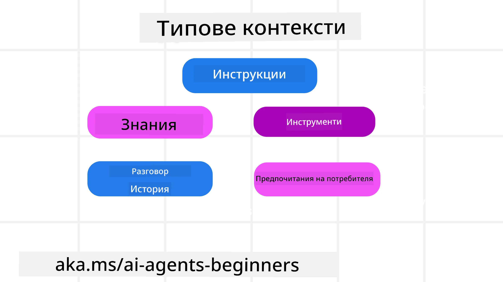
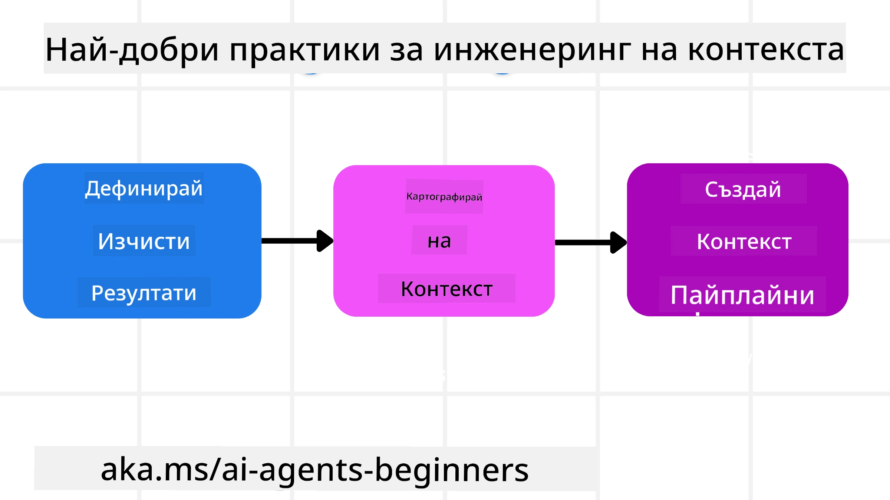

# Контекстно инженерство за AI агенти

> _(Кликнете върху изображението по-горе, за да гледате видеото на този урок)_

Разбирането на сложността на приложението, за което изграждате AI агент, е важно за създаването на надежден такъв. Трябва да изградим AI агенти, които ефективно управляват информацията, за да отговорят на сложни нужди, извън рамките на просто инженерство на подканата.

В този урок ще разгледаме какво е контекстно инженерство и ролята му в изграждането на AI агенти.

## Въведение

Този урок ще покрие:

• **Какво е контекстно инженерство** и защо се различава от инженерството на подканите.

• **Стратегии за ефективно контекстно инженерство**, включително как да пишем, селектираме, компресираме и изолираме информация.

• **Общи грешки с контекста**, които могат да саботират вашия AI агент, и как да ги поправите.

## Цели на обучението

След завършване на този урок, ще можете да разбирате как да:

• **Дефинирате контекстното инженерство** и да го разграничите от инженерството на подканите.

• **Идентифицирате ключовите компоненти на контекста** в приложения с големи езикови модели (LLM).

• **Прилагане на стратегии за писане, селектиране, компресиране и изолиране на контекст** за подобряване на изпълнението на агента.

• **Разпознавате чести грешки в контекста** като отравяне, разсейване, объркване и конфликт, и да прилагате техники за смекчаване.

## Какво е контекстно инженерство?

За AI агентите, контекстът е това, което движи планирането на AI агента да предприеме определени действия. Контекстното инженерство е практиката да се гарантира, че AI агентът има правилната информация, за да завърши следващата стъпка от задачата. Контекстният прозорец е ограничен по размер, затова като създатели на агенти трябва да изградим системи и процеси за управление на добавянето, премахването и кондензирането на информацията в този прозорец.

### Инженерство на подканите срещу контекстно инженерство

Инженерството на подканите се фокусира върху един набор от статични инструкции за ефективно насочване на AI агентите с определени правила. Контекстното инженерство е начинът за управление на динамичен набор от информация, включително първоначалната подканата, за да се гарантира, че AI агентът има нужното през времето. Основната идея на контекстното инженерство е да направи този процес повтаряем и надежден.

### Видове контекст

Важно е да запомним, че контекстът не е само едно нещо. Информацията, която AI агентът се нуждае, може да идва от различни източници и нашата задача е да осигурим достъп на агента до тези източници:

Видовете контекст, които AI агентът би трябвало да управлява, включват:

• **Инструкции:** Те са като "правилата" на агента – подканите, системните съобщения, малък брой примери (показващи на AI как да направи нещо) и описания на инструментите, които може да използва. Тук се съчетава фокусът на инженерството на подканите с контекстното инженерство.

• **Знания:** Това обхваща факти, информация, извлечена от бази данни, или дългосрочна памет, натрупана от агента. Включва интегриране на система за обогатяване чрез извличане (RAG), ако агентът се нуждае от достъп до различни хранилища на знания и бази данни.

• **Инструменти:** Това са дефиниции на външни функции, API и MCP сървъри, които агентът може да извиква, както и обратната връзка (резултатите), която получава при тяхното използване.

• **История на разговор:** Текущият диалог с потребителя. С времето тези разговори стават по-дълги и по-сложни, което означава, че заемата място в контекстния прозорец.

• **Потребителски предпочитания:** Информация, научена за вкусовете и антипатиите на потребителя с течение на времето. Тя може да се съхранява и използва при вземане на ключови решения в подкрепа на потребителя.

## Стратегии за ефективно контекстно инженерство

### Стратегии за планиране

Добро контекстно инженерство започва с добро планиране. Ето един подход, който ще ви помогне да започнете да мислите как да приложите концепцията на контекстното инженерство:

1. **Дефинирайте ясни резултати** – Резултатите от задачите, които AI агентите ще изпълняват, трябва да са ясно дефинирани. Отговорете на въпроса – "Как ще изглежда светът, когато AI агентът завърши задачата си?" С други думи, каква промяна, информация или отговор трябва да получи потребителят след взаимодействие с AI агента.
2. **Картографирайте контекста** – След като сте дефинирали резултатите, трябва да отговорите на въпроса: "Каква информация трябва да има AI агентът, за да изпълни тази задача?". Така можете да започнете да картографирате местата, където тази информация може да бъде намерена.
3. **Създайте контекстни потоци** – Сега, когато знаете къде е информацията, трябва да отговорите на въпроса: "Как агентът ще получава тази информация?". Това може да се осъществи по различни начини, включително RAG, използване на MCP сървъри и други инструменти.

### Практически стратегии

Планирането е важно, но след като информацията започне да навлиза в контекстния прозорец на нашия агент, трябва да имаме практически стратегии за управление:

#### Управление на контекста

Докато част от информацията автоматично ще бъде добавена в контекстния прозорец, контекстното инженерство се състои в по-активна роля при тази информация, което може да се направи чрез няколко стратегии:

 1. **Тефтер на агента**  
 Позволява на AI агента да записва бележки за релевантна информация относно текущите задачи и взаимодействия с потребителя в рамките на една сесия. Това трябва да съществува извън контекстния прозорец в файл или обект в изпълнението, който агентът може по-късно да извлече, ако е необходимо.

 2. **Памет**  
 Тефтерите са добри за управление на информация извън контекстния прозорец на една сесия. Паметите позволяват на агентите да съхраняват и извличат релевантна информация през множество сесии. Това може да включва резюмета, потребителски предпочитания и обратна връзка за подобрения в бъдеще.

 3. **Компресиране на контекст**  
 Когато контекстният прозорец расте и наближава своя лимит, могат да се използват техники като обобщаване и изрязване. Това включва или запазване само на най-важната информация, или премахване на по-старите съобщения.

 4. **Мултиагентни системи**  
 Разработването на мултиагентна система е форма на контекстно инженерство, защото всеки агент има свой собствен контекстен прозорец. Как този контекст се споделя и предава на различни агенти, е друго нещо, което трябва да се планира при създаването на тези системи.

 5. **Пясъчни среди (sandbox environments)**  
 Ако агент трябва да изпълни някакъв код или да обработи голямо количество информация в документ, това може да изисква много токени за обработка на резултатите. Вместо цялото това да се съхранява в контекстния прозорец, агентът може да използва пясъчна среда, която изпълнява кода и чете само резултатите и друга релевантна информация.

 6. **Обекти за състоянието по време на изпълнение (Runtime State Objects)**  
 Това се постига чрез създаване на контейнери с информация за управление на ситуации, когато агентът се нуждае от достъп до определена информация. За сложна задача това позволява на агента да съхранява резултатите от всяка подзадача стъпка по стъпка, позволявайки контекстът да остане свързан само с тази конкретна подзадача.

#### Проверка на контекста

След прилагане на една от тези стратегии, си заслужава да се провери какво всъщност е получил следващият обаждане към модела. Полезен въпрос за отстраняване на грешки е:

> Зареди ли агентът прекалено много контекст, грешен контекст или пропусна контекст, който му е бил необходим?

Не е нужно да записвате сурови подканващи текстове, изходи на инструменти или съдържание на паметта, за да отговорите на този въпрос. В продукция предпочитайте малки записи за проверка на контекста, които улавят броя, идентификаторите, хешовете и етикетите на политиките:

- **Селекция:** Следете колко кандидати блокове, инструменти или спомени са били разглеждани, колко са избрани и кое правило или оценка е довело до филтрирането на останалите.
- **Компресиране:** Записвайте източника, идентификатора на резюмето, приблизителния брой токени преди и след компресията, както и дали суровото съдържание е било изключено от следващото повикване.
- **Изолация:** Отбелязвайте коя подзадача е била изпълнена в отделен агент, сесия или пясъчна среда, какво ограничено резюме е върнато и дали големите изходи на инструменти са останали извън контекста на родителския агент.
- **Памет и RAG:** Съхранявайте идентификаторите на документи за извличане, идентификаторите на памет, оценки, селектирани идентификатори и статус на редактиране вместо пълния извлечен текст.
- **Сигурност и поверителност:** Предпочитайте хешове, идентификатори, кофички с токени и етикети на политики пред чувствителен подканващ текст, аргументи на инструменти, резултати от инструменти или съдържание на потребителската памет.

Целта не е да се съхранява повече контекст. Целта е да останат достатъчно доказателства, за да може разработчикът да разбере коя стратегия за контекст е използвана и дали тя е променила следващото повикване към модела по желания начин.

### Пример за контекстно инженерство

Нека кажем, че искаме AI агент да **"Резервира пътуване до Париж."**

• Прост агент, използващ само инженерство на подканите, може просто да отговори: **"Добре, кога бихте искали да отидете в Париж?"**. Той обработва само директния ви въпрос в момента, когато потребителят го зададе.

• Агент, използващ разгледаните стратегии за контекстно инженерство, ще направи много повече. Преди да отговори, неговата система може:

  ◦ **Да провери календара ви** за налични дати (извличане на реални данни).

 ◦ **Да припомни минали предпочитания за пътуване** (от дългосрочна памет), като предпочитаната авиокомпания, бюджет или дали предпочитате директни полети.

 ◦ **Да идентифицира наличните инструменти** за резервиране на полети и хотели.

- След това примерен отговор може да бъде:  "Здравей, [Твоето име]! Виждам, че си свободен през първата седмица на октомври. Да потърся ли директни полети до Париж с [Предпочитана авиокомпания] в рамките на обичайния ти бюджет от [Бюджет]?" Този по-богат, осведомен от контекста отговор демонстрира силата на контекстното инженерство.

## Общи грешки с контекста

### Контекстно отравяне

**Какво е:** Когато халюцинация (невярна информация, създадена от LLM) или грешка влезе в контекста и се цитира многократно, карайки агента да преследва невъзможни цели или да развие безсмислени стратегии.

**Какво да се направи:** Прилагайте **валидация на контекста** и **карантина**. Валидирайте информацията преди да бъде добавена към дългосрочната памет. Ако се засече потенциално отравяне, започнете нови нишки на контекста, за да предотвратите разпространяването на лошата информация.

**Пример за резервация на пътуване:** Вашият агент халюцинира съществуването на **директен полет от малко местно летище до далечен международен град**, който всъщност не предлага международни полети. Тази несъществуваща подробност за полета се запазва в контекста. По-късно, когато поискате от агента да резервира, той продължава да търси билети за този невъзможен маршрут, водейки до повторни грешки.

**Решение:** Прилагане на стъпка за **валидиране на съществуването на полети и маршрути чрез реално API** _преди_ да добавите подробността за полета към работния контекст на агента. Ако валидирането се провали, грешната информация се поставя в "карантина" и не се използва повече.

### Контекстно разсейване

**Какво е:** Когато контекстът стане толкова голям, че моделът се фокусира твърде много върху натрупаната история, вместо да използва наученото по време на обучението, което води до повтарящи се или неефективни действия. Моделите могат да започнат да допускат грешки дори преди контекстният прозорец да е пълен.

**Какво да се направи:** Използвайте **обобщаване на контекста**. Периодично компресирайте натрупаната информация в по-кратки обобщения, като запазвате важните детайли и премахвате повтарящите се части от историята. Това помага за "рестартиране" на фокуса.

**Пример за резервация на пътуване:** Обсъждали сте различни мечтани дестинации за пътуване дълго време, включително подробно разказване за пътуване с раница отпреди две години. Когато най-накрая поискате да **"ми намериш евтин полет за следващия месец",** агентът се заглъхва в старите, нерелевантни детайли и продължава да пита за вашето оборудване за пътуване с раница или миналите маршрути, пренебрегвайки текущата ви заявка.

**Решение:** След определен брой ходове или когато контекстът стане твърде голям, агентът трябва да **резюмира най-новите и релевантни части от разговора** – съсредоточавайки се върху текущите ви дати за пътуване и дестинация – и да използва това кондензирано обобщение за следващото повикване към LLM, изхвърляйки по-малко релевантния исторически чат.

### Контекстно объркване

**Какво е:** Когато ненужен контекст, често под формата на твърде много налични инструменти, кара моделa да генерира лоши отговори или да извиква нерелевантни инструменти. По-малките модели са особено уязвими.

**Какво да се направи:** Прилагайте **управление на натоварването на инструментите** с помощта на RAG техники. Съхранявайте описанията на инструментите във векторна база данни и селектирайте _само_ най-релевантните инструменти за всяка конкретна задача. Изследванията показват, че е добре да ограничите избора на инструменти до по-малко от 30.

**Пример за резервация на пътуване:** Вашият агент има достъп до десетки инструменти: `book_flight`, `book_hotel`, `rent_car`, `find_tours`, `currency_converter`, `weather_forecast`, `restaurant_reservations` и др. Вие питате: **"Какъв е най-добрият начин да се придвижвам в Париж?"** Поради огромния брой инструменти, агентът се обърква и опитва да извика `book_flight` _вътре_ в Париж, или `rent_car`, въпреки че предпочитате обществения транспорт, защото описанията на инструментите се припокриват или просто не може да определи най-добрия.

**Решение:** Използвайте **RAG върху описанията на инструментите**. Когато питате за придвижване в Париж, системата динамично извлича _само_ най-релевантните инструменти като `rent_car` или `public_transport_info` на базата на вашето запитване, представяйки фокусиран набор от инструменти на LLM.

### Контекстен конфликт

**Какво е:** Когато в контекста съществува противоречива информация, което води до непоследователно разсъждение или лоши крайни отговори. Това често се случва, когато информацията пристига на етапи, а ранните, неправилни предположения остават в контекста.

**Какво да се направи:** Използвайте **прореждане на контекста** и **отвеждане навън**. Прореждането означава премахване на остаряла или противоречива информация с пристигането на нови детайли. Отвеждането дава на модела отделно работно пространство ("тефтер"), в което да обработва информация без да замърсява основния контекст.
**Пример за резервация на пътуване:** Първоначално казвате на своя агент, **"Искам да пътувам в икономична класа."** По-късно в разговора променяте решението си и казвате, **"Всъщност за това пътуване, нека да изберем бизнес класа."** Ако и двете инструкции останат в контекста, агентът може да получи противоречиви резултати от търсенето или да се обърка коя предпочитание да приоритизира.

**Решение:** Прилагайте **изчистване на контекста**. Когато нова инструкция противоречи на стара, по-старата инструкция се премахва или изрично се отменя в контекста. Като алтернатива, агентът може да използва **бележник** за изясняване на конфликтуващите предпочитания, преди да вземе решение, като гарантира, че само крайната, последователна инструкция ръководи действията му.

## Имате ли още въпроси за инженеринг на контекст?

Присъединете се към [Microsoft Foundry Discord](https://aka.ms/ai-agents/discord), за да се срещнете с други учащи, да посетите консултативни часове и да получите отговори на въпросите си за AI агентите.

---

<!-- CO-OP TRANSLATOR DISCLAIMER START -->
**Отказ от отговорност**:
Този документ е преведен с помощта на AI преводачески услуга [Co-op Translator](https://github.com/Azure/co-op-translator). Въпреки че се стремим към точност, моля имайте предвид, че автоматизираните преводи могат да съдържат грешки или неточности. Оригиналният документ на неговия роден език трябва да се счита за авторитетен източник. За критична информация се препоръчва професионален човешки превод. Ние не носим отговорност за каквито и да е недоразумения или неправилни тълкувания, произтичащи от използването на този превод.
<!-- CO-OP TRANSLATOR DISCLAIMER END -->