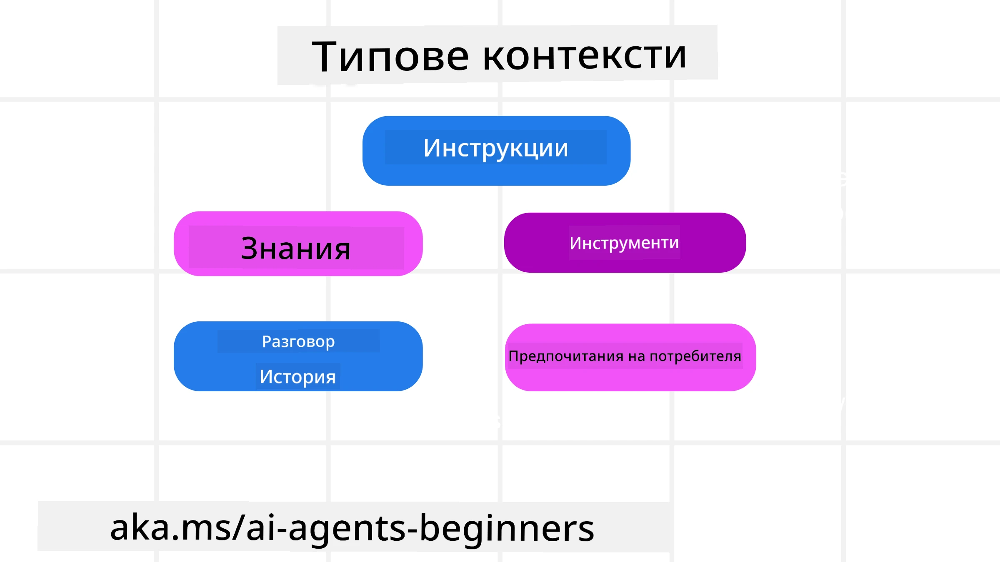
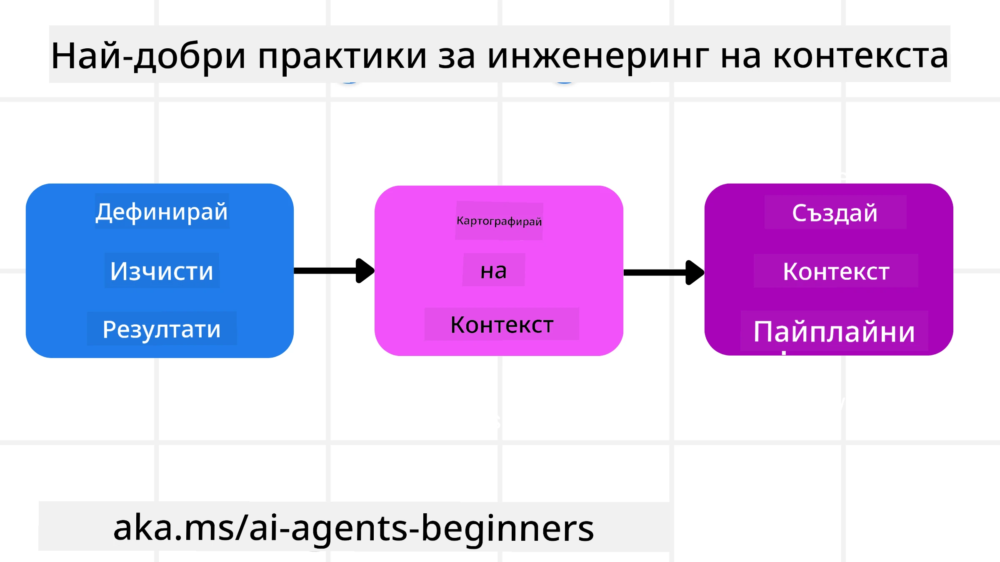

# Контекстно инженерство за AI агенти

> _(Кликнете върху изображението по-горе, за да гледате видеото на този урок)_

Разбирането на сложността на приложението, за което изграждате AI агент, е важно за създаването на надежден такъв. Трябва да създаваме AI агенти, които ефективно управляват информацията, за да адресират сложни нужди, надхвърлящи prompt engineering.

В този урок ще разгледаме какво е контекстното инженерство и каква е ролята му при изграждането на AI агенти.

## Въведение

Този урок ще обхване:

• **Какво е контекстно инженерство** и защо то се различава от prompt engineering.

• **Стратегии за ефективно контекстно инженерство**, включително как да пишем, избираме, компресираме и изолираме информация.

• **Чести грешки в контекста**, които могат да саботират вашия AI агент и как да ги поправите.

## Учебни цели

След завършване на този урок ще можете да:

• **Дефинирате контекстното инженерство** и да го разграничите от prompt engineering.

• **Идентифицирате ключовите компоненти на контекста** в приложения с Large Language Model (LLM).

• **Прилагате стратегии за писане, подбор, компресиране и изолиране на контекст**, за да подобрите изпълнението на агента.

• **Разпознавате чести контекстови грешки** като отравяне, разсейване, объркване и конфликт, и прилагате техники за смекчаване.

## Какво е Контекстно инженерство?

За AI агенти контекстът е това, което задвижва планирането на агента да предприеме определени действия. Контекстното инженерство е практиката да се гарантира, че AI агентът разполага с правилната информация, за да завърши следващата стъпка от задачата. Контекстната рамка е ограничена по размер, затова като създатели на агенти трябва да изграждаме системи и процеси за управление на добавянето, премахването и кондензирането на информацията в контекста.

### Prompt engineering срещу контекстно инженерство

Prompt engineering се фокусира върху един набор от статични инструкции за ефективно насочване на AI агентите с набор от правила. Контекстното инженерство е как да се управлява динамичен набор от информация, включително началния prompt, за да се гарантира, че AI агентът има необходимото във времето. Основната идея при контекстното инженерство е този процес да бъде повторяем и надежден.

### Видове контекст

Важно е да запомните, че контекстът не е само едно нещо. Информацията, която AI агентът се нуждае, може да идва от различни източници и е наша задача да осигурим достъп на агента до тези източници:

Видовете контекст, които AI агентът може да се наложи да управлява, включват:

• **Инструкции:** Те са като „правилата“ на агента – prompt-и, системни съобщения, few-shot примери (показващи на AI как да направи нещо) и описания на инструменти, които може да използва. Тук се срещат фокусите на prompt engineering и контекстното инженерство.

• **Знания:** Обхваща факти, информация, извлечена от бази данни, или дългосрочни спомени, които агентът е натрупал. Това включва интегриране на система Retrieval Augmented Generation (RAG), ако агентът трябва да има достъп до различни хранилища на знания и бази данни.

• **Инструменти:** Това са дефинициите на външни функции, API-та и MCP сървъри, които агентът може да извиква, заедно с обратната връзка (резултати), която получава от използването им.

• **История на разговора:** Продължаващият диалог с потребителя. С течение на времето тези разговори стават по-дълги и по-сложни, което означава, че заемат място в контекстната рамка.

• **Предпочитания на потребителя:** Информация, научена за предпочитания и антипатии на потребителя с времето. Те могат да се съхраняват и извикват при вземане на ключови решения за помощ на потребителя.

## Стратегии за ефективно контекстно инженерство

### Стратегии за планиране

Доброто контекстно инженерство започва с добро планиране. Ето един подход, който ще ви помогне да започнете да мислите как да приложите концепцията за контекстно инженерство:

1. **Определете ясни резултати** - Резултатите от задачите, които AI агентите ще изпълняват, трябва да бъдат ясно дефинирани. Отговорете на въпроса – „Как ще изглежда светът, когато AI агентът завърши задачата си?“ С други думи, каква промяна, информация или отговор трябва да има потребителят след взаимодействие с AI агента.
2. **Картографирайте контекста** - След като сте дефинирали резултатите, трябва да отговорите на въпроса „Каква информация е нужна на AI агента за изпълнението на тази задача?“. Така можете да започнете да картографирате къде може да се намира тази информация.
3. **Създайте контекстни потоци** - Сега когато знаете къде е информацията, трябва да отговорите на въпроса „Как агентът ще получи тази информация?“. Това може да стане по различни начини, включително с RAG, използване на MCP сървъри и други инструменти.

### Практически стратегии

Планирането е важно, но след като информацията започне да тече в контекстната рамка на нашия агент, трябва да имаме практически стратегии за управление:

#### Управление на контекста

Докато някои информации ще се добавят автоматично в контекстната рамка, контекстното инженерство е за по-активна роля в тази информация, която може да се реализира чрез няколко стратегии:

 1. **Бележник на агента**
 Това позволява на AI агента да води бележки за релевантна информация относно текущите задачи и взаимодействия с потребителя по време на една сесия. Това трябва да съществува извън контекстната рамка в файл или обект по време на изпълнение, който агентът може да извлече по-късно, ако е необходимо.

 2. **Спомени**
 Бележниците са добри за управление на информация извън контекстната рамка на една сесия. Спомените позволяват на агентите да съхраняват и извличат релевантна информация през множество сесии. Това може да включва обобщения, потребителски предпочитания и обратна връзка за бъдещи подобрения.

 3. **Компресиране на контекста**
  След като контекстната рамка се разраства и се доближава до лимита си, могат да се използват техники като обобщаване и съкращаване. Това включва или запазване само на най-релевантната информация, или премахване на по-старите съобщения.
  
 4. **Мултиагентни системи**
  Развиването на мултиагентни системи е форма на контекстно инженерство, защото всеки агент има своя контекстна рамка. Как този контекст се споделя и предава на различни агенти е друга точка за планиране при изграждането на тези системи.
  
 5. **Пясъчни среди**
  Ако агент трябва да изпълни код или да обработи големи количества информация в документ, това може да отнеме голям брой токени за обработка на резултатите. Вместо всичко това да се съхранява в контекстната рамка, агентът може да използва пясъчна среда, която може да изпълни кода и да чете само резултатите и друга релевантна информация.
  
 6. **Обекти за състояние по време на изпълнение**
   Това се прави чрез създаване на контейнери с информация, за да се управляват ситуации, когато агентът трябва да има достъп до определена информация. За сложна задача това би позволило на агента да съхранява резултатите от всяка подзадача стъпка по стъпка, като същевременно контекстът остава свързан само с тази конкретна подзадача.

#### Проверка на контекста

След прилагане на една от тези стратегии, полезно е да се провери какво всъщност получи следващото извикване на модела. Един полезен въпрос за дебъгване е:

> Зареди ли агентът твърде много контекст, грешен контекст или пропусна необходимия контекст?

Не е нужно да логвате сурови prompt-и, изходни данни от инструменти или съдържание на спомени, за да отговорите на този въпрос. В продукция предпочитайте малки записи за проверка на контекста, които улавят брой, идентификатори, хешове и етикети на политики:

- **Подбор:** Проследете колко кандидат-сегменти, инструменти или спомени са разглеждани, колко са избрани и кое правило или резултат е причинил филтрирането на останалите.
- **Компресия:** Записвайте източника или трасиращия идентификатор, идентификатор на обобщението, приблизителния брой токени преди и след компресията, и дали суровото съдържание е изключено от следващото извикване.
- **Изолация:** Забележете коя подзадача е изпълнена в отделен агент, сесия или пясъчна среда, какво ограничено обобщение е върнато и дали големи изходи от инструменти са останали извън контекста на родителския агент.
- **Памет и RAG:** Съхранявайте идентификатори на извлечени документи, идентификатори на памет, оценки, избрани идентификатори и статус на редакция вместо пълния извлечен текст.
- **Сигурност и поверителност:** Предпочитайте хешове, идентификатори, токенови ограничители и етикети на политики пред чувствителни текстове от prompt-и, аргументи на инструменти, резултати от инструменти или тела на потребителски спомени.

Целта не е да се съхранява повече контекст. Целта е да се остави достатъчно доказателство, че разработчик може да определи коя контекстна стратегия е работила и дали е променила следващото извикване на модела по предвидения начин.

### Пример за контекстно инженерство

Да кажем, че искаме AI агент да **"Резервира пътуване до Париж."**

• Един прост агент, използващ само prompt engineering, може просто да отговори: **„Добре, кога бихте искали да отидете в Париж?“** Той обработва само директния ви въпрос към момента, в който го задавате.

• Агент, използващ стратегията за контекстно инженерство, разгледана по-горе, би направил много повече. Преди дори да отговори, неговата система може да:

  ◦ **Провери календара ви** за налични дати (извличане на данни в реално време).

 ◦ **Припомни минали предпочитания за пътувания** (от дългосрочна памет) като предпочитана авиокомпания, бюджет или дали предпочитате директни полети.

 ◦ **Идентифицира налични инструменти** за резервация на полети и хотели.

- Тогава примерен отговор би бил: „Здрасти [Твоето име]! Виждам, че си свободен през първата седмица на октомври. Да потърся ли директни полети до Париж с [Предпочитана авиокомпания] в рамките на твоя обичаен бюджет от [Бюджет]?“. Този по-богат отговор, осъзнаващ контекста, демонстрира силата на контекстното инженерство.

## Чести грешки в контекста

### Отравяне на контекста

**Какво представлява:** Когато халюцинация (фалшива информация, генерирана от LLM) или грешка влезе в контекста и се препраща многократно, карайки агента да преследва невъзможни цели или да развива нелепи стратегии.

**Какво да направите:** Прилагайте **валидация на контекста** и **карантина**. Валидирайте информацията преди да бъде добавена в дългосрочната памет. Ако се открие потенциално отравяне, започнете нови нишки на контекста, за да предотвратите разпространението на лошата информация.

**Пример с резервация на пътуване:** Вашият агент халюцинира съществуването на **директен полет от малко местно летище до далечен международен град**, който реално не предлага международни полети. Тази несъществуваща информация се записва в контекста. По-късно, когато поискате резервиране, агентът продължава да търси билети за невъзможния маршрут, което води до повторни грешки.

**Решение:** Изпълнете стъпка за **валидация на съществуването на полети и маршрути с API в реално време** _преди_ добавянето на детайла за полета в работния контекст на агента. Ако валидацията не успее, грешната информация се поставя в „карантина“ и не се използва повече.

### Разсейване на контекста

**Какво представлява:** Когато контекстът стане твърде голям, моделът се фокусира твърде много върху натрупаната история, вместо да използва наученото по време на обучението, водейки до повтарящи се или безполезни действия. Моделите могат да започнат да грешат дори преди контекстната рамка да е пълна.

**Какво да направите:** Използвайте **обобщаване на контекста**. Периодично компресирайте натрупаната информация в по-кратки резюмета, запазвайки важните детайли и премахвайки излишната история. Това помага да се „рестартира“ фокусът.

**Пример с резервация на пътуване:** Обсъждали сте различни мечтани дестинации за пътуване дълго време, включително подробен разказ за раницарско пътуване отпреди две години. Когато най-сетне поискате **„намери ми евтин полет за следващия месец“**, агентът се задръства с остарялата, нерелевантна информация и продължава да пита за вашето раницарско оборудване или минали маршрути, пренебрегвайки настоящата молба.

**Решение:** След определен брой ходове или когато контекстът стане твърде голям, агентът трябва да **обобщи най-новите и релевантни части от разговора** – съсредоточавайки се върху текущите дати и дестинация за пътуване – и да използва това резюме за следващия LLM повикване, като изхвърля по-малко релевантния исторически чат.

### Объркване на контекста

**Какво представлява:** Когато излишният контекст, често под формата на твърде много налични инструменти, кара модела да генерира лоши отговори или да извиква нерелевантни инструменти. По-малките модели са особено уязвими към това.

**Какво да направите:** Прилагайте **управление на натоварването на инструментите** с техники RAG. Съхранявайте описанията на инструментите в векторна база данни и избирайте _само_ най-релевантните инструменти за всяка конкретна задача. Проучванията показват, че е добре селекцията на инструменти да бъде по-малка от 30.

**Пример с резервация на пътуване:** Вашият агент има достъп до десетки инструменти: `book_flight`, `book_hotel`, `rent_car`, `find_tours`, `currency_converter`, `weather_forecast`, `restaurant_reservations` и др. Вие питате: **"Кой е най-добрият начин да се придвижвам из Париж?"** Поради големия брой инструменти, агентът се обърква и се опитва да извика `book_flight` _вътре_ в Париж или `rent_car`, макар че предпочитате обществен транспорт, защото описанията на инструментите може да се припокриват или просто не може да избере най-добрия.

**Решение:** Използвайте **RAG върху описанията на инструментите**. Когато питате за придвижване из Париж, системата динамично извлича _само_ най-релевантните инструменти като `rent_car` или `public_transport_info` въз основа на вашия въпрос, предоставяйки фокусиран „набор от инструменти“ за LLM.

### Конфликт в контекста

**Какво представлява:** Когато в контекста съществува противоречива информация, която води до непоследователно заключение или лоши крайни отговори. Това често се случва, когато информацията пристига на етапи и ранните, неправилни предположения остават в контекста.

**Какво да направите:** Използвайте **подрязване на контекста** и **изнасяне на данни**. Подрязването означава премахване на остаряла или противоречива информация при пристигане на нови детайли. Изнасянето дава на модела отделно „бележник“ за обработка на информация без да замърсява основния контекст.

**Пример за резервация на пътуване:** Първоначално казвате на вашия агент, **"Искам да летя в икономична класа."** По-късно в разговора променяте решението си и казвате, **"Всъщност, за това пътуване, нека да летим в бизнес класа."** Ако и двете инструкции останат в контекста, агентът може да получи противоречиви резултати от търсенето или да се обърка коя предпочитание да приоритизира.

**Решение:** Изпълнете **изчистване на контекста**. Когато нова инструкция противоречи на старата, по-старата инструкция се премахва или изрично се отменя в контекста. Като алтернатива, агентът може да използва **чернова**, за да съгласува конфликтните предпочитания преди да вземе решение, като се гарантира, че само крайната, последователна инструкция ръководи действията му.

## Имаш ли още въпроси относно инженеринг на контекста?

Присъедини се към [Microsoft Foundry Discord](https://discord.com/invite/ATgtXmAS5D), за да се срещнеш с други обучаващи се, да посетиш работни часове и да получиш отговори на въпросите си за AI агенти.

---

<!-- CO-OP TRANSLATOR DISCLAIMER START -->
**Отказ от отговорност**:
Този документ е преведен с помощта на AI преводачески услуга [Co-op Translator](https://github.com/Azure/co-op-translator). Въпреки че се стремим към точност, моля имайте предвид, че автоматизираните преводи могат да съдържат грешки или неточности. Оригиналният документ на неговия роден език трябва да се счита за авторитетен източник. За критична информация се препоръчва професионален човешки превод. Ние не носим отговорност за каквито и да е недоразумения или неправилни тълкувания, произтичащи от използването на този превод.
<!-- CO-OP TRANSLATOR DISCLAIMER END -->