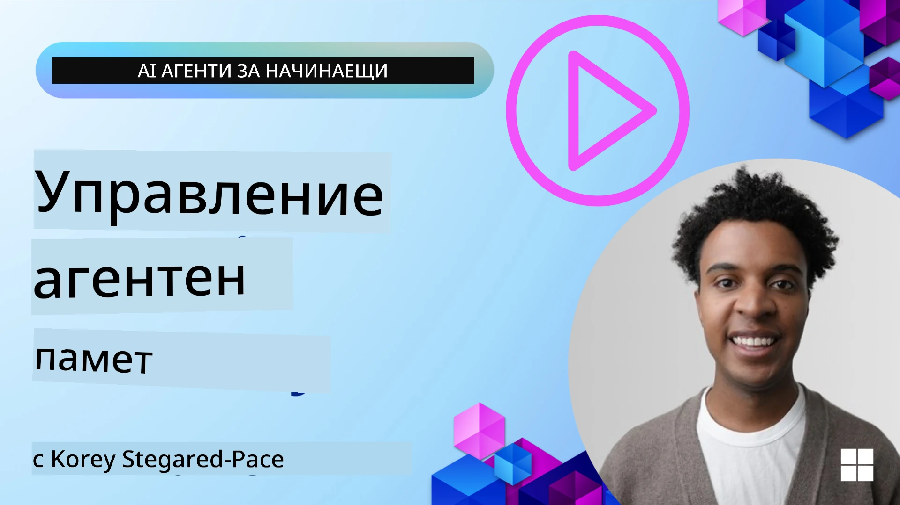

# Памет за AI агенти 

Когато се обсъждат уникалните предимства от създаването на AI агенти, главно се говорят две неща: възможността да се извикват инструменти за изпълнение на задачи и възможността да се подобряват с времето. Паметта е в основата на създаването на самоусъвършенстващ се агент, който може да създава по-добро преживяване за нашите потребители.

В този урок ще разгледаме какво е памет за AI агенти и как можем да я управляваме и използваме в полза на нашите приложения.

## Въведение

Този урок ще обхване:

• **Разбиране на паметта за AI агенти**: Какво представлява паметта и защо е от съществено значение за агентите.

• **Реализиране и съхранение на паметта**: Практически методи за добавяне на паметни възможности към вашите AI агенти, с фокус върху краткосрочната и дългосрочната памет.

• **Правене на AI агентите самоусъвършенстващи се**: Как паметта позволява на агентите да учат от минали взаимодействия и да се подобряват с течение на времето.

## Налични реализации

Този урок включва два подробни тетрадни урока:

• **[13-agent-memory.ipynb](./13-agent-memory.ipynb)**: Реализира памет чрез Mem0 и Azure AI Search с Microsoft Agent Framework

• **[13-agent-memory-cognee.ipynb](./13-agent-memory-cognee.ipynb)**: Реализира структурирана памет чрез Cognee, автоматично изграждаща граф на знания, поддържан от embeddings, визуализиране на графа и интелигентно извличане

## Цели на обучението

След завършване на този урок, ще знаете как да:

• **Различавате различни типове памет на AI агенти**, включително работна, краткосрочна и дългосрочна памет, както и специализирани форми като памет за персона и епизодична памет.

• **Реализирате и управлявате краткосрочна и дългосрочна памет за AI агенти** с помощта на Microsoft Agent Framework, използвайки инструменти като Mem0, Cognee, Whiteboard памет и интеграция с Azure AI Search.

• **Разберете принципите зад самоусъвършенстващите се AI агенти** и как системите за управление на паметта допринасят за непрекъснато обучение и адаптация.

## Разбиране на паметта за AI агенти

В основата си, **паметта за AI агенти се отнася до механизмите, които им позволяват да задържат и възстановяват информация**. Тази информация може да бъдат специфични детайли за разговор, предпочитания на потребителя, минали действия или дори научени модели.

Без памет, AI приложенията често са безсъдържателни (stateless), което означава, че всяко взаимодействие започва от нулата. Това води до повтарящо се и разочароващо потребителско изживяване, при което агентът "забравя" предишния контекст или предпочитания.

### Защо паметта е важна?

интелигентността на един агент е дълбоко свързана със способността му да възстановява и използва минала информация. Паметта позволява на агентите да бъдат:

• **Рефлексивни**: Учейки се от минали действия и резултати.

• **Интерактивни**: Поддържайки контекст в продължаващ разговор.

• **Проактивни и реактивни**: Предвиждайки нужди или реагирайки адекватно въз основа на исторически данни.

• **Автономни**: Действайки по-независимо чрез използване на запаметени знания.

Целта при въвеждането на памет е да се направят агентите по **надеждни и способни**.

### Видове памет

#### Работна памет

Мислете за това като за бележка, която агентът използва по време на една текуща задача или мисловен процес. Тя държи непосредствената информация, необходима за изчисляване на следващата стъпка.

За AI агентите работната памет често улавя най-релевантната информация от разговора, дори ако целият чат е дълъг или отрязан. Тя се фокусира върху извличането на ключови елементи като изисквания, предложения, решения и действия.

**Пример за работна памет**

При агент за резервиране на пътувания, работната памет може да запамети текущото искане на потребителя, като "Искам да резервирам пътуване до Париж". Това конкретно изискване се държи в непосредствения контекст на агента, за да насочи текущото взаимодействие.

#### Краткосрочна памет

Този тип памет запазва информация за продължителността на един разговор или сесия. Това е контекстът на текущия чат, който позволява на агента да се позове на предишни ходове в диалога.

**Пример за краткосрочна памет**

Ако потребителят попита "Колко ще струва полет до Париж?" и след това последва с "А какво да кажем за настаняването там?", краткосрочната памет гарантира, че агентът знае, че "там" се отнася до "Париж" в рамките на същия разговор.

#### Дългосрочна памет

Това са данни, които се запазват през множество разговори или сесии. Тя позволява на агентите да помнят потребителски предпочитания, исторически взаимодействия или общи знания за продължителни периоди. Това е важно за персонализация.

**Пример за дългосрочна памет**

Дългосрочна памет може да съхрани, че "Бен обича ски и дейности на открито, харесва кафе с планинска гледка и иска да избягва напреднали ски писти поради предишна травма". Тази информация, научена от предишни взаимодействия, влияе на препоръките в бъдещи сесии за планиране на пътувания, правейки ги силно персонализирани.

#### Памет за персона

Този специализиран тип памет помага на агента да развие последователна "личност" или "персона". Тя позволява на агента да помни детайли за себе си или за предназначената си роля, правейки взаимодействията по-плавни и фокусирани.

**Пример за памет за персона**
Ако туристическият агент е проектиран да бъде "експерт по ски планиране", паметта за персона може да подсили тази роля, като влияе на отговорите му да съответстват на тона и знанията на експерт.

#### Работен процес/Епизодична памет

Тази памет съхранява последователността от стъпки, които агентът предприема по време на сложна задача, включително успехи и неуспехи. Това е като запомняне на конкретни "епизоди" или минали преживявания, за да се учи от тях.

**Пример за епизодична памет**

Ако агентът е опитал да резервира конкретен полет, но това е неуспешно поради липса на наличност, епизодичната памет може да запише тази грешка, позволявайки на агента да опита алтернативни полети или да информира потребителя за проблема по по-информиран начин при следващ опит.

#### Памет за ентитети

Това включва извличане и запомняне на специфични ентитети (като хора, места или неща) и събития от разговорите. Това позволява на агента да изгради структуриран поглед върху ключовите елементи, обсъждани.

**Пример за памет за ентитети**

От разговор за предишно пътуване агентът може да извлече "Париж", "Ейфеловата кула" и "вечеря в ресторант Le Chat Noir" като ентитети. В бъдещо взаимодействие агентът може да си спомни "Le Chat Noir" и да предложи да направи нова резервация там.

#### Структуриран RAG (Retrieval Augmented Generation)

Докато RAG е по-широка техника, "Структуриран RAG" е подчертана като мощна паметна технология. Тя извлича плътна, структурирана информация от различни източници (разговори, имейли, изображения) и я използва за подобряване на прецизността, пълнотата и скоростта на отговорите. За разлика от класическия RAG, който разчита единствено на семантична прилика, Структуриран RAG работи с вградената структура на информацията.

**Пример за структуриран RAG**

Вместо просто да съпоставя ключови думи, Структуриран RAG може да парсне детайли за полет (дестинация, дата, час, авиокомпания) от имейл и да ги съхрани по структуриран начин. Това позволява прецизни заявки като "Какъв полет резервирах до Париж във вторник?"

## Реализиране и съхранение на памет

Реализирането на памет за AI агенти включва систематичен процес на **управление на паметта**, който включва генериране, съхранение, извличане, интегриране, обновяване и дори "забравяне" (или изтриване) на информация. Извличането е особено критичен аспект.

### Специализирани инструменти за памет

#### Mem0

Един от начините за съхранение и управление на паметта на агентите е използването на специализирани инструменти като Mem0. Mem0 работи като постоянен слой за памет, позволяващ на агентите да си припомнят релевантни взаимодействия, да съхраняват потребителски предпочитания и фактически контекст и да се учат от успехи и неуспехи с течение на времето. Идеята тук е безсърдечните (stateless) агенти да се превърнат в състояниеви (stateful).

Той работи чрез **двуфазов конвейер за памет: извличане и обновяване**. Първо, съобщения, добавени към нишката на агента, се изпращат към услугата Mem0, която използва голям езиков модел (LLM), за да обобщи историята на разговора и да извлече нови спомени. След това фаза, управлявана от LLM, определя дали да добави, промени или изтрие тези спомени, съхранявайки ги в хибридно хранилище, което може да включва векторни, графови и ключ-стойност бази данни. Тази система също така поддържа различни типове памет и може да включва графова памет за управление на връзките между ентитетите.

#### Cognee

Друг мощен подход е използването на **Cognee**, отворен код за семантична памет за AI агенти, който трансформира структурирани и неструктурирани данни в заявими графове на знания, поддържани от embeddings. Cognee предоставя **двойна архитектура за съхранение**, комбинираща векторно търсене по сходство с графови връзки, позволявайки на агентите да разбират не само каква информация е сходна, но и как концепциите са свързани помежду си.

Той е отличен в **хибридно извличане**, което съчетава векторна прилика, графова структура и LLM разсъждение — от директно търсене на парчета до отговаряне на въпроси с оглед на графа. Системата поддържа **жива памет**, която се развива и расте, като остава заявима като един свързан граф, поддържайки както краткосрочен сесионен контекст, така и дългосрочна постоянна памет.

Учебната тетрадка за Cognee ([13-agent-memory-cognee.ipynb](./13-agent-memory-cognee.ipynb)) демонстрира изграждането на този единен слой за памет, с практически примери за вкарване на разнообразни източници на данни, визуализиране на графа на знанията и заявяване с различни стратегии за търсене, пригодени към нуждите на конкретен агент.

### Съхранение на памет с RAG

Освен специализираните инструменти за памет като Mem0, можете да използвате мощни услуги за търсене като **Azure AI Search като бекенд за съхранение и извличане на спомени**, особено за структуриран RAG.

Това ви позволява да обосновете отговорите на агента си с ваши собствени данни, гарантирайки по-релевантни и точни отговори. Azure AI Search може да се използва за съхраняване на потребителски спомени за пътувания, продуктови каталози или каквото и да е друго домейн-специфично знание.

Azure AI Search поддържа възможности като **Структуриран RAG**, който е отличен в извличането и възстановяването на плътна, структурирана информация от големи набори данни като история на разговори, имейли или дори изображения. Това осигурява "свръхчовешка точност и пълнота" в сравнение с традиционните подходи за разчленяване на текст и embeddings.

## Правене на AI агентите самоусъвършенстващи се

Често срещан модел за самоусъвършенстващи се агенти включва въвеждането на **"агент за знания"**. Този отделен агент наблюдава основния разговор между потребителя и основния агент. Неговата роля е да:

1. **Идентифицира ценна информация**: Определи дали някоя част от разговора си струва да бъде запазена като общо знание или като специфично потребителско предпочитание.

2. **Извлече и обобщи**: Дестилира същественото знание или предпочитание от разговора.

3. **Съхрани в база знания**: Записва тази извлечена информация, често във векторна база данни, за да може да бъде извлечена по-късно.

4. **Допълни бъдещи заявки**: Когато потребителят започне нова заявка, агентът за знания извлича релевантна запазена информация и я прилага към подканата на потребителя, предоставяйки критичен контекст на основния агент (подобно на RAG).

### Оптимизации за памет

• **Управление на латентността**: За да се избегне забавяне на взаимодействията с потребителя, може да се използва по-евтин, по-бърз модел първоначално, за бърза проверка дали дадена информация е полезна за запазване или извличане, като по-сложният процес на извличане/екстракция се извиква само когато е необходимо.

• **Поддръжка на базата знания**: За разрастваща се база знания, по-рядко използвана информация може да бъде преместена в "студено съхранение", за да се управляват разходите.

## Имате ли още въпроси за паметта на агентите?

Присъединете се към [Microsoft Foundry Discord](https://aka.ms/ai-agents/discord) за да се срещнете с други учащи се, да посетите офис часове и да получите отговори на въпросите си за AI агенти.

---

<!-- CO-OP TRANSLATOR DISCLAIMER START -->
**Отказ от отговорност**:
Този документ е преведен с помощта на услуга за автоматичен превод с изкуствен интелект [Co-op Translator](https://github.com/Azure/co-op-translator). Въпреки че се стремим към точност, имайте предвид, че автоматичните преводи могат да съдържат грешки или неточности. Оригиналният документ на оригиналния език трябва да се счита за авторитетен източник. За критична информация се препоръчва професионален човешки превод. Не носим отговорност за каквито и да е недоразумения или неправилни тълкувания, произтичащи от използването на този превод.
<!-- CO-OP TRANSLATOR DISCLAIMER END -->