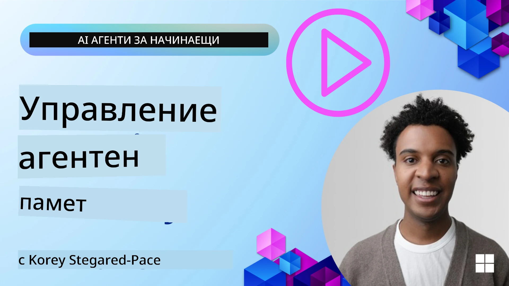

# Памет за AI агенти

Когато се обсъждат уникалните предимства на създаването на AI агенти, основно се говори за две неща: способността да използват инструменти за изпълнение на задачи и способността да се подобряват с времето. Паметта е в основата на създаването на самоусъвършенстващ се агент, който може да създава по-добри преживявания за нашите потребители.

В този урок ще разгледаме какво представлява паметта за AI агенти и как можем да я управляваме и използваме в полза на нашите приложения.

## Въведение

В този урок ще разгледаме:

• **Разбиране на паметта при AI агенти**: Какво е паметта и защо е важна за агентите.

• **Прилагане и съхранение на паметта**: Практически методи за добавяне на паметни възможности към вашите AI агенти, съсредоточени върху краткосрочната и дългосрочната памет.

• **Правене на AI агенти, които се самоусъвършенстват**: Как паметта позволява на агентите да се учат от минали взаимодействия и да се подобряват с времето.

## Налични имплементации

Този урок включва два изчерпателни учебни бележника:

• **[13-agent-memory.ipynb](./13-agent-memory.ipynb)**: Прилага памет с Mem0 и Azure AI Search чрез Microsoft Agent Framework

• **[13-agent-memory-cognee.ipynb](./13-agent-memory-cognee.ipynb)**: Прилага структурирана памет с Cognee, автоматично изграждаща граф на знания, базиран на embeddings, визуализиращ графа и интелигентно извличане

## Цели на обучението

След завършване на този урок ще знаете как да:

• **Правите разлика между различните видове памет при AI агенти**, включително работна, краткосрочна и дългосрочна памет, както и специализирани форми като персона и епизодична памет.

• **Прилагате и управлявате краткосрочна и дългосрочна памет за AI агенти** с помощта на Microsoft Agent Framework, използвайки инструменти като Mem0, Cognee, Whiteboard памет и интеграция с Azure AI Search.

• **Разбирате принципите зад самоусъвършенстващите се AI агенти** и как надеждните системи за управление на паметта допринасят за непрекъснато обучение и адаптация.

## Разбиране на паметта за AI агенти

В същността си, **паметта за AI агенти се отнася до механизмите, които им позволяват да задържат и припомнят информация**. Тази информация може да са специфични детайли за разговор, потребителски предпочитания, минали действия или дори научени модели.

Без памет, AI приложенията често са безсъстояния, което означава, че всяко взаимодействие започва отначало. Това води до повтарящо се и разочароващо потребителско преживяване, при което агентът "забравя" предходния контекст или предпочитания.

### Защо е важна паметта?

интелигентността на агента е дълбоко свързана с неговата способност да припомня и използва минала информация. Паметта позволява на агентите да бъдат:

• **Рефлексивни**: Учат се от минали действия и резултати.

• **Интерактивни**: Поддържат контекст в продължителен разговор.

• **Проактивни и реактивни**: Предвиждат нуждите или реагират уместно според историческите данни.

• **Автономни**: Работят по-независимо, опирайки се на съхранени знания.

Целта на прилагането на памет е да направи агентите по-**надеждни и способни**.

### Видове памет

#### Работна памет

Мислете за нея като за лист хартия, който агентът използва по време на текуща задача или мисловен процес. Тя държи непосредствено необходимата информация за изчисляване на следващата стъпка.

За AI агенти, работната памет често улавя най-релевантната информация от разговор, дори когато цялата история на чата е дълга или съкратена. Тя се фокусира върху извличане на ключови елементи като изисквания, предложения, решения и действия.

**Пример за работна памет**

При агент за резервация на пътувания, работната памет може да улавя текущото запитване на потребителя, като "Искам да резервирам пътуване до Париж". Това конкретно изискване се държи в непосредствения контекст на агента, за да насочва текущото взаимодействие.

#### Краткосрочна памет

Този тип памет задържа информация за продължителността на един разговор или сесия. Това е контекстът на текущия чат, позволяващ на агента да се позовава назад към предишни ходове в диалога.

В [Microsoft Agent Framework](https://github.com/microsoft/agent-framework) Python SDK примерите, това съответства на `AgentSession`, създаден с `agent.create_session()`. Сесията е вградената краткосрочна памет на фреймуърка: тя поддържа контекста на разговора докато същата сесия се използва повторно, но този контекст не се запазва при приключване на сесията или рестартиране на приложението. За факти и предпочитания, които трябва да преживеят сесиите, използвайте дългосрочна памет, обикновено чрез база данни, векторен индекс или друг постоянен носител.

**Пример за краткосрочна памет**

Ако потребител попита "Колко би струвал полет до Париж?" и после добави "А как е с настаняването там?", краткосрочната памет гарантира, че агентът знае, че "там" се отнася за "Париж" в рамките на същия разговор.

#### Дългосрочна памет

Това е информацията, която се запазва през множество разговори или сесии. Позволява на агентите да помнят предпочитанията на потребителя, исторически взаимодействия или общи знания за продължителни периоди. Това е важно за персонализация.

**Пример за дългосрочна памет**

Дългосрочната памет може да съхранява, че "Бен обича ски и дейности на открито, предпочита кафе с изглед към планината и иска да избягва напреднали ски писти заради предишна травма". Тази информация, научена от предишни взаимодействия, влияе на препоръките в бъдещите сесии за планиране на пътуване, правейки ги силно персонализирани.

#### Персонална памет (Persona Memory)

Този специализиран тип памет помага на агента да развие последователна "личност" или "персона". Позволява на агента да помни детайли за себе си или за ролята, която трябва да изпълнява, правейки взаимодействията по-плавни и фокусирани.

**Пример за персонална памет**
Ако туристическият агент е проектиран да бъде "експерт по ски планиране", персоналната памет може да засили тази роля, влияейки на отговорите, които да са съгласувани с тон и знания на експерт.

#### Работен/Епизодичен спомен (Workflow/Episodic Memory)

Тази памет съхранява последователността от стъпки, които агентът предприема по време на сложна задача, включително успехи и неуспехи. Като запомняне на специфични "епизоди" или минали преживявания, за да се учи от тях.

**Пример за епизодична памет**

Ако агентът е опитал да резервира конкретен полет, но това е неуспешно заради липса на наличност, епизодичната памет може да запише тази неуспеха, позволявайки на агента да опита алтернативни полети или да информира потребителя по-информирано по време на следващ опит.

#### Памет за обекти (Entity Memory)

Това включва извличане и запомняне на специфични обекти (като хора, места или неща) и събития от разговорите. Позволява на агента да изгради структурирано разбиране за ключовите елементи, обсъждани по време на диалога.

**Пример за памет за обекти**

От разговор за минало пътуване агентът може да извлече "Париж," "Айфеловата кула" и "вечеря в ресторант Le Chat Noir" като обекти. В бъдещо взаимодействие агентът може да си припомни "Le Chat Noir" и да предложи да направи нова резервация там.

#### Структуриран RAG (Retrieval Augmented Generation)

Докато RAG е по-широка техника, "Структуриран RAG" се подчертава като мощна паметна технология. Тя извлича плътна, структурирана информация от различни източници (разговори, имейли, изображения) и я използва за подобряване на прецизността, припомнянето и скоростта при отговорите. За разлика от класическия RAG, който разчита само на семантично сходство, Структурираният RAG работи със самата структура на информацията.

**Пример за структуриран RAG**

Вместо просто да съвпада с ключови думи, Структурираният RAG може да извлече детайли за полет (дестинация, дата, час, авиокомпания) от имейл и да ги съхрани по структуриран начин. Това позволява прецизни заявки като "Какъв полет резервирах до Париж в вторник?"

## Прилагане и съхранение на паметта

Прилагането на памет за AI агенти включва систематичен процес на **управление на паметта**, който включва генериране, съхранение, извличане, интегриране, обновяване и дори "забравяне" (или изтриване) на информация. Извличането е особено ключов аспект.

### Специализирани инструменти за памет

#### Mem0

Един начин за съхранение и управление на паметта на агента е използването на специализирани инструменти като Mem0. Mem0 работи като слой за постоянна памет, позволявайки на агентите да припомнят релевантни взаимодействия, да съхраняват потребителски предпочитания и фактологичен контекст и да се учат от успехи и неуспехи с времето. Идеята е, че безсъстояните агенти се превръщат в състояния.

Той работи чрез **двуфазова паметна верига: извличане и обновяване**. Първо, съобщенията, добавяни към нишка на агента, се изпращат към услугата Mem0, която използва Голям Езиков Модел (LLM) за обобщаване на историята на разговора и извличане на нови спомени. След това, LLM-движена фаза на обновяване определя дали да добави, модифицира или изтрие тези спомени, като ги съхранява в хибридно хранилище данни, което може да включва векторна, графова и ключ-стойност база данни. Тази система също така поддържа различни видове памет и може да включва графова памет за управление на връзките между обектите.

#### Cognee

Друг мощен подход е използването на **Cognee**, отворен код семантична памет за AI агенти, която превръща структурирани и неструктурирани данни в търсими графове на знание, базирани на embeddings. Cognee предлага **двойна архитектура за съхранение**, която съчетава търсене по векторна близост с графови връзки, позволявайки на агентите да разбират не само каква информация е подобна, но и как концепциите се свързват помежду си.

Той се отличава с **хибридно извличане**, което съчетава векторна близост, графова структура и LLM разсъждения - от търсене на сурови фрагменти до въпроси, осведомени за графа. Системата поддържа **жива памет**, която се развива и расте, като остава търсима като един свързан граф, подкрепяйки както краткосрочния контекст на сесията, така и дългосрочната постоянна памет.

Учебният бележник за Cognee ([13-agent-memory-cognee.ipynb](./13-agent-memory-cognee.ipynb)) демонстрира изграждането на този обединен слой памет, с практични примери за въвеждане на разнообразни източници на данни, визуализиране на графа на знания и заявяване с различни стратегии за търсене, пригодени към специфичните нужди на агента.

### Съхранение на памет с RAG

Освен специализираните инструменти за памет като Mem0, можете да използвате мощни услуги за търсене като **Azure AI Search като бекенд за съхранение и извличане на спомени**, особено за структурирания RAG.

Това ви позволява да базирате отговорите на агента върху собствените ви данни, осигурявайки по-уместни и точни отговори. Azure AI Search може да се използва за съхранение на персонализирани спомени за пътувания, каталози на продукти или всякакви други домейн-специфични знания.

Azure AI Search поддържа възможности като **Структуриран RAG**, който е отличен в извличането и връщането на плътна, структурирана информация от големи набори данни като истории на разговори, имейли или дори изображения. Това осигурява "свръхчовешка прецизност и припомняне" в сравнение с традиционните подходи за разделяне на текст и embeddings.

## Правене на AI агенти, които се самоусъвършенстват

Често срещан модел за самоусъвършенстващи се агенти включва въвеждането на **"агент на знанието"**. Този отделен агент наблюдава основния разговор между потребителя и първичния агент. Неговата роля е да:

1. **Идентифицира ценна информация**: Определи дали част от разговора заслужава да се запази като общо знание или специфично потребителско предпочитание.

2. **Извлече и обобщи**: Извлече същественото учене или предпочитание от разговора.

3. **Съхрани в база знания**: Запази тази извлечена информация, често в векторна база данни, за да може да се извлече по-късно.

4. **Укрепи бъдещите заявки**: Когато потребителят инициира нова заявка, агентът на знанието извлича релевантната съхранена информация и я добавя към подсказката на потребителя, предоставяйки ключов контекст на първичния агент (подобно на RAG).

### Оптимизации за паметта

• **Управление на латентността**: За да не забавя взаимодействията с потребителя, първоначално може да се използва по-бърз, евтин модел за бързо проверяване дали информацията е ценна за съхранение или извличане, като се задейства по-сложният процес на извличане/обновяване само при необходимост.

• **Поддръжка на базата знания**: За растяща база знания, по-рядко използваната информация може да се премества в "студено хранилище" за управление на разходите.

## Имате ли още въпроси за паметта на агентите?

Присъединете се към [Microsoft Foundry Discord](https://discord.com/invite/ATgtXmAS5D), за да се срещнете с други учащи, да посетите консултации и да получите отговори на въпросите си за AI агенти.

---

<!-- CO-OP TRANSLATOR DISCLAIMER START -->
**Отказ от отговорност**:
Този документ е преведен с помощта на AI преводачески услуга [Co-op Translator](https://github.com/Azure/co-op-translator). Въпреки че се стремим към точност, моля имайте предвид, че автоматизираните преводи могат да съдържат грешки или неточности. Оригиналният документ на неговия роден език трябва да се счита за авторитетен източник. За критична информация се препоръчва професионален човешки превод. Ние не носим отговорност за каквито и да е недоразумения или неправилни тълкувания, произтичащи от използването на този превод.
<!-- CO-OP TRANSLATOR DISCLAIMER END -->