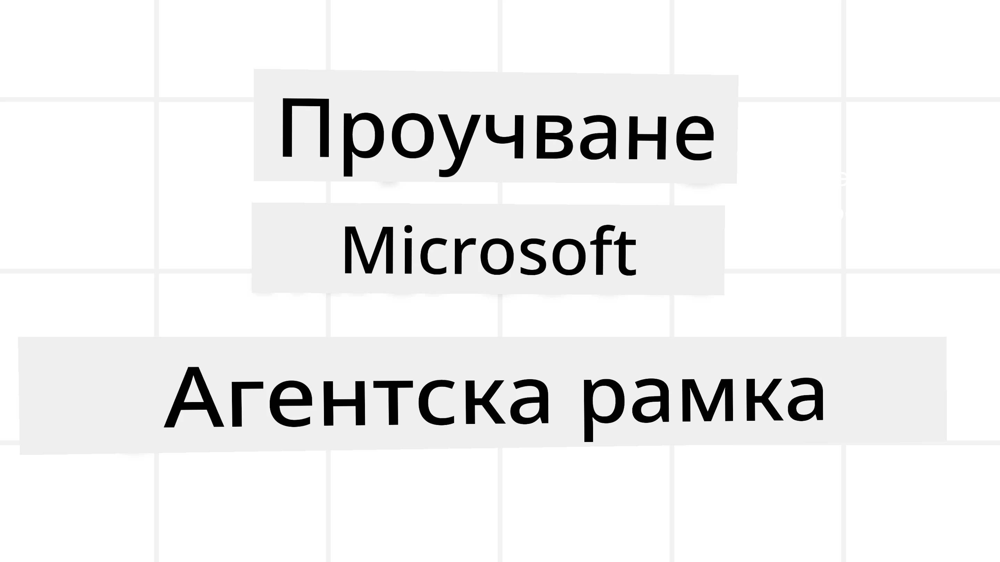

# Изследване на Microsoft Agent Framework



### Въведение

Този урок ще обхване:

- Разбиране на Microsoft Agent Framework: ключови характеристики и стойност  
- Изследване на ключовите концепции на Microsoft Agent Framework
- Разширени модели на MAF: работни потоци, междинен софтуер и памет

## Обучителни цели

След завършване на този урок ще знаете как да:

- Създавате AI агенти готови за производство с Microsoft Agent Framework
- Прилагате основните функции на Microsoft Agent Framework към вашите агентски случаи на употреба
- Използвате разширени модели, включително работни потоци, междинен софтуер и наблюдаемост

## Примери за код

Примери за код за [Microsoft Agent Framework (MAF)](https://aka.ms/ai-agents-beginners/agent-framewrok) можете да намерите в този хранилище в файловете `xx-python-agent-framework` и `xx-dotnet-agent-framework`.

## Разбиране на Microsoft Agent Framework


[Microsoft Agent Framework (MAF)](https://aka.ms/ai-agents-beginners/agent-framewrok) е унифицираната рамка на Microsoft за създаване на AI агенти. Тя предлага гъвкавост за адресиране на широк спектър от агентски случаи на употреба, наблюдавани както в производствени, така и в изследователски среди, включително:

- **Последователна оркестрация на агенти** в сценарии, където са необходими стъпка по стъпка работни потоци.
- **Паралелна оркестрация** в сценарии, където агентите трябва да изпълняват задачи едновременно.
- **Оркестрация за групов чат** в сценарии, където агентите могат да сътрудничат по една задача.
- **Оркестрация при прехвърляне** в сценарии, където агентите предават задачата един на друг, докато подзадачите са завършени.
- **Магнитна оркестрация** в сценарии, където управляващ агент създава и модифицира списък със задачи и координира подагентите за завършване на задачата.

За предоставяне на AI агенти в продукция, MAF включва и функции за:

- **Наблюдаемост** чрез използване на OpenTelemetry, където всяко действие на AI агента, включително извикване на инструменти, стъпки в оркестрацията, потоци на разсъждения и мониторинг на производителността чрез таблата на Microsoft Foundry.
- **Сигурност** чрез хостване на агенти нативно в Microsoft Foundry, който включва контроли за сигурност като достъп базиран на роли, обработка на частни данни и вградена безопасност на съдържанието.
- **Издръжливост** тъй като нишките и работните потоци на агента могат да се паузират, възобновяват и възстановяват от грешки, което позволява по-продължителни процеси.
- **Контрол** като се поддържат работни потоци с човешко участие, където задачите са маркирани като изискващи одобрение от човек.

Microsoft Agent Framework също се фокусира върху интероперабилността, като:

- **Бъде облачно-независим** — агентите могат да работят в контейнери, на място и в няколко облака.
- **Бъде доставчик-независим** — агентите могат да бъдат създавани чрез предпочитания от вас SDK, включително Azure OpenAI и OpenAI.
- **Интегриране на отворени стандарти** — агентите могат да използват протоколи като Agent-to-Agent (A2A) и Model Context Protocol (MCP) за откриване и използване на други агенти и инструменти.
- **Плъгини и конектори** — връзки могат да се правят към услуги за данни и памет като Microsoft Fabric, SharePoint, Pinecone и Qdrant.

Нека разгледаме как тези функции се прилагат към някои от основните концепции на Microsoft Agent Framework.

## Ключови концепции на Microsoft Agent Framework

### Агенти


**Създаване на агенти**

Създаването на агент се извършва чрез дефиниране на inference service (провайдър на голям езиков модел),  
набор от инструкции, които агентът трябва да следва, и зададено `name`:

```python
agent = AzureOpenAIChatClient(credential=AzureCliCredential()).create_agent( instructions="You are good at recommending trips to customers based on their preferences.", name="TripRecommender" )
```

Горното използва `Azure OpenAI`, но агенти могат да се създават чрез различни услуги, включително `Microsoft Foundry Agent Service`:

```python
AzureAIAgentClient(async_credential=credential).create_agent( name="HelperAgent", instructions="You are a helpful assistant." ) as agent
```

OpenAI `Responses`, `ChatCompletion` API

```python
agent = OpenAIResponsesClient().create_agent( name="WeatherBot", instructions="You are a helpful weather assistant.", )
```

```python
agent = OpenAIChatClient().create_agent( name="HelpfulAssistant", instructions="You are a helpful assistant.", )
```

или отдалечени агенти чрез A2A протокол:

```python
agent = A2AAgent( name=agent_card.name, description=agent_card.description, agent_card=agent_card, url="https://your-a2a-agent-host" )
```

**Стартиране на агенти**

Агентите се изпълняват чрез методите `.run` или `.run_stream` за безпоточни или поточни отговори.

```python
result = await agent.run("What are good places to visit in Amsterdam?")
print(result.text)
```

```python
async for update in agent.run_stream("What are the good places to visit in Amsterdam?"):
    if update.text:
        print(update.text, end="", flush=True)

```

Всяко изпълнение на агент може също да има опции за персонализиране на параметри като `max_tokens`, използвани от агента, `tools`, които агентът може да извиква, и дори самия `model`, използван за агента.

Това е полезно в случаи, когато са необходими конкретни модели или инструменти за изпълнение на задачата на потребителя.

**Инструменти**

Инструменти могат да се дефинират както при дефинирането на агента:

```python
def get_attractions( location: Annotated[str, Field(description="The location to get the top tourist attractions for")], ) -> str: """Get the top tourist attractions for a given location.""" return f"The top attractions for {location} are." 


# Когато се създава ChatAgent директно

agent = ChatAgent( chat_client=OpenAIChatClient(), instructions="You are a helpful assistant", tools=[get_attractions]

```

така и при стартирането на агента:

```python

result1 = await agent.run( "What's the best place to visit in Seattle?", tools=[get_attractions] # Инструмент, предоставен само за този пуск )
```

**Нишки на агента**

Нишките на агента се използват за работа с разговори с множество ходове. Нишки могат да се създадат или чрез:

- Използване на `get_new_thread()`, което позволява нишката да се запазва с течение на времето
- Автоматично създаване на нишка при стартиране на агент, като нишката съществува само по време на текущото изпълнение.

За създаване на нишка кодът изглежда така:

```python
# Създайте нов нишка.
thread = agent.get_new_thread() # Стартирайте агента с нишката.
response = await agent.run("Hello, I am here to help you book travel. Where would you like to go?", thread=thread)

```

След това можете да сериализирате нишката за съхранение и по-късна употреба:

```python
# Създайте нова нишка.
thread = agent.get_new_thread() 

# Стартирайте агента с нишката.

response = await agent.run("Hello, how are you?", thread=thread) 

# Сериалирайте нишката за съхранение.

serialized_thread = await thread.serialize() 

# Десериалирайте състоянието на нишката след зареждане от съхранение.

resumed_thread = await agent.deserialize_thread(serialized_thread)
```

**Междинен софтуер на агента**

Агентите взаимодействат с инструменти и LLM за изпълнение на задачите на потребителя. В определени сценарии искаме да изпълним или проследим действия между тези взаимодействия. Междинният софтуер на агента ни позволява това чрез:

*Функционален междинен софтуер*

Този междинен софтуер позволява изпълнение на действие между агента и функцията/инструмента, който ще извика. Пример за използване е, когато искате да направите логване на извикването на функцията.

В кода по-долу `next` определя дали да се извика следващият междинен софтуер или самата функция.

```python
async def logging_function_middleware(
    context: FunctionInvocationContext,
    next: Callable[[FunctionInvocationContext], Awaitable[None]],
) -> None:
    """Function middleware that logs function execution."""
    # Предварителна обработка: Запис в лог преди изпълнението на функцията
    print(f"[Function] Calling {context.function.name}")

    # Продължи към следващия среден слой или изпълнение на функцията
    await next(context)

    # Последваща обработка: Запис в лог след изпълнението на функцията
    print(f"[Function] {context.function.name} completed")
```

*Чат междинен софтуер*

Този междинен софтуер позволява изпълнение или логване на действие между агента и заявките към LLM.

Той съдържа важна информация като `messages`, които се изпращат към AI услугата.

```python
async def logging_chat_middleware(
    context: ChatContext,
    next: Callable[[ChatContext], Awaitable[None]],
) -> None:
    """Chat middleware that logs AI interactions."""
    # Предварителна обработка: Лог преди извикване на AI
    print(f"[Chat] Sending {len(context.messages)} messages to AI")

    # Продължи към следващия междинен слой или AI услуга
    await next(context)

    # Пост-обработка: Лог след отговор от AI
    print("[Chat] AI response received")

```

**Памет на агента**

Както беше разгледано в урока „Agentic Memory“, паметта е важен елемент за позволяване на агента да оперира през различни контексти. MAF предлага няколко различни типа памет:

*Памет в паметта (In-Memory Storage)*

Това е паметта, съхранявана в нишките по време на изпълнение на приложението.

```python
# Създайте нова нишка.
thread = agent.get_new_thread() # Стартирайте агента с нишката.
response = await agent.run("Hello, I am here to help you book travel. Where would you like to go?", thread=thread)
```

*Постоянни съобщения*

Тази памет се използва за съхранение на история на разговори през различни сесии. Тя се дефинира чрез `chat_message_store_factory`:

```python
from agent_framework import ChatMessageStore

# Създайте персонализирано хранилище за съобщения
def create_message_store():
    return ChatMessageStore()

agent = ChatAgent(
    chat_client=OpenAIChatClient(),
    instructions="You are a Travel assistant.",
    chat_message_store_factory=create_message_store
)

```

*Динамична памет*

Тази памет се добавя в контекста преди да се стартират агентите. Тази памет може да се съхранява в външни услуги като mem0:

```python
from agent_framework.mem0 import Mem0Provider

# Използване на Mem0 за разширени възможности за памет
memory_provider = Mem0Provider(
    api_key="your-mem0-api-key",
    user_id="user_123",
    application_id="my_app"
)

agent = ChatAgent(
    chat_client=OpenAIChatClient(),
    instructions="You are a helpful assistant with memory.",
    context_providers=memory_provider
)

```

**Наблюдаемост на агента**

Наблюдаемостта е важна за създаване на надеждни и поддържани агентски системи. MAF се интегрира с OpenTelemetry за предоставяне на трасиране и измерители за по-добра наблюдаемост.

```python
from agent_framework.observability import get_tracer, get_meter

tracer = get_tracer()
meter = get_meter()
with tracer.start_as_current_span("my_custom_span"):
    # направи нещо
    pass
counter = meter.create_counter("my_custom_counter")
counter.add(1, {"key": "value"})
```

### Работни потоци

MAF предлага работни потоци, които са предварително дефинирани стъпки за изпълнение на задача и включват AI агенти като компоненти в тези стъпки.

Работните потоци се състоят от различни компоненти, които позволяват по-добър контрол на потока. Работните потоци също позволяват **оркестрация с няколко агента** и **контролни точки** за запазване на състояния на потока.

Основните компоненти на работния поток са:

**Изпълнители**

Изпълнителите получават входящи съобщения, извършват възложените задачи и произвеждат изходящо съобщение. Това движи работния поток напред към завършване на по-голямата задача. Изпълнителите могат да бъдат AI агенти или персонализирана логика.

**Ръбове**

Ръбовете се използват за дефиниране на потока на съобщения в работен поток. Те могат да бъдат:

*Директни ръбове* — прости връзки един към един между изпълнители:

```python
from agent_framework import WorkflowBuilder

builder = WorkflowBuilder()
builder.add_edge(source_executor, target_executor)
builder.set_start_executor(source_executor)
workflow = builder.build()
```

*Условни ръбове* — активират се след изпълнение на определено условие. Например, когато хотелските стаи не са налични, изпълнителят може да предложи други опции.

*Ръбове с превключвател* — насочват съобщения към различни изпълнители на базата на дефинирани условия. Например, ако пътуващ клиент има приоритетен достъп, неговите задачи ще се обработват чрез друг работен поток.

*Ръбове с разпределяне* — изпращат едно съобщение към множество получатели.

*Ръбове с събиране* — събират множество съобщения от различни изпълнители и ги изпращат към един получател.

**Събития**

За по-добра наблюдаемост на работните потоци, MAF предлага вградени събития за изпълнение, включително:

- `WorkflowStartedEvent`  - Започване на изпълнението на работен поток
- `WorkflowOutputEvent` - Работният поток произвежда изход
- `WorkflowErrorEvent` - Работният поток среща грешка
- `ExecutorInvokeEvent`  - Изпълнителят започва обработка
- `ExecutorCompleteEvent`  - Изпълнителят завършва обработка
- `RequestInfoEvent` - Издава се заявка

## Разширени модели на MAF

По-горе бяха разгледани ключовите концепции на Microsoft Agent Framework. Когато изграждате по-сложни агенти, тук са някои разширени модели за обмисляне:

- **Композиция на междинен софтуер**: Свързване на множество обработващи междинен софтуер (логване, удостоверяване, ограничаване на скорости) чрез функционален и чат междинен софтуер за фино управление на поведението на агента.
- **Контролни точки за работни потоци**: Използване на събития от работни потоци и сериализация за запазване и възобновяване на дълги процеси на агенти.
- **Динамичен избор на инструменти**: Комбиниране на RAG върху описанията на инструментите с регистрацията на инструменти на MAF за показване само на релевантни инструменти за всяко запитване.
- **Прехвърляне между множество агенти**: Използване на ръбове на работни потоци и условно маршрутизиране за оркестрация на прехвърляния между специализирани агенти.

## Примери за код

Примери за код за Microsoft Agent Framework можете да намерите в този хранилище в файловете `xx-python-agent-framework` и `xx-dotnet-agent-framework`.

## Имате ли още въпроси за Microsoft Agent Framework?

Присъединете се към [Microsoft Foundry Discord](https://aka.ms/ai-agents/discord), за да се срещнете с други учащи се, да посетите офис часове и да получите отговори на въпросите си за AI агенти.

---

<!-- CO-OP TRANSLATOR DISCLAIMER START -->
**Отказ от отговорност**:
Този документ е преведен с помощта на AI преводаческа услуга [Co-op Translator](https://github.com/Azure/co-op-translator). Въпреки че се стремим към точност, моля, имайте предвид, че автоматизираните преводи могат да съдържат грешки или неточности. Оригиналният документ на неговия роден език трябва да се счита за авторитетен източник. За критична информация се препоръчва професионален превод от човек. Ние не носим отговорност за недоразумения или неправилни тълкувания, възникнали вследствие използването на този превод.
<!-- CO-OP TRANSLATOR DISCLAIMER END -->