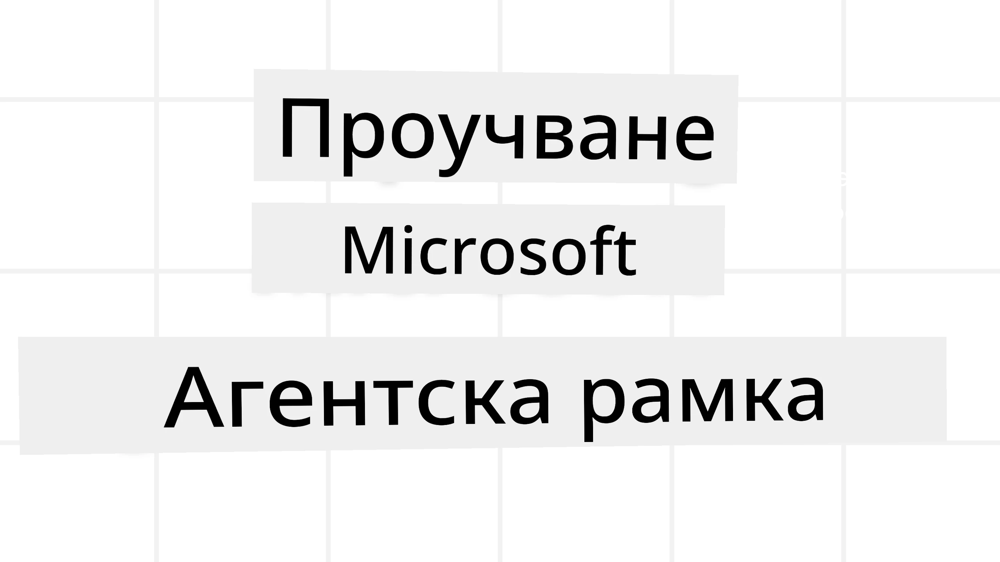
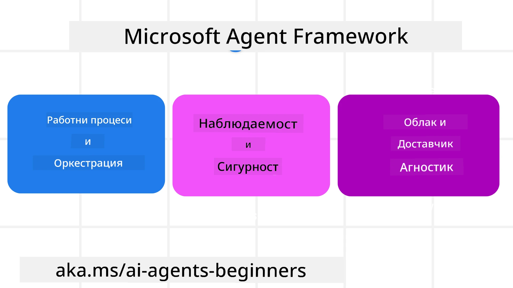
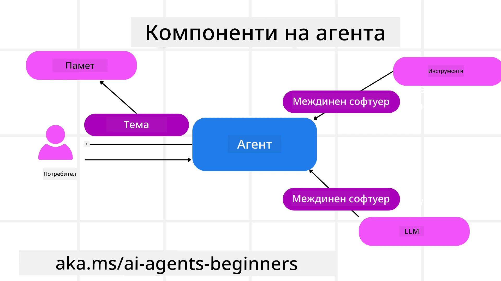

# Изследване на Microsoft Agent Framework



### Въведение

Този урок ще обхване:

- Разбиране на Microsoft Agent Framework: Основни характеристики и стойност  
- Изследване на ключовите концепции на Microsoft Agent Framework
- Разширени MAF шаблони: Работни потоци, междинен слой и памет

## Цели за учене

След завършване на този урок ще знаете как да:

- Създавате AI агенти готови за производство с Microsoft Agent Framework
- Прилагате основните функции на Microsoft Agent Framework към вашите агентски случаи на употреба
- Използвате разширени шаблони, включително работни потоци, междинен слой и наблюдение

## Примери с код 

Примери с код за [Microsoft Agent Framework (MAF)](https://aka.ms/ai-agents-beginners/agent-framework) могат да се намерят в това хранилище под файловете `xx-python-agent-framework` и `xx-dotnet-agent-framework`.

## Разбиране на Microsoft Agent Framework



[Microsoft Agent Framework (MAF)](https://aka.ms/ai-agents-beginners/agent-framework) е единната рамка на Microsoft за изграждане на AI агенти. Тя предлага гъвкавост за справяне с разнообразни агентски случаи на употреба, наблюдавани както в производствени, така и в изследователски среди, включително:

- **Последователна оркестрация на агентите** в ситуации, където са необходими стъпка по стъпка работни потоци.
- **Паралелна оркестрация** в ситуации, където агентите трябва да изпълнят задачи едновременно.
- **Оркестрация на групови чатове** в ситуации, където агентите могат да си сътрудничат по една задача.
- **Оркестрация на предаване** в ситуации, където агентите предават задачата един на друг, когато частичните задачи са завършени.
- **Магнитна Оркестрация** в ситуации, където управляващ агент създава и модифицира списък със задачи и координира подагентите за изпълнение на задачата.

За доставяне на AI агенти в производство, MAF включва и функции за:

- **Наблюдение** чрез използване на OpenTelemetry, където всяко действие на AI агента, включително извикване на инструмент, стъпки на оркестрация, логически потоци и мониторинг на производителност чрез таблата на Microsoft Foundry.
- **Сигурност** чрез хостване на агентите нативно на Microsoft Foundry, което включва контрол на достъпа базиран на роли, обработка на лични данни и вградена безопасност на съдържанието.
- **Издръжливост** тъй като нишките и работните потоци на агента могат да бъдат паузирани, възобновени и възстановени при грешки, което позволява по-дълги изпълняващи се процеси.
- **Контрол** чрез поддръжка на работни потоци със човешка намеса, където задачите са отбелязани като изискващи човешко одобрение.

Microsoft Agent Framework също се фокусира върху оперативна съвместимост чрез:

- **Дейтственост спрямо облак** - Агентите могат да работят в контейнери, на място и в множество различни облаци.
- **Дейтственост спрямо доставчик** - Агентите могат да бъдат създадени чрез предпочитания от вас SDK, включително Azure OpenAI и OpenAI.
- **Интеграция на отворени стандарти** - Агентите могат да използват протоколи като Agent-to-Agent (A2A) и Model Context Protocol (MCP) за откриване и използване на други агенти и инструменти.
- **Приставки и конектори** - Връзки могат да бъдат създавани към данни и услуги за памет като Microsoft Fabric, SharePoint, Pinecone и Qdrant.

Да разгледаме как тези функции се прилагат към някои от основните концепции на Microsoft Agent Framework.

## Ключови концепции на Microsoft Agent Framework

### Агенти



**Създаване на агенти**

Създаването на агент се прави чрез дефиниране на услуга за извеждане на заключения (доставчик на LLM), 
набор от инструкции, които AI агентът трябва да следва, и зададено `име`:

```python
agent = AzureOpenAIChatClient(credential=AzureCliCredential()).create_agent( instructions="You are good at recommending trips to customers based on their preferences.", name="TripRecommender" )
```

По-горе се използва `Azure OpenAI`, но агентите могат да бъдат създавани чрез различни услуги, включително `Microsoft Foundry Agent Service`:

```python
AzureAIAgentClient(async_credential=credential).create_agent( name="HelperAgent", instructions="You are a helpful assistant." ) as agent
```

OpenAI `Responses`, `ChatCompletion` API-та

```python
agent = OpenAIResponsesClient().create_agent( name="WeatherBot", instructions="You are a helpful weather assistant.", )
```

```python
agent = OpenAIChatClient().create_agent( name="HelpfulAssistant", instructions="You are a helpful assistant.", )
```

или [MiniMax](https://platform.minimaxi.com/), който предоставя OpenAI-съвместимо API с големи контекстови прозорци (до 204K токена):

```python
agent = OpenAIChatClient(base_url="https://api.minimax.io/v1", api_key=os.environ["MINIMAX_API_KEY"], model_id="MiniMax-M3").create_agent( name="HelpfulAssistant", instructions="You are a helpful assistant.", )
```

или отдалечени агенти, използващи протокола A2A:

```python
agent = A2AAgent( name=agent_card.name, description=agent_card.description, agent_card=agent_card, url="https://your-a2a-agent-host" )
```

**Изпълнение на агенти**

Агентите се изпълняват с методите `.run` или `.run_stream` за отговори без поток или поток.

```python
result = await agent.run("What are good places to visit in Amsterdam?")
print(result.text)
```

```python
async for update in agent.run_stream("What are the good places to visit in Amsterdam?"):
    if update.text:
        print(update.text, end="", flush=True)

```

Всеки изпълнен агент може да има и опции за персонализиране на параметри като `max_tokens`, използвани от агента, `инструменти`, които агентът може да извиква, и дори самия `модел`, използван за агента.

Това е полезно в случаи, когато са необходими специфични модели или инструменти за изпълнение на дадена задача на потребителя.

**Инструменти**

Инструменти могат да бъдат дефинирани както при създаването на агента:

```python
def get_attractions( location: Annotated[str, Field(description="The location to get the top tourist attractions for")], ) -> str: """Get the top tourist attractions for a given location.""" return f"The top attractions for {location} are." 


# Когато създавате ChatAgent директно

agent = ChatAgent( chat_client=OpenAIChatClient(), instructions="You are a helpful assistant", tools=[get_attractions]

```

така и при изпълнението на агента:

```python

result1 = await agent.run( "What's the best place to visit in Seattle?", tools=[get_attractions] # Инструмент, предоставен само за това изпълнение )
```

**Нишки на агента**

Нишките на агента се използват за обработка на разговори с множество ходове. Те могат да бъдат създадени чрез:

- Използване на `get_new_thread()`, което позволява нишката да бъде запазена с течение на времето
- Автоматично създаване на нишка при изпълнение на агент и нишката да съществува само по време на текущото изпълнение.

За създаване на нишка кодът изглежда така:

```python
# Създайте нов нишка.
thread = agent.get_new_thread() # Стартирайте агента с нишката.
response = await agent.run("Hello, I am here to help you book travel. Where would you like to go?", thread=thread)

```

След това можете да сериализирате нишката, за да бъде съхранявана за по-късна употреба:

```python
# Създайте нов низ.
thread = agent.get_new_thread() 

# Стартирайте агента с низа.

response = await agent.run("Hello, how are you?", thread=thread) 

# Сериализирайте низа за съхранение.

serialized_thread = await thread.serialize() 

# Десериализирайте състоянието на низа след зареждане от съхранението.

resumed_thread = await agent.deserialize_thread(serialized_thread)
```

**Междинен слой на агента (Middleware)**

Агентите взаимодействат с инструменти и LLM за изпълнение на задачите на потребителя. В определени сценарии искаме да изпълним или проследим действия между тези взаимодействия. Междинният слой за агенти ни позволява това чрез:

*Функционален междинен слой (Function Middleware)*

Този междинен слой ни позволява да изпълним действие между агента и функция/инструмент, който ще извика. Пример за това е, когато искате да направите запис на повикването към функцията.

В кода по-долу `next` определя дали трябва да се извика следващият междинен слой или самата функция.

```python
async def logging_function_middleware(
    context: FunctionInvocationContext,
    next: Callable[[FunctionInvocationContext], Awaitable[None]],
) -> None:
    """Function middleware that logs function execution."""
    # Предварителна обработка: Записване в лог преди изпълнение на функцията
    print(f"[Function] Calling {context.function.name}")

    # Продължи към следващия междинен софтуер или изпълнение на функцията
    await next(context)

    # След обработка: Записване в лог след изпълнение на функцията
    print(f"[Function] {context.function.name} completed")
```

*Чат междинен слой (Chat Middleware)*

Този междинен слой ни позволява да изпълним или записваме действие между агента и заявките към LLM.

Той съдържа важна информация като `съобщенията`, които се изпращат към AI услугата.

```python
async def logging_chat_middleware(
    context: ChatContext,
    next: Callable[[ChatContext], Awaitable[None]],
) -> None:
    """Chat middleware that logs AI interactions."""
    # Предварителна обработка: Лог преди извикване на AI
    print(f"[Chat] Sending {len(context.messages)} messages to AI")

    # Продължи към следващия междинен софтуер или AI услуга
    await next(context)

    # Последваща обработка: Лог след отговор от AI
    print("[Chat] AI response received")

```

**Памет на агента**

Както беше разгледано в урока за `Agentic Memory`, паметта е важен елемент, който позволява на агента да работи върху различни контексти. MAF предлага няколко различни типа памет:

*Памет в памет*

Това е паметта, съхранявана в нишките по време на работа на приложението.

```python
# Създайте нов нишка.
thread = agent.get_new_thread() # Стартирайте агента с нишката.
response = await agent.run("Hello, I am here to help you book travel. Where would you like to go?", thread=thread)
```

*Постоянни съобщения*

Тази памет се използва при съхраняване на историята на разговорите през различни сесии. Дефинира се чрез `chat_message_store_factory`:

```python
from agent_framework import ChatMessageStore

# Създайте персонализирано хранилище за съобщения
def create_message_store():
    return ChatMessageStore()

agent = ChatAgent(
    chat_client=OpenAIChatClient(),
    instructions="You are a Travel assistant.",
    chat_message_store_factory=create_message_store
)

```

*Динамична памет*

Тази памет се добавя към контекста преди да се изпълнят агентите. Тези памети могат да се съхраняват в външни услуги като mem0:

```python
from agent_framework.mem0 import Mem0Provider

# Използване на Mem0 за разширени възможности на паметта
memory_provider = Mem0Provider(
    api_key="your-mem0-api-key",
    user_id="user_123",
    application_id="my_app"
)

agent = ChatAgent(
    chat_client=OpenAIChatClient(),
    instructions="You are a helpful assistant with memory.",
    context_providers=memory_provider
)

```

**Наблюдаемост на агента**

Наблюдаемостта е важна за изграждане на надеждни и поддържани агентски системи. MAF се интегрира с OpenTelemetry за проследяване и измервания за по-добра наблюдаемост.

```python
from agent_framework.observability import get_tracer, get_meter

tracer = get_tracer()
meter = get_meter()
with tracer.start_as_current_span("my_custom_span"):
    # направи нещо
    pass
counter = meter.create_counter("my_custom_counter")
counter.add(1, {"key": "value"})
```

### Работни потоци

MAF предлага работни потоци, които са предварително дефинирани стъпки за изпълнение на задача и включват AI агенти като компоненти в тези стъпки.

Работните потоци се състоят от различни компоненти, които позволяват по-добър контрол на потока. Работните потоци също позволяват **оркестрация на множество агенти** и **маркиране на контролни точки** за запазване на състоянията на работните потоци.

Основните компоненти на работен поток са:

**Изпълнители**

Изпълнителите получават входни съобщения, изпълняват възложените им задачи и след това произвеждат изходно съобщение. Това придвижва работния поток към завършването на по-голямата задача. Изпълнителите могат да бъдат AI агенти или персонализирана логика.

**Връзки (Edges)**

Връзките се използват за дефиниране на потока на съобщения в работен поток. Те могат да бъдат:

*Директни връзки* - Прости едно към едно връзки между изпълнители:

```python
from agent_framework import WorkflowBuilder

builder = WorkflowBuilder()
builder.add_edge(source_executor, target_executor)
builder.set_start_executor(source_executor)
workflow = builder.build()
```

*Условни връзки* - Активират се след като е изпълнено определено условие. Например, когато хотелските стаи са недостъпни, изпълнителят може да предложи други опции.

*Връзки тип превключвател* - Насочват съобщения към различни изпълнители въз основа на зададени условия. Например, ако клиентът в пътуване има приоритетен достъп, задачите му се обработват чрез друг работен поток.

*Разклоняващи се връзки* - Изпращат едно съобщение към множество приемници.

*Събиращи се връзки* - Събират множество съобщения от различни изпълнители и ги изпращат към един приемник.

**Събития**

За по-добра наблюдаемост на работните потоци, MAF предлага вградени събития за изпълнение, включително:

- `WorkflowStartedEvent`  - Започва изпълнението на работния поток
- `WorkflowOutputEvent` - Работният поток генерира изход
- `WorkflowErrorEvent` - Работният поток среща грешка
- `ExecutorInvokeEvent`  - Изпълнителят започва обработка
- `ExecutorCompleteEvent`  -  Изпълнителят завършва обработката
- `RequestInfoEvent` - Издава се заявка

## Разширени MAF шаблони

По-горните раздели обхващат ключовите концепции на Microsoft Agent Framework. Когато изграждате по-сложни агенти, ето някои разширени модели за разглеждане:

- **Композиция на междинен слой**: Свързване на множество обработващи междинни слоеве (логване, удостоверяване, ограничаване на честотата) чрез функционален и чат междинен слой за фино управление на поведението на агента.
- **Маркиране на контролни точки в работен поток**: Използване на събития от работния поток и сериализация за запазване и възобновяване на дълго изпълняващи се процеси на агнети.
- **Динамичен избор на инструменти**: Комбинирайте RAG върху описания на инструменти с регистрацията на инструменти на MAF, за да представяте само релевантни инструменти за всяка заявка.
- **Предаване между множество агенти**: Използвайте ръбовете на работния поток и условно маршрутизиране за оркестрация на предавания между специализирани агенти.

## Хостване на LangChain / LangGraph агенти на Microsoft Foundry

Microsoft Agent Framework е **рамково оперативно съвместим** — не сте ограничени до агенти, написани с MAF. Ако вече имате агент, изградени с **LangChain** или **LangGraph**, можете да го стартирате като **агент хостван в Microsoft Foundry**, така че Foundry да управлява времето на работа, сесиите, мащабирането, идентичността и крайните точки на протокола за вас, докато логиката на вашия агент остава в LangGraph.

Това се прави с пакета `langchain_azure_ai.agents.hosting`, който излага компилиран LangGraph граф по същите протоколи, които хостваните агенти в Foundry използват.

**1. Инсталирайте хостинг разширението:**

```bash
pip install -U "langchain-azure-ai[hosting]>=1.2.4" azure-identity
```

Разширението `hosting` инсталира Foundry протоколните библиотеки: `azure-ai-agentserver-responses` (OpenAI-съвместимата `/responses` крайна точка) и `azure-ai-agentserver-invocations` (общата `/invocations` крайна точка).

**2. Изберете хостинг протокол:**

| Протокол | Клас на хоста | Крайна точка | Използва се когато |
|----------|-----------|----------|----------|
| **Responses** | `ResponsesHostServer` | `/responses` | Искате OpenAI-съвместим чат, стрийминг, история на отговорите и нишки на разговори — препоръчителният по подразбиране за разговорни агенти. |
| **Invocations** | `InvocationsHostServer` | `/invocations` | Имаш нужда от персонализирана JSON структура, уебхук стил крайна точка или нестандартна обработка, която не е разговорна. |

Тъй като **Responses API е основното API за развитие на агент стил в Foundry**, започнете с `ResponsesHostServer` за повечето агенти.

**3. Настройте променливи на околната среда** (първо `az login` за да може `DefaultAzureCredential` да се удостоверява):

```bash
export FOUNDRY_PROJECT_ENDPOINT="https://<resource>.services.ai.azure.com/api/projects/<project>"
export FOUNDRY_MODEL_NAME="gpt-4.1"
```

Когато агентът по-късно работи като хостван агент в Foundry, платформата автоматично инжектира `FOUNDRY_PROJECT_ENDPOINT`.

**4. Изложете LangGraph агент чрез Responses протокол:**

```python
import os

from azure.ai.projects import AIProjectClient
from azure.identity import DefaultAzureCredential, get_bearer_token_provider
from langchain.agents import create_agent
from langchain_openai import ChatOpenAI
from langchain_azure_ai.agents.hosting import ResponsesHostServer

_AZURE_AI_SCOPE = "https://ai.azure.com/.default"


def build_chat_model() -> ChatOpenAI:
    project_endpoint = os.environ["FOUNDRY_PROJECT_ENDPOINT"].rstrip("/")
    deployment = os.environ.get("FOUNDRY_MODEL_NAME", "gpt-4.1")
    credential = DefaultAzureCredential()
    project = AIProjectClient(endpoint=project_endpoint, credential=credential)
    openai_client = project.get_openai_client()
    token_provider = get_bearer_token_provider(credential, _AZURE_AI_SCOPE)

    # ChatOpenAI тук насочва към OpenAI-съвместимия крайна точка (Responses) на проекта Foundry.
    return ChatOpenAI(
        model=deployment,
        base_url=str(openai_client.base_url),
        api_key=token_provider,
    )


def main() -> None:
    graph = create_agent(build_chat_model(), tools=[])
    port = int(os.environ.get("PORT", "8088"))
    ResponsesHostServer(graph).run(port=port)


if __name__ == "__main__":
    main()
```

Стартирайте локално с `python main.py`, след което изпратете заявка към Responses на `http://localhost:8088/responses`.

**Основни поведения:**

- **Разговори**: Клиентите продължават разговор, като предават `previous_response_id` или `conversation` ID. Ако вашият граф е компилиран с LangGraph чекпойнтер, Foundry свързва състоянието на разговора с контролната точка (използвайте издръжлив чекпойнтер в продукцията; `MemorySaver` е подходящ за локално тестване).
- **Човек в цикъла**: Ако вашият граф използва LangGraph `interrupt()`, `ResponsesHostServer` показва чакащото прекъсване като елемент `function_call` / `mcp_approval_request`, а клиентите продължават с подходящия `function_call_output` / `mcp_approval_response`.
- **Деплой в Foundry**: Използвайте Azure Developer CLI — `azd ext install azure.ai.agents`, `azd ai agent init -m <manifest>`, `azd ai agent run` (локално, изисква Docker), след това `azd provision` и `azd deploy`. Деплой на хостван агент изисква ролята **Foundry Project Manager**.

Работеща версия на този пример се намира в [code-samples/14-langchain-hosted-agent.py](../../../14-microsoft-agent-framework/code-samples/14-langchain-hosted-agent.py). За пълния урок (протокол Invocations, персонализирани схеми за заявки и отстраняване на проблеми), вижте [Host LangGraph agents as Foundry hosted agents](https://learn.microsoft.com/azure/foundry/how-to/develop/langchain-hosted-agents).

## Примери с код 

Примери с код за Microsoft Agent Framework могат да се намерят в това хранилище под файловете `xx-python-agent-framework` и `xx-dotnet-agent-framework`.

## Имате ли още въпроси за Microsoft Agent Framework?

Присъединете се към [Microsoft Foundry Discord](https://discord.com/invite/ATgtXmAS5D) за да се срещнете с други учащи, участвате в часове за въпроси и получите отговори на вашите въпроси за AI агенти.

---

<!-- CO-OP TRANSLATOR DISCLAIMER START -->
**Отказ от отговорност**:
Този документ е преведен с помощта на AI преводачески услуга [Co-op Translator](https://github.com/Azure/co-op-translator). Въпреки че се стремим към точност, моля имайте предвид, че автоматизираните преводи могат да съдържат грешки или неточности. Оригиналният документ на неговия роден език трябва да се счита за авторитетен източник. За критична информация се препоръчва професионален човешки превод. Ние не носим отговорност за каквито и да е недоразумения или неправилни тълкувания, произтичащи от използването на този превод.
<!-- CO-OP TRANSLATOR DISCLAIMER END -->