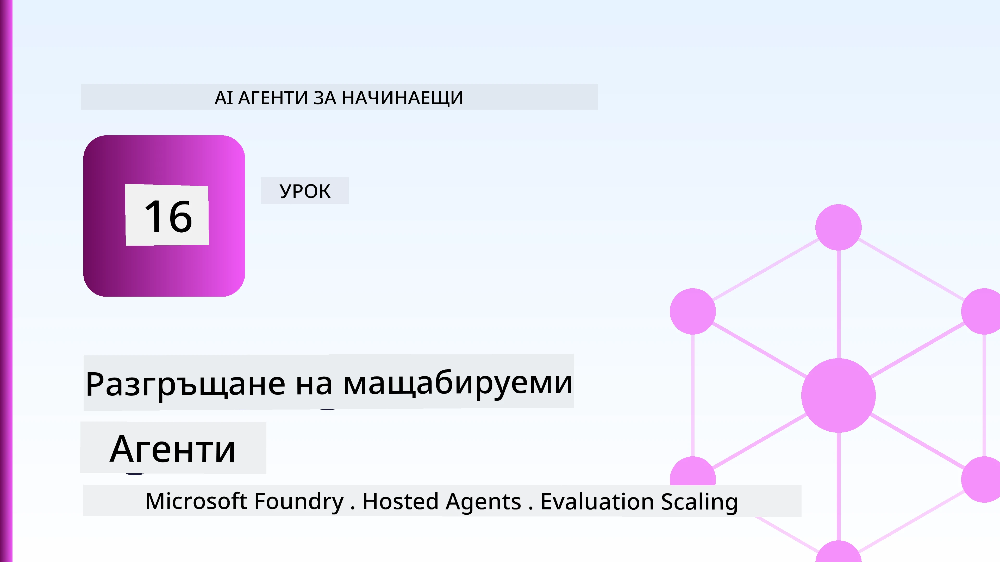
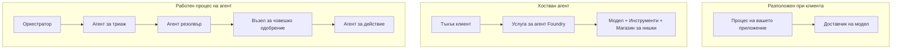
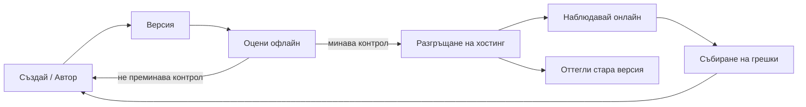
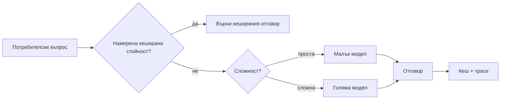
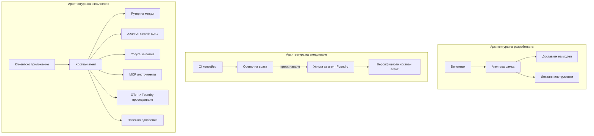

# Разгръщане на мащабируеми агенти с Microsoft Foundry



До този момент в курса сте изграждали агенти, които работят на лаптопа ви, вътре в тетрадка, управлявани от `az login` и няколко променливи на средата. Това е точно правилният начин за учене. Това не е правилният начин да пускате агент, на когото хиляди клиенти се доверяват в 3 часа сутринта.

Този урок е за пропастта между "работи на моята машина" и "работи надеждно и достъпно в продукция". Затваряме тази пропаст чрез **Microsoft Foundry** и **Microsoft Foundry Agent Service**, като изграждаме реален агент за клиентска поддръжка, който разполага с инструменти, извличане, памет, оценка и наблюдение.

## Въведение

Този урок ще разгледа:

- Разликата между **прототипен агент** и **разположен агент**, и защо преходът се отнася главно до всичко *около* модела.
- **Модели на разгръщане** за агенти: хоствани от клиента, хоствани като услуга (Hosted Agents) и оркестрирани чрез работни процеси.
- **Жизнен цикъл на агента** в Microsoft Foundry — създаване, версия, разгръщане, оценка, наблюдение, пенсиониране.
- **Стратегии за мащабиране**: маршрутизация на модел, кеширане, конкурентност и безсъстояние дизайн.
- **Наблюдаемост** чрез OpenTelemetry и Foundry трасиране.
- **Оптимизация на разходите** чрез подбор на модел, маршрутизация и контролни точки за оценка.
- **Предприятелски въпроси**: управление, човешко одобрение и безопасна работа на MCP сървъри в продукция.

## Цели на обучението

След завършване на този урок, ще знаете как да:

- Изберете правилния модел на разгръщане за дадена работна задача на агент.
- Разгърнете агент в Microsoft Foundry Agent Service така, че да бъде версиян, управляван и наблюдаем.
- Инструктирате агент за трасиране и свържете канал за оценка, който се изпълнява преди всяко пускане.
- Приложите маршрутизация на модел и кеширане, за да поддържате латентността и разходите под контрол при мащабиране.
- Добавите човешки контрол за високорискови действия и интегрирате MCP сървър по безопасен начин за продукция.

## Предпоставки

Този урок предполага, че сте завършили предишните уроци и сте уверени с:

- Изграждане на агенти с [Microsoft Agent Framework](../14-microsoft-agent-framework/README.md) (Урок 14).
- [Използване на инструменти](../04-tool-use/README.md) (Урок 4) и [Agentic RAG](../05-agentic-rag/README.md) (Урок 5).
- [Памет на агента](../13-agent-memory/README.md) (Урок 13) и [Agentic протоколи / MCP](../11-agentic-protocols/README.md) (Урок 11).
- [Наблюдаемост и оценка](../10-ai-agents-production/README.md) (Урок 10) — този урок се изгражда директно върху него.

Ще ви трябват също:

- **Абонамент за Azure** и **Microsoft Foundry проект** с поне един разположен модел за чат.
- **Azure CLI** с удостоверяване (`az login`).
- Python 3.12+ и пакетите от хранилището [`requirements.txt`](../../../requirements.txt).

## От прототип до продукция: Какво всъщност се променя

Прототипен агент и производствен агент споделят една и съща основна последователност — разсъждение, използване на инструменти, отговор. Това, което се променя, е всичко, обгръщащо тази последователност. Моделът е може би 20% от производствения агент; останалите 80% са оперативният скелет.

| Въпрос | Прототип | Производство |
| --- | --- | --- |
| **Хостинг** | Работи във вашата тетрадка | Работи като хоствана услуга, версияна и разпространявана |
| **Идентичност** | Вашият `az login` токен | Управлявана идентичност със зададени RBAC права |
| **Състояние** | В паметта, изчезва при рестарт | Външно съхранение (thread store, memory service) |
| **Неуспех** | Виждате traceback | Опити за повторно изпълнение, резервни варианти, dead-letter, аларми |
| **Разход** | "Няколко цента" | Проследено на заявка, маршрутизирано, кеширано, с бюджет |
| **Качество** | Проверявате на око изхода | Оценява се автоматично преди всеки ъпдейт |
| **Доверие** | Одобрявате всяко действие | Политика + човек в цикъла за рискови действия |

Запомнете тази таблица. Всеки раздел по-надолу съответства на един от тези редове.

## Модели на разгръщане на агенти

Съществуват три модела, които ще използвате, често в комбинация.

### 1. Клиентски хоствани агенти

Агентският обект живее във *вашия* процес на приложението. Вашият код извиква директно доставчика на модела; цикълът на разсъждение работи във вашата услуга. Това е, което правеше всеки предишен урок.

- **Използвайте го, когато** имате нужда от пълен контрол върху цикъла, персонализиран middleware или вграждане на агента в съществуващ бекенд.
- **Компромис**: вие носите отговорност за мащабиране, състояние и устойчивост.

### 2. Хоствани агенти (Foundry Agent Service)

Агентът е *регистриран като ресурс* в Microsoft Foundry. Foundry хоства цикъла на разсъждение, съхранява нишки, налага безопасност на съдържанието и RBAC, и прави агента видим в портала на Foundry. Вашето приложение става тънък клиент, създава нишки и чете отговори.

- **Използвайте го, когато** искате устойчивост, вградена наблюдаемост, управление и по-малко оперативна сложност.
- **Компромис**: по-малък ниско-нивов контрол в замяна на управлявана изпълнителна среда.

### 3. Работни потоци на агенти

Множество агенти (и инструменти) се съставят в граф с изрично управляване на потока — последователни стъпки, разклонения, възли за човешко одобрение и трайни чекпойнтове, които могат да поставят пауза и да продължат. Това е функционалността за **Работни потоци** от Microsoft Agent Framework, приложена на ниво разгръщане.

- **Използвайте го, когато** една задача включва няколко специализирани агенти или изисква междинна стъпка за одобрение.
- **Компромис**: повече движещи се части; нужда от наблюдаемост на ниво оркестрация.



## Жизнен цикъл на агента в Microsoft Foundry

Разгръщането на агент не е еднократно `push`. Това е цикъл, който много прилича на цикъла на софтуерно пускане, защото точно това е.



Основната идея, пренесена от [Урок 10](../10-ai-agents-production/README.md): **оценката офлайн е контролна точка, не следващ мисъл.** Нова версия на агента не се пуска, освен ако не премине вашите оценъчни прагове. Наблюдаемостта онлайн връща реалните неуспехи обратно във вашия офлайн тестов набор. Това е целият цикъл.

## Стратегии за мащабиране

Мащабирането на агент се различава от мащабирането на безсъстоянен уеб API, тъй като всяка заявка може да задейства множество скъпи извиквания на модели и инструменти. Четири техники поемат по-голямата част от товара.

**Обработка на заявки без състояние.** Не съхранявайте състояние за потребителите в паметта на процеса. Запазвайте нишките на разговор във Foundry thread store или услуга за памет, така че всеки екземпляр да може да обработи всяка заявка. Това позволява хоризонтално мащабиране — добавяне на екземпляри без прикрепени сесии.

**Маршрутизация на модел.** Не всяка заявка изисква най-способния (и най-скъп) модел. Маршрутизирайте прости заявки — класификация на намерение, кратки фактически отговори — към малък, бърз модел и запазете големия модел за действително разсъждение. Foundry's **Model Router** може да направи това за вас, или можете сами да имплементирате лек класификатор. Ще изградите „направи си сам“ версия в лабораторията.

**Кеширане на отговори.** Много запитвания за поддръжка са почти дубликати („как да нулирам паролата си?“). Кеширайте отговорите на често задавани въпроси и ги връщайте без да правите повикване към модела. Дори умерена кеш hit rate значително намалява разходите и латентността.

**Конкурентност и натоварване.** Доставчиците на модели имат ограничения на честотата. Ограничете конкурентността си, използвайте повторни опити с експоненциално отлагане и се проваляйте елегантно (отговор със състояние „работим по въпроса“ в опашка е по-добър от 500 грешка).



## Наблюдаемост в продукция

Не можете да управлявате нещо, което не виждате. Както беше разгледано в Урок 10, Microsoft Agent Framework излъчва **OpenTelemetry** трасета нативно — всяко повикване на модел, инструмент или стъпка от оркестрацията става спан. В продукция експортирате тези спанове към Microsoft Foundry (или всякакъв OTel-съвместим бекенд), за да можете:

- Да проследите един клиентски жалба от край до край през всяко повикване на модел и инструмент.
- Да наблюдавате p50/p95 латентност и разходи на заявка във времето.
- Да алармирате за скокове в процента грешки и аномалии в разходите преди вашите потребители (или финансовия ви екип) да ги забележат.

```python
from agent_framework.observability import get_tracer

tracer = get_tracer()

with tracer.start_as_current_span("support_request") as span:
    span.set_attribute("customer.tier", "enterprise")
    span.set_attribute("routed.model", "gpt-5-nano")
    # изпълнението на агента се следи автоматично в този интервал
```

Атрибути като `customer.tier` и `routed.model` превръщат стена от трасета в въпроси с отговори („дали корпоративните клиенти се маршрутират твърде често към малкия модел?“).

## Оптимизация на разходите

Разходите в производствените агенти се доминират от токени. Три лоста, подредени по въздействие:

1. **Изберете подходящия размер на модела.** Малък модел, който преминава вашия оценъчен праг, почти винаги е по-евтин от голям, който също преминава. Използвайте оценка, за да *докажете*, че малкият модел е достатъчно добър, вместо по навик да избирате най-големия.
2. **Маршрутизирайте според сложността.** Както по-горе — плащате големите модели само за заявки, които изискват голям модел.
3. **Кеширайте агресивно.** Най-евтиното извикване на модел е това, което никога не правите.

Контролните точки за оценка и контрол на разходите са една и съща дисциплина разгледана от два ъгъла: оценката определя *дъното на качеството*, маршрутизацията и кеширането ви държат възможно най-близо до *разхода* на това дъно.

## Предприятелски съображения при разгръщане

**Управление.** Hosted Agents наследяват RBAC, безопасност на съдържанието и одит логове от Foundry. Дайте на всеки агент управлявана идентичност с най-малко необходимите привилегии — достъп само за четене до базата знания, ограничен достъп до API за тикети и нищо повече.

**Човек в цикъла.** Някои действия са твърде важни, за да се автоматизират напълно — издаване на възстановяване на сума, изтриване на акаунт, ескалация към юридически екип. Microsoft Agent Framework поддържа инструменти с **изискване за одобрение**: агентът предлага действие, изпълнението спира, човек одобрява или отхвърля и работният процес продължава. Видяхте примитива в [Урок 6](../06-building-trustworthy-agents/README.md); тук го разгръщате.

**MCP в продукция.** [MCP](../11-agentic-protocols/README.md) позволява на агента да използва външни инструменти чрез стандартен интерфейс. В продукция третирате всеки MCP сървър като недоверена граница: закрепете версията на сървъра, пускайте го с ограничена идентичност, валидирайте изходите му и никога не излагайте тайни пред него. MCP сървърът е зависимост, а зависимостите се актуализират, одитират и ограничават.



Тези три диаграми — разработка, разгръщане, време на работа — показват един и същ агент в три етапа от живота му. Следващата лаборатория ви превежда през изграждането му.

## Практическа лаборатория: Агент за клиентска поддръжка готов за продукция

Отворете [`code_samples/16-python-agent-framework.ipynb`](./code_samples/16-python-agent-framework.ipynb) и работете през него от начало до край. Ще сглобите **агент за клиентска поддръжка на Contoso** с всички продукционни изисквания включени:

1. **Извикване на инструменти** — проверка на статус на поръчка и отваряне на тикети.
2. **RAG** — дава отговори на въпроси за политики от база знания (Azure AI Search, с резервна памет в паметта, така че тетрадката да се изпълнява без Search ресурс).
3. **Памет** — помни клиента през ходовете на разговора.
4. **Маршрутизация на модел** — класификатор на сложността маршрутизира всяка заявка към малък или голям модел.
5. **Кеширане на отговори** — повторни въпроси се обслужват от кеша.
6. **Човешко одобрение** — възстановявания над праг чакат за човешка проверка.
7. **Канал за оценка** — малък офлайн тестов набор оценява агента и служи като контролна точка при пускане.
8. **Наблюдаемост** — OpenTelemetry трасиране на всяка заявка.

### Разглеждане стъпка по стъпка

Тетрадката е организирана така, че всяко продукционно изискване е самостоятелен, изпълним раздел. Сърцето му е обработчикът на заявки за маршрутизация плюс кеширане:

```python
async def handle_support_request(query: str, customer_id: str) -> str:
    # 1. Служи от кеша, когато можем.
    cached = response_cache.get(normalize(query))
    if cached:
        return cached

    # 2. Направлявай според сложността, за да контролираш разходите.
    model = "gpt-5-nano" if is_simple(query) else "gpt-5-mini"

    # 3. Стартирай агента в рамките на следа за наблюдаемост.
    with tracer.start_as_current_span("support_request") as span:
        span.set_attribute("routed.model", model)
        span.set_attribute("customer.id", customer_id)
        response = await support_agent.run(query, model=model)

    # 4. Кеширай и върни.
    response_cache.set(normalize(query), response.text)
    return response.text
```

Контролната точка за оценка, която пази пускането на нова версия, изглежда така:

```python
async def evaluation_gate(agent, test_cases, threshold: float = 0.8) -> bool:
    passed = 0
    for case in test_cases:
        result = await agent.run(case["input"])
        if score_response(result.text, case["expected"]) >= 0.8:
            passed += 1
    pass_rate = passed / len(test_cases)
    print(f"Evaluation pass rate: {pass_rate:.0%} (gate: {threshold:.0%})")
    return pass_rate >= threshold  # внедрявайте само ако премине проверката на портата
```

Четете всяка линия — тетрадката прави примитивите умишлено малки, за да не се крие нищо зад повикване на рамка.

## Валидиране на разположен агент с димни тестове

Оценъчната точка по-горе се изпълнява *офлайн* спрямо обекта на вашия агент. След като агентът е разположен като Hosted Agent, ви трябва още една, дори по-евтина проверка: **отговаря ли наистина разположената крайна точка?**

Успешното разгръщане само доказва, че контролният план е приел дефиницията — то не доказва, че агентът отговаря. Липсваща зависимост, лоша маршрутизация на модел или изтекла връзка могат да оставят зелено разгръщане, което не връща нищо. **Димният тест** засича това за секунди, при всяко разгръщане, без разходите на пълна оценка.

Това хранилище предоставя готова за използване тестова линия, базирана на GitHub действието [AI Smoke Test](https://github.com/marketplace/actions/ai-smoke-test):

- **Каталог** — [`tests/lesson-16-smoke-tests.json`](../../../tests/lesson-16-smoke-tests.json) съдържа подсказки и твърдения за агента за поддръжка на Contoso (отговори основаващи се на политики, проверка на поръчки, останете по темата и мултиходова консистентност). Каталози за агентите от други уроци живеят заедно с него — вижте [`tests/README.md`](../tests/README.md).
- **Работен процес** — [`.github/workflows/smoke-test.yml`](../../../.github/workflows/smoke-test.yml) влиза с Azure OIDC и изпраща всяка подсказка към Responses endpoint на агента, проваляйки задачата при всяко пропускане на твърдение.

```yaml
- name: Smoke-test hosted agent
  uses: JFolberth/ai-smoketest@v1
  with:
    project_endpoint: ${{ inputs.project_endpoint }}
    agent_name: ContosoSupportAgent
    tests_file: tests/lesson-16-smoke-tests.json
```


Стартирайте го от раздела **Actions**, след като вашият агент е разположен, като предоставите крайна точка на вашия Foundry проект и името на агента. Федеративната идентичност трябва да има ролята **Azure AI User** в рамките на проекта Foundry. Мислете за слоевете като за пирамида: димен тестове (достъпни ли са и отговарят ли?) се изпълняват при всяко разполагане, офлайн оценка (достатъчно ли е добра, за да се пусне?) се изпълнява преди промоция, а онлайн оценка (как се справя в реална среда?) се изпълнява непрекъснато.

## Проверка на знанията

Тествайте разбирането си преди да преминете към задачата.

**1. Приблизително колко от един производствен агент е „моделът“ и какво представлява останалото?**

<details>
<summary>Отговор</summary>

Моделът е малцинството в системата — често се цитира около 20%. Останалото е оперативният скелет: хостинг и версиониране, идентичност и RBAC, външно съхранение на състояние, обработка на грешки, проследяване на разходи, оценка и контроли с човешко участие. Преминаването към продукция е преди всичко изграждането на всичко *около* цикъла на разсъждение.
</details>

**2. Кога бихте избрали Hosted Agent пред клиентски хостван агент?**

<details>
<summary>Отговор</summary>

Когато искате управлявана среда за изпълнение с вградена устойчивост (нишки, които продължават и могат да се възобновят), наблюдаемост, безопасност на съдържанието и RBAC, и сте готови да жертвате някакъв ниско ниво контрол върху цикъла на разсъждение за по-малка оперативна повърхност. Клиентският хостван е предпочитан, когато имате нужда от пълен контрол върху цикъла или вграждате агента в съществуващ бекенд.
</details>

**3. Защо мащабируем агент трябва да бъде безсъстоянен в собствената си процесна памет?**

<details>
<summary>Отговор</summary>

За да може всеки инстанс да обработва всяка заявка, което позволява хоризонтално мащабиране без привързани сесии. Състоянието на разговора на потребителя е външно съхранено в нишков магазин или услуга за памет. Ако състоянието се намираше в процесната памет, бихте го загубили при рестарт и не бихте могли свободно да разпределяте натоварването.
</details>

**4. Какъв проблем решава маршрутизацията на моделите и как се свързва с оценката?**

<details>
<summary>Отговор</summary>

Маршрутизацията изпраща прости заявки към малък, евтин и бърз модел и запазва големия модел за истинско разсъждение, като контролира както латентността, така и разходите. Тя е свързана с оценката, защото оценката е това, което *доказва*, че малкият модел е достатъчно добър за даден клас заявки — маршрутизация без оценка е предположение.
</details>

**5. Какво представлява „пропускателният праг на оценката“ и къде се намира в жизнения цикъл?**

<details>
<summary>Отговор</summary>

Пропускателният праг на оценката изпълнява офлайн тестов набор срещу новата версия на агента и блокира разполагането, освен ако процентът на преминаване не премине зададен праг. Той стои между „версия“ и „разполагане“ в жизнения цикъл, като прави качеството предпоставка за пускане, а не нещо, което проверявате след разполагане.
</details>

**6. Защо MCP сървърът трябва да се третира като ненадеждна граница в продукция?**

<details>
<summary>Отговор</summary>

Защото е външна зависимост, към която вашият агент прави повиквания. Трябва да фиксирате версията му, да го стартирате с ограничена идентичност, да валидирате изходните му данни, да ограничавате честотата на достъп и никога да не му разкривате тайни — същата дисциплина, която прилагате към всеки външен доставчик. Изходните му данни влизат в разсъжденията на вашия агент, така че нeвалидираното доверие е риск за сигурността.
</details>

**7. Коя една промяна обикновено има най-голямо влияние върху разходите на производствен агент и защо?**

<details>
<summary>Отговор</summary>

Правилният избор на размер на модела — използването на най-малкия модел, който все още преминава вашия пропускателен праг за оценка. Разходите се доминират от токените, а по-малкият модел, който отговаря на качествения критерий, почти винаги е по-евтин от по-големия. Кеширането и маршрутизацията намаляват разходите допълнително, но изборът на правилния базов модел има най-голям първичен ефект.
</details>

**8. Каква роля играят атрибутите на span като `customer.tier` и `routed.model` в наблюдаемостта?**

<details>
<summary>Отговор</summary>

Те превръщат суровите трасета в отговорими бизнес въпроси. Без атрибути имате стена от spans; с тях можете да питате „Дали корпоративните клиенти се маршрутират твърде често към малкия модел?“ или „Кой модел обработва нашите най-бавни заявки?“ Атрибутите са начинът, по който сегментирате телеметрията по измеренията, важни за вашата работа.
</details>

## Задача

Вземете агента за обслужване на клиенти от лабораторията и го подсилете за конкретен сценарий: **агент за поддръжка на абонаментни плащания за SaaS компания.**

Вашето представяне трябва да:

1. **Замените инструментите** с такива, релевантни за фактуриране: `get_subscription_status`, `get_invoice` и `issue_credit` (кредитите над $50 изискват човешко одобрение).
2. **Добавите три RAG документа**, обхващащи политиката за възстановяване на средства, фактуриращия цикъл и политиката за анулиране на компанията.
3. **Разширите набора за оценка** до поне осем случая, включително поне два, които *трябва* да задействат пътя за човешко одобрение, и потвърдете, че пропускателният праг на оценката преминава или проваля правилно.
4. **Добавите един доклад за разходите**: след като изпълните десет смесени заявки през агента, отпечатайте колко са били обработени от малкия модел, колко от големия модел и колко са обслужени от кеша.

Напишете кратък параграф (в markdown клетка), обясняващ кой правилник за маршрутизация на модел избрахте и как бихте го валидирали с реален трафик. Няма единен правилен отговор — оценява се дали производствените съображения са свързани по логичен начин.

## Резюме

В този урок преместихте агент от прототип към продукция с Microsoft Foundry:

- Преходът към продукция е преди всичко за **оперативния скелет** около модела — хостинг, идентичност, състояние, обработка на грешки, разходи, качество и доверие.
- Научихте трите **модела на разполагане** — клиентски хостван, Hosted Agents и Agent Workflows — и кога всеки е подходящ.
- Проследихте **животния цикъл на агента**, където офлайн **оценката служи като пропускателен праг за пускане** и онлайн наблюдаемостта връща грешките в тестовия набор.
- Използвахте **стратегии за мащабиране** — безсъстоянен дизайн, маршрутизация на модел, кеширане и ограничена едновременност — и ги свързахте с **оптимизация на разходите**.
- Свързахте **корпоративни контроли**: RBAC, човешко одобрение и производство-сигурна интеграция на MCP.
- Сглобихте **агент за обслужване на клиенти, готов за продукция**, който обединява всички тези съображения в изпълним код.

Следващият урок прави обратното пътуване: вместо да мащабирате агентите към облака, ще ги свалите *надолу* на една машина на разработчик и ще ги стартирате изцяло локално.

## Допълнителни ресурси

- <a href="https://learn.microsoft.com/azure/ai-foundry/what-is-azure-ai-foundry" target="_blank">Документация за Microsoft Foundry</a>
- <a href="https://learn.microsoft.com/azure/ai-foundry/agents/overview" target="_blank">Преглед на Microsoft Foundry Agent Service</a>
- <a href="https://learn.microsoft.com/en-us/agent-framework/overview/?wt.mc_id=youtube_26688_organicsocial_reactor&pivots=programming-language-python" target="_blank">Microsoft Agent Framework</a>
- <a href="https://learn.microsoft.com/azure/ai-foundry/concepts/model-router" target="_blank">Model Router в Microsoft Foundry</a>
- <a href="https://learn.microsoft.com/azure/search/search-what-is-azure-search" target="_blank">Azure AI Search</a>
- <a href="https://opentelemetry.io/" target="_blank">OpenTelemetry</a>
- <a href="https://github.com/marketplace/actions/ai-smoke-test" target="_blank">AI Smoke Test GitHub Action</a>
- <a href="https://modelcontextprotocol.io/" target="_blank">Model Context Protocol (MCP)</a>

## Предходен урок

[Създаване на агенти за използване на компютър (CUA)](../15-browser-use/README.md)

## Следващ урок

[Създаване на локални AI агенти](../17-creating-local-ai-agents/README.md)

---

<!-- CO-OP TRANSLATOR DISCLAIMER START -->
**Отказ от отговорност**:
Този документ е преведен с помощта на AI преводачески услуга [Co-op Translator](https://github.com/Azure/co-op-translator). Въпреки че се стремим към точност, моля имайте предвид, че автоматизираните преводи могат да съдържат грешки или неточности. Оригиналният документ на неговия роден език трябва да се счита за авторитетен източник. За критична информация се препоръчва професионален човешки превод. Ние не носим отговорност за каквито и да е недоразумения или неправилни тълкувания, произтичащи от използването на този превод.
<!-- CO-OP TRANSLATOR DISCLAIMER END -->