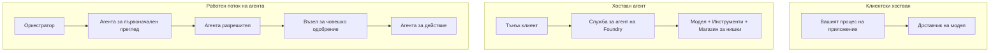
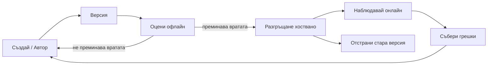
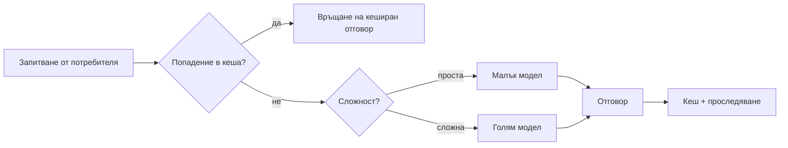
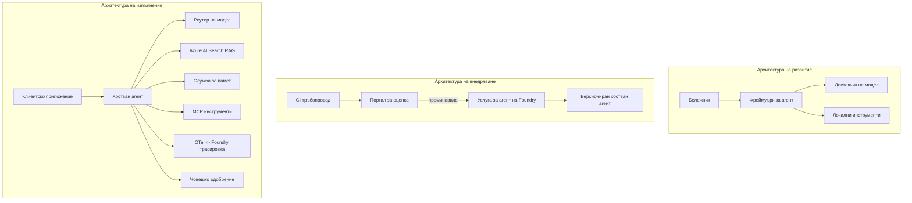

# Разгръщане на мащабируеми агенти с Microsoft Foundry


До този момент в курса сте изграждали агенти, които работят на вашия лаптоп, в бележник, управлявани чрез `az login` и няколко променливи на средата. Това е точно правилният начин за учене. Но това не е правилният начин за стартиране на агент, от който хиляди клиенти зависят в 3 сутринта.

Този урок е за пропастта между "работи на моята машина" и "работи надеждно и икономично в продукция". Ние преодоляваме тази пропаст чрез **Microsoft Foundry** и **Microsoft Foundry Agent Service**, като изграждаме реален агент за клиентска поддръжка с инструменти, извличане, памет, оценка и наблюдение.

## Въведение

Този урок ще обхване:

- Разликата между **прототипен агент** и **разположен агент** и защо преходът се отнася главно до всичко *около* модела.
- **Модели на разгръщане** на агенти: клиентски, хоствани услуги (Hosted Agents) и оркестрирани по работния поток.
- **Жизнен цикъл на агента** в Microsoft Foundry — създаване, версииране, разгръщане, оценка, наблюдение, оттегляне.
- **Стратегии за мащабиране**: маршрутизиране на модела, кеширане, конкуренция и безсъстояние дизайн.
- **Наблюдаемост** с OpenTelemetry и Foundry проследяване.
- **Оптимизация на разходите** чрез избор на модел, маршрутизиране и валидиращи пропуски.
- **Корпоративни съображения**: управление, човешко одобрение и безопасно стартиране на MCP сървъри в продукция.

## Цели на обучението

След завършване на този урок, ще знаете как да:

- Изберете подходящия модел на разгръщане за дадено натоварване на агента.
- Разгърнете агент към Microsoft Foundry Agent Service, за да бъде версиран, управляван и наблюдаем.
- Инструктирате агент за проследяване и да свържете оценяващ канала, който се изпълнява преди всяко издание.
- Приложете маршрутизиране на модела и кеширане, за да държите латентността и разходите под контрол при мащабиране.
- Добавете патрул на човешко одобрение за рискови действия и интегрирайте MCP сървър по безопасен начин в продукция.

## Предварителни условия

Този урок предполага, че сте завършили предишните уроци и сте уверени с:

- Изграждане на агенти с [Microsoft Agent Framework](../14-microsoft-agent-framework/README.md) (Урок 14).
- [Използване на инструменти](../04-tool-use/README.md) (Урок 4) и [Agentic RAG](../05-agentic-rag/README.md) (Урок 5).
- [Памет на агента](../13-agent-memory/README.md) (Урок 13) и [Agentic Protocols / MCP](../11-agentic-protocols/README.md) (Урок 11).
- [Наблюдаемост и оценка](../10-ai-agents-production/README.md) (Урок 10) — този урок надгражда директно върху него.

Също така ще ви трябва:

- **Абонамент за Azure** и **проект в Microsoft Foundry** с поне един разгърнат чат модел.
- **Azure CLI** с автентикация (`az login`).
- Python 3.12+ и пакетите от хранилището [`requirements.txt`](../../../requirements.txt).

## От прототип до продукция: Какво всъщност се променя

Прототипен агент и продукционен агент споделят един и същ основен цикъл — разсъждение, извикване на инструменти, отговор. Това, което се променя, е всичко около този цикъл. Моделът е може би 20% от продукционния агент; останалите 80% са оперативният скелет.

| Въпрос | Прототип | Продукция |
| --- | --- | --- |
| **Хостинг** | Работи в бележника ви | Работи като хоствана услуга, версирано и внедрявано |
| **Идентичност** | Вашият `az login` токен | Управлявана идентичност с обхванат RBAC |
| **Състояние** | В паметта, губи се при рестарт | Екстернализирано (хранилище на теми, услуга за памет) |
| **Неуспех** | Виждате трасиране на грешка | Повторения, резервни варианти, dead-letter, аларми |
| **Разход** | "Няколко цента" | Следено на заявка, маршрутизирано, кеширано, с бюджет |
| **Качество** | Визуална проверка на резултата | Автоматична оценка преди всяко издание |
| **Доверие** | Одобрявате всяко действие | Политика + човешки контрол за рискови действия |

Запомнете тази таблица. Всеки раздел по-долу съответства на един от тези редове.

## Модели за разгръщане на агенти

Има три модела, които ще използвате, често в комбинация.

### 1. Клиентски хоствани агенти

Обектът агент живее вътре в *вашия* процес на приложението. Вашият код директно извиква доставчика на модела; цикълът за разсъждение работи във вашата услуга. Това е, което всеки предишен урок е правил.

- **Използвайте го, когато** имате нужда от пълен контрол над цикъла, персонализирана междинна обработка или вграждане на агента във вече съществуващ бекенд.
- **Компромис**: вие поемате самостоятелно мащабирането, състоянието и устойчивостта.

### 2. Хоствани агенти (Foundry Agent Service)

Агентът е *регистриран като ресурс* в Microsoft Foundry. Foundry хоства цикъла за разсъждение, съхранява теми, налага безопасност на съдържанието и RBAC, и прави агента видим в портала на Foundry. Вашето приложение се превръща в тънък клиент, който създава теми и чете отговори.

- **Използвайте го, когато** искате издръжливост, вградена наблюдаемост, управление и по-малка експлоатационна повърхност.
- **Компромис**: по-малък нисконивоен контрол в замяна на управлявана среда за изпълнение.

### 3. Работни потоци на агенти

Няколко агенти (и инструменти) се съчетават в граф с експлицитен контрол върху потока — последователни стъпки, разклонения, възли за човешко одобрение и дълготрайни контрольни точки, които могат да пауза и възобновят изпълнението. Това е способността Microsoft Agent Framework **Workflows**, приложена на мащаб за разгръщане.

- **Използвайте го, когато** една задача обхваща няколко специализирани агенти или изисква стъпка за одобрение в средата.
- **Компромис**: повече движещи се части; нужда от наблюдаемост на ниво оркестрация.



## Жизнен цикъл на агента в Microsoft Foundry

Разгръщането на агент не е еднократно действие `push`. Това е цикъл и много прилича на цикъл за издание на софтуер, защото точно това е.



Ключовата идея, пренесена от [Урок 10](../10-ai-agents-production/README.md): **оценката офлайн е врата, не следваща мисъл.** Нова версия на агента не се пуска освен ако не премине вашите оценки. Онлайн наблюдаемостта след това връща реални грешки обратно в офлайн тестовия набор. Това е целият цикъл.

## Стратегии за мащабиране

Мащабирането на агент е различно от мащабирането на безсъстояна уеб API, защото всяка заявка може да задейства множество скъпи извиквания на модел и инструменти. Четири техники понасят основната тежест.

**Обработка на безсъстояни заявки.** Не пазете състояние за всеки потребител в паметта на процеса. Записвайте разговорните нишки в хранилището на Foundry или в услуга за памет, така че всеки екземпляр да може да обслужва всяка заявка. Това ви позволява хоризонтално мащабиране — добавяте екземпляри, без "лепкави" сесии.

**Маршрутизиране на модела.** Не всяка заявка изисква най-мощния (и най-скъпия) модел. Насочвайте прости заявки — класификация на намерения, кратки фактически отговори — към малък, бърз модел и резервирайте големия модел за истинско разсъждение. Foundry **Model Router** може да го направи вместо вас или можете сами да изградите лек класификатор. В лабораторията ще изградите "направи си сам" версия.

**Кеширане на отговори.** Много запитвания за поддръжка са почти дубликати ("как да нулирам паролата си?"). Кеширайте отговори на често задавани въпроси и ги предоставяйте без да изпращате заявка към модела. Дори умерена кешираща ефективност значително намалява разходите и латентността.

**Конкуренция и обратен натиск.** Доставчиците на модели имат ограничения за честотата. Ограничете конкуренцията си, използвайте повторения с експоненциален оттеглящ се интервал и се проваляйте елегантно (чекирана "работим по въпроса" отговор е по-добър от 500).



## Наблюдаемост в продукция

Не можете да управлявате това, което не можете да видите. Както беше разгледано в Урок 10, Microsoft Agent Framework излъчва **OpenTelemetry** трасирания нативно — всяко повикване на модел, извикване на инструмент и стъпка в оркестрацията става спан. В продукция експортирате тези спанове към Microsoft Foundry (или всяка съвместима с OTel бекенд система), за да може да:

- Проследявате една клиентска жалба от край до край през всички повиквания на модел и инструмент.
- Наблюдавате латентност p50/p95 и разходи за заявка във времето.
- Алармирате при спайкове на грешки и аномалии в разхода преди вашите потребители (или финансовия ви екип) да ги забележат.

```python
from agent_framework.observability import get_tracer

tracer = get_tracer()

with tracer.start_as_current_span("support_request") as span:
    span.set_attribute("customer.tier", "enterprise")
    span.set_attribute("routed.model", "gpt-5-nano")
    # изпълнението на агента се проследява автоматично в този интервал
```

Атрибути като `customer.tier` и `routed.model` превръщат множество проследявания в отговорими въпроси ("правят ли се твърде често маршрути за корпоративни клиенти към малкия модел?").

## Оптимизация на разходите

Разходите в продукционните агенти са доминирани от токени. Три лоста, подредени по въздействие:

1. **Правилен избор на модел.** Малък модел, който преминава вашата оценка, почти винаги е по-евтин от голям, който също преминава. Използвайте оценяване, за да *докажете*, че малкият модел е достатъчен, вместо по подразбиране да избирате най-големия от предпазливост.
2. **Маршрут според сложността.** Както по-горе – плащате цената на голям модел само за заявки, които се нуждаят от голямо разсъждение.
3. **Агресивно кеширане.** Най-евтиното повикване на модел е това, което никога не правите.

Валидационните пропуски и контролът на разходите са една и съща дисциплина, разгледана от два аспекта: оценката ви дава *минималното качество*, маршрутирането и кеширането ви държат възможно най-близо до *разходите* на тази минимална стойност.

## Корпоративни съображения при разгръщане

**Управление.** Хостваните агенти наследяват RBAC, безопасност на съдържанието и регистрация на одит от Foundry. Дайте на всеки агент управлявана идентичност с минимални права — само за четене на базата знания, ограничен достъп до API за тикети, нищо повече.

**Човек в цикъла.** Някои действия са твърде важни, за да се автоматизират напълно — издаване на възстановяване на сума, изтриване на акаунт, ескалация към юридически екип. Microsoft Agent Framework поддържа инструменти с **изискване за одобрение**: агентът предлага действие, изпълнението спира, човек одобрява или отхвърля, и работният поток продължава. Виждахте този примитив в [Урок 6](../06-building-trustworthy-agents/README.md); тук го разгърнете.

**MCP в продукция.** [MCP](../11-agentic-protocols/README.md) позволява на агента да ползва външни инструменти чрез стандартен интерфейс. В продукция третирайте всеки MCP сървър като ненадеждна граница: задайте версия на сървъра, стартирайте го с ограничена идентичност, валидирайте изходите му и никога не споделяйте с него тайни. MCP сървърът е зависимост, която се поддържа с пачове, одити и ограничение на честотата.



Тези три диаграми — разработка, разгръщане, време на работа — са един и същи агент в три етапа от живота му. Следващата лабораторна работа ви води през изграждането му.

## Практическа лаборатория: Готов агент за клиентска поддръжка в продукция

Отворете [`code_samples/16-python-agent-framework.ipynb`](./code_samples/16-python-agent-framework.ipynb) и го преминете цялостно. Ще сглобите **агент за клиентска поддръжка Contoso** с вградени всички продукционни съображения:

1. **Извикване на инструменти** — преглеждане на статус на поръчка и отваряне на тикети за поддръжка.
2. **RAG** — отговаряне на въпроси по политика от база данни (Azure AI Search, с резервен вариант в паметта, така че бележникът да се стартира без ресурс за Search).
3. **Памет** — запомняне на клиента през ходовете на разговора.
4. **Маршрутизиране на модел** — класификатор за сложност насочва всяка заявка към малък или голям модел.
5. **Кеширане на отговори** — повторни въпроси се обслужват от кеша.
6. **Човешко одобрение** — възстановявания над праг се паузират за одобрение от човек.
7. **Оценяващ канал** — малък офлайн тестов набор оценява агента и действа като пропуск за изданието.
8. **Наблюдаемост** — OpenTelemetry проследяване на всяка заявка.

### Преглед

Бележникът е организиран така, че всяка продукционна грижа е самостоятелен, изпълним раздел. Сърцето му е обработчикът на заявки с маршрутизиране и кеширане:

```python
async def handle_support_request(query: str, customer_id: str) -> str:
    # 1. Обслужвайте от кеша, когато е възможно.
    cached = response_cache.get(normalize(query))
    if cached:
        return cached

    # 2. Рутвайте по сложност за контрол на разходите.
    model = "gpt-5-nano" if is_simple(query) else "gpt-5-mini"

    # 3. Стартирайте агента вътре в trace span за наблюдаемост.
    with tracer.start_as_current_span("support_request") as span:
        span.set_attribute("routed.model", model)
        span.set_attribute("customer.id", customer_id)
        response = await support_agent.run(query, model=model)

    # 4. Кеширайте и върнете.
    response_cache.set(normalize(query), response.text)
    return response.text
```

Пропускът за оценка, който пази изданието, изглежда така:

```python
async def evaluation_gate(agent, test_cases, threshold: float = 0.8) -> bool:
    passed = 0
    for case in test_cases:
        result = await agent.run(case["input"])
        if score_response(result.text, case["expected"]) >= 0.8:
            passed += 1
    pass_rate = passed / len(test_cases)
    print(f"Evaluation pass rate: {pass_rate:.0%} (gate: {threshold:.0%})")
    return pass_rate >= threshold  # изполвайте само ако портата е преминала успешно
```

Четете всеки ред — бележникът съзнателно държи примитивите малки, така че нищо да не е скрито зад извикване към рамка.

## Валидиране на разположен агент с пушек тестове

Горното оценяващо врата работи *офлайн* с вашия агентен обект. След като агентът е разположен като Hosted Agent, ви трябва още една, по-евтина проверка: **дали разположената крайна точка наистина отговаря?**

"Успешното" разгръщане само доказва, че контролният план е приел дефиницията — то не доказва, че агентът отговаря. Липсваща зависимост, грешно маршрутизиране на модела или изтекла връзка могат да оставят зелено разгръщане, което не връща нищо. **Пушек тест** улавя това за секунди, при всяко разгръщане, без разходите на пълна оценка.

Това хранилище съдържа готов за ползване канал за пушек тест, базиран на [AI Smoke Test](https://github.com/marketplace/actions/ai-smoke-test) GitHub Action:

- **Каталог** — [`tests/lesson-16-smoke-tests.json`](../../../tests/lesson-16-smoke-tests.json) съдържа заявки и твърдения за агента за поддръжка Contoso (отговори на основани на политика въпроси, търсене на поръчка, оставане в темата, и мултиходова непрекъснатост на нишката). Каталози за агенти от други уроци са също налични — вижте [`tests/README.md`](../tests/README.md).
- **Работен поток** — [`.github/workflows/smoke-test.yml`](../../../.github/workflows/smoke-test.yml) влиза с Azure OIDC и изпраща всеки въпрос към Responses крайна точка на агента чрез POST, проваляйки задачата при пропуск на което и да е твърдение.

```yaml
- name: Smoke-test hosted agent
  uses: JFolberth/ai-smoketest@v1
  with:
    project_endpoint: ${{ inputs.project_endpoint }}
    agent_name: ContosoSupportAgent
    tests_file: tests/lesson-16-smoke-tests.json
```


Стартирайте го от раздела **Actions**, след като вашият агент е разположен, като подадете крайна точка на проекта си в Foundry и името на агента. Федеративната идентичност трябва да има ролята **Azure AI User** в обхвата на проекта Foundry. Помислете за слоевете като за пирамида: тестовете за дим (достъпен ли е и отговаря ли?) се изпълняват при всяко разполагане, офлайн оценката (достатъчно добра ли е за пускане?) се изпълнява преди промоция, а онлайн оценката (как се справя в реалната среда?) се изпълнява непрекъснато.

## Проверка на знанията

Провери разбирането си преди да преминеш към задачата.

**1. Приблизително колко голяма част от един производствен агент е „моделът“ и какво е останалото?**

<details>
<summary>Отговор</summary>

Моделът е малцинството в системата — често цитиран като около 20%. Останалото е оперативният скелет: хостинг и версиониране, идентичност и RBAC, външно състояние, обработка на грешки, отчитане на разходите, оценка и контрол на човека в цикъла. Преходът към производството е основно изграждане на всичко *около* цикъла на разсъждение.
</details>

**2. Кога бихте избрали Hosted Agent пред клиентски хостван агент?**

<details>
<summary>Отговор</summary>

Когато искате управлявана среда с вградена устойчивост (нишки, които продължават и могат да възобновят), наблюдаемост, безопасност на съдържанието и RBAC и сте готови да жертвате някакъв ниско ниво контрол над цикъла на разсъждение, за да имате по-малка оперативна повърхност. Клиентски хостваният е предпочитан, когато имате нужда от пълен контрол над цикъла или когато вграждате агента в съществуващ бекенд.
</details>

**3. Защо мащабируем агент трябва да е безсъстоялен в паметта на собствения си процес?**

<details>
<summary>Отговор</summary>

За да може всяка инстанция да обработва произволна заявка, което позволява хоризонтално скалиране без „залепнали сесии“. Състоянието на разговора за потребител е външно съхранено в нишков магазин или паметна услуга. Ако състоянието живееше в паметта на процеса, щеше да се загуби при рестарт и не бихте могли свободно да разпределяте натоварването.
</details>

**4. Какъв проблем решава маршрутизирането на модела и как се свързва с оценката?**

<details>
<summary>Отговор</summary>

Маршрутизирането изпраща прости заявки към малък, евтин и бърз модел и запазва големия модел за истинско разсъждение, като контролира както латентността, така и разходите. Свързва се с оценката, защото оценката е това, което *доказва*, че малкият модел е достатъчно добър за даден клас заявки — маршрутизирането без оценка е предположение.
</details>

**5. Какво е „пропускателна врата“ за оценка и къде се намира в жизнения цикъл?**

<details>
<summary>Отговор</summary>

Оценъчната „пропускателна врата“ изпълнява офлайн тестов набор срещу нова версия на агента и блокира разполагането, освен ако процентът на преминаване не надвиши прага. Намира се между „версия“ и „разполагане“ в жизнения цикъл, като прави качеството предпоставка за пускане, а не нещо, което проверявате след пускането.
</details>

**6. Защо MCP сървърът трябва да се третира като ненадеждна граница в продукцията?**

<details>
<summary>Отговор</summary>

Защото е външна зависимост, към която вашият агент прави повиквания. Трябва да фиксирате версията му, да го изпълнявате с ограничена идентичност, да валидирате изхода му, да ограничавате честотата на презапитвания и никога да не излагате тайни на него — същата дисциплина, която прилагате към всяка трета страна. Неговите изходни данни влизат в разсъжденията на вашия агент, затова невярната валидация представлява риск за сигурността.
</details>

**7. Коя единична промяна обикновено има най-голямо влияние върху разходите на производствения агент и защо?**

<details>
<summary>Отговор</summary>

Подходящ размер на модела — използване на най-малкия модел, който все още преминава вашата оценъчна „пропускателна врата“. Разходите се доминират от токените, и по-малкият модел, който покрива качествената норма, почти винаги е по-евтин от по-големия. Кеширането и маршрутизирането след това намаляват още разходите, но изборът на правилния базов модел има най-голям първичен ефект.
</details>

**8. Каква роля играят атрибутите на спана като `customer.tier` и `routed.model` в наблюдаемостта?**

<details>
<summary>Отговор</summary>

Те превръщат суровите трасета в отговорими бизнес въпроси. Без атрибути имате стена от спанове; с тях можете да питате „дали корпоративните клиенти се маршрутизират към малкия модел твърде често?“ или „кой модел обработва най-бавните ни заявки?“ Атрибутите са начинът да пресеете телеметрията по измерения, които са важни за вашата операция.
</details>

## Задача

Вземете агента за клиентска поддръжка от лабораторията и го усили за конкретен сценарий: **агент за поддръжка на абонаментни плащания за SaaS компания.**

Вашата задача трябва да:

1. **Замени инструментите** с такива, свързани с фактуриране: `get_subscription_status`, `get_invoice` и `issue_credit` (кредитите над $50 изискват човешко одобрение).
2. **Добави три RAG документа**, обхващащи политиката за възстановяване на компанията, цикъла на фактуриране и политиката за отказ.
3. **Разшири оценъчния набор** поне до осем случая, включително поне два, които *трябва* да задействат пътеката за човешко одобрение, и потвърди, че оценъчната врата преминава или отпада правилно.
4. **Добави един отчет за разходите**: след изпълнение на десет смесени заявки през агента, отпечатай колко от тях са отишли към малкия модел, колко към големия модел и колко са обслужени от кеша.

Напиши кратък абзац (в markdown клетка), обясняващ коя правило за маршрутизиране на модел избра и как би го валидирал с реален трафик. Няма единствен правилен отговор — оценявате се по това дали производствените съображения са свързани по смислен начин.

## Обобщение

В този урок преместихте агент от прототип към производство с Microsoft Foundry:

- Скокът към производство е главно за **оперативния скелет** около модела — хостинг, идентичност, състояние, обработка на грешки, разходи, качество и доверие.
- Научихте трите **модела на разполагане** — клиентски хостван, Hosted Agents и Agent Workflows — и кога всеки е подходящ.
- Придвижихте се през **животния цикъл на агента**, където офлайн оценката действа като „пропускателна врата“ за пускане, а онлайн наблюдаемостта връща грешки обратно в тестовия набор.
- Прилагахте **стратегии за мащабиране** — безсъстоялен дизайн, маршрутизиране на модел, кеширане и ограничено съпровождение — и свързахте тези с **оптимизация на разходите**.
- Вързахте **корпоративни контроли**: RBAC, човешко одобрение в цикъла и производствено безопасна интеграция на MCP.
- Изградихте **производствен готов агент за клиентска поддръжка**, който свързва всички тези съображения в изпълним код.

Следващият урок върви в обратната посока: вместо да разширявате агентите в облака, ще ги спуснете *надолу* върху една машина за разработка и ще ги изпълнявате изцяло локално.

## Допълнителни ресурси

- <a href="https://learn.microsoft.com/azure/ai-foundry/what-is-azure-ai-foundry" target="_blank">Документация на Microsoft Foundry</a>
- <a href="https://learn.microsoft.com/azure/ai-foundry/agents/overview" target="_blank">Обзор на Microsoft Foundry Agent Service</a>
- <a href="https://learn.microsoft.com/en-us/agent-framework/overview/?wt.mc_id=youtube_26688_organicsocial_reactor&pivots=programming-language-python" target="_blank">Microsoft Agent Framework</a>
- <a href="https://learn.microsoft.com/azure/ai-foundry/concepts/model-router" target="_blank">Моделен маршрутизатор в Microsoft Foundry</a>
- <a href="https://learn.microsoft.com/azure/search/search-what-is-azure-search" target="_blank">Azure AI Search</a>
- <a href="https://opentelemetry.io/" target="_blank">OpenTelemetry</a>
- <a href="https://github.com/marketplace/actions/ai-smoke-test" target="_blank">AI Smoke Test GitHub Action</a>
- <a href="https://modelcontextprotocol.io/" target="_blank">Model Context Protocol (MCP)</a>

## Предишен урок

[Създаване на агенти за използване на компютър (CUA)](../15-browser-use/README.md)

## Следващ урок

[Създаване на локални AI агенти](../17-creating-local-ai-agents/README.md)

---

<!-- CO-OP TRANSLATOR DISCLAIMER START -->
**Отказ от отговорност**:
Този документ е преведен с помощта на AI преводачески услуга [Co-op Translator](https://github.com/Azure/co-op-translator). Въпреки че се стремим към точност, моля имайте предвид, че автоматизираните преводи могат да съдържат грешки или неточности. Оригиналният документ на неговия роден език трябва да се счита за авторитетен източник. За критична информация се препоръчва професионален човешки превод. Ние не носим отговорност за каквито и да е недоразумения или неправилни тълкувания, произтичащи от използването на този превод.
<!-- CO-OP TRANSLATOR DISCLAIMER END -->