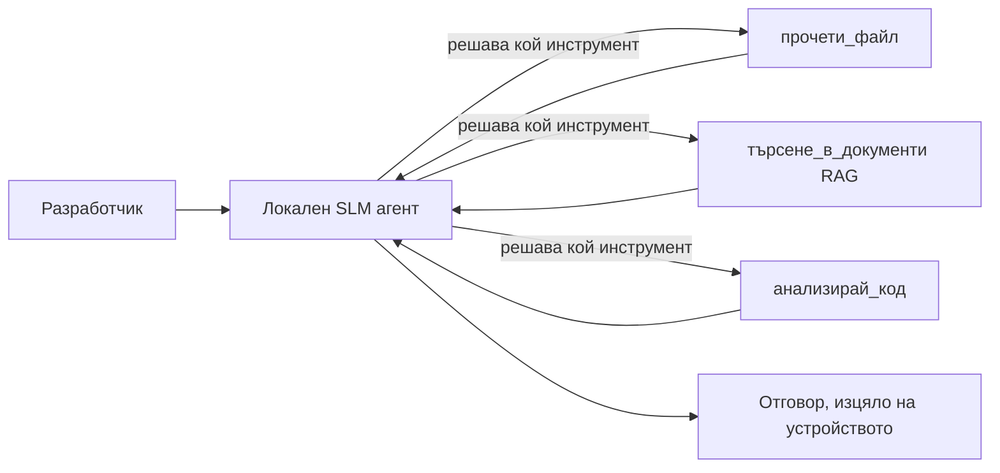
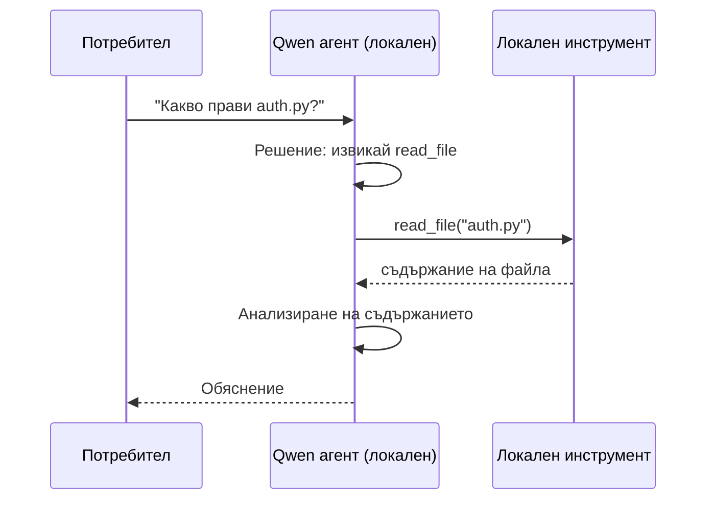
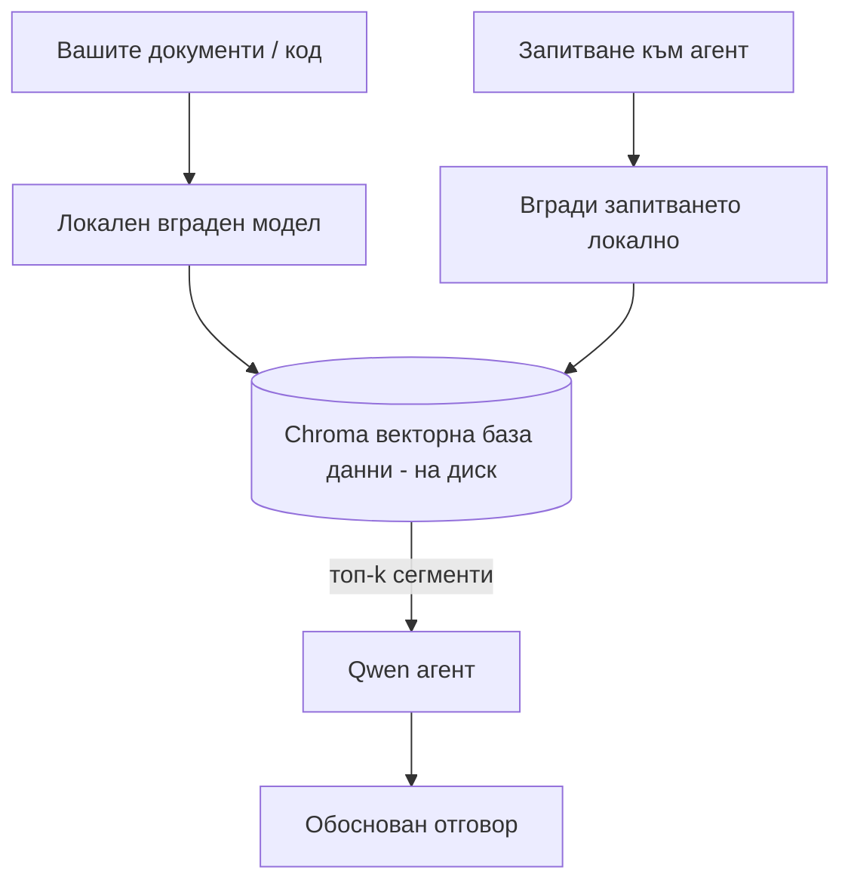
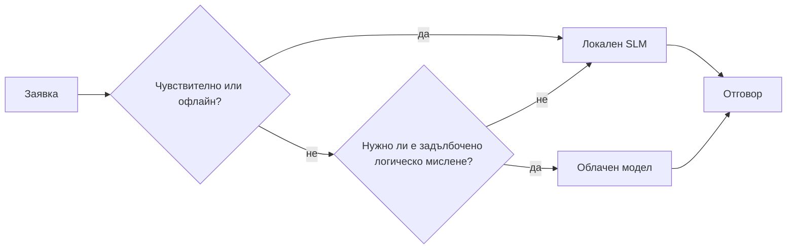

# Създаване на локални AI агенти с Microsoft Foundry Local и Qwen


Предишният урок мащабира агентите *нагоре* в облака. Този ги спуска *надолу* на една машина. В края ще имате работещ инженеринг асистент, който разсъждава, извиква инструменти, чете вашите файлове и търси в документацията — **без нито едно обаждане за извод от облака.**

Защо бихте искали това? Три причини, които постоянно се появяват в реалната инженерна работа:

- **Поверителност.** Кодът и документите никога не напускат машината. Никакви заявки, откъси или данни на клиенти не преминават през мрежовата граница.
- **Разходи.** Локалното извеждане няма такса на токен. Можете да итерирате цял ден за цената на електричеството.
- **Офлайн.** На самолет, в защитено съоръжение или по време на прекъсване, агентът все още работи.

Уловката е, че обменяте водещ модел в облака за **Малък езиков модел (SLM)**, който работи на вашия CPU, GPU или NPU. Този урок е за създаване на агенти, които са *добри* в това ограничение, а не за преструване, че ограничението не съществува.

## Въведение

Този урок ще обхване:

- **Малки езикови модели (SLM)** — какво представляват, къде блестят и къде не.
- **Microsoft Foundry Local** — среда за изпълнение, която изтегля и обслужва модели на устройството чрез **API, съвместим с OpenAI**.
- **Qwen модели с повикване на функции** — SLM, които надеждно генерират извиквания на инструменти, което прави възможни локалните *агенти* (не само локален чат).
- **Локални инструменти, локален RAG и локален MCP** — които дават възможности на агента без облака.
- **Хибридни модели** — кога да се използва локалното и кога облакът.

## Учебни цели

След приключване на този урок ще знаете как да:

- Обяснявате компромисите при SLM и избирате подходящи случаи за употреба на локални агенти.
- Обслужвате Qwen модел локално с Foundry Local и го свързвате чрез OpenAI-съвместима крайна точка.
- Създавате агент, извикващ инструменти, който работи изцяло на вашата работна станция.
- Добавяте локален RAG върху собствените си документи, използвайки локална векторна база данни (Chroma).
- Свързвате агента с локален MCP сървър и разсъждавате за хибридни локални/облачни дизайни.

## Предварителни изисквания

Урокът предполага, че сте преминали предишните и сте запознати с:

- [Използване на инструменти](../04-tool-use/README.md) (Урок 4) и [Agentic RAG](../05-agentic-rag/README.md) (Урок 5).
- [Agentic протоколи / MCP](../11-agentic-protocols/README.md) (Урок 11).
- [Microsoft Agent Framework](../14-microsoft-agent-framework/README.md) (Урок 14).

Също ще ви трябва:

- Работна станция за разработчици. **8 GB RAM е реалистичен минимум**; 16 GB+ е удобно. GPU или NPU помага, но не е задължително.
- Инсталиран **Microsoft Foundry Local** (вижте секцията за настройка по-долу).
- Python 3.12+ и пакетите в репото [`requirements.txt`](../../../requirements.txt), плюс `foundry-local-sdk`, `openai` и `chromadb` за този урок.

## Малки езикови модели: правилният инструмент за локална работа

Водещ облачен модел има стотици милиарди параметри и център за данни зад него. SLM има няколко милиарда параметри и трябва да се побере в RAM паметта на лаптопа ви. Тази разлика задава ясни очаквания.

**SLM са добри в:**

- Структурирани, ограничени задачи — класификация, извличане, обобщение на известен документ.
- **Извикване на инструменти** — решаване коя функция да се извика и с какви аргументи.
- Бърза, евтина и поверителна итерация върху собствените ви данни.

**SLM са по-слаби в:**

- Отворено, многократно разсъждение през голям контекст.
- Широки световни знания (виждали са по-малко и забравят повече).

Печелившата стратегия за локални агенти е: **нека SLM оркестрира, а инструментите да вършат тежката работа.** Моделът не трябва да *знае* вашия код — трябва да знае кога да извика `read_file` и `search_docs`. Това директно играе на силните страни на SLM.



## Microsoft Foundry Local

**Microsoft Foundry Local** е лека среда за изпълнение, която изтегля, управлява и обслужва модели изцяло на вашата машина. Неговата най-важна характеристика за нас е, че предлага **OpenAI-съвместима HTTP крайна точка** — което означава, че OpenAI SDK и OpenAI клиентът на Microsoft Agent Framework работят с нея само с промяна на `base_url`. Всичко, което сте научили за създаване на агенти, се пренася директно; само крайната точка се премества от облака на `localhost`.

Foundry Local също автоматично избира най-добрата версия на модела за вашия хардуер — изпълнение на CPU, CUDA/GPU или NPU — така че не се налага ръчно оптимизиране за всяка машина.

### Настройка

Инсталирайте Foundry Local (вижте [документацията](https://learn.microsoft.com/azure/ai-foundry/foundry-local/) за вашата ОС), след това потвърдете, че работи:

```bash
# Инсталирайте (пример; следвайте документацията за вашата платформа)
winget install Microsoft.FoundryLocal      # Windows
# brew install microsoft/foundrylocal/foundrylocal   # macOS

# Изтеглете и стартирайте модел Qwen, след което стартирайте локалната услуга
foundry model run qwen2.5-7b-instruct
foundry service status
```

След като услугата работи, имате локална OpenAI-съвместима крайна точка (обикновено `http://localhost:PORT/v1`). Бележникът използва `foundry-local-sdk` за автоматично откриване на крайната точка, така че не трябва да жоркодвате порта.

## Извикване на функции в Qwen: защо е важно

Агент е агент само ако може да извиква инструменти. Много SLM могат да чатят, но произвеждат ненадеждни, неправилно формирани извиквания на инструменти. **Qwen** моделите са обучени за извикване на функции и последователно излъчват правилна структура на повикванията на инструменти — точно това превръща локален чат модел в локален *агент*.

Потокът е стандартната циклична извикваща механика, която вече знаете, просто работи на устройството:



## Локален RAG

Търсенето в документация е мястото, където локалните агенти се доказват. Вместо да се надявате SLM да е запомнил документацията на вашия фреймуърк, вграждате тези документи в **локална векторна база данни** и позволявате на агента да извлича съответните части при поискване.

Използваме **Chroma**, вградена векторна база данни, която работи във вътрешния процес без сървър за управление. Потокът е изцяло локален: локален ембединг модел → локални вектори → локално извличане → локален SLM.



Това е същият Agentic RAG модел от Урок 5 — единствената промяна е, че всеки компонент работи на вашата машина.

## Локални MCP сървъри

[MCP](../11-agentic-protocols/README.md) е транспортен протокол, а не облачна услуга. MCP сървър може да работи като локален процес на `stdio`, предоставяйки инструменти на вашия агент по стандартния протокол. Това ви позволява да преизползвате нарастващата екосистема от MCP сървъри — достъп до файловата система, git операции, заявки към бази данни — изцяло офлайн.

Сигурността е различна от тази в облака, но не липсва: локален MCP сървър работи с разрешенията на вашия потребител, затова ограничете какво може да докосва (например директория на проект, а не целия ви личен каталог) и третирайте изходните му данни като входни, които трябва да проверявате.

## Хибридни локални и облачни модели

Локално-първо не означава само локално. Зрелите системи пренасочват според чувствителността и сложността:

| Ситуация | Къде работи |
| --- | --- |
| Чувствителен код / данни или офлайн | **Локален SLM** |
| Проста, ограничена задача | **Локален SLM** (евтин, бърз) |
| Трудно многократно разсъждение върху нечувствителни данни | **Облачен модел** |
| Всичко по време на прекъсване | **Локален SLM** (грациозна деградация) |

Това отразява идеята за **маршрутизиране на модели** от Урок 16 — с тази разлика, че един от "моделите" вече е вашата машина. Здравият дизайн отстъпва на локалното, когато облакът е недостъпен, така че агентът намалява качеството, а не спира да работи.



## Практическа лаборатория: локален инженеринг асистент

Отворете [`code_samples/17-local-agent-foundry-local.ipynb`](./code_samples/17-local-agent-foundry-local.ipynb) и го разгледайте. Ще създадете **локален инженеринг асистент**, който работи изцяло на вашата работна станция и може:

1. **Да извиква инструменти** — чрез Qwen function calling през Foundry Local.
2. **Да извършва локални операции с файлове** — изброяване и четене на файлове в директория на проекта.
3. **Да анализира код** — извежда основни метрики върху изходен файл.
4. **Да търси в документация** — локален RAG върху директория с документи с Chroma.
5. **Да използва MCP** — да се свързва с локален MCP сървър (с фин пропуск, ако няма конфигурация).

Не се използва облачно извеждане в нито един момент.

### Преглед

Асистентът се свързва с Foundry Local през OpenAI-съвместимата крайна точка, така че кодът на агента изглежда почти идентичен на този от уроците за облака — само клиентът е различен:

```python
from foundry_local import FoundryLocalManager
from openai import OpenAI

# Foundry Local открива/изтегля модела и ни предоставя локален крайна точка.
manager = FoundryLocalManager(\"qwen2.5-7b-instruct\")
client = OpenAI(base_url=manager.endpoint, api_key=manager.api_key)  # api_key е локален запълнител
```

Инструментите са обикновени Python функции, ограничени до директория на проект:

```python
def read_file(path: str) -> str:
    \"\"\"Read a file, but only inside the sandboxed project directory.\"\"\"
    full = (PROJECT_ROOT / path).resolve()
    if PROJECT_ROOT not in full.parents and full != PROJECT_ROOT:
        return \"Access denied: path is outside the project directory.\"
    return full.read_text(encoding=\"utf-8\")
```

Обърнете внимание на проверката на пясъчника — дори локално, инструмент, който чете произволни пътища, е рискован. Бележникът ограничава всеки инструмент до една коренова директория на проект.

## Проверка на знанията

Тествайте разбирането си преди да преминете към задачата.

**1. Дайте две конкретни причини да пуснете агент локално, а не в облака.**

<details>
<summary>Отговор</summary>

Всяка от двете: **поверителност** (кодът и данните никога не напускат машината), **разходи** (няма такса на токен за извеждане) и **офлайн възможност** (работи без мрежа — на самолет, в защитено съоръжение или при прекъсване). Регулаторни/съобразителни ограничения, които забраняват изпращането на данни извън устройството, са честа причина за поверителността.
</details>

**2. Какво е препоръчителното разделение на труда между SLM и инструментите му в локален агент и защо?**

<details>
<summary>Отговор</summary>

Нека SLM да **оркестрира** (да решава кой инструмент да извика и с какви аргументи), а инструментите да вършат **тежката работа** (четене на файлове, извличане на документи, изчисляване на резултати). SLM са силни в ограничени решения като избор на инструменти, но слаби при широки знания и дълго многократно разсъждение, затова разчитането на инструменти използва тяхната сила.
</details>

**3. Какво прави възможно преизползването на облачен агентен код с Foundry Local?**

<details>
<summary>Отговор</summary>

Foundry Local предлага **OpenAI-съвместима HTTP крайна точка**. OpenAI SDK и OpenAI клиентът на Agent Framework работят с нея само с промяна на `base_url` (и използване на локален API ключ-запълнител). Всичко останало в кода на агента остава същото.
</details>

**4. Защо конкретно използваме Qwen модел за извикване на функции, а не произволен SLM?**

<details>
<summary>Отговор</summary>

Защото агентът трябва да произвежда надеждни, добре формирани **извиквания на инструменти**. Много SLM могат да чатят, но генерират неправилни или непоследователни структури за извикване на инструменти. Qwen моделите са обучени за извикване на функции и създават последователни извиквания на инструменти, което прави локален чат модел в работещ локален агент.
</details>

**5. Кои компоненти от локалния RAG поток работят на машината?**

<details>
<summary>Отговор</summary>

Всички: ембединг моделът, векторната база данни (Chroma, на диск), стъпката за извличане и SLM. Документите са вграждани локално, съхранявани локално, извличани локално и разсъждавани от локален модел — нито един компонент не докосва облака.
</details>

**6. Локален MCP сървър работи на вашата машина. Прави ли това сървъра автоматично безопасен? Какви предпазни мерки трябва да вземете?**

<details>
<summary>Отговор</summary>

Не. Локален MCP сървър работи с разрешенията на вашия потребител, така че може да докосва всичко, до което имате достъп. Ограничете го до необходимото (например една директория на проект, а не целия домашен каталог) и третирайте изходните му данни като входни, които трябва да бъдат проверявани преди изпълнение.
</details>

**7. Опишете разумно правило за хибридно маршрутизиране, включващо локален модел.**

<details>
<summary>Отговор</summary>

Насочвайте чувствителни или офлайн заявки към локалния SLM; прости ограничени задачи — към локалния SLM за скорост и цена; сложни многократни разсъждения върху нечувствителни данни — към облачен модел; и се връщайте към локалния SLM, ако облакът липсва, така че агентът да деградира плавно, а не да спира работа. Това е маршрутизиране на модели (Урок 16), като локалната машина е един от моделите.
</details>

**8. Каква е реалистичната минимална стойност на RAM за пускане на локалния агент в този урок и какво ви дава повече RAM?**

<details>
<summary>Отговор</summary>

Около **8 GB** е реалистичен минимум; 16 GB+ е удобно. Повече RAM ви позволява да пускате по-големи и по-способни модели и да държите повече контекст в паметта. GPU или NPU ускоряват извеждането, но не са задължителни — Foundry Local избира CPU билд, когато няма ускорител.
</details>

## Задача

Разширете локалния инженеринг асистент до **локален преглеждач на документация** за малък проект по ваш избор (можете да използвате някоя от учебните папки на това репо).

Вашата задача трябва да:

1. **Индексира реална папка с документи/код** в Chroma (поне пет файла).
2. **Добави инструмент `find_todos`**, който сканира проекта за коментари `TODO`/`FIXME` и ги връща с файл и номер на ред — спазвайки същата проверка на пясъчника като при `read_file`.

3. **Задайте на агента три въпроса**, които го принуждават да комбинира инструменти: един чист RAG въпрос, един, който изисква четене на конкретен файл, и един, който изисква намиране на TODO-та.
4. **Измерете го**: времето за отговор на всеки от трите въпроса и ги запишете в markdown клетка. Коментирайте дали латентността е приемлива за вашия предназначен работен процес.

След това напишете кратък параграф за **което бихте преместили в облака и кое бихте запазили локално** за този прегледач, и защо. Оценявате се по това дали локалните компоненти са правилно свързани и дали вашето хибридно разсъждение е здраво — не по качеството на модела.

## Обобщение

В този урок изградихте агент, който работи изцяло на вашата собствена машина:

- **SLMs** жертват обхвата заради поверителност, разходи и работа офлайн — и блестят, когато **оркестират инструменти**, вместо да носят всичкото знание сами.
- **Foundry Local** обслужва модели на устройството зад **OpenAI-съвместима крайна точка**, така че кодът за вашия облачен агент се прехвърля с една промяна на ред.
- **Qwen модели с извикване на функции** правят надеждното локално извикване на инструменти — и следователно локални *агенти* — възможно.
- **Локален RAG** (Chroma) и **локален MCP** дават възможност на агента, без да излиза от машината.
- **Хибридни модели** ви позволяват да маршрутизирате според чувствителността и трудността, с локалното като елегантен резервен вариант.

Това завършва арката на внедряването: Урок 16 мащабира агентите във Microsoft Foundry, а този урок ги мащабира надолу до една работна станция. Следващият урок се фокусира върху осигуряването на внедрените агенти.

## Допълнителни ресурси

- <a href="https://learn.microsoft.com/azure/ai-foundry/foundry-local/" target="_blank">Документация за Microsoft Foundry Local</a>
- <a href="https://learn.microsoft.com/azure/ai-foundry/what-is-azure-ai-foundry" target="_blank">Документация за Microsoft Foundry</a>
- <a href="https://learn.microsoft.com/en-us/agent-framework/overview/?wt.mc_id=youtube_26688_organicsocial_reactor&pivots=programming-language-python" target="_blank">Microsoft Agent Framework</a>
- <a href="https://qwen.readthedocs.io/en/latest/framework/function_call.html" target="_blank">Документация за извикване на функции в Qwen</a>
- <a href="https://modelcontextprotocol.io/" target="_blank">Model Context Protocol (MCP)</a>
- <a href="https://docs.trychroma.com/" target="_blank">Chroma векторна база данни</a>

## Предишен урок

[Внедряване на мащабируеми агенти](../16-deploying-scalable-agents/README.md)

## Следващ урок

[Осигуряване на AI агенти](../18-securing-ai-agents/README.md)

---

<!-- CO-OP TRANSLATOR DISCLAIMER START -->
**Отказ от отговорност**:
Този документ е преведен с помощта на AI преводачески услуга [Co-op Translator](https://github.com/Azure/co-op-translator). Въпреки че се стремим към точност, моля имайте предвид, че автоматизираните преводи могат да съдържат грешки или неточности. Оригиналният документ на неговия роден език трябва да се счита за авторитетен източник. За критична информация се препоръчва професионален човешки превод. Ние не носим отговорност за каквито и да е недоразумения или неправилни тълкувания, произтичащи от използването на този превод.
<!-- CO-OP TRANSLATOR DISCLAIMER END -->