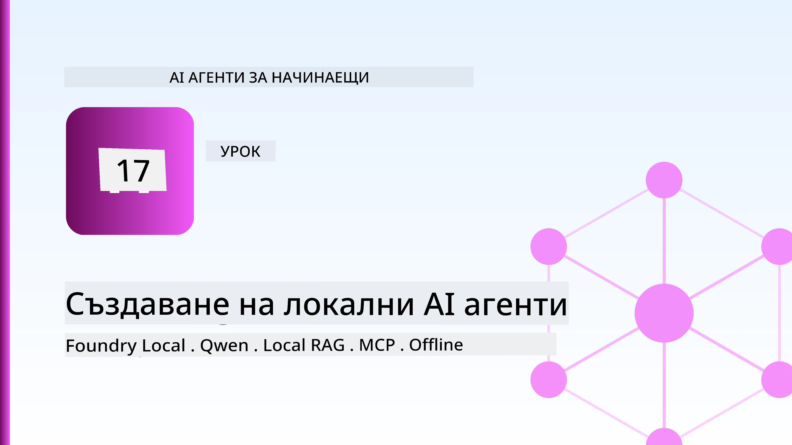
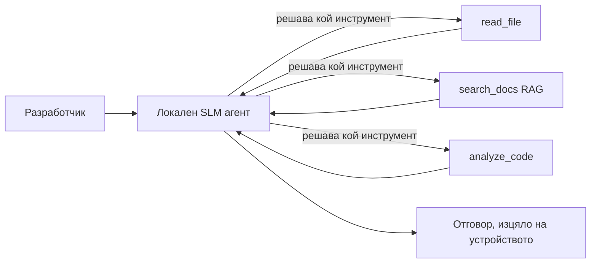
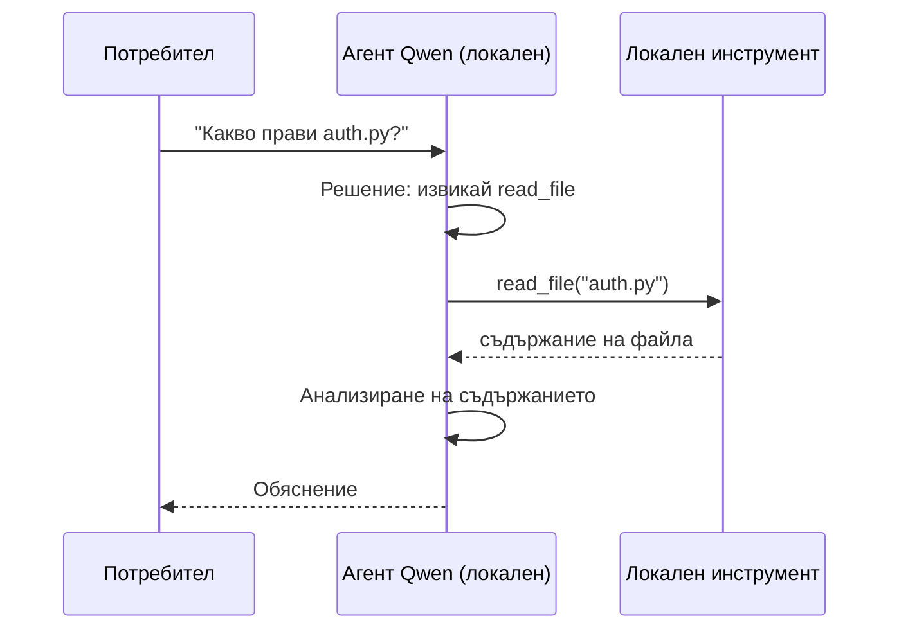
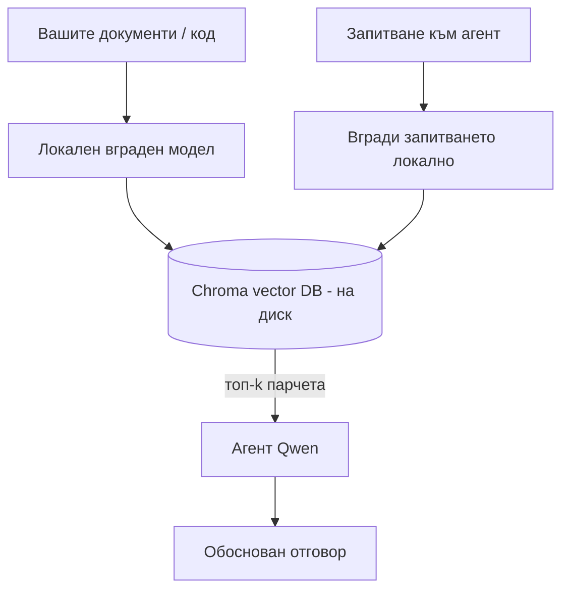

# Създаване на локални AI агенти с Microsoft Foundry Local и Qwen



Предишният урок увеличи агенти *към* облака. Този ги пренася *надолу* на една машина. Към края ще имате работещ инженеринг асистент, който може да разсъждава, да извиква инструменти, да чете вашите файлове и да търси във вашата документация — **без нито едно извикване към облачна инференция.**

Защо бихте искали това? Три причини, които непрекъснато се срещат в реална инженерна работа:

- **Поверителност.** Кодът и документите никога не напускат машината. Никакви заявки, парчета или клиентски данни не преминават през мрежовата граница.
- **Цена.** Локалната инференция няма такса на токен. Можете да итeрате през целия ден на цена само на електричество.
- **Офлайн.** В самолет, в сигурен обект или по време на прекъсване на връзката, агентът все още работи.

Уловката е, че търгувате облачен модел от последно поколение за **малък езиков модел (SLM)**, който работи на вашия CPU, GPU или NPU. Този урок е за изграждане на агенти, които са *добри* в рамките на това ограничение, а не за правене на вид, че ограничението не съществува.

## Въведение

Този урок ще разгледа:

- **Малки езикови модели (SLM)** — какво са, къде блестят и къде не.
- **Microsoft Foundry Local** — runtime, който изтегля и обслужва модели на устройството чрез **OpenAI-съвместим API**.
- **Qwen модели за извикване на функции** — SLM, които надеждно генерират извиквания на инструменти, което прави възможни локални *агенти* (а не само локален чат).
- **Локални инструменти, локален RAG и локален MCP** — дават на агента възможности без облак.
- **Хибридни модели** — кога да държите нещата локални и кога да използвате облака.

## Цели за учене

След завършването на този урок, ще знаете как да:

- Обясните компромисите на SLM и изберете подходящи случаи за локални агенти.
- Сервирате Qwen модел локално с Foundry Local и се свържете с него чрез OpenAI-съвместимия endpoint.
- Изградите агент за извикване на инструменти, който работи изцяло на вашата работна станция.
- Добавите локален RAG над ваши собствени документи, използвайки локална векторна база данни (Chroma).
- Свържете агента с локален MCP сървър и разсъждавайте за хибридни локални/облачни дизайни.

## Предварителни изисквания

Този урок предполага, че сте преминали предходните уроци и сте запознати с:

- [Използване на инструменти](../04-tool-use/README.md) (Урок 4) и [Agentic RAG](../05-agentic-rag/README.md) (Урок 5).
- [Agentic протоколи / MCP](../11-agentic-protocols/README.md) (Урок 11).
- [Microsoft Agent Framework](../14-microsoft-agent-framework/README.md) (Урок 14).

Ще ви трябват също:

- Работна станция за разработчици. **8 GB RAM е реалистичен минимум**; 16 GB+ е удобен. GPU или NPU помага, но не е задължително.
- **Microsoft Foundry Local** инсталиран (вижте секцията за настройка по-долу).
- Python 3.12+ и пакетите в хранилището от файла [`requirements.txt`](../../../requirements.txt), плюс `foundry-local-sdk`, `openai` и `chromadb` за този урок.

## Малки езикови модели: правилният инструмент за локална работа

Облачен модел от последно поколение има стотици милиарди параметри и зад него стои дата център. SLM има няколко милиарда параметри и трябва да се побира в RAM-а на лаптопа ви. Тази разлика задава ясни очаквания.

**SLM са добри в:**

- Структурирани, ограничени задачи — класифициране, извличане, резюмиране на известен документ.
- **Извикване на инструменти** — решаване коя функция да се извика и с какви аргументи.
- Бързо, евтино и поверително итеративно работене върху собствени данни.

**SLM са по-слаби в:**

- Отворено, многократно разсъждение през голям контекст.
- Обширни световни знания (виждали са по-малко и забравят повече).

Изпечената стратегия за локални агенти е следователно: **нека SLM оркестрира, а инструментите да свършат тежката работа.** Моделът не трябва да *знаe* вашия код — трябва да знае кога да извика `read_file` и `search_docs`. Това напълно съответства на силните страни на SLM.



## Microsoft Foundry Local

**Microsoft Foundry Local** е лек runtime, който изтегля, управлява и обслужва модели изцяло на вашата машина. Най-важната му характеристика за нас е, че излага **OpenAI-съвместим HTTP endpoint** — което означава, че OpenAI SDK и клиента на Microsoft Agent Framework за OpenAI работят с него само с промяна на `base_url`. Всичко, което сте научили за изграждането на агенти, се пренася директно; само endpoint се мести от облака към `localhost`.

Foundry Local също избира най-добрата версия на модел за вашия хардуер автоматично — CPU версия, CUDA/GPU версия или NPU версия — така че не се налага да оптимизирате ръчно за всяка машина.

### Настройка

Инсталирайте Foundry Local (вижте [документацията](https://learn.microsoft.com/azure/ai-foundry/foundry-local/) за вашата ОС), след което потвърдете, че работи:

```bash
# Инсталирайте (пример; следвайте документацията за вашата платформа)
winget install Microsoft.FoundryLocal      # Уиндоус
# brew install microsoft/foundrylocal/foundrylocal   # macOS

# Изтеглете и стартирайте модел Qwen, след което стартирайте локалната услуга
foundry model run qwen2.5-7b-instruct
foundry service status
```

След като услугата работи, имате локален OpenAI-съвместим endpoint (обикновено `http://localhost:PORT/v1`). Тетрадката използва `foundry-local-sdk`, който открива endpoint автоматично, така че не е нужно да задавате порта ръчно.

## Qwen функция за извикване: Защо е важна

Агент е агент само ако може да вика инструменти. Много SLM могат да чатят, но създават ненадеждни, грешно оформени извиквания на инструменти. **Qwen** моделите са обучени за функция за извикване и последователно издават добре оформени структури за извикване на инструменти — това е точно това, което превръща локален чат модел в локален *агент*.

Потокът е стандартният цикъл за извикване на инструменти, който вече знаете, но изпълнени на устройството:



## Локален RAG

Търсенето в документация е мястото, където локалните агенти докарват стойност. Вместо да се надявате SLM да е запаметил документацията на вашия framework, вграждате тази документация в **локална векторна база данни** и позволявате на агента да извлича релевантни части в реално време.

Използваме **Chroma**, вграден векторен стор, който работи в процеса без нужда от сървър. Целият процес е изцяло локален: локален вграден модел → локални вектори → локално извличане → локален SLM.



Това е същият Agentic RAG модел от урок 5 — единствената разлика е, че всички компоненти работят на вашата машина.

## Локални MCP сървъри

[MCP](../11-agentic-protocols/README.md) е транспортен протокол, а не облачна услуга. MCP сървър може да работи като локален процес върху `stdio`, излагащ инструменти на вашия агент през стандартния протокол. Това позволява да използвате разрастващата се екосистема от MCP сървъри — достъп до файловата система, git операции, бази данни — изцяло офлайн.

Сигурност на този подход е различна от облачна, но не липсва: локален MCP сървър работи с правата на вашия потребител, така че ограничете обхвата на действията му (например до директория на проект, а не целия домашен каталог) и третирайте изходните данни като входни за проверка.

## Хибридни локални и облачни модели

Локален-най-напред не означава само локален. Зрели системи маршрутизират по чувствителност и трудност:

| Ситуация | Къде се изпълнява |
| --- | --- |
| Чувствителен код / данни, или офлайн | **Локален SLM** |
| Проста, ограничена задача | **Локален SLM** (евтино, бързо) |
| Трудно многократно разсъждение върху не чувствителни данни | **Облачен модел** |
| Всичко, по време на прекъсване на връзката | **Локален SLM** (грациозна деградация) |

Това отразява идеята за **маршрутиране на моделите** от урок 16 — освен че един от "моделите" вече е вашата собствена машина. Стабилният дизайн връща към локалното, когато облакът е недостъпен, така че агентът деградира по качество, вместо да прекъсне изцяло.


## Практическо упражнение: Локален инженеринг асистент

Отворете [`code_samples/17-local-agent-foundry-local.ipynb`](./code_samples/17-local-agent-foundry-local.ipynb) и го разгледайте. Ще изградите **локален инженеринг асистент**, който работи изцяло на вашата работна станция и може:

1. **Да извиква инструменти** — чрез Qwen function calling през Foundry Local.
2. **Да изпълнява локални файлови операции** — да изброява и чете файлове в директория на проект.
3. **Да анализира код** — да докладва основни метрики за изходен файл.
4. **Да търси в документация** — локален RAG върху папка с документи с Chroma.
5. **Да използва MCP** — да се свържете с локален MCP сървър (с грациозно пропускане, ако няма конфигуриран).

Нито в един момент не се използва облачна инференция.

### Разходка стъпка по стъпка

Асистентът се свързва с Foundry Local през OpenAI-съвместим endpoint, така че кодът на агента изглежда почти идентичен с уроците за облак — само клиентът се променя:

```python
from foundry_local import FoundryLocalManager
from openai import OpenAI

# Foundry Local открива/изтегля модела и ни предоставя местен крайна точка.
manager = FoundryLocalManager(\"qwen2.5-7b-instruct\")
client = OpenAI(base_url=manager.endpoint, api_key=manager.api_key)  # api_key е локален заместител
```

Инструментите са обичайни Python функции, ограничени до директория на проект:

```python
def read_file(path: str) -> str:
    \"\"\"Read a file, but only inside the sandboxed project directory.\"\"\"
    full = (PROJECT_ROOT / path).resolve()
    if PROJECT_ROOT not in full.parents and full != PROJECT_ROOT:
        return \"Access denied: path is outside the project directory.\"
    return full.read_text(encoding=\"utf-8\")
```

Обърнете внимание на проверката на sandbox — дори локално, инструмент, който чете произволни пътища, е риск. Тетрадката ограничава всички инструменти до едно кореново директорно дърво на проект.

## Проверка на знанието

Протестирайте разбирането си преди да продължите към задачата.

**1. Посочете две конкретни причини да изпълнявате агент локално вместо в облака.**

<details>
<summary>Отговор</summary>

Две от следните: **поверителност** (кодът и данните никога не напускат машината), **цена** (няма такса за токен инференция) и **офлайн възможност** (работи без мрежа — в самолет, в сигурен обект или по време на прекъсване). Регулаторни ограничения, които забраняват изпращането на данни извън устройството, са честа причина за поверителността.
</details>

**2. Какво е препоръчителното разделение на труда между SLM и неговите инструменти в локален агент, и защо?**

<details>
<summary>Отговор</summary>

Нека SLM **оркестрира** (решава кой инструмент да извика и с какви аргументи), а инструментите да **свършат тежката работа** (четене на файлове, извличане на документи, смятане на резултати). SLM са силни в ограничени решения като избор на инструмент, но слаби в обширни знания и дълго многократно разсъждение, така че опирането на инструменти играе на техните силни страни.
</details>

**3. Какво прави възможно повторното използване на кода на облачния агент с Foundry Local?**

<details>
<summary>Отговор</summary>

Foundry Local излага **OpenAI-съвместим HTTP endpoint**. OpenAI SDK и OpenAI клиента от Agent Framework работят срещу него само с промяна на `base_url` (и използване на локален фиктивен API ключ). Всичко останало в кода на агента остава същото.
</details>

**4. Защо използваме конкретно Qwen модел за извикване на функции, вместо произволен SLM?**

<details>
<summary>Отговор</summary>

Защото агентът трябва да произвежда надеждни, добре оформени **извиквания на инструменти**. Много SLM могат да чатят, но създават грешни или несъответстващи структури за извикване на инструменти. Qwen моделите са обучени за функция за извикване и произвеждат последователни извиквания, което превръща локален чат модел в работещ локален агент.
</details>

**5. Кои компоненти на локалния RAG pipeline се изпълняват на машината?**

<details>
<summary>Отговор</summary>

Всички: вграденият модел, векторната база данни (Chroma, на диск), стъпката за извличане и SLM. Документите се вграждат локално, съхраняват локално, извличат локално и се разсъждава върху тях от локален модел — нито един компонент не се свързва с облак.
</details>

**6. Локален MCP сървър работи на вашата машина. Прави ли това автоматично възможно да бъде безопасен? Какъв предпазен подход трябва да вземете?**

<details>
<summary>Отговор</summary>

Не. Локален MCP сървър работи с правата на вашия потребител, така че може да докосва всичко, до което вие имате достъп. Ограничете го до необходимото (напр. директория на проект, а не целия ви домашен каталог) и третирайте изходните данни като входни валидации преди да предприемете действие.
</details>

**7. Опишете разумно хибридно правило за маршрутизиране, включващо локален модел.**

<details>
<summary>Отговор</summary>

Маршрутизирайте чувствителни или офлайн заявки към локалния SLM; прости ограничени задачи — към локалния SLM за скорост и цена; трудни многократни разсъждения върху не-чувствителни данни — към облачен модел; и връщайте се към локалния SLM, ако облакът не е достъпен, така че агентът да деградира грациозно вместо да прекъсне. Това е маршрутизиране на моделите (Урок 16) с локалната машина като един от моделите.
</details>

**8. Каква е реалистичната минимална цифра за RAM за работа на локален агент в този урок и какво ви дава повече RAM?**

<details>
<summary>Отговор</summary>

Около **8 GB** е реалистичният минимум; 16 GB+ е удобно. Повече RAM ви позволява да пускате по-големи, по-възможни модели и да държите повече контекст в паметта. GPU или NPU ускорява инференцията, но не е задължително — Foundry Local избира CPU версия, ако няма наличен ускорител.
</details>

## Задача

Разширете локалния инженеринг асистент до **локален прегледач на документация** за малък проект по ваш избор (можете да използвате някоя от папките с уроци в това хранилище).

Вашето решение трябва да:

1. **Индексира реална папка с документи/код** в Chroma (поне пет файла).
2. **Добави инструмент `find_todos`**, който сканира проекта за коментари `TODO`/`FIXME` и ги връща с файл и номер на ред — със същата sandbox проверка като `read_file`.

3. **Задайте на агента три въпроса**, които го принуждават да комбинира инструменти: един чист RAG въпрос, един, който изисква четене на конкретен файл, и един, който изисква намиране на TODO-та.
4. **Измерете го**: измерете времето за всеки от трите отговора и ги отбележете в markdown клетка. Коментар дали времето за отговор е приемливо за вашия работен процес.

След това напишете кратък параграф на тема **какво бихте преместили в облака и какво бихте оставили локално** за този рецензент, и защо. Оценявате се по това дали локалните компоненти са правилно свързани и дали вашето хибридно разсъждение е логично — а не по качеството на модела.

## Резюме

В този урок вие създадохте агент, който работи изцяло на вашата собствена машина:

- **SLMs** жертват обхвата в полза на поверителността, разходите и офлайн работа — и блестят, когато **организират инструменти** вместо да носят цялото знание сами.
- **Foundry Local** обслужва модели на устройството зад **OpenAI-съвместим краен пункт**, така че кода на вашия облачен агент се пренася с една линия промяна.
- **Qwen модели за извикване на функции** правят надеждното локално извикване на инструменти — и следователно локалните *агенти* — възможни.
- **Локален RAG** (Chroma) и **локален MCP** дават възможности на агента без да напуска машината.
- **Хибридни модели** ви позволяват да маршрутизирате според чувствителността и сложността, като локалното е елегантен резервен вариант.

Това завършва арката на внедряване: Урок 16 мащабира агентите в Microsoft Foundry, а този урок ги смалява до една работна станция. Следващият урок се фокусира върху осигуряването на внедрените агенти.

## Допълнителни ресурси

- <a href="https://learn.microsoft.com/azure/ai-foundry/foundry-local/" target="_blank">Документация на Microsoft Foundry Local</a>
- <a href="https://learn.microsoft.com/azure/ai-foundry/what-is-azure-ai-foundry" target="_blank">Документация на Microsoft Foundry</a>
- <a href="https://learn.microsoft.com/en-us/agent-framework/overview/?wt.mc_id=youtube_26688_organicsocial_reactor&pivots=programming-language-python" target="_blank">Microsoft Agent Framework</a>
- <a href="https://qwen.readthedocs.io/en/latest/framework/function_call.html" target="_blank">Документация за извикване на функции на Qwen</a>
- <a href="https://modelcontextprotocol.io/" target="_blank">Model Context Protocol (MCP)</a>
- <a href="https://docs.trychroma.com/" target="_blank">Chroma векторна база данни</a>

## Предишен урок

[Deploying Scalable Agents](../16-deploying-scalable-agents/README.md)

## Следващ урок

[Securing AI Agents](../18-securing-ai-agents/README.md)

---

<!-- CO-OP TRANSLATOR DISCLAIMER START -->
**Отказ от отговорност**:
Този документ е преведен с помощта на AI преводачески услуга [Co-op Translator](https://github.com/Azure/co-op-translator). Въпреки че се стремим към точност, моля имайте предвид, че автоматизираните преводи могат да съдържат грешки или неточности. Оригиналният документ на неговия роден език трябва да се счита за авторитетен източник. За критична информация се препоръчва професионален човешки превод. Ние не носим отговорност за каквито и да е недоразумения или неправилни тълкувания, произтичащи от използването на този превод.
<!-- CO-OP TRANSLATOR DISCLAIMER END -->