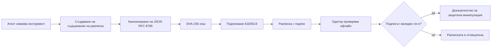
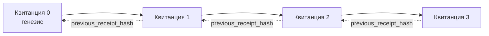

[Гледайте видео урока: Защита на AI агенти с криптографски разписки](https://youtu.be/PLACEHOLDER_VIDEO_ID)

> _(Видео урок и миниизображение ще бъдат добавени от екипа за съдържание на Microsoft след сливането, съответстващи на шаблона за урок 14 / 15.)_

# Защита на AI агенти с криптографски разписки

## Въведение

Този урок ще обхване:

- Защо одитният път за AI агенти е важен за съответствие, дебъгване и доверие.
- Какво е криптографска разписка и как се различава от неподписан лог ред.
- Как да се направи подписана разписка за повикване на инструмент от агент с чист Python.
- Как да се провери разписка офлайн и да се открие подправяне.
- Как да се свържат разписки така, че премахването или пренареждането на една да разруши веригата.
- Какво доказват разписките и какво изрично не доказват.

## Цели на обучението

След завършване на този урок, ще знаете как да:

- Идентифицирате режимите на неуспех, които мотивират криптографската произходност на действията на агента.
- Създадете разписка, подписана с Ed25519, върху каноничен JSON полезен товар.
- Проверите разписка независимо само с помощта на публичния ключ на подписващия.
- Откривате подправяне чрез повторно стартиране на проверката върху модифицирана разписка.
- Изградите хеш-връзана последователност от разписки и обясните защо веригата е важна.
- Разпознаете границата между това какво доказват разписките (атрибуция, целостност, подредба) и какво не доказват (коректност на действието, здравина на политиката).

## Проблемът: Одитният път на вашия агент

Представете си, че сте разположили AI агент за Contoso Travel. Агентът чете клиентски заявки, извиква API за полети за търсене на опции и резервира места от името на клиента. Миналото тримесечие агентът обработи 50 000 резервации.

Днес пристига одитор. Той задава прост въпрос: „Покажете ми какво направи вашият агент.“

Вие предоставяте лог файловете. Одиторът ги разглежда и задава сложния въпрос: „Как да знам, че тези логове не са редактирани?“

Това е проблемът с одитния път. Повечето внедрявания на агенти днес разчитат на:

- **Приложни логове**: записани от самия агент, редактирани от всеки с достъп до файловата система.
- **Облачни услуги за логиране**: доказуемо предотвратяват подправяне на платформа, но само ако одиторът има доверие на оператора на платформата.
- **Логове на транзакции в бази данни**: подходящи за промени в бази данни, но не и за произволни повиквания на инструменти.

Нито едно от тези не може да отговори на въпроса на одитора без да изисква доверие в някого (във вас, вашия доставчик на облачни услуги, вашия доставчик на база данни). За вътрешна употреба това доверие често е приемливо. За регулирани натоварвания (финанси, здравеопазване, всичко подложено на Закона за AI на ЕС) не е.

Криптографските разписки решават това, като правят всяко действие на агента независимо проверимо. Одиторът не трябва да ви се доверява. Той се нуждае само от вашия публичен ключ и самата разписка.

## Какво е криптографска разписка?

Разписката е JSON обект, който записва какво е направил агентът, подписан с дигитален подпис.


  
Минимална разписка изглежда така:

```json
{
  "type": "agent.tool_call.v1",
  "agent_id": "contoso-travel-bot",
  "tool_name": "lookup_flights",
  "tool_args_hash": "sha256:a3f9c1...",
  "result_hash": "sha256:7b2e1d...",
  "policy_id": "contoso-travel-policy-v3",
  "timestamp": "2026-04-25T14:30:00Z",
  "sequence": 47,
  "previous_receipt_hash": "sha256:9d4e6a...",
  "signature": {
    "alg": "EdDSA",
    "sig": "c5af83...",
    "public_key": "8f3b2c..."
  }
}
```
  
Три свойства вършат работата:

1. **Подписът**. Разписката е подписана от шлюза на агента с частен ключ Ed25519. Всеки с съответния публичен ключ може да провери подписа офлайн. Подправянето на някое поле прави подписа невалиден.

2. **Канонично кодиране**. Преди подписване разписката се сериализира с JSON Canonicalization Scheme (JCS, RFC 8785). Това осигурява, че две реализации, които правят една и съща логическа разписка, създават идентичен байтов изход. Без канонизация различните JSON сериализатори биха произвели различни подписи за едно и също съдържание.

3. **Хеш верига**. Полето `previous_receipt_hash` свързва всяка разписка с предишната. Премахването или пренареждането на една разписка разрушава всички разписки след нея. Подправянето става видимо на ниво верига, дори ако се заобикалят отделни подписи.

Тези свойства заедно предоставят три гаранции:

- **Атрибуция**: този ключ е подписал това съдържание.
- **Целостност**: съдържанието не се е променило след подписването.
- **Подредба**: тази разписка е следвала друга във веригата.

## Създаване на разписка в Python

Не ви трябва специална библиотека, за да създадете разписка. Криптографските примитиви са широко достъпни, а логиката е няколко десетки реда Python.

Практическите упражнения в `code_samples/18-signed-receipts.ipynb` показват целия процес стъпка по стъпка. Обобщената версия:

```python
import json
import hashlib
import base64
from nacl import signing
from jcs import canonicalize  # RFC 8785 каноничен JSON

def b64url_nopad(data: bytes) -> str:
    return base64.urlsafe_b64encode(data).decode("ascii").rstrip("=")

def sha256_canonical(obj) -> str:
    """SHA-256 of a Python object's JCS-canonical JSON form."""
    return f"sha256:{hashlib.sha256(canonicalize(obj)).hexdigest()}"

# Генерирайте или заредете ключ за подписване (в продукция, съхранявайте в ключово хранилище)
signing_key = signing.SigningKey.generate()
verify_key = signing_key.verify_key

# Изградете товара на разписката (няма подпис още)
tool_args = {"origin": "SYD", "destination": "LAX"}
tool_result = [{"flight": "QF11", "price": 1850, "stops": 0}]

payload = {
    "type": "agent.tool_call.v1",
    "agent_id": "contoso-travel-bot",
    "tool_name": "lookup_flights",
    "tool_args_hash": sha256_canonical(tool_args),
    "result_hash": sha256_canonical(tool_result),
    "policy_id": "contoso-travel-policy-v3",
    "timestamp": "2026-04-25T14:30:00Z",
    "sequence": 0,
    "previous_receipt_hash": None,
}

# Канонизирайте, хеширайте, подпишете.
canonical_bytes = canonicalize(payload)
message_hash = hashlib.sha256(canonical_bytes).digest()
signature_bytes = signing_key.sign(message_hash).signature

# Добавете структурирано подписи обект.
receipt = {
    **payload,
    "signature": {
        "alg": "EdDSA",
        "sig": b64url_nopad(signature_bytes),
        "public_key": b64url_nopad(bytes(verify_key)),
    },
}
```
  
Това е цялата подписваща линия. Упражненията в тетрадката разглеждат всяка стъпка поотделно.

## Проверка на разписка и откриване на подправяне

Проверката е обратната операция:

```python
import base64
import hashlib
from nacl import signing
from nacl.exceptions import BadSignatureError
from jcs import canonicalize

def b64url_decode(s: str) -> bytes:
    padding = "=" * ((4 - len(s) % 4) % 4)
    return base64.urlsafe_b64decode(s + padding)

def verify_receipt(receipt: dict) -> bool:
    # Подписът е структуриран обект: {"alg", "sig", "public_key"}.
    sig_obj = receipt.get("signature")
    if not sig_obj or sig_obj.get("alg") != "EdDSA":
        return False

    # Възстановете полезния товар, който е бил действително подписан (всичко освен подписа).
    payload = {k: v for k, v in receipt.items() if k != "signature"}

    canonical_bytes = canonicalize(payload)
    message_hash = hashlib.sha256(canonical_bytes).digest()

    try:
        verify_key = signing.VerifyKey(b64url_decode(sig_obj["public_key"]))
        verify_key.verify(message_hash, b64url_decode(sig_obj["sig"]))
        return True
    except BadSignatureError:
        return False
```
  
Тази функция приема разписка и връща `True`, ако подписът е валиден, `False` в противен случай. Без мрежови повиквания, без зависимост от услуга, без доверие на трета страна.

За да видите в действие откриването на подправяне, тетрадката разглежда:

1. Създаване на валидна разписка и потвърждаване, че се проверява.
2. Модифициране на един байт в полето `tool_args_hash`.
3. Повторна проверка, която вече се проваля.

Това е практическата демонстрация, че разписките са очевидни за подправяне: всяко изменение, колкото и малко да е, разрушава подписа.

## Свързване на разписки за агенти с множество стъпки

Една подписана разписка защитава едно действие. Веригата от разписки защитава поредица от действия.


  
Всяка разписка записва хеша на предишната. За да премахне тихо разписка 2, нападателят би трябвало или:

- Да модифицира полето `previous_receipt_hash` на разписка 3 (разрушаване на подписа на разписка 3), ИЛИ
- Да фалшифицира нов подпис върху модифицирана разписка 3 (изисква частния ключ на агента).

Ако частният ключ е в хардуерен защитен трезор и публикувате публичния ключ с всяка разписка, нито една от атаките не е възможна без откриване.

Тетрадката разглежда:

1. Изграждане на верига от три разписки.
2. Проверка, че `previous_receipt_hash` на всяка разписка съвпада с реалния хеш на предишната разписка.
3. Подправяне на една разписка в средата и наблюдаване как веригата се разбива точно в тази точка.

Така създавате одитен път, който външен одитор може да провери без да ви се доверява.

## Какво доказват разписките (и какво не)

Това е най-важната част от урока. Разписките са мощни, но тяхната сила е ограничена.

**Разписките доказват три неща:**

1. **Атрибуция**: конкретен ключ е подписал конкретен полезен товар.
2. **Целостност**: полезният товар не се е променил след подписването.
3. **Подредба**: тази разписка е следвала друга в хеш веригата.

**Разписките НЕ доказват:**

1. **Коректност**: че действието на агента е било правилно. Разписка може да бъде подписана с грешен отговор също толкова чисто, колкото и с правилен.
2. **Спазване на политика**: че политиката, посочена в `policy_id`, е била наистина оценена или че би разрешила действието, ако е проверена. Разписката записва какво е твърдено, не какво е наложено.
3. **Идентичност отвъд ключа**: разписката казва "този ключ е подписал това съдържание". Не казва "този човек е упълномощил това". Свързването на ключ с лице или организация изисква отделна идентификационна инфраструктура (директория, регистър на публични ключове и др.).
4. **Истинност на входните данни**: ако агентът получи манипулирана подсказка и действа според нея, разписката вярно записва действието. Разписките са след проверката на входа, а не заместител на такава.

Тази граница има значение по две причини:

- Казва ви за какво са полезни разписките: правят поведението на агентите одитируемо и очевидно за подправяне, дори през организационни граници.
- Казва ви какви допълнителни слоеве все още са необходими: валидиране на входа (Урок 6), прилагане на политика (кратко разгледано по-долу) и идентификационна инфраструктура (извън обхвата на този урок).

Често срещана грешка е да се предполага, че „имаме разписки“ означава „управляваме се“. Не е така. Разписките са основата. Управлението е системата, която изграждате върху тях.

## Производствени препратки

Python кодът в този урок е умишлено минимален, за да можете да четете всеки ред и да разбирате точно какво се случва. В продукция имате две опции:

1. **Изграждане директно върху криптографските примитиви.** 50-те реда, които видяхте, са достатъчни за много случаи на употреба. PyNaCl (Ed25519) и пакетът `jcs` (каноничен JSON) са добре поддържани и проверени библиотеки.

2. **Използване на библиотека за производствени разписки.** Няколко отворени проекта имплементират същия модел с допълнителни функции (ротация на ключове, пакетна проверка, разпространение на JWK Set, интеграция с политики):
   - Форматът на разписка, използван в този урок, следва проект за стандарт на IETF Internet-Draft (`draft-farley-acta-signed-receipts`), който в момента е в процес на стандартизация.
   - Microsoft Agent Governance Toolkit комбинира разписки с решения базирани на Cedar политики; вижте Урок 33 в този репозиторий за пример от край до край.
   - Пакетите `protect-mcp` (npm) и `@veritasacta/verify` (npm) предоставят Node-базирана имплементация на подписване на разписки и офлайн проверка, предназначени за обвиване на всеки MCP сървър с одитен път, доказващ неприкосновеното му състояние.

Изборът между собствена имплементация и използване на библиотека е като избор между писане на собствена JWT библиотека и използване на тествана: и двете са разумни; библиотеката пести време и намалява аудитния обхват; от нулата подходът ви кара да разбирате всеки примитив. Този урок учи подхода от нулата, за да имате основа за всяка опция.

## Проверка на знанията

Тествайте разбирането си преди практическото упражнение.

**1. Разписката е подписана с частния Ed25519 ключ на агента. Одиторът има само публичния ключ. Може ли одиторът да провери разписката офлайн?**

<details>
<summary>Отговор</summary>

Да. Ed25519 верификацията изисква само публичния ключ и подписаните байтове. Няма мрежови повиквания, няма зависимост от услуга. Това свойство прави разписките полезни при изолирани, мултиорганизационни или нискодоверителни одитни среди.
</details>

**2. Един нападател модифицира полето `policy_id` на разписка, за да твърди, че е била управлявана от по-отворена политика. Подписът е върху оригиналния полезен товар. Какво се случва при проверката?**

<details>
<summary>Отговор</summary>

Проверката не успява. Подписът е изчислен върху каноничните байтове на оригиналния полезен товар; модифицирането на всяко поле променя тези байтове, което променя SHA-256 хеша, което прави подписа невалиден. Нападателят би трябвало да има частния ключ, за да създаде валиден нов подпис, което няма.
</details>

**3. Защо разписката включва `tool_args_hash` и `result_hash`, а не суровите аргументи и резултат?**

<details>
<summary>Отговор</summary>

Две причини. Първо, разписката може да бъде архивирана или предавана в среди, където изтичането на суровото съдържание (лични данни, бизнес данни) е проблем. Хеширането запазва разписката малка и съдържанието поверително; одиторът проверява, че хешът съвпада с отделно съхранена копие на съдържанието. Второ, хешовете имат фиксиран размер; разписка с хешове е с ограничен размер независимо колко големи са входните и изходните данни.
</details>

**4. Полето `previous_receipt_hash` свързва всяка разписка с предходната. Ако нападател тихо изтрие една разписка от средата на веригата, какво става невалидно?**

<details>
<summary>Отговор</summary>

Всяка разписка след изтритата. Техните полета `previous_receipt_hash` вече не съвпадат с реалната верига (защото разписката, към която са се отнасяли, вече не съществува, или веригата сочи към различен предшественик). За да скрие изтриването, нападателят трябва да подпише наново всяка по-късна разписка, което изисква частния ключ.
</details>

**5. Разписка се проверява успешно. Доказва ли това, че действието на агента е било коректно, здраво или съвместимо с политиката?**

<details>
<summary>Отговор</summary>

Не. Валидната разписка доказва три неща: атрибуция (този ключ е подписал това съдържание), целостност (съдържанието не се е променило), и подредба (тази разписка е след друга). Тя НЕ доказва, че действието е било коректно, че политиката, посочена в `policy_id`, е била оценена, или че агентът е спазвал всички правила. Разписките правят поведението на агента одитируемо, не задължително коректно. Това е най-важната граница в урока.
</details>

## Практическо упражнение

Отворете `code_samples/18-signed-receipts.ipynb` и изпълнете всичките четири секции:

1. **Секция 1**: Подпишете първата си разписка и я проверете.
2. **Секция 2**: Подправете разписката и наблюдавайте неуспешна проверка.
3. **Секция 3**: Изградете верига от три разписки и проверете целостта на веригата.
4. **Секция 4**: Приложете модела към агент, изграден с Microsoft Agent Framework: обвийте повикване на инструмент с подписване на разписка и после проверете разписката независимо.

**Допълнително предизвикателство 1:** разширете схемата на разписката с допълнително поле по ваш избор (например, идентификатор на заявка за проследяване), обновете каноничната логика за подписване да го включва и потвърдете, че разписката все още може да се провери. След това модифицирайте полето след подписването и потвърдете, че проверката се проваля. Това ще ви застави да разберете как всеки байт от каноничното кодиране допринася за подписа.
**Предизвикателство за напреднали 2:** Хеширайте с SHA-256 две от вашите разписки заедно (конкатенирайте техните канонични байтове в детерминиран ред) и вградете получения дайджест като ново поле в трета разписка преди да я подпишете. Проверете, че трите разписки все още могат да преминават в двата края на процеса. Току-що сте създали доказателство за едностъпково включване: всеки, който притежава третата разписка, може да докаже, че първите две са съществували по времето на подписването ѝ, без да е необходимо да разкрива съдържанието им. Това е моделът, който разписките за селективно разкриване използват в голям мащаб (Merkle комитменти, RFC 6962).

## Заключение

Криптографските разписки дават на AI агентите аудиторска следа, която е:

- **Независимо проверима**: всяка страна с публичен ключ може да провери, без зависимост от услуга.
- **Нарушенията са лесно откриваеми**: всяка промяна анулира подписа.
- **Преносима**: разписката е малък JSON файл; може да бъде архивирана, предавана и проверявана навсякъде.
- **Съответства на стандарти**: изградена върху Ed25519 (RFC 8032), JCS (RFC 8785) и SHA-256, всички широко разпространени примитиви.

Те не са заместител на валидирането на входа, прилагането на политики или инфраструктурата за идентичност. Те са основа за тези слоеве. Когато внедрявате агенти в регулирани работни натоварвания, мултиорганизационни работни потоци или във всяка среда, в която бъдещ одитор не може да бъде приет безрезервно като доверен, разписките са начинът да направите аудиторската следа честна.

Най-важното послание: разписките доказват кой какво е казал и кога. Те не доказват, че казаното е вярно или правилно. Задръжте това разграничение здраво. Това е разликата между честна система за произход и подвеждаща такава.

## Производствен Контролен Списък

Когато сте готови да преминете от този урок към внедряване на агенти, подписани с разписки в реална среда:

- [ ] **Преместете ключа за подписване от лаптопа на разработчика.** Използвайте Azure Key Vault, AWS KMS или хардуерен модул за сигурност. Частният ключ, с който подписвате разписките, никога не трябва да съществува в контрол на версиите или в незашифрован вид на машините на приложението.
- [ ] **Публикувайте публичния ключ за проверка.** Одиторите имат нужда от него за офлайн проверка. Стандартният модел е JWK комплект на известен URL адрес (RFC 7517), напр. `https://your-org.example.com/.well-known/agent-keys.json`.
- [ ] **Закответе веригата външно.** Периодично записвайте хеша на най-новата глава на веригата в яснотен лог (Sigstore Rekor, RFC 3161 timestamp authority или втори вътрешен системен регистър), за да може външна страна да потвърди „тази верига е съществувала по това време.“
- [ ] **Съхранявайте разписките по начин, който не допуска промяна.** Съхранение само с добавяне (Append-only blob storage) като Azure Storage с политики за неизменяемост, AWS S3 Object Lock, предотвратява вътрешно пренаписване на историята на слоя за съхранение.
- [ ] **Решете за задържането им.** Много регулаторни режими изискват многогодишно съхранение. Планирайте растежа на разписките (всяка е около 500 байта; агент, правещ 10 000 повиквания на ден, произвежда около 1.8 GB годишно).
- [ ] **Документирайте какво не покриват разписките.** Разписките доказват атрибуция, цялост и ред на събитията. Вашият runbook трябва ясно да посочва какви допълнителни контроли (валидация на вход, прилагане на политики, ограничаване на честотата, инфраструктура за идентичност) партнират с разписките във вашата политика за управление.

### Имаш ли още въпроси за защита на AI агенти?

Присъедини се към [Microsoft Foundry Discord](https://aka.ms/ai-agents/discord), за да се срещнеш с други учащи, да посетиш консултации и да получиш отговори на въпросите си за AI агенти.

## След урока

Този урок покрива подписване на една разписка и последователности с хеширана верига. Същите примитиви формират няколко по-напреднали модела, които може да срещнете при развитието на политиката ви:

- **Селективно разкриване.** Когато полетата на разписка се заверяват независимо (Merkle дърво по RFC 6962), можете да разкривате конкретни полета на конкретни одитори и да доказвате, че останалите са непроменени, без да ги излагате. Полезно, когато една и съща разписка трябва да отговори както на пълен одит (който иска пълнота), така и на регулации за минимизиране на данните като GDPR (които искат одиторът да вижда възможно най-малко).
- **Отказ на разписка.** Ако ключът за подписване е компрометиран, трябва начин да маркирате всички разписки, подписани с този ключ, като ненадеждни от даден момент нататък. Стандартни модели: краткотрайни ключове плюс публикуван списък за отказ, или яснотен лог с записи за отказ.
- **Двустранни / разполовени разписки.** Някои реализации разделят подписания товар на предварително изпълнение (`authorization_*`) и след изпълнение (`result_*`) с отделни подписи, полезно когато решението за разрешение и резултатът се произвеждат от различни участници или в различно време. Това се надгражда допълнително върху формата на разписка от този урок.
- **Композиция на полезния товар.** Разписката защитава всичко в `result_hash`. Реалните полезни товари често са по-богати от един резултат на инструмент: предварителна логика (прогноза на модел, разгледани опции, доказателства и пълнотата им, рискова позиция, верига на отчетност, изход на гейт) могат всички да живеят вътре в полезния товар, защитен от една разписка. Това поддържа формата минимална, докато схемите на полезния товар могат да се развиват домейн по домейн.
- **Съвместимост между реализации.** Няколко независими реализации на същия формат на разписка (Python, TypeScript, Rust, Go) се проверяват една срещу друга с общи тестови вектори. Ако изграждате собствена реализация, валидирането срещу публикувани вектори потвърждава съвместимостта по протокола.
- **Миграция след квантовата ера.** Ed25519 е широко разпространен днес, но не е устойчив на квантови изчисления. Форматът на разписката е адаптивен към алгоритми: полето `signature.alg` може да носи `ML-DSA-65` (квантово-сигнатурен стандарт на NIST), когато трябва да мигрирате. Планирайте преходен период, в който разписките са с двоен подпис.

## Допълнителни Ресурси

- <a href="https://datatracker.ietf.org/doc/draft-farley-acta-signed-receipts/" target="_blank">IETF Internet-Draft: Подписани разписки за решения за контрол на достъп между машини</a>
- <a href="https://learn.microsoft.com/azure/ai-studio/responsible-use-of-ai-overview" target="_blank">Отговорно използване на AI (Azure AI)</a>
- <a href="https://datatracker.ietf.org/doc/html/rfc8032" target="_blank">RFC 8032: Алгоритъм за цифров подпис на Edwards-кура (EdDSA)</a>
- <a href="https://datatracker.ietf.org/doc/html/rfc8785" target="_blank">RFC 8785: Схема за канонизация на JSON (JCS)</a>
- <a href="https://datatracker.ietf.org/doc/html/rfc6962" target="_blank">RFC 6962: Сертификатна прозрачност</a> (Merkle дървена конструкция, използвана от разписки за селективно разкриване)
- <a href="https://github.com/microsoft/agent-governance-toolkit/blob/main/docs/tutorials/33-offline-verifiable-receipts.md" target="_blank">Microsoft Agent Governance Toolkit, Урок 33: Офлайн-проверими разписки за решения</a>
- <a href="https://github.com/ScopeBlind/agent-governance-testvectors" target="_blank">Тестови вектори за съвместимост между реализации</a> за формата на разписка, използван в този урок (Apache-2.0)
- <a href="https://pynacl.readthedocs.io/" target="_blank">Документация PyNaCl</a> (Ed25519 в Python)

## Предишен урок

[Изграждане на агенти за използване на компютър (CUA)](../15-browser-use/README.md)

## Следващ урок

_(Ще бъде определен от кураторите на учебната програма)_

---

<!-- CO-OP TRANSLATOR DISCLAIMER START -->
**Отказ от отговорност**:
Този документ е преведен с помощта на AI преводачески услуга [Co-op Translator](https://github.com/Azure/co-op-translator). Въпреки че се стремим към точност, моля имайте предвид, че автоматизираните преводи могат да съдържат грешки или неточности. Оригиналният документ на неговия роден език трябва да се счита за авторитетен източник. За критична информация се препоръчва професионален човешки превод. Ние не носим отговорност за каквито и да е недоразумения или неправилни тълкувания, произтичащи от използването на този превод.
<!-- CO-OP TRANSLATOR DISCLAIMER END -->