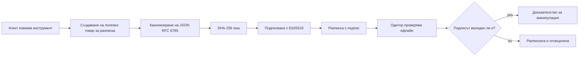
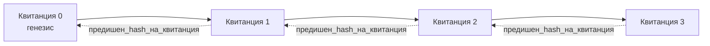

[Гледайте урока: Защита на AI агенти с криптографски разписки](https://youtu.be/PLACEHOLDER_VIDEO_ID)

> _(Видео на урока и миниатюра ще бъдат добавени от екипа на Microsoft след сливането, съобразено с модела за урок 14 / 15.)_

# Защита на AI агенти с криптографски разписки

## Въведение

В този урок ще разгледаме:

- Защо са важни одитните дневници за AI агенти за съответствие, отстраняване на грешки и доверие.
- Какво е криптографска разписка и как се различава от несигнат запис в регистър.
- Как да се създаде подписана разписка за повикване на инструмент на агент с обикновен Python.
- Как да се провери разписка офлайн и да се открие манипулация.
- Как да се свържат разписки така, че премахването или пренареждането на някоя да прекъсне веригата.
- Какво доказват разписките и какво изрично не доказват.

## Учебни цели

След завършване на този урок ще знаете как да:

- Идентифицирате режимите на отказ, които мотивират криптографската произходност за действията на агента.
- Създавате разписка, подписана с Ed25519, върху каноничен JSON товар.
- Проверявате разписка независимо, използвайки само публичния ключ на подписвача.
- Откривате манипулации чрез повторно пускане на верификация върху променена разписка.
- Създавате хеширана верига от разписки и обяснявате защо веригата е от значение.
- Разпознавате границата между това, което разписките доказват (атрибуция, цялост, последователност) и това, което не доказват (правилност на действието, издържаност на политиката).

## Проблемът: Одитният дневник на вашия агент

Представете си, че сте внедрили AI агент за Contoso Travel. Агентът чете заявки от клиенти, изпраща повикване към API за полети, за да намери опции, и резервира места от името на клиента. Миналото тримесечие агентът обработи 50 000 резервации.

Днес идва одитор. Той задава прост въпрос: „Покажете ми какво прави вашият агент.“

Подавате му лог файловете. Одиторът ги разглежда и задава по-трудния въпрос: „Как знам, че тези записи не са редактирани?“

Това е проблемът с одитния дневник. Повечето внедрявания на агенти днес разчитат на:

- **Приложни регистри**: писани от самия агент, редактируеми от всеки с достъп до файловата система.
- **Услуги за облачно логиране**: прозрачно измамно на ниво платформа, но само ако одиторът се довери на оператора на платформата.
- **Регистри на транзакциите в базата данни**: подходящи за промени в базата, но не за произволни повиквания на инструменти.

Нито едно от тези не може да отговори на въпроса на одитора без да изисква одиторът да се довери на някого (вас, вашия облачен доставчик, вашия доставчик на база данни). За вътрешна употреба това доверие често е приемливо. За регламентирани натоварвания (финанси, здравеопазване, всичко подчинено на Директивата за ИИ на ЕС) не е.

Криптографските разписки решават този проблем, като правят всяко действие на агента независимо проверимо. Одиторът не трябва да се доверява на вас. Той се нуждае само от вашия публичен ключ и самата разписка.

## Какво е криптографска разписка?

Разписката е JSON обект, който записва какво е направил агентът, подписан с цифров подпис.



Минимална разписка изглежда така:

```json
{
  "type": "agent.tool_call.v1",
  "agent_id": "contoso-travel-bot",
  "tool_name": "lookup_flights",
  "tool_args_hash": "sha256:a3f9c1...",
  "result_hash": "sha256:7b2e1d...",
  "policy_id": "contoso-travel-policy-v3",
  "timestamp": "2026-04-25T14:30:00Z",
  "sequence": 47,
  "previous_receipt_hash": "sha256:9d4e6a...",
  "signature": {
    "alg": "EdDSA",
    "sig": "c5af83...",
    "public_key": "8f3b2c..."
  }
}
```

Три свойства вършат работата:

1. **Подписът**. Разписката е подписана от шлюза на агента с помощта на Ed25519 частен ключ. Всеки с публичния ключ може да провери подписа офлайн. Манипулация на някое поле прави подписа невалиден.

2. **Канонично кодиране**. Преди подписването разписката се сериализира с JSON Canonicalization Scheme (JCS, RFC 8785). Това осигурява, че две реализации, произвеждащи една и съща логическа разписка, генерират идентично байтово съдържание. Без канонизация различни JSON сериализатори биха произвели различни подписи за едно и също съдържание.

3. **Хеширана верига**. Полето `previous_receipt_hash` свързва всяка разписка с предишната. Премахването или пренареждането на разписка прекъсва всяка следваща верига. Манипулацията става видима на нивото на веригата, дори ако отделни подписи бъдат заобиколени.

Заедно тези свойства осигуряват три гаранции:

- **Атрибуция**: този ключ е подписал това съдържание.
- **Цялост**: съдържанието не е променяно след подписа.
- **Последователност**: тази разписка е дошла след друга в веригата.

## Създаване на разписка в Python

Не е нужна специална библиотека за създаване на разписка. Криптографските примитиви са широко достъпни и логиката е само няколко десетки реда Python.

Практическите упражнения в `code_samples/18-signed-receipts.ipynb` обхождат целия процес. Обобщение:

```python
import json
import hashlib
import base64
from nacl import signing
from jcs import canonicalize  # RFC 8785 каноничен JSON

def b64url_nopad(data: bytes) -> str:
    return base64.urlsafe_b64encode(data).decode("ascii").rstrip("=")

def sha256_canonical(obj) -> str:
    """SHA-256 of a Python object's JCS-canonical JSON form."""
    return f"sha256:{hashlib.sha256(canonicalize(obj)).hexdigest()}"

# Генерирайте или заредете ключ за подписване (в производствена среда съхранявайте в хранилище за ключове)
signing_key = signing.SigningKey.generate()
verify_key = signing_key.verify_key

# Създаване на полезния товар на разписката (все още без подпис)
tool_args = {"origin": "SYD", "destination": "LAX"}
tool_result = [{"flight": "QF11", "price": 1850, "stops": 0}]

payload = {
    "type": "agent.tool_call.v1",
    "agent_id": "contoso-travel-bot",
    "tool_name": "lookup_flights",
    "tool_args_hash": sha256_canonical(tool_args),
    "result_hash": sha256_canonical(tool_result),
    "policy_id": "contoso-travel-policy-v3",
    "timestamp": "2026-04-25T14:30:00Z",
    "sequence": 0,
    "previous_receipt_hash": None,
}

# Канонизиране, хеширане, подписване.
canonical_bytes = canonicalize(payload)
message_hash = hashlib.sha256(canonical_bytes).digest()
signature_bytes = signing_key.sign(message_hash).signature

# Прикрепете структуриран обект за подпис.
receipt = {
    **payload,
    "signature": {
        "alg": "EdDSA",
        "sig": b64url_nopad(signature_bytes),
        "public_key": b64url_nopad(bytes(verify_key)),
    },
}
```

Това е цялата верига на подписване. Упражненията в тетрадката разглеждат всяка стъпка.

## Проверка на разписка и откриване на манипулация

Проверката е обратната операция:

```python
import base64
import hashlib
from nacl import signing
from nacl.exceptions import BadSignatureError
from jcs import canonicalize

def b64url_decode(s: str) -> bytes:
    padding = "=" * ((4 - len(s) % 4) % 4)
    return base64.urlsafe_b64decode(s + padding)

def verify_receipt(receipt: dict) -> bool:
    # Подписът е структуриран обект: {"alg", "sig", "public_key"}.
    sig_obj = receipt.get("signature")
    if not sig_obj or sig_obj.get("alg") != "EdDSA":
        return False

    # Реконструирайте полезния товар, който всъщност е бил подписан (всичко освен подписа).
    payload = {k: v for k, v in receipt.items() if k != "signature"}

    canonical_bytes = canonicalize(payload)
    message_hash = hashlib.sha256(canonical_bytes).digest()

    try:
        verify_key = signing.VerifyKey(b64url_decode(sig_obj["public_key"]))
        verify_key.verify(message_hash, b64url_decode(sig_obj["sig"]))
        return True
    except BadSignatureError:
        return False
```

Тази функция приема разписка и връща `True`, ако подписът е валиден, `False` в противен случай. Без мрежови повиквания, без зависимост от услуга, без нужда одитор да се доверява на трети страни.

За да видите откриване на манипулация в действие, тетрадката разглежда:

1. Създаване на валидна разписка и потвърждаване, че се проверява.
2. Модифициране на един байт в полето `tool_args_hash`.
3. Повторна проверка и установяване на неуспех.

Това е практическата демонстрация, че разписките са прозрачни към манипулации: всяка промяна, колкото и малка, прекъсва подписа.

## Свързване на разписки за многостъпкови агенти

Една подписана разписка защитава едно действие. Верига от разписки защитава редица действия.



Всяка разписка записва хеша на предходната. За да премахне безшумно разписка 2, нападателят трябва или:

- Да промени полето `previous_receipt_hash` на разписка 3 (прекъсва подписа на разписка 3), ИЛИ
- Да създаде нов подпис върху променена разписка 3 (изисква частния ключ на агента).

Ако частният ключ е в хардуерен ключов сейф и публикувате публичния ключ с всяка разписка, никой от двата атаки не е възможен без да бъде засечен.

Тетрадката разглежда:

1. Създаване на верига от три разписки.
2. Проверка, че всяка `previous_receipt_hash` съответства на действителния хеш на предходната разписка.
3. Манипулация на една разписка в средата и виждане как веригата се прекъсва точно там.

Това е как се създава одитен трак, който външен одитор може да провери без да ви се доверява.

## Какво доказват разписките (и какво не доказват)

Това е най-важният раздел на урока. Разписките са мощни, но силата им е ограничена.

**Разписките доказват три неща:**

1. **Атрибуция**: конкретен ключ е подписал конкретен товар.
2. **Цялост**: товарът не е променян след подписването.
3. **Последователност**: тази разписка е дошла след друга в хешираната верига.

**Разписките НЕ доказват:**

1. **Правилност**: че действието на агента е било правилното. Разписка може да бъде подписана както за грешен, така и за правилен отговор.
2. **Съответствие с политика**: че политиката, посочена в `policy_id`, е била действително оценена или би разрешила действието, ако е била проверена. Разписката записва това, което е заявено, не това, което е било наложено.
3. **Идентичност отвъд ключа**: разписката казва „този ключ подписа това съдържание.“ Не казва „този човек авторизира това.“ Свързването на ключ с човек или организация изисква отделна инфраструктура за идентичност (директория, регистър на публични ключове и др.).
4. **Истинност на входните данни**: ако агентът получи манипулиран сигнал за действие и реагира на него, разписката записва действието вярно. Разписките са след валидацията на входа, не са заместител на тази валидация.

Тази граница е важна по две причини:

- Казва ви за какво са полезни разписките: да направят поведението на агента одитируемо и прозрачно за манипулации, дори при различни организации.
- Казва ви какви допълнителни слоеве са все още нужни: валидация на входните данни (Урок 6), прилагане на политика (накратко разгледано по-долу) и инфраструктура за идентичност (извън обхвата на този урок).

Често срещана грешка е да се приеме, че „имаме разписки“ означава „ние сме управлявани.“ Това не е така. Разписките са основата. Управлението е системата, която изграждате върху тях.

## Препоръки за производство

Python кодът в този урок е умишлено минимален, за да можете да прочетете всеки ред и да разберете точно какво се случва. В производство имате две опции:

1. **Използвайте директно криптографските примитиви.** 50-те реда, които видяхте по-горе, са достатъчни за много случаи на употреба. PyNaCl (Ed25519) и пакетът `jcs` (каноничен JSON) са поддържани и одитирани библиотеки.

2. **Използвайте библиотека за производство на разписки.** Няколко отворени проекта прилагат същия модел с допълнителни функции (ротация на ключове, партидна верификация, разпространение на JWK комплекти, интеграция с двигатели за политики):
   - Форматът на разписката, използван в урока, следва IETF Internet-Draft (`draft-farley-acta-signed-receipts`), който е в процес на стандартизиране.
   - Microsoft Agent Governance Toolkit комбинира разписки с решения на базата на Cedar политика; вижте Урок 33 в това хранилище за пример от край до край.
   - Пакетите `protect-mcp` (npm) и `@veritasacta/verify` (npm) предоставят реализация за Node, която подписва и проверява разписки офлайн, с цел да обгърнат всеки MCP сървър с одитен дневник, прозрачен за манипулации.
   - **[nobulex](https://github.com/arian-gogani/nobulex)** Python SDK (`pip install nobulex`) предоставя същия модел Ed25519 + JCS подписване в Python с интеграция за LangChain и CrewAI, включително публикувани векторни тестове за кръстосана валидация и карта за съответствие, предоставена чрез [OWASP PR #2210](https://github.com/OWASP/CheatSheetSeries/pull/2210).

Изборът между собствена реализация и използване на библиотека е аналогичен на решението между писането на собствена JWT библиотека и използване на проверена такава: и двете са разумни; библиотеката спестява време и намалява риска; собствената реализация ви кара да разберете всеки примитив. Този урок учи от самото начало, за да имате основата за всяка опция.

## Проверка на знанията

Проверете разбирането си преди да преминете към практическото упражнение.

**1. Разписката е подписана с частния Ed25519 ключ на агента. Одиторът има само публичния ключ. Може ли одиторът да провери разписката офлайн?**

<details>
<summary>Отговор</summary>

Да. Верификацията с Ed25519 изисква само публичния ключ и подписаните байтове. Няма нужда от мрежови повиквания или услуги. Това е свойството, което прави разписките полезни в „въздушно изолирани“, многоорганизационни или нискодоверителни одитни среди.
</details>

**2. Нападателят модифицира полето `policy_id` на разписка, претендирайки, че е управлявана от по-разрешаваща политика. Подписът е бил върху оригиналния товар. Какво се случва при проверка?**

<details>
<summary>Отговор</summary>

Проверката не успява. Подписът е изчислен върху каноничните байтове на оригиналния товар; промяната на каквото и да е поле променя каноничните байтове, което променя SHA-256 хеша и прави подписа невалиден. Нападателят би трябвало да има частния ключ, за да създаде валиден нов подпис, което няма.
</details>

**3. Защо разписката включва `tool_args_hash` и `result_hash` вместо суровите аргументи и резултат?**

<details>
<summary>Отговор</summary>

Две причини. Първо, разписката може да се архивира или предава в среди, където изтичането на суровото съдържание (ПИ данни, бизнес данни) е проблем. Хеширането държи разписката малка и съдържанието лично; одиторът проверява, че хешът отговаря на отделно съхранявано копие на действителното съдържание. Второ, хешовете имат фиксиран размер; разписка с хешове има ограничен размер, без значение колко големи са входните и изходните данни.
</details>

**4. Полето `previous_receipt_hash` свързва всяка разписка с предшественика ѝ. Ако нападател тихомълком изтрие една разписка от средата на верига, какво става невалидно?**

<details>
<summary>Отговор</summary>

Всяка разписка след изтритата. Техните полета `previous_receipt_hash` вече не съвпадат с действителната верига (защото препратката към предишната разписка вече не съществува или веригата сочи към различен предшественик). За да скрие изтриването, нападателят трябва да подпише повторно всяка по-късна разписка, което изисква частния ключ.
</details>

**5. Една разписка се проверява успешно. Доказва ли това, че действието на агента е било правилно, издържано или съобразено с политика?**

<details>
<summary>Отговор</summary>

Не. Валидна разписка доказва три неща: атрибуция (този ключ е подписал това съдържание), цялост (съдържанието не е променено) и последователност (този запис е след другия). Тя НЕ доказва, че действието е било правилно, че политиката в `policy_id` е била наистина оценена, или че агентът е спазвал всички правила. Разписките правят поведението на агента разпознаваемо, а не непременно правилно. Това е най-важната граница в урока.
</details>

## Практическо упражнение

Отворете `code_samples/18-signed-receipts.ipynb` и завършете всички четири секции:

1. **Секция 1**: Подпишете първата си разписка и я проверете.
2. **Секция 2**: Манипулирайте разписката и наблюдавайте неуспех при проверка.
3. **Секция 3**: Създайте верига от три разписки и проверете цялостта на веригата.
4. **Секция 4**: Прилагайте този модел към агент, изградена с Microsoft Agent Framework: обвийте повикване на инструмент с подписване на разписка и след това проверете разписката независимо.
**Предизвикателство 1 за разтягане:** разширете схемата на разписката с допълнително поле по ваш избор (например идентификатор на заявка за проследяване), актуализирайте каноничната логика за подписване, за да го включите, и потвърдете, че разписката все още преминава успешно през проверката. След това променете полето след подписването и потвърдете, че проверката се проваля. Това ви принуждава да разберете как всеки байт от каноничното кодиране допринася за подписа.

**Предизвикателство 2 за разтягане:** изчислете хеш SHA-256 на две от вашите разписки заедно (конкатенирайте каноничните им байтове в детерминиран ред) и вградете получения дайджест като ново поле в трета разписка преди подписването ѝ. Проверете, че и трите разписки все още преминават успешно през проверката. Току-що сте изградили доказателство за включване на един етап: всеки, който държи третата разписка, може да докаже, че първите две са съществували към момента на подписването ѝ, без да се налага да разкрива тяхното съдържание. Това е моделът, който използват разписките със селективно разкриване в голям мащаб (Merkle ангажименти, RFC 6962).

## Заключение

Криптографските разписки осигуряват на AI агентите одиторска следа, която е:

- **Независимо проверяема**: всяка страна с публичния ключ може да я провери, без зависимост от услуга.
- **Сигнал за манипулация**: всяка модификация прави подписа невалиден.
- **Преносима**: разписката е малък JSON файл; може да се архивира, предава и проверява навсякъде.
- **Съобразена със стандартите**: изградена върху Ed25519 (RFC 8032), JCS (RFC 8785) и SHA-256, всички широко използвани примитиви.

Те не са заместител на валидирането на входните данни, прилагането на политики или инфраструктура за идентичност. Те са основата за тези слоеве. Когато внедрявате агенти в регулирани натоварвания, работни потоци с множество организации или в която и да е среда, където не можете да приемете, че бъдещ одитор ще ви се довери, разписките са начинът да направите одиторската следа честна.

Най-важното заключение: разписките доказват кой е казал какво и кога. Те не доказват, че казаното е вярно или правилно. Дръжте това разграничение здраво. Това е разликата между честна система за произход и подвеждаща такава.

## Контролен списък за продукция

Когато сте готови да преминете от този урок към внедряване на агенти с подписвани разписки в реална среда:

- [ ] **Преместете ключа за подписване извън лаптопа на разработчика.** Използвайте Azure Key Vault, AWS KMS или хардуерен модул за сигурност. Частният ключ, който подписва вашите разписки, никога не трябва да живее в контрол на версия или в чист текст на сървърите на приложението.
- [ ] **Публикувайте публичния ключ за проверка.** Одиторите имат нужда от него за офлайн проверка. Стандартният модел е JWK множество на добре познат URL адрес (RFC 7517), напр. `https://your-org.example.com/.well-known/agent-keys.json`.
- [ ] **Якорете веригата външно.** Периодично записвайте хеша на последния връх на веригата в прозрачния лог (Sigstore Rekor, времеви авторитет RFC 3161 или вторична вътрешна система), за да може външна страна да потвърди „тази верига е съществувала по това време“.
- [ ] **Съхранявайте разписките непроменими.** Съхранение само с добавяне (Azure Storage с политики за непроменимост, AWS S3 Object Lock) предотвратява вътрешен потребител да преписва историята на ниво съхранение.
- [ ] **Решете за задържане.** Много изисквания за съответствие изискват съхраняване за много години. Планирайте растежа на разписките (всяка разписка е ~500 байта; агент, извършващ 10К повиквания на ден, генерира ~1.8 GB годишно).
- [ ] **Документирайте какво разписките не покриват.** Разписките доказват атрибуция, цялостност и подредба. Вашият план за работа трябва ясно да изброи какви допълнителни контролни мерки (валидиране на вход, прилагане на политика, ограничаване на честотата, инфраструктура за идентичност) стоят заедно с разписките във вашата управленска политика.

### Имате ли повече въпроси относно обезпечаването на AI агенти?

Присъединете се към [Microsoft Foundry Discord](https://aka.ms/ai-agents/discord), за да се срещнете с други учащи се, да участвате в консултации и да получите отговори на въпросите си за AI агенти.

## След този урок

Този урок покрива подписване на една разписка и хеш-свързани последователности. Същите примитиви служат като основа за няколко по-сложни модела, с които може да се сблъскате, докато вашата управленска политика се развива:

- **Селективно разкриване.** Когато полетата на разписката са независимо ангажирани (Merkle дърво в стил RFC 6962), може да разкриете конкретни полета пред определени одитори и да докажете, че останалите полета не са променени, без да ги изложите. Полезно, когато една и съща разписка трябва да удовлетвори както цялостен одит (който иска пълнота), така и регулации за минимизация на данните като GDPR (които искат одиторът да види колкото е необходимо).
- **Анулиране на разписки.** Ако ключът за подписване е компрометиран, трябва да имате начин да маркирате всички разписки, подписани с този ключ, като ненадеждни от определен момент нататък. Стандартни модели: краткосрочни ключове за подписване плюс публикуван списък за анулиране, или прозрачен лог с записи за анулиране.
- **Двустранни / подписани на части разписки.** Някои реализации разделят подписания полезен товар на две части – преди изпълнение (`authorization_*`) и след изпълнение (`result_*`), всяка с независим подпис, полезно когато решението за упълномощаване и наблюдаваният резултат се произвеждат от различни актьори или по различно време. Това се добавя към формата на разписка, преподаван в този урок.
- **Композиция на полезния товар.** Разписката се запечатва каквито и да са байтовете, сложени в `result_hash`. Реалните полезни товари често са по-богати от един единствен резултат от повикване на инструмент: предрешаващо разсъждение (предсказание на модел, разгледани опции, доказателства и пълнота, риск, веригата на отговорност, резултат от контролната точка) могат всички да живеят вътре в полезния товар, запечатани с една разписка. Това поддържа формата на разписка минимална, позволявайки схемите на полезния товар да се развиват домейн по домейн.
- **Съвместимост между реализации.** Множество независими реализации на един и същи формат на разписката (Python, TypeScript, Rust, Go) верифицират взаимно срещу общ набор от тестови вектори. Ако изградите своя собствена реализация, валидирането срещу публикувани вектори потвърждава съвместимостта.
- **Миграция към постквантови алгоритми.** Ed25519 е широко използван днес, но не е резистентен на квантови атаки. Форматът на разписката е алгоритъм-гъвкав: полето `signature.alg` може да носи `ML-DSA-65` (стандартът на NIST за постквантови подписи) когато е нужно преминаване. Планирайте преходен период, в който разписките са с двойно подписване.

## Допълнителни ресурси

- <a href="https://datatracker.ietf.org/doc/draft-farley-acta-signed-receipts/" target="_blank">IETF Internet-Draft: Подписани разписки за решения за контрол на достъпа машина към машина</a>
- <a href="https://learn.microsoft.com/azure/ai-studio/responsible-use-of-ai-overview" target="_blank">Отговорно използване на AI (Azure AI)</a>
- <a href="https://datatracker.ietf.org/doc/html/rfc8032" target="_blank">RFC 8032: Алгоритъм за цифров подпис на Edwards крива (EdDSA)</a>
- <a href="https://datatracker.ietf.org/doc/html/rfc8785" target="_blank">RFC 8785: Схема за канонизация на JSON (JCS)</a>
- <a href="https://datatracker.ietf.org/doc/html/rfc6962" target="_blank">RFC 6962: Сертификатна прозрачност</a> (Конструкция на Merkle дърво, използвана от разписките със селективно разкриване)
- <a href="https://github.com/microsoft/agent-governance-toolkit/blob/main/docs/tutorials/33-offline-verifiable-receipts.md" target="_blank">Microsoft Agent Governance Toolkit, Урок 33: Офлайн проверими разписки за решения</a>
- <a href="https://github.com/ScopeBlind/agent-governance-testvectors" target="_blank">Тестови вектори за съвместимост между реализации</a> за формата на разписката, използвана в този урок (Apache-2.0)
- <a href="https://pynacl.readthedocs.io/" target="_blank">Документация за PyNaCl</a> (Ed25519 в Python)

## Предишен урок

[Изграждане на агенти за компютърна употреба (CUA)](../15-browser-use/README.md)

## Следващ урок

_(Ще бъде определен от поддържащите учебната програма)_

---

<!-- CO-OP TRANSLATOR DISCLAIMER START -->
**Отказ от отговорност**:
Този документ е преведен с помощта на AI преводачески услуга [Co-op Translator](https://github.com/Azure/co-op-translator). Въпреки че се стремим към точност, моля имайте предвид, че автоматизираните преводи могат да съдържат грешки или неточности. Оригиналният документ на неговия роден език трябва да се счита за авторитетен източник. За критична информация се препоръчва професионален човешки превод. Ние не носим отговорност за каквито и да е недоразумения или неправилни тълкувания, произтичащи от използването на този превод.
<!-- CO-OP TRANSLATOR DISCLAIMER END -->