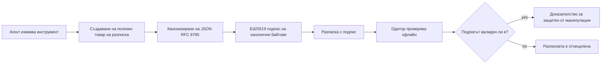
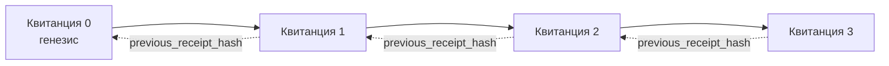

[Гледайте видео урока: Защита на AI агенти с криптографски разписки](https://youtu.be/PLACEHOLDER_VIDEO_ID)

> _(Видео урок и миниатюра ще бъдат добавени от екипа на Microsoft след сливането, съобразени с модела на урок 14 / 15.)_

# Защита на AI агенти с криптографски разписки

## Въведение

В този урок ще разгледаме:

- Защо са важни одитните следи за AI агентите по отношение на съответствието, отстраняването на грешки и доверието.
- Какво е криптографска разписка и по какво се различава от неподписан ред в регистъра.
- Как да се създаде подписана разписка за извикване на инструмент от агент с обикновен Python.
- Как да се провери разписката офлайн и да се открие подправяне.
- Как да се свържат разписки в редица, така че премахването или пренареждането на една да наруши веригата.
- Какво доказват разписките и какво изрично не доказват.

## Учебни цели

След завършване на този урок ще знаете как да:

- Идентифицирате режимите на отказ, които мотивират криптографския произход на действията на агента.
- Създадете Ed25519-подписана разписка върху канонично JSON съдържание.
- Проверите разписка независимо, използвайки само публичния ключ на подписвача.
- Откривате подправяне, като повторно изпълните проверката върху модифицирана разписка.
- Създадете последователност от разписки, свързани с хеш-връзка, и да обясните защо веригата е важна.
- Разпознаете границата между това, което разписките доказват (атрибуция, цялост, ред), и това, което не доказват (коректност на действието, здравина на политиката).

## Проблемът: Одитната следа на вашия агент

Представете си, че сте разположили AI агент за Contoso Travel. Агентът чете заявки от клиенти, извиква API за полети, за да намери опции, и резервира места от името на клиента. През последното тримесечие агентът обработи 50 000 резервации.

Днес пристига одитор. Той задава прост въпрос: „Покажете ми какво е направил вашият агент.“

Предавате му файловете с логове. Одиторът ги разглежда и задава по-трудния въпрос: „Как да знам, че тези логове не са били редактирани?“

Това е проблемът с одитната следа. Повечето агенти днес разчитат на:

- **Приложни логове**: пишат се от самия агент, могат да се редактират от всеки с достъп до файловата система.
- **Услуги за облачно съхранение на логове**: доказателствени за подправяне на платформено ниво, но само ако одиторът вярва на оператора на платформата.
- **Логове на транзакции в бази данни**: подходящи за промени в базата, но не и за произволни извиквания на инструменти.

Никой от тези методи не може да отговори на въпроса на одитора без той да вярва на някого (вас, вашия облачен доставчик, вашия доставчик на база данни). За вътрешна употреба това доверие често е приемливо. За регулирани натоварвания (финанси, здравеопазване, всичко подчинено на Регламента за AI в ЕС) не е.

Криптографските разписки решават това като правят всяко действие на агента независимо проверимо. Одиторът не трябва да ви се доверява. Той се нуждае само от публичния ви ключ и самата разписка.

## Какво е Криптографска Разписка?

Разписката е JSON обект, който записва какво е направил агентът, подписан с цифров подпис.


```mermaid
flowchart LR
    A[Агент извиква инструмент] --> B[Създаване на полезен товар на разписка]
    B --> C[Канонизиране на JSON RFC 8785]
    C --> E[Ed25519 подпис на канонични байтове]
    E --> F[Разписка с подпис]
    F --> G[Одитор проверява офлайн]
    G --> H{Подписът валиден ли е?}
    H -- yes --> I[Доказателство за защитен от манипулации]
    H -- no --> J[Разписката е отхвърлена]
```

Минималната разписка изглежда така:

```json
{
  "type": "agent.tool_call.v1",
  "agent_id": "contoso-travel-bot",
  "tool_name": "lookup_flights",
  "tool_args_hash": "sha256:a3f9c1...",
  "result_hash": "sha256:7b2e1d...",
  "policy_id": "contoso-travel-policy-v3",
  "timestamp": "2026-04-25T14:30:00Z",
  "sequence": 47,
  "previous_receipt_hash": "sha256:9d4e6a...",
  "signature": {
    "alg": "EdDSA",
    "sig": "c5af83...",
    "public_key": "8f3b2c..."
  }
}
```

Три свойства вършат работата:

1. **Подписът**. Разписката е подписана от шлюза на агента с помощта на Ed25519 частен ключ. Всеки с публичния съответстващ ключ може да провери подписа офлайн. Подправяне на каквото и да е поле прави подписа невалиден.

2. **Канонично кодиране**. Преди подписване, разписката се сериализира с JSON Каноничен Схема (JCS, RFC 8785). Това гарантира, че две реализации, произвеждащи същата логическа разписка, ще имат битово идентичен изход. Без канонизация, различните JSON сериализатори биха произвеждали различни подписи за едно и също съдържание.

3. **Връзка чрез хеш**. Полето `previous_receipt_hash` свързва всяка разписка с предишната. Премахването или пренареждането на разписка накърнява всяка разписка след нея. Подправянето става видимо на нивото на веригата, дори ако индивидуалните подписи се заобиколят.

Заедно тези свойства осигуряват три гаранции:

- **Атрибуция**: този ключ е подписал това съдържание.
- **Цялост**: съдържанието не се е променило след подписването.
- **Подредба**: тази разписка е дошла след онзи запис в веригата.

## Създаване на Разписка в Python

Не ви е нужна специална библиотека, за да създадете разписка. Криптографските примитиви са широко достъпни, а логиката е няколко десетки реда Python.

Практическите упражнения в `code_samples/18-signed-receipts.ipynb` преминават през целия процес. Обобщената версия:

```python
import json
import hashlib
import base64
from nacl import signing
from jcs import canonicalize  # RFC 8785 каноничен JSON

def b64url_nopad(data: bytes) -> str:
    return base64.urlsafe_b64encode(data).decode("ascii").rstrip("=")

def sha256_canonical(obj) -> str:
    """SHA-256 of a Python object's JCS-canonical JSON form."""
    return f"sha256:{hashlib.sha256(canonicalize(obj)).hexdigest()}"

# Генерирай или зареди подписващ ключ (в продукция, съхранявай в ключови хранилище)
signing_key = signing.SigningKey.generate()
verify_key = signing_key.verify_key

# Изграждане на полезния товар на разписката (все още без подпис)
tool_args = {"origin": "SYD", "destination": "LAX"}
tool_result = [{"flight": "QF11", "price": 1850, "stops": 0}]

payload = {
    "type": "agent.tool_call.v1",
    "agent_id": "contoso-travel-bot",
    "tool_name": "lookup_flights",
    "tool_args_hash": sha256_canonical(tool_args),
    "result_hash": sha256_canonical(tool_result),
    "policy_id": "contoso-travel-policy-v3",
    "timestamp": "2026-04-25T14:30:00Z",
    "sequence": 0,
    "previous_receipt_hash": None,
}

# Канонизирай и подписвай байтовете на JCS директно. PureEdDSA хешира вътрешно.
canonical_bytes = canonicalize(payload)
signature_bytes = signing_key.sign(canonical_bytes).signature

# Прикачи структуриран обект с подпис.
receipt = {
    **payload,
    "signature": {
        "alg": "EdDSA",
        "sig": b64url_nopad(signature_bytes),
        "public_key": b64url_nopad(bytes(verify_key)),
    },
}
```

Това е цялата подписваща последователност. Упражненията в тетрадката разглеждат всеки етап.

## Проверка на Разписка и Откриване на Подправяне

Проверката е обратната операция:

```python
import base64
import hashlib
from nacl import signing
from nacl.exceptions import BadSignatureError
from jcs import canonicalize

def b64url_decode(s: str) -> bytes:
    padding = "=" * ((4 - len(s) % 4) % 4)
    return base64.urlsafe_b64decode(s + padding)

def verify_receipt(receipt: dict) -> bool:
    # Подписът е структуриран обект: {"alg", "sig", "public_key"}.
    sig_obj = receipt.get("signature")
    if not sig_obj or sig_obj.get("alg") != "EdDSA":
        return False

    # Възстановете полезния товар, който е бил действително подписан (всичко освен подписа).
    payload = {k: v for k, v in receipt.items() if k != "signature"}

    canonical_bytes = canonicalize(payload)

    try:
        verify_key = signing.VerifyKey(b64url_decode(sig_obj["public_key"]))
        verify_key.verify(canonical_bytes, b64url_decode(sig_obj["sig"]))
        return True
    except BadSignatureError:
        return False
```

Тази функция взема разписка и връща `True`, ако подписът е валиден, `False` в противен случай. Без мрежови повиквания, без зависимости на услуги, без необходимост одиторът да вярва на трети лица.

За да видите откриването на подправяне в действие, тетрадката преминава през:

1. Създаване на валидна разписка и потвърждаване, че се проверява успешно.
2. Модифициране на един байт в полето `tool_args_hash`.
3. Повторна проверка и виждане на неуспех.

Това е практическа демонстрация, че разписките са доказуеми срещу подправяне: всяка промяна, дори и мъничка, нарушава подписа.

## Свързване на Разписки за Многоетапни Агенти

Една подписана разписка защитава едно действие. Верига от разписки защитава последователност.


```mermaid
flowchart LR
    R0[Квитанция 0<br/>генезис] --> R1[Квитанция 1]
    R1 --> R2[Квитанция 2]
    R2 --> R3[Квитанция 3]
    R1 -. previous_receipt_hash .-> R0
    R2 -. previous_receipt_hash .-> R1
    R3 -. previous_receipt_hash .-> R2
```

Всяка разписка записва хеша на предишната разписка. За да премахне тиха разписка 2, нападателят би трябвало или:

- Да модифицира полето `previous_receipt_hash` в разписка 3 (нарушава подписа на разписка 3), ИЛИ
- Да фалшифицира нов подпис върху променена разписка 3 (изисква частния ключ на агента).

Ако частният ключ е в хардуерен сейф и публичният ключ се публикува с всяка разписка, нито една от двете атаки не е осъществима без откриване.

Тетрадката разглежда:

1. Създаване на верига от три разписки.
2. Проверка, че `previous_receipt_hash` на всяка разписка съвпада с действителния хеш на предишната.
3. Подправяне на една от разписките по средата и виждане на прекъсване на веригата точно в тази точка.

Така създавате одитна следа, която външен одитор може да провери без да ви се доверява.

## Какво Доказват Разписките (и Какво Не Доказват)

Това е най-важният раздел от урока. Разписките са мощни, но тяхната мощ е ограничена.

**Разписките доказват три неща:**

1. **Атрибуция**: конкретен ключ подписа конкретно съдържание.
2. **Цялост**: съдържанието не се е променило след подписването.
3. **Подредба**: тази разписка дойде след онзи запис в хеш-веригата.

**Разписките НЕ доказват:**

1. **Коректност**: че действието на агента е било правилното. Разписка може да бъде подписана както за грешен, така и за верен отговор.
2. **Съответствие с политика**: че политиката, посочена в `policy_id`, действително е била приложена или че би разрешила действието, ако е била проверена. Разписката записва какво е било твърдено, не какво е било наложено.
3. **Идентичност извън ключа**: разписката казва „този ключ подписа това съдържание.“ Не казва „този човек упълномощи това.“ Свързването на ключ с човек или организация изисква отделна идентификационна инфраструктура (директория, регистър на публични ключове и др.).
4. **Истинност на входните данни**: ако агентът получи манипулиран вход и действа спрямо него, разписката вярно записва действието. Разписките са след проверката на входа, не заместител на тази проверка.

Тази граница е важна по две причини:

- Тя ви казва за какво са полезни разписките: правят поведението на агента одитируемо и доказуемо за подправяне, дори извън организационни граници.
- Тя ви казва какви допълнителни слоеве все още са нужни: проверка на входните данни (Урок 6), изпълнение на политики (описано по-долу накратко) и идентификационна инфраструктура (извън обхвата на този урок).

Често срещана грешка е да се мисли, че „имаме разписки“ значи „управляваме се.“ Не е така. Разписките са основа. Управлението е системата, която изграждате върху нея.

## Доказване, че Човек е Одобрил Точното Действие

Точка 3 от горното си заслужава собствен раздел: разписка за действие казва „този ключ подписа това съдържание,“ а не „човек упълномощи това.“ За рискови действия (връщания на пари, изтривания, банкови преводи) рамките за управление все по-често изискват точно това липсващо изречение, което е възможно за създаване с вече изградени от вас примитиви в този урок.

Последващата тетрадка `code_samples/human-authorization-receipts.ipynb` добавя втори вид разписка, `human.approval.v1`, със същата форма на плик като разписките от урока (типизиран полезен товар, подписан с Ed25519 по неговите канонични JCS байтове, с обект `signature` извън подписаните байтове). Именуван упълномощител подписва **пълното канонично действие и неговия хеш** преди изпълнение; разписката за действие на агента носи **същия хеш на действие** и `parent_approval_ref`, хеш на разписката за одобрение, при същия конвенционален подход като `previous_receipt_hash` във веригата по-горе. Една `verify_chain` проверява и двата артефакта с **отделни фиксирани регистри на ключове** (ключове на упълномощители срещу ключове на агенти), така че пътят на кода е споделен, но властите никога не са.

Свойството, което осигурява, формулирано внимателно: *човекът одобри точно това действие, а агентът изпълни точно това одобрено действие.* Отказите в тетрадката са това, което прави свойството реално, а не само заявено:

- класическият набор: подправяне, объркан заместник, повторение, фалшифицирани ключове от двете страни, неправилно форматиран вход;
- **остаряла власт**: подпис, който все още се верифицира, но е отказан, защото версията на политиката се е променила, ключът на упълномощителя е премахнат от фиксирания регистър, или одобрението е изтекло преди изпълнението;
- **подмяна на хеш**: валидно подписана разписка за действие, сочеща към *истинско* одобрение, което свързва *различно* канонично действие.

Всеки отказ дава различна причина, така че одитор, който чете отказ, може да разбере дали властта е остаряла или изпълненото действие е променено. Правилото, което тетрадката учи: подписаното одобрение само по себе си не е власт. Власт съществува само ако и двете разписки все още се отнасят към едно и също канонично действие във времето на изпълнение. Разписката за одобрение от човек е образователна композиция, дефинирана от този урок, не тип разписка от `draft-farley-acta-signed-receipts`.

## Препратки за Производство

Python кодът в този урок е умишлено минимален, за да може да прочетете всеки ред и да разберете точно какво се случва. За производство имате две възможности:

1. **Да изградите директно върху криптографските примитиви.** 50-те реда, които видяхте по-горе, са достатъчни за много случаи. PyNaCl (Ed25519) и пакетът `jcs` (каноничен JSON) са добре поддържани и одитирани библиотеки.

2. **Да използвате производствена библиотека за разписки.** Няколко проекти с отворен код реализират същия модел с допълнителни функции (ротация на ключове, пакетна проверка, разпространение на JWK сет, интеграция с политически механизми):
   - Потокът на подписване използва JCS и конвенции за обхват на подпис според независим IETF Internet-Draft ([`draft-farley-acta-signed-receipts`](https://datatracker.ietf.org/doc/draft-farley-acta-signed-receipts/), ревизия 02). Плоската образователна разписка от урока се различава от `draft`-овия плик `{payload, signature}` и не е представена като съвместима реализация. Драфтът публикува споделен конформен набор ([agent-governance-testvectors](https://github.com/ScopeBlind/agent-governance-testvectors)) за реализации, насочени към неговия формат.
   - Microsoft Agent Governance Toolkit съчетава разписки с решения на Cedar, вижте Урок 33 в репозиторията за пример от край до край.
   - Пакетите `protect-mcp` (npm) и `@veritasacta/verify` (npm) предоставят Node-базирана имплементация на подписване и офлайн проверка на разписки, предназначена за завиване на всякакъв MCP сървър с доказуема срещу подправяне одитна следа, включително поток с изчакване на съавторизация, при който паузирано действие издава разписка за одобрение, свързана с хеша на действието (WebAuthn-базирано на десктоп потока), същият модел на разписка за одобрение като в горната тетрадка за човешко упълномощаване.
   - **[nobulex](https://github.com/arian-gogani/nobulex)** Python SDK (`pip install nobulex`) предоставя същия модел на подписване Ed25519 + JCS в Python с интеграции за LangChain и CrewAI, включително публикувани тестови вектори за кръстосана проверка и карта за съответствие, допринесена чрез [OWASP PR #2210](https://github.com/OWASP/CheatSheetSeries/pull/2210).

Решението между писане на собствен код и използване на библиотека е подобно на решението между писане на собствена JWT библиотека и използване на тествана: и двете са разумни; библиотеката пести време и намалява повърхността на одита; подходът от нулата ви принуждава да разберете всеки примитив. Този урок учи пътя от нулата, за да имате основа за всяка от двете опции.

## Проверка на знания

Тествайте разбирането си преди да преминете към практическото упражнение.

**1. Разписка е подписана с частния Ed25519 ключ на агента. Одиторът разполага само с публичния ключ. Може ли одиторът да провери разписката офлайн?**

<details>
<summary>Отговор</summary>

Да. Ed25519 верификация изисква само публичния ключ и подписаните байтове. Без мрежови повиквания, без зависимости на услуги. Това е свойството, което прави разписките полезни в среди с изключена мрежа, мултиорганизационни или нискот доверени одити.
</details>

**2. Нападател модифицира полето `policy_id` на разписка, за да твърди, че е била управлявана от по-свободна политика. Подписът е върху оригиналния полезен товар. Какво се случва при проверката?**

<details>
<summary>Отговор</summary>


Проверката не успява. Подписът е изчислен върху каноничните байтове на оригиналното съдържание; промяната на някое поле променя тези байтове, което прави подписа невалиден. Нападателят би трябвало да има частния ключ, за да създаде нов валиден подпис, което той не притежава.
</details>

**3. Защо касовият бон включва `tool_args_hash` и `result_hash` вместо суровите аргументи и резултата?**

<details>
<summary>Отговор</summary>

Два са поводите. Първо, касовият бон може да се архивира или предава в среди, където изтичането на сурово съдържание (лични данни, бизнес информация) е проблем. Хеширането поддържа касовия бон малък и съдържанието поверително; одиторът потвърждава, че хешът съвпада с отделно съхраняваното копие на реалното съдържание. Второ, хешовете имат фиксиран размер; касовият бон с хешове е ограничен по размер, независимо колко големи са били входовете и изходите.
</details>

**4. Полето `previous_receipt_hash` свързва всеки касов бон с неговия предшественик. Ако нападател тихомълком изтрие един касов бон от средата на веригата, какво става невалидно?**

<details>
<summary>Отговор</summary>

Всеки касов бон, идващ след изтрития. Техните полета `previous_receipt_hash` вече не съвпадат с реалната верига (защото референтният касов бон вече не съществува или веригата сочи към друг предшественик). За да скрие изтриването, нападателят би трябвало да преподпише всеки по-късен касов бон, което изисква частния ключ.
</details>

**5. Ако касовият бон се провери чисто. Доказва ли това, че действието на агента е правилно, допустимо или съвместимо с политиката?**

<details>
<summary>Отговор</summary>

Не. Валиден касов бон доказва три неща: атрибуция (този ключ е подписал това съдържание), целостност (съдържанието не е променяно) и подредба (този касов бон идва след онзи). Той НЕ доказва, че действието е било правилно, че политиката в `policy_id` е била оценена или че агентът е спазил всяко правило. Касовите бележки правят поведението на агента проверяемо, но не непременно правилно. Това е най-важната граница в урока.
</details>

## Практическо упражнение

Отворете `code_samples/18-signed-receipts.ipynb` и завършете всички четири части:

1. **Част 1**: Подпишете първия си касов бон и го проверете.
2. **Част 2**: Манипулирайте касовия бон и наблюдавайте неуспеха на проверката.
3. **Част 3**: Създайте верига от три касови бона и проверете целостта на веригата.
4. **Част 4**: Прилагайте шаблона към агент, създаден с Microsoft Agent Framework: обвийте извикването на инструмент в подписване на касов бон, след което проверете касовия бон независимо.

**Разширено предизвикателство 1:** разширете схемата на касовия бон с допълнително поле по собствен избор (напр. ID на заявка за проследяване), актуализирайте логиката за канонично подписване, за да го включите, и потвърдете, че касовият бон все още минава проверка. След това модифицирайте полето след подписването и потвърдете неуспех при проверка. Това ви принуждава да разберете как всеки байт от каноничното кодирането допринася за подписа.

**Разширено предизвикателство 2:** Хеширайте с SHA-256 два от вашите касови бона заедно (конкатенирайте техните канонични байтове в детерминиран ред) и вградете получения дайджест като ново поле в трети касов бон преди подписването. Потвърдете, че всички три касови бона все още минават проверка. Току-що изградихте доказателство за еднократна включеност: всеки, който държи третия касов бон, може да докаже, че първите два са съществували времето на подписването, без да издава съдържанието им. Това е шаблонът, който селективно-разкриващите касови бонове използват в мащаб (Merkle ангажименти, RFC 6962).

## Заключение

Криптографските касови бонове дават на AI агентите одитен трак, който е:

- **Независимо проверим:** всяка страна с публичния ключ може да провери, без зависимост от услуга.
- **Сигнализира за манипулации:** всяка промяна прави подписа невалиден.
- **Преносим:** касовият бон е малък JSON файл; може да се архивира, предава и проверява навсякъде.
- **Съобразен със стандарти:** базиран на Ed25519 (RFC 8032), JCS (RFC 8785) и SHA-256, всички широко използвани примитиви.

Те не са заместител на валидацията на входните данни, прилагането на политики или инфраструктурата за идентичност. Те са основа за тези слоеве. Когато внедрявате агенти в регулирани среди, мултиорганизационни работни процеси или всяка среда, където бъдещ одитор не може да ви се довери, касовите бонове правят одитната следа честна.

Най-важното: касовите бонове доказват кой казал какво и кога. Те не доказват, че казаното е вярно или правилно. Дръжте тази разлика стриктно. Това е разликата между честна система за произход и подвеждаща такава.

## Производствен контролен списък

Когато сте готови да преминете от този урок към внедряване на агенти с подписани касови бонове в реална среда:

- [ ] **Преместете частния ключ за подписване извън лаптопа на разработчика.** Използвайте Azure Key Vault, AWS KMS или хардуерен защитен модул. Частният ключ, който подписва касовите ви бонове, никога не бива да бъде в изходния код или в обикновен текст в машините на приложението.
- [ ] **Публикувайте публичния ключ за проверка.** Одиторите се нуждаят от него за офлайн проверка. Стандартният шаблон е JWK Set на известен URL (RFC 7517), напр. `https://your-org.example.com/.well-known/agent-keys.json`.
- [ ] **Прикрепете веригата външно.** Периодично записвайте най-новия хеш на главата на веригата в прозрачния журнал (Sigstore Rekor, RFC 3161 timestamp authority или втора вътрешна система), за да може външна страна да потвърди "тази верига е съществувала по това време".
- [ ] **Съхранявайте касовите бонове неизменяемо.** Blob сторидж само с добавяне (Azure Storage с политики за неизменяемост, AWS S3 Object Lock) пречи на вътрешен човек да препише историята на ниво сторидж.
- [ ] **Определете периода на съхранение.** Много регулации изискват многогодишно съхранение. Планирайте растежа на касовите бонове (всеки касов бон е ~500 байта; агент, извършващ 10 хиляди извиквания на ден, генерира ~1.8 GB годишно).
- [ ] **Документирайте какво касовите бонове НЕ покриват.** Касовите бонове доказват атрибуция, целостност и подредба. Вашият рънбук трябва ясно да опише какви допълнителни контроли (валидиране на входове, прилагане на политики, ограничаване на скорост, инфраструктура за идентичност) работят заедно с касовите бонове в управленската ви система.

### Имате ли още въпроси за защитата на AI агенти?

Присъединете се към [Microsoft Foundry Discord](https://aka.ms/ai-agents/discord), за да се срещнете с други обучаващи се, да посетите работни часове и да получите отговори на въпросите си за AI агенти.

## След този урок

Този урок покрива подписване на единичен касов бон и вериги със свързани хешове. Същите примитиви се комбинират в няколко по-напреднали шаблона, с които може да се срещнете с напредването на управлението ви:

- **Селективно разкриване.** Когато полетата на касовия бон са независимо зафиксирани (Merkle дърво по RFC 6962), може да разкриете конкретни полета пред определени аудитори и да докажете, че останалите не са променени, без да ги излагате. Полезно, когато един и същ касов бон трябва да удовлетвори и пълна проверка (искаща пълнота), и регулации за минимизиране на данните като GDPR (искащи одиторът да вижда колкото се може по-малко).
- **Отмяна на касови бонове.** Ако частен ключ бъде компрометиран, трябва да има начин да отбележите, че всички касови бонове, подписани с този ключ от определен момент нататък, са ненадеждни. Стандартни шаблони: краткосрочни ключове за подписване плюс публикуван списък за отмяна, или прозрачен журнал с записи за отмяна.
- **Двустранни / разполовени подписни касови бонове.** Някои реализации разделят подписаното съдържание на предварително-изпълнение (`authorization_*`) и след-изпълнение (`result_*`) с независими подписи, полезно когато решението за упълномощаване и наблюдаваният резултат се произвеждат от различни участници или по различно време. Това се добавя върху формата за касов бон, преподаван в този урок.
- **Състав на съдържанието.** Касовият бон запечатва каквито байтове поставите в `result_hash`. Реалните съдържания са често по-богати от един резултат на извикване на инструмент: предишни разсъждения (прогноза на модел, разгледани опции, доказателства и тяхната пълнота, риска, отговорността, резултат на филтър) могат да съжителстват в съдържанието, запечатано с един касов бон. Това запазва формата на касовия бон минимален и позволява схемите на съдържанието да се развиват домейн по домейн.
- **Съвместимост между реализации.** Множество независими реализации на същия формат на касов бон (Python, TypeScript, Rust, Go) се крос-проверяват с общи тестови вектори. Ако изградите собствена реализация, валидирането по публикувани вектори потвърждава съвместимостта на протокола.
- **Миграция към постквантова криптография.** Ed25519 е широко използван днес, но не е квантово устойчив. Форматът на касовия бон позволява смяна на алгоритъма: полето `signature.alg` може да носи `ML-DSA-65` (стандарт за постквантови подписи на NIST), когато имате нужда от миграция. Планирайте период на двойно подписване.

## Допълнителни ресурси

- <a href="https://datatracker.ietf.org/doc/draft-farley-acta-signed-receipts/" target="_blank">IETF Internet-Draft: Подписани касови бонове за машинно-машинен контрол на достъп</a>
- <a href="https://learn.microsoft.com/azure/ai-studio/responsible-use-of-ai-overview" target="_blank">Обзор на отговорното използване на AI (Azure AI)</a>
- <a href="https://datatracker.ietf.org/doc/html/rfc8032" target="_blank">RFC 8032: Цифров подпис с кривата Edwards (EdDSA)</a>
- <a href="https://datatracker.ietf.org/doc/html/rfc8785" target="_blank">RFC 8785: Схема за канонизация на JSON (JCS)</a>
- <a href="https://datatracker.ietf.org/doc/html/rfc6962" target="_blank">RFC 6962: Прозрачност на сертификатите</a> (Merkle структура, използвана от селективно-разкриващи касови бонове)
- <a href="https://github.com/microsoft/agent-governance-toolkit/blob/main/docs/tutorials/33-offline-verifiable-receipts.md" target="_blank">Microsoft Agent Governance Toolkit, Урок 33: Офлайн проверими касови бонове</a>
- <a href="https://github.com/ScopeBlind/agent-governance-testvectors" target="_blank">Тестови вектори за съвместимост между реализации</a> за формата на касов бон, използван в този урок (Apache-2.0)
- <a href="https://pynacl.readthedocs.io/" target="_blank">PyNaCl документация</a> (Ed25519 в Python)

## Предишен урок

[Създаване на локални AI агенти](../17-creating-local-ai-agents/README.md)

---

<!-- CO-OP TRANSLATOR DISCLAIMER START -->
**Отказ от отговорност**:
Този документ е преведен с помощта на AI преводачески услуга [Co-op Translator](https://github.com/Azure/co-op-translator). Въпреки че се стремим към точност, моля имайте предвид, че автоматизираните преводи могат да съдържат грешки или неточности. Оригиналният документ на неговия роден език трябва да се счита за авторитетен източник. За критична информация се препоръчва професионален човешки превод. Ние не носим отговорност за каквито и да е недоразумения или неправилни тълкувания, произтичащи от използването на този превод.
<!-- CO-OP TRANSLATOR DISCLAIMER END -->