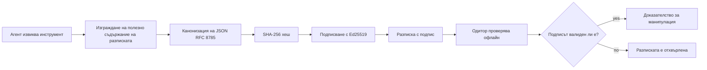
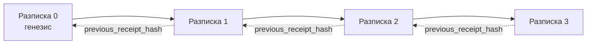

[Гледайте видео урока: Защита на AI агенти с криптографски разписки](https://youtu.be/PLACEHOLDER_VIDEO_ID)

> _(Видео урок и миниатюра ще бъдат добавени от екипа на Microsoft след сливането, съответстващи на урок 14 / 15.)_

# Защита на AI агенти с криптографски разписки

## Въведение

Този урок ще разгледа:

- Защо трасетата на одита за AI агенти са важни за съответствие, отстраняване на грешки и доверие.
- Какво представлява криптографската разписка и как се различава от незнаково регистриране.
- Как да се създаде подписана разписка за повикване на инструмент от агент с обикновен Python.
- Как да се верифицира разписка офлайн и да се засече манипулация.
- Как да се свържат разписките така, че премахването или пренареждането на една да прекъсва веригата.
- Какво доказват разписките и какво изрично не доказват.

## Цели на обучението

След завършване на този урок, ще знаете как да:

- Идентифицирате режимите на повреда, които мотивират криптографската автентичност за действия на агента.
- Създавате Ed25519-подписана разписка върху каноничен JSON полезен товар.
- Независимо да верифицирате разписката, използвайки само публичния ключ на подписващия.
- Да засичате манипулация чрез повторно изпълнение на верификацията с модифицирана разписка.
- Да изграждате последователност от разписки с хеш верига и да обяснявате защо веригата е важна.
- Да разпознавате границата между онова, което разписките доказват (атрибуция, цялост, ред) и онова, което не доказват (правилност на действието, валидност на политиката).

## Проблемът: Одитният път на вашия агент

Представете си, че сте разположили AI агент за Contoso Travel. Агентът чете заявки на клиенти, извиква API за полети, за да търси опции, и резервира места от името на клиента. През последното тримесечие агентът е обработил 50 000 резервации.

Днес пристига одитор. Той задава прост въпрос: „Покажи ми какво направи агентът ти.“

Предавате му файловете с логове. Одиторът ги разглежда и задава по-трудния въпрос: „Как да знам, че тези логове не са били редактирани?“

Това е проблемът с одитния път. Повечето настоящи внедрявания на агенти разчитат на:

- **Приложни логове**: записани от самия агент, могат да се редактират от всеки с достъп до файловата система.
- **Услуги за облачно логиране**: с видима за манипулация защита на платформата, но само ако одиторът се доверява на оператора на платформата.
- **Логове на базата данни за транзакции**: подходящи за промени в базата, но не и за произволни повиквания на инструменти.

Нито един от тях не може да отговори на въпроса на одитора без да се изисква доверие към някого (теб, твоя облачен доставчик, твоя доставчик на база данни). За вътрешна употреба това доверие често е приемливо. За регулирани натоварвания (финанси, здравеопазване, всичко подчинено на Закона за AI на ЕС) не е.

Криптографските разписки решават това, като правят всяко действие на агента независимо проверимо. Одиторът не трябва да ти се доверява. Той се нуждае само от публичния ти ключ и самата разписка.

## Какво е криптографска разписка?

Разписката е JSON обект, който записва какво е направил агентът, подписан с цифров подпис.


```mermaid
flowchart LR
    A[Агент извиква инструмент] --> B[Изграждане на полезно съдържание на разписката]
    B --> C[Канонизация на JSON RFC 8785]
    C --> D[SHA-256 хеш]
    D --> E[Подписване с Ed25519]
    E --> F[Разписка с подпис]
    F --> G[Одитор проверява офлайн]
    G --> H{Подписът валиден ли е?}
    H -- yes --> I[Доказателство за манипулация]
    H -- no --> J[Разписката е отхвърлена]
```

Минимална разписка изглежда така:

```json
{
  "type": "agent.tool_call.v1",
  "agent_id": "contoso-travel-bot",
  "tool_name": "lookup_flights",
  "tool_args_hash": "sha256:a3f9c1...",
  "result_hash": "sha256:7b2e1d...",
  "policy_id": "contoso-travel-policy-v3",
  "timestamp": "2026-04-25T14:30:00Z",
  "sequence": 47,
  "previous_receipt_hash": "sha256:9d4e6a...",
  "signature": {
    "alg": "EdDSA",
    "sig": "c5af83...",
    "public_key": "8f3b2c..."
  }
}
```

Три свойства вършат работата:

1. **Подписът**. Разписката е подписана от шлюза на агента чрез частен Ed25519 ключ. Всеки с отговарящия публичен ключ може да верифицира подписа офлайн. Манипулацията на каквото и да било поле прави подписа невалиден.

2. **Каноническо кодиране**. Преди подписване, разписката се сериализира чрез JSON Canonicalization Scheme (JCS, RFC 8785). Това осигурява, че две реализации, произвеждащи една и съща логическа разписка, създават байт-идентичен резултат. Без канонизация различни JSON сериализатори биха произвеждали различни подписи за едно и също съдържание.

3. **Хеш верига**. Полето `previous_receipt_hash` свързва всяка разписка с предишната. Премахването или пренареждането на разписка прекъсва всяка следваща. Манипулацията става видима на нивото на веригата, дори ако отделни подписи бъдат заобиколени.

Заедно тези свойства осигуряват три гаранции:

- **Атрибуция**: този ключ е подписал това съдържание.
- **Цялост**: съдържанието не е променяно след подписването.
- **Ред**: тази разписка е следвала предишната в веригата.

## Създаване на разписка в Python

Не е нужна специална библиотека, за да се създаде разписка. Криптографските примитиви са широко достъпни и логиката е няколко десетки реда Python.

Практическите упражнения в `code_samples/18-signed-receipts.ipynb` разясняват целия процес. Обобщение:

```python
import json
import hashlib
import base64
from nacl import signing
from jcs import canonicalize  # RFC 8785 каноничен JSON

def b64url_nopad(data: bytes) -> str:
    return base64.urlsafe_b64encode(data).decode("ascii").rstrip("=")

def sha256_canonical(obj) -> str:
    """SHA-256 of a Python object's JCS-canonical JSON form."""
    return f"sha256:{hashlib.sha256(canonicalize(obj)).hexdigest()}"

# Генерирайте или заредете подписващ ключ (в производство, съхранявайте го в ключово хранилище)
signing_key = signing.SigningKey.generate()
verify_key = signing_key.verify_key

# Създайте полезния товар на разписката (все още няма подпис)
tool_args = {"origin": "SYD", "destination": "LAX"}
tool_result = [{"flight": "QF11", "price": 1850, "stops": 0}]

payload = {
    "type": "agent.tool_call.v1",
    "agent_id": "contoso-travel-bot",
    "tool_name": "lookup_flights",
    "tool_args_hash": sha256_canonical(tool_args),
    "result_hash": sha256_canonical(tool_result),
    "policy_id": "contoso-travel-policy-v3",
    "timestamp": "2026-04-25T14:30:00Z",
    "sequence": 0,
    "previous_receipt_hash": None,
}

# Канонизирайте, хеширайте, подпишете.
canonical_bytes = canonicalize(payload)
message_hash = hashlib.sha256(canonical_bytes).digest()
signature_bytes = signing_key.sign(message_hash).signature

# Прикачете структуриран подпис obект.
receipt = {
    **payload,
    "signature": {
        "alg": "EdDSA",
        "sig": b64url_nopad(signature_bytes),
        "public_key": b64url_nopad(bytes(verify_key)),
    },
}
```

Това е цялото подписващо звено. Упражненията в тетрадката разглеждат всяка стъпка.

## Верификация на разписка и откриване на манипулации

Верификацията е обратната операция:

```python
import base64
import hashlib
from nacl import signing
from nacl.exceptions import BadSignatureError
from jcs import canonicalize

def b64url_decode(s: str) -> bytes:
    padding = "=" * ((4 - len(s) % 4) % 4)
    return base64.urlsafe_b64decode(s + padding)

def verify_receipt(receipt: dict) -> bool:
    # Подписът е структуриран обект: {"alg", "sig", "public_key"}.
    sig_obj = receipt.get("signature")
    if not sig_obj or sig_obj.get("alg") != "EdDSA":
        return False

    # Възстановете товара, който всъщност е бил подписан (всичко освен подписа).
    payload = {k: v for k, v in receipt.items() if k != "signature"}

    canonical_bytes = canonicalize(payload)
    message_hash = hashlib.sha256(canonical_bytes).digest()

    try:
        verify_key = signing.VerifyKey(b64url_decode(sig_obj["public_key"]))
        verify_key.verify(message_hash, b64url_decode(sig_obj["sig"]))
        return True
    except BadSignatureError:
        return False
```

Тази функция приема разписка и връща `True`, ако подписът е валиден, и `False` в противен случай. Без повикване на мрежа, без зависимост от услуга, без доверие в трета страна.

За да видите действително засичане на манипулация, тетрадката води през:

1. Създаване на валидна разписка и потвърждение, че се верифицира.
2. Модифициране на един байт в полето `tool_args_hash`.
3. Повторно изпълнение на верификация и наблюдение на провал.

Това е практическа демонстрация, че разписките са видими за манипулация: всяка промяна, колкото и малка да е, прекъсва подписа.

## Свързване на разписки за многоетапни агенти

Една подписана разписка защитава едно действие. Веригата от разписки защитава последователност.


```mermaid
flowchart LR
    R0[Разписка 0<br/>генезис] --> R1[Разписка 1]
    R1 --> R2[Разписка 2]
    R2 --> R3[Разписка 3]
    R1 -. previous_receipt_hash .-> R0
    R2 -. previous_receipt_hash .-> R1
    R3 -. previous_receipt_hash .-> R2
```

Всяка разписка записва хеша на предишната. За да премахне разписка 2 безшумно, атакуващият трябва или:

- Да модифицира полето `previous_receipt_hash` на разписка 3 (което прекъсва подписа на разписка 3), ИЛИ
- Да подправи нов подпис върху модифицирана разписка 3 (изисква частния ключ на агента).

Ако частният ключ е в хардуерен ключов хранилище и публикувате публичния ключ с всяка разписка, нито една атака не е осъществима без да бъде открита.

Тетрадката разглежда:

1. Изграждане на верига от три разписки.
2. Верифициране, че `previous_receipt_hash` на всяка разписка съвпада с действителния хеш на предишната.
3. Манипулация на разписка в средата и наблюдаване как веригата се прекъсва точно там.

Така произвеждате одитен път, който външен одитор може да верифицира без да трябва да ви се доверява.

## Какво доказват разписките (и какво не доказват)

Това е най-важният раздел на урока. Разписките са мощни, но мощността им е ограничена.

**Разписките доказват три неща:**

1. **Атрибуция**: определен ключ е подписал определен полезен товар.
2. **Цялост**: полезният товар не е променян след подписването.
3. **Ред**: тази разписка е следвала тази в хеш веригата.

**Разписките НЕ доказват:**

1. **Правилност**: че действието на агента е било правилното действие. Разписка може да бъде подписана както за грешен, така и за правилен отговор.
2. **Спазване на политика**: че заявената в `policy_id` политика е била наистина оценена или че щеше да позволи това действие. Разписката записва това, което се твърди, а не това, което е било приложено.
3. **Личност извън ключа**: разписката казва „този ключ е подписал това съдържание“. Не казва „този човек е разрешил това“. Свързването на ключ с човек или организация изисква отделна идентификационна инфраструктура (директория, регистър на публични ключове и др.).
4. **Истинност на входни данни**: ако агентът получи манипулиран въпрос и действа на база него, разписката вярно записва действието. Разписките са след валидирането на входа, не са заместител на това.

Тази граница е важна по две причини:

- Тя казва за какво са полезни разписките: да направят поведението на агента одитно и видимо за манипулации, дори между организации.
- Тя казва какви допълнителни слоеве са необходими: валидиране на входа (Урок 6), прилагане на политика (покрито накратко по-долу) и идентификационна инфраструктура (извън обхвата на този урок).

Честа грешка е да се мисли, че "имаме разписки" означава "управляваме." Не е така. Разписките са основа. Управлението е системата, която изграждате върху тях.

## Производствени препратки

Python кодът в този урок е нарочно минимален, за да може да прочетете всеки ред и да разберете какво точно се случва. В продукция имате два варианта:

1. **Изградете директно върху криптографските примитиви.** 50-те реда, които видяхте по-горе, са достатъчни за много случаи. PyNaCl (Ed25519) и пакетът `jcs` (каноничен JSON) са добре поддържани и одитирани библиотеки.

2. **Използвайте библиотека за производство на разписки.** Няколко проекта с отворен код реализират същия модел с допълнителни функции (ротация на ключове, пакетна верификация, разпространение на JWK Set, интеграция с политики):
   - Форматът на разписките, използван в този урок, следва проект на IETF Internet-Draft (`draft-farley-acta-signed-receipts`), в процес на стандартизация.
   - Microsoft Agent Governance Toolkit комбинира разписки с решения за политики на база Cedar; вижте Урок 33 в това хранилище за пълен пример.
   - Пакетите `protect-mcp` (npm) и `@veritasacta/verify` (npm) предоставят Node-реализация на подписване и офлайн верификация на разписки, предназначена за опаковане на всеки MCP сървър с видим за манипулация одитен път.
   - **[nobulex](https://github.com/arian-gogani/nobulex)** Python SDK (`pip install nobulex`) предоставя същия модел Ed25519 + JCS подписване в Python с интеграции за LangChain и CrewAI, включително публикувани тестови вектори за взаимна валидация и съответствие, добавени чрез [OWASP PR #2210](https://github.com/OWASP/CheatSheetSeries/pull/2210).

Изборът между собствена реализация и библиотека е като решението да пишете собствена JWT библиотека или да използвате тествана: и двете са разумни; библиотеката спестява време и намалява обема за одит; от-някъде-от-начало подходът ви кара да разберете всеки примитив. Този урок преподава подхода от нулата, за да имате основа за всяка възможност.

## Проверка на знанията

Тествайте разбирането си преди да преминете към практическото упражнение.

**1. Разписката е подписана с частния Ed25519 ключ на агента. Одиторът има само публичния ключ. Може ли одиторът да верифицира разписката офлайн?**

<details>
<summary>Отговор</summary>

Да. Ed25519 верификация изисква само публичния ключ и подписаните байтове. Без мрежово повикване, без зависимост от услуга. Това е свойството, което прави разписките полезни в изолирани, мултиорганизационни или нискодовериващи одитни настройки.
</details>

**2. Атакуващ модифицира полето `policy_id` на разписка, за да твърди, че е управлявана от по-либерална политика. Подписът е върху оригиналния полезен товар. Какво се случва при верификация?**

<details>
<summary>Отговор</summary>

Верификацията не успява. Подписът е изчислен върху каноничните байтове на оригиналния полезен товар; промяната на кое да е поле променя каноничните байтове, което променя SHA-256 хеша и прави подписа невалиден. Атакуващият би трябвало да разполага с частния ключ, за да направи нов валиден подпис, което няма.
</details>

**3. Защо разписката включва `tool_args_hash` и `result_hash` вместо суровите аргументи и резултат?**

<details>
<summary>Отговор</summary>

Поради две причини. Първо, разписката може да трябва да се архивира или пренася в среди, където изтичане на сурово съдържание (уникална лична информация, бизнес данни) е проблем. Хеширането запазва разписката малка и съдържанието поверително; одиторът проверява, че хешът съвпада с отделно съхранявано копие на реалното съдържание. Второ, хешовете са с фиксиран размер; разписка с хешове има ограничен размер независимо от размера на входовете и изходите.
</details>

**4. Полето `previous_receipt_hash` свързва всяка разписка с предишната. Ако атакуващ тихо изтрие една разписка от средата на верига, какво става невалидно?**

<details>
<summary>Отговор</summary>

Всяка разписка след изтритата. Техните полета `previous_receipt_hash` вече не съвпадат с истинската верига (защото разписката, на която препращат, вече не съществува или верига сочи друг предшественик). За да скрие изтриването, атакуващият би трябвало да преподпише всяка по-късна разписка, което изисква частния ключ.
</details>

**5. Разписката се верифицира успешно. Доказва ли това, че действието на агента е било правилно, логично или съобразено с политика?**

<details>
<summary>Отговор</summary>

Не. Валидна разписка доказва три неща: атрибуция (този ключ е подписал това съдържание), цялост (съдържанието не е променено) и ред (това е следвало онова в хеш веригата). НЕ доказва, че действието е било правилно, че политиката, посочена в `policy_id`, е била оценена, или че агентът е спазил всички правила. Разписките правят поведението на агента одитируемо, не непременно правилно. Това е най-важната граница в урока.
</details>

## Практическо упражнение

Отворете `code_samples/18-signed-receipts.ipynb` и завършете всички четири раздела:

1. **Раздел 1**: Подпишете първата си разписка и я верифицирайте.
2. **Раздел 2**: Манипулирайте разписката и наблюдавайте провал на верификацията.
3. **Раздел 3**: Създайте верига от три разписки и проверете цялостта на веригата.
4. **Раздел 4**: Приложете модела към агент, изграден с Microsoft Agent Framework: оградете повикване на инструмент с подписване на разписката, след което я верифицирайте независимо.


**Предизвикателство 1 за разтягане:** разширете схемата на разписката с допълнително поле по ваш избор (например, идентификатор на заявка за проследяване), актуализирайте каноничната логика за подписване, за да го включите, и потвърдете, че разписката все още преминава успешно през проверка. След това променете полето след подписването и потвърдете, че проверката не успява. Това ще ви принуди да разберете как всеки байт от каноничното кодиране допринася за подписа.

**Предизвикателство 2 за разтягане:** SHA-256 хеширайте две от вашите разписки заедно (конкатенирайте техните канонични байтове в детерминиран ред) и вградете получения хеш като ново поле в трета разписка преди нейното подписване. Проверете, че и трите разписки все още преминават успешно проверка. Току-що сте изградили едностепенно доказателство за включване: всеки, който държи третата разписка, може да докаже, че първите две са съществували по време на нейното подписване, без да е необходимо да разкрива тяхното съдържание. Това е моделът, който масово използват разписките за селективно разкриване (Merkle commitments, RFC 6962).

## Заключение

Криптографските разписки дават на AI агентите следа за одит, която е:

- **Независимо проверима:** всяка страна с публичния ключ може да проверява, без зависимост от услуга.
- **Свидетелства за подправяне:** всяка промяна прави подписа невалиден.
- **Преносима:** разписката е малък JSON файл; може да бъде архивирана, предавана и проверявана навсякъде.
- **Съобразена със стандартите:** изградена върху Ed25519 (RFC 8032), JCS (RFC 8785) и SHA-256, всички широко разпространени примитиви.

Те не са заместител на валидирането на входните данни, прилагането на политики или инфраструктурата за идентичност. Те са основа за тези слоеве. Когато разгръщате агенти в регламентирани натоварвания, мултиорганизационни работни процеси или във всяка среда, където бъдещ одитор не може да се предполага, че ви се доверява, разписките са начинът да направите следата за одит честна.

Най-важният извод: разписките доказват кой каза какво и кога. Те не доказват, че казаното е било вярно или правилно. Запазете тази разлика стегнато. Тя е разликата между честна система за произход и подвеждаща.

## Контролен списък за продукция

Когато сте готови да преминете от този урок към разполагане на агенти с подписване на разписки в реална среда:

- [ ] **Преместете ключа за подписване извън лаптопа на разработчика.** Използвайте Azure Key Vault, AWS KMS или хардуерен модул за сигурност. Частният ключ, който подписва вашите разписки, никога не трябва да живее в системата за контрол на версиите или в нешифрован вид върху машините на приложението.
- [ ] **Публикувайте публичния ключ за проверка.** Одиторите го нуждаят за проверка офлайн. Стандартният модел е JWK Set на добре познат URL адрес (RFC 7517), напр. `https://your-org.example.com/.well-known/agent-keys.json`.
- [ ] **Закответе веригата външно.** Периодично записвайте хеша на най-новия връх на веригата в регистър за прозрачност (Sigstore Rekor, RFC 3161 timestamp authority, или втора вътрешна система), за да може външна страна да потвърди „тази верига е съществувала по това време.“
- [ ] **Съхранявайте разписките по неизменим начин.** Съхранение с добавяне само (Azure Storage с политики за неизменност, AWS S3 Object Lock) предотвратява пренаписване на историята на ниво съхранение от вътрешни лица.
- [ ] **Решете за задържането.** Много регулаторни режими изискват многогодишно задържане. Планирайте растежа на разписките (всяка разписка е ~500 байта; агент, който прави 10К извиквания на ден, генерира ~1.8 GB на година).
- [ ] **Документирайте какво не покриват разписките.** Разписките доказват приписване, цялост и подреждане. Вашият ръководен документ трябва изрично да споменава какви допълнителни контроли (валидация на вход, прилагане на политики, ограничаване на честотата, инфраструктура за идентичност) съществуват заедно с разписките във вашия режим на управление.

### Имате ли още въпроси относно осигуряването на AI агенти?

Присъединете се към [Microsoft Foundry Discord](https://aka.ms/ai-agents/discord), за да се срещнете с други учащи, да присъствате на часове за въпроси и да получите отговори на въпросите си за AI агенти.

## Отвъд този урок

Този урок обхваща подписване на единична разписка и последователности, свързани с хеш вериги. Същите примитиви се комбинират в няколко по-напреднали модела, с които може да се сблъскате, докато вашият режим на управление се развива:

- **Селективно разкриване.** Когато полетата на разписка са независимо ангажирани (Merkle дърво в стил RFC 6962), можете да разкривате конкретни полета на конкретни одитори и да докажете, че останалите не са променени без да ги излагате. Полезно, когато една и съща разписка трябва да удовлетвори както изчерпателен одит (който иска пълнота), така и регулации за минимизиране на данни като GDPR (които искат одиторът да вижда колкото е възможно по-малко).
- **Отказване на разписки.** Ако ключ за подписване бъде компрометиран, имате нужда от начин да маркирате всички разписки, подписани с този ключ, като ненадеждни от определен момент нататък. Стандартни модели: краткоживущи ключове за подписване плюс публикуван списък за отмяна, или регистър за прозрачност с записи за отмяна.
- **Дву- или многопартийни разписки с разделен подпис.** Някои реализации разделят подписаното съдържание на половини за предварително изпълнение (`authorization_*`) и след изпълнение (`result_*`) с независими подписи, полезно когато решението за упълномощаване и наблюдаваният резултат са произведени от различни участници или по различно време. Това се наслагва върху формата на разписката от този урок.
- **Композиция на съдържанието.** Разписката запечатва каквито байтове поставите в `result_hash`. В реални ситуации съдържанието често е по-богато от резултат на една инструментална функция: предпоставъчна аргументация (прогноза на модел, разгледани опции, доказателства и тяхната пълнота, рискова позиция, верига на отговорност, резултат от контролна стъпка) може да се съдържа в payload-а, запечатан с една разписка. Това поддържа минимален формат на разписката, докато схемите на съдържанието могат да се развиват домейн по домейн.
- **Съответствие между реализации.** Множество независими реализации на същия формат на разписката (Python, TypeScript, Rust, Go) се проверяват взаимно срещу споделени тестови вектори. Ако изграждате собствена реализация, валидирането срещу публикувани вектори потвърждава съвместимост по протокола.
- **Миграция след квантова ера.** Ed25519 е широко използван днес, но не е устойчив на квантови атаки. Форматът на разписката е алгоритмично гъвкав: полето `signature.alg` може да носи `ML-DSA-65` (стандарт за подписи след квантова ера според NIST), когато имате нужда от миграция. Планирайте преходен период, когато разписките са подписани двукратно.

## Допълнителни ресурси

- <a href="https://datatracker.ietf.org/doc/draft-farley-acta-signed-receipts/" target="_blank">IETF Internet-Draft: Подписани разписки за контрол на достъп машина-машина</a>
- <a href="https://learn.microsoft.com/azure/ai-studio/responsible-use-of-ai-overview" target="_blank">Отговорно използване на ИИ (Azure AI)</a>
- <a href="https://datatracker.ietf.org/doc/html/rfc8032" target="_blank">RFC 8032: Алгоритъм за цифров подпис на Edwards извивка (EdDSA)</a>
- <a href="https://datatracker.ietf.org/doc/html/rfc8785" target="_blank">RFC 8785: Схема за канонизация на JSON (JCS)</a>
- <a href="https://datatracker.ietf.org/doc/html/rfc6962" target="_blank">RFC 6962: Прозрачност на сертификати</a> (построяване на Merkle дърво, използвано от разписки с селективно разкриване)
- <a href="https://github.com/microsoft/agent-governance-toolkit/blob/main/docs/tutorials/33-offline-verifiable-receipts.md" target="_blank">Microsoft Agent Governance Toolkit, Урок 33: Офлайн-проверими разписки за решения</a>
- <a href="https://github.com/ScopeBlind/agent-governance-testvectors" target="_blank">Тестови вектори за съответствие между реализации</a> за формата на разписка от този урок (Apache-2.0)
- <a href="https://pynacl.readthedocs.io/" target="_blank">Документация за PyNaCl</a> (Ed25519 в Python)

## Предишен урок

[Изграждане на агенти за използване на компютър (CUA)](../15-browser-use/README.md)

---

<!-- CO-OP TRANSLATOR DISCLAIMER START -->
**Отказ от отговорност**:
Този документ е преведен с помощта на AI преводачески услуга [Co-op Translator](https://github.com/Azure/co-op-translator). Въпреки че се стремим към точност, моля имайте предвид, че автоматизираните преводи могат да съдържат грешки или неточности. Оригиналният документ на неговия роден език трябва да се счита за авторитетен източник. За критична информация се препоръчва професионален човешки превод. Ние не носим отговорност за каквито и да е недоразумения или неправилни тълкувания, произтичащи от използването на този превод.
<!-- CO-OP TRANSLATOR DISCLAIMER END -->