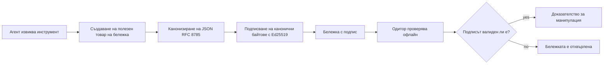
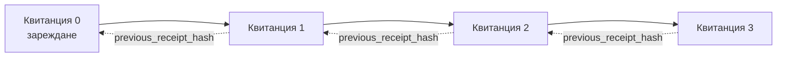

[Гледайте видеоурока: Осигуряване на AI Агенти с Криптографски Квитанции](https://youtu.be/PLACEHOLDER_VIDEO_ID)

> _(Видео урок и миниатюра ще бъдат добавени от екипа за съдържание на Microsoft след обединяването, съвпадащи с модела за урок 14 / 15.)_

# Осигуряване на AI Агенти с Криптографски Квитанции

## Въведение

Този урок ще обхване:

- Защо аудит трайлите за AI агенти са важни за съответствие, отстраняване на грешки и доверие.
- Какво представлява криптографска квитанция и как се различава от неподписан лог запис.
- Как да се произведе подписана квитанция за повикване на инструмент от агент с обикновен Python.
- Как да се провери квитанция офлайн и да се засече подправяне.
- Как да се свържат квитанциите в верига, така че премахване или пренареждане на една да нарушава веригата.
- Какво доказват квитанциите и какво изрично не доказват.

## Учебни Цели

След завършване на този урок ще знаете как да:

- Идентифицирате режимите на неизправност, които наложиха криптографска проследимост на действията на агента.
- Произвеждате Ed25519-подписана квитанция върху каноничен JSON полезен товар.
- Проверявате квитанция независимо, използвайки само публичния ключ на подписвача.
- Засичате подправяне чрез повторна верификация на променена квитанция.
- Създавате верига от квитанции с хеш и обяснявате защо веригата е важна.
- Разпознавате границата между това какво доказват квитанциите (атрибуция, интегритет, подредба) и какво не доказват (коректност на действието, разумност на политиката).

## Проблемът: Аудит Трайл на Вашия Агент

Представете си, че сте разположили AI агент за Contoso Travel. Агентът чете заявки от клиенти, извиква API за полети за проверка на опции и резервира места от името на клиента. Миналото тримесечие агентът обработи 50 000 резервации.

Днес пристига одитор. Той задава прост въпрос: "Покажете ми какво е направил вашият агент."

Предавате файловете с логове. Одиторът ги разглежда и задава по-трудния въпрос: "Как да знам, че тези логове не са били редактирани?"

Това е проблемът с аудит траила. Повечето внедрения на агенти днес разчитат на:

- **Приложни логове**: писани от самия агент, редактирани от всеки, който има достъп до файловата система.
- **Облачни услуги за логиране**: с възможност за засичане на подправяне на платформено ниво, но само ако одиторът се доверява на оператора на платформата.
- **Логове на транзакции в базата данни**: подходящи за проследяване на промени в базата, но не и за произволни повиквания на инструменти.

Нито един от тези не може да отговори на въпроса на одитора без одиторът да се довери на някого (вас, доставчика на облак, доставчика на базата данни). За вътрешна употреба това доверие често е приемливо. За регулирани работни натоварвания (финанси, здравеопазване, всичко подлежащо на EU AI Act) – не е.

Криптографските квитанции решават това, като правят всяко действие на агента независимо проверимо. Одиторът не трябва да ви се доверява. Той се нуждае само от публичния ви ключ и самата квитанция.

## Какво е Криптографска Квитанция?

Квитанцията е JSON обект, който записва какво е направил агентът, подписан с дигитален подпис.


```mermaid
flowchart LR
    A[Агент извиква инструмент] --> B[Създаване на полезен товар на бележка]
    B --> C[Канонизиране на JSON RFC 8785]
    C --> E[Подписване на канонични байтове с Ed25519]
    E --> F[Бележка с подпис]
    F --> G[Одитор проверява офлайн]
    G --> H{Подписът валиден ли е?}
    H -- yes --> I[Доказателство за манипулация]
    H -- no --> J[Бележката е отхвърлена]
```

Минимална квитанция изглежда така:

```json
{
  "type": "agent.tool_call.v1",
  "agent_id": "contoso-travel-bot",
  "tool_name": "lookup_flights",
  "tool_args_hash": "sha256:a3f9c1...",
  "result_hash": "sha256:7b2e1d...",
  "policy_id": "contoso-travel-policy-v3",
  "timestamp": "2026-04-25T14:30:00Z",
  "sequence": 47,
  "previous_receipt_hash": "sha256:9d4e6a...",
  "signature": {
    "alg": "EdDSA",
    "sig": "c5af83...",
    "public_key": "8f3b2c..."
  }
}
```

Три свойства извършват работата:

1. **Подписът**. Квитанцията е подписана от шлюза на агента с Ed25519 частен ключ. Всеки с кореспондиращия публичен ключ може да верифицира подписа офлайн. Подправяне на някое поле прави подписа невалиден.

2. **Канонично кодиране**. Преди подписването, квитанцията се сериализира с JSON Canonicalization Scheme (JCS, RFC 8785). Това гарантира, че две имплементации, произвеждащи една и съща логическа квитанция, произвеждат байт-идентичен изход. Без канонизация различни JSON сериализатори биха произвели различни подписи за едно и също съдържание.

3. **Хеш веригуване**. Полето `previous_receipt_hash` свързва всяка квитанция с предходната. Премахване или пренареждане на квитанция нарушава всяка последвала я квитанция. Подправянето става видимо на ниво верига, дори ако отделни подписи са заобиколени.

Заедно тези свойства предоставят три гаранции:

- **Атрибуция**: този ключ е подписал това съдържание.
- **Интегритет**: съдържанието не е променяно след подписването.
- **Подредба**: тази квитанция е дошла след тази квитанция във веригата.

## Създаване на Квитанция в Python

Не ви е нужна специална библиотека за създаване на квитанция. Криптографските примитиви са широко достъпни, а логиката е няколко десетки реда Python.

Практическите упражнения в `code_samples/18-signed-receipts.ipynb` минават през целия процес. Обобщението:

```python
import json
import hashlib
import base64
from nacl import signing
from jcs import canonicalize  # Каноничен JSON според RFC 8785

def b64url_nopad(data: bytes) -> str:
    return base64.urlsafe_b64encode(data).decode("ascii").rstrip("=")

def sha256_canonical(obj) -> str:
    """SHA-256 of a Python object's JCS-canonical JSON form."""
    return f"sha256:{hashlib.sha256(canonicalize(obj)).hexdigest()}"

# Генериране или зареждане на ключ за подпис (в продукция да се съхранява в хранилище за ключове)
signing_key = signing.SigningKey.generate()
verify_key = signing_key.verify_key

# Създаване на съдържанието на разписката (все още без подпис)
tool_args = {"origin": "SYD", "destination": "LAX"}
tool_result = [{"flight": "QF11", "price": 1850, "stops": 0}]

payload = {
    "type": "agent.tool_call.v1",
    "agent_id": "contoso-travel-bot",
    "tool_name": "lookup_flights",
    "tool_args_hash": sha256_canonical(tool_args),
    "result_hash": sha256_canonical(tool_result),
    "policy_id": "contoso-travel-policy-v3",
    "timestamp": "2026-04-25T14:30:00Z",
    "sequence": 0,
    "previous_receipt_hash": None,
}

# Канонизиране и подписване на JCS байтовете директно. PureEdDSA извършва хеширане вътрешно.
canonical_bytes = canonicalize(payload)
signature_bytes = signing_key.sign(canonical_bytes).signature

# Прикачване на структурирана обект за подпис.
receipt = {
    **payload,
    "signature": {
        "alg": "EdDSA",
        "sig": b64url_nopad(signature_bytes),
        "public_key": b64url_nopad(bytes(verify_key)),
    },
}
```

Това е цялата верига на подписване. Упражненията в тетрадката разглеждат всяка стъпка.

## Проверка на Квитанция и Засичане на Подправяне

Проверката е обратната операция:

```python
import base64
import hashlib
from nacl import signing
from nacl.exceptions import BadSignatureError
from jcs import canonicalize

def b64url_decode(s: str) -> bytes:
    padding = "=" * ((4 - len(s) % 4) % 4)
    return base64.urlsafe_b64decode(s + padding)

def verify_receipt(receipt: dict) -> bool:
    # Подписът е структурирана обект: {"alg", "sig", "public_key"}.
    sig_obj = receipt.get("signature")
    if not sig_obj or sig_obj.get("alg") != "EdDSA":
        return False

    # Възстановете полезния товар, който всъщност беше подписан (всичко освен подписа).
    payload = {k: v for k, v in receipt.items() if k != "signature"}

    canonical_bytes = canonicalize(payload)

    try:
        verify_key = signing.VerifyKey(b64url_decode(sig_obj["public_key"]))
        verify_key.verify(canonical_bytes, b64url_decode(sig_obj["sig"]))
        return True
    except BadSignatureError:
        return False
```

Тази функция приема квитанция и връща `True`, ако подписът е валиден, и `False` в противен случай. Без мрежови повиквания, без зависимости от услуги, без необходимост от доверие към трета страна.

За да видите засичане на подправяне в действие, тетрадката разглежда:

1. Създаване на валидна квитанция и потвърждаване, че тя се проверява.
2. Модифициране на един байт от полето `tool_args_hash`.
3. Повторно стартиране на проверката и виждане на провал.

Това е практическа демонстрация, че квитанциите са видими за подправяне: всяка промяна, колкото и малка да е, прекъсва подписа.

## Свързване на Квитанции за Множество Стъпки на Агенти

Една подписана квитанция защитава едно действие. Верига от квитанции защитава последователност.


```mermaid
flowchart LR
    R0[Квитанция 0<br/>зареждане] --> R1[Квитанция 1]
    R1 --> R2[Квитанция 2]
    R2 --> R3[Квитанция 3]
    R1 -. previous_receipt_hash .-> R0
    R2 -. previous_receipt_hash .-> R1
    R3 -. previous_receipt_hash .-> R2
```

Всяка квитанция записва хеша на предходната квитанция. За да премахне тихо квитанция 2, нападателят трябва или:

- Да модифицира полето `previous_receipt_hash` на квитанция 3 (нарушава подписа на квитанция 3), ИЛИ
- Да подправи нов подпис върху променена квитанция 3 (изисква частния ключ на агента).

Ако частният ключ се пази в хардуерен ключов хранилище и публикувате публичния ключ с всяка квитанция, нито една атака не е възможна без да бъде засечена.

Тетрадката разглежда:

1. Създаване на верига от три квитанции.
2. Проверка, че `previous_receipt_hash` на всяка квитанция съвпада с действителния хеш на предишната квитанция.
3. Подправяне на една квитанция по средата и виждане на прекъсване на веригата точно там.

Това е как се създава аудит траил, който външен одитор може да потвърди без да ви се доверява.

## Какво Доказват Квитанциите (и Какво Не Доказват)

Това е най-важната част от този урок. Квитанциите са мощни, но силата им е ограничена.

**Квитанциите доказват три неща:**

1. **Атрибуция**: конкретен ключ е подписал конкретния полезен товар.
2. **Интегритет**: полезният товар не е променян след подписването.
3. **Подредба**: тази квитанция е дошла след тази във веригата на хешове.

**Квитанциите НЕ доказват:**

1. **Коректност**: че действието на агента е било правилното действие. Квитанцията може да бъде подписана както за грешен, така и за правилен отговор еднакво чисто.
2. **Съответствие на политиката**: че политиката, посочена в `policy_id`, наистина е била оценена или че би позволила това действие при проверка. Квитанцията отчита какво е твърдено, не какво е било наложено.
3. **Идентичност, освен ключа**: квитанцията казва "този ключ е подписал това съдържание." Не казва "този човек е упълномощил това." Свързването на ключ с човек или организация изисква отделна идентификационна инфраструктура (каталог, регистър на публични ключове и др.).
4. **Истинност на входните данни**: ако агентът получи манипулиран вход и действа по него, квитанцията точно отчита действието. Квитанциите са след валидирането на входа, не заместител на това.

Тази граница е важна по две причини:

- Казва ви за какво са полезни квитанциите: правят поведението на агента проверимо и видимо за подправяне, дори между организационни граници.
- Казва ви какви допълнителни слоеве още са ви необходими: валидиране на входа (Урок 6), налагане на политики (кратко разгледано по-долу) и идентификационна инфраструктура (извън обхвата на урока).

Често срещана грешка е да се мисли, че "имаме квитанции" означава "управляваме се." Не е така. Квитанциите са основа. Управлението е системата, която изграждате върху нея.

## Доказване, че Човек е Одобрил Точно Действието

Точка 3 по-горе заслужава собствена секция: квитанцията за действие казва "този ключ е подписал това съдържание," никога "човек е упълномощил това." За рискови действия (връщания, изтривания, банкови преводи), рамките за управление все повече изискват точно това липсващо изявление и то може да бъде произведено със същите примитиви, които вече сте изградили в този урок.

Продължаващата тетрадка `code_samples/human-authorization-receipts.ipynb` добавя втори вид квитанция, `human.approval.v1`, със същата форма като тази на урока (типизиран полезен товар, подписан с Ed25519 върху каноничните JCS байтове, с обект `signature` отвън на подписаните байтове). Назован упълномощител подписва **пълното канонично действие и неговия дайджест** преди изпълнение; квитанцията за действие на агента носи **същия дайджест на действие** и `parent_approval_ref`, `receipt_hash` на одобрението, същият конвенционален подход като `previous_receipt_hash` във веригата, която изгради по-горе. Един `verify_chain` проверява двата артифакта под **отделни регистрирани ключове** (ключовете на упълномощителите срещу ключовете на агента), така че пътят на кода е споделен, но властите никога.

Свойството, което това дава, формулирано внимателно: *човекът е одобрил точно това действие, и агентът е изпълнил точно това одобрено действие.* Отказите в тетрадката правят това свойство реално, а не просто твърдение:

- класическият набор: подправяне, объркан заместник, повторно пускане, подправени ключове от двете страни, неправилен вход;
- **излязла от срок власт**: подписът още се проверява, но отказва, защото версията на политиката се е променила, ключът на упълномощителя е премахнат от регистъра, или одобрението е изтекло преди изпълнение;
- **замяна на дайджест**: валидно подписана квитанция за действие сочи към *реално* одобрение, което обвързва *различно* канонично действие.

Всеки отказ има различна причина, така че одитор, който чете отказ, може да разбере дали властта е изтекла или изпълненото действие е променено. Правилото, което тетрадката учи: подписаното одобрение само по себе си не е власт. Власт има само ако и двете квитанции все още се отнасят към едно и също канонично действие към момента на изпълнението. Квитанцията за човешко одобрение е образователна композиция, дефинирана от този урок, не е тип квитанция, дефиниран в `draft-farley-acta-signed-receipts`.

## Препратки за производство

Python кодът в този урок е умишлено минимален, така че да можете да прочетете всеки ред и да разберете точно какво се случва. В продукция имате две опции:

1. **Изградете директно върху криптографските примитиви.** 50-те реда, които видяхте по-горе, са достатъчни за много случаи на употреба. PyNaCl (Ed25519) и пакетът `jcs` (каноничен JSON) са добре поддържани и одитирани библиотеки.

2. **Използвайте продукционна библиотека за квитанции.** Няколко проекта с отворен код реализират същия модел с допълнителни функции (ротация на ключове, групова верификация, разпространение на JWK Set, интеграция с политически механизми):
   - Верига на подписване използва конвенциите JCS и обхвата на подписа в независим IETF Интернет-Проект ([`draft-farley-acta-signed-receipts`](https://datatracker.ietf.org/doc/draft-farley-acta-signed-receipts/), ревизия 02). Образователната плоска квитанция в този урок се различава от плика `{payload, signature}` в проекта и не се представя като съвместима имплементация. Проектът публикува обща тестова сесия ([agent-governance-testvectors](https://github.com/ScopeBlind/agent-governance-testvectors)) за имплементации, насочени към неговия формат на проводник.
   - Microsoft Agent Governance Toolkit комбинира квитанции с политики, базирани на Cedar; вижте Урок 33 в това хранилище за пълен пример.
   - Пакетите `protect-mcp` (npm) и `@veritasacta/verify` (npm) предоставят Node-базирана имплементация за подписване и офлайн верификация на квитанции, предназначени за обвиване на всеки MCP сървър с аудиторска следа видима за подправяне, включително поток с изчакване и съ-сигурност, където паузирано действие издава квитанция за одобрение, обвързана с дайджеста на действието (поддържано чрез WebAuthn на настолно приложение), същият модел за одобрение-квитанция като в гореспоменатата тетрадка за човешка авторизация.
   - **[nobulex](https://github.com/arian-gogani/nobulex)** Python SDK (`pip install nobulex`) предоставя същия Ed25519 + JCS подписващ модел в Python с интеграции на LangChain и CrewAI, включително публикувани тестови вектори за крос-валидация и карта за съответствие, предоставена чрез [OWASP PR #2210](https://github.com/OWASP/CheatSheetSeries/pull/2210).

Решението между самостоятелна разработка и използване на библиотека е като решението между писане на собствен JWT библиотека и използване на тествана: и двете са разумни; библиотеката пести време и намалява обема за одит; подходът от нулата ви принуждава да разберете всеки примитив. Този урок преподава подхода от нулата, за да имате основата за всеки избор.

## Проверка на знанията

Изпитайте своето разбиране преди да преминете към практическото упражнение.

**1. Квитанцията е подписана с частния Ed25519 ключ на агента. Одиторът има само публичния ключ. Може ли одиторът да провери квитанцията офлайн?**

<details>
<summary>Отговор</summary>

Да. Верификацията с Ed25519 изисква само публичния ключ и подписаните байтове. Без мрежови повиквания, без зависимости от услуги. Това е свойството, което прави квитанциите полезни при изолирани мрежи, многоорганизационни, или нискодоверителни аудиторски среди.
</details>

**2. Нападател променя полето `policy_id` в квитанцията, твърдейки че е управлявана от по-разрешителна политика. Подписът е върху оригиналния полезен товар. Какво се случва при верификация?**

<details>
<summary>Отговор</summary>


Проверката не успява. Подписът е изчислен върху каноничните байтове на оригиналното съдържание; промяната на което и да е поле променя тези байтове, което прави подписа невалиден. Нападателят би трябвало да има частния ключ, за да създаде нов валиден подпис, а той го няма.
</details>

**3. Защо разписката включва `tool_args_hash` и `result_hash`, вместо суровите аргументи и резултата?**

<details>
<summary>Отговор</summary>

Два са мотивите. Първо, разписката може да се наложи да бъде архивирана или предавана в среди, където изтичането на сурово съдържание (ПИИ, бизнес данни) е проблем. Хеширането държи разписката малка и съдържанието поверително; одиторът проверява дали хешът съвпада с отделно съхранявано копие на действителното съдържание. Второ, хешовете са с фиксиран размер; разписка с хешове е ограничена по размер, независимо колко големи са били входните и изходните данни.
</details>

**4. Полето `previous_receipt_hash` свързва всяка разписка с предшественика ѝ. Ако нападател тихомълком изтрие една разписка от средата на верига, какво става невалидно?**

<details>
<summary>Отговор</summary>

Всяка разписка след изтритата. Техните полета `previous_receipt_hash` вече не съвпадат с реалната верига (защото разписката, към която сочат, не съществува или верига вече сочи друг предшественик). За да скрие изтриването, нападателят трябва да прек подпише всяка следваща разписка, което изисква частния ключ.
</details>

**5. Разписката се проверява успешно. Това доказва ли, че действието на агента е било правилно, разумно или съобразено с политиката?**

<details>
<summary>Отговор</summary>

Не. Валидната разписка доказва три неща: авторство (този ключ е подписал това съдържание), цялостност (съдържанието не е променяно) и подредба (тази разписка е след друга разписка). Тя НЕ доказва, че действието е било правилно, че политиката, посочена в `policy_id`, е била наистина приложена или че агентът е следвал всяко правило. Разписките правят поведението на агента проверимо, но не гарантират правилност. Това е най-важната граница в урока.
</details>

## Практическо упражнение

Отворете `code_samples/18-signed-receipts.ipynb` и завършете всичките четири секции:

1. **Секция 1**: Подпишете първата си разписка и я проверете.
2. **Секция 2**: Манипулирайте разписката и наблюдавайте провал при проверката.
3. **Секция 3**: Постройте верига от три разписки и проверете целостта на веригата.
4. **Секция 4**: Приложете модела към агент, изграден с Microsoft Agent Framework: увийте извикване на инструмент с подписване на разписката, след което проверете разписката независимо.

**Разширено предизвикателство 1:** разширете схемата на разписката с допълнително поле по ваш избор (например идентификатор на заявка за проследяване), актуализирайте логиката за канонично подписване да го включва и потвърдете, че разписката все още преминава проверката. След това променете полето след подписване и се уверете, че проверката не успява. Това ви кара да разберете как всеки байт от каноничното кодиране допринася за подписа.

**Разширено предизвикателство 2:** SHA-256 хеширайте две от вашите разписки заедно (конкатенирайте техните канонични байтове в детерминиран ред) и вградете получения дайджест като ново поле в трета разписка преди да я подпишете. Проверете, че и трите разписки все още преминават проверката. Току-що сте изградили едностъпково доказателство за включване: всеки държащ третата разписка може да докаже, че първите две са съществували към момента на подписване, без да разкрива съдържанието им. Това е моделът, който използват разписки със селективно разкриване в мащаб (Merkle ангажименти, RFC 6962).

## Заключение

Криптографските разписки дават на AI агентите аудиторска следа, която е:

- **Независимо проверима**: всяка страна с публичния ключ може да провери, без зависимост от услуга.
- **Свидетелстваща за манипулации**: всяка модификация прави подписа невалиден.
- **Преносима**: разписката е малък JSON файл; може да се архивира, предава и проверява навсякъде.
- **Съобразена със стандарти**: базирана на Ed25519 (RFC 8032), JCS (RFC 8785) и SHA-256, всички широко използвани примитиви.

Те не заместват валидирането на входовете, прилагането на политики или инфраструктурата за самоличност. Те са основа за тези слоеве. Когато внедрявате агенти в регулирани товари, мултиорганизационни работни потоци или в обстановка, където бъдещ одитор не може да ви се довери на сляпо, разписките са начинът да направите аудиторската следа честна.

Най-важното: разписките доказват кой е казал какво и кога. Те не доказват, че казаното е истина или правилно. Дръжте тази разлика стегнато. Тя е разликата между честна и подвеждаща система за произход.

## Контролен списък за продукция

Когато сте готови да преминете от този урок към внедряване на агенти с подписани разписки в реална среда:

- [ ] **Преместете ключа за подписване извън лаптопа на разработчика.** Използвайте Azure Key Vault, AWS KMS или хардуерен модул за сигурност. Частният ключ, подписващ разписките ви, никога не трябва да се съхранява в изходния код или в незашифрован вид на машините за приложения.
- [ ] **Публикувайте публичния ключ за проверка.** Одиторите го нуждаят за офлайн проверка. Стандартният модел е JWK сет на известен URL (RFC 7517), напр. `https://your-org.example.com/.well-known/agent-keys.json`.
- [ ] **Якорете веригата външно.** Периодично записвайте хеша на текущата глава на веригата в прозрачностен дневник (Sigstore Rekor, RFC 3161 timestamp authority или друга вътрешна система), за да може външна страна да потвърди "тази верига е съществувала към този момент."
- [ ] **Съхранявайте разписките не-променими.** Хранилища с добавяне само (Azure Storage с политики за неизменияемост, AWS S3 Object Lock) предотвратяват вътрешен потребител да пренаписва историята на ниво хранилище.
- [ ] **Решете за периода на задържане.** Много регулации изискват задържане за няколко години. Планирайте за растежа на разписките (всяка разписка е ~500 байта; агент, правещ 10 000 извиквания на ден, генерира ~1.8 ГБ на година).
- [ ] **Документирайте какво разписките не покриват.** Те доказват авторство, цялостност и последователност. Вашият ръководен документ трябва ясно да посочва какви допълнителни проверки (валидиране на входове, прилагане на политики, ограничаване на темпото, инфраструктура за самоличност) стоят до разписките във вашия управленски модел.

### Имате ли още въпроси за сигурността на AI агенти?

Присъединете се към [Microsoft Foundry Discord](https://aka.ms/ai-agents/discord), за да се срещнете с други учащи, да участвате в офис часове и да си получите отговори на въпросите за AI Агенти.

## След този урок

Този урок обхваща подписването на една разписка и хеш-верижни последователности. Същите примитиви се комбинират в няколко по-сложни модела, с които може да се срещнете, когато вашата управляваща рамка узрее:

- **Селективно разкриване.** Когато полетата на разписката са независимо ангажирани (Merkle дърво по RFC 6962), можете да разкривате конкретни полета на конкретни одитори и да докажете, че останалите не са променени, без да ги излагате. Полезно когато една и съща разписка трябва да удовлетвори както цялостен одит (който иска пълнота), така и регулации за минимизиране на данни като GDPR (които искат одиторът да вижда колкото се може по-малко).
- **Отмяна на разписки.** Ако ключ за подписване е компрометиран, трябва начин да маркирате всички разписки, подписани с този ключ, като недоверени от даден момент нататък. Стандартни модели: краткосрочни ключове за подписване плюс публикуван списък с отмяна, или прозрачностен дневник с записи за отмяна.
- **Дву- или разделени подписващи разписки.** Някои реализации разделят подписаното съдържание на предварително-изпълнителни (`authorization_*`) и последващи (`result_*`) половини с независими подписи, полезни когато решението за упълномощаване и наблюдаваният резултат се издават от различни лица или по различно време. Това слоя върху формата на разписката, преподаван в урока.
- **Композиция на полезния товар.** Разписката запечатва каквито и байтове да сложите в `result_hash`. Реалните полезни товари често са по-богати от резултат на едно извикване на инструмент: предпоследващо разсъждение (предсказване на модел, разгледани опции, доказателства и тяхната изчерпателност, рискова оценка, верига на отговорност, резултат от шлюз) могат всички да се съхраняват вътре в полезния товар, запечатани от една разписка. Това държи формата на разписката минимален, докато схемите на полезния товар се развиват според домейна.
- **Съвместимост между реализации.** Няколко независими реализации на същия формат за разписки (Python, TypeScript, Rust, Go) провеждат кръстосани верификации с общи тестови вектори. Ако изградите собствена реализация, потвърждаването срещу публикувани вектори гарантира съвместимост на формата.
- **Преминаване към пост-квантова криптография.** Ed25519 широко се използва днес, но не е квантово-устойчив. Форматът на разписката е алгоритмично гъвкав: полето `signature.alg` може да носи `ML-DSA-65` (пост-квантовият стандарт за цифров подпис на NIST), когато се наложи миграция. Планирайте преходен период с двойно подписване на разписките.

## Допълнителни ресурси

- <a href="https://datatracker.ietf.org/doc/draft-farley-acta-signed-receipts/" target="_blank">IETF Internet-Draft: Подписани решения за контрол на достъп машина-към-машина</a>
- <a href="https://learn.microsoft.com/azure/ai-studio/responsible-use-of-ai-overview" target="_blank">Преглед на отговорното използване на AI (Azure AI)</a>
- <a href="https://datatracker.ietf.org/doc/html/rfc8032" target="_blank">RFC 8032: Алгоритъм за цифров подпис Edwards-Curve (EdDSA)</a>
- <a href="https://datatracker.ietf.org/doc/html/rfc8785" target="_blank">RFC 8785: Схема за каноническо JSON (JCS)</a>
- <a href="https://datatracker.ietf.org/doc/html/rfc6962" target="_blank">RFC 6962: Прозрачност на сертификатите</a> (Конструкция на Merkle дърво, използвана при разписки със селективно разкриване)
- <a href="https://github.com/microsoft/agent-governance-toolkit/blob/main/docs/tutorials/33-offline-verifiable-receipts.md" target="_blank">Microsoft Agent Governance Toolkit, Урок 33: Офлайн проверими решения при подписи</a>
- <a href="https://github.com/ScopeBlind/agent-governance-testvectors" target="_blank">Тестови вектори за съвместимост между реализации</a> за формата на разписката от този урок (Apache-2.0)
- <a href="https://pynacl.readthedocs.io/" target="_blank">PyNaCl документация</a> (Ed25519 за Python)

## Предишен урок

[Създаване на локални AI агенти](../17-creating-local-ai-agents/README.md)

---

<!-- CO-OP TRANSLATOR DISCLAIMER START -->
**Отказ от отговорност**:
Този документ е преведен с помощта на AI преводачески услуга [Co-op Translator](https://github.com/Azure/co-op-translator). Въпреки че се стремим към точност, моля имайте предвид, че автоматизираните преводи могат да съдържат грешки или неточности. Оригиналният документ на неговия роден език трябва да се счита за авторитетен източник. За критична информация се препоръчва професионален човешки превод. Ние не носим отговорност за каквито и да е недоразумения или неправилни тълкувания, произтичащи от използването на този превод.
<!-- CO-OP TRANSLATOR DISCLAIMER END -->