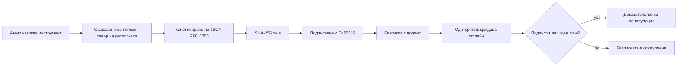
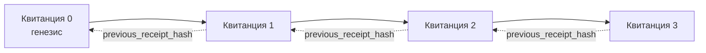

[Гледайте видео урока: Защита на AI агенти с криптографски разписки](https://youtu.be/PLACEHOLDER_VIDEO_ID)

> _(Видео урок и миниатюра ще бъдат добавени от екипа на Microsoft за съдържание след сливане, съответстващи на шаблона за урок 14 / 15.)_

# Защита на AI агенти с криптографски разписки

## Въведение

Този урок обхваща:

- Защо пътеките за одит на AI агенти са важни за съответствие, отстраняване на грешки и доверие.
- Какво е криптографска разписка и как се различава от неподписан лог ред.
- Как да се създаде подписана разписка за повикване на инструмент от агент с чист Python.
- Как да се провери разписка офлайн и да се открие манипулация.
- Как да се свържат разписки, така че премахването или пренареждането на една да разваля веригата.
- Какво доказват разписките и какво изрично не доказват.

## Цели на обучението

След като завършите този урок, ще знаете как да:

- Идентифицирате начините на провал, които мотивират криптографска автентичност за действията на агента.
- Създавате разписка, подписана с Ed25519, върху каноничен JSON полезен товар.
- Проверявате разписка независимо, използвайки само публичния ключ на подписващия.
- Откривате манипулации чрез повторна проверка на модифицирана разписка.
- Изграждате верига от разписки с хеширане и обяснявате защо веригата е важна.
- Разпознавате границата между това, което разписките доказват (приписване, цялост, подреждане) и това, което не доказват (коректност на действието, здравина на политиката).

## Проблемът: Одитният път на вашия агент

Представете си, че сте внедрили AI агент за Contoso Travel. Агентът чете клиентски заявки, извиква API за полети, за да търси опции, и резервира места от името на клиента. През последното тримесечие агентът обработи 50 000 резервации.

Днес идва одитор. Той задава прост въпрос: "Покажете ми какво е направил агентът ви."

Вие подавате лог файловете си. Одиторът ги разглежда и задава по-труден въпрос: "Как да знам, че тези лога не са редактирани?"

Това е проблемът с одитната следа. Повечето внедрявания на агенти днес разчитат на:

- **Логове на приложения**: писани от самия агент, редактиращи се от всеки с достъп до файлова система.
- **Облачни лог услуги**: с доказателство за манипулация на платформено ниво, но само ако одиторът се доверява на оператора на платформата.
- **Транзакционни логове на бази данни**: подходящи за промени в базата, но не и за произволни повиквания на инструменти.

Нито един от тях не може да отговори на въпроса на одитора без изискване за доверие на някого (вас, вашия облачен доставчик, вашия доставчик на база данни). За вътрешна употреба това доверие често е приемливо. За регулирани работни натоварвания (финанси, здравеопазване, всичко подлежащо на EU AI Act) – не е.

Криптографските разписки решават това, като правят всяко действие на агента независимо проверимо. Одиторът няма нужда да ви вярва. Той има нужда само от вашия публичен ключ и от разписката.

## Какво е криптографска разписка?

Разписката е JSON обект, който записва какво е направил агентът, подписан с цифров подпис.


```mermaid
flowchart LR
    A[Агент извиква инструмент] --> B[Създаване на полезен товар на разписката]
    B --> C[Канонизиране на JSON RFC 8785]
    C --> D[SHA-256 хеш]
    D --> E[Подписване с Ed25519]
    E --> F[Разписка с подпис]
    F --> G[Одитор потвърждава офлайн]
    G --> H{Подписът валиден ли е?}
    H -- yes --> I[Доказателство за манипулация]
    H -- no --> J[Разписката е отхвърлена]
```
  
Минимална разписка изглежда така:

```json
{
  "type": "agent.tool_call.v1",
  "agent_id": "contoso-travel-bot",
  "tool_name": "lookup_flights",
  "tool_args_hash": "sha256:a3f9c1...",
  "result_hash": "sha256:7b2e1d...",
  "policy_id": "contoso-travel-policy-v3",
  "timestamp": "2026-04-25T14:30:00Z",
  "sequence": 47,
  "previous_receipt_hash": "sha256:9d4e6a...",
  "signature": {
    "alg": "EdDSA",
    "sig": "c5af83...",
    "public_key": "8f3b2c..."
  }
}
```
  
Три свойства вършат работата:

1. **Подписът**. Разписката е подписана от gateway на агента с Ed25519 частен ключ. Всеки с публичния съответен ключ може да провери подписа офлайн. Манипулацията на каквото и да е поле прави подписа невалиден.

2. **Канонично кодиране**. Преди подписване разписката се сериализира с помощта на JSON Canonicalization Scheme (JCS, RFC 8785). Това гарантира, че две реализации, произвеждащи една и съща логическа разписка, генерират байтове, идентични по съдържание. Без канонизация различни JSON сериализатори биха създали различни подписи за едно и също съдържание.

3. **Верига с хеширане**. Полето `previous_receipt_hash` свързва всяка разписка с предишната. Премахването или пренареждането на разписка нарушава всяка следваща разписка в веригата. Манипулацията става видима на нивото на веригата дори ако се заобиколят индивидуалните подписи.

Заедно тези свойства осигуряват три гаранции:

- **Приписване**: този ключ е подписал това съдържание.
- **Цялост**: съдържанието не се е променило след подписването.
- **Подреждане**: тази разписка е след тази в веригата.

## Създаване на разписка в Python

Не ви е нужна специална библиотека, за да създадете разписка. Криптографските примитиви са широко достъпни, а логиката е няколко десетки реда Python.

Практическите упражнения в `code_samples/18-signed-receipts.ipynb` показват целия процес. Резюме:

```python
import json
import hashlib
import base64
from nacl import signing
from jcs import canonicalize  # RFC 8785 каноничен JSON

def b64url_nopad(data: bytes) -> str:
    return base64.urlsafe_b64encode(data).decode("ascii").rstrip("=")

def sha256_canonical(obj) -> str:
    """SHA-256 of a Python object's JCS-canonical JSON form."""
    return f"sha256:{hashlib.sha256(canonicalize(obj)).hexdigest()}"

# Генерирайте или заредете подписващ ключ (в продукция, съхранявайте в хранилище за ключове)
signing_key = signing.SigningKey.generate()
verify_key = signing_key.verify_key

# Изградете съдържанието на разписката (все още без подпис)
tool_args = {"origin": "SYD", "destination": "LAX"}
tool_result = [{"flight": "QF11", "price": 1850, "stops": 0}]

payload = {
    "type": "agent.tool_call.v1",
    "agent_id": "contoso-travel-bot",
    "tool_name": "lookup_flights",
    "tool_args_hash": sha256_canonical(tool_args),
    "result_hash": sha256_canonical(tool_result),
    "policy_id": "contoso-travel-policy-v3",
    "timestamp": "2026-04-25T14:30:00Z",
    "sequence": 0,
    "previous_receipt_hash": None,
}

# Канонизирайте, изчислете хеш, подпишете.
canonical_bytes = canonicalize(payload)
message_hash = hashlib.sha256(canonical_bytes).digest()
signature_bytes = signing_key.sign(message_hash).signature

# Прикрепете структуриран обект с подпис.
receipt = {
    **payload,
    "signature": {
        "alg": "EdDSA",
        "sig": b64url_nopad(signature_bytes),
        "public_key": b64url_nopad(bytes(verify_key)),
    },
}
```
  
Това е цялата последователност за подписване. Упражненията в тетрадката обясняват всяка стъпка.

## Проверка на разписка и откриване на манипулация

Проверката е обратната операция:

```python
import base64
import hashlib
from nacl import signing
from nacl.exceptions import BadSignatureError
from jcs import canonicalize

def b64url_decode(s: str) -> bytes:
    padding = "=" * ((4 - len(s) % 4) % 4)
    return base64.urlsafe_b64decode(s + padding)

def verify_receipt(receipt: dict) -> bool:
    # Подписът е структуриран обект: {"alg", "sig", "public_key"}.
    sig_obj = receipt.get("signature")
    if not sig_obj or sig_obj.get("alg") != "EdDSA":
        return False

    # Възстановете натоварването, което всъщност беше подписано (всичко освен подписа).
    payload = {k: v for k, v in receipt.items() if k != "signature"}

    canonical_bytes = canonicalize(payload)
    message_hash = hashlib.sha256(canonical_bytes).digest()

    try:
        verify_key = signing.VerifyKey(b64url_decode(sig_obj["public_key"]))
        verify_key.verify(message_hash, b64url_decode(sig_obj["sig"]))
        return True
    except BadSignatureError:
        return False
```
  
Тази функция приема разписка и връща `True`, ако подписът е валиден, `False` в противен случай. Без интернет повикване, без зависимост от услуга, без необходимост от доверие на трета страна.

За демонстриране на откриване на манипулация, тетрадката преминава през:

1. Създаване на валидна разписка и потвърждение, че се проверява.
2. Промяна на един байт в полето `tool_args_hash`.
3. Повторна проверка и провал.

Това е практическо доказателство, че разписките показват манипулация: всяка промяна, колкото и малка да е, нарушава подписа.

## Верига с разписки за многоетапни агенти

Една подписана разписка защитава едно действие. Верига от разписки защитава последователност.


```mermaid
flowchart LR
    R0[Квитанция 0<br/>генезис] --> R1[Квитанция 1]
    R1 --> R2[Квитанция 2]
    R2 --> R3[Квитанция 3]
    R1 -. previous_receipt_hash .-> R0
    R2 -. previous_receipt_hash .-> R1
    R3 -. previous_receipt_hash .-> R2
```
  
Всяка разписка записва хеша на предишната. За да премахне тихомълком втора разписка, нападателят трябва или:

- да модифицира полето `previous_receipt_hash` на разписка 3 (нарушава подписа на разписка 3), ИЛИ  
- да създаде нов подпис върху модифицираната разписка 3 (изисква частния ключ на агента).

Ако частният ключ е в хардуерен ключов склад и публикувате публичния ключ с всяка разписка, нито една от атаките не е възможна без откриване.

Тетрадката показва:

1. Създаване на верига от три разписки.
2. Проверка, че `previous_receipt_hash` всяка разписка съвпада с действителния хеш на предходната.
3. Манипулиране на една разписка по средата и виждане, че веригата се разпада точно там.

Така създавате одитна следа, която външен одитор може да провери без да ви се доверява.

## Какво доказват разписките (и какво не)

Това е най-важният раздел на този урок. Разписките са мощни, но силата им е ограничена.

**Разписките доказват три неща:**

1. **Приписване**: конкретен ключ е подписал конкретен полезен товар.
2. **Цялост**: полезният товар не се е променил след подписването.
3. **Подреждане**: тази разписка е дошла след тази в хеш веригата.

**Разписките НЕ доказват:**

1. **Коректност**: че действието на агента е правилното действие. Разписката може да бъде подписана за грешен отговор също толкова чисто, колкото за правилен.
2. **Съответствие с политиката**: че политиката, посочена в `policy_id`, е била наистина оценена, или че е щяла да позволи това действие, ако беше проверена. Разписката записва какво е било заявено, не какво е било наложено.
3. **Идентичност извън ключа**: разписката казва "този ключ е подписал това съдържание". Не казва "този човек е упълномощил това". Свързването на ключ с човек или организация изисква отделна инфраструктура за идентичност (директория, регистър на публични ключове и т.н.).
4. **Истинност на входните данни**: ако агентът получи манипулиран подканващ текст и действа въз основа на него, разписката записва действието вярно. Разписките са след валидирането на входа, не заместител на това.

Тази граница е важна по две причини:

- Казва ви за какво са полезни разписките: правят поведението на агента одитируемо и с доказателство за манипулация, дори между организационни граници.
- Казва ви какви допълнителни слоеве още са нужни: валидиране на входа (Урок 6), прилагане на политики (накратко по-долу), и инфраструктура за идентичност (извън обхвата на този урок).

Често се греши с предположението, че "имаме разписки" значи "имаме управление". Не е така. Разписките са основа. Управлението е системата, която изграждате върху нея.

## Препратки за производство

Python кодът в този урок е умишлено минимален, за да можете да прочетете всеки ред и да разберете точно какво се случва. В производството имате две възможности:

1. **Изграждане директно върху криптографските примитиви.** 50-те реда, които видяхте по-горе, са достатъчни за много случаи. PyNaCl (Ed25519) и пакетът `jcs` (каноничен JSON) са добре поддържани и одитирани библиотеки.

2. **Използване на библиотека за производство на разписки.** Няколко отворени проекта реализират същия модел с допълнителни функции (ротация на ключове, партидна проверка, разпространение на JWK набор, интеграция с политики):  
   - Форматът на разписката, използван в този урок, следва IETF Internet-Draft (`draft-farley-acta-signed-receipts`), в процес на стандартизиране.  
   - Microsoft Agent Governance Toolkit комбинира разписки с решения на политики на база Cedar; вижте Урок 33 в това хранилище за пример от край до край.  
   - Пакетите `protect-mcp` (npm) и `@veritasacta/verify` (npm) предлагат Node-имплементация на подписване и офлайн проверка, предназначена за обвиване на всеки MCP сървър с одитна следа с доказателство за манипулация.  
   - **[nobulex](https://github.com/arian-gogani/nobulex)** Python SDK (`pip install nobulex`) предоставя същия Ed25519 + JCS подписващ модел в Python с интеграция в LangChain и CrewAI, включително публикувани тестови вектори и съответствие, допринесено чрез [OWASP PR #2210](https://github.com/OWASP/CheatSheetSeries/pull/2210).

Изборът между изграждането от нулата и използването на библиотека отразява избора между писане на собствена JWT библиотека и използване на изпитана: и двете са разумни; библиотеката спестява време и намалява повърхността за одит; подходът от нулата ви кара да разберете всеки примитив. Този урок учи на подход от нулата, за да имате основа за всеки избор.

## Проверка на знанията

Проверете разбирането си преди да продължите към практическото упражнение.

**1. Разписката е подписана с частния Ed25519 ключ на агента. Одиторът има само публичния ключ. Може ли одиторът да провери разписката офлайн?**

<details>
<summary>Отговор</summary>

Да. Проверка с Ed25519 изисква само публичния ключ и подписаните байтове. Без интернет повикване, без услуга – това е свойството, което прави разписките полезни в изолирани, мултиорганизационни или нискодоверителни одит ситуации.
</details>

**2. Нападател променя полето `policy_id` на разписка, за да заяви, че е управлявана от по-одобряваща политика. Подписът е върху оригиналния полезен товар. Какво се случва при проверката?**

<details>
<summary>Отговор</summary>

Проверката не успява. Подписът е изчислен върху каноничните байтове на оригиналния полезен товар; промяната на каквото и да е поле променя каноничните байтове, което променя SHA-256 хеша и прави подписа невалиден. Нападателят би трябвало да има частния ключ, за да направи валиден нов подпис, което няма.
</details>

**3. Защо разписката включва `tool_args_hash` и `result_hash` вместо оригиналните аргументи и резултата?**

<details>
<summary>Отговор</summary>

Два са причините. Първо, разписката може да се архивира или предава в среди, където изтичането на суровото съдържание (лични данни, бизнес данни) е проблем. Хеширането прави разписката малка и съдържанието поверително; одиторът проверява дали хешът съвпада с отделно съхранено копие. Второ, хешовете са с фиксиран размер; разписката с хешове е ограничена по размер, независимо колко големи са входовете и изходите.
</details>

**4. Полето `previous_receipt_hash` свързва всяка разписка с предходната. Ако нападател тихомълком изтрие разписка от средата на веригата, кое става невалидно?**

<details>
<summary>Отговор</summary>

Всички разписки след изтритата. Техните полета `previous_receipt_hash` вече не съвпадат с действителната верига (защото разписката, към която сочат, вече не съществува или веригата сочи на друг предшественик). За да скрие премахването, нападателят трябва да преподпише всяка по-късна разписка, което изисква частния ключ.
</details>

**5. Разписката се проверява чисто. Доказва ли това, че действието на агента е било правилно, обосновано или съобразено с политика?**

<details>
<summary>Отговор</summary>

Не. Валидната разписка доказва три неща: приписване (този ключ е подписал това съдържание), цялост (съдържанието не се е променило) и подреждане (тази разписка е след друга в хеш веригата). Не доказва, че действието е било правилно, че политиката в `policy_id` е била наистина оценена, или че агентът е спазвал всеки регламент. Разписките правят поведението на агента одитируемо, не непременно правилно. Това е най-важната граница в урока.
</details>

## Практическо упражнение

Отворете `code_samples/18-signed-receipts.ipynb` и завършете всичките четири секции:

1. **Секция 1**: Подпишете първата си разписка и я проверете.
2. **Секция 2**: Манипулирайте разписката и наблюдавайте провала при проверката.
3. **Секция 3**: Изградете верига от три разписки и проверете цялостта на веригата.
4. **Секция 4**: Приложете модела към агент, създаден с Microsoft Agent Framework: обвийте повикване на инструмент с подписване на разписка и после проверете разписката независимо.
**Извънредно предизвикателство 1:** разширете схемата на разписката с допълнително поле по ваш избор (например, идентификатор за проследяване на заявката), актуализирайте каноничната логика за подписване, за да го включите, и потвърдете, че разписката все още преминава успешно през проверката. След това модифицирайте полето след подписването и потвърдете, че проверката се проваля. Това ви принуждава да разберете как всеки байт от каноничната кодировка допринася за подписа.

**Извънредно предизвикателство 2:** Хеширайте с SHA-256 две от вашите разписки заедно (обединете техните канонични байтове в детерминистичен ред) и вградете получения дайджест като ново поле в трета разписка преди подписването. Проверете, че всички три разписки все още успешно се проверяват. Току-що сте изградили доказателство за включване в един етап: всеки, който държи третата разписка, може да докаже, че първите две са съществували по време на нейното подписване, без да е необходимо да разкрива съдържанието им. Това е моделът, който селективно-разкриващите разписки използват в мащаб (Merkle commit-ове, RFC 6962).

## Заключение

Криптографските разписки предоставят на AI агентите одитен след, който е:

- **Независимо проверим:** всяка страна с публичния ключ може да провери, без зависимост от услуга.
- **Свидетелстват за манипулации:** всяка промяна анулира подписа.
- **Преносими:** разписката е малък JSON файл; може да бъде архивирана, предавана и проверявана навсякъде.
- **Съобразени със стандартите:** базирани на Ed25519 (RFC 8032), JCS (RFC 8785) и SHA-256, всички широко използвани примитиви.

Те не са заместител на валидирането на входните данни, прилагането на политики или инфраструктурата за идентичност. Те са основа за тези слоеве. Когато внедрявате агенти в регламентирани работни натоварвания, работни процеси с множество организации или в която и да е среда, където бъдещ одитор не може да бъде приет на доверие, разписките са начинът да направите одитния след честен.

Най-важният извод: разписките доказват кой е казал какво и кога. Те не доказват, че казаното е вярно или правилно. Дръжте това разграничение стриктно. Това е разликата между честна система за произход и подвеждаща.

## Контрольният списък за продукция

Когато сте готови да преминете от този урок към внедряване на агенти, подписани с разписки, в реална среда:

- [ ] **Преместете ключа за подписване от лаптопа на разработчика.** Използвайте Azure Key Vault, AWS KMS или хардуерен модул за сигурност. Частният ключ за подписването на разписките никога не трябва да бъде в контрола на изходния код или в обикновен текст на сървърите.
- [ ] **Публикувайте публичния ключ за проверка.** Одиторите имат нужда от него за офлайн проверка. Стандартният модел е JWK набор на известен URL адрес (RFC 7517), например `https://your-org.example.com/.well-known/agent-keys.json`.
- [ ] **Анкорирайте веригата външно.** Периодично записвайте хеша на последния връх на веригата в журнал за прозрачност (Sigstore Rekor, RFC 3161 удостоверител на време или вторична вътрешна система), за да може външна страна да потвърди „тази верига е съществувала по това време“.
- [ ] **Съхранявайте разписките неизменяемо.** Съхранение само за добавяне (Azure Storage с политики за неизменяемост, AWS S3 Object Lock) предотвратява записа на историята от вътрешен потребител на ниво съхранение.
- [ ] **Решете за срока на задържане.** Много регулаторни режими изискват задържане за няколко години. Планирайте растежа на разписките (всяка разписка е ~500 байта; агент, правещ 10 000 повиквания на ден, произвежда ~1.8 GB годишно).
- [ ] **Документирайте какво не покриват разписките.** Разписките доказват приписване, цялост и ред на събитията. Вашата инструкция за изпълнение трябва ясно да изброи какви допълнителни контроли (валидация на входа, прилагане на политика, ограничаване на честотата, инфраструктура за идентичност) работят заедно с разписките във вашия модел на управление.

### Имате още въпроси за защитата на AI агенти?

Присъединете се към [Microsoft Foundry Discord](https://aka.ms/ai-agents/discord), за да общувате с други учащи, да посещавате консултации и да получите отговори на въпросите си за AI агенти.

## След този урок

Този урок обхваща подписването на единични разписки и последователности с хеш-вериги. Същите примитиви образуват няколко по-напреднали модела, с които може да се срещнете, докато вашият модел на управление зрее:

- **Селективно разкриване.** Когато полетата на разписката са независимо ангажирани (Merkle дърво по RFC 6962), можете да разкривате конкретни полета на конкретни одитори и да докажете, че останалите са непроменени, без да ги излагате. Полезно, когато една и съща разписка трябва да удовлетворява както всеобхватен одит (който изисква пълнота), така и регулации за минимизиране на данните като GDPR (които изискват одиторът да вижда възможно най-малко).
- **Аннулиране на разписки.** Ако някой ключ за подписване бъде компрометиран, трябва да имате начин да маркирате всички разписки, подписани с този ключ, като ненадеждни от даден момент нататък. Стандартни модели: краткосрочни ключове за подписване плюс публикуван списък за анулиране, или журнал за прозрачност с анулиращи записи.
- **Двустранни / разделени подписани разписки.** Някои реализации разделят подписаното съдържание на предизпълнителна (`authorization_*`) и постизпълнителна (`result_*`) половини с независими подписи, полезно когато решението за разрешение и наблюдаваният резултат се произвеждат от различни актьори или по различно време. Това се изгражда допълнително върху формата на разписката, преподавана в този урок.
- **Сглобяване на натоварването.** Разписката запечатва каквито и байтове да сте вложили в `result_hash`. Реалните товари често са по-богати отколкото единствен резултат от повикване на инструмент: преди-решението логика (предсказване на модел, разгледани опции, доказателства и тяхната пълнота, оценка на риска, верига на отговорност, изход от контролна точка) могат да се намират вътре в натоварването, запечатано с една разписка. Това държи минималната форма на разписката, докато схемите на натоварване могат да се развиват домейн по домейн.
- **Съвместимост между реализации.** Няколко независими имплементации на същия формат на разписката (Python, TypeScript, Rust, Go) се крос-проверяват с общи тестови вектори. Ако изградите собствения си имплементация, валидирането спрямо публикувани вектори потвърждава съвместимост в протокола.
- **Миграция към пост-квантови алгоритми.** Ed25519 е широко използван днес, но не е устойчив на квантови атаки. Форматът на разписката е алгоритъм-гъвкав: полето `signature.alg` може да съдържа `ML-DSA-65` (стандарт на NIST за пост-квантови подписи), когато имате нужда от миграция. Планирайте преходен период, в който разписките са двойно подписани.

## Допълнителни ресурси

- <a href="https://datatracker.ietf.org/doc/draft-farley-acta-signed-receipts/" target="_blank">IETF Internet-Draft: Подписани решения на разписки за контрол на достъп машина към машина</a>
- <a href="https://learn.microsoft.com/azure/ai-studio/responsible-use-of-ai-overview" target="_blank">Отговорно използване на AI (Azure AI)</a>
- <a href="https://datatracker.ietf.org/doc/html/rfc8032" target="_blank">RFC 8032: Алгоритъм за цифров подпис Edwards-Curve (EdDSA)</a>
- <a href="https://datatracker.ietf.org/doc/html/rfc8785" target="_blank">RFC 8785: Схема за канонизация на JSON (JCS)</a>
- <a href="https://datatracker.ietf.org/doc/html/rfc6962" target="_blank">RFC 6962: Прозрачност на сертификати</a> (Конструкция на Merkle дърво, използвана от селективно-разкриващите разписки)
- <a href="https://github.com/microsoft/agent-governance-toolkit/blob/main/docs/tutorials/33-offline-verifiable-receipts.md" target="_blank">Microsoft Agent Governance Toolkit, Урок 33: Разписки за решения с офлайн проверка</a>
- <a href="https://github.com/ScopeBlind/agent-governance-testvectors" target="_blank">Тестови вектори за съвместимост между реализации</a> за формата на разписката, използван в този урок (Apache-2.0)
- <a href="https://pynacl.readthedocs.io/" target="_blank">Документация PyNaCl</a> (Ed25519 в Python)

## Предишен урок

[Изграждане на агенти за използване на компютър (CUA)](../15-browser-use/README.md)

---

<!-- CO-OP TRANSLATOR DISCLAIMER START -->
**Отказ от отговорност**:
Този документ е преведен с помощта на AI преводачески услуга [Co-op Translator](https://github.com/Azure/co-op-translator). Въпреки че се стремим към точност, моля имайте предвид, че автоматизираните преводи могат да съдържат грешки или неточности. Оригиналният документ на неговия роден език трябва да се счита за авторитетен източник. За критична информация се препоръчва професионален човешки превод. Ние не носим отговорност за каквито и да е недоразумения или неправилни тълкувания, произтичащи от използването на този превод.
<!-- CO-OP TRANSLATOR DISCLAIMER END -->