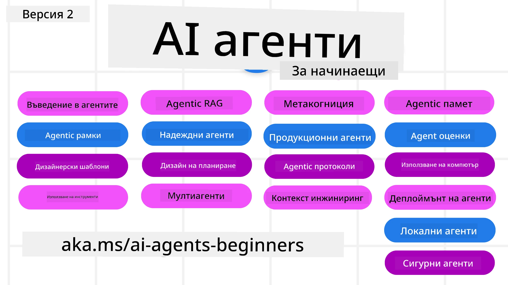

# AI Агенти за начинаещи - Курс



## Курс, който учи всичко необходимо, за да започнете да изграждате AI агенти

[](https://github.com/microsoft/ai-agents-for-beginners/blob/master/LICENSE?WT.mc_id=academic-105485-koreyst)
[](https://GitHub.com/microsoft/ai-agents-for-beginners/graphs/contributors/?WT.mc_id=academic-105485-koreyst)
[](https://GitHub.com/microsoft/ai-agents-for-beginners/issues/?WT.mc_id=academic-105485-koreyst)
[](https://GitHub.com/microsoft/ai-agents-for-beginners/pulls/?WT.mc_id=academic-105485-koreyst)
[](http://makeapullrequest.com?WT.mc_id=academic-105485-koreyst)

### 🌐 Поддръжка на няколко езика

#### Поддържа се чрез GitHub Action (Автоматично и винаги актуално)

<!-- CO-OP TRANSLATOR LANGUAGES TABLE START -->
[Арабски](../ar/README.md) | [Бенгалски](../bn/README.md) | [Български](./README.md) | [Бирмански (Мианмар)](../my/README.md) | [Китайски (опростен)](../zh-CN/README.md) | [Китайски (традиционен, Хонконг)](../zh-HK/README.md) | [Китайски (традиционен, Макао)](../zh-MO/README.md) | [Китайски (традиционен, Тайван)](../zh-TW/README.md) | [Хърватски](../hr/README.md) | [Чешки](../cs/README.md) | [Датски](../da/README.md) | [Холандски](../nl/README.md) | [Естонски](../et/README.md) | [Фински](../fi/README.md) | [Френски](../fr/README.md) | [Немски](../de/README.md) | [Гръцки](../el/README.md) | [Иврит](../he/README.md) | [Хинди](../hi/README.md) | [Унгарски](../hu/README.md) | [Индонезийски](../id/README.md) | [Италиански](../it/README.md) | [Японски](../ja/README.md) | [Каннада](../kn/README.md) | [Корейски](../ko/README.md) | [Литовски](../lt/README.md) | [Малайски](../ms/README.md) | [Малаялам](../ml/README.md) | [Маратхи](../mr/README.md) | [Непалски](../ne/README.md) | [Нигерийски пиджин](../pcm/README.md) | [Норвежки](../no/README.md) | [Персийски (фарси)](../fa/README.md) | [Полски](../pl/README.md) | [Португалски (Бразилия)](../pt-BR/README.md) | [Португалски (Португалия)](../pt-PT/README.md) | [Панджаби (Гурмухи)](../pa/README.md) | [Румънски](../ro/README.md) | [Руски](../ru/README.md) | [Сръбски (кирилица)](../sr/README.md) | [Словашки](../sk/README.md) | [Словенски](../sl/README.md) | [Испански](../es/README.md) | [Суахили](../sw/README.md) | [Шведски](../sv/README.md) | [Тагалог (Филипински)](../tl/README.md) | [Тамилски](../ta/README.md) | [Телугу](../te/README.md) | [Тайски](../th/README.md) | [Турски](../tr/README.md) | [Украински](../uk/README.md) | [Урду](../ur/README.md) | [Виетнамски](../vi/README.md)

> **Предпочитате да клонирате локално?**
>
> Това хранилище включва над 50 езикови превода, което значително увеличава размера на изтегляне. За да клонирате без преводи, използвайте sparse checkout:
>
> **Bash / macOS / Linux:**
> ```bash
> git clone --filter=blob:none --sparse https://github.com/microsoft/ai-agents-for-beginners.git
> cd ai-agents-for-beginners
> git sparse-checkout set --no-cone '/*' '!translations' '!translated_images'
> ```
>
> **CMD (Windows):**
> ```cmd
> git clone --filter=blob:none --sparse https://github.com/microsoft/ai-agents-for-beginners.git
> cd ai-agents-for-beginners
> git sparse-checkout set --no-cone "/*" "!translations" "!translated_images"
> ```
>
> Това ви дава всичко необходимо, за да завършите курса с много по-бързо изтегляне.
<!-- CO-OP TRANSLATOR LANGUAGES TABLE END -->

**Ако желаете да се поддържат допълнителни езици за превод, те са изброени [тук](https://github.com/Azure/co-op-translator/blob/main/getting_started/supported-languages.md)**

[](https://GitHub.com/microsoft/ai-agents-for-beginners/watchers/?WT.mc_id=academic-105485-koreyst)
[](https://GitHub.com/microsoft/ai-agents-for-beginners/network/?WT.mc_id=academic-105485-koreyst)
[](https://GitHub.com/microsoft/ai-agents-for-beginners/stargazers/?WT.mc_id=academic-105485-koreyst)

[](https://discord.gg/nTYy5BXMWG)


## 🌱 Започване

Този курс има уроци, покриващи основите на изграждането на AI агенти. Всеки урок разглежда своя собствена тема, така че започнете откъдето желаете!

Поддържа се няколко езика за този курс. Вижте нашите [налични езици тук](../..).

Ако това е първият път, когато изграждате с генеративни AI модели, разгледайте нашия курс [Генеративен AI за начинаещи](https://aka.ms/genai-beginners), който включва 21 урока за изграждане с GenAI.

Не забравяйте да [отметнете с "звезда" (🌟) това хранилище](https://docs.github.com/en/get-started/exploring-projects-on-github/saving-repositories-with-stars?WT.mc_id=academic-105485-koreyst) и да [форкнете това хранилище](https://github.com/microsoft/ai-agents-for-beginners/fork), за да стартирате кода.

### Познайте други обучаващи се, получете отговори на въпросите си

Ако се затрудните или имате въпроси относно изграждането на AI агенти, присъединете се към нашия специализиран Discord канал в [Microsoft Foundry Discord](https://aka.ms/ai-agents/discord).

### Какво ви е необходимо

Всеки урок в този курс включва кодови примери, които могат да се намерят в папката code_samples. Можете да [форкнете това хранилище](https://github.com/microsoft/ai-agents-for-beginners/fork), за да създадете собствено копие.

Кодовите примери в тези упражнения използват Microsoft Agent Framework с Azure AI Foundry Agent Service V2:

- [Microsoft Foundry](https://aka.ms/ai-agents-beginners/ai-foundry) - Необходим е Azure акаунт

Този курс използва следните AI Agent рамки и услуги от Microsoft:

- [Microsoft Agent Framework (MAF)](https://aka.ms/ai-agents-beginners/agent-framewrok)
- [Azure AI Foundry Agent Service V2](https://aka.ms/ai-agents-beginners/ai-agent-service)


За повече информация за стартирането на кода за този курс, посетете [Настройка на курса](./00-course-setup/README.md).

## 🙏 Искате ли да помогнете?

Имате ли предложения или сте намерили правописни или кодови грешки? [Отворете проблем](https://github.com/microsoft/ai-agents-for-beginners/issues?WT.mc_id=academic-105485-koreyst) или [Създайте заявка за изтегляне](https://github.com/microsoft/ai-agents-for-beginners/pulls?WT.mc_id=academic-105485-koreyst)


## 📂 Всеки урок включва

- Писмен урок, разположен в README, и кратко видео
- Python кодови примери, използващи Microsoft Agent Framework с Azure AI Foundry
- Връзки към допълнителни ресурси за продължаване на обучението


## 🗃️ Уроци

| **Урок**                                     | **Текст и код**                                    | **Видео**                                                  | **Допълнително обучение**                                                               |
|----------------------------------------------|----------------------------------------------------|------------------------------------------------------------|------------------------------------------------------------------------------------------|
| Въведение в AI агенти и случаи на използване | [Връзка](./01-intro-to-ai-agents/README.md)        | [Видео](https://youtu.be/3zgm60bXmQk?si=z8QygFvYQv-9WtO1)  | [Връзка](https://aka.ms/ai-agents-beginners/collection?WT.mc_id=academic-105485-koreyst) |
| Изследване на AI агентски рамки               | [Връзка](./02-explore-agentic-frameworks/README.md) | [Видео](https://youtu.be/ODwF-EZo_O8?si=Vawth4hzVaHv-u0H)  | [Връзка](https://aka.ms/ai-agents-beginners/collection?WT.mc_id=academic-105485-koreyst) |
| Разбиране на AI агентски дизайн модели        | [Връзка](./03-agentic-design-patterns/README.md)   | [Видео](https://youtu.be/m9lM8qqoOEA?si=BIzHwzstTPL8o9GF)  | [Връзка](https://aka.ms/ai-agents-beginners/collection?WT.mc_id=academic-105485-koreyst) |
| Модел за използване на инструменти            | [Връзка](./04-tool-use/README.md)                  | [Видео](https://youtu.be/vieRiPRx-gI?si=2z6O2Xu2cu_Jz46N)  | [Връзка](https://aka.ms/ai-agents-beginners/collection?WT.mc_id=academic-105485-koreyst) |
| Агентски RAG                                  | [Връзка](./05-agentic-rag/README.md)               | [Видео](https://youtu.be/WcjAARvdL7I?si=gKPWsQpKiIlDH9A3)  | [Връзка](https://aka.ms/ai-agents-beginners/collection?WT.mc_id=academic-105485-koreyst) |
| Изграждане на надеждни AI агенти             | [Връзка](./06-building-trustworthy-agents/README.md) | [Видео](https://youtu.be/iZKkMEGBCUQ?si=jZjpiMnGFOE9L8OK ) | [Връзка](https://aka.ms/ai-agents-beginners/collection?WT.mc_id=academic-105485-koreyst) |
| Модел за планиране                            | [Връзка](./07-planning-design/README.md)           | [Видео](https://youtu.be/kPfJ2BrBCMY?si=6SC_iv_E5-mzucnC)  | [Връзка](https://aka.ms/ai-agents-beginners/collection?WT.mc_id=academic-105485-koreyst) |
| Модел на многоагентска система                | [Връзка](./08-multi-agent/README.md)               | [Видео](https://youtu.be/V6HpE9hZEx0?si=rMgDhEu7wXo2uo6g)  | [Връзка](https://aka.ms/ai-agents-beginners/collection?WT.mc_id=academic-105485-koreyst) |
| Модел на метакогниция                         | [Връзка](./09-metacognition/README.md)             | [Видео](https://youtu.be/His9R6gw6Ec?si=8gck6vvdSNCt6OcF)  | [Връзка](https://aka.ms/ai-agents-beginners/collection?WT.mc_id=academic-105485-koreyst) |
| AI агенти в продукция                      | [Link](./10-ai-agents-production/README.md)        | [Video](https://youtu.be/l4TP6IyJxmQ?si=31dnhexRo6yLRJDl)  | [Link](https://aka.ms/ai-agents-beginners/collection?WT.mc_id=academic-105485-koreyst) |
| Използване на агентни протоколи (MCP, A2A и NLWeb) | [Link](./11-agentic-protocols/README.md)           | [Video](https://youtu.be/X-Dh9R3Opn8)                                 | [Link](https://aka.ms/ai-agents-beginners/collection?WT.mc_id=academic-105485-koreyst) |
| Контекстно инженерство за AI агенти            | [Link](./12-context-engineering/README.md)         | [Video](https://youtu.be/F5zqRV7gEag)                                 | [Link](https://aka.ms/ai-agents-beginners/collection?WT.mc_id=academic-105485-koreyst) |
| Управление на агентска памет                      | [Link](./13-agent-memory/README.md)     |      [Video](https://youtu.be/QrYbHesIxpw?si=vZkVwKrQ4ieCcIPx)                                                      |                                                                                        |
| Изследване на Microsoft Agent Framework                         | [Link](./14-microsoft-agent-framework/README.md)                            |                                                            |                                                                                        |
| Създаване на агенти за използване от компютър (CUA)           | Очаквайте скоро                            |                                                            |                                                                                        |
| Разгръщане на мащабируеми агенти                    | Очаквайте скоро                            |                                                            |                                                                                        |
| Създаване на локални AI агенти                     | Очаквайте скоро                               |                                                            |                                                                                        |
| Защита на AI агенти                           | Очаквайте скоро                               |                                                            |                                                                                        |

## 🎒 Други курсове

Нашият екип създава и други курсове! Вижте:

<!-- CO-OP TRANSLATOR OTHER COURSES START -->
### LangChain
[](https://aka.ms/langchain4j-for-beginners)
[](https://aka.ms/langchainjs-for-beginners?WT.mc_id=m365-94501-dwahlin)
[](https://github.com/microsoft/langchain-for-beginners?WT.mc_id=m365-94501-dwahlin)
---

### Azure / Edge / MCP / Агенти
[](https://github.com/microsoft/AZD-for-beginners?WT.mc_id=academic-105485-koreyst)
[](https://github.com/microsoft/edgeai-for-beginners?WT.mc_id=academic-105485-koreyst)
[](https://github.com/microsoft/mcp-for-beginners?WT.mc_id=academic-105485-koreyst)
[](https://github.com/microsoft/ai-agents-for-beginners?WT.mc_id=academic-105485-koreyst)

---
 
### Серия за генеративен AI
[](https://github.com/microsoft/generative-ai-for-beginners?WT.mc_id=academic-105485-koreyst)
[-9333EA?style=for-the-badge&labelColor=E5E7EB&color=9333EA)](https://github.com/microsoft/Generative-AI-for-beginners-dotnet?WT.mc_id=academic-105485-koreyst)
[-C084FC?style=for-the-badge&labelColor=E5E7EB&color=C084FC)](https://github.com/microsoft/generative-ai-for-beginners-java?WT.mc_id=academic-105485-koreyst)
[-E879F9?style=for-the-badge&labelColor=E5E7EB&color=E879F9)](https://github.com/microsoft/generative-ai-with-javascript?WT.mc_id=academic-105485-koreyst)

---
 
### Основно обучение
[](https://aka.ms/ml-beginners?WT.mc_id=academic-105485-koreyst)
[](https://aka.ms/datascience-beginners?WT.mc_id=academic-105485-koreyst)
[](https://aka.ms/ai-beginners?WT.mc_id=academic-105485-koreyst)
[](https://github.com/microsoft/Security-101?WT.mc_id=academic-96948-sayoung)
[](https://aka.ms/webdev-beginners?WT.mc_id=academic-105485-koreyst)
[](https://aka.ms/iot-beginners?WT.mc_id=academic-105485-koreyst)
[](https://github.com/microsoft/xr-development-for-beginners?WT.mc_id=academic-105485-koreyst)

---
 
### Серия Copilot
[](https://aka.ms/GitHubCopilotAI?WT.mc_id=academic-105485-koreyst)
[](https://github.com/microsoft/mastering-github-copilot-for-dotnet-csharp-developers?WT.mc_id=academic-105485-koreyst)
[](https://github.com/microsoft/CopilotAdventures?WT.mc_id=academic-105485-koreyst)
<!-- CO-OP TRANSLATOR OTHER COURSES END -->

## 🌟 Благодарности от общността

Благодарим на [Shivam Goyal](https://www.linkedin.com/in/shivam2003/) за принос с важни кодови примери, демонстриращи Agentic RAG. 

## Принос

Този проект приветства приноси и предложения. Повечето приноси изискват да се съгласите с
Лицензионно споразумение за приносители (CLA), с което декларирате, че имате право и действително предоставяте
правата ни да използваме вашия принос. За подробности посетете <https://cla.opensource.microsoft.com>.

Когато подавате pull request, CLA бот автоматично ще определи дали трябва да предоставите
CLA и ще маркира PR подходящо (напр. статус, коментар). Просто следвайте инструкциите,
предоставени от бота. Трябва да направите това само веднъж за всички хранилища, използващи нашия CLA.

Този проект е възприел [Правилата за поведение на открит код на Microsoft](https://opensource.microsoft.com/codeofconduct/).
За повече информация вижте [Често задавани въпроси за правилата за поведение](https://opensource.microsoft.com/codeofconduct/faq/) или
свържете се с [opencode@microsoft.com](mailto:opencode@microsoft.com) при допълнителни въпроси или коментари.

## Търговски марки

Този проект може да съдържа търговски марки или лога на проекти, продукти или услуги. Оторизираната употреба на търговските марки или логата на Microsoft е предмет на и трябва да следва
[Насоките за търговски марки и бранд на Microsoft](https://www.microsoft.com/legal/intellectualproperty/trademarks/usage/general).
Използването на търговски марки или лога на Microsoft в модифицирани версии на този проект не бива да предизвиква объркване или да внушава спонсорство от Microsoft.
Всяко използване на търговски марки или лога на трети страни е предмет на политиките на тези трети страни.

## Получаване на помощ


Ако се затруднявате или имате въпроси относно създаването на AI приложения, присъединете се:

[](https://aka.ms/foundry/discord)

Ако имате обратна връзка за продукта или грешки при разработката, посетете:

[](https://aka.ms/foundry/forum)

---

<!-- CO-OP TRANSLATOR DISCLAIMER START -->
**Отказ от отговорност**:
Този документ е преведен с помощта на AI преводаческа услуга [Co-op Translator](https://github.com/Azure/co-op-translator). Въпреки че се стремим към точност, моля имайте предвид, че автоматизираните преводи могат да съдържат грешки или неточности. Оригиналният документ на неговия роден език трябва да се счита за авторитетен източник. За критична информация се препоръчва професионален човешки превод. Ние не носим отговорност за никакви недоразумения или погрешни тълкувания, произтичащи от използването на този превод.
<!-- CO-OP TRANSLATOR DISCLAIMER END -->