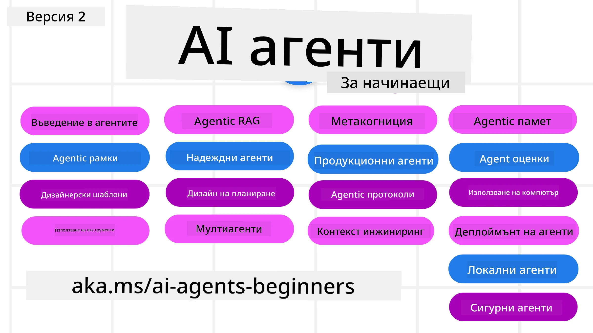

# AI Агенти за начинаещи - Курс



## Курс, който ви учи на всичко необходимо, за да започнете да създавате AI агенти

[](https://github.com/microsoft/ai-agents-for-beginners/blob/master/LICENSE?WT.mc_id=academic-105485-koreyst)
[](https://GitHub.com/microsoft/ai-agents-for-beginners/graphs/contributors/?WT.mc_id=academic-105485-koreyst)
[](https://GitHub.com/microsoft/ai-agents-for-beginners/issues/?WT.mc_id=academic-105485-koreyst)
[](https://GitHub.com/microsoft/ai-agents-for-beginners/pulls/?WT.mc_id=academic-105485-koreyst)
[](http://makeapullrequest.com?WT.mc_id=academic-105485-koreyst)

### 🌐 Многоезична поддръжка

#### Поддържана чрез GitHub Action (Автоматизирана и винаги актуална)

<!-- CO-OP TRANSLATOR LANGUAGES TABLE START -->
[Arabic](../ar/README.md) | [Bengali](../bn/README.md) | [Bulgarian](./README.md) | [Burmese (Myanmar)](../my/README.md) | [Chinese (Simplified)](../zh-CN/README.md) | [Chinese (Traditional, Hong Kong)](../zh-HK/README.md) | [Chinese (Traditional, Macau)](../zh-MO/README.md) | [Chinese (Traditional, Taiwan)](../zh-TW/README.md) | [Croatian](../hr/README.md) | [Czech](../cs/README.md) | [Danish](../da/README.md) | [Dutch](../nl/README.md) | [Estonian](../et/README.md) | [Finnish](../fi/README.md) | [French](../fr/README.md) | [German](../de/README.md) | [Greek](../el/README.md) | [Hebrew](../he/README.md) | [Hindi](../hi/README.md) | [Hungarian](../hu/README.md) | [Indonesian](../id/README.md) | [Italian](../it/README.md) | [Japanese](../ja/README.md) | [Kannada](../kn/README.md) | [Khmer](../km/README.md) | [Korean](../ko/README.md) | [Lithuanian](../lt/README.md) | [Malay](../ms/README.md) | [Malayalam](../ml/README.md) | [Marathi](../mr/README.md) | [Nepali](../ne/README.md) | [Nigerian Pidgin](../pcm/README.md) | [Norwegian](../no/README.md) | [Persian (Farsi)](../fa/README.md) | [Polish](../pl/README.md) | [Portuguese (Brazil)](../pt-BR/README.md) | [Portuguese (Portugal)](../pt-PT/README.md) | [Punjabi (Gurmukhi)](../pa/README.md) | [Romanian](../ro/README.md) | [Russian](../ru/README.md) | [Serbian (Cyrillic)](../sr/README.md) | [Slovak](../sk/README.md) | [Slovenian](../sl/README.md) | [Spanish](../es/README.md) | [Swahili](../sw/README.md) | [Swedish](../sv/README.md) | [Tagalog (Filipino)](../tl/README.md) | [Tamil](../ta/README.md) | [Telugu](../te/README.md) | [Thai](../th/README.md) | [Turkish](../tr/README.md) | [Ukrainian](../uk/README.md) | [Urdu](../ur/README.md) | [Vietnamese](../vi/README.md)

> **Предпочитате да клонирате локално?**
>
> Това хранилище включва преводи на над 50 езика, което значително увеличава размера на изтегляне. За да клонирате без преводи, използвайте sparse checkout:
>
> **Bash / macOS / Linux:**
> ```bash
> git clone --filter=blob:none --sparse https://github.com/microsoft/ai-agents-for-beginners.git
> cd ai-agents-for-beginners
> git sparse-checkout set --no-cone '/*' '!translations' '!translated_images'
> ```
>
> **CMD (Windows):**
> ```cmd
> git clone --filter=blob:none --sparse https://github.com/microsoft/ai-agents-for-beginners.git
> cd ai-agents-for-beginners
> git sparse-checkout set --no-cone "/*" "!translations" "!translated_images"
> ```
>
> Това ви дава всичко необходимо за завършване на курса с много по-бързо изтегляне.
<!-- CO-OP TRANSLATOR LANGUAGES TABLE END -->

**Ако желаете да се поддържат допълнителни езици за превод, те са изброени [тук](https://github.com/Azure/co-op-translator/blob/main/getting_started/supported-languages.md).**

[](https://GitHub.com/microsoft/ai-agents-for-beginners/watchers/?WT.mc_id=academic-105485-koreyst)
[](https://GitHub.com/microsoft/ai-agents-for-beginners/network/?WT.mc_id=academic-105485-koreyst)
[](https://GitHub.com/microsoft/ai-agents-for-beginners/stargazers/?WT.mc_id=academic-105485-koreyst)

[](https://discord.com/invite/ATgtXmAS5D)


## 🌱 Започване

Този курс включва уроци, покриващи основите на създаването на AI агенти. Всеки урок разглежда своята тема, така че започнете там, където пожелаете!

Този курс поддържа многоезична поддръжка. Вижте нашите [налични езици тук](#-multi-language-support).

Ако това е първият ви път, когато работите с генеративни AI модели, разгледайте нашия курс [Генеративен AI за начинаещи](https://aka.ms/genai-beginners), който включва 21 урока за работа с GenAI.

Не забравяйте да [запалите звезда (🌟) на това хранилище](https://docs.github.com/en/get-started/exploring-projects-on-github/saving-repositories-with-stars?WT.mc_id=academic-105485-koreyst) и да [форкнете това хранилище](https://github.com/microsoft/ai-agents-for-beginners/fork), за да изпълните кода.

### Срещнете други учащи се, получете отговори на въпросите си

Ако срещнете затруднения или имате въпроси относно създаването на AI агенти, присъединете се към нашия специализиран Discord канал в [Microsoft Foundry Discord](https://aka.ms/ai-agents/discord).

### Какво ви е необходимо

Всеки урок в този курс включва кодови примери, които можете да намерите в папката code_samples. Можете да [форкнете това хранилище](https://github.com/microsoft/ai-agents-for-beginners/fork), за да създадете свое собствено копие.

Кодови примери в тези упражнения използват Microsoft Agent Framework с Microsoft Foundry Agent Service V2:

- [Microsoft Foundry](https://aka.ms/ai-agents-beginners/ai-foundry) - Изисква се Azure акаунт

Този курс използва следните AI агентски рамки и услуги от Microsoft:

- [Microsoft Agent Framework (MAF)](https://aka.ms/ai-agents-beginners/agent-framework)
- [Microsoft Foundry Agent Service V2](https://aka.ms/ai-agents-beginners/ai-agent-service)

Някои кодови примери също поддържат алтернативни съвместими с OpenAI доставчици като [MiniMax](https://platform.minimaxi.com/), който предлага модели с голям контекст (до 204K токена). Вижте [Course Setup](./00-course-setup/README.md) за конфигурационни подробности.

За повече информация относно стартирането на кода за този курс, отидете на [Course Setup](./00-course-setup/README.md).

## 🙏 Искате ли да помогнете?

Имате ли предложения или сте намерили правописни или кодови грешки? [Подайте проблем](https://github.com/microsoft/ai-agents-for-beginners/issues?WT.mc_id=academic-105485-koreyst) или [Създайте pull request](https://github.com/microsoft/ai-agents-for-beginners/pulls?WT.mc_id=academic-105485-koreyst)


## 📂 Всеки урок включва

- Писмен урок, намиращ се в README и кратко видео
- Примери с Python кодове, използващи Microsoft Agent Framework с Microsoft Foundry
- Връзки към допълнителни ресурси за продължаване на обучението


## 🗃️ Уроци

| **Урок**                                   | **Текст и код**                                    | **Видео**                                                  | **Допълнително обучение**                                                                     |
|----------------------------------------------|----------------------------------------------------|------------------------------------------------------------|----------------------------------------------------------------------------------------|
| Въведение в AI агенти и случаи на използване | [Връзка](./01-intro-to-ai-agents/README.md)          | [Видео](https://youtu.be/3zgm60bXmQk?si=z8QygFvYQv-9WtO1)  | [Връзка](https://aka.ms/ai-agents-beginners/collection?WT.mc_id=academic-105485-koreyst) |
| Разглеждане на AI агентски рамки              | [Връзка](./02-explore-agentic-frameworks/README.md)  | [Видео](https://youtu.be/ODwF-EZo_O8?si=Vawth4hzVaHv-u0H)  | [Връзка](https://aka.ms/ai-agents-beginners/collection?WT.mc_id=academic-105485-koreyst) |
| Разбиране на AI агентски дизайн модели        | [Връзка](./03-agentic-design-patterns/README.md)     | [Видео](https://youtu.be/m9lM8qqoOEA?si=BIzHwzstTPL8o9GF)  | [Връзка](https://aka.ms/ai-agents-beginners/collection?WT.mc_id=academic-105485-koreyst) |
| Дизайн модел на използване на инструменти     | [Връзка](./04-tool-use/README.md)                    | [Видео](https://youtu.be/vieRiPRx-gI?si=2z6O2Xu2cu_Jz46N)  | [Връзка](https://aka.ms/ai-agents-beginners/collection?WT.mc_id=academic-105485-koreyst) |
| Агентски RAG                                  | [Връзка](./05-agentic-rag/README.md)                 | [Видео](https://youtu.be/WcjAARvdL7I?si=gKPWsQpKiIlDH9A3)  | [Връзка](https://aka.ms/ai-agents-beginners/collection?WT.mc_id=academic-105485-koreyst) |
| Създаване на надеждни AI агенти               | [Връзка](./06-building-trustworthy-agents/README.md) | [Видео](https://youtu.be/iZKkMEGBCUQ?si=jZjpiMnGFOE9L8OK ) | [Връзка](https://aka.ms/ai-agents-beginners/collection?WT.mc_id=academic-105485-koreyst) |
| Дизайн модел на планиране                      | [Връзка](./07-planning-design/README.md)             | [Видео](https://youtu.be/kPfJ2BrBCMY?si=6SC_iv_E5-mzucnC)  | [Връзка](https://aka.ms/ai-agents-beginners/collection?WT.mc_id=academic-105485-koreyst) |
| Модел за многоагентна система                  | [Връзка](./08-multi-agent/README.md)                 | [Видео](https://youtu.be/V6HpE9hZEx0?si=rMgDhEu7wXo2uo6g)  | [Връзка](https://aka.ms/ai-agents-beginners/collection?WT.mc_id=academic-105485-koreyst) |

| Дизайнерски Модел Метакогниция                 | [Link](./09-metacognition/README.md)               | [Видео](https://youtu.be/His9R6gw6Ec?si=8gck6vvdSNCt6OcF)  | [Link](https://aka.ms/ai-agents-beginners/collection?WT.mc_id=academic-105485-koreyst) |
| AI Агенти в Производство                      | [Link](./10-ai-agents-production/README.md)        | [Видео](https://youtu.be/l4TP6IyJxmQ?si=31dnhexRo6yLRJDl)  | [Link](https://aka.ms/ai-agents-beginners/collection?WT.mc_id=academic-105485-koreyst) |
| Използване на Агентични Протоколи (MCP, A2A и NLWeb) | [Link](./11-agentic-protocols/README.md)           | [Видео](https://youtu.be/X-Dh9R3Opn8)                                 | [Link](https://aka.ms/ai-agents-beginners/collection?WT.mc_id=academic-105485-koreyst) |
| Контекстно Инженерство за AI Агенти            | [Link](./12-context-engineering/README.md)         | [Видео](https://youtu.be/F5zqRV7gEag)                                 | [Link](https://aka.ms/ai-agents-beginners/collection?WT.mc_id=academic-105485-koreyst) |
| Управление на Агентичната Памет                      | [Link](./13-agent-memory/README.md)     |      [Видео](https://youtu.be/QrYbHesIxpw?si=vZkVwKrQ4ieCcIPx)                                                      |                                                                                        |
| Изследване на Microsoft Agent Framework                         | [Link](./14-microsoft-agent-framework/README.md)                            |                                                            |                                                                                        |
| Създаване на Компютърни Агенти за Използване (CUA)           | [Link](./15-browser-use/README.md)     |                                                            | [Link](https://docs.browser-use.com/examples/templates/playwright-integration)         |
| Разгръщане на Мащабируеми Агенти                    | Скоро Очаквайте                            |                                                            |                                                                                        |
| Създаване на Локални AI Агенти                     | Скоро Очаквайте                               |                                                            |                                                                                        |
| Защита на AI Агенти                           | [Link](./18-securing-ai-agents/README.md)  |                                                            | [Link](https://aka.ms/ai-agents-beginners/collection?WT.mc_id=academic-105485-koreyst) |

## 🎒 Други Курсове

Нашият екип предлага и други курсове! Вижте:

<!-- CO-OP TRANSLATOR OTHER COURSES START -->
### LangChain
[](https://aka.ms/langchain4j-for-beginners)
[](https://aka.ms/langchainjs-for-beginners?WT.mc_id=m365-94501-dwahlin)
[](https://github.com/microsoft/langchain-for-beginners?WT.mc_id=m365-94501-dwahlin)
---

### Azure / Edge / MCP / Агенти
[](https://github.com/microsoft/AZD-for-beginners?WT.mc_id=academic-105485-koreyst)
[](https://github.com/microsoft/edgeai-for-beginners?WT.mc_id=academic-105485-koreyst)
[](https://github.com/microsoft/mcp-for-beginners?WT.mc_id=academic-105485-koreyst)
[](https://github.com/microsoft/ai-agents-for-beginners?WT.mc_id=academic-105485-koreyst)

---
 
### Серия Генеративен AI
[](https://github.com/microsoft/generative-ai-for-beginners?WT.mc_id=academic-105485-koreyst)
[-9333EA?style=for-the-badge&labelColor=E5E7EB&color=9333EA)](https://github.com/microsoft/Generative-AI-for-beginners-dotnet?WT.mc_id=academic-105485-koreyst)
[-C084FC?style=for-the-badge&labelColor=E5E7EB&color=C084FC)](https://github.com/microsoft/generative-ai-for-beginners-java?WT.mc_id=academic-105485-koreyst)
[-E879F9?style=for-the-badge&labelColor=E5E7EB&color=E879F9)](https://github.com/microsoft/generative-ai-with-javascript?WT.mc_id=academic-105485-koreyst)

---
 
### Основно Обучение
[](https://aka.ms/ml-beginners?WT.mc_id=academic-105485-koreyst)
[](https://aka.ms/datascience-beginners?WT.mc_id=academic-105485-koreyst)
[](https://aka.ms/ai-beginners?WT.mc_id=academic-105485-koreyst)
[](https://github.com/microsoft/Security-101?WT.mc_id=academic-96948-sayoung)
[](https://aka.ms/webdev-beginners?WT.mc_id=academic-105485-koreyst)
[](https://aka.ms/iot-beginners?WT.mc_id=academic-105485-koreyst)
[](https://github.com/microsoft/xr-development-for-beginners?WT.mc_id=academic-105485-koreyst)

---
 
### Серия Copilot
[](https://aka.ms/GitHubCopilotAI?WT.mc_id=academic-105485-koreyst)
[](https://github.com/microsoft/mastering-github-copilot-for-dotnet-csharp-developers?WT.mc_id=academic-105485-koreyst)
[](https://github.com/microsoft/CopilotAdventures?WT.mc_id=academic-105485-koreyst)
<!-- CO-OP TRANSLATOR OTHER COURSES END -->

## 🌟 Благодарности към Общността

Благодарим на [Shivam Goyal](https://www.linkedin.com/in/shivam2003/) за приноса с важни примерни кодове, показващи Agentic RAG. 

## Принос

Този проект приветства приноси и предложения. Повечето приноси изискват да се съгласите с
Договор за Условия за Принос (CLA), с който декларирате, че имате право и действително предоставяте
правата да използваме вашия принос. За подробности посетете <https://cla.opensource.microsoft.com>.

Когато изпратите pull request, бот за CLA автоматично ще определи дали трябва да предоставите
CLA и ще маркира PR подходящо (например, проверка на статус, коментар). Просто следвайте инструкциите,
предоставени от бота. Трябва да направите това само веднъж за всички репозитории, използващи нашия CLA.

Този проект е приел [Кодекса за Поведение на Microsoft Open Source](https://opensource.microsoft.com/codeofconduct/).
За повече информация вижте [Често Задавани Въпроси за Кодекса за Поведение](https://opensource.microsoft.com/codeofconduct/faq/) или
се свържете с [opencode@microsoft.com](mailto:opencode@microsoft.com) при допълнителни въпроси или коментари.

## Търговски Марки

Този проект може да съдържа търговски марки или лога на проекти, продукти или услуги. Разрешеното използване на търговски марки или лога на Microsoft
подлежи на следване и трябва да отговаря на
[Указанията за Търговски Марки и Бранд на Microsoft](https://www.microsoft.com/legal/intellectualproperty/trademarks/usage/general).
Използването на търговски марки или лога на Microsoft в модифицирани версии на този проект не трябва да създава объркване или да подразбира спонсорство от Microsoft.
Всяко използване на търговски марки или лога на трети страни подлежи на правилата на тези трети страни.

## Потърсете Помощ


Ако се затрудните или имате въпроси за създаване на AI приложения, присъединете се към:

[](https://aka.ms/foundry/discord)

Ако имате обратна връзка за продукти или грешки при създаването на приложения посетете:

[](https://aka.ms/foundry/forum)

---

<!-- CO-OP TRANSLATOR DISCLAIMER START -->
**Отказ от отговорност**:
Този документ е преведен с помощта на AI преводачески услуга [Co-op Translator](https://github.com/Azure/co-op-translator). Въпреки че се стремим към точност, моля имайте предвид, че автоматизираните преводи могат да съдържат грешки или неточности. Оригиналният документ на неговия роден език трябва да се счита за авторитетен източник. За критична информация се препоръчва професионален човешки превод. Ние не носим отговорност за каквито и да е недоразумения или неправилни тълкувания, произтичащи от използването на този превод.
<!-- CO-OP TRANSLATOR DISCLAIMER END -->