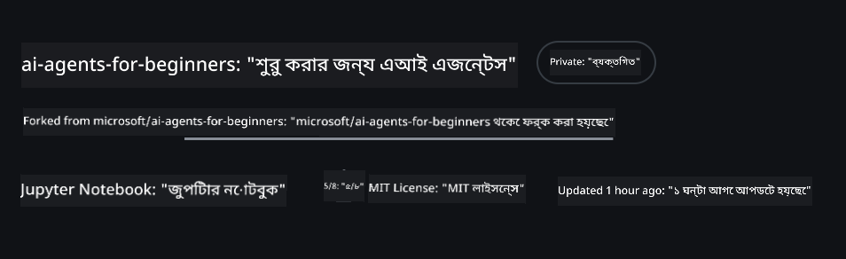
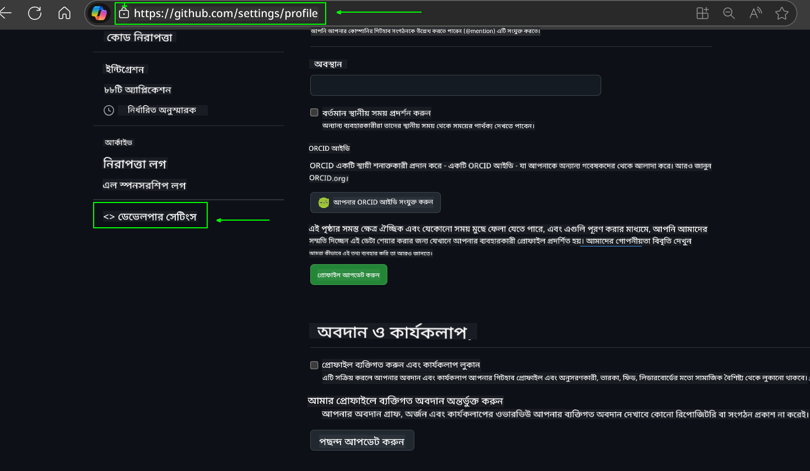
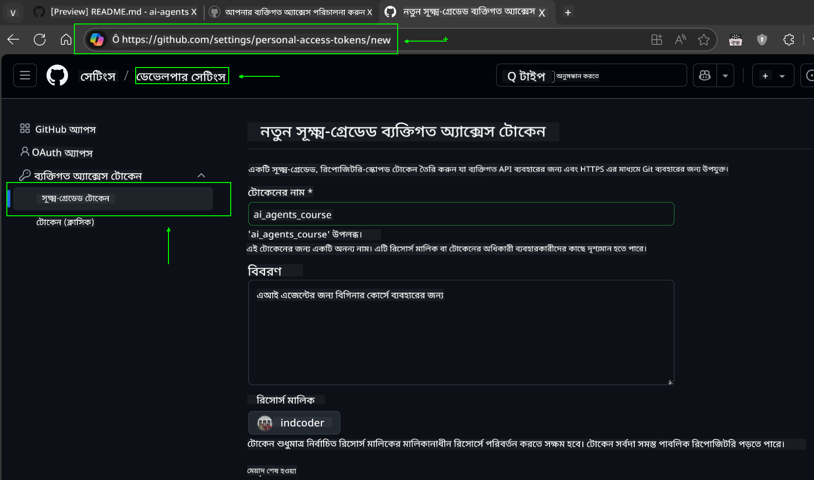
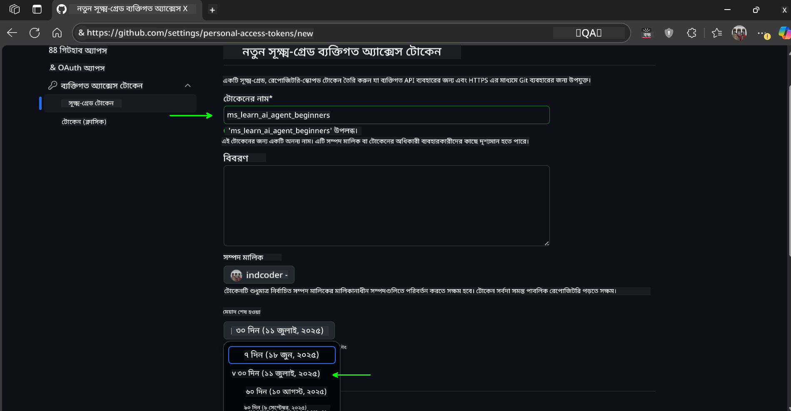
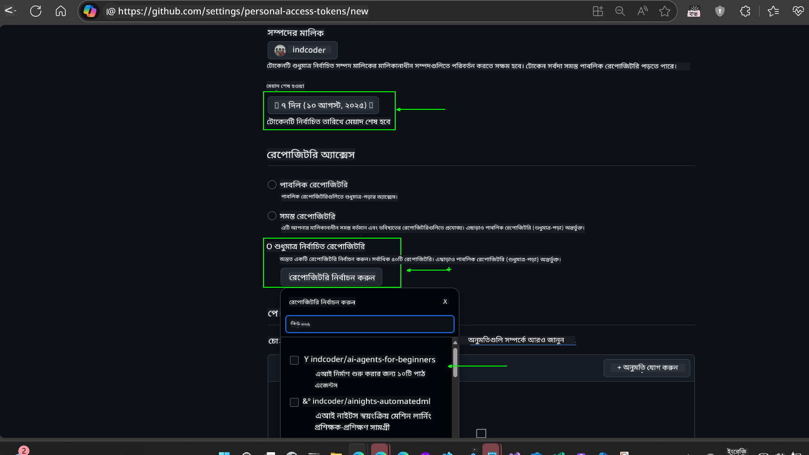
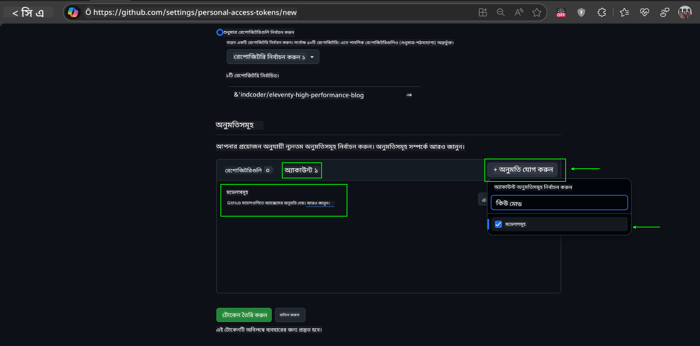
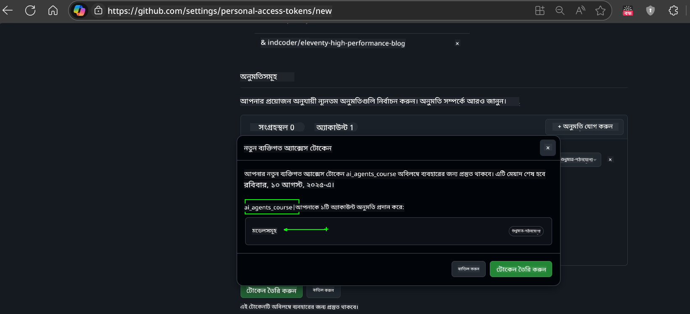
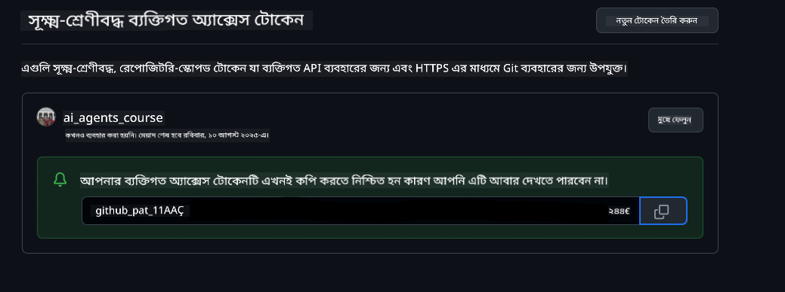
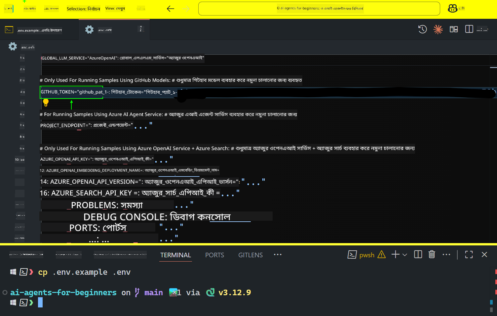
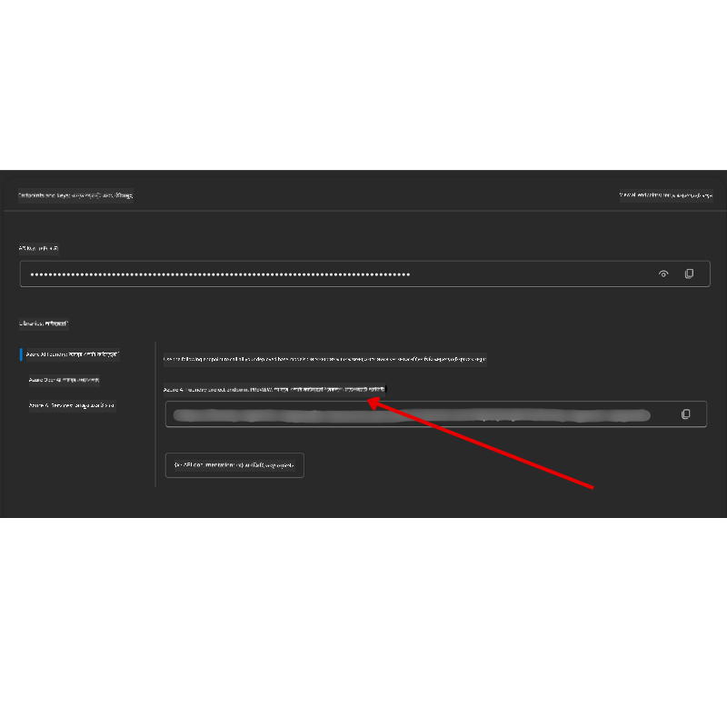

<!--
CO_OP_TRANSLATOR_METADATA:
{
  "original_hash": "96eb7f95375daa3e91778ca0295a55d9",
  "translation_date": "2025-10-15T11:42:09+00:00",
  "source_file": "00-course-setup/README.md",
  "language_code": "bn"
}
-->
# কোর্স সেটআপ

## পরিচিতি

এই পাঠে আমরা দেখব কীভাবে এই কোর্সের কোড নমুনাগুলি চালানো যায়।

## অন্যান্য শিক্ষার্থীদের সাথে যোগ দিন এবং সাহায্য পান

আপনার রিপোজিটরি ক্লোন করার আগে, [AI Agents For Beginners Discord চ্যানেলে](https://aka.ms/ai-agents/discord) যোগ দিন। এখানে আপনি সেটআপে সাহায্য পেতে পারেন, কোর্স সম্পর্কিত যেকোনো প্রশ্ন করতে পারেন, এবং অন্যান্য শিক্ষার্থীদের সাথে সংযোগ স্থাপন করতে পারেন।

## এই রিপো ক্লোন বা ফর্ক করুন

শুরু করার জন্য, অনুগ্রহ করে GitHub রিপোজিটরি ক্লোন বা ফর্ক করুন। এটি আপনার নিজের কোর্স উপকরণের একটি সংস্করণ তৈরি করবে যাতে আপনি কোড চালাতে, পরীক্ষা করতে এবং পরিবর্তন করতে পারেন!

এটি করতে, <a href="https://github.com/microsoft/ai-agents-for-beginners/fork" target="_blank">রিপো ফর্ক করুন</a> লিঙ্কে ক্লিক করুন।

এখন আপনার কাছে এই কোর্সের একটি ফর্ক করা সংস্করণ থাকবে নিম্নলিখিত লিঙ্কে:



### শ্যালো ক্লোন (ওয়ার্কশপ / কোডস্পেসের জন্য সুপারিশকৃত)

  >সম্পূর্ণ রিপোজিটরি বড় হতে পারে (~৩ জিবি) যখন আপনি সম্পূর্ণ ইতিহাস এবং সমস্ত ফাইল ডাউনলোড করেন। যদি আপনি শুধুমাত্র ওয়ার্কশপে অংশগ্রহণ করেন বা শুধুমাত্র কয়েকটি পাঠ ফোল্ডার প্রয়োজন হয়, একটি শ্যালো ক্লোন (বা একটি স্পার্স ক্লোন) বেশিরভাগ ডাউনলোড এড়িয়ে যায় ইতিহাস এবং/অথবা ব্লবগুলি বাদ দিয়ে।

#### দ্রুত শ্যালো ক্লোন — ন্যূনতম ইতিহাস, সমস্ত ফাইল

নিচের কমান্ডে `<your-username>` আপনার ফর্ক URL (অথবা আপস্ট্রিম URL যদি আপনি পছন্দ করেন) দিয়ে প্রতিস্থাপন করুন।

শুধুমাত্র সর্বশেষ কমিট ইতিহাস ক্লোন করতে (ছোট ডাউনলোড):

```bash|powershell
git clone --depth 1 https://github.com/<your-username>/ai-agents-for-beginners.git
```

একটি নির্দিষ্ট ব্রাঞ্চ ক্লোন করতে:

```bash|powershell
git clone --depth 1 --branch <branch-name> https://github.com/<your-username>/ai-agents-for-beginners.git
```

#### আংশিক (স্পার্স) ক্লোন — ন্যূনতম ব্লব + শুধুমাত্র নির্বাচিত ফোল্ডার

এটি আংশিক ক্লোন এবং স্পার্স-চেকআউট ব্যবহার করে (Git 2.25+ প্রয়োজন এবং আংশিক ক্লোন সমর্থন সহ আধুনিক Git সুপারিশকৃত):

```bash|powershell
git clone --depth 1 --filter=blob:none --sparse https://github.com/<your-username>/ai-agents-for-beginners.git
```

রিপো ফোল্ডারে প্রবেশ করুন:

বাশের জন্য:

```bash
cd ai-agents-for-beginners
```

পাওয়ারশেলের জন্য:

```powershell
Set-Location ai-agents-for-beginners
```

তারপর আপনি কোন ফোল্ডারগুলি চান তা নির্দিষ্ট করুন (নিচের উদাহরণে দুটি ফোল্ডার দেখানো হয়েছে):

```bash|powershell
git sparse-checkout set 00-course-setup 01-intro-to-ai-agents
```

ক্লোন এবং ফাইলগুলি যাচাই করার পরে, যদি শুধুমাত্র ফাইলগুলি প্রয়োজন হয় এবং স্থান মুক্ত করতে চান (কোনো git ইতিহাস ছাড়াই), অনুগ্রহ করে রিপোজিটরি মেটাডেটা মুছে ফেলুন (💀অপ্রত্যাবর্তনীয় — আপনি সমস্ত Git কার্যকারিতা হারাবেন: কোনো কমিট, পুল, পুশ বা ইতিহাস অ্যাক্সেস থাকবে না)।

Linux/macOS এর জন্য:

```bash
rm -rf .git
```

Windows এর জন্য:

```powershell
Remove-Item -Recurse -Force .git
```

#### GitHub Codespaces ব্যবহার করা (স্থানীয় বড় ডাউনলোড এড়াতে সুপারিশকৃত)

- [GitHub UI](https://github.com/codespaces) এর মাধ্যমে এই রিপোর জন্য একটি নতুন Codespace তৈরি করুন।  

- নতুন তৈরি করা Codespace এর টার্মিনালে, উপরের শ্যালো/স্পার্স ক্লোন কমান্ডগুলির একটি চালান যাতে শুধুমাত্র প্রয়োজনীয় পাঠ ফোল্ডারগুলি Codespace ওয়ার্কস্পেসে আনা যায়।
- ঐচ্ছিক: Codespaces এর ভিতরে ক্লোন করার পরে, অতিরিক্ত স্থান পুনরুদ্ধার করতে .git মুছে ফেলুন (উপরের মুছে ফেলার কমান্ডগুলি দেখুন)।
- নোট: যদি আপনি সরাসরি Codespaces-এ রিপো খুলতে পছন্দ করেন (অতিরিক্ত ক্লোন ছাড়াই), মনে রাখবেন Codespaces ডেভকন্টেইনার পরিবেশ তৈরি করবে এবং এখনও আপনার প্রয়োজনের চেয়ে বেশি প্রভিশন করতে পারে। একটি নতুন Codespace এর ভিতরে একটি শ্যালো কপি ক্লোন করা ডিস্ক ব্যবহারের উপর আরও নিয়ন্ত্রণ দেয়।

#### টিপস

- যদি আপনি সম্পাদনা/কমিট করতে চান তবে সর্বদা আপনার ফর্ক দিয়ে ক্লোন URL প্রতিস্থাপন করুন।
- যদি পরে আরও ইতিহাস বা ফাইল প্রয়োজন হয়, আপনি সেগুলি ফেচ করতে পারেন বা স্পার্স-চেকআউট সামঞ্জস্য করতে পারেন অতিরিক্ত ফোল্ডার অন্তর্ভুক্ত করার জন্য।

## কোড চালানো

এই কোর্সটি Jupyter Notebooks এর একটি সিরিজ অফার করে যা আপনি চালাতে পারেন এবং AI Agents তৈরি করার হাতে-কলম অভিজ্ঞতা পেতে পারেন।

কোড নমুনাগুলি নিম্নলিখিত ব্যবহার করে:

**GitHub অ্যাকাউন্ট প্রয়োজন - বিনামূল্যে**:

1) Semantic Kernel Agent Framework + GitHub Models Marketplace। (semantic-kernel.ipynb) নামে লেবেলযুক্ত
2) AutoGen Framework + GitHub Models Marketplace। (autogen.ipynb) নামে লেবেলযুক্ত

**Azure সাবস্ক্রিপশন প্রয়োজন**:
3) Azure AI Foundry + Azure AI Agent Service। (azureaiagent.ipynb) নামে লেবেলযুক্ত

আমরা আপনাকে তিনটি ধরণের উদাহরণ চেষ্টা করার জন্য উৎসাহিত করি যাতে আপনি দেখতে পারেন কোনটি আপনার জন্য সবচেয়ে ভালো কাজ করে।

আপনি যেকোনো বিকল্পই বেছে নিন, এটি নির্ধারণ করবে যে নিচের কোন সেটআপ ধাপগুলি আপনাকে অনুসরণ করতে হবে:

## প্রয়োজনীয়তা

- Python 3.12+
  - **NOTE**: যদি আপনার Python3.12 ইনস্টল না থাকে, নিশ্চিত করুন যে আপনি এটি ইনস্টল করেছেন। তারপর requirements.txt ফাইল থেকে সঠিক সংস্করণগুলি ইনস্টল করতে python3.12 ব্যবহার করে আপনার venv তৈরি করুন।
  
    >উদাহরণ

    Python venv ডিরেক্টরি তৈরি করুন:

    ``` bash
    python3 -m venv venv
    ```

    তারপর venv পরিবেশ সক্রিয় করুন:

    macOS এবং Linux এর জন্য

    ```bash
    source venv/bin/activate
    ```
  
    Windows এর জন্য

    ```bash
    venv\Scripts\activate
    ```

- একটি GitHub অ্যাকাউন্ট - GitHub Models Marketplace-এ অ্যাক্সেসের জন্য
- Azure সাবস্ক্রিপশন - Azure AI Foundry-এ অ্যাক্সেসের জন্য
- Azure AI Foundry অ্যাকাউন্ট - Azure AI Agent Service-এ অ্যাক্সেসের জন্য

আমরা এই রিপোজিটরির মূল অংশে একটি `requirements.txt` ফাইল অন্তর্ভুক্ত করেছি যা কোড নমুনাগুলি চালানোর জন্য প্রয়োজনীয় সমস্ত Python প্যাকেজ ধারণ করে।

আপনি নিম্নলিখিত কমান্ডটি চালিয়ে সেগুলি ইনস্টল করতে পারেন:

```bash
pip install -r requirements.txt
```
আমরা Python ভার্চুয়াল পরিবেশ তৈরি করার সুপারিশ করি যাতে কোনো দ্বন্দ্ব বা সমস্যা এড়ানো যায়।

## VSCode সেটআপ
নিশ্চিত করুন যে আপনি VSCode-এ সঠিক Python সংস্করণ ব্যবহার করছেন।


## GitHub Models ব্যবহার করে নমুনাগুলির জন্য সেটআপ 

### ধাপ ১: আপনার GitHub Personal Access Token (PAT) সংগ্রহ করুন

এই কোর্সটি GitHub Models Marketplace ব্যবহার করে, যা আপনাকে Large Language Models (LLMs)-এ বিনামূল্যে অ্যাক্সেস প্রদান করে যা আপনি AI Agents তৈরি করতে ব্যবহার করবেন।

GitHub Models ব্যবহার করতে, আপনাকে একটি [GitHub Personal Access Token](https://docs.github.com/en/authentication/keeping-your-account-and-data-secure/managing-your-personal-access-tokens) তৈরি করতে হবে।

এটি আপনার GitHub অ্যাকাউন্টের <a href="https://github.com/settings/personal-access-tokens" target="_blank">Personal Access Tokens settings</a> এ গিয়ে করা যেতে পারে।

অনুগ্রহ করে [Principle of Least Privilege](https://docs.github.com/en/get-started/learning-to-code/storing-your-secrets-safely) অনুসরণ করুন যখন আপনি আপনার টোকেন তৈরি করবেন। এর অর্থ হলো আপনি টোকেনকে শুধুমাত্র সেই অনুমতিগুলি দিন যা এই কোর্সে কোড নমুনাগুলি চালানোর জন্য প্রয়োজন।

1. **Developer settings**-এ গিয়ে স্ক্রিনের বাম পাশে `Fine-grained tokens` অপশনটি নির্বাচন করুন।
   

    তারপর `Generate new token` নির্বাচন করুন।

    

2. আপনার টোকেনের জন্য একটি বর্ণনামূলক নাম লিখুন যা এর উদ্দেশ্য প্রতিফলিত করে, পরে এটি সহজে চিহ্নিত করার জন্য।

    🔐 টোকেনের মেয়াদ সুপারিশ

    সুপারিশকৃত মেয়াদ: ৩০ দিন
    আরও নিরাপদ অবস্থানের জন্য, আপনি একটি ছোট সময়কাল বেছে নিতে পারেন—যেমন ৭ দিন 🛡️
    এটি একটি ব্যক্তিগত লক্ষ্য সেট করার এবং কোর্স সম্পন্ন করার একটি দুর্দান্ত উপায় 🚀।

    

3. টোকেনের স্কোপটি এই রিপোজিটরির ফর্কে সীমাবদ্ধ করুন।

    

4. টোকেনের অনুমতিগুলি সীমাবদ্ধ করুন: **Permissions** এর অধীনে, **Account** ট্যাবে ক্লিক করুন এবং "+ Add permissions" বোতামে ক্লিক করুন। একটি ড্রপডাউন উপস্থিত হবে। অনুগ্রহ করে **Models** অনুসন্ধান করুন এবং এর জন্য বক্সটি চেক করুন।
    

5. টোকেন তৈরি করার আগে প্রয়োজনীয় অনুমতিগুলি যাচাই করুন। 

6. টোকেন তৈরি করার আগে নিশ্চিত করুন যে আপনি এটি একটি নিরাপদ স্থানে সংরক্ষণ করতে প্রস্তুত, যেমন একটি পাসওয়ার্ড ম্যানেজার ভল্ট, কারণ এটি তৈরি করার পরে এটি আবার দেখানো হবে না। 

আপনার নতুন তৈরি টোকেনটি কপি করুন। এখন এটি এই কোর্সে অন্তর্ভুক্ত `.env` ফাইলে যোগ করুন।

### ধাপ ২: আপনার `.env` ফাইল তৈরি করুন

আপনার টার্মিনালে নিম্নলিখিত কমান্ডটি চালিয়ে `.env` ফাইল তৈরি করুন।

```bash
cp .env.example .env
```

এটি উদাহরণ ফাইলটি কপি করবে এবং একটি `.env` তৈরি করবে যেখানে আপনি পরিবেশ ভেরিয়েবলগুলির জন্য মানগুলি পূরণ করবেন।

আপনার টোকেনটি কপি করে, আপনার প্রিয় টেক্সট এডিটরে `.env` ফাইলটি খুলুন এবং আপনার টোকেনটি `GITHUB_TOKEN` ফিল্ডে পেস্ট করুন।


এখন আপনি এই কোর্সের কোড নমুনাগুলি চালাতে সক্ষম হবেন।

## Azure AI Foundry এবং Azure AI Agent Service ব্যবহার করে নমুনাগুলির জন্য সেটআপ

### ধাপ ১: আপনার Azure প্রকল্পের এন্ডপয়েন্ট সংগ্রহ করুন

Azure AI Foundry-তে একটি হাব এবং প্রকল্প তৈরি করার ধাপগুলি অনুসরণ করুন এখানে: [Hub resources overview](https://learn.microsoft.com/en-us/azure/ai-foundry/concepts/ai-resources)

আপনার প্রকল্প তৈরি করার পরে, আপনাকে আপনার প্রকল্পের জন্য সংযোগ স্ট্রিং সংগ্রহ করতে হবে।

এটি Azure AI Foundry পোর্টালের **Overview** পৃষ্ঠায় আপনার প্রকল্পে গিয়ে করা যেতে পারে।



### ধাপ ২: আপনার `.env` ফাইল তৈরি করুন

আপনার টার্মিনালে নিম্নলিখিত কমান্ডটি চালিয়ে `.env` ফাইল তৈরি করুন।

```bash
cp .env.example .env
```

এটি উদাহরণ ফাইলটি কপি করবে এবং একটি `.env` তৈরি করবে যেখানে আপনি পরিবেশ ভেরিয়েবলগুলির জন্য মানগুলি পূরণ করবেন।

আপনার টোকেনটি কপি করে, আপনার প্রিয় টেক্সট এডিটরে `.env` ফাইলটি খুলুন এবং আপনার টোকেনটি `PROJECT_ENDPOINT` ফিল্ডে পেস্ট করুন।

### ধাপ ৩: Azure-এ সাইন ইন করুন

একটি নিরাপত্তা সেরা অনুশীলন হিসাবে, আমরা [keyless authentication](https://learn.microsoft.com/azure/developer/ai/keyless-connections?tabs=csharp%2Cazure-cli?WT.mc_id=academic-105485-koreyst) ব্যবহার করব Microsoft Entra ID দিয়ে Azure OpenAI-তে প্রমাণীকরণের জন্য। 

পরবর্তী ধাপে, একটি টার্মিনাল খুলুন এবং `az login --use-device-code` চালিয়ে আপনার Azure অ্যাকাউন্টে সাইন ইন করুন।

আপনি লগ ইন করার পরে, টার্মিনালে আপনার সাবস্ক্রিপশন নির্বাচন করুন।

## অতিরিক্ত পরিবেশ ভেরিয়েবল - Azure Search এবং Azure OpenAI 

Agentic RAG পাঠ - পাঠ ৫ - এর জন্য কিছু নমুনা রয়েছে যা Azure Search এবং Azure OpenAI ব্যবহার করে।

যদি আপনি এই নমুনাগুলি চালাতে চান, তবে আপনাকে আপনার `.env` ফাইলে নিম্নলিখিত পরিবেশ ভেরিয়েবলগুলি যোগ করতে হবে:

### Overview Page (Project)

- `AZURE_SUBSCRIPTION_ID` - আপনার প্রকল্পের **Overview** পৃষ্ঠার **Project details** চেক করুন।

- `AZURE_AI_PROJECT_NAME` - আপনার প্রকল্পের **Overview** পৃষ্ঠার শীর্ষে দেখুন।

- `AZURE_OPENAI_SERVICE` - **Overview** পৃষ্ঠার **Included capabilities** ট্যাবে **Azure OpenAI Service** এর জন্য এটি খুঁজুন।

### Management Center

- `AZURE_OPENAI_RESOURCE_GROUP` - **Management Center** এর **Overview** পৃষ্ঠার **Project properties** এ যান।

- `GLOBAL_LLM_SERVICE` - **Connected resources** এর অধীনে, **Azure AI Services** সংযোগের নাম খুঁজুন। যদি তালিকাভুক্ত না থাকে, তবে **Azure portal** এ আপনার রিসোর্স গ্রুপের অধীনে AI Services রিসোর্সের নাম চেক করুন।

### Models + Endpoints Page

- `AZURE_OPENAI_EMBEDDING_DEPLOYMENT_NAME` - আপনার এমবেডিং মডেল নির্বাচন করুন (যেমন, `text-embedding-ada-002`) এবং মডেল বিবরণ থেকে **Deployment name** নোট করুন।

- `AZURE_OPENAI_CHAT_DEPLOYMENT_NAME` - আপনার চ্যাট মডেল নির্বাচন করুন (যেমন, `gpt-4o-mini`) এবং মডেল বিবরণ থেকে **Deployment name** নোট করুন।

### Azure Portal

- `AZURE_OPENAI_ENDPOINT` - **Azure AI services** খুঁজুন, এটি ক্লিক করুন, তারপর **Resource Management**, **Keys and Endpoint** এ যান, "Azure OpenAI endpoints" এ স্ক্রোল করুন এবং "Language APIs" এর জন্য একটি কপি করুন।

- `AZURE_OPENAI_API_KEY` - একই স্ক্রিন থেকে KEY 1 বা KEY 2 কপি করুন।

- `AZURE_SEARCH_SERVICE_ENDPOINT` - আপনার **Azure AI Search** রিসোর্স খুঁজুন, এটি ক্লিক করুন এবং **Overview** দেখুন।

- `AZURE_SEARCH_API_KEY` - তারপর **Settings** এবং **Keys** এ যান এবং প্রাথমিক বা মাধ্যমিক অ্যাডমিন কী কপি করুন।

### External Webpage

- `AZURE_OPENAI_API_VERSION` - [API version lifecycle](https://learn.microsoft.com/en-us/azure/ai-services/openai/api-version-deprecation#latest-ga-api-release) পৃষ্ঠায় **Latest GA API release** এর অধীনে যান।

### Keyless Authentication সেটআপ করুন

আপনার ক্রেডেনশিয়ালগুলি হার্ডকোড করার পরিবর্তে, আমরা Azure OpenAI-এর সাথে একটি keyless সংযোগ ব্যবহার করব। এটি করতে, আমরা `DefaultAzureCredential` আমদানি করব এবং পরে `DefaultAzureCredential` ফাংশন কল করব ক্রেডেনশিয়াল পেতে।

```python
from azure.identity import DefaultAzureCredential, InteractiveBrowserCredential
```

## কোথাও আটকে গেছেন?
যদি এই সেটআপ চালানোর সময় কোনো সমস্যা হয়, আমাদের <a href="https://discord.gg/kzRShWzttr" target="_blank">Azure AI Community Discord</a> এ যোগ দিন অথবা <a href="https://github.com/microsoft/ai-agents-for-beginners/issues?WT.mc_id=academic-105485-koreyst" target="_blank">একটি সমস্যা তৈরি করুন</a>।

## পরবর্তী পাঠ

আপনি এখন এই কোর্সের কোড চালানোর জন্য প্রস্তুত। AI এজেন্টদের জগৎ সম্পর্কে আরও শিখতে শুভকামনা! 

[AI এজেন্ট এবং এজেন্ট ব্যবহারের ক্ষেত্রে পরিচিতি](../01-intro-to-ai-agents/README.md)

---

**অস্বীকৃতি**:  
এই নথিটি AI অনুবাদ পরিষেবা [Co-op Translator](https://github.com/Azure/co-op-translator) ব্যবহার করে অনুবাদ করা হয়েছে। আমরা যথাসাধ্য সঠিকতার জন্য চেষ্টা করি, তবে অনুগ্রহ করে মনে রাখবেন যে স্বয়ংক্রিয় অনুবাদে ত্রুটি বা অসঙ্গতি থাকতে পারে। মূল ভাষায় থাকা নথিটিকে প্রামাণিক উৎস হিসেবে বিবেচনা করা উচিত। গুরুত্বপূর্ণ তথ্যের জন্য, পেশাদার মানব অনুবাদ সুপারিশ করা হয়। এই অনুবাদ ব্যবহারের ফলে কোনো ভুল বোঝাবুঝি বা ভুল ব্যাখ্যা হলে আমরা দায়বদ্ধ থাকব না।