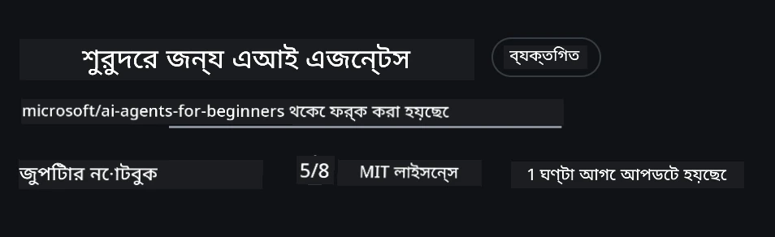

# কোর্স সেটআপ

## পরিচিতি

এই পাঠে এই কোর্সের কোড উদাহরণগুলো কীভাবে চালাতে হয় তা কভার করা হবে।

## অন্যান্য শিক্ষার্থী সঙ্গে যোগ দিন এবং সাহায্য নিন

রিপো ক্লোন করা শুরু করার আগে, সেটআপে কোন সাহায্য, কোর্স সম্পর্কে কোনো প্রশ্ন, বা অন্যান্য শিক্ষার্থীদের সঙ্গে সংযুক্ত হতে [AI Agents For Beginners Discord channel](https://aka.ms/ai-agents/discord)-এ যোগ দিন।

## এই রিপো ক্লোন বা ফর্ক করুন

শুরু করতে, অনুগ্রহ করে GitHub রিপোজিটরি ক্লোন বা ফর্ক করুন। এটি কোর্স উপকরণগুলোর আপনার নিজস্ব সংস্করণ তৈরি করবে যাতে আপনি কোড চালাতে, পরীক্ষা করতে এবং সামান্য পরিবর্তন করতে পারেন!

এটি করতে পারেন এখানে ক্লিক করে <a href="https://github.com/microsoft/ai-agents-for-beginners/fork" target="_blank">fork the repo</a>

আপনার এখন নিম্নলিখিত লিঙ্কে এই কোর্সের আপনার নিজস্ব ফর্ক করা সংস্করণ থাকা উচিত:



### শ্যালো ক্লোন (ওয়ার্কশপ / Codespaces-এর জন্য সুপারিশকৃত)

  >পূর্ণ রিপোজিটরিটি সম্পূর্ণ ইতিহাস এবং সমস্ত ফাইল ডাউনলোড করলে বড় হতে পারে (~3 GB)। যদি আপনি কেবল ওয়ার্কশপে অংশগ্রহন করছেন বা শুধুমাত্র কয়েকটি লেসন ফোল্ডারেই দরকার, তাহলে শ্যালো ক্লোন (বা স্পার্স ক্লোন) ইতিহাস ট্রাঙ্কেট করে এবং/অথবা ব্লব স্কিপ করে বেশিরভাগ ডাউনলোড এড়ায়।

#### দ্রুত শ্যালো ক্লোন — ন্যূনতম ইতিহাস, সমস্ত ফাইল

নীচের কমান্ডগুলিতে `<your-username>` আপনার ফর্ক URL (অথবা আপনি যদি পছন্দ করেন upstream URL) দিয়ে প্রতিস্থাপন করুন।

কেবল সর্বশেষ কমিট ইতিহাস ক্লোন করতে (ছোট ডাউনলোড):

```bash|powershell
git clone --depth 1 https://github.com/<your-username>/ai-agents-for-beginners.git
```

নির্দিষ্ট একটি ব্রাঞ্চ ক্লোন করতে:

```bash|powershell
git clone --depth 1 --branch <branch-name> https://github.com/<your-username>/ai-agents-for-beginners.git
```

#### অংশিক (স্পার্স) ক্লোন — ন্যূনতম ব্লব + শুধুমাত্র নির্বাচিত ফোল্ডারগুলি

এটি অংশিক ক্লোন এবং sparse-checkout ব্যবহার করে (Git 2.25+ প্রয়োজন এবং partial clone সমর্থন সহ আধুনিক Git সুপারিশকৃত):

```bash|powershell
git clone --depth 1 --filter=blob:none --sparse https://github.com/<your-username>/ai-agents-for-beginners.git
```

রিপো ফোল্ডারে প্রবেশ করুন:

```bash|powershell
cd ai-agents-for-beginners
```

তারপর আপনি যে ফোল্ডারগুলি চান তা উল্লেখ করুন (নিচের উদাহরণে দুটি ফোল্ডার দেখানো হয়েছে):

```bash|powershell
git sparse-checkout set 00-course-setup 01-intro-to-ai-agents
```

ক্লোন এবং ফাইল যাচাই করার পরে, যদি আপনি কেবল ফাইলগুলোই চান এবং স্থান মুক্ত করতে চান (কোনো git ইতিহাস নয়), তবে অনুগ্রহ করে রিপোজিটরি মেটাডেটা মুছে ফেলুন (💀অপ্রত্যাবর্তনীয় — আপনি সমস্ত Git কার্যকারিতা হারাবেন: কোনো কমিট, পুল, পুশ বা ইতিহাস অ্যাক্সেস থাকবে না)।

```bash
# জেডএসএইচ/বাশ
rm -rf .git
```

```powershell
# পাওয়ারশেল
Remove-Item -Recurse -Force .git
```

#### GitHub Codespaces ব্যবহার করা (লোকাল বড় ডাউনলোড এড়াতে সুপারিশকৃত)

- এই রিপোর জন্য [GitHub UI](https://github.com/codespaces) এর মাধ্যমে একটি নতুন Codespace তৈরি করুন।  

- নতুন তৈরি করা codespace-এর টার্মিনালে উপরে উল্লেখিত শ্যালো/স্পার্স ক্লোন কমান্ডগুলির একটি চালান যাতে আপনি আপনার দরকারি লেসন ফোল্ডারগুলোই Codespace ওয়ার্কস্পেসে আনতে পারেন।
- ঐচ্ছিক: Codespaces-এর ভিতরে ক্লোন করার পরে, অতিরিক্ত স্থান পুনরুদ্ধার করতে .git মোছা যেতে পারে (উপরের মুছে ফেলার কমান্ড দেখুন)।
- নোট: যদি আপনি রিপোটি সরাসরি Codespaces-এ খুলতে চান (অতিরিক্ত ক্লোন ছাড়া), জানুন Codespaces devcontainer পরিবেশ তৈরি করবে এবং সম্ভবত আপনার প্রয়োজনের চেয়ে বেশি কিছু provisioning করবে। নতুন Codespace-এর ভিতরে শ্যালো কপি ক্লোন করা ডিস্ক ব্যবহারে আপনাকে আরো নিয়ন্ত্রণ দেবে।

#### টিপস

- যদি আপনি সম্পাদনা/কমিট করতে চান তবে ক্লোন URL সর্বদা আপনার ফর্ক দিয়ে প্রতিস্থাপন করুন।
- পরে যদি আরও ইতিহাস বা ফাইল দরকার হয়, আপনি সেগুলো fetch করতে পারেন বা sparse-checkout দিয়ে অতিরিক্ত ফোল্ডারগুলি অন্তর্ভুক্ত করতে সমন্বয় করতে পারেন।

## কোড চালানো

এই কোর্স বিভিন্ন Jupyter নোটবুক প্রদান করে যা আপনি AI Agents তৈরিতে হাতে-কলমে অভিজ্ঞতা লাভ করতে চালাতে পারেন।

কোড উদাহরণগুলো **Microsoft Agent Framework (MAF)** ব্যবহার করে `AzureAIProjectAgentProvider`-এর সাথে, যা **Microsoft Foundry** মারফত **Azure AI Agent Service V2** (Responses API) এর সাথে সংযুক্ত করে।

সব Python নোটবুকের লেবেল `*-python-agent-framework.ipynb`।

## প্রয়োজনীয়তাসমূহ

- Python 3.12+
  - **নোট**: যদি আপনার কাছে Python3.12 ইনস্টল না থাকে, নিশ্চিত করুন এটি ইনস্টল করেছেন। তারপর requirements.txt ফাইল থেকে সঠিক সংস্করণগুলো ইনস্টল করাতে python3.12 ব্যবহার করে আপনার venv তৈরি করুন।
  
    >উদাহরণ

    Python venv ডিরেক্টরি তৈরি করুন:

    ```bash|powershell
    python -m venv venv
    ```

    তারপর venv পরিবেশ সক্রিয় করুন:

    ```bash
    # জেডএসএইচ/বাশ
    source venv/bin/activate
    ```
  
    ```dos
    # Command Prompt for Windows
    venv\Scripts\activate
    ```

- .NET 10+: .NET ব্যবহার করে নমুনা কোডগুলোর জন্য, নিশ্চিত করুন আপনি [.NET 10 SDK](https://dotnet.microsoft.com/download/dotnet/10.0) বা পরবর্তী সংস্করণ ইনস্টল করেছেন। তারপর আপনার ইনস্টল করা .NET SDK সংস্করণ চেক করুন:

    ```bash|powershell
    dotnet --list-sdks
    ```

- **Azure CLI** — প্রমাণীকরণের জন্য প্রয়োজন। ইনস্টল করুন [aka.ms/installazurecli](https://aka.ms/installazurecli) থেকে।
- **Azure Subscription** — Microsoft Foundry এবং Azure AI Agent Service অ্যাক্সেসের জন্য।
- **Microsoft Foundry Project** — একটি প্রোজেক্ট যা ডিপ্লয় করা মডেল আছে (উদাহরণ: `gpt-4o`)। দেখুন [Step 1](../../../00-course-setup) নিচে।

আমরা এই রিপোজিটরির রুটে একটি `requirements.txt` ফাইল অন্তর্ভুক্ত করেছি যার মধ্যে কোড উদাহরণ চালাতে প্রয়োজনীয় সব Python প্যাকেজ রয়েছে।

আপনি রিপোজিটরির রুটে আপনার টার্মিনালে নিম্নলিখিত কমান্ড চালিয়ে সেগুলো ইনস্টল করতে পারেন:

```bash|powershell
pip install -r requirements.txt
```

কোনো সংঘাত ও সমস্যা এড়াতে Python ভার্চুয়াল এনভায়রনমেন্ট তৈরি করার পরামর্শ দিচ্ছি।

## VSCode সেটআপ

VSCode-এ নিশ্চিত করুন আপনি সঠিক Python সংস্করণ ব্যবহার করছেন।


## Microsoft Foundry এবং Azure AI Agent Service সেটআপ করুন

### ধাপ 1: একটি Microsoft Foundry Project তৈরি করুন

নোটবুকগুলো চালাতে হলে আপনার একটি Azure AI Foundry **hub** এবং **project** থাকতে হবে যার উপরে একটি মডেল ডিপ্লয় করা আছে।

1. [ai.azure.com](https://ai.azure.com) এ যান এবং আপনার Azure একাউন্ট দিয়ে সাইন ইন করুন।
2. একটি **hub** তৈরি করুন (অথবা বিদ্যমান একটি ব্যবহার করুন)। দেখুন: [Hub resources overview](https://learn.microsoft.com/azure/ai-foundry/concepts/ai-resources)।
3. হাবের ভেতরে একটি **project** তৈরি করুন।
4. **Models + Endpoints** → **Deploy model** থেকে একটি মডেল (উদাহরণ: `gpt-4o`) ডিপ্লয় করুন।

### ধাপ 2: আপনার প্রোজেক্ট এন্ডপয়েন্ট এবং মডেল ডিপ্লয়মেন্ট নাম অনুসন্ধান করুন

Microsoft Foundry পোর্টালের আপনার প্রোজেক্ট থেকে:

- **Project Endpoint** — **Overview** পৃষ্ঠায় যান এবং এন্ডপয়েন্ট URL কপি করুন।


- **Model Deployment Name** — **Models + Endpoints** এ যান, আপনার ডিপ্লয় করা মডেলটি নির্বাচন করুন, এবং **Deployment name** নোট করুন (উদাহরণ: `gpt-4o`)।

### ধাপ 3: `az login` দিয়ে Azure-এ সাইন ইন করুন

সব নোটবুক প্রমাণীকরণের জন্য **`AzureCliCredential`** ব্যবহার করে — কোনো API কী ম্যানেজ করতে হবে না। এর জন্য আপনাকে Azure CLI-এর মাধ্যমে সাইন ইন থাকতে হবে।

1. **Azure CLI ইনস্টল করুন** যদি এখনো না করে থাকেন: [aka.ms/installazurecli](https://aka.ms/installazurecli)

2. **সাইন ইন** করতে রান করুন:

    ```bash|powershell
    az login
    ```

    অথবা আপনি যদি ব্রাউজার ছাড়া কোনো রিমোট/Codespace পরিবেশে থাকেন:

    ```bash|powershell
    az login --use-device-code
    ```

3. **আপনার সাবস্ক্রিপশন নির্বাচন করুন** যদি প্রম্পট করা হয় — আপনার Foundry প্রোজেক্ট থাকা সাবস্ক্রিপশনটি নির্বাচন করুন।

4. **যাচাই করুন** যে আপনি সাইন ইন করেছেন:

    ```bash|powershell
    az account show
    ```

> **কেন `az login`?** নোটবুকগুলো `azure-identity` প্যাকেজের `AzureCliCredential` ব্যবহার করে প্রমাণীকরণ করে। এর মানে আপনার Azure CLI সেশন ক্রেডেনশিয়াল সরবরাহ করে — `.env` ফাইলে কোনো API কী বা সিক্রেট থাকে না। এটি একটি [সিকিউরিটি বেস্ট প্র্যাকটিস](https://learn.microsoft.com/azure/developer/ai/keyless-connections)।

### ধাপ 4: আপনার `.env` ফাইল তৈরি করুন

উদাহরণ ফাইল কপি করুন:

```bash
# জেডএসএইচ/বাশ
cp .env.example .env
```

```powershell
# পাওয়ারশেল
Copy-Item .env.example .env
```

`.env` খুলে এই দুইটি মান পূরণ করুন:

```env
AZURE_AI_PROJECT_ENDPOINT=https://<your-project>.services.ai.azure.com/api/projects/<your-project-id>
AZURE_AI_MODEL_DEPLOYMENT_NAME=gpt-4o
```

| Variable | কোথায় এটি খুঁজে পাবেন |
|----------|-----------------------|
| `AZURE_AI_PROJECT_ENDPOINT` | Foundry portal → your project → **Overview** page |
| `AZURE_AI_MODEL_DEPLOYMENT_NAME` | Foundry portal → **Models + Endpoints** → your deployed model's name |

বেশিরভাগ লেসনের জন্য এটুকুই যথেষ্ট! নোটবুকগুলো আপনার `az login` সেশনের মাধ্যমে স্বয়ংক্রিয়ভাবে প্রমাণীকরণ করবে।

### ধাপ 5: Python নির্ভরশীলতাসমূহ ইনস্টল করুন

```bash|powershell
pip install -r requirements.txt
```

আমরা আগে তৈরি করা ভার্চুয়াল এনভায়রনমেন্টের ভিতরে এটি চালানোর পরামর্শ দিই।

## লেসন 5 (Agentic RAG)-এর জন্য অতিরিক্ত সেটআপ

লেসন 5 retrieval-augmented generation-এর জন্য **Azure AI Search** ব্যবহার করে। আপনি যদি সেই লেসন চালাতে চান, তাহলে আপনার `.env` ফাইলে এই ভ্যারিয়েবলগুলো যোগ করুন:

| Variable | কোথায় এটি খুঁজে পাবেন |
|----------|-----------------------|
| `AZURE_SEARCH_SERVICE_ENDPOINT` | Azure portal → your **Azure AI Search** resource → **Overview** → URL |
| `AZURE_SEARCH_API_KEY` | Azure portal → your **Azure AI Search** resource → **Settings** → **Keys** → primary admin key |

## লেসন 6 এবং লেসন 8 (GitHub Models)-এর জন্য অতিরিক্ত সেটআপ

কয়েকটি নোটবুক লেসন 6 ও 8-এ **GitHub Models** ব্যবহার করে Azure AI Foundry-এর পরিবর্তে। আপনি যদি সেই স্যাম্পলগুলো চালাতে চান, তাহলে আপনার `.env` ফাইলে এই ভ্যারিয়েবলগুলো যোগ করুন:

| Variable | কোথায় এটি খুঁজে পাবেন |
|----------|-----------------------|
| `GITHUB_TOKEN` | GitHub → **Settings** → **Developer settings** → **Personal access tokens** |
| `GITHUB_ENDPOINT` | Use `https://models.inference.ai.azure.com` (default value) |
| `GITHUB_MODEL_ID` | Model name to use (e.g. `gpt-4o-mini`) |

## লেসন 8 (Bing Grounding Workflow)-এর জন্য অতিরিক্ত সেটআপ

লেসন 8-এর শর্তসাপেক্ষ ওয়ার্কফ্লো নোটবুকটি Azure AI Foundry মারফত **Bing grounding** ব্যবহার করে। আপনি যদি সেই স্যাম্পল চালাতে চান, তাহলে আপনার `.env` ফাইলে এই ভ্যারিয়েবলটি যোগ করুন:

| Variable | কোথায় এটি খুঁজে পাবেন |
|----------|-----------------------|
| `BING_CONNECTION_ID` | Azure AI Foundry portal → your project → **Management** → **Connected resources** → your Bing connection → connection ID কপি করুন |

## সমস্যা সমাধান

### macOS-এ SSL সার্টিফিকেট যাচাইকরণ ত্রুটি

যদি আপনি macOS-এ থাকেন এবং নিম্নরূপ কোনো ত্রুটি পান:

```plaintext
ssl.SSLCertVerificationError: [SSL: CERTIFICATE_VERIFY_FAILED] certificate verify failed: self-signed certificate in certificate chain
```

এটি macOS-এ Python-এর একটি পরিচিত সমস্যা যেখানে সিস্টেম SSL সার্টিফিকেটগুলি স্বয়ংক্রিয়ভাবে ট্রাস্ট করা হয় না। নিচের সমাধানগুলোকে ক্রমে চেষ্টা করুন:

**অপশন 1: Python-এর Install Certificates স্ক্রিপ্ট চালান (সুপারিশকৃত)**

```bash
# আপনার ইনস্টল করা পাইথন ভার্সন (যেমন 3.12 বা 3.13) দিয়ে 3.XX প্রতিস্থাপন করুন:
/Applications/Python\ 3.XX/Install\ Certificates.command
```

**অপশন 2: আপনার নোটবুকে `connection_verify=False` ব্যবহার করুন (শুধুমাত্র GitHub Models নোটবুকগুলোর জন্য)**

Lesson 6 নোটবুক (`06-building-trustworthy-agents/code_samples/06-system-message-framework.ipynb`) এ একটি মন্তব্যকৃত ওয়ার্কঅ্যারাউন্ড ইতিমধ্যেই অন্তর্ভুক্ত আছে। ক্লায়েন্ট তৈরি করার সময় `connection_verify=False` আনকমেন্ট করুন:

```python
client = ChatCompletionsClient(
    endpoint=endpoint,
    credential=AzureKeyCredential(token),
    connection_verify=False,  # সার্টিফিকেট ত্রুটি হলে SSL যাচাইকরণ নিষ্ক্রিয় করুন
)
```

> **⚠️ Warning:** SSL যাচাইকরণ অক্ষম করা (`connection_verify=False`) সার্টিফিকেট যাচাই এড়িয়ে নিরাপত্তা হ্রাস করে। এটি শুধুমাত্র ডেভেলপমেন্ট পরিবেশে অস্থায়ী ওয়ার্কঅ্যারাউন্ড হিসেবে ব্যবহার করুন, উৎপাদনে কখনোই না।

**অপশন 3: `truststore` ইনস্টল এবং ব্যবহার করুন**

```bash
pip install truststore
```

তারপর নেটওয়ার্ক কল করার আগে আপনার নোটবুক বা স্ক্রিপ্টের শীর্ষে নিম্নলিখিত যোগ করুন:

```python
import truststore
truststore.inject_into_ssl()
```

## কোথাও আটকে গেছেন?

যদি এই সেটআপ চালাতে কোনো সমস্যা হয়, আমাদের <a href="https://discord.gg/kzRShWzttr" target="_blank">Azure AI Community Discord</a>-এ যোগ দিন অথবা <a href="https://github.com/microsoft/ai-agents-for-beginners/issues?WT.mc_id=academic-105485-koreyst" target="_blank">একটি ইস্যু তৈরি করুন</a>।

## পরের লেসন

আপনি এখন এই কোর্সের কোড চালানোর জন্য প্রস্তুত। AI Agents জগত সম্পর্কে আরও শিখতে শুভেচ্ছা!

[Introduction to AI Agents and Agent Use Cases](../01-intro-to-ai-agents/README.md)

---

<!-- CO-OP TRANSLATOR DISCLAIMER START -->
অস্বীকৃতি:
এই নথিটি AI অনুবাদ সেবা Co-op Translator (https://github.com/Azure/co-op-translator) ব্যবহার করে অনূদিত হয়েছে। আমরা যথাসাধ্য সঠিকতা বজায় রাখার চেষ্টা করি, তবু অনুগ্রহ করে জেনে রাখুন যে স্বয়ংক্রিয় অনুবাদে ভুল বা অসম্পূর্ণতা থাকতে পারে। মূল ভাষায় থাকা ডকুমেন্টটিকেই প্রামাণিক উৎস হিসেবে বিবেচনা করা উচিত। গুরুত্বপূর্ণ তথ্যের জন্য পেশাদার মানব অনুবাদ নেওয়া doporuচিত। এই অনুবাদ ব্যবহারের ফলে কোনো ভুলবোঝাবুঝি বা বিভ্রান্তির জন্য আমরা দায়ী নই।
<!-- CO-OP TRANSLATOR DISCLAIMER END -->