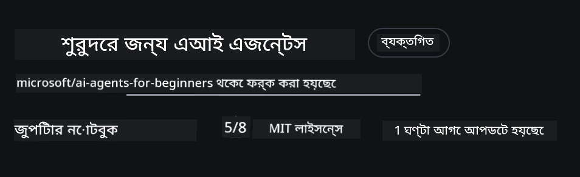
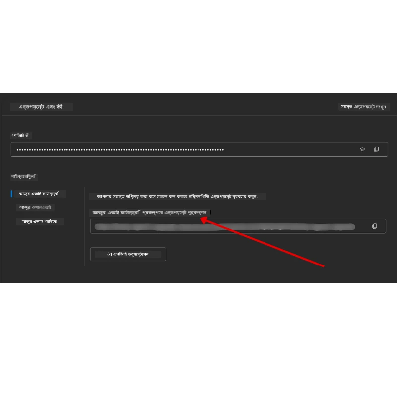

# কোর্স সেটআপ

## পরিচিতি

এই পাঠে এই কোর্সের কোড নমুনাগুলো কীভাবে চালাতে হয় তা আলোচনা করা হবে।

## অন্যান্য শিক্ষার্থীদের সাথে যুক্ত হন এবং সাহায্য পান

আপনার রিপো ক্লোন করার আগে, [AI Agents For Beginners Discord channel](https://aka.ms/ai-agents/discord) যোগ দিন সাহায্যের জন্য, কোর্স সম্পর্কে প্রশ্ন করার জন্য বা অন্যান্য শিক্ষার্থীদের সাথে সংযোগ স্থাপনের জন্য।

## এই রিপো ক্লোন বা ফর্ক করুন

শুরু করতে, অনুগ্রহ করে GitHub রিপোজিটরি ক্লোন বা ফর্ক করুন। এতে আপনি কোর্সের উপকরণের নিজের সংস্করণ পাবেন যাতে আপনি কোড চালাতে, পরীক্ষা করতে এবং সামঞ্জস্য করতে পারেন!

এটি করতে পারেন <a href="https://github.com/microsoft/ai-agents-for-beginners/fork" target="_blank">ফর্ক রিপো</a> লিঙ্কে ক্লিক করে।

এখন আপনার নিজের এই কোর্সের ফর্ক করা সংস্করণ এই লিঙ্কে থাকা উচিত:



### শ্যালো ক্লোন (ওয়ার্কশপ / কোডস্পেসেসের জন্য সুপারিশকৃত)

  > সম্পূর্ণ রিপোজিটরি বড় হতে পারে (~৩ গিগাবাইট) যখন আপনি পুরো ইতিহাস এবং সকল ফাইল ডাউনলোড করেন। যদি আপনি শুধু ওয়ার্কশপে অংশগ্রহণ করছেন বা শুধুমাত্র কয়েকটি লেসন ফোল্ডার প্রয়োজন, তাহলে শ্যালো ক্লোন (বা স্পার্স ক্লোন) অনেক কম ডাউনলোড করে।

#### দ্রুত শ্যালো ক্লোন — কম ইতিহাস, সকল ফাইল

নিচের কমান্ডগুলিতে `<your-username>` আপনার ফর্ক URL (অথবা আপস্ট্রিম URL, যদি ইচ্ছা করেন) দিয়ে প্রতিস্থাপন করুন।

শুধুমাত্র সর্বশেষ কমিট ইতিহাস ক্লোন করতে (ছোট ডাউনলোড):

```bash
git clone --depth 1 https://github.com/<your-username>/ai-agents-for-beginners.git
```

নির্দিষ্ট একটি ব্রাঞ্চ ক্লোন করতে:

```bash
git clone --depth 1 --branch <branch-name> https://github.com/<your-username>/ai-agents-for-beginners.git
```

#### আংশিক (স্পার্স) ক্লোন — ছোট ব্লব + শুধুমাত্র নির্বাচিত ফোল্ডার

এটি আংশিক ক্লোন এবং স্পার্স-চেকআউট ব্যবহার করে (Git 2.25+ প্রয়োজন এবং আধুনিক Git যা পার্শিয়াল ক্লোন সাপোর্ট করে তা সুপারিশকৃত):

```bash
git clone --depth 1 --filter=blob:none --sparse https://github.com/<your-username>/ai-agents-for-beginners.git
```

রিপোজিটরি ফোল্ডারে প্রবেশ করুন:

```bash
cd ai-agents-for-beginners
```

তারপর নির্দিষ্ট করুন আপনি কোন ফোল্ডারগুলো চান (নিচের উদাহরণে দুইটি ফোল্ডার দেখানো হয়েছে):

```bash
git sparse-checkout set 00-course-setup 01-intro-to-ai-agents
```

ক্লোন করে ফাইলগুলি নিশ্চিত করার পরে, যদি আপনি শুধু ফাইল চান এবং স্থান মুক্ত করতে চান (কোন গিট ইতিহাস নয়), তাহলে রিপোজিটরি মেটাডেটা মুছে দিন (💀অপূরণীয় — আপনি সমস্ত Git ফাংশনালিটি হারাবেন):

```bash
# জেডএসএইচ/বাশ
rm -rf .git
```

```powershell
# পাওয়ারশেল
Remove-Item -Recurse -Force .git
```

#### GitHub Codespaces ব্যবহার করা (স্থানীয় বড় ডাউনলোড এড়াতে সুপারিশকৃত)

- এই রিপোর জন্য [GitHub UI](https://github.com/codespaces) থেকে একটি নতুন Codespace তৈরি করুন।  

- নতুন তৈরি Codespace এর টার্মিনালে, উপরের শ্যালো/স্পার্স ক্লোন কমান্ডগুলির একটি চালান শুধুমাত্র আপনার দরকার লেসন ফোল্ডারগুলো Codespace ওয়ার্কস্পেসে আনতে।
- ঐচ্ছিক: Codespaces এর মধ্যে ক্লোন করার পরে, অতিরিক্ত স্থান ফেরত পেতে .git মুছে দিন (উপরের মুছে ফেলা কমান্ড দেখুন)।
- লক্ষ্য করুন: যদি আপনি রিপো সরাসরি Codespaces এ খুলতে চান (অতিরিক্ত ক্লোন ছাড়া), সাবধান থাকুন Codespaces ডেভকন্টেইনার পরিবেশ তৈরি করবে এবং হয়তো আপনার চেয়ে বেশি কিছু প্রস্তুত করবে।

#### টিপস

- সবসময় ক্লোন URL আপনার ফর্ক দিয়ে প্রতিস্থাপন করুন যদি আপনি সম্পাদনা/কমিট করতে চান।
- যদি পরে আরও ইতিহাস বা ফাইল প্রয়োজন হয়, আপনি সেগুলো ফেচ করতে পারেন অথবা স্পার্স-চেকআউট সামঞ্জস্য করতে পারেন অতিরিক্ত ফোল্ডার অন্তর্ভুক্ত করার জন্য।

## কোড চালানো

এই কোর্সে একটি সিরিজ আছে Jupyter Notebooks এর, যা আপনি চালাতে পারেন হাতেকলমে অভিজ্ঞতা অর্জনের জন্য AI এজেন্ট তৈরিতে।

কোড নমুনাগুলো **Microsoft Agent Framework (MAF)** ব্যবহার করে `FoundryChatClient` এর সাথে, যেটি সংযুক্ত থাকে **Microsoft Foundry Agent Service V2** (Responses API) এর সাথে **Microsoft Foundry** এর মাধ্যমে।

সমস্ত Python নোটবুকের লেবেল রয়েছে `*-python-agent-framework.ipynb`।

## প্রয়োজনীয়তা

- Python 3.12+
  - **দ্রষ্টব্য**: যদি আপনার কাছে Python3.12 ইনস্টল না থাকে, নিশ্চিত করে ইনস্টল করুন। তারপর requirements.txt থেকে সঠিক সংস্করণ ইনস্টল করার জন্য python3.12 ব্যবহার করে আপনার venv তৈরি করুন।
  
    >উদাহরণ

    Python venv নির্দেশিকা তৈরি করুন:

    ```bash
    python -m venv venv
    ```

    তারপর venv পরিবেশ সক্রিয় করুন:

    ```bash
    # জেডএশ/ব্যাশ
    source venv/bin/activate
    ```
  
    ```dos
    # Command Prompt for Windows
    venv\Scripts\activate
    ```

- .NET 10+: .NET ব্যবহৃত নমুনা কোডের জন্য, নিশ্চিত করুন আপনি [.NET 10 SDK](https://dotnet.microsoft.com/download/dotnet/10.0) বা এর পরবর্তী সংস্করণ ইনস্টল করেছেন। তারপর আপনার ইনস্টল করা .NET SDK সংস্করণ যাচাই করুন:

    ```bash
    dotnet --list-sdks
    ```

- **Azure CLI** — প্রমাণীকরণের জন্য প্রয়োজন। [aka.ms/installazurecli](https://aka.ms/installazurecli) থেকে ইনস্টল করুন।
- **Azure Subscription** — Microsoft Foundry এবং Microsoft Foundry Agent Service এ প্রবেশাধিকার জন্য।
- **Microsoft Foundry Project** — একটি প্রকল্প যার একটি মোতায়েন করা মডেল আছে (যেমন, `gpt-5-mini`)। দেখুন [Step 1](#ধাপ-১-microsoft-foundry-প্রজেক্ট-তৈরি-করুন) নিচে।

আমরা এই রিপোজিটরির রুটে একটি `requirements.txt` ফাইল অন্তর্ভুক্ত করেছি যা সমস্ত প্রয়োজনীয় Python প্যাকেজ আছে কোড নমুনা চালানোর জন্য।

আপনি নিম্নলিখিত কমান্ড টার্মিনালে রুটে চালিয়ে সেগুলো ইনস্টল করতে পারেন:

```bash
pip install -r requirements.txt
```

আমরা পরামর্শ দিই একটি Python ভার্চুয়াল এনভায়রনমেন্ট তৈরি করতে যাতে কোনো সংঘর্ষ বা সমস্যার এড়ানো হয়।

## VSCode সেটআপ

নিশ্চিত করুন যে আপনি VSCode-এ সঠিক Python সংস্করণ ব্যবহার করছেন।


## Microsoft Foundry এবং Microsoft Foundry Agent Service সেটআপ করুন

### ধাপ ১: Microsoft Foundry প্রজেক্ট তৈরি করুন

নোটবুকগুলো চালাতে আপনাকে একটি Microsoft Foundry **হাব** এবং **প্রজেক্ট** প্রয়োজন মোতায়েনকৃত মডেলসহ।

১. যান [ai.azure.com](https://ai.azure.com) এবং আপনার Azure একাউন্ট দিয়ে সাইন ইন করুন।
২. একটি **হাব** তৈরি করুন (অথবা একটি বিদ্যমান হাব ব্যবহার করুন)। দেখুন: [Hub resources overview](https://learn.microsoft.com/azure/ai-foundry/concepts/ai-resources)।
৩. হাবটিতে একটি **প্রজেক্ট** তৈরি করুন।
৪. একটি মডেল মোতায়েন করুন (যেমন, `gpt-5-mini`) **Models + Endpoints** → **Deploy model** থেকে।

### ধাপ ২: আপনার প্রজেক্ট এন্ডপয়েন্ট এবং মডেল মোতায়েননাম সংগ্রহ করুন

Microsoft Foundry পোর্টালে আপনার প্রজেক্ট থেকে:

- **প্রজেক্ট এন্ডপয়েন্ট** — **Overview** পেজে যান এবং এন্ডপয়েন্ট URL কপি করুন।



- **মডেল মোতায়েননাম** — **Models + Endpoints** এ যান, মোতায়েনকৃত মডেল নির্বাচন করুন এবং **Deployment name** (যেমন, `gpt-5-mini`) নোট করুন।

### ধাপ ৩: `az login` দিয়ে Azure এ সাইন ইন করুন

বেশিরভাগ নোটবুক আপনার **Azure CLI সাইন-ইন** এর মাধ্যমে প্রমাণীকরণ করে — `AzureCliCredential` বা `DefaultAzureCredential` (যা `az login` সেশনকে ধরে) থেকে `azure-identity` প্যাকেজের মাধ্যমে — ফলে API কী দরকার হয় না। কিছু পাঠ এবং ঐচ্ছিক সংযোগ API কী ব্যবহার করে; প্রতিটি পাঠের পূর্বশর্ত দেখুন অতিরিক্ত পরিবেশ পরিবর্তনশীলের জন্য। এটি করার জন্য আপনাকে Azure CLI দিয়ে সাইন ইন থাকতে হবে।

১. **Azure CLI ইনস্টল করুন** যদি না করে থাকেন: [aka.ms/installazurecli](https://aka.ms/installazurecli)

২. **সাইন ইন করুন** চালিয়ে:

    ```bash
    az login
    ```

    অথবা যদি আপনি একটি রিমোট/Codespace পরিবেশে থাকেন যেখানে ব্রাউজার নেই:

    ```bash
    az login --use-device-code
    ```

৩. **আপনার সাবস্ক্রিপশন নির্বাচন করুন** যদি প্রম্পট আসে — আপনার Foundry প্রজেক্টের অন্তর্ভুক্ত সাবস্ক্রিপশনটি বেছে নিন।

৪. **যাচাই করুন** যে আপনি সাইন ইন আছেন:

    ```bash
    az account show
    ```

> **কেন `az login`?** নোটবুকগুলো প্রমাণীকরণ করে `AzureCliCredential` (অথবা `DefaultAzureCredential`, যা আপনার Azure CLI সাইন-ইনও ধরে) থেকে `azure-identity` প্যাকেজের মাধ্যমে। অর্থাৎ আপনার Azure CLI সেশনই ক্রিডেনশিয়াল সরবরাহ করে — `.env` ফাইলে কোনো API কী বা সিক্রেট দরকার হয় না। এটি একটি [সুরক্ষার সেরা পদ্ধতি](https://learn.microsoft.com/azure/developer/ai/keyless-connections)।

### ধাপ ৪: আপনার `.env` ফাইল তৈরি করুন

উদাহরণ ফাইল কপি করুন:

```bash
# জেডএশ/ব্যাশ
cp .env.example .env
```

```powershell
# পাওয়ারশেল
Copy-Item .env.example .env
```

`.env` খোলুন এবং এই দুইটি মান পূরণ করুন:

```env
AZURE_AI_PROJECT_ENDPOINT=https://<your-project>.services.ai.azure.com/api/projects/<your-project-id>
AZURE_AI_MODEL_DEPLOYMENT_NAME=gpt-5-mini
```

| ভেরিয়েবল | কোথায় পাবেন |
|----------|-----------------|
| `AZURE_AI_PROJECT_ENDPOINT` | Foundry পোর্টাল → আপনার প্রজেক্ট → **Overview** পেজ |
| `AZURE_AI_MODEL_DEPLOYMENT_NAME` | Foundry পোর্টাল → **Models + Endpoints** → আপনার মোতায়েনকৃত মডেলের নাম |

বেশিরভাগ পাঠের জন্য এটুকুই! নোটবুকগুলো স্বয়ংক্রিয়ভাবে আপনার `az login` সেশন দিয়ে প্রমাণীকরণ করবে।

### ধাপ ৫: Python ডিপেন্ডেন্সি ইনস্টল করুন

```bash
pip install -r requirements.txt
```

আমরা সুপারিশ করি এটি সেই ভার্চুয়াল এনভায়রনমেন্টে চালাতে যা আপনি আগেই তৈরি করেছেন।

## ঐচ্ছিক সেটআপ: Azure AI সার্চ (পাঠ ৫ এবং ১৬)

পাঠ ৫ (Agentic RAG) এবং পাঠ ১৬ নোটবুকগুলো ডিফল্টভাবে **ইন-মেমোরি জ্ঞানভাণ্ডার** দিয়ে চলে — অতিরিক্ত Azure রিসোর্স দরকার হয় না। যদি আপনি একটি বাস্তব **Azure AI সার্চ** ইনডেক্স ব্যবহার করতে চান, লক্ষ্য করুন পাঠ ১৬ নোটবুক বর্তমানে কী-ভিত্তিক প্রমাণীকরণ ব্যবহার করে: এটি ইন-মেমোরি সার্চ থেকে Azure AI সার্চে শুধুমাত্র তখনই পরিবর্তিত হয় যখন **দুইটি** `AZURE_SEARCH_SERVICE_ENDPOINT` **এবং** `AZURE_SEARCH_API_KEY` সেট থাকে, অন্যথায় ইন-মেমোরি সার্চ থাকবে — তাই বাস্তব ইনডেক্সে চালাতে হলে আপনাকে প্রশাসক কীও সেট করতে হবে। Microsoft Entra ID (RBAC) সহ কীবিহীন প্রমাণীকরণই আপনার নিজস্ব প্রোডাকশন কোডের জন্য সুপারিশকৃত পদ্ধতি, যা এই কোর্সে ব্যবহৃত `az login` প্রবাহের সাথে সামঞ্জস্যপূর্ণ।

নীচের RBAC ধাপগুলো সেকেন্ডারি গাইড নমুনাগুলির জন্য এবং আপনার কোডের জন্য প্রযোজ্য। সেগুলো পাঠ ১৬ নোটবুকে কীবিহীন প্রমাণীকরণ সক্ষম করে না; পাঠ ১৬ এখনও Azure AI সার্চ ব্যবহারে এন্ডপয়েন্ট ও প্রশাসক কী উভয়ই প্রয়োজন।

১. আপনার সার্চ সার্ভিসে **রোল-ভিত্তিক অ্যাক্সেস সক্ষম করুন**:

    ```bash
    az search service update --name <service-name> --resource-group <resource-group> --auth-options aadOrApiKey
    ```

২. নিজের জন্য প্রয়োজনীয় রোলগুলি **অ্যাসাইন করুন** (ইনডেক্স তৈরি/লোড এবং কোয়েরি করার জন্য):

    ```bash
    az role assignment create --assignee <your-user-or-principal-id> --role "Search Service Contributor" --scope $(az search service show -g <resource-group> -n <service-name> --query id -o tsv)
    az role assignment create --assignee <your-user-or-principal-id> --role "Search Index Data Contributor" --scope $(az search service show -g <resource-group> -n <service-name> --query id -o tsv)
    ```

৩. `.env` ফাইলে এন্ডপয়েন্ট যোগ করুন:

| ভেরিয়েবল | কোথায় পাবেন |
|----------|-----------------|
| `AZURE_SEARCH_SERVICE_ENDPOINT` | Azure পোর্টাল → আপনার **Azure AI সার্চ** রিসোর্স → **Overview** → URL |
| `AZURE_SEARCH_API_KEY` | প্রয়োজন (এন্ডপয়েন্ট সহ) পাঠ ১৬ নোটবুকে Azure AI সার্চ সক্ষম করতে, যা কী-ভিত্তিক প্রমাণীকরণ ব্যবহার করে। Azure পোর্টাল → **Settings** → **Keys** → প্রাথমিক প্রশাসক কী |

> **কেন কীবিহীন?** প্রশাসক কী আপনার সার্চ সার্ভিসে পূর্ণ লেখার অ্যাক্সেস দেয় এবং `.env` ফাইলে ফাঁস হতে পারে। RBAC এর মাধ্যমে আপনার `az login` পরিচয় ব্যবহার করা হয় — একই কীবিহীন Entra ID প্যাটার্ন যা কোর্স নোটবুকগুলো ব্যবহার করে (`AzureCliCredential` / `DefaultAzureCredential` দ্বারা)। দেখুন [Connect to Azure AI Search using roles](https://learn.microsoft.com/azure/search/search-security-rbac)।

পূর্ণ ইনডেক্স-তৈরির নমুনার জন্য [Azure AI Search সেটআপ গাইড](./AzureSearch.md) দেখুন Python এবং .NET এ।

## অতিরিক্ত সেটআপ যা সরাসরি Azure OpenAI কল করে (পাঠ ৬ এবং ৮)

কিছু নোটবুক পাঠ ৬ এবং ৮ এ **Azure OpenAI** সরাসরি কল করে (যা **Responses API** ব্যবহার করে) Microsoft Foundry প্রজেক্ট পার হয়ে। পূর্বে এই নমুনাগুলো GitHub Models ব্যবহার করত, যা এখন অব্যবহৃত এবং Responses API সাপোর্ট করে না। আপনার `.env` ফাইলে এই ভেরিয়েবলগুলো যোগ করুন:

| ভেরিয়েবল | কোথায় পাবেন |
|----------|-----------------|
| `AZURE_OPENAI_ENDPOINT` | Azure পোর্টাল → আপনার **Azure OpenAI** রিসোর্স → **Keys and Endpoint** → এন্ডপয়েন্ট (যেমন, `https://<your-resource>.openai.azure.com`) |
| `AZURE_OPENAI_DEPLOYMENT` | মোতায়েনকৃত মডেলের নাম (যেমন, `gpt-5-mini`) যা Responses API সাপোর্ট করে |
| `AZURE_OPENAI_API_KEY` | ঐচ্ছিক — শুধুমাত্র আপনি যদি কী-ভিত্তিক প্রমাণীকরণ ব্যবহার করেন `az login` / Entra ID এর পরিবর্তে |

> Responses API স্থিতিশীল `/openai/v1/` এন্ডপয়েন্ট ব্যবহার করে, তাই কোনো `api-version` প্রয়োজন নয়। কীবিহীন Entra ID প্রমাণীকরণের জন্য `az login` করে সাইন ইন করুন।

## বিকল্প প্রদানকারী: MiniMax (OpenAI-সামঞ্জস্যপূর্ণ)

[MiniMax](https://platform.minimaxi.com/) বড় প্রসঙ্গভিত্তিক মডেল প্রদান করে (সর্বোচ্চ ২০৪কে টোকেন) OpenAI-সামঞ্জস্যপূর্ণ API এর মাধ্যমে। যেহেতু Microsoft Agent Framework এর `OpenAIChatClient` যেকোন OpenAI-সামঞ্জস্যপূর্ণ এন্ডপয়েন্টের সাথে কাজ করে, আপনি MiniMax ব্যবহার করতে পারেন বিকল্প হিসেবে যেসব পাঠে `OpenAIChatClient` ব্যবহার হয়।

আপনার `.env` ফাইলে এই ভেরিয়েবলগুলো যোগ করুন:

| ভেরিয়েবল | কোথায় পাবেন |
|----------|-----------------|
| `MINIMAX_API_KEY` | [MiniMax Platform](https://platform.minimaxi.com/) → API Keys |
| `MINIMAX_BASE_URL` | ব্যবহার করুন `https://api.minimax.io/v1` (ডিফল্ট মান) |
| `MINIMAX_MODEL_ID` | ব্যবহারের মডেলের নাম (যেমন, `MiniMax-M3`) |

**উদাহরণ মডেল**: `MiniMax-M3` (সুপারিশকৃত), `MiniMax-M2.7`, `MiniMax-M2.7-highspeed` (দ্রুত প্রতিক্রিয়া)। মডেলের নাম এবং প্রাপ্যতা সময়ের সাথে পরিবর্তিত হতে পারে এবং একটি মডেলে অ্যাক্সেস আপনার অ্যাকাউন্টের উপর নির্ভর করতে পারে।

যেসব কোড নমুনা `OpenAIChatClient` ব্যবহার করে (যেমন, পাঠ ১৪ হোটেল বুকিং ওয়ার্কফ্লো) তারা স্বয়ংক্রিয়ভাবে আপনার MiniMax কনফিগারেশন সনাক্ত করবে এবং ব্যবহার করবে যখন `MINIMAX_API_KEY` সেট থাকবে।


## বিকল্প প্রদানকারী: ফাউন্ড্রি লোকাল (ডিভাইসে মডেল চালান)

[Foundry Local](https://foundrylocal.ai) একটি হালকা-ওজনের রানটাইম যা ভাষা মডেলগুলি **সম্পূর্ণরূপে আপনার নিজের মেশিনে** ডাউনলোড, পরিচালনা এবং সার্ভ করে একটি OpenAI-সঙ্গতিপূর্ণ API মাধ্যমে — কোনও ক্লাউডের প্রয়োজন নেই।

যেহেতু Microsoft Agent Framework এর `OpenAIChatClient` যেকোনো OpenAI-সঙ্গতিপূর্ণ এন্ডপয়েন্টের সাথে কাজ করে, Foundry Local হল Azure OpenAI এর একটি স্থানীয় বিকল্প।

**1. Foundry Local ইনস্টল করুন**

```bash
# উইন্ডোজ
winget install Microsoft.FoundryLocal

# ম্যাকওএস
brew install foundrylocal
```

**2. একটি মডেল ডাউনলোড করুন এবং চালান** (এটি স্থানীয় সার্ভিসটিও শুরু করে):

```bash
foundry model list          # উপলব্ধ মডেলগুলি দেখুন
foundry model run phi-4-mini
```

**3. স্থানীয় এন্ডপয়েন্ট আবিষ্কারের জন্য ব্যবহৃত Python SDK ইনস্টল করুন:**

```bash
pip install foundry-local-sdk
```

**4. Microsoft Agent Framework কে আপনার স্থানীয় মডেলের দিকে নির্দেশ করুন:**

```python
from foundry_local import FoundryLocalManager
from agent_framework.openai import OpenAIChatClient

# মডেলটি (প্রয়োজন হলে) ডাউনলোড করে এবং স্থানীয়ভাবে পরিবেশন করে, তারপর এন্ডপয়েন্ট/পোর্ট আবিষ্কার করে।
manager = FoundryLocalManager("phi-4-mini")

chat_client = OpenAIChatClient(
    base_url=manager.endpoint,      # উদাহরণস্বরূপ http://localhost:<port>/v1
    api_key=manager.api_key,        # Foundry Local এর জন্য সবসময় "not-required"
    model_id=manager.get_model_info("phi-4-mini").id,
)

agent = chat_client.as_agent(
    name="LocalAgent",
    instructions="You are a helpful assistant running fully on-device.",
)
```

> **শিক্ষাঃ** Foundry Local একটি OpenAI-সঙ্গতিপূর্ণ **চ্যাট সম্পূর্ণকরণ** এন্ডপয়েন্ট উন্মুক্ত করে। এটি স্থানীয় উন্নয়ন এবং অফলাইন পরিস্থিতির জন্য ব্যবহার করুন। সম্পূর্ণ **Responses API** বৈশিষ্ট্য সেট (স্থিতিশীল কথোপকথন, ইত্যাদি) এর জন্য, Azure OpenAI অথবা Microsoft Foundry প্রকল্প ব্যবহার করুন।

## পাঠ ৮ এর জন্য অতিরিক্ত সেটআপ (Bing গ্রাউন্ডিং কর্মপ্রবাহ)

পাঠ ৮ এর শর্তাধীন কর্মপ্রবাহ নোটবুকটি Microsoft Foundry এর মাধ্যমে **Bing গ্রাউন্ডিং** ব্যবহার করে। আপনি যদি সেই নমুনাটি চালাতে চান, আপনার `.env` ফাইলে এই ভেরিয়েবলটি যোগ করুন:

| ভেরিয়েবল | কোথায় পাবেন |
|----------|-----------------|
| `BING_CONNECTION_ID` | Microsoft Foundry পোর্টাল → আপনার প্রকল্প → **Management** → **Connected resources** → আপনার Bing সংযোগ → সংযোগ আইডি কপি করুন |

## সমস্যার সমাধান

### macOS এ SSL সার্টিফিকেট যাচাইকরণ ত্রুটি

যদি আপনি macOS এ থাকেন এবং নিচের মত একটি ত্রুটি সম্মুখীন হন:

```plaintext
ssl.SSLCertVerificationError: [SSL: CERTIFICATE_VERIFY_FAILED] certificate verify failed: self-signed certificate in certificate chain
```

এটি macOS এ Python এর একটি পরিচিত সমস্যা যেখানে সিস্টেম SSL সার্টিফিকেটগুলি স্বয়ংক্রিয়ভাবে বিশ্বাসযোগ্য হয় না। নিম্নলিখিত সমাধানগুলি পর্যায়ক্রমে চেষ্টা করুন:

**বিকল্প ১: Python এর Install Certificates স্ক্রিপ্ট চালান (প্রস্তাবিত)**

```bash
# আপনার ইনস্টল করা পাইথন সংস্করণ দিয়ে 3.XX প্রতিস্থাপন করুন (যেমন, 3.12 বা 3.13):
/Applications/Python\ 3.XX/Install\ Certificates.command
```

**বিকল্প ২: আপনার নোটবুকে `connection_verify=False` ব্যবহার করুন (শুধুমাত্র GitHub Models নোটবুকের জন্য)**

পাঠ ৬ এর নোটবুক (`06-building-trustworthy-agents/code_samples/06-system-message-framework.ipynb`) এ একটি কমেন্ট দেয়া ওয়ার্কঅ্যারাউন্ড ইতিমধ্যে অন্তর্ভুক্ত আছে। যখনই সার্টিফিকেট ত্রুটি পান, `connection_verify=False` আনকমেন্ট করুন:

```python
client = ChatCompletionsClient(
    endpoint=endpoint,
    credential=AzureKeyCredential(token),
    connection_verify=False,  # সার্টিফিকেট ত্রুটি গেলে SSL যাচাইকরণ অক্ষম করুন
)
```

> **⚠️ সতর্কতা:** SSL যাচাইকরণ নিষ্ক্রিয় করা (`connection_verify=False`) নিরাপত্তা হ্রাস করে কারণ এটি সার্টিফিকেট যাচাইকরণ এড়িয়ে যায়। এটি শুধুমাত্র উন্নয়ন পরিবেশে অস্থায়ী ওয়ার্কঅ্যারাউন্ড হিসেবে ব্যবহার করুন। উৎপাদন পরিবেশে কখনই ব্যবহার করবেন না।

**বিকল্প ৩: `truststore` ইনস্টল এবং ব্যবহার করুন**

```bash
pip install truststore
```

এরপর নোটবুক বা স্ক্রিপ্টের শুরুতে কোনো নেটওয়ার্ক কল করার পূর্বে নিচের কোডটি যোগ করুন:

```python
import truststore
truststore.inject_into_ssl()
```

## কোথাও আটকে গেলেন?

যদি এই সেটআপ চালাতে কোনো সমস্যা হয়, আমাদের <a href="https://discord.gg/kzRShWzttr" target="_blank">Azure AI কমিউনিটি ডিসকর্ড</a> এ যোগ দিন অথবা <a href="https://github.com/microsoft/ai-agents-for-beginners/issues?WT.mc_id=academic-105485-koreyst" target="_blank">একটি ইস্যু তৈরি করুন</a>।

## পরবর্তী পাঠ

আপনি এখন এই কোর্সের কোড চালানোর জন্য প্রস্তুত। এআই এজেন্টদের জগতে আরও শেখার জন্য শুভকামনা!

[Introduction to AI Agents and Agent Use Cases](../01-intro-to-ai-agents/README.md)

---

<!-- CO-OP TRANSLATOR DISCLAIMER START -->
**অস্বীকৃতি**:
এই নথিটি AI অনুবাদ পরিষেবা [Co-op Translator](https://github.com/Azure/co-op-translator) ব্যবহার করে অনূদিত হয়েছে। যদিও আমরা শুদ্ধতার জন্য চেষ্টা করি, অনুগ্রহ করে মনে রাখবেন যে স্বয়ংক্রিয় অনুবাদে ত্রুটি বা অসঙ্গতি থাকতে পারে। মূল নথিটি তার স্বভাষায় কর্তৃত্বপূর্ণ উৎস হিসেবে বিবেচিত হওয়া উচিত। গুরুত্বপূর্ণ তথ্যের জন্য পেশাদার মানব অনুবাদ সুপারিশ করা হয়। এই অনুবাদের ব্যবহারে প্রয়োজনীয় ভুল বোঝাবুঝি বা ভুল ব্যাখ্যার জন্য আমরা দায়বদ্ধ নই।
<!-- CO-OP TRANSLATOR DISCLAIMER END -->