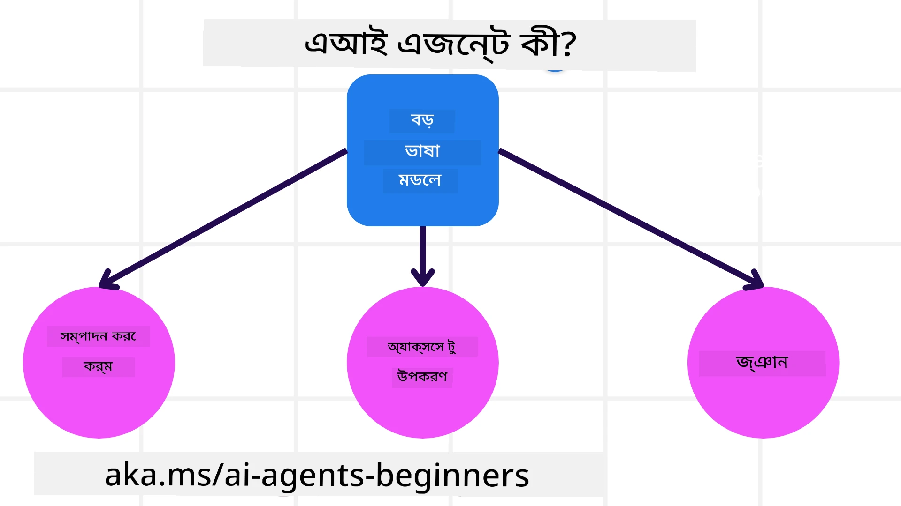
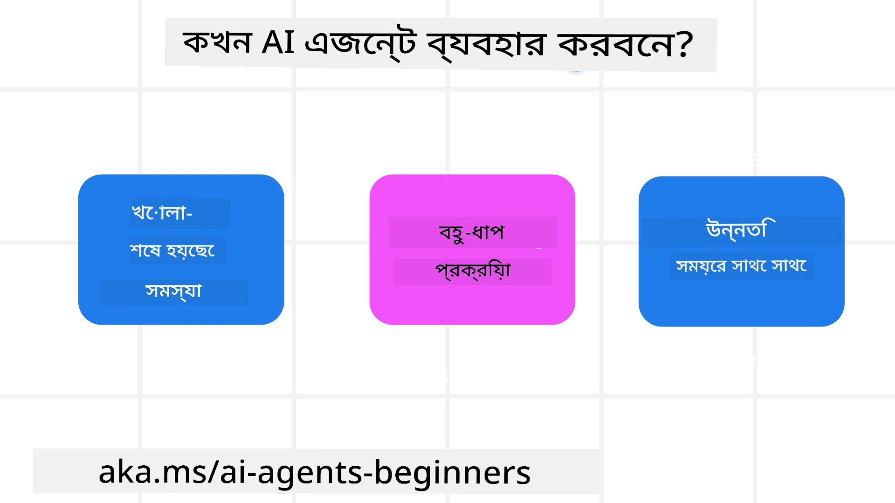

> _(উপরের ছবিতে ক্লিক করে এই পাঠের ভিডিওটি দেখুন)_

# AI এজেন্ট এবং এজেন্ট ব্যবহার কেসের পরিচিতি

"AI Agents for Beginners" কোর্সে আপনাকে স্বাগতম! এই কোর্সটি AI এজেন্ট তৈরির জন্য মৌলিক জ্ঞান এবং প্রয়োগগত নমুনা সরবরাহ করে।

অন্যান্য শিক্ষার্থী এবং AI এজেন্ট নির্মাতাদের সাথে দেখা করতে এবং এই কোর্স সম্পর্কে আপনার যে কোনো প্রশ্ন করতে <a href="https://discord.gg/kzRShWzttr" target="_blank">Azure AI Discord সম্প্রদায়</a>-এ যোগ দিন।

এই কোর্স শুরু করার জন্য, আমরা প্রথমে AI এজেন্টগুলো কী এবং আমরা তাদেরকে আমাদের তৈরি অ্যাপ্লিকেশন ও ওয়ার্কফ্লোতে কীভাবে ব্যবহার করতে পারি তা ভালোভাবে বুঝতে চেষ্টা করব।

## পরিচিতি

এই পাঠে আলোচনা করা হবে:

- AI এজেন্ট কী এবং বিভিন্ন ধরণের এজেন্ট কী কী?
- কোন ব্যবহার কেসগুলোর জন্য AI এজেন্ট সবচেয়ে উপযুক্ত এবং সেগুলো আমাদের কীভাবে সাহায্য করতে পারে?
- এজেন্টিক সমাধান ডিজাইন করার সময় কিছু মৌলিক নির্মাণ ব্লক কী কী?

## শেখার লক্ষ্য
এই পাঠ সমাপ্ত করার পরে, আপনি সক্ষম হবেন:

- AI এজেন্ট ধারণাগুলো বুঝতে এবং এগুলো কীভাবে অন্যান্য AI সমাধান থেকে আলাদা তা বিবেচনা করতে।
- AI এজেন্টগুলোকে সবচেয়ে দক্ষভাবে প্রয়োগ করতে।
- ব্যবহারকারী এবং গ্রাহকদের জন্য উত্পাদনশীলভাবে এজেন্টিক সমাধান ডিজাইন করতে।

## AI এজেন্ট সংজ্ঞা এবং এজেন্টের ধরন

### AI এজেন্ট কী?

AI এজেন্ট হলো এমন একটি সিস্টেম যা **Large Language Models(LLMs)**-কে **টুলস** এবং **জ্ঞান**-এ অ্যাক্সেস প্রদান করে তাদের ক্ষমতা বাড়িয়ে **কর্ম সম্পাদন** করতে সক্ষম করে।

চলুন এই সংজ্ঞাটি ছোট অংশে ভাগ করা যাক:

- **সিস্টেম** - এজেন্টকে কেবল একটি একক উপাদান হিসেবে নয় বরং অনেক উপাদানের একটি সিস্টেম হিসেবে ভাবা গুরুত্বপূর্ণ। মৌলিক স্তরে, একটি AI এজেন্টের উপাদানগুলো হল:
  - **পরিবেশ** - সেই নির্দিষ্ট স্থান যেখানে AI এজেন্ট কাজ করছে। উদাহরণস্বরূপ, যদি আমাদের একটি ট্রাভেল বুকিং AI এজেন্ট থাকে, পরিবেশ হতে পারে সেই ট্রাভেল বুকিং সিস্টেম যা এজেন্ট কাজ সম্পন্ন করার জন্য ব্যবহার করে।
  - **সেন্সরস** - পরিবেশে তথ্য থাকে এবং প্রতিক্রিয়া প্রদান করে। AI এজেন্টগুলো পরিবেশের বর্তমান অবস্থার সম্পর্কে এই তথ্য সংগ্রহ এবং ব্যাখ্যা করার জন্য সেনসর ব্যবহার করে। ট্রাভেল বুকিং এজেন্টের উদাহরণে, বুকিং সিস্টেম হোটেলের খালি থাকা কক্ষ বা ফ্লাইটের দাম ইত্যাদি তথ্য প্রদান করতে পারে।
  - **অ্যাকচুয়েটরস** - একবার AI এজেন্ট পরিবেশের বর্তমান অবস্থা পেলে, চলমান কাজের জন্য এজেন্ট নির্ধারণ করে কি কর্মটি পরিবেশ বদলাতে করা হবে। ট্রাভেল বুকিং এজেন্টের ক্ষেত্রে এটি ব্যবহারকারীর জন্য একটি উপলব্ধ কক্ষ বুক করা হতে পারে।

**Large Language Models** - এজেন্ট ধারণা LLMs তৈরীর আগেই বিদ্যমান ছিল। LLMs দিয়ে AI এজেন্ট নির্মাণের সুবিধা হল মানুষের ভাষা এবং ডেটা ব্যাখ্যা করার ক্ষমতা। এই ক্ষমতা LLMs-কে পরিবেশগত তথ্য ব্যাখ্যা করে পরিবেশ বদলানোর জন্য একটি পরিকল্পনা নির্ধারণে সক্ষম করে।

**কর্ম সম্পাদন** - AI এজেন্ট সিস্টেমের বাইরে, LLMs সীমাবদ্ধ থাকে এমন পরিস্থিতিতে যেখানে কাজটি ব্যবহারকারীর প্রম্পটের ভিত্তিতে কনটেন্ট বা তথ্য তৈরি করা। AI এজেন্ট সিস্টেমের মধ্যে, LLMs ব্যবহারকারীর অনুরোধ ব্যাখ্যা করে এবং তাদের পরিবেশে উপলব্ধ টুলস ব্যবহার করে কাজ সম্পন্ন করতে পারে।

**টুলস-এর অ্যাক্সেস** - LLM কোন টুলসে অ্যাক্সেস পায় তা নির্ধারিত হয় 1) যেই পরিবেশে এটি কাজ করছে এবং 2) AI এজেন্টের ডেভেলপার দ্বারা। আমাদের ট্রাভেল এজেন্ট উদাহরণে, এজেন্টের টুলগুলো বুকিং সিস্টেমে উপলব্ধ অপারেশন দ্বারা সীমাবদ্ধ, এবং/অথবা ডেভেলপার এজেন্টের টুল অ্যাক্সেস ফ্লাইট পর্যন্ত সীমাবদ্ধ করতে পারে।

**মেমরি+জ্ঞান** - কথোপকথনের প্রসঙ্গে মেমরি স্বল্পকালীন হতে পারে। দীর্ঘমেয়াদীভাবে, পরিবেশ দ্বারা সরবরাহকৃত তথ্যের বাইরে, AI এজেন্ট অন্যান্য সিস্টেম, সার্ভিস, টুল এবং এমনকি অন্য এজেন্টদের কাছ থেকেও জ্ঞান আনতে পারে। ট্রাভেল এজেন্ট উদাহরণে, এই জ্ঞানটি গ্রাহকের ভ্রমণ পছন্দ সম্পর্কিত তথ্য হতে পারে যা কাস্টমার ডেটাবেসে সংরক্ষিত আছে।

### এজেন্টের বিভিন্ন ধরন

এখন যেহেতু আমাদের কাছে AI এজেন্টের একটি সাধারণ সংজ্ঞা আছে, চলুন কিছু নির্দিষ্ট এজেন্ট ধরন দেখি এবং সেগুলো ট্রাভেল বুকিং AI এজেন্টে কীভাবে প্রয়োগ করা হবে তা বিবেচনা করি।

| **এজেন্ট ধরণ**               | **বর্ণনা**                                                                                                                            | **উদাহরণ**                                                                                                                                                                                                                  |
| ----------------------------- | ------------------------------------------------------------------------------------------------------------------------------------- | ----------------------------------------------------------------------------------------------------------------------------------------------------------------------------------------------------------------------------- |
| **Simple Reflex Agents**      | পূর্বনির্ধারিত নিয়মের ভিত্তিতে তাৎক্ষণিক কাজ সম্পাদন করে।                                                                                 | ট্রাভেল এজেন্ট ইমেইলের প্রসঙ্গ ব্যাখ্যা করে এবং ভ্রমণসংক্রান্ত অভিযোগগুলো কাস্টমার সার্ভিসে ফরোয়ার্ড করে।                                                                                                                     |
| **Model-Based Reflex Agents** | পৃথিবীর একটি মডেল এবং সেই মডেলে পরিবর্তনের উপর ভিত্তি করে কাজ করে।                                                                          | ট্রাভেল এজেন্ট ঐতিহাসিক মূল্য তথ্যের অ্যাক্সেস থাকায় উল্লেখযোগ্য মূল্য পরিবর্তন সহ রুটগুলিকে অগ্রাধিকার দেয়।                                                                                                                 |
| **Goal-Based Agents**         | একটি নির্দিষ্ট লক্ষ্য অর্জনের জন্য পরিকল্পনা তৈরি করে, লক্ষ্য ব্যাখ্যা করে এবং পৌঁছানোর জন্য কর্ম নির্ধারণ করে।                                  | ট্রাভেল এজেন্ট যাত্রা বুক করে প্রয়োজনীয় ভ্রমণ বন্দোবস্ত (কার, পাবলিক ট্রান্সিট, ফ্লাইট) নির্ধারণ করে বর্তমান অবস্থান থেকে গন্তব্য পর্যন্ত।                                                                                                  |
| **Utility-Based Agents**      | পছন্দগুলো বিবেচনা করে এবং লক্ষ্য অর্জনের জন্য সংখ্যাত্মকভাবে ব্যবস্হা বিবেচনা করে সিদ্ধান্ত নেয়।                                            | ট্রাভেল এজেন্ট ভ্রমণ বুক করার সময় সুবিধা বনাম খরচের মধ্যে ভারসাম্য রেখে ইউটিলিটি সর্বাধিক করে।                                                                                                                               |
| **Learning Agents**           | প্রতিক্রিয়ার প্রতি সাড়া দিয়ে এবং অনুযায়ী কাজ সমন্বয় করে সময়ের সঙ্গে উন্নতি করে।                                                            | ট্রাভেল এজেন্ট ভ্রমণের পর জরিপ থেকে গ্রাহক প্রতিক্রিয়া ব্যবহার করে ভবিষ্যৎ বুকিংয়ে সমন্বয় করে উন্নতি করে।                                                                                                                    |
| **Hierarchical Agents**       | একটি স্তরভিত্তিক সিস্টেমে একাধিক এজেন্ট থাকে, যেখানে উচ্চ-স্তরের এজেন্ট কাজকে ছোট উপকার্যে ভাগ করে নিচু-স্তরের এজেন্টদের সম্পন্ন করায়।            | ট্রাভেল এজেন্ট একটি ট্রিপ বাতিল করে কাজটিকে উপকাজে ভাগ করে (উদাহরণস্বরূপ, নির্দিষ্ট বুকিং বাতিল করা) এবং নিচু-স্তরের এজেন্টগুলো সেগুলো সম্পন্ন করে, তারপর উচ্চ-স্তরের এজেন্টকে রিপোর্ট করে।                                              |
| **Multi-Agent Systems (MAS)** | এজেন্টগুলো স্বাধীনভাবে কাজ সম্পন্ন করে, সহযোগিতামূলক বা প্রতিযোগিতামূলকভাবে।                                                               | সহযোগিতামূলক: একাধিক এজেন্ট নির্দিষ্ট ভ্রমণ সেবা যেমন হোটেল, ফ্লাইট, এবং বিনোদন বুক করে। প্রতিযোগিতামূলক: একাধিক এজেন্ট একটি ভাগ করা হোটেল বুকিং ক্যালেন্ডার পরিচালনা করে এবং গ্রাহকদের হোটেলে বুকিং দিতে প্রতিযোগিতা করে। |

## কখন AI এজেন্ট ব্যবহার করবেন

আগের অংশে, আমরা ট্রাভেল এজেন্ট ব্যবহার-কেস ব্যবহার করে দেখিয়েছি কিভাবে বিভিন্ন ধরণের এজেন্ট ভ্রমণ বুকিংয়ের বিভিন্ন পরিস্থিতিতে প্রয়োগ করা যায়। আমরা এই অ্যাপ্লিকেশনটি কোর্স জুড়েই ব্যবহার চালিয়ে যাব।

চলুন এমন ব্যবহার কেসগুলোর ধরন দেখি যেগুলোতে AI এজেন্ট সবচেয়ে উপযুক্ত:

- **খোলা-সমাপ্ত সমস্যা (Open-Ended Problems)** - LLM-কে কাজ সম্পন্ন করার জন্য প্রয়োজনীয় ধাপগুলো নির্ধারণ করতে দেওয়া, কারণ সবসময় ওয়ার্কফ্লোতে হার্ডকোড করা যায় না।
- **বহু-ধাপ প্রক্রিয়া (Multi-Step Processes)** - এমন কাজগুলো যেগুলোতে এমন একটি স্তরের জটিলতা প্রয়োজন যেখানে AI এজেন্টকে একক-শট রিট্রিভালের পরিবর্তে একাধিক টার্নে টুলস বা তথ্য ব্যবহার করতে হয়।  
- **সময়ের সাথে উন্নতি (Improvement Over Time)** - এমন কাজগুলো যেখানে এজেন্ট পরিবেশ বা ব্যবহারকারীদের থেকে প্রতিক্রিয়া পেয়ে সময়ের সঙ্গে উন্নতি করতে পারে যাতে আরও ভাল সুবিধা প্রদান করা যায়।

AI এজেন্ট ব্যবহার করার আরও বিবেচনা আমরা "Building Trustworthy AI Agents" পাঠে আলোচনা করব।

## এজেন্টিক সমাধানের মৌলিক বিষয়

### এজেন্ট ডেভেলপমেন্ট

AI এজেন্ট সিস্টেম ডিজাইন করার প্রথম ধাপ হলো টুলস, অ্যাকশন, এবং আচরণ নির্ধারণ করা। এই কোর্সে, আমরা আমাদের এজেন্ট নির্ধারণ করার জন্য **Azure AI Agent Service** ব্যবহার করার উপর ফোকাস করব। এটি নিচের বৈশিষ্ট্যগুলো প্রদান করে:

- OpenAI, Mistral, এবং Llama-এর মতো ওপেন মডেলগুলোর নির্বাচন
- Tripadvisor-এর মতো প্রদানকারীদের মাধ্যমে লাইসেন্সকৃত ডেটার ব্যবহার
- স্ট্যান্ডার্ডাইজড OpenAPI 3.0 টুলসের ব্যবহার

### এজেন্টিক প্যাটার্নস

LLMs-এর সাথে যোগাযোগ প্রম্পটের মাধ্যমে হয়। এজেন্টদের অর্ধ-স্বয়ংক্রিয় প্রকৃতি বিবেচনায়, পরিবেশে পরিবর্তন ঘটলে LLM-কে ম্যানুয়ালি পুনরায় প্রম্পট করা সবসময় সম্ভব বা প্রয়োজনীয় নয়। আমরা এমন কিছু **এজেন্টিক প্যাটার্নস** ব্যবহার করি যা আমাদেরকে অনেক ধাপে LLM-কে আরও স্কেলেবলভাবে প্রম্পট করতে দেয়।

এই কোর্সটি বর্তমান জনপ্রিয় কিছু এজেন্টিক প্যাটার্নস-এ বিভক্ত করা হয়েছে।

### এজেন্টিক ফ্রেমওয়ার্কস

এজেন্টিক ফ্রেমওয়ার্কস ডেভেলপারদের কোডের মাধ্যমে এজেন্টিক প্যাটার্নস বাস্তবায়ন করার অনুমতি দেয়। এই ফ্রেমওয়ার্কগুলো টেমপ্লেট, প্লাগইন, এবং এজেন্ট সহযোগিতার জন্য উন্নত টুলস প্রদান করে। এই সুবিধাগুলো AI এজেন্ট সিস্টেমের জন্য উন্নত পর্যবেক্ষণযোগ্যতা এবং সমস্যাসমাধানের ক্ষমতা প্রদান করে।

এই কোর্সে, আমরা প্রোডাকশন-রেডি AI এজেন্ট তৈরির জন্য Microsoft Agent Framework (MAF) পরীক্ষা করব।

## স্যাম্পল কোড

- Python: [Agent Framework](./code_samples/01-python-agent-framework.ipynb)
- .NET: [Agent Framework](./code_samples/01-dotnet-agent-framework.md)

## AI এজেন্ট সম্পর্কে আরও প্রশ্ন আছে?

অন্যান্য শিক্ষার্থীদের সাথে দেখা করতে, অফিস আওয়ারসে অংশগ্রহণ করতে এবং আপনার AI এজেন্ট সম্পর্কিত প্রশ্নগুলোর উত্তর পেতে [Microsoft Foundry Discord](https://aka.ms/ai-agents/discord)-এ যোগ দিন।

## পূর্ববর্তী পাঠ

[Course Setup](../00-course-setup/README.md)

## পরবর্তী পাঠ

[Exploring Agentic Frameworks](../02-explore-agentic-frameworks/README.md)

---

<!-- CO-OP TRANSLATOR DISCLAIMER START -->
দায়-অস্বীকৃতি:
এই নথিটি AI অনুবাদ সেবা [Co-op Translator](https://github.com/Azure/co-op-translator) ব্যবহার করে অনূদিত হয়েছে। যদিও আমরা যথাসাধ্য সঠিকতার চেষ্টা করি, অনুগ্রহ করে জানুন যে স্বয়ংক্রিয় অনুবাদে ত্রুটি বা অসঠিকতা থাকতে পারে। মূল ভাষায় থাকা নথিটিকেই কর্তৃত্বপূর্ণ উৎস হিসেবে বিবেচনা করা উচিত। গুরুত্বপূর্ণ তথ্যের জন্য পেশাদার মানব অনুবাদ গ্রহণ করার পরামর্শ দেওয়া হয়। এই অনুবাদের ব্যবহারে সৃষ্ট কোনো ভুলবুঝি বা ভুল ব্যাখ্যার জন্য আমরা দায়ী নই।
<!-- CO-OP TRANSLATOR DISCLAIMER END -->