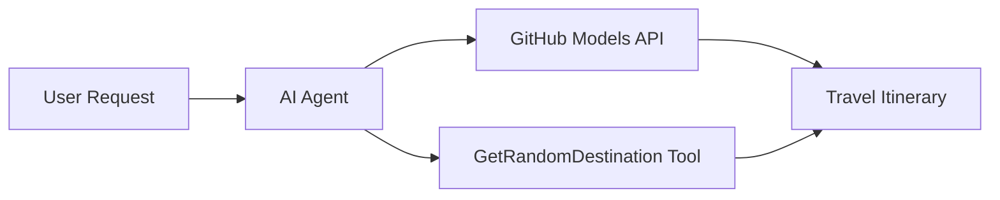

# 🌍 Microsoft Agent Framework (.NET) দিয়ে AI ট্রাভেল এজেন্ট

## 📋 পরিস্থিতির সংক্ষিপ্ত বিবরণ

এই নোটবুকটি Microsoft Agent Framework for .NET ব্যবহার করে একটি বুদ্ধিমান ভ্রমণ পরিকল্পনা এজেন্ট তৈরি করার পদ্ধতি প্রদর্শন করে। এজেন্টটি স্বয়ংক্রিয়ভাবে বিশ্বের বিভিন্ন গন্তব্যের জন্য ব্যক্তিগতকৃত দিন-ভ্রমণের পরিকল্পনা তৈরি করতে পারে।

**মূল বৈশিষ্ট্যসমূহ:**
- 🎲 **র্যান্ডম গন্তব্য নির্বাচন**: ছুটির স্থান বাছাই করার জন্য একটি কাস্টম টুল ব্যবহার করে
- 🗺️ **বুদ্ধিমান ভ্রমণ পরিকল্পনা**: বিস্তারিত দিন-দিনের পরিকল্পনা তৈরি করে
- 🔄 **রিয়েল-টাইম স্ট্রিমিং**: তাৎক্ষণিক এবং স্ট্রিমিং প্রতিক্রিয়া সমর্থন করে
- 🛠️ **কাস্টম টুল ইন্টিগ্রেশন**: এজেন্টের ক্ষমতা বাড়ানোর পদ্ধতি প্রদর্শন করে

## 🔧 প্রযুক্তিগত স্থাপত্য

### মূল প্রযুক্তি
- **Microsoft Agent Framework**: AI এজেন্ট ডেভেলপমেন্টের জন্য .NET-এর সর্বশেষ সংস্করণ
- **GitHub Models Integration**: GitHub-এর AI মডেল ইনফারেন্স সার্ভিস ব্যবহার করে
- **OpenAI API Compatibility**: কাস্টম এন্ডপয়েন্ট সহ OpenAI ক্লায়েন্ট লাইব্রেরি ব্যবহার করে
- **নিরাপদ কনফিগারেশন**: পরিবেশ-ভিত্তিক API কী ব্যবস্থাপনা

### প্রধান উপাদান
1. **AIAgent**: প্রধান এজেন্ট অর্কেস্ট্রেটর যা কথোপকথনের প্রবাহ পরিচালনা করে
2. **কাস্টম টুলস**: এজেন্টের জন্য উপলব্ধ `GetRandomDestination()` ফাংশন
3. **চ্যাট ক্লায়েন্ট**: GitHub Models-সমর্থিত কথোপকথন ইন্টারফেস
4. **স্ট্রিমিং সাপোর্ট**: রিয়েল-টাইম প্রতিক্রিয়া তৈরির ক্ষমতা

### ইন্টিগ্রেশন প্যাটার্ন


## 🚀 শুরু করার পদ্ধতি

**প্রয়োজনীয়তা:**
- .NET 9.0 বা তার বেশি
- GitHub Models API অ্যাক্সেস টোকেন
- `.env` ফাইলে কনফিগার করা পরিবেশ ভেরিয়েবল

**প্রয়োজনীয় পরিবেশ ভেরিয়েবল:**
```env
GITHUB_TOKEN=your_github_token
GITHUB_ENDPOINT=https://models.inference.ai.azure.com
GITHUB_MODEL_ID=gpt-4o-mini
```

নীচের সেলগুলো ধারাবাহিকভাবে চালান এবং ট্রাভেল এজেন্টের কার্যক্রম দেখুন!

---

## .NET Single File App: AI Travel Agent Example

See `01-dotnet-agent-framework.cs` for the complete runnable code sample.

নিচের কোড নমুনা চালান:

```bash
dotnet run 01-dotnet-agent-framework.cs
```

### Sample Code

```csharp
static string GetRandomDestination()
{
    var destinations = new List<string>
    {
        "Paris, France",
        "Tokyo, Japan",
        "New York City, USA",
        "Sydney, Australia",
        "Rome, Italy",
        "Barcelona, Spain",
        "Cape Town, South Africa",
        "Rio de Janeiro, Brazil",
        "Bangkok, Thailand",
        "Vancouver, Canada"
    };
    var random = new Random();
    int index = random.Next(destinations.Count);
    return destinations[index];
}

// Extract configuration from environment variables
var github_endpoint = Environment.GetEnvironmentVariable("GITHUB_ENDPOINT") ?? throw new InvalidOperationException("GITHUB_ENDPOINT is not set.");
var github_model_id = Environment.GetEnvironmentVariable("GITHUB_MODEL_ID") ?? "gpt-4o-mini";
var github_token = Environment.GetEnvironmentVariable("GITHUB_TOKEN") ?? throw new InvalidOperationException("GITHUB_TOKEN is not set.");

// Configure OpenAI Client Options
var openAIOptions = new OpenAIClientOptions()
{
    Endpoint = new Uri(github_endpoint)
};

// Initialize OpenAI Client with GitHub Models Configuration
var openAIClient = new OpenAIClient(new ApiKeyCredential(github_token), openAIOptions);

// Create AI Agent with Travel Planning Capabilities
AIAgent agent = openAIClient
    .GetChatClient(github_model_id)
    .CreateAIAgent(
        instructions: "You are a helpful AI Agent that can help plan vacations for customers at random destinations",
        tools: [AIFunctionFactory.Create(GetRandomDestination)]
    );

// Execute Agent: Plan a Day Trip (Non-Streaming)
Console.WriteLine(await agent.RunAsync("Plan me a day trip"));

// Execute Agent: Plan a Day Trip (Streaming Response)
await foreach (var update in agent.RunStreamingAsync("Plan me a day trip"))
{
    Console.Write(update);
}
```
