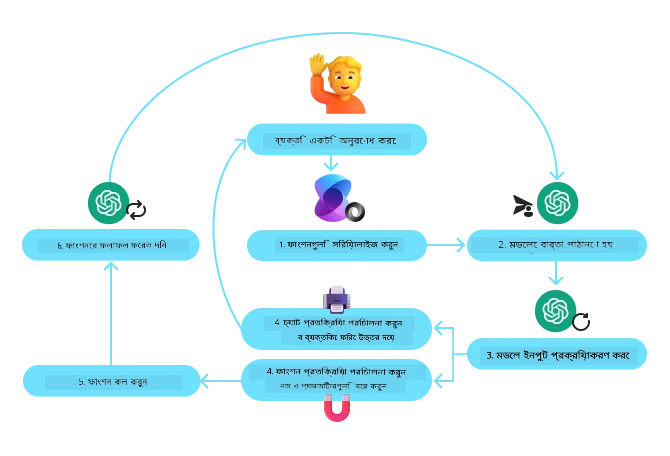
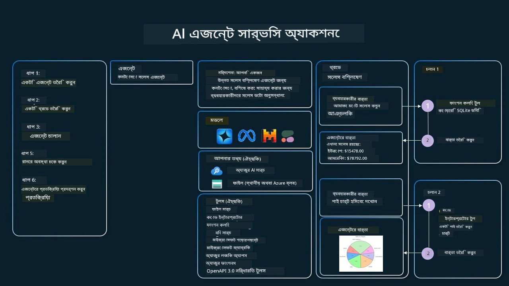

[](https://youtu.be/vieRiPRx-gI?si=cEZ8ApnT6Sus9rhn)

> _(ভিডিওটি দেখতে উপরের ছবিটিতে ক্লিক করুন)_

# টুল ব্যবহারের ডিজাইন প্যাটার্ন

টুলগুলো আকর্ষণীয় কারণ এগুলো AI এজেন্টদের জটিল ক্ষমতার একটি বিস্তৃত পরিসর প্রদান করে। এজেন্টের সীমিত ক্রিয়াকলাপের পরিবর্তে, একটি টুল যোগ করার মাধ্যমে এজেন্ট এখন বিস্তৃত ধরনের কাজ করতে পারে। এই অধ্যায়ে, আমরা টুল ব্যবহারের ডিজাইন প্যাটার্ন দেখব, যা বর্ণনা করে কিভাবে AI এজেন্টরা নির্দিষ্ট টুল ব্যবহার করে তাদের লক্ষ্য অর্জন করতে পারে।

## পরিচিতি

এই পাঠে, আমরা নিম্নলিখিত প্রশ্নগুলোর উত্তর খুঁজব:

- টুল ব্যবহারের ডিজাইন প্যাটার্ন কী?
- কোন কোন ক্ষেত্রে এটি প্রয়োগ করা যায়?
- ডিজাইন প্যাটার্ন বাস্তবায়নের জন্য কী কী উপাদান/বিল্ডিং ব্লক প্রয়োজন?
- বিশ্বাসযোগ্য AI এজেন্ট তৈরিতে টুল ব্যবহারের ডিজাইন প্যাটার্ন ব্যবহারের সময় বিশেষ কোন বিষয়গুলো বিবেচনা করতে হয়?

## শেখার লক্ষ্য

এই পাঠ শেষ করার পর, আপনি সক্ষম হবেন:

- টুল ব্যবহারের ডিজাইন প্যাটার্ন এবং এর উদ্দেশ্য সংজ্ঞায়িত করতে।
- টুল ব্যবহারের ডিজাইন প্যাটার্ন প্রযোজ্য এমন ব্যবহারের ক্ষেত্রগুলো চিহ্নিত করতে।
- ডিজাইন প্যাটার্ন বাস্তবায়নের জন্য প্রয়োজনীয় মূল উপাদানগুলো বুঝতে।
- এই ডিজাইন প্যাটার্ন ব্যবহার করে AI এজেন্টদের বিশ্বাসযোগ্যতা নিশ্চিত করার জন্য বিবেচ্য বিষয়গুলো চিনতে।

## টুল ব্যবহারের ডিজাইন প্যাটার্ন কী?

**টুল ব্যবহারের ডিজাইন প্যাটার্ন** LLM-কে বাহ্যিক টুলগুলোর সাথে মিথষ্ক্রিয়া করার ক্ষমতা দেয় যাতে নির্দিষ্ট লক্ষ্য অর্জিত হয়। টুল হচ্ছে কোড যা একটি এজেন্ট দ্বারা কার্যকর করা যায় কাজ সম্পাদনের জন্য। একটি টুল হতে পারে একটি সাধারণ ফাংশন যেমন ক্যালকুলেটর, অথবা তৃতীয় পক্ষের সার্ভিস যেমন স্টক প্রাইস লুকআপ বা আবহাওয়ার পূর্বাভাস এর API কল। AI এজেন্টদের প্রসঙ্গে, টুলগুলো ডিজাইন করা হয় যাতে এজেন্টরা **মডেল-জেনারেটেড ফাংশন কল** এর জবাবে এগুলো কার্যকর করতে পারে।

## কোন কোন ক্ষেত্রে এটি প্রয়োগ করা যায়?

AI এজেন্টরা টুল ব্যবহার করে জটিল কাজ সম্পন্ন করতে, তথ্য উদ্ধার করতে বা সিদ্ধান্ত নিতে পারে। টুল ব্যবহারের ডিজাইন প্যাটার্ন প্রায়ই বাহ্যিক সিস্টেমের সাথে গতিশীল মিথষ্ক্রিয়ার প্রয়োজনীয়তা থাকা দৃশ্যপটে ব্যবহৃত হয়, যেমন ডেটাবেস, ওয়েব সার্ভিস বা কোড ইন্টারপ্রেটার। এটি বিভিন্ন ব্যবহারের ক্ষেত্রের জন্য উপকারী যেমন:

- **গতিশীল তথ্য উদ্ধারে:** এজেন্টরা বাহ্যিক API বা ডেটাবেস থেকে হালনাগাদ ডেটা আহরণ করতে পারে (যেমন, ডেটা বিশ্লেষণের জন্য SQLite ডেটাবেসে অনুসন্ধান, স্টক প্রাইস বা আবহাওয়ার তথ্য আনা)।
- **কোড কার্যকর এবং ব্যাখ্যা:** এজেন্টরা গণিতের সমস্যা সমাধান, রিপোর্ট তৈরি বা সিমুলেশন করার জন্য কোড বা স্ক্রিপ্ট চালাতে পারে।
- **ওয়ার্কফ্লো স্বয়ংক্রিয়করণ:** টাস্ক শিডিউলার, ইমেইল সার্ভিস অথবা ডেটা পাইপলাইন ইন্টিগ্রেশন করে পুনরাবৃত্তিমূলক বা বহু-ধাপের কাজ স্বয়ংক্রিয় করা।
- **কাস্টমার সাপোর্ট:** এজেন্টরা CRM সিস্টেম, টিকিটিং প্ল্যাটফর্ম বা জ্ঞানের বেসের সাথে মিথষ্ক্রিয়া করে ব্যবহারকারীর প্রশ্ন সমাধান করতে পারে।
- **কন্টেন্ট তৈরী ও সম্পাদনা:** ব্যাকরণ পরীক্ষা, টেক্সট সারাংশ বা কন্টেন্ট নিরাপত্তা মূল্যায়নের মতো টুল ব্যবহার করে কন্টেন্ট তৈরীতে সাহায্য করা।

## টুল ব্যবহারের ডিজাইন প্যাটার্ন বাস্তবায়নের জন্য কী কী উপাদান/বিল্ডিং ব্লক প্রয়োজন?

এই বিল্ডিং ব্লকগুলো AI এজেন্টকে বিস্তৃত কাজ সম্পাদন করতে সহায়তা করে। আসুন টুল ব্যবহারের ডিজাইন প্যাটার্ন বাস্তবায়নের জন্য মূল উপাদানগুলো দেখি:

- **ফাংশন/টুল স্কিমা:** উপলব্ধ টুলের বিশদ সংজ্ঞা, যেমন ফাংশনের নাম, উদ্দেশ্য, প্রয়োজনীয় প্যারামিটার এবং প্রত্যাশিত আউটপুট। এই স্কিমাগুলো LLM কে উপলব্ধ টুল কী কী এবং সঠিক অনুরোধ কিভাবে তৈরি করতে হয় বুঝতে সাহায্য করে।

- **ফাংশন কার্যকরকরণ লজিক:** ব্যবহারকারীর উদ্দেশ্য ও কথোপকথনের প্রেক্ষাপট অনুসারে কখন এবং কীভাবে টুলগুলো আহ্বান করা হবে তা নিয়ন্ত্রণ করে। এতে প্ল্যানার মডিউল, রাউটিং মেকানিজম বা শর্তাধীন প্রবাহ থাকতে পারে যা টুল ব্যবহারের সিদ্ধান্ত নেয়।

- **মেসেজ হ্যান্ডলিং সিস্টেম:** ব্যবহারকারীর ইনপুট, LLM এর উত্তর, টুল কল এবং টুল আউটপুটের মধ্যে কথোপকথনের প্রবাহ পরিচালনা করে।

- **টুল ইন্টিগ্রেশন ফ্রেমওয়ার্ক:** এজেন্টকে বিভিন্ন টুলের সাথে সংযুক্ত করে, যেগুলো হতে পারে সরল ফাংশন অথবা জটিল বাহ্যিক সার্ভিস।

- **ত্রুটি হ্যান্ডলিং ও যাচাই:** টুল কার্যকরকরণে ত্রুটি সামলানো, প্যারামিটার যাচাই এবং আশ্চর্যজনক উত্তর পরিচালনার পদ্ধতি।

- **স্টেট ম্যানেজমেন্ট:** কথোপকথনের প্রেক্ষাপট, পূর্বের টুল মিথষ্ক্রিয়া এবং ধ্রুবক ডেটা ট্র্যাক করে বহুবার কথোপকথনে সামঞ্জস্য নিশ্চিত করে।

পরবর্তী অংশে আসুন ফাংশন/টুল কলিং এর বিস্তারিত দেখব।

### ফাংশন/টুল কলিং

ফাংশন কলিং হল প্রধান উপায় যার মাধ্যমে আমরা বৃহৎ ভাষা মডেলগুলোকে (LLM) টুলের সাথে মিথষ্ক্রিয়া করতে সক্ষম করি। প্রায়ই 'ফাংশন' এবং 'টুল' শব্দ দুটি পরস্পর পরিবর্তনীয়ভাবে ব্যবহৃত হয় কারণ 'ফাংশন' (পুনর্ব্যবহারযোগ্য কোড ব্লক) হলো কাজ সম্পাদনের জন্য এজেন্টরা যেসব 'টুল' ব্যবহার করে। একটি ফাংশনের কোড আহ্বান করার জন্য, LLM কে অংশগ্রহণকারীর অনুরোধ ফাংশনের বর্ণনার সাথে তুলনা করতে হয়। এজন্য সমস্ত উপলব্ধ ফাংশনের বর্ণনার একটি স্কিমা LLM-কে পাঠানো হয়। তারপর LLM কাজের জন্য সবচেয়ে উপযুক্ত ফাংশন নির্বাচন করে তার নাম এবং আর্গুমেন্ট ফেরত দেয়। নির্বাচিত ফাংশন আহ্বান করা হয়, এর জবাব LLM-এ পাঠানো হয়, যা ব্যবহারকারীর অনুরোধের উত্তর তৈরি করতে ব্যবহার করা হয়।

ডেভেলপারদের জন্য ফাংশন কলিং বাস্তবায়নের জন্য প্রয়োজন:

1. এমন একটি LLM মডেল যা ফাংশন কলিং সমর্থন করে
2. ফাংশনের বর্ণনা সহ একটি স্কিমা
3. বর্ণিত প্রতিটি ফাংশনের কোড

আমরা একটি উদাহরণ ব্যবহার করব — একটি শহরের বর্তমান সময় পাওয়া:

1. **ফাংশন কলিং সমর্থনকারী একটি LLM ইনিশিয়ালাইজ করুন:**

    সব মডেল ফাংশন কলিং সমর্থন করে না, তাই ব্যবহৃত LLM এর এটি সমর্থন করা জরুরি। <a href="https://learn.microsoft.com/azure/ai-services/openai/how-to/function-calling" target="_blank">Azure OpenAI</a> ফাংশন কলিং সমর্থন করে। আমরা Azure OpenAI ক্লায়েন্ট শুরু করব।

    ```python
    # Azure OpenAI ক্লায়েন্ট আরম্ভ করুন
    client = AzureOpenAI(
        azure_endpoint = os.getenv("AZURE_AI_PROJECT_ENDPOINT"), 
        api_key=os.getenv("AZURE_OPENAI_API_KEY"),  
        api_version="2024-05-01-preview"
    )
    ```

1. **একটি ফাংশন স্কিমা তৈরি করুন:**

    পরবর্তীতে আমরা একটি JSON স্কিমা সংজ্ঞায়িত করব যাতে ফাংশনের নাম, কাজের বর্ণনা, প্যারামিটার নাম ও বর্ণনা থাকবে। তারপর এই স্কিমা এবং ব্যবহারকারীর সান ফ্রানসিসকো সময় জানতে চাওয়া অনুরোধ ক্লায়েন্টকে পাঠানো হবে। এখানে গুরুত্বপূর্ণ যে **টুল কল** ফেরত আসে, **প্রশ্নের চূড়ান্ত উত্তর নয়**। আগে যেমন বলেছিলাম, LLM কাজের জন্য নির্বাচিত ফাংশনের নাম এবং আর্গুমেন্ট ফেরত দেয়।

    ```python
    # মডেলের পঠনযোগ্য ফাংশন বর্ণনা
    tools = [
        {
            "type": "function",
            "function": {
                "name": "get_current_time",
                "description": "Get the current time in a given location",
                "parameters": {
                    "type": "object",
                    "properties": {
                        "location": {
                            "type": "string",
                            "description": "The city name, e.g. San Francisco",
                        },
                    },
                    "required": ["location"],
                },
            }
        }
    ]
    ```
   
    ```python
  
    # প্রাথমিক ব্যবহারকারীর বার্তা
    messages = [{"role": "user", "content": "What's the current time in San Francisco"}] 
  
    # প্রথম এপিআই কল: মডেলকে ফাংশন ব্যবহার করতে বলুন
      response = client.chat.completions.create(
          model=deployment_name,
          messages=messages,
          tools=tools,
          tool_choice="auto",
      )
  
      # মডেলের প্রতিক্রিয়া প্রক্রিয়াকরণ করুন
      response_message = response.choices[0].message
      messages.append(response_message)
  
      print("Model's response:")  

      print(response_message)
  
    ```

    ```bash
    Model's response:
    ChatCompletionMessage(content=None, role='assistant', function_call=None, tool_calls=[ChatCompletionMessageToolCall(id='call_pOsKdUlqvdyttYB67MOj434b', function=Function(arguments='{"location":"San Francisco"}', name='get_current_time'), type='function')])
    ```
  
1. **কাজ সম্পাদনের জন্য ফাংশনের কোড:**

    এখন LLM ফাংশন নির্বাচন করলে, কাজ সম্পাদনের কোড বাস্তবায়ন ও চালানো প্রয়োজন।
    আমরা পাইথনে বর্তমান সময় পাওয়ার কোড লিখব। পাশাপাশি জবাব থেকে নাম ও আর্গুমেন্ট বের করার কোডও লিখতে হবে।

    ```python
      def get_current_time(location):
        """Get the current time for a given location"""
        print(f"get_current_time called with location: {location}")  
        location_lower = location.lower()
        
        for key, timezone in TIMEZONE_DATA.items():
            if key in location_lower:
                print(f"Timezone found for {key}")  
                current_time = datetime.now(ZoneInfo(timezone)).strftime("%I:%M %p")
                return json.dumps({
                    "location": location,
                    "current_time": current_time
                })
      
        print(f"No timezone data found for {location_lower}")  
        return json.dumps({"location": location, "current_time": "unknown"})
    ```

     ```python
     # ফাংশন কলগুলি পরিচালনা করুন
      if response_message.tool_calls:
          for tool_call in response_message.tool_calls:
              if tool_call.function.name == "get_current_time":
     
                  function_args = json.loads(tool_call.function.arguments)
     
                  time_response = get_current_time(
                      location=function_args.get("location")
                  )
     
                  messages.append({
                      "tool_call_id": tool_call.id,
                      "role": "tool",
                      "name": "get_current_time",
                      "content": time_response,
                  })
      else:
          print("No tool calls were made by the model.")  
  
      # দ্বিতীয় API কল: মডেল থেকে চূড়ান্ত প্রতিক্রিয়া পান
      final_response = client.chat.completions.create(
          model=deployment_name,
          messages=messages,
      )
  
      return final_response.choices[0].message.content
     ```

     ```bash
      get_current_time called with location: San Francisco
      Timezone found for san francisco
      The current time in San Francisco is 09:24 AM.
     ```

ফাংশন কলিং অধিকাংশ এজেন্ট টুল ব্যবহারের ডিজাইন প্যাটার্নের কেন্দ্রবিন্দু, তবে খালি থেকে এটি বাস্তবায়ন মাঝে মাঝে চ্যালেঞ্জিং হতে পারে।
আমরা [Lesson 2](../../../02-explore-agentic-frameworks) এ শিখেছি, এজেন্টিক ফ্রেমওয়ার্ক পূর্বনির্মিত বিল্ডিং ব্লক সরবরাহ করে টুল ব্যবহার বাস্তবায়নে।

## এজেন্টিক ফ্রেমওয়ার্ক দিয়ে টুল ব্যবহার উদাহরণ

নিচে বিভিন্ন এজেন্টিক ফ্রেমওয়ার্ক ব্যবহার করে টুল ব্যবহারের ডিজাইন প্যাটার্ন কিভাবে বাস্তবায়িত হয় তার কয়েকটি উদাহরণ:

### Microsoft Agent Framework

<a href="https://learn.microsoft.com/azure/ai-services/agents/overview" target="_blank">Microsoft Agent Framework</a> হল একটি ওপেন-সোর্স AI ফ্রেমওয়ার্ক AI এজেন্ট নির্মাণের জন্য। এটি ফাংশন কলিং সহজ করে তোলে কারণ আপনি টুলগুলোকে Python ফাংশন হিসেবে `@tool` ডেকোরেটর দিয়ে সংজ্ঞায়িত করতে পারেন। ফ্রেমওয়ার্ক মডেল ও আপনার কোডের মধ্যে বার্তা আদানপ্রদান স্বয়ংক্রিয়ভাবে পরিচালনা করে। এটি প্রাক-নির্মিত ফাইল অনুসন্ধান ও কোড ইন্টারপ্রেটারের মতো টুল ব্যবহারের অ্যাক্সেস দেয় `AzureAIProjectAgentProvider` এর মাধ্যমে।

নিম্নলিখিত চিত্রটি Microsoft Agent Framework-এ ফাংশন কলিং প্রক্রিয়া দেখায়:



Microsoft Agent Framework-এ, টুলগুলো ডেকোরেটেড ফাংশন হিসেবে সংজ্ঞায়িত হয়। আমরা পূর্বে দেখা `get_current_time` ফাংশনটিকে `@tool` ডেকোরেটর ব্যবহার করে একটি টুলে রূপান্তর করতে পারি। ফ্রেমওয়ার্ক ফাংশন ও এর প্যারামিটারগুলো স্বয়ংক্রিয়ভাবে সিরিয়ালাইজ করে, LLM-কে পাঠানোর জন্য স্কিমা তৈরি করে।

```python
from agent_framework import tool
from agent_framework.azure import AzureAIProjectAgentProvider
from azure.identity import AzureCliCredential

@tool
def get_current_time(location: str) -> str:
    """Get the current time for a given location"""
    ...

# ক্লায়েন্ট তৈরি করুন
provider = AzureAIProjectAgentProvider(credential=AzureCliCredential())

# একটি এজেন্ট তৈরি করুন এবং সরঞ্জামের সাথে চালান
agent = await provider.create_agent(name="TimeAgent", instructions="Use available tools to answer questions.", tools=get_current_time)
response = await agent.run("What time is it?")
```
  
### Azure AI Agent Service

<a href="https://learn.microsoft.com/azure/ai-services/agents/overview" target="_blank">Azure AI Agent Service</a> একটি নতুন এজেন্টিক ফ্রেমওয়ার্ক যা ডেভেলপারদের নিরাপদে উচ্চমানের, সম্প্রসারণযোগ্য AI এজেন্ট নির্মাণ, মোতায়েন এবং স্কেল করার ক্ষমতা দেয়, যেখানে কম্পিউট ও স্টোরেজ রিসোর্স ম্যানেজ করতে হয় না। এটি এন্টারপ্রাইজ অ্যাপ্লিকেশনগুলোর জন্য বিশেষভাবে উপযোগী কারণ এটি একটি সম্পূর্ণ ম্যানেজড সার্ভিস যা এন্টারপ্রাইজ গ্রেড সিকিউরিটি প্রদান করে।

LLM API সরাসরি ব্যবহার করার তুলনায়, Azure AI Agent Service এর কিছু সুবিধা:

- স্বয়ংক্রিয় টুল কলিং – টুল কল পার্স করা, টুল আহ্বান করা এবং জবাব পরিচালনা করার দরকার নেই; এই সব কিছুই এখন সার্ভার সাইডে ঘটে
- নিরাপদভাবে ম্যানেজড ডেটা – নিজের কথোপকথন স্টেট ম্যানেজ করার পরিবর্তে, থ্রেডগুলোর মাধ্যমে প্রয়োজনীয় তথ্য সংরক্ষণ করা যায়
- প্রস্তুত টুলস – Bing, Azure AI Search, এবং Azure Functions এর মতো ডেটা সোর্সের সাথে মিথষ্ক্রিয়ার জন্য ব্যবহৃত টুলস সরবরাহ করে

Azure AI Agent Service এ উপলব্ধ টুলগুলো দুটি শ্রেণীতে বিভক্ত:

1. জ্ঞানের টুলস:
    - <a href="https://learn.microsoft.com/azure/ai-services/agents/how-to/tools/bing-grounding?tabs=python&pivots=overview" target="_blank">Bing Search এর মাধ্যমে গ্রাউন্ডিং</a>
    - <a href="https://learn.microsoft.com/azure/ai-services/agents/how-to/tools/file-search?tabs=python&pivots=overview" target="_blank">ফাইল অনুসন্ধান</a>
    - <a href="https://learn.microsoft.com/azure/ai-services/agents/how-to/tools/azure-ai-search?tabs=azurecli%2Cpython&pivots=overview-azure-ai-search" target="_blank">Azure AI অনুসন্ধান</a>

2. অ্যাকশন টুলস:
    - <a href="https://learn.microsoft.com/azure/ai-services/agents/how-to/tools/function-calling?tabs=python&pivots=overview" target="_blank">ফাংশন কলিং</a>
    - <a href="https://learn.microsoft.com/azure/ai-services/agents/how-to/tools/code-interpreter?tabs=python&pivots=overview" target="_blank">কোড ইন্টারপ্রেটার</a>
    - <a href="https://learn.microsoft.com/azure/ai-services/agents/how-to/tools/openapi-spec?tabs=python&pivots=overview" target="_blank">OpenAPI নির্ধারিত টুলস</a>
    - <a href="https://learn.microsoft.com/azure/ai-services/agents/how-to/tools/azure-functions?pivots=overview" target="_blank">Azure ফাংশনস</a>

এজেন্ট সার্ভিস আমাদেরকে এই টুলগুলো একত্রে ‘toolset’ হিসেবে ব্যবহার করার সুযোগ দেয়। এটি `threads` ব্যবহার করে, যা নির্দিষ্ট কথোপকথনের বার্তার ইতিহাস ট্র্যাক করে।

ধরুন আপনি একটি কোম্পানি Contoso-তে সেলস এজেন্ট। আপনি এমন একটি কথোপকথনমূলক এজেন্ট তৈরি করতে চান যা আপনার সেলস ডেটা সম্পর্কে প্রশ্নের উত্তর দিতে পারে।

নিম্নলিখিত চিত্রটি Azure AI Agent Service ব্যবহার করে কিভাবে আপনার সেলস ডেটা বিশ্লেষণ করা যায় তা দেখায়:



সার্ভিসের সঙ্গে যে কোন টুল ব্যবহারের জন্য আমরা একটি ক্লায়েন্ট তৈরি করে একটি টুল বা টুলসেট সংজ্ঞায়িত করতে পারি। বাস্তবায়নের জন্য আমরা নিম্নলিখিত পাইথন কোড ব্যবহার করি। LLM টুলসেটে দেখে সিদ্ধান্ত নিবে ব্যবহারকারী তৈরি ফাংশন `fetch_sales_data_using_sqlite_query` ব্যবহার করবে নাকি প্রাক-নির্মিত কোড ইন্টারপ্রেটার ব্যবহার করবে ব্যবহারকারীর অনুরোধ অনুযায়ী।

```python 
import os
from azure.ai.projects import AIProjectClient
from azure.identity import DefaultAzureCredential
from fetch_sales_data_functions import fetch_sales_data_using_sqlite_query # fetch_sales_data_using_sqlite_query ফাংশন যা fetch_sales_data_functions.py ফাইলে পাওয়া যেতে পারে।
from azure.ai.projects.models import ToolSet, FunctionTool, CodeInterpreterTool

project_client = AIProjectClient.from_connection_string(
    credential=DefaultAzureCredential(),
    conn_str=os.environ["PROJECT_CONNECTION_STRING"],
)

# টুলসেট শুরু করুন
toolset = ToolSet()

# fetch_sales_data_using_sqlite_query ফাংশনসহ ফাংশন কলিং এজেন্টটি শুরু করুন এবং সেটিকে টুলসেটে যুক্ত করুন
fetch_data_function = FunctionTool(fetch_sales_data_using_sqlite_query)
toolset.add(fetch_data_function)

# কোড ইন্টারপ্রেটার টুলটি শুরু করুন এবং এটি টুলসেটে যুক্ত করুন।
code_interpreter = code_interpreter = CodeInterpreterTool()
toolset.add(code_interpreter)

agent = project_client.agents.create_agent(
    model="gpt-4o-mini", name="my-agent", instructions="You are helpful agent", 
    toolset=toolset
)
```

## বিশ্বস্ত AI এজেন্ট তৈরিতে টুল ব্যবহারের ডিজাইন প্যাটার্ন ব্যবহারের বিশেষ বিবেচ্য বিষয়গুলো কী?

LLM দ্বারা গঠিত SQL এর নিরাপত্তা একটি সাধারণ উদ্বেগ, বিশেষত SQL injection বা ক্ষতিকারক কার্যকলাপ (যেমন ডেটাবেস ড্রপ বা ট্যাম্পারিং) এর ঝুঁকি। যদিও এই উদ্বেগগুলি যৌক্তিক, সেগুলো কার্যকরভাবে মোকাবেলা করা যায় ডেটাবেস প্রবেশাধিকার সঠিকভাবে কনফিগার করে। বেশিরভাগ ডেটাবেসের জন্য এর অর্থ হলো ডেটাবেসকে শুধুমাত্র পড়ার (read-only) হিসেবে কনফিগার করা। PostgreSQL বা Azure SQL-এর মতো ডেটাবেস সার্ভিসের জন্য অ্যাপ্লিকেশনকে একটি read-only (SELECT) রোল দেওয়া উচিত।

নিরাপদ পরিবেশে অ্যাপ চালানো আরও সুরক্ষা বৃদ্ধি করে। এন্টারপ্রাইজ দৃশ্যপটে, ডেটা সাধারণত অপারেশনাল সিস্টেম থেকে বের করে একটি read-only ডেটাবেস বা ডেটা ওয়্যারহাউসে রূপান্তরিত করা হয়, যেখানে ব্যবহারকারী-বান্ধব স্কিমা থাকে। এই পদ্ধতিটি নিশ্চিত করে যে ডেটা সুরক্ষিত, পারফরম্যান্স ও অ্যাক্সেসযোগ্যতার জন্য অপ্টিমাইজড, এবং অ্যাপ্লিকেশন সীমাবদ্ধ, শুধুমাত্র পড়ার অনুমতি পায়।

## কোড নমুনা

- পাইথন: [Agent Framework](./code_samples/04-python-agent-framework.ipynb)
- .NET: [Agent Framework](./code_samples/04-dotnet-agent-framework.md)

## টুল ব্যবহারের ডিজাইন প্যাটার্ন সম্পর্কে আরো প্রশ্ন আছে?

[Microsoft Foundry Discord](https://aka.ms/ai-agents/discord) এ যোগ দিন অন্যান্য শিক্ষার্থীদের সাথে মেলামেশার জন্য, অফিস আওয়ার এ অংশগ্রহণ এবং আপনার AI এজেন্ট সম্পর্কিত প্রশ্নের উত্তর পেতে।

## অতিরিক্ত সম্পদ

- <a href="https://microsoft.github.io/build-your-first-agent-with-azure-ai-agent-service-workshop/" target="_blank">Azure AI Agents Service কর্মশালা</a>
- <a href="https://github.com/Azure-Samples/contoso-creative-writer/tree/main/docs/workshop" target="_blank">Contoso Creative Writer মাল্টি-এজেন্ট কর্মশালা</a>
- <a href="https://learn.microsoft.com/azure/ai-services/agents/overview" target="_blank">Microsoft Agent Framework ওভারভিউ</a>

## আগের পাঠ

[Agentic Design Patterns বোঝা](../03-agentic-design-patterns/README.md)

## পরবর্তী পাঠ
[Agentic RAG](../05-agentic-rag/README.md)

---

<!-- CO-OP TRANSLATOR DISCLAIMER START -->
**তত্ত্বাবধানীকরণ**:  
এই নথিটি AI অনুবাদ সেবা [Co-op Translator](https://github.com/Azure/co-op-translator) ব্যবহার করে অনূদিত হয়েছে। আমরা যথাসাধ্য সঠিকতার চেষ্টা করি, তবে স্বয়ংক্রিয় অনুবাদে ভুল বা অসঙ্গতি থাকতে পারে। মূল নথিটির প্রাথমিক ভাষায় রচিত সংস্করণই কর্তৃত্বপূর্ণ উৎস হিসেবে গণ্য হবে। গুরুত্বপূর্ণ তথ্যের জন্য পেশাদার মানব অনুবাদ গ্রহণের পরামর্শ দেওয়া হয়। এই অনুবাদ ব্যবহারের ফলে কোনো ভুল বোঝাবুঝি বা ভুল ব্যাখ্যার জন্য আমরা দায়ী নই।
<!-- CO-OP TRANSLATOR DISCLAIMER END -->