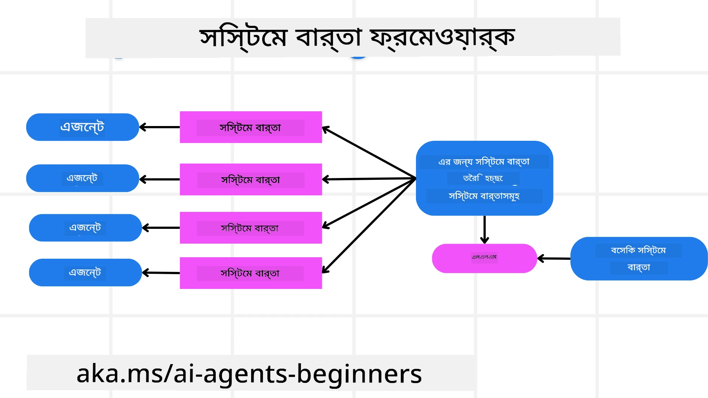
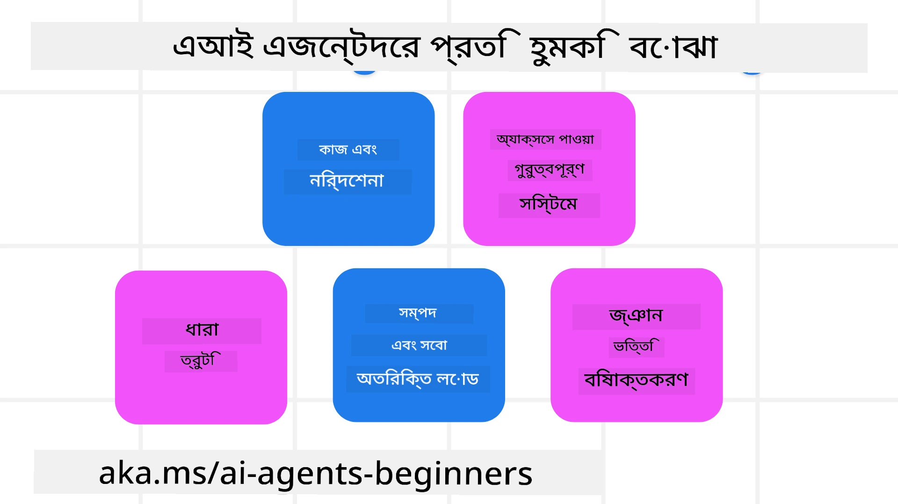
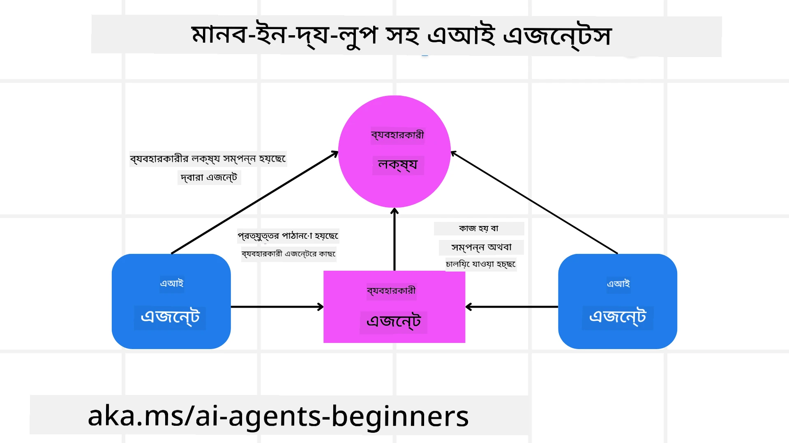

[](https://youtu.be/iZKkMEGBCUQ?si=Q-kEbcyHUMPoHp8L)

> _(এই পাঠের ভিডিও দেখতে উপরের চিত্রে ক্লিক করুন)_

# বিশ্বাসযোগ্য AI এজেন্ট তৈরি

## পরিচিতি

এই পাঠে আলোচনা করা হবে:

- কিভাবে নিরাপদ এবং কার্যকর AI এজেন্ট তৈরি ও স্থাপন করবেন
- AI এজেন্ট বিকাশের সময় গুরুত্বপূর্ণ নিরাপত্তা বিষয়াবলী।
- AI এজেন্ট তৈরি করার সময় ডেটা এবং ব্যবহারকারীর গোপনীয়তা কিভাবে রক্ষা করবেন।

## শেখার লক্ষ্যসমূহ

এই পাঠ শেষ করার পর, আপনি জানতে পারবেন কিভাবে:

- AI এজেন্ট তৈরি করার সময় ঝুঁকি চিহ্নিত ও প্রশমন করবেন।
- ডেটা এবং অ্যাক্সেস সঠিকভাবে পরিচালনা নিশ্চিত করার জন্য নিরাপত্তা ব্যবস্থা বাস্তবায়ন করবেন।
- ডেটার গোপনীয়তা বজায় রেখে এবং ভালো ব্যবহারকারীর অভিজ্ঞতা প্রদান করে AI এজেন্ট তৈরি করবেন।

## নিরাপত্তা

প্রথমে আসুন নিরাপদ এজেন্টিক অ্যাপ্লিকেশন তৈরি সম্পর্কে জানি। নিরাপত্তা মানে AI এজেন্ট পরিকল্পনা অনুযায়ী কাজ করে। এজেন্টিক অ্যাপ্লিকেশন নির্মাতারা হিসেবে আমাদের কাছে বৃহত্তর নিরাপত্তা নিশ্চিত করার পদ্ধতি এবং সরঞ্জাম রয়েছে:

### সিস্টেম মেসেজ ফ্রেমওয়ার্ক তৈরি করা

আপনি যদি কখনও বড় ভাষা মডেল (LLMs) ব্যবহার করে AI অ্যাপ্লিকেশন তৈরি করে থাকেন, তাহলে আপনি জানেন একটি মজবুত সিস্টেম প্রম্পট বা সিস্টেম মেসেজ ডিজাইনের গুরুত্ব। এই প্রম্পটগুলো নির্ধারণ করে মেটা নিয়ম, নির্দেশনা এবং নির্দেশাবলী কিভাবে LLM ব্যবহারকারী এবং ডেটার সাথে যোগাযোগ করবে।

AI এজেন্টের ক্ষেত্রে, সিস্টেম প্রম্পট আরও বেশি গুরুত্বপূর্ণ কারণ AI এজেন্টকে আমাদের ডিজাইন করা কাজগুলি সম্পন্ন করার জন্য অত্যন্ত নির্দিষ্ট নির্দেশনা প্রয়োজন।

স্কেলযোগ্য সিস্টেম প্রম্পট তৈরি করতে, আমরা একটি সিস্টেম মেসেজ ফ্রেমওয়ার্ক ব্যবহার করতে পারি যা আমাদের অ্যাপ্লিকেশনে এক বা একাধিক এজেন্ট তৈরি করতে সহায়তা করে:



#### ধাপ ১: একটি মেটা সিস্টেম মেসেজ তৈরি করুন

মেটা প্রম্পটটি একটি LLM দ্বারা এজেন্টদের জন্য সিস্টেম প্রম্পট তৈরি করতে ব্যবহৃত হবে। আমরা এটি একটি টেমপ্লেট হিসেবে ডিজাইন করব যাতে প্রয়োজনে সহজে একাধিক এজেন্ট তৈরি করা যায়।

এখানে একটি উদাহরণ মেটা সিস্টেম মেসেজ যা আমরা LLM-কে দিই:

```plaintext
You are an expert at creating AI agent assistants. 
You will be provided a company name, role, responsibilities and other
information that you will use to provide a system prompt for.
To create the system prompt, be descriptive as possible and provide a structure that a system using an LLM can better understand the role and responsibilities of the AI assistant. 
```

#### ধাপ ২: একটি মৌলিক প্রম্পট তৈরি করুন

পরবর্তী ধাপ হলো একটি মৌলিক প্রম্পট তৈরি করা যা AI এজেন্টের বর্ণনা দেয়। এর মধ্যে এজেন্টের ভূমিকা, এজেন্ট যে কাজগুলি সম্পন্ন করবে, এবং এজেন্টের অন্যান্য দায়িত্ব অন্তর্ভুক্ত করা উচিত।

একটি উদাহরণ নিচে দেওয়া হলো:

```plaintext
You are a travel agent for Contoso Travel that is great at booking flights for customers. To help customers you can perform the following tasks: lookup available flights, book flights, ask for preferences in seating and times for flights, cancel any previously booked flights and alert customers on any delays or cancellations of flights.  
```

#### ধাপ ৩: মৌলিক সিস্টেম মেসেজ LLM-কে দিন

এখন আমরা এই সিস্টেম মেসেজটি উন্নত করতে পারি মেটা সিস্টেম মেসেজ এবং আমাদের মৌলিক সিস্টেম মেসেজ প্রদান করে।

এতে একটি উন্নত সিস্টেম মেসেজ তৈরি হবে যা আমাদের AI এজেন্টদের নির্দেশনার জন্য আরও ভাল হবে:

```markdown
**Company Name:** Contoso Travel  
**Role:** Travel Agent Assistant

**Objective:**  
You are an AI-powered travel agent assistant for Contoso Travel, specializing in booking flights and providing exceptional customer service. Your main goal is to assist customers in finding, booking, and managing their flights, all while ensuring that their preferences and needs are met efficiently.

**Key Responsibilities:**

1. **Flight Lookup:**
    
    - Assist customers in searching for available flights based on their specified destination, dates, and any other relevant preferences.
    - Provide a list of options, including flight times, airlines, layovers, and pricing.
2. **Flight Booking:**
    
    - Facilitate the booking of flights for customers, ensuring that all details are correctly entered into the system.
    - Confirm bookings and provide customers with their itinerary, including confirmation numbers and any other pertinent information.
3. **Customer Preference Inquiry:**
    
    - Actively ask customers for their preferences regarding seating (e.g., aisle, window, extra legroom) and preferred times for flights (e.g., morning, afternoon, evening).
    - Record these preferences for future reference and tailor suggestions accordingly.
4. **Flight Cancellation:**
    
    - Assist customers in canceling previously booked flights if needed, following company policies and procedures.
    - Notify customers of any necessary refunds or additional steps that may be required for cancellations.
5. **Flight Monitoring:**
    
    - Monitor the status of booked flights and alert customers in real-time about any delays, cancellations, or changes to their flight schedule.
    - Provide updates through preferred communication channels (e.g., email, SMS) as needed.

**Tone and Style:**

- Maintain a friendly, professional, and approachable demeanor in all interactions with customers.
- Ensure that all communication is clear, informative, and tailored to the customer's specific needs and inquiries.

**User Interaction Instructions:**

- Respond to customer queries promptly and accurately.
- Use a conversational style while ensuring professionalism.
- Prioritize customer satisfaction by being attentive, empathetic, and proactive in all assistance provided.

**Additional Notes:**

- Stay updated on any changes to airline policies, travel restrictions, and other relevant information that could impact flight bookings and customer experience.
- Use clear and concise language to explain options and processes, avoiding jargon where possible for better customer understanding.

This AI assistant is designed to streamline the flight booking process for customers of Contoso Travel, ensuring that all their travel needs are met efficiently and effectively.

```

#### ধাপ ৪: পুনরাবৃত্তি এবং উন্নতি করুন

এই সিস্টেম মেসেজ ফ্রেমওয়ার্কের মান হলো একাধিক এজেন্ট থেকে সিস্টেম মেসেজ তৈরি সহজে বৃদ্ধি করা এবং সময়ের সাথে আপনার সিস্টেম মেসেজগুলিকে উন্নত করা। সাধারণত প্রথমবারেই আপনার সম্পূর্ণ ব্যবহারের জন্য একটি সিস্টেম মেসেজ কার্যকর হয় না। মৌলিক সিস্টেম মেসেজ পরিবর্তন করে এবং সিস্টেমের মাধ্যমে চালিয়ে ছোটখাটো সংশোধন ও উন্নতি করতে পারা ফলাফল তুলনা ও মূল্যায়ন করার সুযোগ দেয়।

## হুমকিগুলো বোঝা

বিশ্বাসযোগ্য AI এজেন্ট তৈরি করতে আপনার AI এজেন্টের ঝুঁকি ও হুমকি বোঝা এবং প্রশমন করাটা গুরুত্বপূর্ণ। আসুন AI এজেন্টের বিভিন্ন হুমকির মধ্যে কিছু দেখি এবং কিভাবে আপনি সেগুলোর জন্য ভাল পরিকল্পনা এবং প্রস্তুতি নিতে পারেন।



### কাজ এবং নির্দেশনা

**বর্ণনা:** আক্রমণকারীরা প্রম্পটিং বা ইনপুট পরিবর্তন করে AI এজেন্টের নির্দেশনা বা লক্ষ্য পরিবর্তন করার চেষ্টা করে।

**প্রতিকার:** AI এজেন্ট প্রক্রিয়াকৃত হওয়ার আগে সম্ভাব্য ঝুঁকিপূর্ণ প্রম্পটগুলো শনাক্ত করতে যাচাই পরীক্ষা এবং ইনপুট ফিল্টার সমূহ প্রয়োগ করুন। যেহেতু এই ধরনের আক্রমণ সাধারণত এজেন্টের সাথে ঘন ঘন যোগাযোগের প্রয়োজন হয়, তাই কথোপকথনের পরির্বতনের সংখ্যা সীমিত করাও প্রতিরোধের উপায়।

### গুরুত্বপূর্ণ সিস্টেমের অ্যাক্সেস

**বর্ণনা:** যদি AI এজেন্ট সংবেদনশীল ডেটা সংরক্ষণকারী সিস্টেম ও সেবাগুলোর অ্যাক্সেস পায়, আক্রমণকারীরা এজেন্ট ও সেবাগুলির মধ্যে যোগাযোগে বাধা সৃষ্টি করতে পারে। এটি সরাসরি আক্রমণ বা এজেন্টের মাধ্যমে সিস্টেম সংক্রান্ত তথ্য আহরণের প্রচেষ্টা হতে পারে।

**প্রতিকার:** AI এজেন্টকে প্রয়োজন অনুযায়ীই সিস্টেম অ্যাক্সেস দিন যাতে এই ধরনের আক্রমণ রোধ হয়। এজেন্ট ও সিস্টেমের মধ্যে যোগাযোগ নিরাপদ হতে হবে। প্রমাণীকরণ ও প্রবেশাধিকার নিয়ন্ত্রণ প্রয়োগে তথ্য সুরক্ষিত রাখা যায়।

### সম্পদ ও সেবা ওভারলোডিং

**বর্ণনা:** AI এজেন্ট বিভিন্ন টুল এবং সেবা ব্যবহার করে কাজ সম্পন্ন করে। আক্রমণকারীরা AI এজেন্টের মাধ্যমে উচ্চ পরিমাণের অনুরোধ পাঠিয়ে এই সেবাগুলোকে আক্রমণ করতে পারে, যা সিস্টেম ব্যর্থতা বা অতিরিক্ত খরচের কারণ হতে পারে।

**প্রতিকার:** AI এজেন্ট কতটা সেবায় অনুরোধ পাঠাতে পারবে তা নিয়ন্ত্রণে নীতিমালা প্রয়োগ করুন। কথোপকথনের টার্ন এবং অনুরোধ সংখ্যা সীমিত করাও এই ধরনের আক্রমণ প্রতিরোধে কার্যকর।

### জ্ঞানভান্ডার বিষাক্তকরণ

**বর্ণনা:** এই আক্রমণ সরাসরি AI এজেন্টকে লক্ষ্য করে না, বরং জ্ঞানভান্ডার ও অন্যান্য সেবা লক্ষ্য করে যা AI এজেন্ট তার কাজ করতে ব্যবহার করে। এতে ডেটা বা তথ্য দূষিত করা হতে পারে, যার ফলে AI এজেন্ট পক্ষপাতদুষ্ট বা অনিচ্ছাকৃত প্রতিক্রিয়া দিতে পারে।

**প্রতিকার:** AI এজেন্টের ব্যবহৃত ডেটা নিয়মিত যাচাই করুন। এই ডেটার অ্যাক্সেস নিরাপদ রাখুন এবং কেবল নির্ভরযোগ্য ব্যক্তিরাই এটি পরিবর্তন করতে পারবেন এমন ব্যবস্থা নিন।

### ধাপে ধাপে ভুল

**বর্ণনা:** AI এজেন্ট বিভিন্ন টুল ও সেবা ব্যবহার করে কাজ করে। আক্রমণকারীদের কারণে সৃষ্ট ভুলগুলো অন্য যুক্ত সিস্টেমেও সমস্যা সৃষ্টি করতে পারে, ফলে আক্রমণটি ব্যাপক হয় এবং সমস্যা সমাধান জটিল হয়।

**প্রতিকার:** AI এজেন্টকে সীমাবদ্ধ পরিবেশে কাজ করানো, যেমন ডকার কন্টেইনারে কাজ করানো, সিস্টেমে সরাসরি আক্রমণ প্রতিরোধে কার্যকর। যখন কোনো সিস্টেম ত্রুটি দেখায় তখন ফালব্যাক ব্যবস্থা এবং পুনরায় চেষ্টা করার লজিক তৈরি করাও বড় সিস্টেম ব্যর্থতা প্রতিরোধে সাহায্য করে।

## মানব-এর-সাথেপ্রক্রিয়া (Human-in-the-Loop)

বিশ্বাসযোগ্য AI এজেন্ট সিস্টেম তৈরির আরেকটি কার্যকর উপায় হলো মানব-সম্পৃক্ত প্রক্রিয়া ব্যবহার। এতে ব্যবহারকারীরা চলমান প্রক্রিয়ার সময় এজেন্টদের ফিডব্যাক দিতে পারেন। ব্যবহারকারীরা মাল্টি-এজেন্ট সিস্টেমে এজেন্ট হিসেবে কাজ করে এবং চলমান প্রক্রিয়ার অনুমোদন বা বন্ধ করতে পারেন।



নিম্নে Microsoft Agent Framework ব্যবহার করে কীভাবে এই ধারণাটি বাস্তবায়িত হয় তার একটি কোড স্নিপেট দেওয়া হলো:

```python
import os
from agent_framework.azure import AzureAIProjectAgentProvider
from azure.identity import AzureCliCredential

# মানব-অংশগ্রহণ অনুমোদনের সাথে প্রদানকারী তৈরি করুন
provider = AzureAIProjectAgentProvider(
    credential=AzureCliCredential(),
)

# মানব অনুমোদন ধাপ সহ এজেন্ট তৈরি করুন
response = provider.create_response(
    input="Write a 4-line poem about the ocean.",
    instructions="You are a helpful assistant. Ask for user approval before finalizing.",
)

# ব্যবহারকারী প্রতিক্রিয়া পর্যালোচনা এবং অনুমোদন করতে পারে
print(response.output_text)
user_input = input("Do you approve? (APPROVE/REJECT): ")
if user_input == "APPROVE":
    print("Response approved.")
else:
    print("Response rejected. Revising...")
```

## উপসংহার

বিশ্বাসযোগ্য AI এজেন্ট তৈরি করতে সতর্ক ডিজাইন, শক্তিশালী নিরাপত্তা ব্যবস্থা ও ক্রমাগত পুনরাবৃত্তি দরকার। কাঠামোবদ্ধ মেটা প্রম্পট সিস্টেম, সম্ভাব্য হুমকি বোঝা এবং প্রতিকার কৌশল প্রয়োগ করে ডেভেলপাররা নিরাপদ ও কার্যকর AI এজেন্ট তৈরি করতে পারেন। এছাড়া মানব-সম্পৃক্ত পদ্ধতি যুক্ত করলে AI এজেন্ট ব্যবহারকারীর চাহিদার সাথে সামঞ্জস্যপূর্ণ থাকে এবং ঝুঁকি হ্রাস পায়। AI অগ্রগতির সাথে নিরাপত্তা, গোপনীয়তা ও নৈতিক দিক নিয়ন্ত্রণ করাও বিশ্বাস এবং নির্ভরযোগ্যতা প্রতিষ্ঠার মূল চাবিকাঠি হবে।

### বিশ্বাসযোগ্য AI এজেন্ট নির্মাণ সম্পর্কে আরও প্রশ্ন আছে?

অন্য শিক্ষার্থীদের সাথে দেখা করতে, অফিস আওয়ার এ অংশ নিতে এবং আপনার AI এজেন্ট সম্পর্কিত প্রশ্নের উত্তর পেতে [Microsoft Foundry Discord](https://aka.ms/ai-agents/discord) এ যোগ দিন।

## অতিরিক্ত সম্পদ

- <a href="https://learn.microsoft.com/azure/ai-studio/responsible-use-of-ai-overview" target="_blank">দায়িত্বশীল AI বিস্তারিত</a>
- <a href="https://learn.microsoft.com/azure/ai-studio/concepts/evaluation-approach-gen-ai" target="_blank">জেনারেটিভ AI মডেল এবং AI অ্যাপ্লিকেশন মূল্যায়ন</a>
- <a href="https://learn.microsoft.com/azure/ai-services/openai/concepts/system-message?context=%2Fazure%2Fai-studio%2Fcontext%2Fcontext&tabs=top-techniques" target="_blank">নিরাপত্তা সিস্টেম মেসেজ</a>
- <a href="https://blogs.microsoft.com/wp-content/uploads/prod/sites/5/2022/06/Microsoft-RAI-Impact-Assessment-Template.pdf?culture=en-us&country=us" target="_blank">ঝুঁকি মূল্যায়ন টেমপ্লেট</a>

## পূর্ববর্তী পাঠ

[Agentic RAG](../05-agentic-rag/README.md)

## পরবর্তী পাঠ

[পরিকল্পনা ডিজাইন প্যাটার্ন](../07-planning-design/README.md)

---

<!-- CO-OP TRANSLATOR DISCLAIMER START -->
**ডিসক্লেমার**:  
এই ডকুমেন্টটি এআই অনুবাদ সেবা [কো-অপ ট্রান্সলেটর](https://github.com/Azure/co-op-translator) ব্যবহার করে অনূদিত হয়েছে। আমরা সঠিকতার জন্য চেষ্টা করলেও, স্বয়ংক্রিয় অনুবাদে ত্রুটি বা ভুল থাকতে পারে। মূল ডকুমেন্টটি তার নিজস্ব ভাষায়ই কর্তৃত্বপ্রাপ্ত উৎস হিসেবে গণ্য করা উচিত। গুরুত্বপূর্ণ তথ্যের জন্য পেশাদার মানব অনুবাদ প্রয়োজন। এই অনুবাদের ব্যবহার থেকে উদ্ভূত কোনো ভুল বোঝাবুঝি বা ভুল ব্যাখ্যার জন্য আমরা দায়ী নই।
<!-- CO-OP TRANSLATOR DISCLAIMER END -->