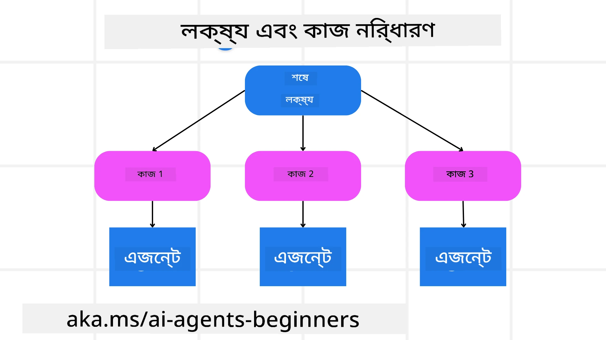

[](https://youtu.be/kPfJ2BrBCMY?si=9pYpPXp0sSbK91Dr)

> _(এই পাঠের ভিডিও দেখতে উপরের ছবিতে ক্লিক করুন)_

# পরিকল্পনা ডিজাইন

## পরিচিতি

এই পাঠে আলোচনা করা হবে

* একটি স্পষ্ট সামগ্রিক লক্ষ্য নির্ধারণ করা এবং একটি জটিল কাজকে পরিচালনাযোগ্য কাজগুলোতে বিভক্ত করা।
* আরও নির্ভরযোগ্য এবং মেশিন-পঠনযোগ্য প্রতিক্রিয়ার জন্য কাঠামোবদ্ধ আউটপুট ব্যবহার করা।
* গতিশীল কাজ এবং অপ্রত্যাশিত ইনপুটগুলি পরিচালনা করার জন্য একটি ঘটনা ভিত্তিক পদ্ধতি প্রয়োগ করা।

## শেখার লক্ষ্য

এই পাঠ সম্পন্ন করার পরে, আপনি নিম্নলিখিত বিষয়ে বুঝতে পারবেন:

* একটি AI এজেন্টের জন্য একটি সামগ্রিক লক্ষ্য নির্ধারণ এবং সেট করা, নিশ্চিত করা যে এটি স্পষ্টভাবে জানে কি অর্জন করতে হবে।
* একটি জটিল কাজকে পরিচালনাযোগ্য উপকাজে বিভক্ত করা এবং তাদের যৌক্তিক ক্রমে সংগঠিত করা।
* এজেন্টদের সঠিক সরঞ্জাম (যেমন, অনুসন্ধান সরঞ্জাম বা ডেটা বিশ্লেষণ সরঞ্জাম) প্রদান করা, কখন এবং কিভাবে সেগুলি ব্যবহার করা হবে তা সিদ্ধান্ত নেওয়া, এবং উদ্ভুত অপ্রত্যাশিত পরিস্থিতি মোকাবেলা করা।
* উপকাজের ফলাফল মূল্যায়ন করা, কর্মক্ষমতা পরিমাপ করা, এবং সামগ্রিক আউটপুট উন্নত করতে ক্রিয়াগুলি পুনরাবৃত্তি করা।

## সামগ্রিক লক্ষ্য নির্ধারণ এবং কাজ বিভাজন



অধিকাংশ বাস্তব বিশ্বের কাজ একক ধাপে মোকাবেলা করার জন্য অত্যন্ত জটিল। একটি AI এজেন্টের পরিকল্পনা এবং কর্মসমূহ পরিচালনার জন্য একটি সংক্ষিপ্ত উদ্দেশ্য থাকা প্রয়োজন। উদাহরণস্বরূপ লক্ষ্য বিবেচনা করুন:

    "৩ দিনের ভ্রমণসূচি তৈরি করুন।"

যদিও এটি বলা সহজ, তবুও এটি সংশোধনের প্রয়োজন রয়েছে। যতটা স্পষ্ট লক্ষ্য, তত ভাল এজেন্ট (এবং যেকোনো মানব সহযোগী) সঠিক ফলাফল অর্জনে মনোযোগ দিতে পারে, যেমন ফ্লাইট বিকল্প, হোটেল সুপারিশ এবং কার্যক্রম পরামর্শসহ একটি সম্পূর্ণ সূচি তৈরি করা।

### কাজ বিভাজন

বড় বা জটিল কাজ ছোট, লক্ষ্য-ভিত্তিক উপকাজে বিভক্ত হলে আরও পরিচালনাযোগ্য হয়। ভ্রমণসূচির উদাহরণে, আপনি লক্ষ্যকে নিম্নরূপ বিভক্ত করতে পারেন:

* ফ্লাইট বুকিং
* হোটেল বুকিং
* গাড়ি ভাড়া
* ব্যক্তিগতকরণ

প্রতিটি উপকাজ আলাদাভাবে মনোনীত এজেন্ট বা প্রক্রিয়া দ্বারা পরিচালিত হতে পারে। একজন এজেন্ট সেরা ফ্লাইট ডিল খোঁজার দক্ষ, আরেকজন হোটেল বুকিং নিয়ে মনোযোগী, ইত্যাদি। একটি সমন্বয়কারী বা "ডাউনস্ট্রিম" এজেন্ট তারপর এই ফলাফলগুলোকে একত্রিত করে ব্যবহারকারীর জন্য একটি সামগ্রিক সূচি তৈরি করতে পারে।

এই মডুলার পদ্ধতি বিষয়টিকে ধাপে ধাপে উন্নত করার অনুমতি দেয়। উদাহরণস্বরূপ, আপনি খাদ্য সুপারিশ অথবা স্থানীয় কার্যক্রম পরামর্শের জন্য বিশেষায়িত এজেন্ট যুক্ত করতে পারেন এবং সময়ের সাথে সূচি পরিমার্জন করতে পারেন।

### কাঠামোবদ্ধ আউটপুট

বড় ভাষা মডেল (এলএলএম) কাঠামোবদ্ধ আউটপুট (যেমন JSON) তৈরী করতে পারে যা ডাউনস্ট্রিম এজেন্ট বা সেবাগুলোর জন্য পঠন এবং প্রক্রিয়াকরণ সহজ করে। এটি বিশেষ করে একটি বহু-এজেন্ট প্রসঙ্গে খুব উপকারী, যেখানে আমরা পরিকল্পনার আউটপুট পাওয়ার পরে এই কাজগুলোকে কার্যকর করতে পারি।

নিম্নলিখিত পাইথন কোড স্নিপেট একটি সহজ পরিকল্পনা এজেন্টের উদাহরণ দেয় যিনি একটি লক্ষ্যকে উপকাজে বিভক্ত করে এবং একটি কাঠামোবদ্ধ পরিকল্পনা তৈরি করে:

```python
from pydantic import BaseModel
from enum import Enum
from typing import List, Optional, Union
import json
import os
from typing import Optional
from pprint import pprint
from agent_framework.azure import AzureAIProjectAgentProvider
from azure.identity import AzureCliCredential

class AgentEnum(str, Enum):
    FlightBooking = "flight_booking"
    HotelBooking = "hotel_booking"
    CarRental = "car_rental"
    ActivitiesBooking = "activities_booking"
    DestinationInfo = "destination_info"
    DefaultAgent = "default_agent"
    GroupChatManager = "group_chat_manager"

# ভ্রমণ সাবটাস্ক মডেল
class TravelSubTask(BaseModel):
    task_details: str
    assigned_agent: AgentEnum  # আমরা কাজটি এজেন্টকে বরাদ্দ করতে চাই

class TravelPlan(BaseModel):
    main_task: str
    subtasks: List[TravelSubTask]
    is_greeting: bool

provider = AzureAIProjectAgentProvider(credential=AzureCliCredential())

# ব্যবহারকারী বার্তাটি সংজ্ঞায়িত করুন
system_prompt = """You are a planner agent.
    Your job is to decide which agents to run based on the user's request.
    Provide your response in JSON format with the following structure:
{'main_task': 'Plan a family trip from Singapore to Melbourne.',
 'subtasks': [{'assigned_agent': 'flight_booking',
               'task_details': 'Book round-trip flights from Singapore to '
                               'Melbourne.'}
    Below are the available agents specialised in different tasks:
    - FlightBooking: For booking flights and providing flight information
    - HotelBooking: For booking hotels and providing hotel information
    - CarRental: For booking cars and providing car rental information
    - ActivitiesBooking: For booking activities and providing activity information
    - DestinationInfo: For providing information about destinations
    - DefaultAgent: For handling general requests"""

user_message = "Create a travel plan for a family of 2 kids from Singapore to Melbourne"

response = client.create_response(input=user_message, instructions=system_prompt)

response_content = response.output_text
pprint(json.loads(response_content))
```

### বহু-এজেন্ট সংমিশ্রণ সহ পরিকল্পনা এজেন্ট

এই উদাহরণে, একটি Semantic Router Agent ব্যবহারকারীর অনুরোধ গ্রহণ করে (যেমন, "আমার যাত্রার জন্য একটি হোটেল পরিকল্পনা প্রয়োজন।")।

পরিকল্পনাকারী:

* হোটেল পরিকল্পনা গ্রহণ করে: ব্যবহারকারীর বার্তাটি নিয়ে, একটি সিস্টেম প্রম্পট অনুযায়ী (যাতে উপলব্ধ এজেন্টের বিবরণ থাকে) একটি কাঠামোবদ্ধ ভ্রমণ পরিকল্পনা তৈরি করে।
* এজেন্ট এবং তাদের সরঞ্জাম তালিকা করে: এজেন্ট রেজিস্ট্রি এজেন্টদের তালিকা ধারণ করে (যেমন, ফ্লাইট, হোটেল, গাড়ি ভাড়া, কার্যক্রম) এবং তারা যেসব ফাংশন বা সরঞ্জাম প্রদান করে তা রাখে।
* পরিকল্পনাটি যথাযথ এজেন্টদের কাছে প্রেরণ করে: উপকাজের সংখ্যা অনুসারে, পরিকল্পনাকারী বার্তাটি সরাসরি একটি মনোনীত এজেন্টের কাছে পাঠায় (একক কাজের ক্ষেত্রে) অথবা বহু-এজেন্ট সহযোগিতার জন্য গ্রুপ চ্যাট ম্যানেজারের মাধ্যমে সমন্বয় করে।
* ফলাফল সারসংক্ষেপ করে: অবশেষে, পরিকল্পনাকারী স্পষ্টতার জন্য তৈরি পরিকল্পনার সারসংক্ষেপ প্রদান করে।
নিম্নলিখিত পাইথন কোড উদাহরণ এসব ধাপ দেখায়:

```python

from pydantic import BaseModel

from enum import Enum
from typing import List, Optional, Union

class AgentEnum(str, Enum):
    FlightBooking = "flight_booking"
    HotelBooking = "hotel_booking"
    CarRental = "car_rental"
    ActivitiesBooking = "activities_booking"
    DestinationInfo = "destination_info"
    DefaultAgent = "default_agent"
    GroupChatManager = "group_chat_manager"

# ভ্রমণ সাবটাস্ক মডেল

class TravelSubTask(BaseModel):
    task_details: str
    assigned_agent: AgentEnum # আমরা এজেন্টকে টাস্কটি অ্যাসাইন করতে চাই

class TravelPlan(BaseModel):
    main_task: str
    subtasks: List[TravelSubTask]
    is_greeting: bool
import json
import os
from typing import Optional

from agent_framework.azure import AzureAIProjectAgentProvider
from azure.identity import AzureCliCredential

# ক্লায়েন্ট তৈরি করুন

provider = AzureAIProjectAgentProvider(credential=AzureCliCredential())

from pprint import pprint

# ব্যবহারকারীর বার্তা সংজ্ঞায়িত করুন

system_prompt = """You are a planner agent.
    Your job is to decide which agents to run based on the user's request.
    Below are the available agents specialized in different tasks:
    - FlightBooking: For booking flights and providing flight information
    - HotelBooking: For booking hotels and providing hotel information
    - CarRental: For booking cars and providing car rental information
    - ActivitiesBooking: For booking activities and providing activity information
    - DestinationInfo: For providing information about destinations
    - DefaultAgent: For handling general requests"""

user_message = "Create a travel plan for a family of 2 kids from Singapore to Melbourne"

response = client.create_response(input=user_message, instructions=system_prompt)

response_content = response.output_text

# JSON হিসেবে লোড করার পরে প্রতিক্রিয়া বিষয়বস্তু প্রিন্ট করুন

pprint(json.loads(response_content))
```

নিচের আউটপুটটি পূর্বের কোড থেকে প্রাপ্ত এবং আপনি এই কাঠামোবদ্ধ আউটপুট ব্যবহার করে `assigned_agent`-এর কাছে রুট করতে এবং ভ্রমণ পরিকল্পনার সারসংক্ষেপ শেষ ব্যবহারকারীকে দিতে পারেন।

```json
{
    "is_greeting": "False",
    "main_task": "Plan a family trip from Singapore to Melbourne.",
    "subtasks": [
        {
            "assigned_agent": "flight_booking",
            "task_details": "Book round-trip flights from Singapore to Melbourne."
        },
        {
            "assigned_agent": "hotel_booking",
            "task_details": "Find family-friendly hotels in Melbourne."
        },
        {
            "assigned_agent": "car_rental",
            "task_details": "Arrange a car rental suitable for a family of four in Melbourne."
        },
        {
            "assigned_agent": "activities_booking",
            "task_details": "List family-friendly activities in Melbourne."
        },
        {
            "assigned_agent": "destination_info",
            "task_details": "Provide information about Melbourne as a travel destination."
        }
    ]
}
```

পূর্বের কোড নমুনার সাথে একটি উদাহরণ নোটবুক পাওয়া যাবে [এখানে](07-python-agent-framework.ipynb)।

### পুনরাবৃত্তিমূলক পরিকল্পনা

কিছু কাজের জন্য পেছনে ফিরে যাওয়া বা পুনরায় পরিকল্পনার প্রয়োজন হয়, যেখানে এক উপকাজের ফলাফল পরবর্তী উপকাজকে প্রভাবিত করে। উদাহরণস্বরূপ, যদি এজেন্ট ফ্লাইট বুকিং করার সময় একটি অপ্রত্যাশিত ডেটা ফর্ম্যাট আবিষ্কার করে, তবে হোটেল বুকিংয়ের আগে তার কৌশল পরিবর্তন করতে হতে পারে।

অতিরিক্তভাবে, ব্যবহারকারীর প্রতিক্রিয়া (যেমন, একজন মানুষ আগের ফ্লাইট পছন্দ করলে) অনুষঙ্গিক পুনঃপরিকল্পনার সূচনা করতে পারে। এই গতিশীল, পুনরাবৃত্তিমূলক পদ্ধতি নিশ্চিত করে যে চূড়ান্ত সমাধান বাস্তব বিশ্বের সীমাবদ্ধতা এবং পরিবর্তনশীল ব্যবহারকারী পছন্দের সঙ্গে সামঞ্জস্যপূর্ণ।

উদাহরণ কোড

```python
from agent_framework.azure import AzureAIProjectAgentProvider
from azure.identity import AzureCliCredential
#.. আগের কোডের মতোই এবং ব্যবহারকারীর ইতিহাস, বর্তমান পরিকল্পনা প্রেরণ করুন

system_prompt = """You are a planner agent to optimize the
    Your job is to decide which agents to run based on the user's request.
    Below are the available agents specialized in different tasks:
    - FlightBooking: For booking flights and providing flight information
    - HotelBooking: For booking hotels and providing hotel information
    - CarRental: For booking cars and providing car rental information
    - ActivitiesBooking: For booking activities and providing activity information
    - DestinationInfo: For providing information about destinations
    - DefaultAgent: For handling general requests"""

user_message = "Create a travel plan for a family of 2 kids from Singapore to Melbourne"

response = client.create_response(
    input=user_message,
    instructions=system_prompt,
    context=f"Previous travel plan - {TravelPlan}",
)
# .. পুনরায় পরিকল্পনা করুন এবং টাস্কগুলি সংশ্লিষ্ট এজেন্টদের কাছে পাঠান
```

আরও ব্যাপক পরিকল্পনার জন্য Magnetic One <a href="https://www.microsoft.com/research/articles/magentic-one-a-generalist-multi-agent-system-for-solving-complex-tasks" target="_blank">ব্লগপোস্ট</a> দেখে নিন, যা জটিল কাজ সমাধানে ব্যবহৃত হয়।

## সারাংশ

এই নিবন্ধে আমরা দেখেছি কিভাবে একটি পরিকল্পনাকারী তৈরি করা যায় যা গতিশীলভাবে উপলব্ধ এজেন্টদের নির্বাচন করতে পারে। পরিকল্পনাকারীর আউটপুট কাজগুলোকে বিভক্ত করে এবং এজেন্টদের বরাদ্দ করে যাতে সেগুলো সম্পন্ন করা যায়। ধরে নেওয়া হয় যে এজেন্টদের কাছে প্রয়োজনীয় ফাংশন/সরঞ্জাম রয়েছে কাজটি সম্পাদনের জন্য। এজেন্টদের পাশাপাশি আপনি প্রতিফলন, সারসংক্ষেপকারী, এবং রাউন্ড রবিন চ্যাটের মতো অন্যান্য প্যাটার্নও যুক্ত করতে পারেন আরও কাস্টমাইজেশনের জন্য।

## অতিরিক্ত সম্পদ

Magentic One - একটি সাধারণ ধরণের বহু-এজেন্ট সিস্টেম যা জটিল কাজ সমাধানে ব্যবহৃত হয় এবং বহু চ্যালেঞ্জিং এজেন্টিক বেঞ্চমার্কে চমত্কার ফলাফল অর্জন করেছে। রেফারেন্স: <a href="https://www.microsoft.com/research/articles/magentic-one-a-generalist-multi-agent-system-for-solving-complex-tasks" target="_blank">Magentic One</a>। এই ইমপ্লিমেন্টেশনে, অর্কেস্ট্রেটর কাজ-নির্দিষ্ট পরিকল্পনা তৈরি করে এবং উপলব্ধ এজেন্টদের উদ্যোগ দেয়। পরিকল্পনার পাশাপাশি, অর্কেস্ট্রেটর একটি ট্র্যাকিং পদ্ধতিও ব্যবহার করে কাজের অগ্রগতি পর্যবেক্ষণ করতে এবং প্রয়োজনে পুনঃপরিকল্পনা করতে।

### পরিকল্পনা ডিজাইন প্যাটার্ন নিয়ে আরও প্রশ্ন আছে?

[Microsoft Foundry Discord](https://aka.ms/ai-agents/discord)-এ যোগ দিন অন্য শিক্ষার্থীদের সাথে মেলামেশা করতে, অফিস আওয়ারে অংশ নিতে এবং আপনার AI এজেন্ট সংক্রান্ত প্রশ্নের উত্তর পেতে।

## পূর্ববর্তী পাঠ

[বিশ্বস্ত AI এজেন্ট তৈরি](../06-building-trustworthy-agents/README.md)

## পরবর্তী পাঠ

[মাল্টি-এজেন্ট ডিজাইন প্যাটার্ন](../08-multi-agent/README.md)

---

<!-- CO-OP TRANSLATOR DISCLAIMER START -->
**বিষয়বস্তু পর্যবেক্ষণ**:  
এই ডকুমেন্টটি AI অনুবাদ সেবা [Co-op Translator](https://github.com/Azure/co-op-translator) ব্যবহার করে অনূদিত হয়েছে। যদিও আমরা যথাসাধ্য সঠিকতার চেষ্টা করি, স্বয়ংক্রিয় অনুবাদে ভুল বা অমিল থাকার সম্ভাবনা রয়েছে তা অনুগ্রহ করে মনে রাখবেন। মূল ভাষার ডকুমেন্টকেই কর্তৃত্বপূর্ণ উৎস হিসেবে বিবেচনা করা উচিত। গুরুত্বপূর্ণ তথ্যের ক্ষেত্রে পেশাদার মানুষের অনুবাদ গ্রহণের পরামর্শ দেওয়া হয়। এই অনুবাদের ব্যবহার থেকে সৃষ্ট কোনো ভুল ধারণা বা ভুল ব্যাখ্যার জন্য আমরা দায়বদ্ধ নই।
<!-- CO-OP TRANSLATOR DISCLAIMER END -->