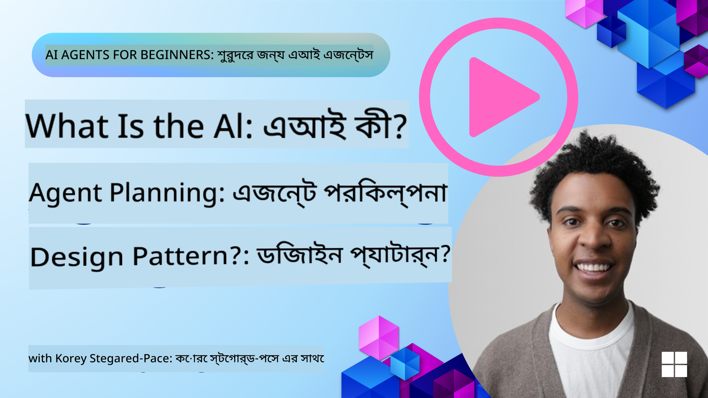
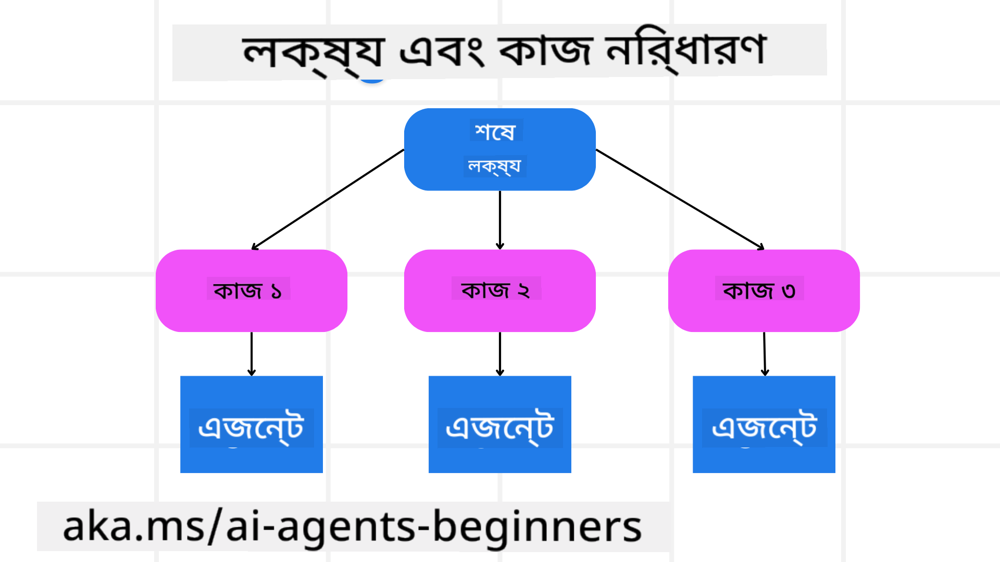

<!--
CO_OP_TRANSLATOR_METADATA:
{
  "original_hash": "43069833a0412210ad5c3cc93d9c2146",
  "translation_date": "2025-09-18T14:34:58+00:00",
  "source_file": "07-planning-design/README.md",
  "language_code": "bn"
}
-->
[](https://youtu.be/kPfJ2BrBCMY?si=9pYpPXp0sSbK91Dr)

> _(উপরের ছবিতে ক্লিক করে এই পাঠের ভিডিও দেখুন)_

# পরিকল্পনা ডিজাইন

## ভূমিকা

এই পাঠে আলোচনা করা হবে:

* একটি স্পষ্ট সামগ্রিক লক্ষ্য নির্ধারণ এবং জটিল কাজকে পরিচালনাযোগ্য অংশে বিভক্ত করা।
* কাঠামোবদ্ধ আউটপুট ব্যবহার করে আরও নির্ভরযোগ্য এবং মেশিন-পঠনযোগ্য উত্তর তৈরি করা।
* গতিশীল কাজ এবং অপ্রত্যাশিত ইনপুট পরিচালনার জন্য ইভেন্ট-চালিত পদ্ধতি প্রয়োগ করা।

## শেখার লক্ষ্য

এই পাঠ শেষ করার পর, আপনি বুঝতে পারবেন:

* একটি AI এজেন্টের জন্য সামগ্রিক লক্ষ্য নির্ধারণ এবং নিশ্চিত করা যে এটি স্পষ্টভাবে জানে কী অর্জন করতে হবে।
* জটিল কাজকে পরিচালনাযোগ্য উপ-কাজে বিভক্ত করা এবং সেগুলিকে একটি যৌক্তিক ক্রমে সংগঠিত করা।
* এজেন্টদের সঠিক সরঞ্জাম (যেমন, সার্চ টুল বা ডেটা অ্যানালিটিক্স টুল) দিয়ে সজ্জিত করা, কখন এবং কীভাবে সেগুলি ব্যবহার করা হবে তা নির্ধারণ করা এবং উদ্ভূত অপ্রত্যাশিত পরিস্থিতি পরিচালনা করা।
* উপ-কাজের ফলাফল মূল্যায়ন করা, কর্মক্ষমতা পরিমাপ করা এবং চূড়ান্ত আউটপুট উন্নত করতে পদক্ষেপ পুনরাবৃত্তি করা।

## সামগ্রিক লক্ষ্য নির্ধারণ এবং কাজকে বিভক্ত করা



বেশিরভাগ বাস্তব জীবনের কাজ এক ধাপে সম্পন্ন করার জন্য খুব জটিল। একটি AI এজেন্টের পরিকল্পনা এবং কর্ম পরিচালনার জন্য একটি সংক্ষিপ্ত উদ্দেশ্য প্রয়োজন। উদাহরণস্বরূপ, লক্ষ্য হতে পারে:

    "একটি ৩ দিনের ভ্রমণ পরিকল্পনা তৈরি করুন।"

যদিও এটি বলার জন্য সহজ, এটি এখনও পরিমার্জন প্রয়োজন। লক্ষ্য যত স্পষ্ট হবে, এজেন্ট (এবং যেকোনো মানব সহযোগী) সঠিক ফলাফল অর্জনে তত বেশি মনোযোগ দিতে পারবে, যেমন একটি সম্পূর্ণ ভ্রমণ পরিকল্পনা তৈরি করা যা ফ্লাইট অপশন, হোটেল সুপারিশ এবং কার্যকলাপের প্রস্তাবনা অন্তর্ভুক্ত করে।

### কাজ বিভাজন

বড় বা জটিল কাজগুলোকে ছোট, লক্ষ্য-ভিত্তিক উপ-কাজে বিভক্ত করলে তা আরও পরিচালনাযোগ্য হয়ে ওঠে। 
ভ্রমণ পরিকল্পনার উদাহরণে, লক্ষ্যকে নিম্নলিখিতভাবে বিভক্ত করা যেতে পারে:

* ফ্লাইট বুকিং
* হোটেল বুকিং
* গাড়ি ভাড়া
* ব্যক্তিগতকরণ

প্রতিটি উপ-কাজ তারপর নির্দিষ্ট এজেন্ট বা প্রক্রিয়ার মাধ্যমে পরিচালিত হতে পারে। একটি এজেন্ট সেরা ফ্লাইট ডিল খুঁজে বের করার জন্য বিশেষজ্ঞ হতে পারে, অন্যটি হোটেল বুকিংয়ে মনোযোগ দিতে পারে, ইত্যাদি। একটি সমন্বয়কারী বা "ডাউনস্ট্রিম" এজেন্ট এই ফলাফলগুলোকে একত্রিত করে ব্যবহারকারীর জন্য একটি সামগ্রিক পরিকল্পনা তৈরি করতে পারে।

এই মডুলার পদ্ধতি ধাপে ধাপে উন্নতির সুযোগ দেয়। উদাহরণস্বরূপ, আপনি খাদ্য সুপারিশ বা স্থানীয় কার্যকলাপের প্রস্তাবনার জন্য বিশেষ এজেন্ট যোগ করতে পারেন এবং সময়ের সাথে পরিকল্পনাটি পরিমার্জন করতে পারেন।

### কাঠামোবদ্ধ আউটপুট

বড় ভাষার মডেল (LLMs) কাঠামোবদ্ধ আউটপুট (যেমন JSON) তৈরি করতে পারে যা ডাউনস্ট্রিম এজেন্ট বা পরিষেবাগুলোর জন্য বিশ্লেষণ এবং প্রক্রিয়াকরণ সহজ করে। এটি বিশেষভাবে একটি বহু-এজেন্ট প্রসঙ্গে কার্যকর, যেখানে আমরা পরিকল্পনার আউটপুট পাওয়ার পর এই কাজগুলো সম্পাদন করতে পারি। একটি দ্রুত ওভারভিউ পেতে নিচের উদাহরণটি দেখুন।

নিম্নলিখিত পাইথন কোড স্নিপেট একটি সাধারণ পরিকল্পনা এজেন্টকে লক্ষ্যকে উপ-কাজে বিভক্ত করে এবং একটি কাঠামোবদ্ধ পরিকল্পনা তৈরি করতে দেখায়:

```python
from pydantic import BaseModel
from enum import Enum
from typing import List, Optional, Union
import json
import os
from typing import Optional
from pprint import pprint
from autogen_core.models import UserMessage, SystemMessage, AssistantMessage
from autogen_ext.models.azure import AzureAIChatCompletionClient
from azure.core.credentials import AzureKeyCredential

class AgentEnum(str, Enum):
    FlightBooking = "flight_booking"
    HotelBooking = "hotel_booking"
    CarRental = "car_rental"
    ActivitiesBooking = "activities_booking"
    DestinationInfo = "destination_info"
    DefaultAgent = "default_agent"
    GroupChatManager = "group_chat_manager"

# Travel SubTask Model
class TravelSubTask(BaseModel):
    task_details: str
    assigned_agent: AgentEnum  # we want to assign the task to the agent

class TravelPlan(BaseModel):
    main_task: str
    subtasks: List[TravelSubTask]
    is_greeting: bool

client = AzureAIChatCompletionClient(
    model="gpt-4o-mini",
    endpoint="https://models.inference.ai.azure.com",
    # To authenticate with the model you will need to generate a personal access token (PAT) in your GitHub settings.
    # Create your PAT token by following instructions here: https://docs.github.com/en/authentication/keeping-your-account-and-data-secure/managing-your-personal-access-tokens
    credential=AzureKeyCredential(os.environ["GITHUB_TOKEN"]),
    model_info={
        "json_output": False,
        "function_calling": True,
        "vision": True,
        "family": "unknown",
    },
)

# Define the user message
messages = [
    SystemMessage(content="""You are an planner agent.
    Your job is to decide which agents to run based on the user's request.
                      Provide your response in JSON format with the following structure:
{'main_task': 'Plan a family trip from Singapore to Melbourne.',
 'subtasks': [{'assigned_agent': 'flight_booking',
               'task_details': 'Book round-trip flights from Singapore to '
                               'Melbourne.'}
    Below are the available agents specialised in different tasks:
    - FlightBooking: For booking flights and providing flight information
    - HotelBooking: For booking hotels and providing hotel information
    - CarRental: For booking cars and providing car rental information
    - ActivitiesBooking: For booking activities and providing activity information
    - DestinationInfo: For providing information about destinations
    - DefaultAgent: For handling general requests""", source="system"),
    UserMessage(
        content="Create a travel plan for a family of 2 kids from Singapore to Melboune", source="user"),
]

response = await client.create(messages=messages, extra_create_args={"response_format": 'json_object'})

response_content: Optional[str] = response.content if isinstance(
    response.content, str) else None
if response_content is None:
    raise ValueError("Response content is not a valid JSON string" )

pprint(json.loads(response_content))

# # Ensure the response content is a valid JSON string before loading it
# response_content: Optional[str] = response.content if isinstance(
#     response.content, str) else None
# if response_content is None:
#     raise ValueError("Response content is not a valid JSON string")

# # Print the response content after loading it as JSON
# pprint(json.loads(response_content))

# Validate the response content with the MathReasoning model
# TravelPlan.model_validate(json.loads(response_content))
```

### বহু-এজেন্ট সমন্বয়ের সাথে পরিকল্পনা এজেন্ট

এই উদাহরণে, একটি সেমান্টিক রাউটার এজেন্ট ব্যবহারকারীর অনুরোধ গ্রহণ করে (যেমন, "আমার ভ্রমণের জন্য একটি হোটেল পরিকল্পনা দরকার।")।

পরিকল্পনাকারী তারপর:

* হোটেল পরিকল্পনা গ্রহণ করে: পরিকল্পনাকারী ব্যবহারকারীর বার্তা গ্রহণ করে এবং একটি সিস্টেম প্রম্পটের (যেখানে উপলব্ধ এজেন্টের বিবরণ অন্তর্ভুক্ত থাকে) ভিত্তিতে একটি কাঠামোবদ্ধ ভ্রমণ পরিকল্পনা তৈরি করে।
* এজেন্ট এবং তাদের সরঞ্জাম তালিকাভুক্ত করে: এজেন্ট রেজিস্ট্রি একটি তালিকা ধরে রাখে (যেমন, ফ্লাইট, হোটেল, গাড়ি ভাড়া এবং কার্যকলাপের জন্য) এবং তাদের প্রদত্ত ফাংশন বা সরঞ্জাম।
* পরিকল্পনাটি সংশ্লিষ্ট এজেন্টদের কাছে রুট করে: উপ-কাজের সংখ্যা অনুযায়ী, পরিকল্পনাকারী বার্তাটি সরাসরি একটি নির্দিষ্ট এজেন্টের কাছে পাঠায় (একক কাজের পরিস্থিতিতে) অথবা বহু-এজেন্ট সহযোগিতার জন্য একটি গ্রুপ চ্যাট ম্যানেজারের মাধ্যমে সমন্বয় করে।
* ফলাফল সংক্ষেপ করে: অবশেষে, পরিকল্পনাকারী স্পষ্টতার জন্য তৈরি পরিকল্পনাটি সংক্ষেপ করে।

নিম্নলিখিত পাইথন কোড স্যাম্পল এই ধাপগুলো চিত্রিত করে:

```python

from pydantic import BaseModel

from enum import Enum
from typing import List, Optional, Union

class AgentEnum(str, Enum):
    FlightBooking = "flight_booking"
    HotelBooking = "hotel_booking"
    CarRental = "car_rental"
    ActivitiesBooking = "activities_booking"
    DestinationInfo = "destination_info"
    DefaultAgent = "default_agent"
    GroupChatManager = "group_chat_manager"

# Travel SubTask Model

class TravelSubTask(BaseModel):
    task_details: str
    assigned_agent: AgentEnum # we want to assign the task to the agent

class TravelPlan(BaseModel):
    main_task: str
    subtasks: List[TravelSubTask]
    is_greeting: bool
import json
import os
from typing import Optional

from autogen_core.models import UserMessage, SystemMessage, AssistantMessage
from autogen_ext.models.openai import AzureOpenAIChatCompletionClient

# Create the client with type-checked environment variables

client = AzureOpenAIChatCompletionClient(
    azure_deployment=os.getenv("AZURE_OPENAI_DEPLOYMENT_NAME"),
    model=os.getenv("AZURE_OPENAI_DEPLOYMENT_NAME"),
    api_version=os.getenv("AZURE_OPENAI_API_VERSION"),
    azure_endpoint=os.getenv("AZURE_OPENAI_ENDPOINT"),
    api_key=os.getenv("AZURE_OPENAI_API_KEY"),
)

from pprint import pprint

# Define the user message

messages = [
    SystemMessage(content="""You are an planner agent.
    Your job is to decide which agents to run based on the user's request.
    Below are the available agents specialized in different tasks:
    - FlightBooking: For booking flights and providing flight information
    - HotelBooking: For booking hotels and providing hotel information
    - CarRental: For booking cars and providing car rental information
    - ActivitiesBooking: For booking activities and providing activity information
    - DestinationInfo: For providing information about destinations
    - DefaultAgent: For handling general requests""", source="system"),
    UserMessage(content="Create a travel plan for a family of 2 kids from Singapore to Melbourne", source="user"),
]

response = await client.create(messages=messages, extra_create_args={"response_format": TravelPlan})

# Ensure the response content is a valid JSON string before loading it

response_content: Optional[str] = response.content if isinstance(response.content, str) else None
if response_content is None:
    raise ValueError("Response content is not a valid JSON string")

# Print the response content after loading it as JSON

pprint(json.loads(response_content))
```

পূর্ববর্তী কোডের আউটপুট নিচে দেখানো হয়েছে এবং আপনি এই কাঠামোবদ্ধ আউটপুটটি `assigned_agent`-এ রুট করতে এবং ব্যবহারকারীর জন্য ভ্রমণ পরিকল্পনাটি সংক্ষেপ করতে ব্যবহার করতে পারেন।

```json
{
    "is_greeting": "False",
    "main_task": "Plan a family trip from Singapore to Melbourne.",
    "subtasks": [
        {
            "assigned_agent": "flight_booking",
            "task_details": "Book round-trip flights from Singapore to Melbourne."
        },
        {
            "assigned_agent": "hotel_booking",
            "task_details": "Find family-friendly hotels in Melbourne."
        },
        {
            "assigned_agent": "car_rental",
            "task_details": "Arrange a car rental suitable for a family of four in Melbourne."
        },
        {
            "assigned_agent": "activities_booking",
            "task_details": "List family-friendly activities in Melbourne."
        },
        {
            "assigned_agent": "destination_info",
            "task_details": "Provide information about Melbourne as a travel destination."
        }
    ]
}
```

পূর্ববর্তী কোড স্যাম্পল সহ একটি উদাহরণ নোটবুক [এখানে](07-autogen.ipynb) উপলব্ধ।

### পুনরাবৃত্তিমূলক পরিকল্পনা

কিছু কাজের জন্য একটি পিছনে-পেছনে বা পুনরায় পরিকল্পনার প্রয়োজন হয়, যেখানে একটি উপ-কাজের ফলাফল পরবর্তী কাজকে প্রভাবিত করে। উদাহরণস্বরূপ, যদি এজেন্ট ফ্লাইট বুকিংয়ের সময় একটি অপ্রত্যাশিত ডেটা ফরম্যাট আবিষ্কার করে, তবে এটি হোটেল বুকিংয়ে যাওয়ার আগে তার কৌশলটি মানিয়ে নিতে পারে।

এছাড়াও, ব্যবহারকারীর প্রতিক্রিয়া (যেমন, একজন মানুষ সিদ্ধান্ত নেয় যে তারা একটি আগের ফ্লাইট পছন্দ করে) একটি আংশিক পুনরায় পরিকল্পনা ট্রিগার করতে পারে। এই গতিশীল, পুনরাবৃত্তিমূলক পদ্ধতি নিশ্চিত করে যে চূড়ান্ত সমাধান বাস্তব জীবনের সীমাবদ্ধতা এবং পরিবর্তিত ব্যবহারকারীর পছন্দের সাথে সামঞ্জস্যপূর্ণ।

উদাহরণস্বরূপ কোড:

```python
from autogen_core.models import UserMessage, SystemMessage, AssistantMessage
#.. same as previous code and pass on the user history, current plan
messages = [
    SystemMessage(content="""You are a planner agent to optimize the
    Your job is to decide which agents to run based on the user's request.
    Below are the available agents specialized in different tasks:
    - FlightBooking: For booking flights and providing flight information
    - HotelBooking: For booking hotels and providing hotel information
    - CarRental: For booking cars and providing car rental information
    - ActivitiesBooking: For booking activities and providing activity information
    - DestinationInfo: For providing information about destinations
    - DefaultAgent: For handling general requests""", source="system"),
    UserMessage(content="Create a travel plan for a family of 2 kids from Singapore to Melbourne", source="user"),
    AssistantMessage(content=f"Previous travel plan - {TravelPlan}", source="assistant")
]
# .. re-plan and send the tasks to respective agents
```

আরও বিস্তৃত পরিকল্পনার জন্য Magnetic One দেখুন যা জটিল কাজ সমাধানে সহায়ক।

## সারসংক্ষেপ

এই নিবন্ধে আমরা দেখেছি কীভাবে একটি পরিকল্পনাকারী তৈরি করা যায় যা উপলব্ধ এজেন্টদের সংজ্ঞায়িত করে এবং তাদের নির্দিষ্ট কাজগুলিতে গতিশীলভাবে নির্বাচন করে। পরিকল্পনাকারীর আউটপুট কাজগুলোকে বিভক্ত করে এবং এজেন্টদের বরাদ্দ করে যাতে সেগুলো সম্পাদিত হতে পারে। ধরে নেওয়া হয় যে এজেন্টদের সেই ফাংশন/সরঞ্জামগুলোর অ্যাক্সেস রয়েছে যা কাজ সম্পাদনের জন্য প্রয়োজন। এজেন্টদের পাশাপাশি আপনি অন্যান্য প্যাটার্ন যেমন রিফ্লেকশন, সংক্ষেপক এবং রাউন্ড রবিন চ্যাট অন্তর্ভুক্ত করতে পারেন যাতে আরও কাস্টমাইজ করা যায়।

## অতিরিক্ত সম্পদ

AutoGen Magnetic One - একটি সাধারণত বহু-এজেন্ট সিস্টেম যা জটিল কাজ সমাধানের জন্য এবং বহু চ্যালেঞ্জিং এজেন্টিক বেঞ্চমার্কে চিত্তাকর্ষক ফলাফল অর্জন করেছে। রেফারেন্স:

. এই বাস্তবায়নে অর্কেস্ট্রেটর কাজ-নির্দিষ্ট পরিকল্পনা তৈরি করে এবং এই কাজগুলো উপলব্ধ এজেন্টদের কাছে অর্পণ করে। পরিকল্পনার পাশাপাশি অর্কেস্ট্রেটর একটি ট্র্যাকিং মেকানিজমও ব্যবহার করে কাজের অগ্রগতি পর্যবেক্ষণ করতে এবং প্রয়োজন অনুযায়ী পুনরায় পরিকল্পনা করতে।

### পরিকল্পনা ডিজাইন প্যাটার্ন সম্পর্কে আরও প্রশ্ন আছে?

[Azure AI Foundry Discord](https://aka.ms/ai-agents/discord)-এ যোগ দিন, যেখানে আপনি অন্যান্য শিক্ষার্থীদের সাথে দেখা করতে পারবেন, অফিস আওয়ার্সে অংশ নিতে পারবেন এবং আপনার AI এজেন্ট সম্পর্কিত প্রশ্নের উত্তর পেতে পারবেন।

## পূর্ববর্তী পাঠ

[বিশ্বাসযোগ্য AI এজেন্ট তৈরি করা](../06-building-trustworthy-agents/README.md)

## পরবর্তী পাঠ

[বহু-এজেন্ট ডিজাইন প্যাটার্ন](../08-multi-agent/README.md)

---

**অস্বীকৃতি**:  
এই নথিটি AI অনুবাদ পরিষেবা [Co-op Translator](https://github.com/Azure/co-op-translator) ব্যবহার করে অনুবাদ করা হয়েছে। আমরা যথাসম্ভব সঠিক অনুবাদ প্রদানের চেষ্টা করি, তবে অনুগ্রহ করে মনে রাখবেন যে স্বয়ংক্রিয় অনুবাদে ত্রুটি বা অসঙ্গতি থাকতে পারে। মূল ভাষায় থাকা নথিটিকে প্রামাণিক উৎস হিসেবে বিবেচনা করা উচিত। গুরুত্বপূর্ণ তথ্যের জন্য, পেশাদার মানব অনুবাদ সুপারিশ করা হয়। এই অনুবাদ ব্যবহারের ফলে কোনো ভুল বোঝাবুঝি বা ভুল ব্যাখ্যা হলে আমরা তার জন্য দায়ী থাকব না।