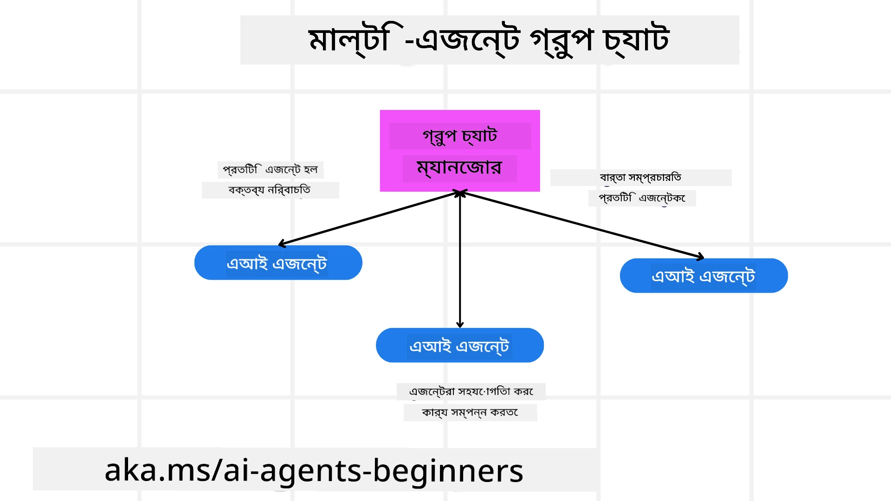
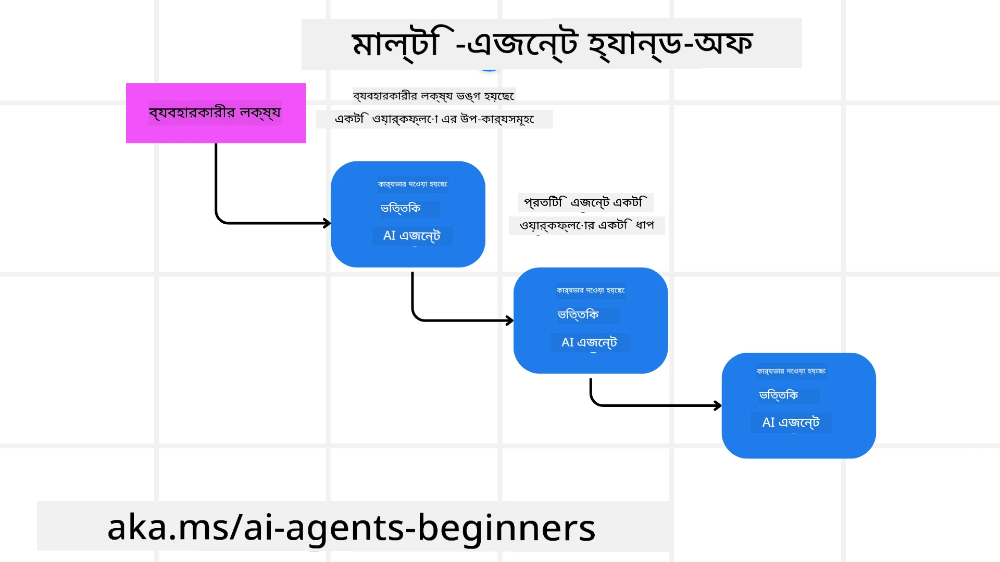
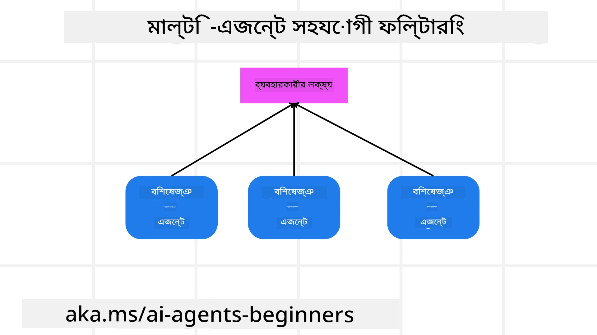

> _(এই পাঠটির ভিডিও দেখতে উপরোক্ত ছবি ক্লিক করুন)_

# মাল্টি-এজেন্ট ডিজাইন প্যাটার্নস

যখনই আপনি এমন একটি প্রকল্পে কাজ শুরু করবেন যেখানে একাধিক এজেন্ট জড়িত, তখন আপনাকে মাল্টি-এজেন্ট ডিজাইন প্যাটার্ন বিবেচনা করতে হবে। তবে, কখন মাল্টি-এজেন্টে স্যুইচ করতে হবে এবং এর সুবিধাগুলো কী তা তৎক্ষণাৎ স্পষ্ট নাও হতে পারে।

## পরিচিতি

এই পাঠে, আমরা নিম্নলিখিত প্রশ্নগুলোর উত্তর খুঁজব:

- কোন পরিস্থিতিতে মাল্টি-এজেন্ট ব্যবহারযোগ্য?
- কেন একক এজেন্টের পরিবর্তে মাল্টি-এজেন্ট ব্যবহার করা উচিত?
- মাল্টি-এজেন্ট ডিজাইন প্যাটার্ন বাস্তবায়নের মূল উপাদানগুলো কী কী?
- কীভাবে একাধিক এজেন্ট পরস্পরের সাথে কীভাবে ইন্টারঅ্যাক্ট করছে তা দেখা যাবে?

## শেখার লক্ষ্য

এই পাঠের পর, আপনি সক্ষম হবেন:

- মাল্টি-এজেন্ট ব্যবহারের উপযুক্ত পরিস্থিতি চিহ্নিত করতে
- একক এজেন্টের তুলনায় মাল্টি-এজেন্ট ব্যবহারের সুবিধাগুলো চিনতে
- মাল্টি-এজেন্ট ডিজাইন প্যাটার্ন বাস্তবায়নের মূল উপাদানগুলো বুঝতে

বড় ছবিটা কী?

*মাল্টি-এজেন্ট এমন একটি ডিজাইন প্যাটার্ন যা একাধিক এজেন্টকে সম্মিলিতভাবে কাজ করে একটি সাধারণ লক্ষ্য অর্জন করতে সাহায্য করে*।

এই প্যাটার্নটি রোবোটিক্স, স্বয়ংক্রিয় সিস্টেম, এবং বিতরণকৃত কম্পিউটিং সহ বিভিন্ন ক্ষেত্রে ব্যাপকভাবে ব্যবহৃত হয়।

## মাল্টি-এজেন্ট ব্যবহারের উপযোগী পরিস্থিতি

তাহলে কোন পরিস্থিতিগুলোতে মাল্টি-এজেন্ট ব্যবহারে সুবিধা হবে? উত্তর হলো, অনেক পরিস্থিতিতে একাধিক এজেন্ট নিয়োগ করা উপকারী, বিশেষত নিম্নলিখিত ক্ষেত্রে:

- **বৃহৎ কাজের পরিমাণ**: বড় কাজগুলো ছোট ছোট টাসকে ভাগ করা যায় এবং বিভিন্ন এজেন্টকে সরবরাহ করা যায়, যা সমান্তরাল প্রক্রিয়াকরণ এবং দ্রুত সমাপ্তি নিশ্চিত করে। এর উদাহরণ হলো বড় ডেটা প্রক্রিয়াকরণের কাজ।
- **জটিল কাজ**: বড় কাজের মতো, জটিল কাজগুলো ছোট সাবটাস্কে ভেঙে বিভিন্ন এজেন্টকে দেওয়া যায়, যারা প্রতিটি নির্দিষ্ট দিক বিশেষজ্ঞ। যেমন স্বয়ংক্রিয় যানবাহনের ক্ষেত্রে, নেভিগেশন, প্রতিবন্ধকতা সনাক্তকরণ, এবং অন্য গাড়ির সাথে যোগাযোগের জন্য বিভিন্ন এজেন্ট থাকে।
- **বিবিধ দক্ষতা**: বিভিন্ন এজেন্ট বিভিন্ন দক্ষতা নিয়ে থাকে, যা একক এজেন্টের তুলনায় কাজের বিভিন্ন দিক আরও দক্ষতার সঙ্গে পরিচালনা করতে সক্ষম। স্বাস্থ্যসেবায় এর উদাহরণ যেমন এজেন্টরা تشخیص, চিকিৎসা পরিকল্পনা, এবং রোগী পর্যবেক্ষণ পরিচালনা করে।

## একক এজেন্টের থেকে মাল্টি-এজেন্ট ব্যবহারের সুবিধা

একটি একক এজেন্ট সিস্টেম সহজ কাজের জন্য ভাল কাজ করতে পারে, কিন্তু জটিল কাজের জন্য মাল্টি-এজেন্ট ব্যবহারে কয়েকটি সুবিধা থাকে:

- **বিশেষীকরণ**: প্রতিটি এজেন্ট নির্দিষ্ট একটি কাজের জন্য বিশেষায়িত হতে পারে। যদি একক এজেন্ট বিশেষীকরণ না থাকে, তাহলে এটি সবকিছু করতে পারলেও জটিল কাজে বিভ্রান্ত হতে পারে। উদাহরণস্বরূপ, এটি এমন একটি কাজ করতে পারে যা তার জন্য সর্বোত্তম নয়।
- **স্কেলযোগ্যতা**: একক এজেন্টকে অতিরিক্ত বোঝার থেকে বরং বেশি এজেন্ট যোগ করে সিস্টেম স্কেল করা সহজ।
- **ফল্ট টলারেন্স**: যদি একটি এজেন্ট বিকল হয়ে যায়, অন্যরা কাজ চালিয়ে যেতে পারে, যা সিস্টেমের বিশ্বাসযোগ্যতা নিশ্চিত করে।

উদাহরণ হিসাবে, একটি ব্যবহারকারীর জন্য একটি ভ্রমণ বুক করা হোক। একটি একক এজেন্ট সিস্টেম সব রকম দায়িত্ব—যেমন ফ্লাইট খোঁজা, হোটেল এবং কার ভাড়া বুকিং—নিয়ন্ত্রণ করবে। একক এজেন্টের মাধ্যমে এটা অর্জন করতে, এজেন্টের কাছে এই সব কাজ করার টুল থাকতে হবে, যা জটিল এবং মনোলিথিক সিস্টেম সৃষ্টি করতে পারে যা রক্ষণাবেক্ষণ এবং স্কেল করা কঠিন। অপরদিকে, মাল্টি-এজেন্ট সিস্টেমে ফ্লাইট খোঁজার, হোটেল এবং কার ভাড়া বুকিংয়ের জন্য পৃথক এজেন্ট থাকবে। ফলে সিস্টেমটি আরও মডুলার, রক্ষণাবেক্ষণ সহজ এবং স্কেলযোগ্য হয়।

মাতৃত্ব-পিতৃত্ব পরিচালিত একটি ট্রাভেল এজেন্সির সাথে ফ্র্যাঞ্চাইজির তুলনা করুন। মাতৃত্ব-পিতৃত্ব দোকানে একক এজেন্ট সমস্ত ভ্রমণ বুকিংয়ের কাজ পরিচালনা করবে, অথচ ফ্র্যাঞ্চাইজিতে আলাদা আলাদা এজেন্ট বিভিন্ন দায়িত্বে নিয়োজিত থাকবে।

## মাল্টি-এজেন্ট ডিজাইন প্যাটার্ন বাস্তবায়নের বুনিয়াদি উপাদান

মাল্টি-এজেন্ট ডিজাইন প্যাটার্ন বাস্তবায়নের আগে, প্যাটার্নটি গঠনে থাকা উপাদানগুলো বুঝতে হবে।

চিন্তা করুন ব্যবহারকারীর জন্য ট্রিপ বুকিংয়ের উদাহরণ। এই ক্ষেত্রে, বুনিয়াদি উপাদানগুলো হতে পারে:

- **এজেন্ট যোগাযোগ**: ফ্লাইট খোঁজার, হোটেল এবং কার ভাড়া বুক করার এজেন্টদের ব্যবহারকারীর পছন্দ এবং শর্তাবলী সম্পর্কে তথ্য আদান-প্রদান করতে হবে। যোগাযোগের প্রোটোকল ও পদ্ধতি নির্ধারণ করতে হবে। উদাহরণস্বরূপ, ফ্লাইট খোঁজার এজেন্ট হোটেল বুকিং এজেন্টের সঙ্গে যোগাযোগ করবে যেন ফ্লাইটের তারিখ অনুযায়ী হোটেল বুক হয়। অর্থাৎ এজেন্টগুলোকে ব্যবহারকারীর ভ্রমণের তারিখ শেয়ার করতে হবে, যার ক্ষেত্রে আপনাকে সিদ্ধান্ত নিতে হবে *কোন এজেন্ট গুলো তথ্য শেয়ার করছে এবং কীভাবে শেয়ার করছে*।
- **সমন্বয় পদ্ধতি**: এজেন্টরা ব্যবহারকারীর পছন্দ ও শর্তাবলীগুলো পূরণ করার জন্য তাদের কাজ সমন্বয় করবে। উদাহরণস্বরূপ, ব্যবহারকারী বিমানবন্দর সংলগ্ন হোটেল চায়, কিন্তু কার ভাড়া শুধুমাত্র বিমানবন্দর থেকে পাওয়া যায়। তাই হোটেল বুকিং এজেন্টকে কার ভাড়া এজেন্টের সঙ্গে সমন্বয় করতে হবে। এর মানে, আপনাকে সিদ্ধান্ত নিতে হবে *কীভাবে এজেন্টরা তাদের কার্যাবলি সমন্বয় করছে*।
- **এজেন্ট আর্কিটেকচার**: এজেন্টদের অভ্যন্তরীণ কাঠামো থাকতে হবে যাতে তারা সিদ্ধান্ত নিতে পারে এবং ব্যবহারকারীর সঙ্গে তাদের ইন্টারঅ্যাকশন থেকে শিখতে পারে। যেমন ফ্লাইট খোঁজার এজেন্টের উচিত ফ্লাইট প্রস্তাব দেওয়ার জন্য সিদ্ধান্ত নেওয়ার ক্ষমতা থাকা। অর্থাৎ আপনাকে নির্ধারণ করতে হবে *কীভাবে এজেন্টরা সিদ্ধান্ত নিচ্ছে এবং ব্যবহারকারীর সঙ্গে ইন্টারঅ্যাকশন থেকে শিখছে*। উদাহরণস্বরূপ, ফ্লাইট খোঁজার এজেন্ট মেশিন লার্নিং মডেল ব্যবহার করতে পারে অতীত পছন্দের ভিত্তিতে ফ্লাইট সাজেস্ট করতে।
- **মাল্টি-এজেন্ট ইন্টারঅ্যাকশনে দৃশ্যমানতা**: আপনাকে জানতে হবে একাধিক এজেন্ট পরস্পরের সাথে কীভাবে ইন্টারঅ্যাক্ট করছে। এজন্য এজেন্ট কার্যাবলি এবং ইন্টারঅ্যাকশন ট্র্যাক করার টুল এবং পদ্ধতি থাকা দরকার। যেমন লগিং, মনিটরিং টুল, ভিজ্যুয়ালাইজেশন টুল, এবং পারফরম্যান্স মেট্রিক্স।
- **মাল্টি-এজেন্ট প্যাটার্নস**: মাল্টি-এজেন্ট সিস্টেমে বিভিন্ন প্যাটার্ন রয়েছে, যেমন কেন্দ্রীভূত, বিকেন্দ্রীভূত, এবং হাইব্রিড আর্কিটেকচার। আপনাকে আপনার ব্যবহারের জন্য সঠিক প্যাটার্ন নির্ধারণ করতে হবে।
- **মানুষকে অন্তর্ভুক্ত করা**: বেশির ভাগ ক্ষেত্রে, একজন মানুষ ইন্টারভেনশন করবে এবং আপনাকে নির্দেশ দিতে হবে কখন এজেন্টরা মানুষের সাহায্য চাইবে। যেমন ব্যবহারকারী একটি নির্দিষ্ট হোটেল বা ফ্লাইট চাইতে পারে যা এজেন্টরা সুপারিশ করেনি, অথবা বুকিংয়ের আগে নিশ্চিতকরণ চাওয়া হতে পারে।

## মাল্টি-এজেন্ট ইন্টারঅ্যাকশনে দৃশ্যমানতা

আপনার জানা উচিত একাধিক এজেন্ট পরস্পরের সাথে কিভাবে ইন্টারঅ্যাক্ট করছে। এই দৃশ্যমানতা ত্রুটি খুঁজে বের করতে, উন্নত করতে এবং সিস্টেমের সামগ্রিক কার্যকারিতা নিশ্চিত করতে অপরিহার্য। এর জন্য এজেন্ট কার্যাবলি ও ইন্টারঅ্যাকশন ট্র্যাক করার জন্য লগিং, মনিটরিং টুল, ভিজ্যুয়ালাইজেশন টুল এবং পারফরম্যান্স মেট্রিক্স ব্যবহার করতে হয়।

উদাহরণস্বরূপ, ব্যবহারকারীর জন্য ট্রিপ বুকিংয়ের ক্ষেত্রে একটি ড্যাশবোর্ড থাকতে পারে যা প্রতিটি এজেন্টের অবস্থা, ব্যবহারকারীর পছন্দ ও শর্তাবলী এবং এজেন্টদের মধ্যে ইন্টারঅ্যাকশন দেখায়। এই ড্যাশবোর্ড ব্যবহারকারীর ভ্রমণের তারিখ, ফ্লাইট এজেন্টের সুনির্দিষ্ট ফ্লাইট প্রস্তাব, হোটেল এজেন্টের প্রস্তাবিত হোটেল এবং কার ভাড়া এজেন্টের প্রস্তাবিত গাড়ি প্রদর্শন করবে। এতে দেখতে পারবেন এজেন্ট কিভাবে একে অপরের সাথে কাজ করছে এবং ব্যবহারকারীর পছন্দ ও শর্তাবলী পূরণ হচ্ছে কিনা।

চলুন প্রতিটি দিক বিস্তারিত দেখি।

- **লগিং এবং মনিটরিং টুল**: আপনি চান প্রতিটি এজেন্টের কাজ লগ হোক। একটি লগ এন্ট্রি এজেন্টের নাম, করা কাজ, কাজের সময় ও ফলাফল সংরক্ষণ করবে। এই তথ্য ডিবাগিং, অপ্টিমাইজিং এবং অন্যান্য কাজে ব্যবহৃত হবে।

- **ভিজ্যুয়ালাইজেশন টুল**: ভিজ্যুয়ালাইজেশন টুল এজেন্টদের মধ্যে তথ্য প্রবাহ দেখাতে সাহায্য করে, যা বোঝা সহজ এবং ত্রুটি শনাক্ত করতে সুবিধা দেয়। যেমন, একটি গ্রাফ থাকতে পারে যা এজেন্টদের মধ্যে তথ্যের প্রবাহ দেখাবে।

- **পারফরম্যান্স মেট্রিক্স**: পারফরম্যান্স মেট্রিক্স মাল্টি-এজেন্ট সিস্টেমের কার্যকারিতার মান নির্ণয় করতে সাহায্য করে। যেমন, একটি কাজ শেষ করতে সময় নেওয়া, প্রতি ইউনিট সময়ে সম্পন্ন কাজের সংখ্যা, এবং এজেন্ট দ্বারা প্রস্তাবিত সুপারিশের যথার্থতা ইত্যাদি ট্র্যাক করা যায়। এর মাধ্যমে উন্নতির সুযোগ চিহ্নিত করা যায় এবং সিস্টেম অপ্টিমাইজ করা সম্ভব।

## মাল্টি-এজেন্ট প্যাটার্নস

মাল্টি-এজেন্ট অ্যাপ তৈরি করার জন্য কিছু নির্দিষ্ট প্যাটার্ন নিয়ে আলোচনা করা যাক। এখানে কিছু গুরুত্বপূর্ণ প্যাটার্ন:

### গ্রুপ চ্যাট

এই প্যাটার্ন ব্যবহার করে একটি গ্রুপ চ্যাট অ্যাপ্লিকেশন তৈরি করা যায় যেখানে একাধিক এজেন্ট পরস্পরের সঙ্গে যোগাযোগ করে। এই প্যাটার্ন ব্যবহার হয় দলীয় সহযোগিতা, কাস্টমার সাপোর্ট এবং সামাজিক নেটওয়ার্কের ক্ষেত্রে।

এখানে প্রতিটি এজেন্ট গ্রুপ চ্যাটের একটি ব্যবহারকারী হিসেবে কাজ করে এবং মেসেজ বিনিময়ের জন্য একটি মেসেজিং প্রোটোকল ব্যবহৃত হয়। এজেন্টরা গ্রুপ চ্যাটে মেসেজ পাঠাতে পারে, গ্রুপ চ্যাট থেকে মেসেজ পেতে পারে, এবং অন্য এজেন্টদের মেসেজের উত্তর দিতে পারে।

এই প্যাটার্নটি কেন্দ্রীভূত আর্কিটেকচারে যেখানে সব মেসেজ কেন্দ্রীয় সার্ভারে যায়, অথবা বিকেন্দ্রীভূত আর্কিটেকচারে যেখানে মেসেজ সরাসরি বিনিময় হয়, বাস্তবায়িত হতে পারে।

### হ্যান্ড-অফ

এই প্যাটার্ন ব্যবহৃত হয় যেখানে একাধিক এজেন্ট কাজ পরস্পরের কাছে হস্তান্তর করে।

এর ব্যবহার ক্ষেত্র যেমন কাস্টমার সাপোর্ট, কাজ ব্যবস্থাপনা, এবং ওয়ার্কফ্লো অটোমেশন।

এই প্যাটার্নে প্রতিটি এজেন্ট একটি কাজ বা ওয়ার্কফ্লোর একটি ধাপ হিসাবে প্রতিনিধিত্ব করে এবং পূর্বনির্ধারিত নিয়ম অনুযায়ী কাজ অন্য এজেন্টকে হস্তান্তর করতে পারে।

### সহযোগিতামূলক ফিল্টারিং

এই প্যাটার্ন ব্যবহৃত হয় যখন একাধিক এজেন্ট ব্যবহারকারীদের সুপারিশ তৈরিতে সহযোগিতা করে।

কেন একাধিক এজেন্ট সহযোগিতা করবে? কারণ প্রতিটি এজেন্ট ভিন্ন দক্ষতা রাখে এবং সুপারিশ প্রক্রিয়ায় বিভিন্নভাবে অবদান রাখতে পারে।

উদাহরণস্বরূপ, একজন ব্যবহারকারী স্টক মার্কেটে কিনার জন্য সেরা স্টকের সুপারিশ চাইছেন।

- **শিল্প বিশেষজ্ঞ**: একজন এজেন্ট নির্দিষ্ট শিল্পের বিশেষজ্ঞ হতে পারে।
- **প্রযুক্তিগত বিশ্লেষণ**: অন্য একজন এজেন্ট প্রযুক্তিগত বিশ্লেষণে দক্ষ হতে পারে।
- **মৌলিক বিশ্লেষণ**: আরেকজন এজেন্ট মৌলিক বিশ্লেষণে পারদর্শী হতে পারে। এই এজেন্টগুলো সহযোগিতা করে ব্যবহারকারীর জন্য আরো সম্পূর্ণ সুপারিশ দিতে পারে।

## পরিস্থিতি: রিফান্ড প্রক্রিয়া

ধরুন একজন গ্রাহক একটি পণ্যের জন্য রিফান্ড পেতে চাইছেন, এ প্রক্রিয়াতে অনেক এজেন্ট জড়িত হতে পারে। তবে আসুন এজেন্টগুলোকে দুই ভাগে ভাগ করি: রিফান্ড প্রক্রিয়ার জন্য নির্দিষ্ট এজেন্ট এবং সাধারণ এজেন্ট যা আপনার ব্যবসার অন্যান্য অংশেও ব্যবহারযোগ্য।

**রিফান্ড প্রক্রিয়ার নির্দিষ্ট এজেন্ট**:

নিম্নলিখিত এজেন্টগুলি রিফান্ড প্রক্রিয়ায় জড়িত থাকতে পারে:

- **গ্রাহক এজেন্ট**: গ্রাহক প্রতিনিধিত্ব করে এবং রিফান্ড প্রক্রিয়া শুরু করে।
- **বিক্রেতা এজেন্ট**: বিক্রেতার পক্ষে রিফান্ড প্রক্রিয়া সম্পন্ন করে।
- **পেমেন্ট এজেন্ট**: পেমেন্ট প্রক্রিয়া প্রতিনিধিত্ব করে এবং গ্রাহকের পেমেন্ট রিফান্ড করে।
- **সমাধান এজেন্ট**: সমস্যা সমাধানে দায়িত্বশীল, রিফান্ড প্রক্রিয়ায় উত্থাপিত যেকোনো সমস্যা মোকাবিলা করে।
- **নিয়ন্ত্রণ এজেন্ট**: রিফান্ড প্রক্রিয়া বিধি ও নীতিমালা অনুসারে চলছে কি না নিশ্চিত করে।

**সাধারণ এজেন্ট**:

এগুলো আপনার ব্যবসার অন্যান্য অংশেও ব্যবহার করা যায়।

- **শিপিং এজেন্ট**: পণ্য বিক্রেতার কাছে ফেরত পাঠানোর জন্য শিপিং প্রক্রিয়া পরিচালনা করে। এটি রিফান্ড প্রক্রিয়া ও সাধারণ পণ্যের শিপিং উভয় ক্ষেত্রে ব্যবহারযোগ্য।
- **প্রতিক্রিয়া এজেন্ট**: গ্রাহকের ফিডব্যাক সংগ্রহ করে। ফিডব্যাক যেকোনো সময় নেওয়া যায়, শুধু রিফান্ড প্রক্রিয়াতে নয়।
- **এস্কেলেশন এজেন্ট**: সমস্যা উচ্চতর স্তরে পাঠায়। যেকোনো প্রক্রিয়ায় সমস্যা বড় হলে এই ধরনের এজেন্ট ব্যবহার করা যায়।
- **সূচনা এজেন্ট**: বিভিন্ন ধাপে গ্রাহককে নোটিফিকেশন পাঠানোর দায়িত্বে থাকে।
- **বিশ্লেষণ এজেন্ট**: রিফান্ড প্রক্রিয়ার ডেটা বিশ্লেষণ করে।
- **অডিট এজেন্ট**: রিফান্ড সঠিকভাবে চলছে কিনা তা নিরীক্ষণ করে।
- **রিপোর্টিং এজেন্ট**: রিফান্ড প্রক্রিয়ার রিপোর্ট তৈরি করে।
- **জ্ঞান এজেন্ট**: রিফান্ড ও অন্যান্য প্রক্রিয়ার জ্ঞানভাণ্ডার পরিচালনা করে।
- **নিরাপত্তা এজেন্ট**: রিফান্ড প্রক্রিয়ার নিরাপত্তা নিশ্চিত করে।
- **গুণগত মান এজেন্ট**: রিফান্ড প্রক্রিয়ার গুণগত মান নিশ্চিত করে।

উপরের এজেন্টগুলো রিফান্ড প্রক্রিয়ার জন্য নির্দিষ্ট এবং আপনার ব্যবসার অন্যান্য অংশেও কাজের জন্য সাধারণ এজেন্ট হিসেবে কাজ করতে পারে। আশা করছি এটি আপনাকে মাল্টি-এজেন্ট সিস্টেমে কোন এজেন্ট ব্যবহার করবেন তা বোঝাতে সাহায্য করবে।

## অ্যাসাইনমেন্ট

একটি কাস্টমার সাপোর্ট প্রক্রিয়ার জন্য মাল্টি-এজেন্ট সিস্টেম ডিজাইন করুন। প্রক্রিয়ায় জড়িত এজেন্টগুলো চিহ্নিত করুন, তাদের ভূমিকা এবং দায়িত্ব নির্ধারণ করুন এবং কীভাবে এরা পরস্পরের সাথে ইন্টারঅ্যাক্ট করবে তা বিবেচনা করুন। কাস্টমার সাপোর্ট প্রক্রিয়ার নির্দিষ্ট এজেন্ট ও ব্যবসার অন্যান্য অংশে ব্যবহারযোগ্য সাধারণ এজেন্ট দুটোই বিবেচনায় আনুন।
> পরবর্তী সমাধানটি পড়ার আগে একটি চিন্তা করুন, আপনি যেটি ভাবছেন তার চেয়ে বেশি এজেন্ট প্রয়োজন হতে পারে।

> TIP: গ্রাহক সমর্থন প্রক্রিয়ার বিভিন্ন ধাপ সম্পর্কে চিন্তা করুন এবং যেকোনো সিস্টেমের জন্য যে এজেন্ট প্রয়োজন হতে পারে সেটিও বিবেচনা করুন।

## সমাধান

[Solution](./solution/solution.md)

## জ্ঞান যাচাই

প্রশ্ন: কখন মাল্টি-এজেন্ট ব্যবহারের কথা বিবেচনা করা উচিত?

- [ ] A1: যখন আপনার ছোট কাজের পরিমাণ এবং একটি সহজ কাজ থাকে।
- [ ] A2: যখন আপনার বড় কাজের পরিমাণ থাকে
- [ ] A3: যখন আপনার একটি সহজ কাজ থাকে।

[Solution quiz](./solution/solution-quiz.md)

## সারাংশ

এই পাঠে, আমরা মাল্টি-এজেন্ট ডিজাইন প্যাটার্ন সম্পর্কে দেখেছি, যেখানে মাল্টি-এজেন্ট প্রযোজ্য, একক এজেন্টের পরিবর্তে মাল্টি-এজেন্ট ব্যবহারের সুবিধা, মাল্টি-এজেন্ট ডিজাইন প্যাটার্ন বাস্তবায়নের নির্মাণ ব্লক এবং কীভাবে একাধিক এজেন্ট একে অপরের সাথে ইন্টারঅ্যাক্ট করছে তা পর্যবেক্ষণ করা যায় তা আলোচনা করেছি।

### মাল্টি-এজেন্ট ডিজাইন প্যাটার্ন সম্পর্কে আরও প্রশ্ন আছে?

[Microsoft Foundry Discord](https://aka.ms/ai-agents/discord)-এ যোগ দিন অন্যান্য শিক্ষার্থীদের সাথে দেখা করতে, অফিস আওয়ারসে অংশ নিতে এবং আপনার AI Agents সম্পর্কে প্রশ্নের উত্তর পেতে।

## অতিরিক্ত উপকরণ

- <a href="https://learn.microsoft.com/azure/ai-services/agents/overview" target="_blank">Microsoft Agent Framework ডকুমেন্টেশন</a>
- <a href="https://www.analyticsvidhya.com/blog/2024/10/agentic-design-patterns/" target="_blank">Agentic ডিজাইন প্যাটার্নসমূহ</a>

## পূর্ববর্তী পাঠ

[Planning Design](../07-planning-design/README.md)

## পরবর্তী পাঠ

[Metacognition in AI Agents](../09-metacognition/README.md)

---

<!-- CO-OP TRANSLATOR DISCLAIMER START -->
**দায়িত্ব অস্বীকার**:  
এই দলিলটি AI অনুবাদ সেবা [Co-op Translator](https://github.com/Azure/co-op-translator) ব্যবহার করে অনূদিত হয়েছে। আমরা সঠিকতার জন্য চেষ্টা করি, কিন্তু স্বয়ংক্রিয় অনুবাদে ত্রুটি বা অসম্পূর্ণতা থাকতে পারে। মূল ভাষার মূল দলিলটিকে প্রামাণিক উৎস হিসেবে গ্রহণ করা উচিত। গুরুত্বপূর্ণ তথ্যের জন্য পেশাদার মানব অনুবাদ পরামর্শযোগ্য। এই অনুবাদের ব্যবহারের ফলে যেকোনো ভুল বোঝাবুঝি বা ভুল ব্যাখ্যার জন্য আমরা দায়বদ্ধ নই।
<!-- CO-OP TRANSLATOR DISCLAIMER END -->