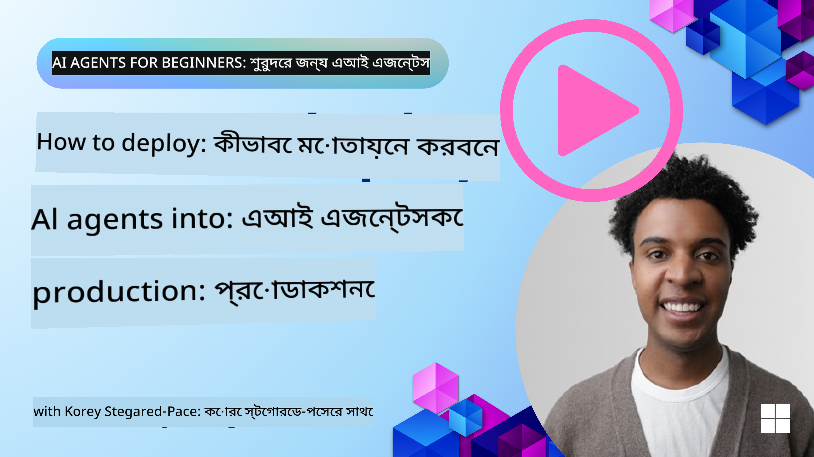

<!--
CO_OP_TRANSLATOR_METADATA:
{
  "original_hash": "1ad5de6a6388d02c145a92dd04358bab",
  "translation_date": "2025-07-12T13:36:54+00:00",
  "source_file": "10-ai-agents-production/README.md",
  "language_code": "bn"
}
-->

> _(উপরের ছবিতে ক্লিক করে এই পাঠের ভিডিও দেখুন)_
# প্রোডাকশনে AI এজেন্টস

## পরিচিতি

এই পাঠে আলোচনা করা হবে:

- কীভাবে আপনার AI Agent কে প্রোডাকশনে কার্যকরভাবে ডিপ্লয় করার পরিকল্পনা করবেন।
- প্রোডাকশনে AI Agent ডিপ্লয় করার সময় সাধারণ ভুল এবং সমস্যাগুলো যা আপনি সম্মুখীন হতে পারেন।
- কীভাবে খরচ নিয়ন্ত্রণ করবেন এবং একই সাথে আপনার AI Agent এর পারফরম্যান্স বজায় রাখবেন।

## শেখার লক্ষ্যসমূহ

এই পাঠ শেষ করার পর, আপনি জানতে পারবেন/বোঝাপড়া করবেন:

- প্রোডাকশনে AI Agent সিস্টেমের পারফরম্যান্স, খরচ এবং কার্যকারিতা উন্নত করার কৌশল।
- কীভাবে এবং কী মূল্যায়ন করবেন আপনার AI Agents।
- AI Agents প্রোডাকশনে ডিপ্লয় করার সময় খরচ নিয়ন্ত্রণ করার উপায়।

বিশ্বাসযোগ্য AI Agents ডিপ্লয় করা গুরুত্বপূর্ণ। "Building Trustworthy AI Agents" পাঠটিও দেখুন।

## AI Agents মূল্যায়ন

AI Agents ডিপ্লয় করার আগে, সময়ে এবং পরে, একটি সঠিক মূল্যায়ন ব্যবস্থা থাকা অত্যন্ত জরুরি। এটি নিশ্চিত করবে যে আপনার সিস্টেম আপনার এবং আপনার ব্যবহারকারীদের লক্ষ্যগুলোর সাথে সঙ্গতিপূর্ণ।

একটি AI Agent মূল্যায়ন করার জন্য, শুধুমাত্র এজেন্টের আউটপুট নয়, বরং পুরো সিস্টেমটিকেও মূল্যায়ন করার ক্ষমতা থাকা জরুরি যেখানে আপনার AI Agent কাজ করছে। এর মধ্যে অন্তর্ভুক্ত কিন্তু সীমাবদ্ধ নয়:

- প্রাথমিক মডেল অনুরোধ।
- ব্যবহারকারীর উদ্দেশ্য সনাক্ত করার এজেন্টের ক্ষমতা।
- কাজ সম্পাদনের জন্য সঠিক টুল সনাক্ত করার এজেন্টের ক্ষমতা।
- টুলের এজেন্টের অনুরোধের প্রতি প্রতিক্রিয়া।
- টুলের প্রতিক্রিয়া ব্যাখ্যা করার এজেন্টের ক্ষমতা।
- ব্যবহারকারীর এজেন্টের প্রতিক্রিয়ার প্রতি প্রতিক্রিয়া।

এটি আপনাকে উন্নতির ক্ষেত্রগুলো আরও মডুলার উপায়ে চিহ্নিত করতে সাহায্য করে। এরপর আপনি মডেল, প্রম্পট, টুল এবং অন্যান্য উপাদানের পরিবর্তনের প্রভাব আরও দক্ষতার সাথে পর্যবেক্ষণ করতে পারবেন।

## AI Agents এর সাধারণ সমস্যা এবং সম্ভাব্য সমাধান

| **সমস্যা**                                    | **সম্ভাব্য সমাধান**                                                                                                                                                                                                        |
| ---------------------------------------------- | -------------------------------------------------------------------------------------------------------------------------------------------------------------------------------------------------------------------------- |
| AI Agent কাজগুলো ধারাবাহিকভাবে সম্পাদন করছে না | - AI Agent কে দেওয়া প্রম্পট পরিমার্জন করুন; উদ্দেশ্য স্পষ্ট করুন। - কাজগুলোকে ছোট ছোট অংশে ভাগ করে একাধিক এজেন্ট দ্বারা পরিচালনা করার সুযোগ খুঁজুন।                                                               |
| AI Agent অবিরত লুপে আটকে যাচ্ছে              | - নিশ্চিত করুন স্পষ্ট সমাপ্তির শর্তাবলী আছে যাতে এজেন্ট জানে কখন প্রক্রিয়া বন্ধ করতে হবে। - যুক্তি ও পরিকল্পনা প্রয়োজন এমন জটিল কাজের জন্য, যুক্তি নির্ভর কাজের জন্য বিশেষায়িত বড় মডেল ব্যবহার করুন।              |
| AI Agent টুল কলগুলো সঠিকভাবে কাজ করছে না      | - এজেন্ট সিস্টেমের বাইরে টুলের আউটপুট পরীক্ষা ও যাচাই করুন। - টুলের নির্ধারিত প্যারামিটার, প্রম্পট এবং নামকরণ পরিমার্জন করুন।                                                                                         |
| মাল্টি-এজেন্ট সিস্টেম ধারাবাহিকভাবে কাজ করছে না | - প্রতিটি এজেন্টকে দেওয়া প্রম্পট পরিমার্জন করুন যাতে তারা স্পষ্ট এবং একে অপর থেকে আলাদা হয়। - কোন এজেন্ট সঠিক তা নির্ধারণের জন্য "রাউটিং" বা কন্ট্রোলার এজেন্ট ব্যবহার করে একটি শ্রেণীবদ্ধ সিস্টেম তৈরি করুন।             |

## খরচ নিয়ন্ত্রণ

প্রোডাকশনে AI Agents ডিপ্লয় করার খরচ নিয়ন্ত্রণের জন্য কিছু কৌশল:

- **রেসপন্স ক্যাশিং** - সাধারণ অনুরোধ এবং কাজগুলো চিহ্নিত করে, সেগুলোর উত্তর আগে থেকেই প্রদান করা একটি ভালো উপায় যাতে একই ধরনের অনুরোধের পরিমাণ কমে। আরও সাধারণ AI মডেল ব্যবহার করে একটি ফ্লো তৈরি করতে পারেন যা চিহ্নিত করবে অনুরোধটি ক্যাশ করা অনুরোধের সাথে কতটা মিল রয়েছে।

- **ছোট মডেল ব্যবহার** - ছোট ভাষা মডেল (SLMs) নির্দিষ্ট এজেন্টিক ব্যবহারের ক্ষেত্রে ভালো পারফরম্যান্স দিতে পারে এবং খরচ অনেক কমিয়ে দেয়। আগেই বলা হয়েছে, একটি মূল্যায়ন ব্যবস্থা তৈরি করে বড় মডেলের সাথে পারফরম্যান্স তুলনা করা সেরা উপায় SLM কতটা ভালো কাজ করবে তা বুঝতে।

- **রাউটার মডেল ব্যবহার** - একটি অনুরূপ কৌশল হলো বিভিন্ন মডেল এবং আকার ব্যবহার করা। আপনি একটি LLM/SLM বা সার্ভারলেস ফাংশন ব্যবহার করে জটিলতার ভিত্তিতে অনুরোধগুলো সঠিক মডেলে রাউট করতে পারেন। এটি খরচ কমাবে এবং সঠিক কাজের জন্য পারফরম্যান্স নিশ্চিত করবে।

## অভিনন্দন

এটি বর্তমানে "AI Agents for Beginners" এর শেষ পাঠ।

আমরা এই ক্রমবর্ধমান শিল্পে প্রতিক্রিয়া এবং পরিবর্তনের ভিত্তিতে আরও পাঠ যোগ করার পরিকল্পনা করছি, তাই ভবিষ্যতে আবার আসবেন।

যদি আপনি AI Agents নিয়ে শেখা এবং তৈরি চালিয়ে যেতে চান, তাহলে <a href="https://discord.gg/kzRShWzttr" target="_blank">Azure AI Community Discord</a>-এ যোগ দিন।

আমরা সেখানে কর্মশালা, কমিউনিটি রাউন্ডটেবিল এবং "যেকোনো কিছু জিজ্ঞাসা করুন" সেশন হোস্ট করি।

আমাদের কাছে Learn কালেকশনে অতিরিক্ত উপকরণ রয়েছে যা আপনাকে প্রোডাকশনে AI Agents তৈরি শুরু করতে সাহায্য করবে।

## পূর্ববর্তী পাঠ

[মেটাকগনিশন ডিজাইন প্যাটার্ন](../09-metacognition/README.md)

## পরবর্তী পাঠ

[MCP](../11-mcp/README.md)

**অস্বীকৃতি**:  
এই নথিটি AI অনুবাদ সেবা [Co-op Translator](https://github.com/Azure/co-op-translator) ব্যবহার করে অনূদিত হয়েছে। আমরা যথাসাধ্য সঠিকতার চেষ্টা করি, তবে স্বয়ংক্রিয় অনুবাদে ত্রুটি বা অসঙ্গতি থাকতে পারে। মূল নথিটি তার নিজস্ব ভাষায়ই কর্তৃত্বপূর্ণ উৎস হিসেবে বিবেচিত হওয়া উচিত। গুরুত্বপূর্ণ তথ্যের জন্য পেশাদার মানব অনুবাদ গ্রহণ করার পরামর্শ দেওয়া হয়। এই অনুবাদের ব্যবহারে সৃষ্ট কোনো ভুল বোঝাবুঝি বা ভুল ব্যাখ্যার জন্য আমরা দায়ী নই।