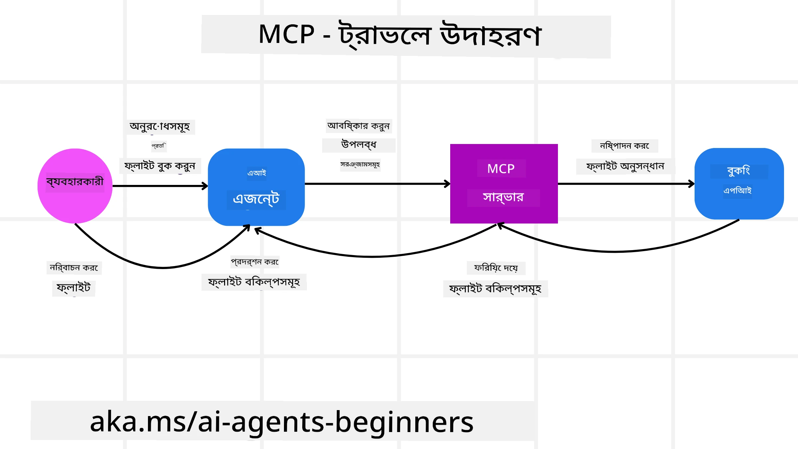
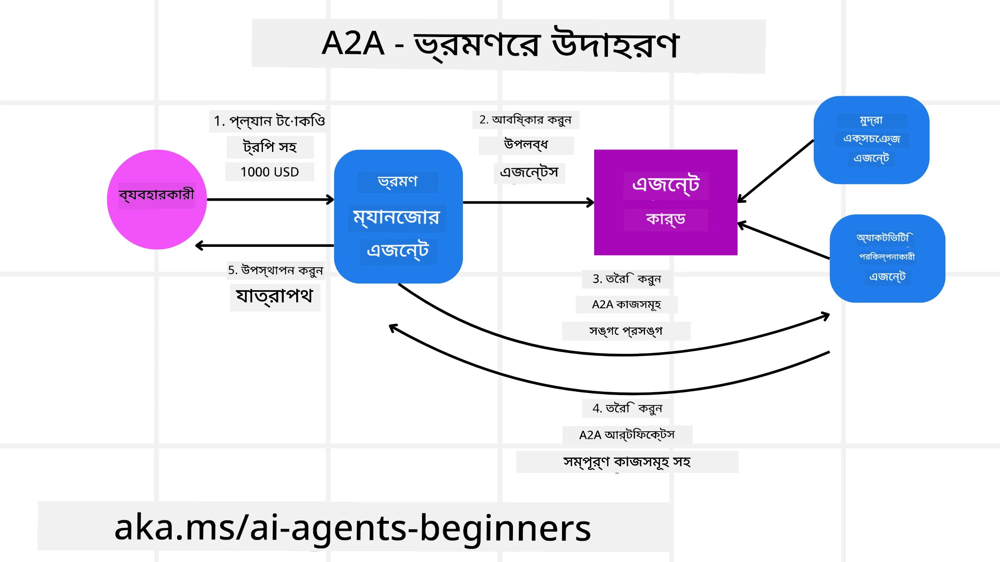
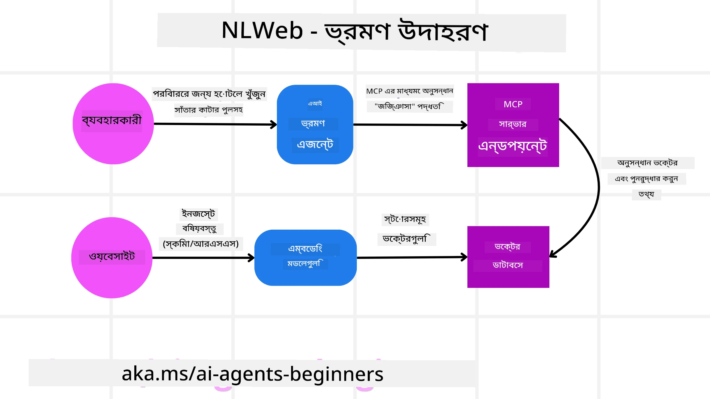

# এজেন্টিক প্রটোকল ব্যবহার (MCP, A2A এবং NLWeb)

> _(উপরে থাকা ছবিতে ক্লিক করে এই পাঠের ভিডিও দেখুন)_

যখন এআই এজেন্টগুলোর ব্যবহার বাড়ছে, তখন স্ট্যান্ডার্ডাইজেশন, নিরাপত্তা এবং খোলা নতুনত্ব নিশ্চিত করার জন্য প্রটোকলের প্রয়োজনীয়তাও বাড়ছে। এই পাঠে আমরা এই প্রয়োজন মেটাতে লক্ষ্য রাখা ৩টি প্রটোকল কভার করব — Model Context Protocol (MCP), Agent to Agent (A2A) এবং Natural Language Web (NLWeb)।

## পরিচিতি

এই পাঠে আমরা আলোচনা করব:

• কিভাবে **MCP** এআই এজেন্টগুলোকে ব্যবহারকারীর কাজ সম্পন্ন করতে বাইরের টুল এবং ডেটা অ্যাক্সেস করতে সক্ষম করে।

•  কিভাবে **A2A** আলাদা আলাদা এআই এজেন্টগুলোর মধ্যে যোগাযোগ ও সহযোগিতা সক্ষম করে।

• কিভাবে **NLWeb** যেকোনো ওয়েবসাইটে প্রাকৃতিক ভাষার ইন্টারফেস নিয়ে আসে যাতে এআই এজেন্টগুলো বিষয়বস্তু আবিস্কার এবং ইন্টারঅ্যাক্ট করতে পারে।

## শিক্ষার লক্ষ্য

• **চেনা** MCP, A2A, এবং NLWeb-এর প্রধান উদ্দেশ্য এবং সুবিধা কী এআই এজেন্টের প্রেক্ষাপটে।

• **বর্ণনা করা** কিভাবে প্রতিটি প্রটোকল LLM, টুল, এবং অন্যান্য এজেন্টদের মধ্যে যোগাযোগ ও ইন্টারঅ্যাকশন সহজ করে।

• **স্বীকৃতি** প্রতিটি প্রটোকল জটিল এজেন্টিক সিস্টেম নির্মাণে যে আলাদা ভূমিকা রাখে তা চিনে নেওয়া।

## Model Context Protocol

**Model Context Protocol (MCP)** একটি ওপেন স্ট্যান্ডার্ড যা অ্যাপ্লিকেশনগুলোকে LLM-গুলোর কাছে প্রসঙ্গ এবং টুল সরবরাহ করার একটি স্ট্যান্ডার্ডাইজড উপায় প্রদান করে। এটি বিভিন্ন ডেটা সোর্স এবং টুলের জন্য একটি "ইউনিভার্সাল অ্যাডাপ্টার" সক্ষম করে যা এআই এজেন্টগুলোকে একটি সামঞ্জস্যপূর্ণ উপায়ে সংযুক্ত হতে দেয়।

আসুন MCP-এর উপাদানগুলো, সরাসরি API ব্যবহারের তুলনায় সুবিধাগুলো, এবং কিভাবে এআই এজেন্টগুলো একটি MCP সার্ভার ব্যবহার করতে পারে তার একটি উদাহরণ দেখি।

### MCP মূল উপাদানসমূহ

MCP একটি **ক্লায়েন্ট-সার্ভার আর্কিটেকচারে** কাজ করে এবং মূল উপাদানগুলো হল:

• **Hosts** হল LLM অ্যাপ্লিকেশনসমূহ (উদাহরণস্বরূপ VSCode-এর মত একটি কোড এডিটর) যা MCP সার্ভারের সাথে সংযোগ শুরু করে।

• **Clients** হল হোস্ট অ্যাপ্লিকেশনের ভিতরে উপাদানগুলি যা সার্ভারের সাথে এক-এক সংযোগ রক্ষণ করে।

• **Servers** হল হালকা ওজনের প্রোগ্রাম যা নির্দিষ্ট সক্ষমতাগুলো প্রকাশ করে।

প্রটোকলে তিনটি মূল প্রিমিটিভ অন্তর্ভুক্ত রয়েছে যা একটি MCP সার্ভারের সক্ষমতা:

• **Tools**: এগুলো পৃথক অ্যাকশন বা ফাংশন যেগুলো একটি এআই এজেন্ট কল করে কোনো কাজ করার জন্য ব্যবহার করতে পারে। উদাহরণস্বরূপ, একটি আবহাওয়া সার্ভিস একটি "get weather" টুল প্রকাশ করতে পারে, বা একটি ই-কমার্স সার্ভার একটি "purchase product" টুল প্রকাশ করতে পারে। MCP সার্ভারগুলো তাদের সক্ষমতার তালিকায় প্রতিটি টুলের নাম, বিবরণ, এবং ইনপুট/আউটপুট স্কিমা বিজ্ঞাপন করে।

• **Resources**: এগুলো হল রিড-অনলি ডেটা আইটেম বা ডকুমেন্ট যা একটি MCP সার্ভার প্রদান করতে পারে, এবং ক্লায়েন্টগুলো প্রয়োজন অনুযায়ী সেগুলো পুনরুদ্ধার করতে পারে। উদাহরণস্বরূপ ফাইল কনটেন্ট, ডাটাবেস রেকর্ড, বা লগ ফাইল। Resources টেক্সট (যেমন কোড বা JSON) অথবা বাইনারি (যেমন ইমেজ বা PDF) হতে পারে।

• **Prompts**: এগুলো পূর্বনির্ধারিত টেমপ্লেট যা প্রস্তাবিত প্রম্পট প্রদান করে, আরও জটিল ওয়ার্কফ্লোকে সহায়তা করে।

### MCP-এর সুবিধাসমূহ

MCP এআই এজেন্টদের জন্য উল্লেখযোগ্য সুবিধা প্রদান করে:

• **ডায়নামিক টুল আবিষ্কার**: এজেন্টগুলো সার্ভার থেকে উপলভ্য টুলগুলোর একটি তালিকা ডায়নামিকভাবে পেতে পারে পাশাপাশি তারা কী করে তার বিবরণও পায়। এটি প্রচলিত APIগুলোর সাথে তুলনায় আলাদা, যেখানে ইন্টিগ্রেশনের জন্য প্রায়ই স্থির কোডিং প্রয়োজন হয়, যার মানে কোনো API পরিবর্তন হলে কোড আপডেট করতে হয়। MCP একটি "একবার ইন্টিগ্রেট করুন" পদ্ধতি অফার করে, যা বেশি মানিয়ে নেওয়ার সক্ষমতা দেয়।

• **বিভিন্ন LLM-এ আন্তঃঅপার্য়েবিলিটি**: MCP বিভিন্ন LLM-এ কাজ করে, কোর মডেল পরিবর্তন করে কর্মক্ষমতা মূল্যায়ন করার জন্য নমনীয়তা দেয়।

• **স্ট্যান্ডার্ডাইজড নিরাপত্তা**: MCP একটি স্ট্যান্ডার্ড প্রমাণীকরণ পদ্ধতি অন্তর্ভুক্ত করে, যা অতিরিক্ত MCP সার্ভারগুলোর অ্যাক্সেস যোগ করার সময় স্কেলেবিলিটি উন্নত করে। এটি বিভিন্ন প্রচলিত API-এর জন্য বিভিন্ন কী এবং প্রমাণীকরণ টাইপ পরিচালনার তুলনায় সহজ।

### MCP উদাহরণ

ধরুন একজন ব্যবহারকারী MCP কর্তৃক চালিত একটি AI সহকারী ব্যবহার করে একটি ফ্লাইট বুক করতে চান।

1. **সংযোগ**: AI সহকারী (MCP ক্লায়েন্ট) একটি এয়ারলাইনের প্রদান করা MCP সার্ভারের সাথে সংযুক্ত হয়।

2. **টুল আবিষ্কার**: ক্লায়েন্ট এয়ারলাইনের MCP সার্ভারকে জিজ্ঞাসা করে, "আপনার কাছে কোন কোন টুল উপলভ্য?" সার্ভার "search flights" এবং "book flights"-এর মত টুল সহ প্রতিক্রিয়া দেয়।

3. **টুল আহবান**: আপনি AI সহকারীকে বলেন, "অনুগ্রহ করে Portland থেকে Honolulu পর্যন্ত একটি ফ্লাইট খুঁজুন।" AI সহকারী, তার LLM ব্যবহার করে, শনাক্ত করে যে এটিকে "search flights" টুল কল করতে হবে এবং প্রাসঙ্গিক প্যারামিটার (origin, destination) MCP সার্ভারে পাঠায়।

4. **নিষ্পাদন এবং প্রতিক্রিয়া**: MCP সার্ভার, একটি র‍্যাপারের মতো কাজ করে, আসল এয়ারলাইনের অভ্যন্তরীণ বুকিং API-তে কল করে। এটি তারপর ফ্লাইট তথ্য (যেমন JSON ডেটা) গ্রহণ করে এবং AI সহকারীকে পাঠিয়ে দেয়।

5. **আরও ইন্টারঅ্যাকশন**: AI সহকারী ফ্লাইট অপশনগুলো উপস্থাপন করে। একবার আপনি একটি ফ্লাইট নির্বাচন করলে, সহকারী সম্ভবত একই MCP সার্ভারে "book flight" টুলটি আহ্বান করে, বুকিং সম্পন্ন করে।

## Agent-to-Agent Protocol (A2A)

যেখানে MCP LLM-গুলোকে টুলের সঙ্গে সংযুক্ত করার দিকে মনোযোগ দেয়, সেখানে **Agent-to-Agent (A2A) প্রটোকল** আরও এক ধাপ এগিয়ে যায় এবং বিভিন্ন এআই এজেন্টের মধ্যে যোগাযোগ ও সহযোগিতা সক্ষম করে। A2A বিভিন্ন সংস্থা, পরিবেশ এবং প্রযুক্তি স্ট্যাক জুড়ে এআই এজেন্টগুলোকে একটি ভাগ করা কাজ সম্পন্ন করতে সংযুক্ত করে।

আমরা A2A-এর উপাদানসমূহ এবং সুবিধাসমূহ পরীক্ষা করব, এবং আমাদের ট্রাভেল অ্যাপ্লিকেশনে এটি কিভাবে প্রয়োগ করা যেতে পারে তার একটি উদাহরণ দেখব।

### A2A মূল উপাদানসমূহ

A2A এজেন্টদের মধ্যে যোগাযোগ সক্ষম করা এবং তাদেরকে ব্যবহারকারীর একটি সাবটাস্ক সম্পন্ন করতে একসঙ্গে কাজ করানোতে নজর দেয়। প্রটোকলের প্রতিটি উপাদান এতে অবদান রাখে:

#### Agent Card

MCP সার্ভার কিভাবে টুলগুলোর একটি তালিকা শেয়ার করে তার মতোই, একটি Agent Card-এ থাকে:
- এজেন্টটির নাম .
- এটি যে সাধারণ কাজগুলো সম্পন্ন করে তার **বিবরণ**।
- অন্য এজেন্টদের (বা এমনকি মানব ব্যবহারকারীদের) সাহায্য করার জন্য **নির্দিষ্ট দক্ষতার একটি তালিকা** বর্ণনার সঙ্গে যাতে তারা বুঝতে পারে কখন এবং কেন তারা ঐ এজেন্টকে কল করতে চাইবে।
- এজেন্টের **বর্তমান Endpoint URL**
- এজেন্টের **সংস্করণ** এবং **ক্ষমতাসমূহ** যেমন স্ট্রিমিং রেসপন্স এবং পুশ নোটিফিকেশন।

#### Agent Executor

Agent Executor দায়িত্বপ্রাপ্ত **ব্যবহারকারী চ্যাটের প্রসঙ্গ দূরবর্তী এজেন্টকে পাঠানো**। দূরবর্তী এজেন্টের এই প্রসঙ্গের প্রয়োজন যাতে এটি সম্পন্ন করার কাজটি বুঝতে পারে। একটি A2A সার্ভারে, একটি এজেন্ট তার নিজের Large Language Model (LLM) ব্যবহার করে আগত অনুরোধগুলো পার্স করে এবং তার নিজস্ব অভ্যন্তরীণ টুল ব্যবহার করে কাজগুলো সম্পন্ন করে।

#### Artifact

একবার একটি দূরবর্তী এজেন্ট অনুরোধকৃত কাজ সম্পন্ন করলে, তার কাজের ফলাফলটি একটি artifact হিসাবে তৈরি হয়। একটি artifact **এজেন্টের কাজের ফলাফল ধারণ করে**, **কি সম্পন্ন করা হয়েছে তার বর্ণনা**, এবং প্রটোকলের মাধ্যমে পাঠানো **টেক্সট প্রসঙ্গ** থাকে। artifact পাঠানোর পর, দূরবর্তী এজেন্টের সাথে সংযোগ বন্ধ করা হয় যতক্ষণ না আবার প্রয়োজন হয়।

#### Event Queue

এই উপাদানটি **আপডেটগুলো হ্যান্ডল করা এবং মেসেজগুলি পাঠানো**-এর জন্য ব্যবহৃত হয়। এটি প্রোডাকশনে এজেন্টিক সিস্টেমগুলোর জন্য বিশেষভাবে গুরুত্বপূর্ণ যাতে কাজ সম্পন্ন হওয়ার আগে এজেন্টগুলোর মধ্যে সংযোগ বন্ধ হয়ে না যায়, বিশেষত যখন কাজ সম্পন্ন হতে দীর্ঘ সময় লাগতে পারে।

### A2A-এর সুবিধাসমূহ

• **উন্নত সহযোগিতা**: এটি বিভিন্ন ভেন্ডর এবং প্ল্যাটফর্মের এজেন্টগুলোকে ইন্টারঅ্যাক্ট, প্রসঙ্গ ভাগাভাগি, এবং একসাথে কাজ করতে সক্ষম করে, প্রচলিতভাবে বিচ্ছিন্ন সিস্টেমগুলোর মধ্যে সিমলেস অটোমেশন সহজ করে।

• **মডেল নির্বাচন নমনীয়তা**: প্রতিটি A2A এজেন্ট সিদ্ধান্ত নিতে পারে কোন LLM এটি তার অনুরোধগুলো সার্ভিস করার জন্য ব্যবহার করবে, যা প্রতিটি এজেন্টের জন্য অপটিমাইজড বা ফাইন-টিউন্ড মডেল অনুমোদন করে, MCP-এর কিছু দৃশ্যে একক LLM সংযোগের বিপরীতে।

• **ইন-বিল্ট প্রমাণীকরণ**: প্রমাণীকরণ সরাসরি A2A প্রটোকলে ইন্টিগ্রেট করা আছে, এজেন্ট ইন্টারঅ্যাকশনের জন্য একটি শক্তিশালী নিরাপত্তা ফ্রেমওয়ার্ক প্রদান করে।

### A2A উদাহরণ

চল আমরা আমাদের ভ্রমণ বুকিং দৃশ্যপট বাড়াই, কিন্তু এবার A2A ব্যবহার করে।

1. **ব্যবহারকারীর অনুরোধ মাল্টি-এজেন্টকে**: একটি ব্যবহারকারী "ট্রাভেল এজেন্ট" A2A ক্লায়েন্ট/এজেন্টে ইন্টারঅ্যাক্ট করে, হয়তো বলে, "দয়া করে আগামী সপ্তাহে Honolulu-তে পুরো ট্রিপটি বুক করে দিন, যার মধ্যে ফ্লাইট, একটি হোটেল, এবং একটি ভাড়া গাড়ি অন্তর্ভুক্ত আছে।"

2. **ট্রাভেল এজেন্ট দ্বারা অর্কেস্ট্রেশন**: ট্রাভেল এজেন্ট এই জটিল অনুরোধটি গ্রহণ করে। এটি তার LLM ব্যবহার করে কাজ সম্পর্কে তর্ক করে সিদ্ধান্ত নেয় যে এটি অন্যান্য বিশেষায়িত এজেন্টদের সাথে ইন্টারঅ্যাক্ট করতে হবে।

3. **এজেন্ট-টু-এজেন্ট যোগাযোগ**: ট্রাভেল এজেন্ট তখন A2A প্রটোকল ব্যবহার করে ডাউনস্ট্রিম এজেন্টগুলোর সাথে সংযুক্ত হয়, যেমন এক "Airline Agent," একটি "Hotel Agent," এবং একটি "Car Rental Agent" যেগুলো বিভিন্ন কোম্পানি তৈরি করেছে।

4. **ডেলিগেটেড টাস্ক নির্বাহ**: ট্রাভেল এজেন্ট এই বিশেষায়িত এজেন্টদের কাছে নির্দিষ্ট কাজ পাঠায় (উদাহরণ: "Find flights to Honolulu," "Book a hotel," "Rent a car")। প্রতিটি বিশেষায়িত এজেন্ট তাদের নিজস্ব LLM চালায় এবং তাদের নিজস্ব টুল ব্যবহার করে (যেগুলো MCP সার্ভারও হতে পারে) বুকিংয়ের নির্দিষ্ট অংশটি সম্পন্ন করে।

5. **সমন্বিত প্রতিক্রিয়া**: একবার সব ডাউনস্ট্রিম এজেন্ট তাদের কাজ সম্পন্ন করলে, ট্রাভেল এজেন্ট ফলাফলগুলো (ফ্লাইট বিস্তারিত, হোটেল কনফার্মেশন, গাড়ি ভাড়া বুকিং) সংকলন করে এবং ব্যবহারকারীর কাছে একটি ব্যাপক, চ্যাট-স্টাইল প্রতিক্রিয়া পাঠায়।

## Natural Language Web (NLWeb)

ওয়েবসাইটগুলি দীর্ঘদিন ধরে ব্যবহারকারীদের ইন্টারনেট জুড়ে তথ্য ও ডেটা অ্যাক্সেস করার প্রধান মাধ্যম ছিল।

চলুন NLWeb-এর বিভিন্ন উপাদান, NLWeb-এর সুবিধাসমূহ এবং আমাদের ট্রাভেল অ্যাপ্লিকেশন দেখে কিভাবে NLWeb কাজ করে তা দেখি।

### NLWeb-এর উপাদানসমূহ

- **NLWeb Application (Core Service Code)**: যে সিস্টেমটি প্রাকৃতিক ভাষার প্রশ্ন প্রক্রিয়া করে। এটি প্ল্যাটফর্মের বিভিন্ন অংশকে সংযুক্ত করে উত্তর তৈরি করে। আপনি এটিকে ওয়েবসাইটের প্রাকৃতিক ভাষা ফিচারগুলো চালানোর **ইঞ্জিন** হিসাবে ভাবতে পারেন।

- **NLWeb Protocol**: এটি একটি **ওয়েবসাইটের সাথে প্রাকৃতিক ভাষার ইন্টারঅ্যাকশনের জন্য মৌলিক নিয়মগুলোর সেট**। এটি JSON ফরম্যাটে (প্রায়শই Schema.org ব্যবহার করে) প্রতিক্রিয়া পাঠায়। এর উদ্দেশ্য হল “AI ওয়েব”-এর জন্য একটি সরল ভিত্তি তৈরি করা, ঠিক যেমন HTML অনলাইনে ডকুমেন্ট শেয়ার করা সম্ভব করে তুলেছিল।

- **MCP Server (Model Context Protocol Endpoint)**: প্রতিটি NLWeb সেটআপটি একটি **MCP সার্ভার** হিসেবেও কাজ করে। এর মানে এটি অন্য AI সিস্টেমগুলির সাথে **টুল (যেমন একটি “ask” মেথড) এবং ডেটা শেয়ার** করতে পারে। বাস্তবে, এটি ওয়েবসাইটের কনটেন্ট এবং সক্ষমতাগুলোকে AI এজেন্টদের ব্যবহারযোগ্য করে তোলে, সাইটটিকে বৃহত্তর “এজেন্ট ইকোসিস্টেম”-এর অংশে পরিণত করে।

- **Embedding Models**: এই মডেলগুলো ওয়েবসাইটের কনটেন্টকে সংখ্যা-ভিত্তিক প্রতিনিধিত্বে রূপান্তর করতে ব্যবহৃত হয় যেগুলোকে ভেক্টর (embeddings) বলা হয়। এই ভেক্টরগুলো অর্থ ধারণ করে এমনভাবে যে কম্পিউটারেরা তুলনা ও সার্চ করতে পারে। এগুলো একটি বিশেষ ডাটাবেসে সংরক্ষিত হয়, এবং ব্যবহারকারীরা কোন embedding model তারা ব্যবহার করতে চায় তা নির্বাচন করতে পারে।

- **Vector Database (Retrieval Mechanism)**: এই ডাটাবেসটি **ওয়েবসাইট কনটেন্টের embeddings সংরক্ষণ করে**। কেউ প্রশ্ন করলে, NLWeb দ্রুত প্রাসঙ্গিক তথ্য খুঁজে পেতে ভেক্টর ডাটাবেসটি পরীক্ষা করে। এটি সম্ভাব্য উত্তরগুলোর একটি দ্রুত তালিকা প্রদান করে, সাদৃশ্যের ভিত্তিতে র‍্যাঙ্কিং করে। NLWeb বিভিন্ন ভেক্টর স্টোরেজ সিস্টেমের সাথে কাজ করে যেমন Qdrant, Snowflake, Milvus, Azure AI Search, এবং Elasticsearch।

### NLWeb উদাহরণ দেখে

আবার আমাদের ট্রাভেল বুকিং ওয়েবসাইটটি ভাবুন, কিন্তু এবার এটি NLWeb দ্বারা চালিত।

1. **ডেটা ইনজেশন**: ট্রাভেল ওয়েবসাইটের বিদ্যমান প্রোডাক্ট ক্যাটালগসমূহ (উদাহরণস্বরূপ ফ্লাইট লিস্টিং, হোটেল বর্ণনা, ট্যুর প্যাকেজ) Schema.org ব্যবহার করে ফরম্যাট করা হয় বা RSS ফিডের মাধ্যমে লোড করা হয়। NLWeb-এর টুলগুলি এই স্ট্রাকচার্ড ডেটা ইনজেস্ট করে, embeddings তৈরি করে, এবং সেগুলোকে স্থানীয় বা রিমোট ভেক্টর ডাটাবেসে সংরক্ষণ করে।

2. **প্রাকৃতিক ভাষার কুয়েরি (মানব)**: একটি ব্যবহারকারী ওয়েবসাইটে ভিজিট করে এবং মেনু নেভিগেট করার বদলে একটি চ্যাট ইন্টারফেসে টাইপ করে: "আমার জন্য আগামী সপ্তাহে Honolulu-এ কোন পরিবারের জন্য উপযুক্ত একটি হোটেল একটি সুইমিং পুলসহ খুঁজে দিন"।

3. **NLWeb প্রক্রিয়াকরণ**: NLWeb অ্যাপ্লিকেশন এই কুয়েরিটি গ্রহণ করে। এটি বুঝতে কুয়েরিটিকে একটি LLM-এ পাঠায় এবং একই সাথে প্রাসঙ্গিক হোটেল লিস্টিং খুঁজতে তার ভেক্টর ডাটাবেস সার্চ করে।

4. **সঠিক ফলাফল**: LLM ডাটাবেসের সার্চ ফলাফলগুলো ব্যাখ্যা করতে সাহায্য করে, "family-friendly," "pool," এবং "Honolulu" মাপকাঠি অনুযায়ী সেরা ম্যাচগুলো চিহ্নিত করে, এবং তারপর একটি প্রাকৃতিক ভাষার প্রতিক্রিয়া ফরম্যাট করে। সবচেয়ে গুরুত্বপূর্ণ, প্রতিক্রিয়াটি ওয়েবসাইটের ক্যাটালগ থেকে প্রকৃত হোটেলগুলোকে উল্লেখ করে, যে কোন গঠিত তথ্য এড়িয়ে চলে।

5. **AI এজেন্ট ইন্টারঅ্যাকশন**: যেহেতু NLWeb একটি MCP সার্ভার হিসেবে কাজ করে, একটি বাহ্যিক এআই ট্রাভেল এজেন্টও এই ওয়েবসাইটের NLWeb ইনস্ট্যান্সে সংযুক্ত হতে পারে। AI এজেন্টটি তারপর `ask("হোটেল দ্বারা প্রস্তাবিত কি Honolulu এলাকা তে কোন ভেগান-ফ্রেন্ডলি রেস্তোরাঁ আছে?")` MCP মেথডটি ব্যবহার করে ওয়েবসাইটটিকে সরাসরি কুয়েরি করতে পারে। NLWeb ইনস্ট্যান্সটি এটি প্রক্রিয়াজাত করবে, যদি রেস্তোরেন্ট ইনফরমেশন লোড করা থাকে তাহলে তার ডাটাবেস ব্যবহার করে, এবং একটি স্ট্রাকচার্ড JSON প্রতিক্রিয়া ফেরত দেবে।

### MCP/A2A/NLWeb সম্পর্কে আরও প্রশ্ন আছে?

Join the [Microsoft Foundry Discord](https://aka.ms/ai-agents/discord) to meet with other learners, attend office hours and get your AI Agents questions answered.

## Resources

- [MCP for Beginners](https://aka.ms/mcp-for-beginners)  
- [MCP Documentation](https://learn.microsoft.com/python/api/overview/azure/ai-projects-readme)
- [NLWeb Repo](https://github.com/nlweb-ai/NLWeb)
- [Microsoft Agent Framework](https://aka.ms/ai-agents-beginners/agent-framewrok)

---

<!-- CO-OP TRANSLATOR DISCLAIMER START -->
দায়মুক্তি:
এই নথিটি এআই অনুবাদ সেবা [Co-op Translator](https://github.com/Azure/co-op-translator) ব্যবহার করে অনুবাদ করা হয়েছে। যদিও আমরা সর্বোচ্চ যথাযথতার চেষ্টা করি, অনুগ্রহ করে জানুন যে স্বয়ংক্রিয় অনুবাদে ত্রুটি বা অসামঞ্জস্য থাকতে পারে। মূল ভাষায় থাকা মূল নথিটিকেই কর্তৃপক্ষপূর্ণ উৎস হিসেবে বিবেচনা করা উচিত। গুরুত্বপূর্ণ তথ্যের ক্ষেত্রে পেশাদার মানব অনুবাদ করা উত্তম। এই অনুবাদের ব্যবহার থেকে উদ্ভূত কোনো ভুলবোঝাবুঝি বা ভুল ব্যাখ্যার জন্য আমরা দায়ী নই।
<!-- CO-OP TRANSLATOR DISCLAIMER END -->