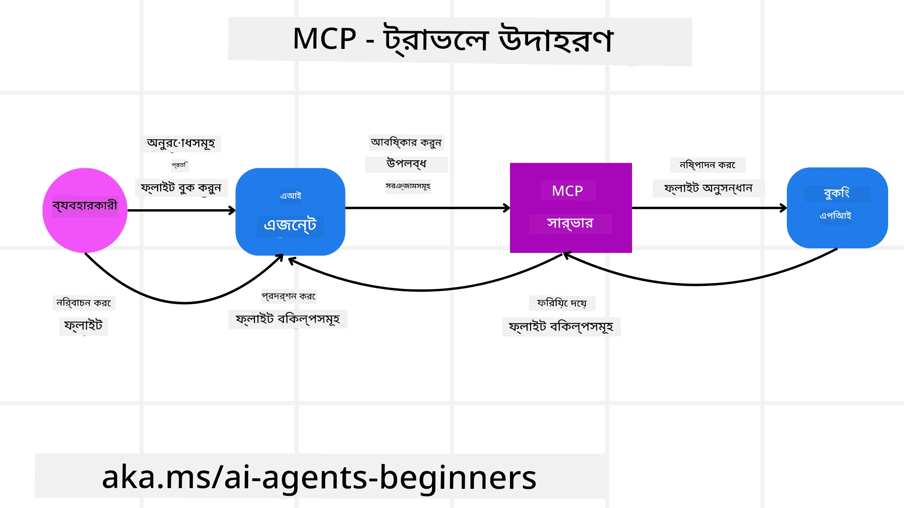
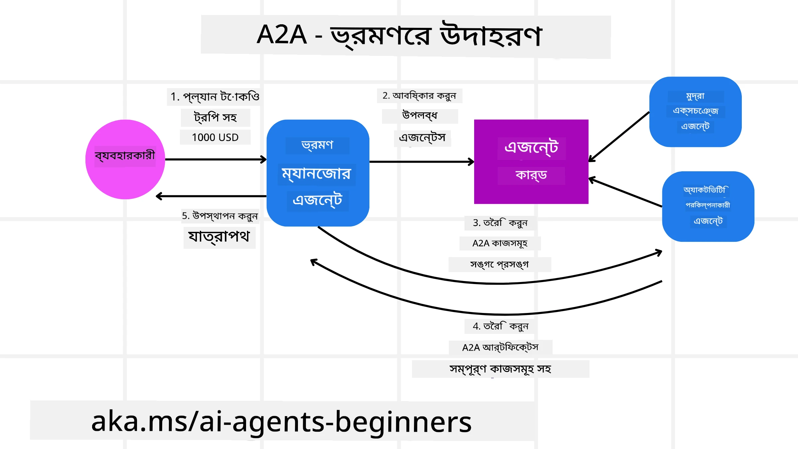
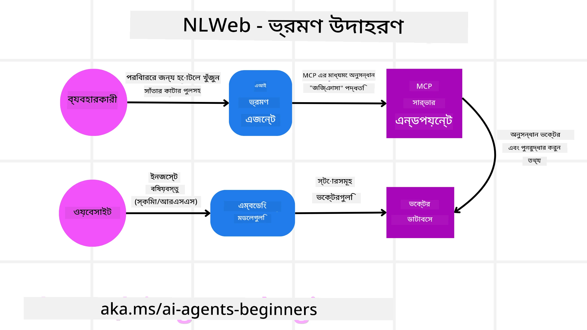

# এজেন্টিক প্রোটোকল ব্যবহার (MCP, A2A এবং NLWeb)

> _(এই পাঠের ভিডিও দেখার জন্য উপরের ছবিতে ক্লিক করুন)_

AI এজেন্টের ব্যবহার বৃদ্ধি পাওয়ায়, প্রয়োজনীয়তা বাড়ছে এমন প্রটোকলের যা স্ট্যান্ডার্ডাইজেশন, সুরক্ষা নিশ্চিত করে এবং উন্মুক্ত উদ্ভাবনকে সমর্থন করে। এই পাঠে, আমরা ৩টি প্রটোকল আলোচনা করব যা এই চাহিদা পূরণ করার জন্য খুঁজছে - মডেল কনটেক্সট প্রটোকল (MCP), এজেন্ট টু এজেন্ট (A2A) এবং ন্যাচুরাল ল্যাঙ্গুয়েজ ওয়েব (NLWeb)।

## পরিচিতি

এই পাঠে আমরা আলোচনা করব:

• কীভাবে **MCP** AI এজেন্টদের বাহ্যিক টুল এবং ডেটা অ্যাক্সেস করতে দেয় ব্যবহারকারীর কাজ সম্পন্ন করার জন্য।

• কীভাবে **A2A** বিভিন্ন AI এজেন্টদের মধ্যে যোগাযোগ এবং সহযোগিতা সক্ষম করে।

• কীভাবে **NLWeb** যেকোনো ওয়েবসাইটে প্রাকৃতিক ভাষার ইন্টারফেস নিয়ে আসে, যা AI এজেন্টদের বিষয়বস্তু আবিষ্কার এবং ইন্টারঅ্যাক্ট করতে সক্ষম করে।

## শেখার লক্ষ্য

• AI এজেন্টদের প্রসঙ্গে MCP, A2A এবং NLWeb এর মূল উদ্দেশ্য ও সুবিধাগুলো **চিহ্নিত** করা।

• প্রতিটি প্রটোকল কিভাবে LLM, টুল এবং অন্যান্য এজেন্টদের মধ্যে যোগাযোগ এবং ইন্টারঅ্যাকশন সহজ করে তা **ব্যাখ্যা** করা।

• জটিল এজেন্টিক সিস্টেম গঠনে প্রতিটি প্রটোকলের পৃথক ভূমিকা **স্মরণ** করা।

## মডেল কনটেক্সট প্রটোকল

**মডেল কনটেক্সট প্রটোকল (MCP)** একটি খোলা মান যা অ্যাপ্লিকেশনগুলোকে স্ট্যান্ডার্ড উপায়ে কনটেক্সট এবং টুল LLM-এ প্রদান করার সুযোগ দেয়। এটি একটি "সার্বজনীন অ্যাডাপ্টার" সম্ভব করে যা বিভিন্ন ডেটা উৎস এবং টুলসের সাথে AI এজেন্টদের কনসিস্টেন্টভাবে সংযুক্ত হতে দেয়।

আসুন MCP এর উপাদানগুলো, সরাসরি API ব্যবহারের তুলনায় এর সুবিধা এবং একটি উদাহরণ দেখি কীভাবে AI এজেন্ট একটি MCP সার্ভার ব্যবহার করতে পারে।

### MCP এর প্রধান উপাদান

MCP কাজ করে **ক্লায়েন্ট-সার্ভার আর্কিটেকচারে** এবং প্রধান উপাদানগুলো হল:

• **হোস্টস** হল LLM অ্যাপ্লিকেশন (যেমন VSCode এর মত একটি কোড এডিটর) যা MCP সার্ভারের সাথে সংযোগ শুরু করে।

• **ক্লায়েন্টস** হোস্ট অ্যাপ্লিকেশনের উপাদান যা সার্ভারের সাথে এক-এক করে সংযোগ বজায় রাখে।

• **সার্ভারস** হল হালকা ওজনের প্রোগ্রাম যা নির্দিষ্ট ক্ষমতা প্রকাশ করে।

প্রটোকলে তিনটি মূল প্রাথমিক উপাদান আছে যা MCP সার্ভারের ক্ষমতা:

• **টুলস**: এগুলো হল পৃথক কার্যকলাপ বা ফাংশন যা একটি AI এজেন্ট কল করতে পারে একটি কাজ সম্পাদনের জন্য। উদাহরণস্বরূপ, একটি আবহাওয়া সেবা "get weather" টুল প্রকাশ করতে পারে, অথবা একটি ই-কমার্স সার্ভার "purchase product" টুল প্রকাশ করতে পারে। MCP সার্ভার প্রতিটি টুলের নাম, বিবরণ এবং ইনপুট/আউটপুট স্কিমা তাদের ক্ষমতাগুলোর তালিকায় প্রকাশ করে।

• **রিসোর্সেস**: এগুলো হল রিড-অনলি ডেটা আইটেম বা ডকুমেন্ট যা MCP সার্ভার দিতে পারে, এবং ক্লায়েন্ট সেগুলোকে চাহিদা অনুযায়ী রিট্রিভ করতে পারে। যেমন ফাইল কনটেন্ট, ডাটাবেজ রেকর্ড, বা লগ ফাইল। রিসোর্স হতে পারে টেক্সট (যেমন কোড বা JSON) অথবা বাইনারি (যেমন ছবি বা PDF)।

• **প্রম্পটস**: এগুলো হল পূর্বনির্ধারিত টেমপ্লেট যা প্রস্তাবিত প্রম্পট দেয়, বেশি জটিল ওয়ার্কফ্লোকে সহজতর করে।

### MCP এর সুবিধা

MCP AI এজেন্টদের জন্য উল্লেখযোগ্য সুবিধা দেয়:

• **ডাইনামিক টুল ডিস্কভারি**: এজেন্টগুলো একটি সার্ভার থেকে পাওয়া উপলব্ধ টুলসের তালিকা এবং কাজের বিবরণ ডাইনামিক্যালি পেতে পারে। সাধারণ API-র তুলনায় যা প্রায়ই ইন্টিগ্রেশনের জন্য স্ট্যাটিক কোডিং প্রয়োজন, MCP "একবার ইন্টিগ্রেট করো" পদ্ধতি অফার করে, যা বেশি অভিযোজনযোগ্য।

• **বিভিন্ন LLM-এ ইন্টারঅপারেবিলিটি**: MCP বিভিন্ন LLM-এ কাজ করে, যা ভাল পারফরমেন্সের জন্য মডেল বদলাতে নমনীয়তা দেয়।

• **স্ট্যান্ডার্ডাইজড সিকিউরিটি**: MCP-তে স্ট্যান্ডার্ড অথেন্টিকেশন পদ্ধতি থাকে, যা অতিরিক্ত MCP সার্ভার যোগ করার সময় স্কেলেবিলিটি উন্নত করে। এটি বিভিন্ন ঐতিহ্যবাহী API-এর জন্য আলাদা কী এবং অথেন্টিকেশন টাইপ ব্যবস্থাপনার থেকে সহজ।

### MCP উদাহরণ

ভাবুন একজন ব্যবহারকারী MCP চালিত AI সহকারী দিয়ে একটি ফ্লাইট বুক করতে চায়।

1. **সংযোগ**: AI সহকারী (MCP ক্লায়েন্ট) একটি এয়ারলাইন দ্বারা সরবরাহিত MCP সার্ভারের সাথে সংযুক্ত হয়।

2. **টুল ডিস্কভারি**: ক্লায়েন্ট এয়ারলাইনের MCP সার্ভারকে প্রশ্ন করে, "আপনাদের কাছে কোন কোন টুলস রয়েছে?" সার্ভার "search flights" এবং "book flights" টুল এক্সপোজ করে।

3. **টুল কল**: আপনি AI সহকারীকে বলেন, "পোর্টল্যান্ড থেকে হনোলুলু ফ্লাইট খুঁজে দিন।" AI সহকারী তার LLM ব্যবহার করে বুঝতে পারে যে "search flights" টুল কল করতে হবে এবং প্রাসঙ্গিক প্যারামিটার (উৎপত্তি, গন্তব্য) MCP সার্ভারে পাঠায়।

4. **কাজ সম্পাদন ও উত্তরণ**: MCP সার্ভার, একটি র‍্যাপার হিসেবে কাজ করে, এয়ারলাইনের অভ্যন্তরীণ বুকিং API-তে আসল কল করে। তারপর ফ্লাইটের তথ্য (যেমন JSON ডেটা) পেয়ে AI সহকারীর কাছে ফেরত পাঠায়।

5. **অতিরিক্ত ইন্টারঅ্যাকশন**: AI সহকারী ফ্লাইট অপশন উপস্থাপন করে। আপনি একটি ফ্লাইট নির্বাচন করলে সহকারী একই MCP সার্ভারে "book flight" টুল কল করে বুকিং সম্পন্ন করে।

## এজেন্ট-টু-এজেন্ট প্রোটোকল (A2A)

যেখানে MCP মূলত LLM কে টুলের সাথে সংযুক্ত করে, সেখানে **এজেন্ট-টু-এজেন্ট (A2A) প্রটোকল** এটি এক ধাপ এগিয়ে নিয়ে যায়, যা বিভিন্ন AI এজেন্টদের মধ্যে যোগাযোগ এবং সহযোগিতা সক্ষম করে। A2A বিভিন্ন সংস্থা, পরিবেশ এবং প্রযুক্তি স্ট্যাক জুড়ে AI এজেন্টদের সংযুক্ত করে একটি যৌথ কাজ সম্পন্ন করায় সাহায্য করে।

আমরা A2A এর উপাদান এবং সুবিধাগুলো এবং এর একটি উদাহরণ দেখব যাতে এটি আমাদের ট্রাভেল অ্যাপে কিভাবে প্রয়োগ হতে পারে।

### A2A প্রধান উপাদান

A2A এজেন্টদের মধ্যে যোগাযোগ সক্ষম করা এবং ব্যবহারকারীর একটি উপকার্যের অঙ্গীকারপূর্ণ অংশ মিলিতভাবে সম্পন্ন করানোতে গুরুত্ব দেয়। প্রটোকলের প্রতিটি উপাদান এ ব্যাপারে অবদান রাখে:

#### এজেন্ট কার্ড

MCP সার্ভার যেভাবে টুলের তালিকা শেয়ার করে, তেমনভাবেই একটি এজেন্ট কার্ড থাকে:
- এজেন্টের নাম ।
- এটি সাধারণত যে কাজগুলি সম্পন্ন করে তার **বিবরণ**।
- এমনকি অন্য এজেন্টদের (বা মানুষ ব্যবহারকারীদের) সাহায্যের জন্য একটি **বিশেষ দক্ষতার তালিকা** যা বলে কবে এবং কেন ওই এজেন্টের কল করা উচিত।
- এজেন্টের **বর্তমান এন্ডপয়েন্ট URL**
- এজেন্টের **সংস্করণ** এবং **ক্ষমতা**, যেমন স্ট্রিমিং রেসপন্স এবং পুশ নোটিফিকেশন।

#### এজেন্ট এক্সিকিউটার

এজেন্ট এক্সিকিউটার দায়িত্বশীল **ব্যবহারকারীর চ্যাট কনটেক্সট রিমোট এজেন্টকে প্রেরণ করার জন্য**, কারণ রিমোট এজেন্টকে কাজটি বুঝতে এটি প্রয়োজন। A2A সার্ভারে, একটি এজেন্ট তার নিজস্ব LLM ব্যবহার করে আসা অনুরোধ পার্স করে এবং নিজস্ব অভ্যন্তরীণ টুলস ব্যবহার করে কাজ সম্পাদন করে।

#### আর্টিফ্যাক্ট

রিমোট এজেন্ট কাজ সম্পন্ন করার পর, তার কাজের ফলাফল একটি আর্টিফ্যাক্ট আকারে তৈরি হয়। একটি আর্টিফ্যাক্ট **এজেন্টের কাজের ফলাফল**, **যা সম্পন্ন হয়েছে তার বিবরণ**, এবং প্রটোকলের মাধ্যমে প্রেরণ করা **টেক্সট কনটেক্সট** ধারণ করে। আর্টিফ্যাক্ট পাঠানোর পরে, রিমোট এজেন্টের সঙ্গে সংযোগ বন্ধ করা হয় যতক্ষণ না প্রয়োজন হয়।

#### ইভেন্ট কিউ

এই উপাদানটি **আপডেট পরিচালনা এবং মেসেজ প্রেরণের জন্য** ব্যবহার হয়। এটি বিশেষত গুরুত্বপূর্ণ যে এজেন্টিক সিস্টেমে কাজ শেষ না হওয়া পর্যন্ত এজেন্টদের মধ্যে সংযোগ বন্ধ না হয়, কারণ কাজ সম্পন্ন হতে কিছু সময় লাগতে পারে।

### A2A এর সুবিধা

• **উন্নত সহযোগিতা**: এটি বিভিন্ন বিক্রেতা এবং প্ল্যাটফর্মের এজেন্টদের একসাথে কাজ করতে, কনটেক্সট শেয়ার করতে এবং সিমলেস অটোমেশন নিশ্চিত করতে সক্ষম করে, যা ঐতিহ্যগতভাবে বিচ্ছিন্ন সিস্টেমগুলোর মাঝে ব্যবধান ঘটে।

• **মডেল নির্বাচন নমনীয়তা**: প্রতিটি A2A এজেন্ট তার নিজস্ব অনুরোধ সেবা করার জন্য উপযুক্ত LLM নির্ধারণ করতে পারে, যা MCP এর একক LLM সংযোগের থেকে উন্নত পারফরমেন্স বা ফাইন-টিউনড মডেল ব্যবহারের সুযোগ দেয়।

• **ইন্টিগ্রেটেড অথেন্টিকেশন**: A2A প্রটোকলে সরাসরি অথেন্টিকেশন অন্তর্ভুক্ত, যা এজেন্ট যোগাযোগের জন্য শক্তিশালী নিরাপত্তা কাঠামো প্রদান করে।

### A2A উদাহরণ

আমাদের ট্রাভেল বুকিং দৃশ্যপটকে একটু বিস্তার করি, কিন্তু এবার A2A ব্যবহার করে।

1. **ব্যবহারকারীর অনুরোধ মাল্টি-এজেন্টে**: ব্যবহারকারী "Travel Agent" A2A ক্লায়েন্ট/এজেন্টের সাথে যোগাযোগ করে, যেমন বলেঃ "দয়া করে পরের সপ্তাহের জন্য হনোলুলুতে পুরো ট্রিপ বুক করুন, যার মধ্যে ফ্লাইট, হোটেল এবং ভাড়ার গাড়ি অন্তর্ভুক্ত।"

2. **ট্রাভেল এজেন্টের সমন্বয়**: ট্রাভেল এজেন্ট এই জটিল অনুরোধ পাওয়ার পর, তার LLM ব্যবহারে চিন্তা করে এবং সিদ্ধান্ত নেয় যে তাকে অন্যান্য বিশেষায়িত এজেন্টদের সাথে কাজ করতে হবে।

3. **এজেন্টদের মধ্যে যোগাযোগ**: ট্রাভেল এজেন্ট A2A প্রটোকল ব্যবহার করে নিচের এজেন্টদের সাথে সংযোগ করে, যেমন "এয়ারলাইন এজেন্ট," "হোটেল এজেন্ট," এবং "কার রেন্টাল এজেন্ট," যেগুলো ভিন্ন সংস্থা দ্বারা তৈরি।

4. **দায়িত্ব ভাগাভাগি করে কাজ সম্পাদন**: ট্রাভেল এজেন্ট নির্দিষ্ট কাজগুলো এই বিশেষায়িত এজেন্টদের পাঠায় (যেমন "হনোলুলু ফ্লাইট খুঁজুন," "একটি হোটেল বুক করুন," "গাড়ি ভাড়া নিন")। প্রতিটি এজেন্ট তাদের নিজস্ব LLM ও টুল (যা MCP সার্ভারও হতে পারে) ব্যবহার করে তার নির্দিষ্ট কাজ সম্পন্ন করে।

5. **সমন্বিত উত্তর প্রদান**: নিচের সব এজেন্ট কাজ সম্পন্ন করলে, ট্রাভেল এজেন্ট ফলাফলগুলো (ফ্লাইটের বিস্তারিত, হোটেল নিশ্চিতকরণ, কার রেন্টাল বুকিং) সংগ্রহ করে ব্যবহারকারীকে চ্যাট-স্টাইল উত্তর পাঠায়।

## ন্যাচুরাল ল্যাঙ্গুয়েজ ওয়েব (NLWeb)

ওয়েবসাইট দীর্ঘদিন ধরে ব্যবহারকারীদের জন্য ইন্টারনেটে তথ্য এবং ডেটা অ্যাক্সেসের প্রধান মাধ্যম ছিল।

আসুন NLWeb-এর বিভিন্ন উপাদান, NLWeb এর সুবিধা এবং একটি উদাহরণ দেখি আমাদের ট্রাভেল অ্যাপ্লিকেশন দ্বারা কীভাবে NLWeb কাজ করে।

### NLWeb এর উপাদানসমূহ

- **NLWeb অ্যাপ্লিকেশন (কোর সার্ভিস কোড)**: এমন একটি সিস্টেম যা প্রাকৃতিক ভাষার প্রশ্ন প্রক্রিয়া করে। এটি প্ল্যাটফর্মের বিভিন্ন অংশকে সংযুক্ত করে উত্তর তৈরি করে। এটি একটি **ওয়েবসাইটের প্রাকৃতিক ভাষার ফিচার চালানোর ইঞ্জিন** হিসেবে কাজ করে ভাবা যেতে পারে।

- **NLWeb প্রটোকল**: এটি একটি **ওয়েবসাইটের সাথে প্রাকৃতিক ভাষার ইন্টারঅ্যাকশনের জন্য মৌলিক নিয়মাবলী**। এটি JSON ফরম্যাটে (সাধারণত Schema.org ব্যবহার করে) উত্তর পাঠায়। এর উদ্দেশ্য হল "AI ওয়েব" তৈরির জন্য সহজ ভিত্তি তৈরি করা, যেমন HTML অনলাইনে ডকুমেন্ট শেয়ার করতে দেয়।

- **MCP সার্ভার (মডেল কনটেক্সট প্রটোকল এন্ডপয়েন্ট)**: প্রতিটি NLWeb সেটআপ একটি **MCP সার্ভার হিসেবেও কাজ করে**। এর অর্থ এটি AI সিস্টেমের সাথে **টুলস (যেমন "ask" মেথড) এবং ডেটা শেয়ার করতে পারে**। এতে ওয়েবসাইটের বিষয়বস্তু এবং ক্ষমতাগুলো AI এজেন্টের ব্যবহারের জন্য উন্মুক্ত হয়, ওয়েবসাইটটি বড় "এজেন্ট ইকোসিস্টেম" এর অংশ হয়ে ওঠে।

- **এম্বেডিং মডেলস**: এই মডেলগুলো ওয়েবসাইটের বিষয়বস্তুকে সংখ্যায়িত রূপান্তর (ভেক্টর) এ রূপান্তর করে। এই ভেক্টরগুলো অর্থ ধারণ করে যা কম্পিউটার তুলনা এবং অনুসন্ধানে ব্যবহার করে। এগুলো একটি বিশেষ ডাটাবেজে সংরক্ষিত হয়, এবং ব্যবহারকারী ইচ্ছামত এম্বেডিং মডেল নির্বাচন করতে পারে।

- **ভেক্টর ডাটাবেজ (রিট্রিভাল মেকানিজম)**: এই ডাটাবেজে ওয়েবসাইটের বিষয়বস্তু এম্বেডিং সংরক্ষিত থাকে। কেউ প্রশ্ন করলে, NLWeb দ্রুত সংশ্লিষ্ট তথ্য খুঁজে পেতে ভেক্টর ডাটাবেজ চেক করে। এটি সম্ভাব্য উত্তরগুলোর একটি দ্রুত তালিকা দেয়, সাদৃশ্যক্রমে সাজানো। NLWeb বিভিন্ন ভেক্টর স্টোরেজ সিস্টেম যেমন Qdrant, Snowflake, Milvus, Azure AI Search, এবং Elasticsearch সহ কাজ করে।

### উদাহরণ দ্বারা NLWeb

আবার আমাদের ট্রাভেল বুকিং ওয়েবসাইট ভাবুন, কিন্তু এবার এটি NLWeb দ্বারা চালিত।

1. **ডেটা ইনজেস্টিং**: ট্রাভেল ওয়েবসাইটের বিদ্যমান পণ্য তালিকা (যেমন ফ্লাইট লিস্ট, হোটেলের বিবরণ, ট্যুর প্যাকেজ) Schema.org ব্যবহার করে ফরম্যাট করা বা RSS ফিডের মাধ্যমে লোড করা হয়। NLWeb এর টুলগুলি এই স্ট্রাকচার্ড ডেটা ইনজেস্ট করে এম্বেডিং তৈরি করে এবং স্থানীয় বা রিমোট ভেক্টর ডাটাবেজে সংরক্ষণ করে।

2. **ন্যাচুরাল ভাষার প্রশ্ন (মানব)**: একজন ব্যবহারকারী ওয়েবসাইটে এসে মেনুগুলো নেভিগেট না করে, একটি চ্যাট ইন্টারফেসে টাইপ করে: "পরের সপ্তাহে হনোলুলুতে একটি পারিবারিক উপযোগী হোটেল খুঁজে দিন যার একটি সুইমিং পুল আছে"।

3. **NLWeb প্রক্রিয়াকরণ**: NLWeb অ্যাপ্লিকেশন এই প্রশ্ন গ্রহণ করে। এটি বুঝতে একটি LLM-এ পাঠায় এবং একযোগে তাঙ্কার ভেক্টর ডাটাবেজে সম্পর্কিত হোটেলের তালিকা অনুসন্ধান করে।

4. **নির্ভুল ফলাফল**: LLM ডাটাবেজ থেকে অনুসন্ধান ফলাফল ব্যাখ্যা করে, "পারিবারিক-সুবিধাজনক," "সুইমিং পুল," এবং "হনোলুলু" শর্তানুযায়ী সেরাগুলো শনাক্ত করে এবং প্রাকৃতিক ভাষায় উত্তর তৈরি করে। গুরুত্বপূর্ণ যে, উত্তর ওয়েবসাইটের ক্যাটালগ থেকে আসল হোটেলকে নির্দেশ করে, কাল্পনিক তথ্য নয়।

5. **AI এজেন্টের ইন্টারঅ্যাকশন**: NLWeb MCP সার্ভার হিসেবে কাজ করায়, একটি বাহ্যিক AI ট্রাভেল এজেন্টও এই ওয়েবসাইটের NLWeb ইন্সট্যান্সে সংযুক্ত হতে পারে। AI এজেন্ট তখন `ask` MCP মেথড ব্যবহার করে সরাসরি ওয়েবসাইটে প্রশ্ন করতে পারে: `ask("হোটেল দ্বারা সুপারিশকৃত হনোলুলু এলাকায় কোনও ভেগান-মিত্র রেস্তোরাঁ আছে কিনা?")`। NLWeb এটি প্রক্রিয়া করবে, তার রেস্তোরাঁ তথ্যের ডাটাবেজ ব্যবহার করে (যদি লোড করা থাকে) এবং কাঠামোবদ্ধ JSON উত্তর প্রদান করবে।

### MCP/A2A/NLWeb সম্পর্কে আরও প্রশ্ন আছে?

অন্যান্য শিক্ষার্থীদের সাথে সংযোগের জন্য, অফিস আওয়ার এ অংশগ্রহণ এবং আপনার AI এজেন্ট সংক্রান্ত প্রশ্নের উত্তর পেতে [Microsoft Foundry Discord](https://discord.com/invite/ATgtXmAS5D) এ যোগ দিন।

## সম্পদসমূহ

- [MCP for Beginners](https://aka.ms/mcp-for-beginners)  
- [MCP Documentation](https://learn.microsoft.com/python/api/overview/azure/ai-projects-readme)
- [NLWeb Repo](https://github.com/nlweb-ai/NLWeb)
- [Microsoft Agent Framework](https://learn.microsoft.com/en-us/agent-framework/overview/?wt.mc_id=youtube_26688_organicsocial_reactor&pivots=programming-language-python)

## পূর্ববর্তী পাঠ

[AI Agents in Production](../10-ai-agents-production/README.md)

## পরবর্তী পাঠ

[Context Engineering for AI Agents](../12-context-engineering/README.md)

---

<!-- CO-OP TRANSLATOR DISCLAIMER START -->
**অস্বীকৃতি**:
এই নথিটি AI অনুবাদ পরিষেবা [Co-op Translator](https://github.com/Azure/co-op-translator) ব্যবহার করে অনূদিত হয়েছে। যদিও আমরা শুদ্ধতার জন্য চেষ্টা করি, অনুগ্রহ করে মনে রাখবেন যে স্বয়ংক্রিয় অনুবাদে ত্রুটি বা অসঙ্গতি থাকতে পারে। মূল নথিটি তার স্বভাষায় কর্তৃত্বপূর্ণ উৎস হিসেবে বিবেচিত হওয়া উচিত। গুরুত্বপূর্ণ তথ্যের জন্য পেশাদার মানব অনুবাদ সুপারিশ করা হয়। এই অনুবাদের ব্যবহারে প্রয়োজনীয় ভুল বোঝাবুঝি বা ভুল ব্যাখ্যার জন্য আমরা দায়বদ্ধ নই।
<!-- CO-OP TRANSLATOR DISCLAIMER END -->