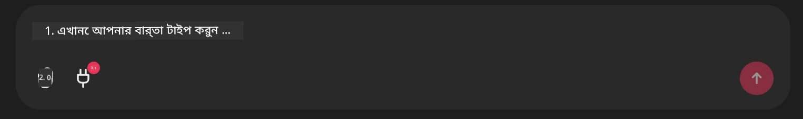

# Github MCP সার্ভার উদাহরণ

## বর্ণনা

এটি Microsoft Reactor-এর মাধ্যমে আয়োজিত AI Agents Hackathon-এর জন্য তৈরি একটি ডেমো ছিল।

এই টুলটি ব্যবহারকারীর Github রিপোজিটরি-কে ভিত্তি করে হ্যাকাথন প্রকল্প সুপারিশ করতে ব্যবহৃত হয়।
এটি করা হয়:

1. **Github Agent** - Github MCP Server ব্যবহার করে রিপো এবং সেই রিপো সম্পর্কিত তথ্য সংগ্রহ করা।
2. **Hackathon Agent** - Github Agent থেকে ডেটা নিয়ে ব্যবহারকারীর প্রকল্প, ব্যবহৃত ভাষাসমূহ এবং AI Agents hackathon-এর প্রকল্প ট্র্যাকের উপর ভিত্তি করে সৃজনশীল হ্যাকাথন প্রকল্প আইডিয়া তৈরি করে।
3. **Events Agent** - Hackathon Agent-এর পরামর্শের ভিত্তিতে, Events Agent AI Agent Hackathon সিরিজ থেকে প্রাসঙ্গিক ইভেন্ট সুপারিশ করবে।
## কোড চালানো 

### এনভায়রনমেন্ট ভ্যারিয়েবল

এই ডেমোটি Microsoft Agent Framework, Azure OpenAI Service, Github MCP Server এবং Azure AI Search ব্যবহার করে।

এই টুলগুলো ব্যবহার করার জন্য নিশ্চিত করুন যে আপনার প্রয়োজনীয় পরিবেশ ভেরিয়েবলগুলো সেট করা আছে:

```python
AZURE_AI_PROJECT_ENDPOINT=""
AZURE_AI_MODEL_DEPLOYMENT_NAME=""
AZURE_SEARCH_SERVICE_ENDPOINT=""
AZURE_SEARCH_API_KEY=""
``` 

## Chainlit সার্ভার চালানো

MCP সার্ভারের সাথে সংযোগ করতে, এই ডেমোটি চ্যাট ইন্টারফেস হিসেবে Chainlit ব্যবহার করে। 

সার্ভার চালানোর জন্য, আপনার টার্মিনালে নিচের কমান্ডটি ব্যবহার করুন:

```bash
chainlit run app.py -w
```

এটি আপনার Chainlit সার্ভারটি `localhost:8000`-এ চালু করা উচিত এবং একই সাথে আপনার Azure AI Search Index-কে `event-descriptions.md` কন্টেন্ট দিয়ে পূরণ করবে। 

## MCP সার্ভারের সাথে সংযোগ

Github MCP সার্ভারের সাথে সংযোগ করতে, 'Type your message here..' চ্যাট বক্সের নিচে থাকা 'plug' আইকনটি নির্বাচন করুন:



সেখান থেকে আপনি 'Connect an MCP' এ ক্লিক করে Github MCP সার্ভারের সাথে সংযোগ করার কমান্ড যোগ করতে পারেন:

```bash
npx -y @modelcontextprotocol/server-github --env GITHUB_PERSONAL_ACCESS_TOKEN=[YOUR PERSONAL ACCESS TOKEN]
```

Replace "[YOUR PERSONAL ACCESS TOKEN]" with your actual Personal Access Token. 

After connecting, you should see a (1) next to the plug icon to confirm that its connected. If not, try restarting the chainlit server with `chainlit run app.py -w`.

## ডেমো ব্যবহার 

হ্যাকাথন প্রকল্প সুপারিশ করার এজেন্ট ওয়ার্কফ্লো শুরু করার জন্য, আপনি নিম্নলিখিত মত একটি মেসেজ টাইপ করতে পারেন: 

"Github ব্যবহারকারী koreyspace-এর জন্য হ্যাকাথন প্রকল্প সাজেস্ট করুন"

The Router Agent will analyze your request and determine which combination of agents (GitHub, Hackathon, and Events) is best suited to handle your query. The agents work together to provide comprehensive recommendations based on GitHub repository analysis, project ideation, and relevant tech events.

---

<!-- CO-OP TRANSLATOR DISCLAIMER START -->
অস্বীকৃতি:
এই ডকুমেন্টটি AI অনুবাদ সেবা [Co-op Translator](https://github.com/Azure/co-op-translator) ব্যবহার করে অনূদিত করা হয়েছে। আমরা সঠিকতার জন্য যথাসাধ্য চেষ্টা করি, তবে অনুগ্রহ করে জানবেন যে স্বয়ংক্রিয় অনুবাদে ত্রুটি বা অসঙ্গতি থাকতে পারে। মূল ভাষায় থাকা মূল নথিটিকেই কর্তৃত্বপূর্ণ উৎস হিসেবে গণ্য করা উচিত। গুরুত্বপূর্ণ তথ্যের ক্ষেত্রে পেশাদার মানব অনুবাদ করানোই পরামর্শযোগ্য। এই অনুবাদ ব্যবহারের ফলে কোনো ভুলবোঝা বা ভুল ব্যাখ্যার জন্য আমরা দায়ী নই।
<!-- CO-OP TRANSLATOR DISCLAIMER END -->