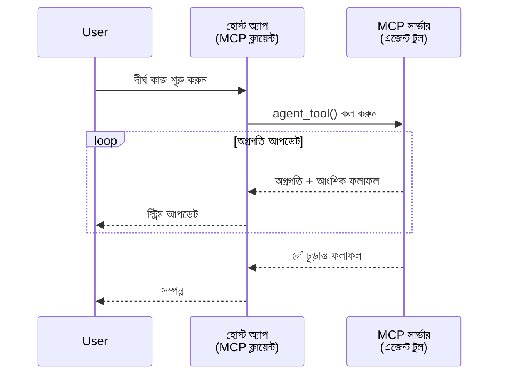
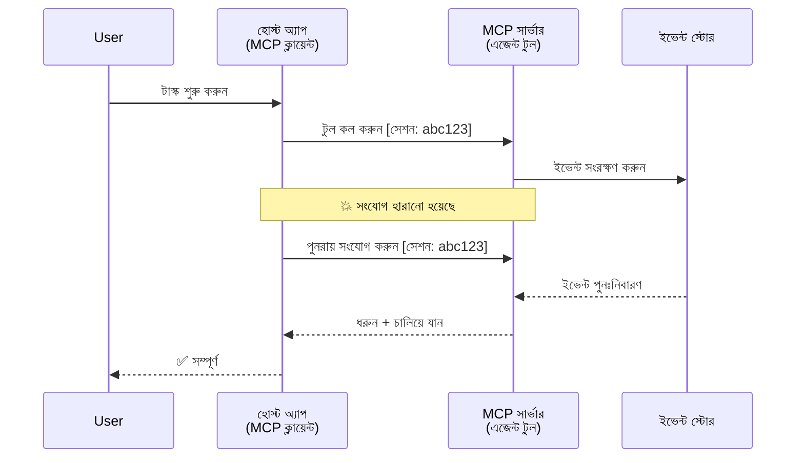
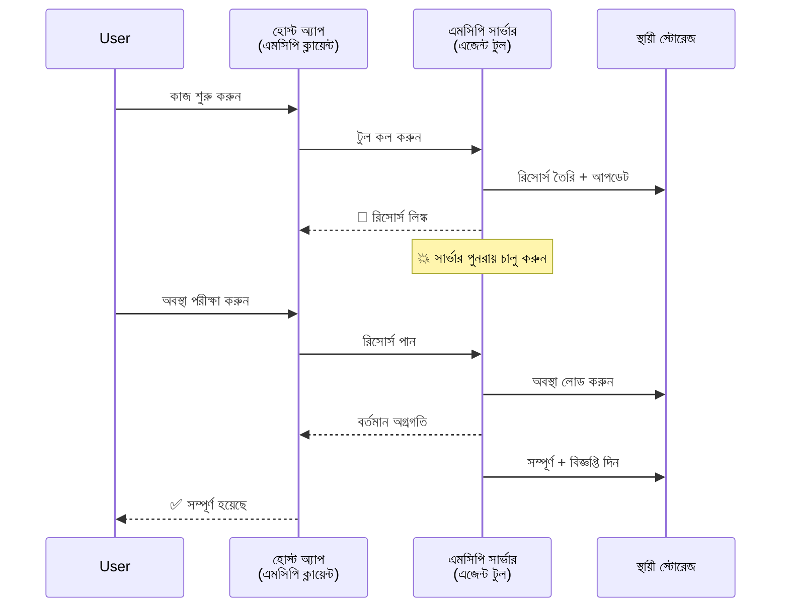
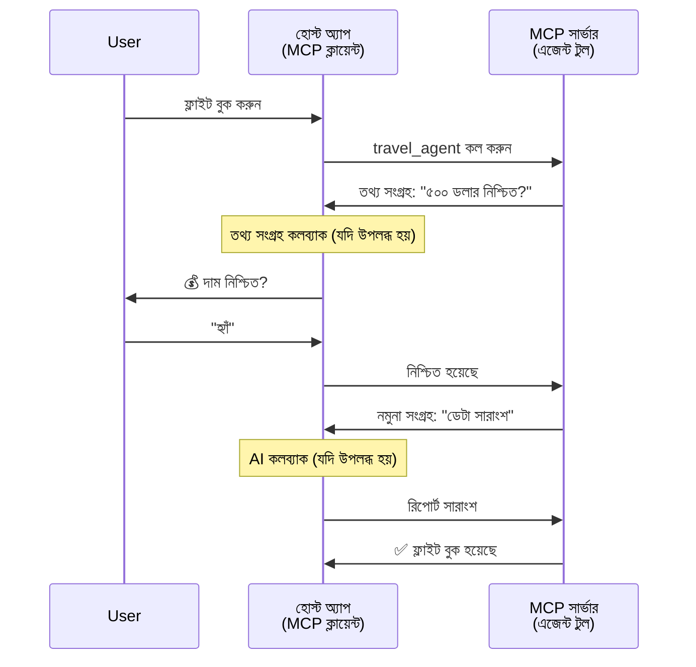
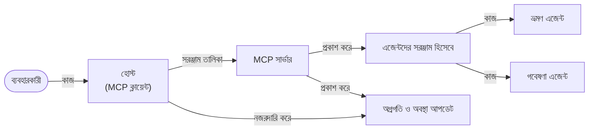

# MCP দিয়ে এজেন্ট-টু-এজেন্ট কমিউনিকেশন সিস্টেম তৈরি করা

> সংক্ষিপ্তসার - আপনি কি MCP এর উপর এজেন্ট2এজেন্ট কমিউনিকেশন তৈরি করতে পারেন? হ্যাঁ!

MCP মূলত "LLM গুলিকে প্রসঙ্গ প্রদান" এর উদ্দেশ্য থেকে উল্লেখযোগ্যভাবে উন্নত হয়েছে। সাম্প্রতিক উন্নয়নগুলোর মধ্যে রয়েছে [পুনরায় শুরুযোগ্য স্ট্রিম](https://modelcontextprotocol.io/docs/concepts/transports#resumability-and-redelivery), [উত্সাহিতকরণ](https://modelcontextprotocol.io/specification/2025-06-18/client/elicitation), [নমুনা গ্রহণ](https://modelcontextprotocol.io/specification/2025-06-18/client/sampling), এবং বিজ্ঞপ্তি ([অগ্রগতি](https://modelcontextprotocol.io/specification/2025-06-18/basic/utilities/progress) এবং [সাধন](https://modelcontextprotocol.io/specification/2025-06-18/schema#resourceupdatednotification)), MCP এখন জটিল এজেন্ট-টু-এজেন্ট কমিউনিকেশন সিস্টেম তৈরি করার জন্য একটি শক্তিশালী ভিত্তি প্রদান করে।

## এজেন্ট/টুল সম্পর্কে ভুল ধারণা

যত বেশি ডেভেলপাররা এজেন্টিক আচরণযুক্ত টুলগুলি (দীর্ঘ সময় চলতে পারে, মাঝে মাঝে অতিরিক্ত ইনপুট প্রয়োজন হতে পারে, ইত্যাদি) পরীক্ষা করছেন, একটি সাধারণ ভুল ধারণা আছে যে MCP প্রধানত প্রাথমিক উদাহরণগুলোর জন্য উপযুক্ত নয় কারণ সে টুলগুলো প্রাথমিকভাবে সহজ রিকোয়েস্ট-রেসপন্স প্যাটার্নে ফোকাস করে।

এই দৃষ্টিভঙ্গি পুরাতন হয়ে গেছে। MCP স্পেসিফিকেশন সাম্প্রতিক কয়েক মাসে উল্লেখযোগ্যভাবে উন্নত হয়েছে এমন বৈশিষ্ট্য সহ যা দীর্ঘমেয়াদী এজেন্টিক আচরণ তৈরি করার জন্য ফাঁক পূরণ করে:

- **স্ট্রিমিং এবং অংশিক ফলাফল**: এক্সিকিউশনের সময় রিয়েল-টাইম অগ্রগতি আপডেট
- **পুনরায় শুরুযোগ্যতা**: ক্লায়েন্টরা ডিসকানেকশনের পর পুনরায় সংযোগ দিতে পারে এবং চালিয়ে যেতে পারে
- **টেকসইতা**: সার্ভার রিস্টার্টের পরেও ফলাফল থাকে (উদাহরণস্বরূপ, রিসোর্স লিঙ্কের মাধ্যমে)
- **মাল্টি-টার্ন**: উত্সাহিতকরণ এবং নমুনা গ্রহণের মাধ্যমে এক্সিকিউশনের মাঝে ইন্টারেক্টিভ ইনপুট

এই বৈশিষ্ট্যগুলো একত্রিত করে জটিল এজেন্টিক এবং মাল্টি-এজেন্ট অ্যাপ্লিকেশন সক্ষম করা যায়, যা সব MCP প্রোটোকলের ওপর ভিত্তি করে ডিপ্লয় করা হয়।

রেফারেন্সের জন্য, আমরা একটি এজেন্টকে "টুল" হিসাবে উল্লেখ করব যা MCP সার্ভারে উপলব্ধ। এর অর্থ একটি হোস্ট অ্যাপ্লিকেশন বিদ্যমান যা MCP ক্লায়েন্ট বাস্তবায়ন করে এবং MCP সার্ভারের সাথে একটি সেশান স্থাপন করে এবং এজেন্টকে কল করতে পারে।

## কী কারণে MCP টুল "এজেন্টিক" হয়?

বাস্তবায়নে যাওয়ার আগে, চলুন নির্ধারণ করি কোন ধরনের অবকাঠামোগত ক্ষমতা প্রয়োজন দীর্ঘমেয়াদী এজেন্টদের সমর্থন করার জন্য।

> আমরা একটি এজেন্টকে এমন একটি সত্তা হিসাবে সংজ্ঞায়িত করবো যা স্বনির্ভরভাবে দীর্ঘ সময় কাজ করতে পারে, জটিল কাজ পরিচালনা করতে সক্ষম যা একাধিক ইন্টারঅ্যাকশন অথবা রিয়েল-টাইম প্রতিক্রিয়ার ভিত্তিতে সামঞ্জস্য প্রয়োজন হতে পারে।

### ১. স্ট্রিমিং ও অংশিক ফলাফল

প্রচলিত রিকোয়েস্ট-রেসপন্স প্যাটার্ন দীর্ঘমেয়াদী কাজের জন্য কাজ করে না। এজেন্টদের প্রয়োজন:

- রিয়েল-টাইম অগ্রগতি আপডেট
- মধ্যবর্তী ফলাফল

**MCP সমর্থন**: রিসোর্স আপডেট বিজ্ঞপ্তি স্ট্রিমিং অংশিক ফলাফল সক্ষম করে, যদিও JSON-RPC এর ১:১ রিকোয়েস্ট/রেসপন্স মডেলের সাথে সংঘর্ষ এড়াতে সাবধানতার প্রয়োজন।

| বৈশিষ্ট্য                  | ব্যবহারিক ক্ষেত্রে                                                                                                                                | MCP সমর্থন                                                                                  |
| -------------------------- | ----------------------------------------------------------------------------------------------------------------------------------------------- | ------------------------------------------------------------------------------------------ |
| রিয়েল-টাইম অগ্রগতি আপডেট | ইউজার একটি কোডবেস মাইগ্রেশন টাস্ক অনুরোধ করে। এজেন্ট অগ্রগতি স্ট্রিম করে: "১০% - ডিপেন্ডেন্সি বিশ্লেষণ... ২৫% - টাইপস্ক্রিপ্ট ফাইল রূপান্তর... ৫০% - আমদানি আপডেট..."         | ✅ অগ্রগতি বিজ্ঞপ্তি                                                                          |
| অংশিক ফলাফল              | "একটি বই তৈরি করুন" টাস্ক অংশিক ফলাফল স্ট্রিম করে, যেমন ১) গল্পের আর্ক আউটলাইন, ২) অধ্যায় তালিকা, ৩) প্রতিটি অধ্যায় শেষে সম্পন্ন। হোস্ট যে কোনো পর্যায়ে পরিদর্শন, বাতিল বা পুনঃনির্দেশ করতে পারে। | ✅ বিজ্ঞপ্তি "বর্ধিত" করা যেতে পারে অংশিক ফলাফল অন্তর্ভুক্ত করতে দেখতে পারেন PR ৩৮৩, ৭৭৬ |

<div align="center" style="font-style: italic; font-size: 0.95em; margin-bottom: 0.5em;">
<strong>চিত্র ১:</strong> এই চিত্রটি প্রদর্শন করছে কিভাবে MCP এজেন্ট দীর্ঘমেয়াদী কাজের সময় হোস্ট অ্যাপ্লিকেশনের কাছে রিয়েল-টাইম অগ্রগতি আপডেট এবং অংশিক ফলাফল স্ট্রিম করে, ইউজারকে এক্সিকিউশন মনিটর করার সুযোগ দেয়।
</div>



### ২. পুনরায় শুরুযোগ্যতা

এজেন্টদের নেটওয়ার্কের বাধা গুলো মার্জিতভাবে সামলাতে হবে:

- (ক্লায়েন্ট) সংযোগ বিচ্ছেদের পর পুনরায় সংযোগ দেওয়া
- যেখানে বন্ধ হয়েছে সেখানে থেকে চালিয়ে যাওয়া (মেসেজ পুনরায় বিতরণ)

**MCP সমর্থন**: MCP StreamableHTTP ট্রান্সপোর্ট আজ সেশন পুনরায় শুরু এবং মেসেজ পুনরায় বিতরণের জন্য সেশন আইডি এবং শেষ ইভেন্ট আইডি সহ সমর্থন দেয়। উল্লেখযোগ্য কথা হল সার্ভারকে একটি ইভেন্ট স্টোর বাস্তবায়ন করতে হবে যা ক্লায়েন্ট পুনঃসংযোগের সময় ইভেন্ট পুনরাবৃত্তি সক্ষম করে।  
সমকমিউনিটি প্রস্তাব (PR #975) আছে যা ট্রান্সপোর্ট-অজ্ঞ ইস্যু পুনরায় শুরুযোগ্য স্ট্রিমগুলি অন্বেষণ করে।

| বৈশিষ্ট্য      | ব্যবহারের ক্ষেত্র                                                                                                                                               | MCP সমর্থন                                                                |
| ------------ | -------------------------------------------------------------------------------------------------------------------------------------------------------------- | -------------------------------------------------------------------------- |
| পুনরায় শুরুযোগ্যতা | ক্লায়েন্ট দীর্ঘমেয়াদী কাজের সময় সংযোগ বিচ্ছিন্ন করে। পুনঃসংযোগের পর সেশন পুনরায় শুরু হয়, মিস হওয়া ইভেন্টগুলি পুনরায় চালানো হয় এবং যেখানে বন্ধ হয়েছিল সেখান থেকে সূচনা হয়। | ✅ StreamableHTTP ট্রান্সপোর্ট সেশন আইডি, ইভেন্ট রিপ্লে এবং ইভেন্ট স্টোর সহ |

<div align="center" style="font-style: italic; font-size: 0.95em; margin-bottom: 0.5em;">
<strong>চিত্র ২:</strong> এই চিত্রটি দেখায় কিভাবে MCP এর StreamableHTTP ট্রান্সপোর্ট এবং ইভেন্ট স্টোর সেশন পুনঃশুরু সহজতর করে: ক্লায়েন্ট সংযোগ বিচ্ছিন্ন হলে, এটি পুনঃসংযোগ দিতে পারে এবং মিস হওয়া ইভেন্টগুলি পুনরায় চালাতে পারে, কাজ অব্যাহত রেখে অগ্রগতি হারায় না।
</div>



### ৩. টেকসইতা (দুর্বলতা সহ্য)

দীর্ঘমেয়াদী এজেন্টদের স্থায়ী অবস্থা প্রয়োজন:

- সার্ভার রিস্টার্টের পর ফলাফল থাকে
- স্ট্যাটাস অব্যবহৃতভাবে পুনরুদ্ধার করা যায়
- সেশন জুড়ে অগ্রগতি ট্র্যাকিং

**MCP সমর্থন**: MCP এখন টুল কলগুলোর জন্য একটি রিসোর্স লিঙ্ক রিটার্ন টাইপ সমর্থন করে। বর্তমানে একটি সাধারণ প্যাটার্ন হল এমন একটি টুল ডিজাইন করা যা একটি রিসোর্স তৈরি করে এবং সাথে সাথেই রিসোর্স লিঙ্ক রিটার্ন করে। টুলটি পটভূমিতে কাজ চালিয়ে যেতে পারে এবং রিসোর্স আপডেট করে। ক্লায়েন্ট তখন এই রিসোর্সের স্টেট পোল করতে পারে আংশিক বা সম্পূর্ণ ফলাফল পেতে (যেমন সার্ভার কোন রিসোর্স আপডেট দেয়) অথবা আপডেট বিজ্ঞপ্তির জন্য সেক্ষেত্রে অনলাইন থাকতে পারে।

এখানে একটি সীমাবদ্ধতা রয়েছে যে রিসোর্স পোলিং বা আপডেট জন্য সাবস্ক্রিপশন স্কেলে সম্পদ খরচ করতে পারে। একটি কমিউনিটি প্রস্তাব (যার মধ্যে #৯৯২ অন্তর্ভুক্ত) আছে যে ওয়েবহুক বা ট্রিগারের মাধ্যমে সার্ভার ক্লায়েন্ট/হোস্ট অ্যাপ্লিকেশন আপডেট বিজ্ঞপ্তি দিতে পারে এমন সম্ভাবনা অন্বেষণ করছে।

| বৈশিষ্ট্য    | ব্যবহারের ক্ষেত্র                                                                                                                                    | MCP সমর্থন                                                        |
| ---------- | --------------------------------------------------------------------------------------------------------------------------------------------------- | ------------------------------------------------------------------ |
| টেকসইতা    | ডেটা মাইগ্রেশন কাজের সময় সার্ভার ক্র্যাশ হয়। ফলাফল এবং অগ্রগতি রিস্টার্ট সহ্য করে, ক্লায়েন্ট স্ট্যাটাস পরীক্ষা করে টেকসই রিসোর্স থেকে চালিয়ে যেতে পারে। | ✅ রিসোর্স লিঙ্ক স্থায়ী সংরক্ষণ এবং স্ট্যাটাস বিজ্ঞপ্তি সহ         |

বর্তমানে, একটি সাধারণ প্যাটার্ন হল এমন একটি টুল ডিজাইন করা যা রিসোর্স তৈরি করে এবং সাথে সাথেই রিসোর্স লিঙ্ক রিটার্ন করে। টুল পেছনে কাজ চালিয়ে যায়, রিসোর্স বিজ্ঞপ্তি দেয় যা অগ্রগতি আপডেট বা আংশিক ফলাফল হিসেবে কাজ করে, এবং প্রয়োজন অনুযায়ী রিসোর্সের কনটেন্ট আপডেট করে।

<div align="center" style="font-style: italic; font-size: 0.95em; margin-bottom: 0.5em;">
<strong>চিত্র ৩:</strong> এই চিত্রটি দেখায় কিভাবে MCP এজেন্টরা টেকসই রিসোর্স এবং স্ট্যাটাস বিজ্ঞপ্তি ব্যবহার করে দীর্ঘমেয়াদী কাজ সার্ভার রিস্টার্ট সত্ত্বেও অক্ষুণ্ণ রাখে, ক্লায়েন্টদের অগ্রগতি পরীক্ষা এবং ফলাফল পুনঃপ্রাপ্তির সুযোগ দেয়।
</div>



### ৪. মাল্টি-টার্ন ইন্টারঅ্যাকশন

এজেন্টদের প্রায়ই এক্সিকিউশনের মাঝে অতিরিক্ত ইনপুট প্রয়োজন হয়:

- মানুষের স্পষ্টকরণ বা অনুমোদন
- জটিল সিদ্ধান্তের জন্য এআই সহায়তা
- গুণগত পরামিতি সমন্বয়

**MCP সমর্থন**: সম্পূর্ণরূপে নমুনা গ্রহণ (এআই ইনপুটের জন্য) এবং উত্সাহিতকরণের (মানব ইনপুটের জন্য) মাধ্যমে সমর্থিত।

| বৈশিষ্ট্য                 | ব্যবহারের ক্ষেত্র                                                                                                                                                 | MCP সমর্থন                                          |
| ----------------------- | -------------------------------------------------------------------------------------------------------------------------------------------------------------- | -------------------------------------------------- |
| মাল্টি-টার্ন ইন্টারঅ্যাকশন | ভ্রমণ বুকিং এজেন্ট ইউজার থেকে দাম নিশ্চিতকরণ চায়, তারপর বুকিং সম্পূর্ণ করার আগে এআই-কে ভ্রমণের তথ্য সারাংশ দিতে বলে।                                            | ✅ মানব ইনপুটের জন্য উত্সাহিতকরণ, এআই ইনপুটের জন্য নমুনা গ্রহণ |

<div align="center" style="font-style: italic; font-size: 0.95em; margin-bottom: 0.5em;">
<strong>চিত্র ৪:</strong> এই চিত্রটি দেখায় কিভাবে MCP এজেন্টরা এক্সিকিউশনের মাঝে মানব ইনপুট উত্সাহিত বা এআই সহায়তার জন্য অনুরোধ করতে পারে, যা নিশ্চিতকরণ ও গুণগত সিদ্ধান্ত গ্রহণের মতো জটিল মাল্টি-টার্ন ওয়ার্কফ্লো সমর্থন করে।
</div>



## MCP তে দীর্ঘমেয়াদী এজেন্ট বাস্তবায়ন - কোড ওভারভিউ

এই প্রবন্ধের অংশ হিসেবে, আমরা একটি [কোড রেপোসিটরি](https://github.com/victordibia/ai-tutorials/tree/main/MCP%20Agents) প্রদান করছি যা MCP পায়থন SDK ব্যবহার করে দীর্ঘমেয়াদী এজেন্টের সম্পূর্ণ বাস্তবায়ন ধারণ করে, যার মধ্যে রয়েছে স্ট্রিমেবলHTTP ট্রান্সপোর্ট নিয়ে সেশন পুনঃশুরু এবং মেসেজ পুনরায় বিতরণ। বাস্তবায়ন দেখায় কিভাবে MCP ক্ষমতাগুলোকে সংমিশ্রণ করে পরিশীলিত এজেন্ট সদৃশ আচরণ সক্ষম করা যায়।

বিশেষভাবে, আমরা দুটি প্রধান এজেন্ট টুল সহ একটি সার্ভার বাস্তবায়ন করি:

- **ট্রাভেল এজেন্ট** - উত্সাহিতকরণের মাধ্যমে মূল্য নিশ্চিতকরণ সহ ট্রাভেল বুকিং সিমুলেট করে
- **রিসার্চ এজেন্ট** - নমুনা গ্রহণের মাধ্যমে AI সহায়তাযুক্ত সারসংক্ষেপ সহ গবেষণা কাজ করে

উভয় এজেন্ট রিয়েল-টাইম অগ্রগতি আপডেট, ইন্টারেক্টিভ নিশ্চিতকরণ, এবং পূর্ণ সেশন পুনঃশুরু ক্ষমতা প্রদর্শন করে।

### মূল বাস্তবায়ন ধারণা

নিম্নলিখিত বিভাগগুলি দেখাবে সার্ভার-সাইড এজেন্ট বাস্তবায়ন এবং ক্লায়েন্ট-সাইড হোস্ট পরিচালনার প্রতিটি ক্ষমতার জন্য:

#### স্ট্রিমিং ও অগ্রগতি আপডেট - রিয়েল-টাইম টাস্ক স্ট্যাটাস

স্ট্রিমিং এজেন্টদের দীর্ঘমেয়াদী কাজের সময় রিয়েল-টাইম অগ্রগতি আপডেট প্রদান করতে সক্ষম করে, যা ইউজারকে টাস্ক স্ট্যাটাস এবং মধ্যবর্তী ফলাফলের বিষয়ে অবহিত রাখে।

**সার্ভার বাস্তবায়ন (এজেন্ট অগ্রগতি বিজ্ঞপ্তি পাঠায়):**

```python
# সার্ভার/server.py থেকে - ট্রাভেল এজেন্ট প্রগতি আপডেট পাঠাচ্ছে
for i, step in enumerate(steps):
    await ctx.session.send_progress_notification(
        progress_token=ctx.request_id,
        progress=i * 25,
        total=100,
        message=step,
        related_request_id=str(ctx.request_id)
    )
    await anyio.sleep(2)  # কাজ সিমুলেট করা

# বিকল্প: বিস্তারিত ধাপে ধাপে আপডেটের জন্য লগ বার্তা
await ctx.session.send_log_message(
    level="info",
    data=f"Processing step {current_step}/{steps} ({progress_percent}%)",
    logger="long_running_agent",
    related_request_id=ctx.request_id,
)
```

**ক্লায়েন্ট বাস্তবায়ন (হোস্ট অগ্রগতি আপডেট গ্রহণ করে):**

```python
# client/client.py থেকে - ক্লায়েন্ট যা রিয়েল-টাইম বিজ্ঞপ্তি পরিচালনা করে
async def message_handler(message) -> None:
    if isinstance(message, types.ServerNotification):
        if isinstance(message.root, types.LoggingMessageNotification):
            console.print(f"📡 [dim]{message.root.params.data}[/dim]")
        elif isinstance(message.root, types.ProgressNotification):
            progress = message.root.params
            console.print(f"🔄 [yellow]{progress.message} ({progress.progress}/{progress.total})[/yellow]")

# সেশন তৈরি করার সময় বার্তা হ্যান্ডলার নিবন্ধন করুন
async with ClientSession(
    read_stream, write_stream,
    message_handler=message_handler
) as session:
```

#### উত্সাহিতকরণ - ইউজার ইনপুট অনুরোধ

উত্সাহিতকরণ এজেন্টদের এক্সিকিউশনের মাঝে ইউজার ইনপুট অনুরোধের অনুমতি দেয়। এটি নিশ্চিতকরণ, স্পষ্টকরণ, অথবা অনুমোদনের জন্য অত্যাবশ্যক দীর্ঘমেয়াদী কাজের সময়।

**সার্ভার বাস্তবায়ন (এজেন্ট নিশ্চিতকরণ অনুরোধ করে):**

```python
# সার্ভার/server.py থেকে - ভ্রমণ এজেন্ট মূল্য নিশ্চিতকরণ অনুরোধ করছে
elicit_result = await ctx.session.elicit(
    message=f"Please confirm the estimated price of $1200 for your trip to {destination}",
    requestedSchema=PriceConfirmationSchema.model_json_schema(),
    related_request_id=ctx.request_id,
)

if elicit_result and elicit_result.action == "accept":
    # বুকিং চালিয়ে যান
    logger.info(f"User confirmed price: {elicit_result.content}")
elif elicit_result and elicit_result.action == "decline":
    # বুকিং বাতিল করুন
    booking_cancelled = True
```

**ক্লায়েন্ট বাস্তবায়ন (হোস্ট উত্সাহিতকরণ কলব্যাক প্রদান করে):**

```python
# ক্লায়েন্ট/ক্লায়েন্ট.py থেকে - ক্লায়েন্ট হ্যান্ডলিং এলিসিটেশন অনুরোধসমূহ
async def elicitation_callback(context, params):
    console.print(f"💬 Server is asking for confirmation:")
    console.print(f"   {params.message}")

    response = console.input("Do you accept? (y/n): ").strip().lower()

    if response in ['y', 'yes']:
        return types.ElicitResult(
            action="accept",
            content={"confirm": True, "notes": "Confirmed by user"}
        )
    else:
        return types.ElicitResult(
            action="decline",
            content={"confirm": False, "notes": "Declined by user"}
        )

# সেশন তৈরির সময় কলব্যাক নিবন্ধন করুন
async with ClientSession(
    read_stream, write_stream,
    elicitation_callback=elicitation_callback
) as session:
```

#### নমুনা গ্রহণ - এআই সহায়তা অনুরোধ

নমুনা গ্রহণ এজেন্টদের জটিল সিদ্ধান্ত বা বিষয়বস্তুর জন্য LLM সহায়তা অনুরোধের সুযোগ দেয়। এটি মানব-এআই সমন্বিত ওয়ার্কফ্লো সক্ষম করে।

**সার্ভার বাস্তবায়ন (এজেন্ট এআই সহায়তা অনুরোধ করে):**

```python
# server/server.py থেকে - গবেষণা এজেন্ট AI সংকলন অনুরোধ করছে
sampling_result = await ctx.session.create_message(
    messages=[
        SamplingMessage(
            role="user",
            content=TextContent(type="text", text=f"Please summarize the key findings for research on: {topic}")
        )
    ],
    max_tokens=100,
    related_request_id=ctx.request_id,
)

if sampling_result and sampling_result.content:
    if sampling_result.content.type == "text":
        sampling_summary = sampling_result.content.text
        logger.info(f"Received sampling summary: {sampling_summary}")
```

**ক্লায়েন্ট বাস্তবায়ন (হোস্ট নমুনা গ্রহণ কলব্যাক প্রদান করে):**

```python
# client/client.py থেকে - ক্লায়েন্ট হ্যান্ডলিং স্যাম্পলিং অনুরোধ
async def sampling_callback(context, params):
    message_text = params.messages[0].content.text if params.messages else 'No message'
    console.print(f"🧠 Server requested sampling: {message_text}")

    # একটি বাস্তব অ্যাপে, এটি একটি LLM API কল করতে পারে
    # ডেমো উদ্দেশ্যে, আমরা একটি নকল প্রতিক্রিয়া প্রদান করি
    mock_response = "Based on current research, MCP has evolved significantly..."

    return types.CreateMessageResult(
        role="assistant",
        content=types.TextContent(type="text", text=mock_response),
        model="interactive-client",
        stopReason="endTurn"
    )

# সেশন তৈরি করার সময় কলব্যাক নিবন্ধন করুন
async with ClientSession(
    read_stream, write_stream,
    sampling_callback=sampling_callback,
    elicitation_callback=elicitation_callback
) as session:
```

#### পুনরায় শুরুযোগ্যতা - সংযোগ বিচ্ছেদের মাধ্যমে সেশন ধারাবাহিকতা

পুনরায় শুরুযোগ্যতা নিশ্চিত করে যে দীর্ঘমেয়াদী এজেন্ট কাজ ক্লায়েন্টের সংযোগ বিচ্ছেদ সত্ত্বেও বেঁচে থাকতে পারে এবং পুনঃসংযোগে অব্যাহত থাকে। এটি ইভেন্ট স্টোর এবং পুনঃশুরু টোকেনের মাধ্যমে বাস্তবায়িত হয়।

**ইভেন্ট স্টোর বাস্তবায়ন (সার্ভার সেশন অবস্থা ধরে রাখে):**

```python
# সার্ভার/event_store.py থেকে - সহজ মেমোরি ভিত্তিক ইভেন্ট স্টোর
class SimpleEventStore(EventStore):
    def __init__(self):
        self._events: list[tuple[StreamId, EventId, JSONRPCMessage]] = []
        self._event_id_counter = 0

    async def store_event(self, stream_id: StreamId, message: JSONRPCMessage) -> EventId:
        """Store an event and return its ID."""
        self._event_id_counter += 1
        event_id = str(self._event_id_counter)
        self._events.append((stream_id, event_id, message))
        return event_id

    async def replay_events_after(self, last_event_id: EventId, send_callback: EventCallback) -> StreamId | None:
        """Replay events after the specified ID for resumption."""
        start_index = None
        stream_id = None
        for index, (event_stream_id, event_id, _) in enumerate(self._events):
            if event_id == last_event_id:
                start_index = index + 1
                stream_id = event_stream_id
                break

        if start_index is None:
            return None

        # সেশনটির মূল স্ট্রিম থেকে শুধুমাত্র পরবর্তী ইভেন্টগুলি পুনরায় চালানো।
        for event_stream_id, event_id, message in self._events[start_index:]:
            if event_stream_id != stream_id:
                continue
            await send_callback(EventMessage(message, event_id))

        return stream_id

# সার্ভার/server.py থেকে - সেশন ম্যানেজারে ইভেন্ট স্টোর পাস করা
def create_server_app(event_store: Optional[EventStore] = None) -> Starlette:
    server = ResumableServer()

    # পুনরায় শুরু করার জন্য ইভেন্ট স্টোর সহ সেশন ম্যানেজার তৈরি করুন
    session_manager = StreamableHTTPSessionManager(
        app=server,
        event_store=event_store,  # ইভেন্ট স্টোর সেশন পুনরায় শুরু সক্ষম করে
        json_response=False,
        security_settings=security_settings,
    )

    return Starlette(routes=[Mount("/mcp", app=session_manager.handle_request)])

# ব্যবহার: ইভেন্ট স্টোর সহ ইনিশিয়ালাইজ করুন
event_store = SimpleEventStore()
app = create_server_app(event_store)
```

**পুনরায় শুরু টোকেনসহ ক্লায়েন্ট মেটাডেটা (ক্লায়েন্ট সংরক্ষিত অবস্থার ব্যবহার করে পুনঃসংযোগ দেয়):**

```python
# client/client.py থেকে - ক্লায়েন্ট পুনরায় শুরু মেটাডেটা সহ
if existing_tokens and existing_tokens.get("resumption_token"):
    # বিদ্যমান পুনরায় শুরু টোকেন ব্যবহার করে যেখানে থেমেছিলাম সেখানে চালিয়ে যান
    metadata = ClientMessageMetadata(
        resumption_token=existing_tokens["resumption_token"],
    )
else:
    # পুনরায় শুরু টোকেন প্রাপ্ত হলে সংরক্ষণের জন্য কলব্যাক তৈরি করুন
    def enhanced_callback(token: str):
        protocol_version = getattr(session, 'protocol_version', None)
        token_manager.save_tokens(session_id, token, protocol_version, command, args)

    metadata = ClientMessageMetadata(
        on_resumption_token_update=enhanced_callback,
    )

# পুনরায় শুরু মেটাডেটা সহ অনুরোধ পাঠান
result = await session.send_request(
    types.ClientRequest(
        types.CallToolRequest(
            method="tools/call",
            params=types.CallToolRequestParams(name=command, arguments=args)
        )
    ),
    types.CallToolResult,
    metadata=metadata,
)
```

হোস্ট অ্যাপ্লিকেশন স্থানীয়ভাবে সেশন আইডি এবং পুনরায় শুরু টোকেন বজায় রাখে, যা বিদ্যমান সেশনে হেরফের ছাড়া পুনঃসংযোগ সম্ভব করে।

### কোড সংগঠন

<div align="center" style="font-style: italic; font-size: 0.95em; margin-bottom: 0.5em;">
<strong>চিত্র ৫:</strong> MCP ভিত্তিক এজেন্ট সিস্টেম স্থাপত্য
</div>



**মূল ফাইলসমূহ:**

- **`server/server.py`** - ট্রাভেল এবং গবেষণা এজেন্টসহ পুনরায় শুরুযোগ্য MCP সার্ভার যা উত্সাহিতকরণ, নমুনা গ্রহণ এবং অগ্রগতি আপডেট প্রদর্শন করে
- **`client/client.py`** - পুনরায় শুরু সমর্থন, কলব্যাক হ্যান্ডলার, এবং টোকেন ব্যবস্থাপনা সহ ইন্টারেক্টিভ হোস্ট অ্যাপ্লিকেশন
- **`server/event_store.py`** - সেশন পুনঃশুরু এবং মেসেজ পুনরায় বিতরণ সক্ষম করে ইভেন্ট স্টোর বাস্তবায়ন

## MCP তে মাল্টি-এজেন্ট কমিউনিকেশন বাড়ানো

উপরের বাস্তবায়নটিকে মাল্টি-এজেন্ট সিস্টেমে বাড়ানো যেতে পারে হোস্ট অ্যাপ্লিকেশনের বুদ্ধিমত্তা এবং পরিধি উন্নত করে:

- **বুদ্ধিমান টাস্ক বিশ্লেষণ**: হোস্ট জটিল ইউজার রিকোয়েস্ট বিশ্লেষণ করে এবং বিভিন্ন বিশেষায়িত এজেন্টের জন্য সাবটাস্কে বিভক্ত করে
- **মাল্টি-সার্ভার সমন্বয়**: হোস্ট একাধিক MCP সার্ভারের সাথে সংযোগ রাখে, যা বিভিন্ন এজেন্ট ক্ষমতা উপস্থাপন করে
- **টাস্ক স্টেট ব্যবস্থাপনা**: হোস্ট একাধিক সমান্তরাল এজেন্ট টাস্কের অগ্রগতি ট্র্যাক করে, নির্ভরশীলতা এবং ক্রম নির্ধারণ করে
- **স্থিতিস্থাপকতা ও রিট্রাই**: হোস্ট ব্যর্থতা নিয়ন্ত্রণ করে, পুনরাবৃত্তি লজিক বাস্তবায়ন করে, এবং যখন এজেন্ট অনুপলব্ধ হয় তখন টাস্ক রি-রুট করে
- **ফলাফল সংযোজন**: হোস্ট একাধিক এজেন্টের আউটপুট সমষ্টি করে সঙ্গতিশীল চূড়ান্ত ফলাফল তৈরি করে

হোস্ট সাধারণ ক্লায়েন্ট থেকে একটি বুদ্ধিমান অর্কেস্ট্রেটরে পরিণত হয়, বিস্তৃত এজেন্ট ক্ষমতা সমন্বয় করে একই MCP প্রোটোকল ভিত্তি রক্ষা করে।

## উপসংহার

MCP এর উন্নত ক্ষমতাগুলি - রিসোর্স বিজ্ঞপ্তি, উত্সাহিতকরণ/নমুনা গ্রহণ, পুনরায় শুরুযোগ্য স্ট্রিম এবং স্থায়ী রিসোর্স - জটিল এজেন্ট-টু-এজেন্ট ইন্টারঅ্যাকশন সক্ষম করে প্রোটোকলের সরলতা বজায় রেখে।

## শুরু করা

নিজের এজেন্ট2এজেন্ট সিস্টেম তৈরি করতে প্রস্তুত? এই ধাপগুলি অনুসরণ করুন:

### ১. ডেমো চালান

```bash
# পুনরায় শুরু করার জন্য ইভেন্ট স্টোর সহ সার্ভার শুরু করুন
python -m server.server --port 8006

# অন্য টার্মিনালে, ইন্টারেক্টিভ ক্লায়েন্ট চালান
python -m client.client --url http://127.0.0.1:8006/mcp
```

**ইন্টারেক্টিভ মোডে উপলব্ধ কমান্ডসমূহ:**

- `travel_agent` - উত্সাহিতকরণের মাধ্যমে মূল্য নিশ্চিতকরণসহ ট্রাভেল বুকিং করুন
- `research_agent` - নমুনা গ্রহণের মাধ্যমে AI-সহায়তাযুক্ত সারাংশ সহ বিষয় অনুসন্ধান করুন
- `list` - সব উপলব্ধ টুল দেখান
- `clean-tokens` - পুনরায় শুরু টোকেন পরিষ্কার করুন
- `help` - বিস্তারিত কমান্ড হেল্প দেখান
- `quit` - ক্লায়েন্ট থেকে বাহির হন

### ২. পুনরায় শুরু ক্ষমতা পরীক্ষা করুন

- একটি দীর্ঘমেয়াদী এজেন্ট চালু করুন (যেমন, `travel_agent`)
- এক্সিকিউশনের সময় ক্লায়েন্টে বাধা দিন (Ctrl+C)
- ক্লায়েন্ট পুনরায় চালু করুন - এটি স্বয়ংক্রিয়ভাবে যেখানে ছেড়েছিল সেখান থেকে পুনরায় শুরু হবে

### ৩. অন্বেষণ ও সম্প্রসারণ করুন

- **উদাহরণগুলো পরীক্ষা করুন**: এই [mcp-agents](https://github.com/victordibia/ai-tutorials/tree/main/MCP%20Agents) দেখুন
- **কমিউনিটিতে যোগ দিন**: MCP আলোচনা গিটহাবে অংশ নিন
- **পরীক্ষা করুন**: একটি সহজ দীর্ঘমেয়াদী টাস্ক দিয়ে শুরু করুন এবং ধীরে ধীরে স্ট্রিমিং, পুনরায় শুরু, এবং মাল্টি-এজেন্ট সমন্বয় যোগ করুন

এটি দেখায় কিভাবে MCP বুদ্ধিমান এজেন্ট আচরণ সক্ষম করে টুল-ভিত্তিক সরলতা বজায় রেখে।

সামগ্রিকভাবে, MCP প্রোটোকল স্পেস দ্রুত বিকাশমান; পাঠককে প্রেক্ষিত হিসেবে সর্বশেষ আপডেটের জন্য অফিসিয়াল ডকুমেন্টেশন ওয়েবসাইট পরিদর্শনের সুপারিশ করা হয় - https://modelcontextprotocol.io/introduction

---

<!-- CO-OP TRANSLATOR DISCLAIMER START -->
**অস্বীকৃতি**:
এই নথিটি AI অনুবাদ পরিষেবা [Co-op Translator](https://github.com/Azure/co-op-translator) ব্যবহার করে অনূদিত হয়েছে। যদিও আমরা শুদ্ধতার জন্য চেষ্টা করি, অনুগ্রহ করে মনে রাখবেন যে স্বয়ংক্রিয় অনুবাদে ত্রুটি বা অসঙ্গতি থাকতে পারে। মূল নথিটি তার স্বভাষায় কর্তৃত্বপূর্ণ উৎস হিসেবে বিবেচিত হওয়া উচিত। গুরুত্বপূর্ণ তথ্যের জন্য পেশাদার মানব অনুবাদ সুপারিশ করা হয়। এই অনুবাদের ব্যবহারে প্রয়োজনীয় ভুল বোঝাবুঝি বা ভুল ব্যাখ্যার জন্য আমরা দায়বদ্ধ নই।
<!-- CO-OP TRANSLATOR DISCLAIMER END -->