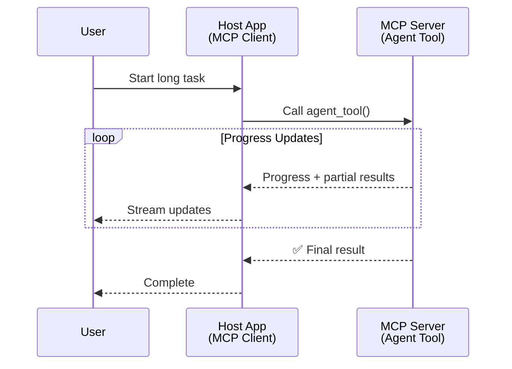
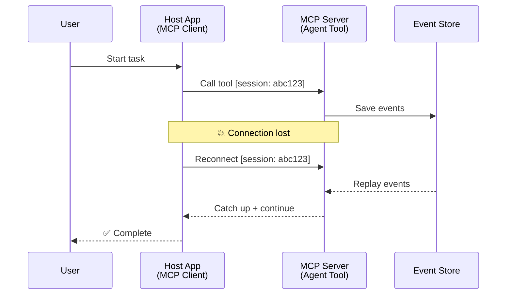
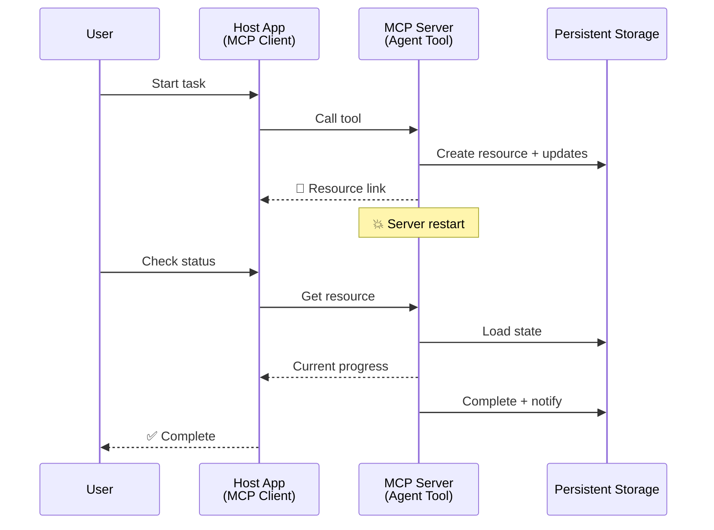
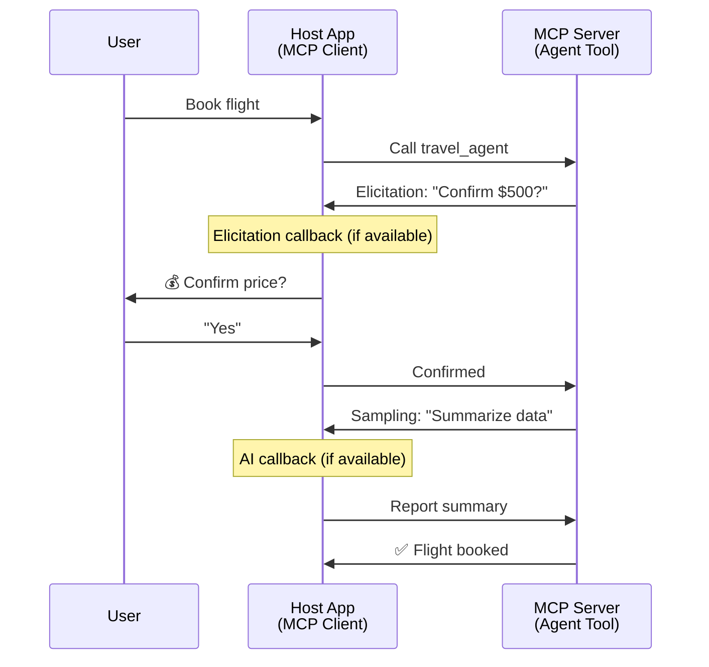
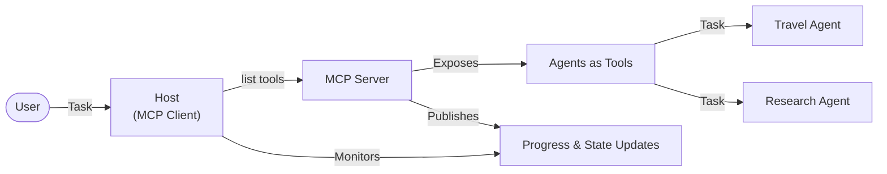

<!--
CO_OP_TRANSLATOR_METADATA:
{
  "original_hash": "5cc6836626047aa055e8960c8484a7d0",
  "translation_date": "2025-07-24T08:04:51+00:00",
  "source_file": "11-mcp/code_samples/mcp-agents/README.md",
  "language_code": "bn"
}
-->
# MCP ব্যবহার করে এজেন্ট-টু-এজেন্ট যোগাযোগ ব্যবস্থা তৈরি করা

> TL;DR - MCP-তে Agent2Agent যোগাযোগ তৈরি করা সম্ভব? হ্যাঁ!

MCP তার প্রাথমিক লক্ষ্য "LLMs-কে প্রসঙ্গ প্রদান করা" থেকে অনেক দূর এগিয়েছে। সাম্প্রতিক উন্নয়ন যেমন [resumable streams](https://modelcontextprotocol.io/docs/concepts/transports#resumability-and-redelivery), [elicitation](https://modelcontextprotocol.io/specification/2025-06-18/client/elicitation), [sampling](https://modelcontextprotocol.io/specification/2025-06-18/client/sampling), এবং নোটিফিকেশন ([progress](https://modelcontextprotocol.io/specification/2025-06-18/basic/utilities/progress) এবং [resources](https://modelcontextprotocol.io/specification/2025-06-18/schema#resourceupdatednotification)) MCP-কে জটিল এজেন্ট-টু-এজেন্ট যোগাযোগ ব্যবস্থা তৈরির জন্য একটি শক্তিশালী ভিত্তি প্রদান করেছে।

## এজেন্ট/টুল সম্পর্কে ভুল ধারণা

যখন আরও বেশি ডেভেলপাররা এজেন্টিক আচরণযুক্ত টুল (দীর্ঘ সময় ধরে চলতে পারে, মাঝপথে অতিরিক্ত ইনপুট প্রয়োজন হতে পারে ইত্যাদি) নিয়ে পরীক্ষা-নিরীক্ষা করেন, তখন একটি সাধারণ ভুল ধারণা তৈরি হয় যে MCP এই ধরনের ব্যবহারের জন্য উপযুক্ত নয়। এর কারণ প্রাথমিক উদাহরণগুলোতে MCP-এর টুল প্রিমিটিভ সাধারণ অনুরোধ-প্রতিক্রিয়া প্যাটার্নে সীমাবদ্ধ ছিল।

এই ধারণা এখন পুরনো। MCP স্পেসিফিকেশন সাম্প্রতিক মাসগুলোতে উল্লেখযোগ্যভাবে উন্নত হয়েছে, যা দীর্ঘমেয়াদী এজেন্টিক আচরণ তৈরির জন্য প্রয়োজনীয় ক্ষমতাগুলো পূরণ করে:

- **স্ট্রিমিং এবং আংশিক ফলাফল**: কার্য সম্পাদনের সময় রিয়েল-টাইম অগ্রগতি আপডেট
- **পুনরায় সংযোগযোগ্যতা**: সংযোগ বিচ্ছিন্ন হওয়ার পর ক্লায়েন্ট পুনরায় সংযোগ করতে পারে এবং কাজ চালিয়ে যেতে পারে
- **টেকসইতা**: সার্ভার রিস্টার্টের পরেও ফলাফল টিকে থাকে (যেমন, রিসোর্স লিঙ্কের মাধ্যমে)
- **মাল্টি-টার্ন**: কার্য সম্পাদনের মাঝপথে ইন্টারঅ্যাকটিভ ইনপুট

এই বৈশিষ্ট্যগুলো MCP প্রোটোকলের উপর ভিত্তি করে জটিল এজেন্টিক এবং মাল্টি-এজেন্ট অ্যাপ্লিকেশন তৈরি করতে সক্ষম।

রেফারেন্সের জন্য, আমরা একটি এজেন্টকে "টুল" হিসেবে উল্লেখ করব যা MCP সার্ভারে উপলব্ধ। এর অর্থ একটি হোস্ট অ্যাপ্লিকেশনের অস্তিত্ব, যা MCP ক্লায়েন্ট বাস্তবায়ন করে, MCP সার্ভারের সাথে একটি সেশন স্থাপন করে এবং এজেন্টকে কল করতে পারে।

## MCP টুলকে "এজেন্টিক" কী করে তোলে?

বাস্তবায়নে যাওয়ার আগে, দীর্ঘমেয়াদী এজেন্টকে সমর্থন করার জন্য কী ধরনের অবকাঠামো ক্ষমতা প্রয়োজন তা নির্ধারণ করা যাক।

> আমরা একটি এজেন্টকে এমন একটি সত্তা হিসেবে সংজ্ঞায়িত করব যা দীর্ঘ সময় ধরে স্বয়ংক্রিয়ভাবে কাজ করতে পারে, জটিল কাজ পরিচালনা করতে পারে যা একাধিক ইন্টারঅ্যাকশন বা রিয়েল-টাইম ফিডব্যাকের উপর ভিত্তি করে সমন্বয় প্রয়োজন হতে পারে।

### ১. স্ট্রিমিং এবং আংশিক ফলাফল

প্রথাগত অনুরোধ-প্রতিক্রিয়া প্যাটার্ন দীর্ঘমেয়াদী কাজের জন্য কার্যকর নয়। এজেন্টদের প্রয়োজন:

- রিয়েল-টাইম অগ্রগতি আপডেট
- মধ্যবর্তী ফলাফল

**MCP সমর্থন**: রিসোর্স আপডেট নোটিফিকেশন আংশিক ফলাফল স্ট্রিমিং সক্ষম করে, যদিও এটি JSON-RPC-এর ১:১ অনুরোধ/প্রতিক্রিয়া মডেলের সাথে সংঘর্ষ এড়াতে সাবধানে ডিজাইন করা প্রয়োজন।

| বৈশিষ্ট্য                  | ব্যবহার ক্ষেত্র                                                                                                                                                                       | MCP সমর্থন                                                                                |
| -------------------------- | ------------------------------------------------------------------------------------------------------------------------------------------------------------------------------ | ------------------------------------------------------------------------------------------ |
| রিয়েল-টাইম অগ্রগতি আপডেট | ব্যবহারকারী একটি কোডবেস মাইগ্রেশন কাজের অনুরোধ করে। এজেন্ট অগ্রগতি স্ট্রিম করে: "১০% - ডিপেন্ডেন্সি বিশ্লেষণ করা হচ্ছে... ২৫% - টাইপস্ক্রিপ্ট ফাইল রূপান্তর করা হচ্ছে... ৫০% - ইমপোর্ট আপডেট করা হচ্ছে..."          | ✅ অগ্রগতি নোটিফিকেশন                                                                  |
| আংশিক ফলাফল            | "একটি বই তৈরি করুন" কাজটি আংশিক ফলাফল স্ট্রিম করে, যেমন ১) গল্পের আর্ক আউটলাইন, ২) অধ্যায়ের তালিকা, ৩) প্রতিটি অধ্যায় সম্পন্ন হওয়ার সাথে সাথে। হোস্ট যে কোনো পর্যায়ে পরিদর্শন, বাতিল বা পুনঃনির্দেশ করতে পারে। | ✅ নোটিফিকেশন "বর্ধিত" হতে পারে আংশিক ফলাফল অন্তর্ভুক্ত করতে, PR 383, 776 প্রস্তাব দেখুন |

<div align="center" style="font-style: italic; font-size: 0.95em; margin-bottom: 0.5em;">
<strong>চিত্র ১:</strong> এই ডায়াগ্রামটি দেখায় কীভাবে MCP এজেন্ট দীর্ঘমেয়াদী কাজের সময় হোস্ট অ্যাপ্লিকেশনে রিয়েল-টাইম অগ্রগতি আপডেট এবং আংশিক ফলাফল স্ট্রিম করে, ব্যবহারকারীকে কার্য সম্পাদনের সময় পর্যবেক্ষণ করতে সক্ষম করে।
</div>


```mermaid
sequenceDiagram
    participant User
    participant Host as Host App<br/>(MCP Client)
    participant Server as MCP Server<br/>(Agent Tool)

    User->>Host: Start long task
    Host->>Server: Call agent_tool()

    loop Progress Updates
        Server-->>Host: Progress + partial results
        Host-->>User: Stream updates
    end

    Server-->>Host: ✅ Final result
    Host-->>User: Complete
```

### ২. পুনরায় সংযোগযোগ্যতা

এজেন্টদের নেটওয়ার্ক বিঘ্নকে দক্ষতার সাথে পরিচালনা করতে হবে:

- সংযোগ বিচ্ছিন্ন হওয়ার পর পুনরায় সংযোগ
- যেখানে থেমেছিল সেখান থেকে চালিয়ে যাওয়া (বার্তা পুনঃপ্রেরণ)

**MCP সমর্থন**: MCP StreamableHTTP ট্রান্সপোর্ট বর্তমানে সেশন পুনরায় সংযোগ এবং বার্তা পুনঃপ্রেরণ সেশন আইডি এবং শেষ ইভেন্ট আইডি সহ সমর্থন করে। এখানে গুরুত্বপূর্ণ বিষয় হলো সার্ভারকে একটি EventStore বাস্তবায়ন করতে হবে যা ক্লায়েন্ট পুনরায় সংযোগের সময় ইভেন্ট পুনঃপ্রেরণ সক্ষম করে।  
এখানে একটি কমিউনিটি প্রস্তাব (PR #975) রয়েছে যা ট্রান্সপোর্ট-অ্যাগনস্টিক পুনরায় সংযোগযোগ্য স্ট্রিম অন্বেষণ করে।

| বৈশিষ্ট্য      | ব্যবহার ক্ষেত্র                                                                                                                                                   | MCP সমর্থন                                                                |
| ------------ | ---------------------------------------------------------------------------------------------------------------------------------------------------------- | -------------------------------------------------------------------------- |
| পুনরায় সংযোগযোগ্যতা | দীর্ঘমেয়াদী কাজের সময় ক্লায়েন্ট সংযোগ বিচ্ছিন্ন হয়। পুনরায় সংযোগের পর, সেশন পুনরায় শুরু হয় এবং মিস হওয়া ইভেন্টগুলো পুনঃপ্রেরণ করা হয়, নির্বিঘ্নে যেখানে থেমেছিল সেখান থেকে চালিয়ে যায়। | ✅ StreamableHTTP ট্রান্সপোর্ট সেশন আইডি, ইভেন্ট পুনঃপ্রেরণ এবং EventStore সহ |

<div align="center" style="font-style: italic; font-size: 0.95em; margin-bottom: 0.5em;">
<strong>চিত্র ২:</strong> এই ডায়াগ্রামটি দেখায় কীভাবে MCP-এর StreamableHTTP ট্রান্সপোর্ট এবং ইভেন্ট স্টোর সেশন পুনরায় সংযোগ সক্ষম করে: যদি ক্লায়েন্ট সংযোগ বিচ্ছিন্ন হয়, এটি পুনরায় সংযোগ করতে পারে এবং মিস হওয়া ইভেন্টগুলো পুনঃপ্রেরণ করতে পারে, কার্যটি অগ্রগতি হারানো ছাড়াই চালিয়ে যেতে পারে।
</div>


```mermaid
sequenceDiagram
    participant User
    participant Host as Host App<br/>(MCP Client)
    participant Server as MCP Server<br/>(Agent Tool)
    participant Store as Event Store

    User->>Host: Start task
    Host->>Server: Call tool [session: abc123]
    Server->>Store: Save events

    Note over Host,Server: 💥 Connection lost

    Host->>Server: Reconnect [session: abc123]
    Store-->>Server: Replay events
    Server-->>Host: Catch up + continue
    Host-->>User: ✅ Complete
```

### ৩. টেকসইতা

দীর্ঘমেয়াদী এজেন্টদের স্থায়ী অবস্থা প্রয়োজন:

- ফলাফল সার্ভার রিস্টার্টের পরেও টিকে থাকে
- স্ট্যাটাস বাইরের মাধ্যমে পুনরুদ্ধার করা যায়
- সেশন জুড়ে অগ্রগতি ট্র্যাকিং

**MCP সমর্থন**: MCP এখন টুল কলের জন্য একটি রিসোর্স লিঙ্ক রিটার্ন টাইপ সমর্থন করে। আজকের দিনে একটি সম্ভাব্য প্যাটার্ন হলো একটি টুল ডিজাইন করা যা একটি রিসোর্স তৈরি করে এবং তাৎক্ষণিকভাবে একটি রিসোর্স লিঙ্ক রিটার্ন করে। টুলটি ব্যাকগ্রাউন্ডে কাজ চালিয়ে যেতে পারে এবং রিসোর্স আপডেট করতে পারে। এর ফলে ক্লায়েন্ট এই রিসোর্সের স্টেট পোল করতে পারে আংশিক বা সম্পূর্ণ ফলাফল পেতে (যে রিসোর্স আপডেটগুলো সার্ভার প্রদান করে তার উপর ভিত্তি করে) অথবা রিসোর্স আপডেট নোটিফিকেশনের জন্য সাবস্ক্রাইব করতে পারে।

এখানে একটি সীমাবদ্ধতা হলো রিসোর্স পোলিং বা আপডেটের জন্য সাবস্ক্রাইব করা স্কেলে প্রভাব সহ সম্পদ ব্যবহার করতে পারে। একটি ওপেন কমিউনিটি প্রস্তাব (যেমন #992) রয়েছে যা ওয়েবহুক বা ট্রিগার অন্তর্ভুক্ত করার সম্ভাবনা অন্বেষণ করে যা সার্ভার ক্লায়েন্ট/হোস্ট অ্যাপ্লিকেশনকে আপডেটের জন্য কল করতে পারে।

| বৈশিষ্ট্য    | ব্যবহার ক্ষেত্র                                                                                                                                        | MCP সমর্থন                                                        |
| ---------- | ----------------------------------------------------------------------------------------------------------------------------------------------- | ------------------------------------------------------------------ |
| টেকসইতা | ডেটা মাইগ্রেশন কাজের সময় সার্ভার ক্র্যাশ করে। ফলাফল এবং অগ্রগতি রিস্টার্টের পরেও টিকে থাকে, ক্লায়েন্ট স্ট্যাটাস চেক করতে পারে এবং স্থায়ী রিসোর্স থেকে চালিয়ে যেতে পারে। | ✅ রিসোর্স লিঙ্ক স্থায়ী স্টোরেজ এবং স্ট্যাটাস নোটিফিকেশন সহ |

আজকের দিনে একটি সাধারণ প্যাটার্ন হলো একটি টুল ডিজাইন করা যা একটি রিসোর্স তৈরি করে এবং তাৎক্ষণিকভাবে একটি রিসোর্স লিঙ্ক রিটার্ন করে। টুলটি ব্যাকগ্রাউন্ডে কাজ চালিয়ে যেতে পারে, রিসোর্স নোটিফিকেশন প্রদান করতে পারে যা অগ্রগতি আপডেট হিসেবে কাজ করে বা আংশিক ফলাফল অন্তর্ভুক্ত করতে পারে এবং প্রয়োজন অনুযায়ী রিসোর্সের বিষয়বস্তু আপডেট করতে পারে।

<div align="center" style="font-style: italic; font-size: 0.95em; margin-bottom: 0.5em;">
<strong>চিত্র ৩:</strong> এই ডায়াগ্রামটি দেখায় কীভাবে MCP এজেন্ট স্থায়ী রিসোর্স এবং স্ট্যাটাস নোটিফিকেশন ব্যবহার করে দীর্ঘমেয়াদী কাজগুলো সার্ভার রিস্টার্টের পরেও টিকে থাকে, ক্লায়েন্টকে অগ্রগতি চেক করতে এবং ব্যর্থতার পরেও ফলাফল পুনরুদ্ধার করতে সক্ষম করে।
</div>


```mermaid
sequenceDiagram
    participant User
    participant Host as Host App<br/>(MCP Client)
    participant Server as MCP Server<br/>(Agent Tool)
    participant DB as Persistent Storage

    User->>Host: Start task
    Host->>Server: Call tool
    Server->>DB: Create resource + updates
    Server-->>Host: 🔗 Resource link

    Note over Server: 💥 Server restart

    User->>Host: Check status
    Host->>Server: Get resource
    Server->>DB: Load state
    Server-->>Host: Current progress
    Server->>DB: Complete + notify
    Host-->>User: ✅ Complete
```

### ৪. মাল্টি-টার্ন ইন্টারঅ্যাকশন

এজেন্টদের কার্য সম্পাদনের মাঝপথে অতিরিক্ত ইনপুট প্রয়োজন হতে পারে:

- মানব স্পষ্টীকরণ বা অনুমোদন
- জটিল সিদ্ধান্তের জন্য AI সহায়তা
- গতিশীল প্যারামিটার সমন্বয়

**MCP সমর্থন**: সম্পূর্ণভাবে সমর্থিত স্যাম্পলিং (AI ইনপুটের জন্য) এবং এলিসিটেশন (মানব ইনপুটের জন্য) এর মাধ্যমে।

| বৈশিষ্ট্য                 | ব্যবহার ক্ষেত্র                                                                                                                                     | MCP সমর্থন                                           |
| ----------------------- | -------------------------------------------------------------------------------------------------------------------------------------------- | ----------------------------------------------------- |
| মাল্টি-টার্ন ইন্টারঅ্যাকশন | ট্রাভেল বুকিং এজেন্ট ব্যবহারকারীর কাছ থেকে মূল্য নিশ্চিতকরণ অনুরোধ করে, তারপর AI-কে ট্রাভেল ডেটা সারাংশ করতে বলে, এবং তারপর বুকিং লেনদেন সম্পন্ন করে। | ✅ মানব ইনপুটের জন্য এলিসিটেশন, AI ইনপুটের জন্য স্যাম্পলিং |

<div align="center" style="font-style: italic; font-size: 0.95em; margin-bottom: 0.5em;">
<strong>চিত্র ৪:</strong> এই ডায়াগ্রামটি দেখায় কীভাবে MCP এজেন্ট কার্য সম্পাদনের মাঝপথে ইন্টারঅ্যাকটিভভাবে মানব ইনপুট সংগ্রহ করতে পারে বা AI সহায়তা অনুরোধ করতে পারে, জটিল, মাল্টি-টার্ন ওয়ার্কফ্লো যেমন নিশ্চিতকরণ এবং গতিশীল সিদ্ধান্ত গ্রহণ সমর্থন করে।
</div>


```mermaid
sequenceDiagram
    participant User
    participant Host as Host App<br/>(MCP Client)
    participant Server as MCP Server<br/>(Agent Tool)

    User->>Host: Book flight
    Host->>Server: Call travel_agent

    Server->>Host: Elicitation: "Confirm $500?"
    Note over Host: Elicitation callback (if available)
    Host->>User: 💰 Confirm price?
    User->>Host: "Yes"
    Host->>Server: Confirmed

    Server->>Host: Sampling: "Summarize data"
    Note over Host: AI callback (if available)
    Host->>Server: Report summary

    Server->>Host: ✅ Flight booked
```

## MCP-তে দীর্ঘমেয়াদী এজেন্ট বাস্তবায়ন - কোড ওভারভিউ

এই নিবন্ধের অংশ হিসেবে, আমরা একটি [কোড রিপোজিটরি](https://github.com/victordibia/ai-tutorials/tree/main/MCP%20Agents) প্রদান করেছি যা MCP Python SDK ব্যবহার করে StreamableHTTP ট্রান্সপোর্ট সহ সেশন পুনরায় সংযোগ এবং বার্তা পুনঃপ্রেরণ সক্ষম করে দীর্ঘমেয়াদী এজেন্ট বাস্তবায়নের সম্পূর্ণ উদাহরণ অন্তর্ভুক্ত করে। বাস্তবায়নটি দেখায় কীভাবে MCP ক্ষমতাগুলোকে সংযুক্ত করে উন্নত এজেন্ট-সদৃশ আচরণ সক্ষম করা যায়।

বিশেষভাবে, আমরা দুটি প্রধান এজেন্ট টুল সহ একটি সার্ভার বাস্তবায়ন করেছি:

- **ট্রাভেল এজেন্ট** - এলিসিটেশনের মাধ্যমে মূল্য নিশ্চিতকরণ সহ একটি ট্রাভেল বুকিং পরিষেবা সিমুলেট করে
- **রিসার্চ এজেন্ট** - স্যাম্পলিংয়ের মাধ্যমে AI-সহায়ক সারাংশ সহ গবেষণা কাজ সম্পাদন করে

উভয় এজেন্ট রিয়েল-টাইম অগ্রগতি আপডেট, ইন্টারঅ্যাকটিভ নিশ্চিতকরণ এবং সম্পূর্ণ সেশন পুনরায় সংযোগ সক্ষমতা প্রদর্শন করে।

### মূল বাস্তবায়ন ধারণা

নিম্নলিখিত বিভাগগুলো প্রতিটি ক্ষমতার জন্য সার্ভার-সাইড এজেন্ট বাস্তবায়ন এবং ক্লায়েন্ট-সাইড হোস্ট পরিচালনা দেখায়:

#### স্ট্রিমিং এবং অগ্রগতি আপডেট - রিয়েল-টাইম কাজের স্ট্যাটাস

স্ট্রিমিং এজেন্টদের দীর্ঘমেয়াদী কাজের সময় রিয়েল-টাইম অগ্রগতি আপডেট প্রদান করতে সক্ষম করে, ব্যবহারকারীদের কাজের স্ট্যাটাস এবং মধ্যবর্তী ফলাফল সম্পর্কে অবহিত রাখে।

**সার্ভার বাস্তবায়ন (এজেন্ট অগ্রগতি নোটিফিকেশন পাঠায়):**

```python
# From server/server.py - Travel agent sending progress updates
for i, step in enumerate(steps):
    await ctx.session.send_progress_notification(
        progress_token=ctx.request_id,
        progress=i * 25,
        total=100,
        message=step,
        related_request_id=str(ctx.request_id)
    )
    await anyio.sleep(2)  # Simulate work

# Alternative: Log messages for detailed step-by-step updates
await ctx.session.send_log_message(
    level="info",
    data=f"Processing step {current_step}/{steps} ({progress_percent}%)",
    logger="long_running_agent",
    related_request_id=ctx.request_id,
)
```

**ক্লায়েন্ট বাস্তবায়ন (হোস্ট অগ্রগতি আপডেট গ্রহণ করে):**

```python
# From client/client.py - Client handling real-time notifications
async def message_handler(message) -> None:
    if isinstance(message, types.ServerNotification):
        if isinstance(message.root, types.LoggingMessageNotification):
            console.print(f"📡 [dim]{message.root.params.data}[/dim]")
        elif isinstance(message.root, types.ProgressNotification):
            progress = message.root.params
            console.print(f"🔄 [yellow]{progress.message} ({progress.progress}/{progress.total})[/yellow]")

# Register message handler when creating session
async with ClientSession(
    read_stream, write_stream,
    message_handler=message_handler
) as session:
```

#### এলিসিটেশন - ব্যবহারকারীর ইনপুট অনুরোধ করা

এলিসিটেশন এজেন্টদের কার্য সম্পাদনের মাঝপথে ব্যবহারকারীর ইনপুট অনুরোধ করতে সক্ষম করে। এটি দীর্ঘমেয়াদী কাজের সময় নিশ্চিতকরণ, স্পষ্টীকরণ বা অনুমোদনের জন্য অপরিহার্য।

**সার্ভার বাস্তবায়ন (এজেন্ট নিশ্চিতকরণ অনুরোধ করে):**

```python
# From server/server.py - Travel agent requesting price confirmation
elicit_result = await ctx.session.elicit(
    message=f"Please confirm the estimated price of $1200 for your trip to {destination}",
    requestedSchema=PriceConfirmationSchema.model_json_schema(),
    related_request_id=ctx.request_id,
)

if elicit_result and elicit_result.action == "accept":
    # Continue with booking
    logger.info(f"User confirmed price: {elicit_result.content}")
elif elicit_result and elicit_result.action == "decline":
    # Cancel the booking
    booking_cancelled = True
```

**ক্লায়েন্ট বাস্তবায়ন (হোস্ট এলিসিটেশন কলব্যাক প্রদান করে):**

```python
# From client/client.py - Client handling elicitation requests
async def elicitation_callback(context, params):
    console.print(f"💬 Server is asking for confirmation:")
    console.print(f"   {params.message}")

    response = console.input("Do you accept? (y/n): ").strip().lower()

    if response in ['y', 'yes']:
        return types.ElicitResult(
            action="accept",
            content={"confirm": True, "notes": "Confirmed by user"}
        )
    else:
        return types.ElicitResult(
            action="decline",
            content={"confirm": False, "notes": "Declined by user"}
        )

# Register the callback when creating the session
async with ClientSession(
    read_stream, write_stream,
    elicitation_callback=elicitation_callback
) as session:
```

#### স্যাম্পলিং - AI সহায়তা অনুরোধ করা

স্যাম্পলিং এজেন্টদের কার্য সম্পাদনের সময় জটিল সিদ্ধান্ত বা বিষয়বস্তু তৈরির জন্য LLM সহায়তা অনুরোধ করতে সক্ষম করে। এটি হাইব্রিড মানব-AI ওয়ার্কফ্লো সক্ষম করে।

**সার্ভার বাস্তবায়ন (এজেন্ট AI সহায়তা অনুরোধ করে):**

```python
# From server/server.py - Research agent requesting AI summary
sampling_result = await ctx.session.create_message(
    messages=[
        SamplingMessage(
            role="user",
            content=TextContent(type="text", text=f"Please summarize the key findings for research on: {topic}")
        )
    ],
    max_tokens=100,
    related_request_id=ctx.request_id,
)

if sampling_result and sampling_result.content:
    if sampling_result.content.type == "text":
        sampling_summary = sampling_result.content.text
        logger.info(f"Received sampling summary: {sampling_summary}")
```

**ক্লায়েন্ট বাস্তবায়ন (হোস্ট স্যাম্পলিং কলব্যাক প্রদান করে):**

```python
# From client/client.py - Client handling sampling requests
async def sampling_callback(context, params):
    message_text = params.messages[0].content.text if params.messages else 'No message'
    console.print(f"🧠 Server requested sampling: {message_text}")

    # In a real application, this could call an LLM API
    # For demo purposes, we provide a mock response
    mock_response = "Based on current research, MCP has evolved significantly..."

    return types.CreateMessageResult(
        role="assistant",
        content=types.TextContent(type="text", text=mock_response),
        model="interactive-client",
        stopReason="endTurn"
    )

# Register the callback when creating the session
async with ClientSession(
    read_stream, write_stream,
    sampling_callback=sampling_callback,
    elicitation_callback=elicitation_callback
) as session:
```

#### পুনরায় সংযোগযোগ্যতা - সংযোগ বিচ্ছিন্নতার পর সেশন ধারাবাহিকতা

পুনরায় সংযোগযোগ্যতা নিশ্চিত করে যে দীর্ঘমেয়াদী এজেন্ট কাজগুলো ক্লায়েন্ট সংযোগ বিচ্ছিন্নতার পরেও টিকে থাকে এবং পুনরায় সংযোগের পর নির্বিঘ্নে চালিয়ে যেতে পারে। এটি ইভেন্ট স্টোর এবং পুনরায় সংযোগ টোকেনের মাধ্যমে বাস্তবায়িত হয়।

**ইভেন্ট স্টোর বাস্তবায়ন (সার্ভার সেশন স্টেট ধরে রাখে):**

```python
# From server/event_store.py - Simple in-memory event store
class SimpleEventStore(EventStore):
    def __init__(self):
        self._events: list[tuple[StreamId, EventId, JSONRPCMessage]] = []
        self._event_id_counter = 0

    async def store_event(self, stream_id: StreamId, message: JSONRPCMessage) -> EventId:
        """Store an event and return its ID."""
        self._event_id_counter += 1
        event_id = str(self._event_id_counter)
        self._events.append((stream_id, event_id, message))
        return event_id

    async def replay_events_after(self, last_event_id: EventId, send_callback: EventCallback) -> StreamId | None:
        """Replay events after the specified ID for resumption."""
        # Find events after the last known event and replay them
        for _, event_id, message in self._events[start_index:]:
            await send_callback(EventMessage(message, event_id))

# From server/server.py - Passing event store to session manager
def create_server_app(event_store: Optional[EventStore] = None) -> Starlette:
    server = ResumableServer()

    # Create session manager with event store for resumption
    session_manager = StreamableHTTPSessionManager(
        app=server,
        event_store=event_store,  # Event store enables session resumption
        json_response=False,
        security_settings=security_settings,
    )

    return Starlette(routes=[Mount("/mcp", app=session_manager.handle_request)])

# Usage: Initialize with event store
event_store = SimpleEventStore()
app = create_server_app(event_store)
```

**ক্লায়েন্ট মেটাডেটা সহ পুনরায় সংযোগ টোকেন (ক্লায়েন্ট সংরক্ষিত স্টেট ব্যবহার করে পুনরায় সংযোগ করে):**

```python
# From client/client.py - Client resumption with metadata
if existing_tokens and existing_tokens.get("resumption_token"):
    # Use existing resumption token to continue where we left off
    metadata = ClientMessageMetadata(
        resumption_token=existing_tokens["resumption_token"],
    )
else:
    # Create callback to save resumption token when received
    def enhanced_callback(token: str):
        protocol_version = getattr(session, 'protocol_version', None)
        token_manager.save_tokens(session_id, token, protocol_version, command, args)

    metadata = ClientMessageMetadata(
        on_resumption_token_update=enhanced_callback,
    )

# Send request with resumption metadata
result = await session.send_request(
    types.ClientRequest(
        types.CallToolRequest(
            method="tools/call",
            params=types.CallToolRequestParams(name=command, arguments=args)
        )
    ),
    types.CallToolResult,
    metadata=metadata,
)
```

হোস্ট অ্যাপ্লিকেশন স্থানীয়ভাবে সেশন আইডি এবং পুনরায় সংযোগ টোকেন ধরে রাখে, যা এটি বিদ্যমান সেশনে পুনরায় সংযোগ করতে সক্ষম করে, অগ্রগতি বা স্টেট হারানো ছাড়াই।

### কোড সংগঠন

<div align="center" style="font-style: italic; font-size: 0.95em; margin-bottom: 0.5em;">
<strong>চিত্র ৫:</strong> MCP-ভিত্তিক এজেন্ট সিস্টেম আর্কিটেকচার
</div>


```mermaid
graph LR
    User([User]) -->|"Task"| Host["Host<br/>(MCP Client)"]
    Host -->|list tools| Server[MCP Server]
    Server -->|Exposes| AgentsTools[Agents as Tools]
    AgentsTools -->|Task| AgentA[Travel Agent]
    AgentsTools -->|Task| AgentB[Research Agent]

    Host -->|Monitors| StateUpdates[Progress & State Updates]
    Server -->|Publishes| StateUpdates

    class User user;
    class AgentA,AgentB agent;
    class Host,Server,StateUpdates core;
```

**মূল ফাইলগুলো:**

- **`server/server.py`** - পুনরায় সংযোগযোগ্য MCP সার্ভার ট্রাভেল এবং রিসার্চ এজেন্ট সহ যা এলিসিটেশন, স্যাম্পলিং এবং অগ্রগতি আপডেট প্রদর্শন করে
- **`client/client.py`** - ইন্টারঅ্যাকটিভ হোস্ট অ্যাপ্লিকেশন পুনরায় সংযোগ সমর্থন, কলব্যাক হ্যান্ডলার এবং টোকেন ব্যবস্থাপনা সহ
- **`server/event_store.py`** - ইভেন্ট স্টোর বাস্তবায়ন সেশন পুনরায় সংযোগ এবং বার্তা

**অস্বীকৃতি**:  
এই নথিটি AI অনুবাদ পরিষেবা [Co-op Translator](https://github.com/Azure/co-op-translator) ব্যবহার করে অনুবাদ করা হয়েছে। আমরা যথাসম্ভব সঠিকতার জন্য চেষ্টা করি, তবে অনুগ্রহ করে মনে রাখবেন যে স্বয়ংক্রিয় অনুবাদে ত্রুটি বা অসঙ্গতি থাকতে পারে। এর মূল ভাষায় থাকা নথিটিকে প্রামাণিক উৎস হিসেবে বিবেচনা করা উচিত। গুরুত্বপূর্ণ তথ্যের জন্য, পেশাদার মানব অনুবাদ সুপারিশ করা হয়। এই অনুবাদ ব্যবহারের ফলে কোনো ভুল বোঝাবুঝি বা ভুল ব্যাখ্যা হলে আমরা তার জন্য দায়ী থাকব না।