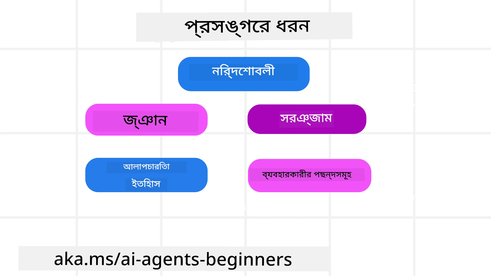
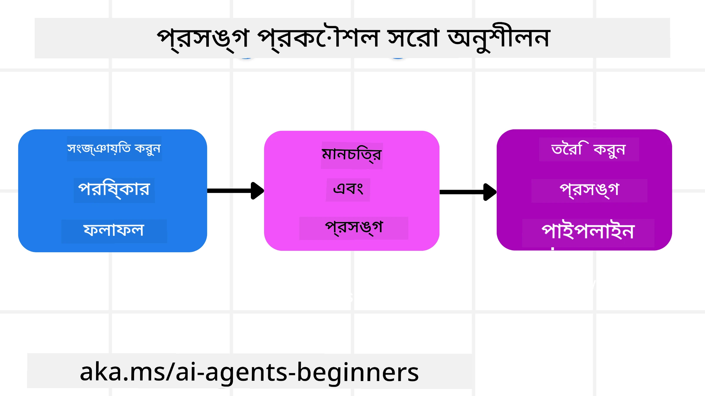

# AI এজেন্টদের জন্য প্রসঙ্গ প্রকৌশল

> _(এই পাঠের ভিডিও দেখতে উপরের ছবি ক্লিক করুন)_

আপনি যে অ্যাপ্লিকেশনটির জন্য AI এজেন্ট তৈরি করছেন তার জটিলতা বোঝা একটি নির্ভরযোগ্য এজেন্ট তৈরিতে গুরুত্বপূর্ণ। আমাদের এমন AI এজেন্ট তৈরি করতে হবে যা তথ্য দক্ষতার সাথে পরিচালনা করতে পারে, শুধুমাত্র প্রম্পট ইঞ্জিনিয়ারিং এর বাইরে গিয়ে জটিল চাহিদা মেটাতে।

এই পাঠে, আমরা দেখব প্রসঙ্গ প্রকৌশল কী এবং AI এজেন্ট তৈরিতে এর ভূমিকা কী।

## পরিচিতি

এই পাঠে আলোচনা করা হবে:

• **প্রসঙ্গ প্রকৌশল কী** এবং কেন এটি প্রম্পট ইঞ্জিনিয়ারিং থেকে ভিন্ন।

• **কার্যকর প্রসঙ্গ প্রকৌশলের কৌশল**, যার মধ্যে তথ্য লেখার, নির্বাচন করার, সংকুচিত করার এবং পৃথক করার পদ্ধতি অন্তর্ভুক্ত।

• **সাধারণ প্রসঙ্গ ব্যর্থতা** যা আপনার AI এজেন্টকে ব্যাহত করতে পারে এবং সেগুলি কীভাবে সমাধান করবেন।

## শেখার লক্ষ্যসমূহ

এই পাঠ শেষ করার পর, আপনি বুঝতে পারবেন:

• **প্রসঙ্গ প্রকৌশলের সংজ্ঞা** এবং এটি প্রম্পট ইঞ্জিনিয়ারিং থেকে কিভাবে আলাদা।

• **বড় ভাষা মডেল (LLM) অ্যাপ্লিকেশনে প্রসঙ্গের মূল উপাদানগুলি সনাক্ত করা।**

• **এজেন্টের কর্মদক্ষতা উন্নত করতে প্রসঙ্গ লেখার, নির্বাচন, সংকোচন এবং পৃথক করার কৌশল প্রয়োগ করা।**

• **সাধারণ প্রসঙ্গ ব্যর্থতা যেমন বিষক্রিয়া, বিভ্রান্তি, গোলযোগ, এবং সংঘর্ষ চিনতে পারা এবং প্রতিকারমূলক প্রযুক্তি প্রয়োগ।**

## প্রসঙ্গ প্রকৌশল কী?

AI এজেন্টদের জন্য প্রসঙ্গ হল এমন কিছু যা AI এজেন্টকে নির্দিষ্ট কর্মের পরিকল্পনা নিতে পরিচালিত করে। প্রসঙ্গ প্রকৌশল হল এই প্রক্রিয়া যাতে AI এজেন্টের কাছে কাজের পরবর্তী ধাপ সম্পন্ন করার জন্য সঠিক তথ্য থাকে নিশ্চিত করা। প্রসঙ্গ উইন্ডো আকারে সীমিত, তাই এজেন্ট নির্মাতা হিসেবে আমাদের প্রক্রিয়া ও সিস্টেম তৈরি করতে হয় যাতে প্রসঙ্গে তথ্য যোগ, অপসারণ এবং সংক্ষিপ্ত করা যায়।

### প্রম্পট ইঞ্জিনিয়ারিং বনাম প্রসঙ্গ প্রকৌশল

প্রম্পট ইঞ্জিনিয়ারিং মূলত একক, স্থির নির্দেশনা সেটের উপর কেন্দ্রীভূত যা AI এজেন্টদের নিয়মের সেট দিয়ে কার্যকরভাবে পরিচালনা করে। প্রসঙ্গ প্রকৌশল হল একটি গতিশীল তথ্যের সেট পরিচালনার কৌশল, যার মধ্যে প্রাথমিক প্রম্পটও থাকে, যা নিশ্চিত করে AI এজেন্টের কাছে সময়ের সাথে যা কিছু প্রয়োজন তা থাকে। প্রসঙ্গ প্রকৌশলের প্রধান ধারণা হল এই প্রক্রিয়াটি পুনরাবৃত্তি যোগ্য এবং নির্ভরযোগ্য করা।

### প্রসঙ্গের ধরণসমূহ

মনে রাখা গুরুত্বপূর্ণ যে প্রসঙ্গ কেবল একটি জিনিস নয়। AI এজেন্টের প্রয়োজনীয় তথ্য বিভিন্ন উৎস থেকে আসতে পারে এবং আমাদের দায়িত্ব এই উৎসগুলোকে এজেন্টের জন্য অ্যাক্সেসযোগ্য করে তোলা:

একটি AI এজেন্ট যা প্রসঙ্গ পরিচালনা করতে পারে তার ধরণগুলি হলো:

• **নির্দেশাবলী:** এগুলো এজেন্টের "নিয়ম"-এর মতো – প্রম্পট, সিস্টেম মেসেজ, কয়েকটি উদাহরণ (AI কে কীভাবে কিছু করতে হয় তা দেখানো), এবং যন্ত্রপাতি ব্যবহারের বর্ণনা। এখানেই প্রম্পট ইঞ্জিনিয়ারিংয়ের ফোকাস প্রসঙ্গ প্রকৌশলের সাথে মিশে যায়।

• **জ্ঞান:** এটি তথ্য, ডেটাবেস থেকে পাওয়া তথ্য, বা এজেন্টের সংরক্ষিত দীর্ঘমেয়াদী স্মৃতি অন্তর্ভুক্ত করে। এতে একটি Retrieval Augmented Generation (RAG) সিস্টেম যোগ করা যেতে পারে যদি এজেন্টকে বিভিন্ন জ্ঞানের উৎস ও ডেটাবেসে অ্যাক্সেস প্রয়োজন হয়।

• **সরঞ্জাম:** এগুলো হল বাইরের ফাংশন, API এবং MCP সার্ভারগুলোর সংজ্ঞা যা এজেন্ট কল করতে পারে, সাথে সেগুলি ব্যবহারের ফলাফল।

• **সংলাপ ইতিহাস:** ব্যবহারকারীর সাথে চলমান কথোপকথন। সময়ের সঙ্গে কথা বার্তা দীর্ঘ ও জটিল হয়, ফলে প্রসঙ্গ উইন্ডোতে বেশি জায়গা নেয়।

• **ব্যবহারকারীর পছন্দসমূহ:** ব্যবহারকারীর পছন্দ বা অপ্রিয়তা সময়ের সাথে শেখা তথ্য। এগুলো সংরক্ষণ করে গুরুত্বপূর্ণ সিদ্ধান্ত নেওয়ার সময় ব্যবহার করা যেতে পারে।

## কার্যকর প্রসঙ্গ প্রকৌশলের কৌশলসমূহ

### পরিকল্পনামূলক কৌশল

ভাল প্রসঙ্গ প্রকৌশল ভাল পরিকল্পনা থেকে শুরু হয়। এখানে একটি পদ্ধতি দেওয়া হলো যা আপনাকে প্রসঙ্গ প্রকৌশল প্রয়োগ সম্পর্কে ভাবতে সাহায্য করবে:

1. **সুস্পষ্ট ফলাফল নির্ধারণ করুন** - AI এজেন্ট যেসব কাজ করবে সেগুলোর ফলাফল স্পষ্টভাবে নির্ধারণ করা উচিত। প্রশ্নের উত্তর দিন - "AI এজেন্ট কাজ শেষ করার পর পৃথিবী কেমন দেখাবে?" অর্থাৎ, ব্যবহারকারী AI এজেন্টের সাথে মিথস্ক্রিয়া করার পর কী পরিবর্তন, তথ্য, বা প্রতিক্রিয়া পাবে।

2. **প্রসঙ্গ ম্যাপ করুন** - একবার AI এজেন্টের ফলাফল নির্ধারণ করার পর প্রশ্নের উত্তর দিন "AI এজেন্ট কী তথ্য প্রয়োজন এই কাজ সম্পন্ন করতে?" এভাবে আপনি তথ্যটি কোথায় অবস্থিত তা ম্যাপ করতে পারেন।

3. **প্রসঙ্গ পাইপলাইন তৈরি করুন** - এখন যেহেতু তথ্য কোথায় তা জানেন, প্রশ্নের উত্তর দিন "কিভাবে এজেন্ট এই তথ্য পাবে?" এটি বিভিন্ন উপায়ে হতে পারে, যেমন RAG, MCP সার্ভার এবং অন্যান্য সরঞ্জাম ব্যবহারের মাধ্যমে।

### বাস্তবিক কৌশল

পরিকল্পনা গুরুত্বপূর্ণ, কিন্তু যখন তথ্য এজেন্টের প্রসঙ্গ উইন্ডোতে প্রবাহিত হতে শুরু করে, তখন আমাদের বাস্তবিক কৌশল দরকার তা পরিচালনার জন্য:

#### প্রসঙ্গ পরিচালনা

কিছু তথ্য স্বয়ংক্রিয়ভাবে প্রসঙ্গ উইন্ডোতে যোগ করা হবে, কিন্তু প্রসঙ্গ প্রকৌশল হল তথ্য সম্পর্কে আরো সক্রিয় ভূমিকা নেওয়া যা নিম্নলিখিত কৌশলগুলির মাধ্যমে করা যায়:

1. **এজেন্ট স্ক্র্যাচপ্যাড**  
এটি AI এজেন্টকে সক্ষম করে চলতি সেশন চলাকালীন প্রাসঙ্গিক তথ্যের নোট নিতে। এটি প্রসঙ্গ উইন্ডোর বাইরে একটি ফাইল বা রUNTIME অবজেক্টে থাকা উচিত যা প্রয়োজনে এজেন্ট পরে উদ্ধার করতে পারে।

2. **স্মৃতি**  
স্ক্র্যাচপ্যাড একক সেশনের বাইরে তথ্য ব্যবস্থাপনা করতে ভালো। স্মৃতি এজেন্টদের একাধিক সেশনে প্রাসঙ্গিক তথ্য সংরক্ষণ ও পুনরুদ্ধার করতে সক্ষম করে। এতে সারাংশ, ব্যবহারকারীর পছন্দ এবং ভবিষ্যতের উন্নয়নের মত ফিডব্যাক অন্তর্ভুক্ত হতে পারে।

3. **প্রসঙ্গ সংকোচন**  
যখন প্রসঙ্গ উইন্ডো বৃদ্ধি পায় এবং সীমার কাছাকাছি যায় তখন সারাংশ তৈরি এবং ছাঁটাই পদ্ধতি ব্যবহার করা হয়। এর মধ্যে সবচেয়ে প্রাসঙ্গিক তথ্য রাখার অথবা পুরনো বার্তা মুছে ফেলার কাজ থাকে।

4. **মাল্টি-এজেন্ট সিস্টেম**  
মাল্টি-এজেন্ট সিস্টেম তৈরি করা একটি ধরণের প্রসঙ্গ প্রকৌশল কারণ প্রতিটি এজেন্টের নিজের প্রসঙ্গ উইন্ডো থাকে। কীভাবে প্রসঙ্গ শেয়ার করা হয় ও বিভিন্ন এজেন্টের মধ্যে প্রেরণ করা হয় তা পরিকল্পনা করতে হয়।

5. **স্যান্ডবক্স পরিবেশ**  
একটি এজেন্ট যদি কোড রান করতে বা একটি ডকুমেন্টে বড় পরিমাণ তথ্য প্রক্রিয়াকরণ করতে চায়, তাহলে এটি অনেক টোকেন ব্যবহার করবে। পুরো তথ্য প্রসঙ্গ উইন্ডোতে রাখার শিফটে, এজেন্ট একটি স্যান্ডবক্স পরিবেশ ব্যবহার করতে পারে যা এই কোড রান করে শুধু ফলাফল ও প্রাসঙ্গিক তথ্য পড়ে।

6. **রানটাইম স্টেট অবজেক্ট**  
এটি তথ্যের কন্টেইনার তৈরি করে যখন এজেন্টকে নির্দিষ্ট তথ্য অ্যাক্সেস করতে হয় তখন ব্যবহৃত হয়। একটি জটিল কাজের ক্ষেত্রে এটি এজেন্টকে প্রতিটি উপ-কাজের ফলাফল ধাপে ধাপে সংরক্ষণ করতে দেয়, ফলে প্রসঙ্গ শুধুমাত্র সেই নির্দিষ্ট উপ-কাজের সাথে সংযুক্ত থাকে।

#### প্রসঙ্গ পরিদর্শন

একবার আপনি এই কৌশলগুলির একটি প্রয়োগ করার পর পরবর্তী মডেল কল আসলে কী পেয়েছে তা যাচাই করা মূল্যবান। একটি দরকারী ডিবাগিং প্রশ্ন:

> এজেন্ট অতিরিক্ত প্রসঙ্গ লোড করেছে, ভুল প্রসঙ্গ ব্যবহার করেছে, না কি প্রয়োজনীয় প্রসঙ্গ বাদ দিয়েছে?

এই প্রশ্নের উত্তর দিতে আপনাকে কাঁচা প্রম্পট, সরঞ্জাম আউটপুট, অথবা মেমোরি কনটেন্ট লগ করতে হবে না। প্রোডাকশনে ছোট প্রসঙ্গ পরিদর্শন রেকর্ড ব্যবহার করা উত্তম যা গণনা, আইডি, হ্যাশ, এবং নীতি লেবেল ক্যাপচার করে:

- **নির্বাচন:** কতগুলো প্রার্থী অংশ, টুল, বা মেমোরি বিবেচনা করা হয়েছে, কতগুলো নির্বাচিত হয়েছে, এবং কোন নিয়ম বা স্কোর অন্যগুলো ফিল্টার করেছে তা ট্র্যাক করুন।
- **সংকোচন:** উৎস রেঞ্জ বা ট্রেস আইডি, সারাংশ আইডি, সংকোচনের আগে ও পরে অনুপাত, এবং পরবর্তী কল থেকে কাঁচা কনটেন্ট বাদ দেওয়া হয়েছে কিনা তা রেকর্ড করুন।
- **পৃথককরণ:** কোন উপ-কাজ আলাদা এজেন্ট, সেশন বা স্যান্ডবক্সে চালানো হয়েছে, সীমাবদ্ধ সারাংশ কী ছিল, এবং বড় টুল আউটপুট মূল এজেন্ট প্রসঙ্গের বাইরে ছিল কিনা তা নোট করুন।
- **মেমোরি ও RAG:** পুর্ণ টেক্সটের পরিবর্তে পুনরুদ্ধৃত ডকুমেন্ট আইডি, মেমোরি আইডি, স্কোর, নির্বাচিত আইডি, এবং রিড্যাকশন স্ট্যাটাস সংরক্ষণ করুন।
- **নিরাপত্তা ও গোপনীয়তা:** সংবেদনশীল প্রম্পট টেক্সট, টুল আর্গুমেন্ট, টুল ফলাফল, বা ব্যবহারকারীর মেমোরি শরীরের পরিবর্তে হ্যাশ, আইডি, টোকেন বাকেট, এবং নীতি লেবেল ব্যবহার করুন।

লক্ষ্য হল শুধু বেশি প্রসঙ্গ রাখা নয়। বরং যথেষ্ট প্রমাণ রাখা যাতে একজন ডেভেলপার বলতে পারে কোন প্রসঙ্গ কৌশল চলে এবং এটি পরবর্তী মডেল কলকে কাঙ্ক্ষিতভাবে পরিবর্তিত করেছে কিনা।

### প্রসঙ্গ প্রকৌশলের উদাহরণ

ধরা যাক আমরা একটি AI এজেন্ট চাইছি যা **"আমার প্যারিসে একটি ট্রিপ বুক করেবে।"**

• শুধুমাত্র প্রম্পট ইঞ্জিনিয়ারিং ব্যবহার করা একটি সরল এজেন্ট হয়তো বলবে: **"ঠিক আছে, আপনি কখন প্যারিসে যেতে চান?"** এটি কেবল তখনকার সময় ব্যবহারকারীর সরাসরি প্রশ্ন প্রক্রিয়াজাত করেছে।

• প্রসঙ্গ প্রকৌশলের কৌশল ব্যবহার করা এজেন্ট অনেক বেশি করবে। প্রতিক্রিয়া দেওয়ার আগে এর সিস্টেম হয়তো:

  ◦ **আপনার ক্যালেন্ডার চেক করবে** (বাস্তব সময় তথ্য পুনরুদ্ধার করে)।

  ◦ **অতীত ভ্রমণ পছন্দস্মৃতি recall করবে** (দীর্ঘমেয়াদী স্মৃতি থেকে), যেমন আপনার প্রিয় এয়ারলাইন, বাজেট, অথবা সরাসরি ফ্লাইট পছন্দ ইত্যাদি।

  ◦ **ফ্লাইট ও হোটেল বুকিংয়ের সরঞ্জাম চিহ্নিত করবে।**

- তারপর এর উদাহরণ উত্তর হতে পারে: "হ্যালো [আপনার নাম]! আমি দেখছি আপনি অক্টোবরের প্রথম সপ্তাহে ফ্রি আছেন। আমি কি [পছন্দসই এয়ারলাইন] এর মাধ্যমে আপনার বাজেট [বাজেট] এর মধ্যে সরাসরি প্যারিস ফ্লাইট খুঁজে দেখতে পারি?" এই ধনী, প্রসঙ্গ-সচেতন উত্তর প্রসঙ্গ প্রকৌশলের শক্তি প্রদর্শন করে।

## সাধারণ প্রসঙ্গ ব্যর্থতা

### প্রসঙ্গ বিষক্রিয়া

**এটি কী:** যখন কোনো প্রত্যাশিত তথ্যের পরিবর্তে ভুল তথ্য (LLM দ্বারা নির্মিত ভুল তথ্য বা হ্যালুসিনেশন) প্রসঙ্গে প্রবেশ করে এবং বারবার উল্লেখ করা হয়, এজেন্ট অসম্ভব লক্ষ্য অনুসরণ করে বা বোকামি স্ট্র্যাটেজি তৈরি করে।

**কী করবেন:** **প্রসঙ্গ যাচাই** ও **কোয়ারেন্টাইন** বাস্তবায়ন করুন। তথ্য দীর্ঘমেয়াদী মেমোরিতে যোগ করার আগে যাচাই করুন। সম্ভাব্য বিষক্রিয়া শনাক্ত হলে নতুন প্রসঙ্গ থ্রেড শুরু করুন যাতে মন্দ তথ্য ছড়িয়ে না পড়ে।

**ভ্রমণ বুকিং উদাহরণ:** আপনার এজেন্ট একটি **ছোট একটি স্থানীয় বিমানবন্দর থেকে দূরের একটি আন্তর্জাতিক শহরে সরাসরি ফ্লাইট থাকার ভুল ধারণা তৈরি করে**, যেখানে প্রকৃতপক্ষে আন্তর্জাতিক ফ্লাইট নেই। এই অবাস্তব ফ্লাইট বিস্তারিত প্রসঙ্গে সংরক্ষণ হয়। পরে, যখন আপনি বুকিং চান, তখন এজেন্ট বারবার এই অসম্ভব রুটের টিকিট খুঁজতে চেষ্টা করে, ফলস্বরূপ বারবার ভুল হয়।

**সমাধান:** একটি পর্যায় যুক্ত করুন যা **ফ্লাইটের অস্তিত্ব ও রুট বাস্তবায়িত API দিয়ে যাচাই করে** _ফ্লাইট বিস্তারিত প্রসঙ্গে যোগ করার আগে_। যাচাই ব্যর্থ হলে, ভুল তথ্য "কোয়ারেন্টাইন" করা হয় এবং আর ব্যবহার করা হয় না।

### প্রসঙ্গ বিভ্রান্তি

**এটি কী:** যখন প্রসঙ্গ এত বড় হয়ে যায় যে মডেল শিক্ষার পরিবর্তে জমা হওয়া ইতিহাসে বেশি মনোযোগ দেয়, যার ফলে পুনরাবৃত্তি বা অপ্রয়োজনীয় কর্ম ঘটায়। মডেল প্রায়ই প্রসঙ্গ উইন্ডো পূর্ণ হওয়ার আগেও ভুল করতে শুরু করে।

**কী করবেন:** **প্রসঙ্গ সারাংশ তৈরি** করুন। সময়ে সময়ে জমা তথ্যকে সংক্ষিপ্ত সারাংশে সংকুচিত করুন, গুরুত্বপূর্ণ তথ্য রেখে অতিরিক্ত ইতিহাস মুছে দিন। এটি মনোযোগ "রিসেট" করতে সাহায্য করে।

**ভ্রমণ বুকিং উদাহরণ:** আপনি অনেকক্ষণ ধরে ভ্রমণের বিভিন্ন স্বপ্নের গন্তব্য নিয়ে আলোচনা করছেন, এর মধ্যে দুই বছর আগে আপনার ব্যাকপ্যাকিং ট্রিপের বিস্তারিত বর্ণনা। যখন আপনি অবশেষে **"পরবর্তী মাসের জন্য সস্তা ফ্লাইট খুঁজে দিন"** বলেন, তখন এজেন্ট পুরাতন অপ্রাসঙ্গিক বিবরণে আটকে পড়ে এবং বারবার আপনার ব্যাকপ্যাকিং গিয়ার বা পুরনো ভ্রমণের কথা জিজ্ঞাসা করে, আপনার বর্তমান দাবি ত্যাগ করে।

**সমাধান:** একাধিক টার্ন পর বা প্রসঙ্গ বিশাল হওয়ার সময়, এজেন্টকে সর্বশেষ এবং প্রাসঙ্গিক কথোপকথনের অংশগুলি সারসংক্ষেপ করতে হবে – আপনার বর্তমান ভ্রমণের তারিখ ও গন্তব্যে ফোকাস করেই – এবং এই সংকুচিত সারাংশ পরবর্তী LLM কলের জন্য ব্যবহার করতে হবে, অপর প্রাসঙ্গিক পুরনো কথোপকথন বাদ দিয়ে।

### প্রসঙ্গ গোলযোগ

**এটি কী:** যখন অতিরিক্ত অপ্রয়োজনীয় প্রসঙ্গ, যেমন অনেক টুল পাওয়া যেতে থাকা, মডেলকে খারাপ প্রতিক্রিয়া তৈরি করতে বা অপ্রাসঙ্গিক টুল কল করতে বাধ্য করে। ছোট মডেলগুলি এই সমস্যায় বিশেষভাবে প্রবণ।

**কী করবেন:** RAG পদ্ধতি ব্যবহার করে **টুল লোডআউট ম্যানেজমেন্ট** প্রয়োগ করুন। টুলের বর্ণনা ভেক্টর ডেটাবেসে রাখুন এবং প্রত্যেক নির্দিষ্ট কাজের জন্য _শুধুমাত্র_ সবচেয়ে প্রাসঙ্গিক টুল নির্বাচন করুন। গবেষণায় দেখা গেছে ৩০টির কম টুল নির্বাচন সীমাবদ্ধ করা ভালো।

**ভ্রমণ বুকিং উদাহরণ:** আপনার এজেন্টের কাছে ডজনের বেশি টুল আছে: `book_flight`, `book_hotel`, `rent_car`, `find_tours`, `currency_converter`, `weather_forecast`, `restaurant_reservations`, ইত্যাদি। আপনি প্রশ্ন করেন, **"প্যারিসে চলাচলের সেরা উপায় কী?"** অনেক টুল থাকার কারণে এজেন্ট বিভ্রান্ত হয় এবং প্যারিসের মধ্যে `book_flight` কল করার চেষ্টা করে বা আপনি পাবলিক ট্রান্সপোর্ট পছন্দ করলেও `rent_car` কল করে, কারণ টুল বর্ণনাগুলো ওভারল্যাপ করতে পারে বা এটি সঠিক টুল বেছে নিতে পারে না।

**সমাধান:** টুল বর্ণনার উপর **RAG ব্যবহার করুন**। যখন আপনি প্যারিসে চলাচল সম্পর্কিত প্রশ্ন করবেন, সিস্টেম শুধুমাত্র আপনার প্রশ্ন অনুসারে সবচেয়ে প্রাসঙ্গিক টুল যেমন `rent_car` বা `public_transport_info` ডায়নামিক্যালি ফেরত দেবে, মডেলে একটি ফোকাসড "লোডআউট" পেশ করবে।

### প্রসঙ্গ সংঘর্ষ

**এটি কী:** যখন প্রসঙ্গে দ্বন্দ্বপূর্ণ তথ্য থাকে, যার ফলে অসঙ্গত যুক্তি বা খারাপ চূড়ান্ত প্রতিক্রিয়া হয়। সাধারণত তথ্য ধাপে ধাপে আসার ফলে এবং প্রাথমিক ভুল অনুমান প্রসঙ্গে থেকে যায় এর জন্য দায়ী।

**কী করবেন:** **প্রসঙ্গ ছাঁটাই** এবং **অফলোডিং** ব্যবহার করুন। ছাঁটাই মানে পুরনো বা দ্বন্দ্বপূর্ণ তথ্য মুছে ফেলা যখন নতুন তথ্য আসে। অফলোডিং মডেলকে একটি পৃথক "স্ক্র্যাচপ্যাড" কাজের জায়গা দেয় যেখানে তথ্য প্রক্রিয়া হয় মূল প্রসঙ্গের অগোছালো না করে।
**যাত্রা বুকিং উদাহরণ:** আপনি প্রথমে আপনার এজেন্টকে বলেন, **"আমি ইকোনমি ক্লাসে উড়তে চাই।"** কথোপকথনের পর, আপনি আপনার মন পরিবর্তন করে বলেন, **"আসলেই, এই যাত্রার জন্য, চল ব্যবসায়িক ক্লাসে যাই।"** যদি উভয় নির্দেশনা প্রসঙ্গে থাকে, তাহলে এজেন্ট হয়তো বিরোধপূর্ণ অনুসন্ধানের ফলাফল পেতে পারে কিংবা কোন পছন্দকে অগ্রাধিকার দিবে তা বুঝতে ভ্রান্ত হতে পারে।

**সমাধান:** প্রয়োগ করুন **প্রসঙ্গ ছাঁটাই**। যখন একটি নতুন নির্দেশনা পুরনো নির্দেশনার সঙ্গে বিরোধ সৃষ্টি করে, তখন পুরনো নির্দেশনাটি প্রসঙ্গ থেকে সরিয়ে দেওয়া হয় বা স্পষ্টভাবে ওভাররাইড করা হয়। বিকল্পভাবে, এজেন্ট একটি **স্ক্র্যাচপ্যাড** ব্যবহার করতে পারে বিরোধপূর্ণ পছন্দগুলো মিলিয়ে সিদ্ধান্ত নেয়ার আগে, নিশ্চিত করে শুধুমাত্র চূড়ান্ত এবং সঙ্গতিপূর্ণ নির্দেশনাই তার কাজের দিকনির্দেশ করে।

## প্রসঙ্গ প্রকৌশল সম্পর্কিত আরও প্রশ্ন আছে?

অন্য শিক্ষার্থীদের সাথে মিলিত হতে, অফিস আওয়ারে অংশ নিতে এবং আপনার AI এজেন্ট সম্পর্কিত প্রশ্নের উত্তর পেতে [Microsoft Foundry Discord](https://aka.ms/ai-agents/discord) এ যোগ দিন।

---

<!-- CO-OP TRANSLATOR DISCLAIMER START -->
**অস্বীকৃতি**:
এই নথিটি AI অনুবাদ পরিষেবা [Co-op Translator](https://github.com/Azure/co-op-translator) ব্যবহার করে অনূদিত হয়েছে। যদিও আমরা শুদ্ধতার জন্য চেষ্টা করি, অনুগ্রহ করে মনে রাখবেন যে স্বয়ংক্রিয় অনুবাদে ত্রুটি বা অসঙ্গতি থাকতে পারে। মূল নথিটি তার স্বভাষায় কর্তৃত্বপূর্ণ উৎস হিসেবে বিবেচিত হওয়া উচিত। গুরুত্বপূর্ণ তথ্যের জন্য পেশাদার মানব অনুবাদ সুপারিশ করা হয়। এই অনুবাদের ব্যবহারে প্রয়োজনীয় ভুল বোঝাবুঝি বা ভুল ব্যাখ্যার জন্য আমরা দায়বদ্ধ নই।
<!-- CO-OP TRANSLATOR DISCLAIMER END -->