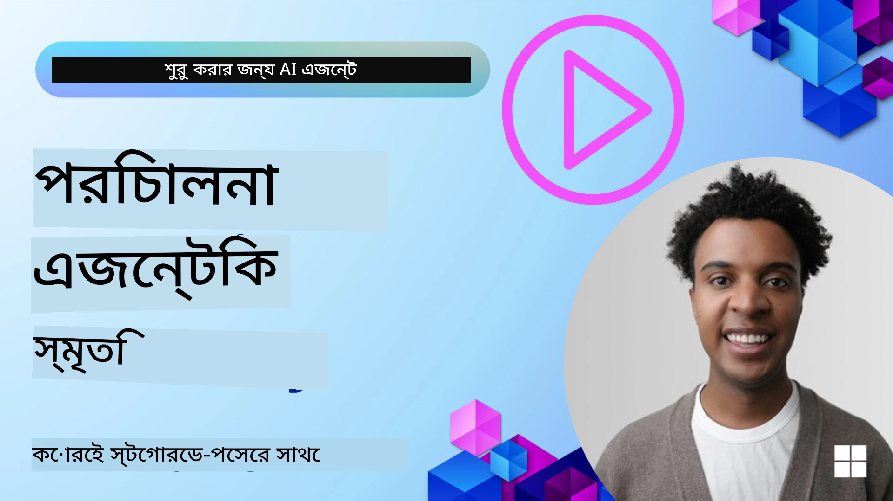

# এআই এজেন্টদের স্মৃতি 

এআই এজেন্ট তৈরি করার অনন্য সুবিধাগুলো আলোচনা করার সময় প্রধানত দুটি বিষয় উঠে আসে: কাজ সম্পন্ন করতে টুল কল করার ক্ষমতা এবং সময়ের সঙ্গে উন্নতি করার ক্ষমতা। স্ব-উন্নয়নশীল এজেন্ট তৈরি করার ভিত্তি হচ্ছে মেমরি, যা আমাদের ব্যবহারকারীদের জন্য আরও ভাল অভিজ্ঞতা তৈরি করতে সাহায্য করে।

এই পাঠে, আমরা দেখব এআই এজেন্টদের জন্য মেমরি কী এবং কীভাবে আমরা এটি পরিচালনা করে আমাদের অ্যাপ্লিকেশনগুলোর সুবিধার্থে ব্যবহার করতে পারি।

## পরিচিতি

এই পাঠে নিম্নলিখিত বিষয়গুলো কভার করা হবে:

• **এআই এজেন্ট মেমরি বোঝা**: মেমরি কী এবং কেন এটি এজেন্টদের জন্য অপরিহার্য।

• **মেমরি বাস্তবায়ন এবং সংরক্ষণ**: ছোট মেয়াদি এবং দীর্ঘমেয়াদি মেমরির দিকে ফোকাস করে আপনার এআই এজেন্টগুলিতে মেমরি সক্ষমতা যোগ করার বাস্তব পদ্ধতিগুলো।

• **এআই এজেন্টকে স্ব-উন্নত করা**: কিভাবে মেমরি এজেন্টকে পূর্বের ইন্টারঅ্যাকশন থেকে শেখায় এবং সময়ের সঙ্গে উন্নতি করে।

## উপলব্ধ বাস্তবায়ন

এই পাঠে দুটি ব্যাপক নোটবুক টিউটোরিয়াল রয়েছে:

• **[13-agent-memory.ipynb](./13-agent-memory.ipynb)**: Mem0 এবং Azure AI Search ব্যবহার করে Microsoft Agent Framework-এর সঙ্গে মেমরি বাস্তবায়ন করে

• **[13-agent-memory-cognee.ipynb](./13-agent-memory-cognee.ipynb)**: Cognee ব্যবহার করে গঠিত মেমরি বাস্তবায়ন করে, যা এমবেডিং দ্বারা ব্যাক করা জ্ঞান গ্রাফ স্বয়ংক্রিয়ভাবে তৈরি করে, গ্রাফ ভিজ্যুয়ালাইজ করে এবং বুদ্ধিমান রিট্রিভাল প্রদান করে

## শেখার লক্ষ্য

এই পাঠ সম্পন্ন করার পরে, আপনি জানতে পারবেন কীভাবে:

• **বিভিন্ন ধরনের এআই এজেন্ট মেমরির মধ্যে পার্থক্য করা যায়**, যেমন ওয়ার্কিং, শর্ট-টার্ম, এবং লং-টার্ম মেমরি, পাশাপাশি বিশেষায়িত রূপগুলো যেমন persona এবং episodic মেমরি।

• **Microsoft Agent Framework ব্যবহার করে এআই এজেন্টদের জন্য শর্ট-টার্ম এবং লং-টার্ম মেমরি বাস্তবায়ন এবং পরিচালনা করা যায়**, Mem0, Cognee, Whiteboard memory-এর মতো টুল ব্যবহার করে এবং Azure AI Search-এর সঙ্গে ইন্টিগ্রেট করে।

• **স্ব-উন্নত এআই এজেন্টের পেছনের নীতিগুলো বোঝা** এবং শক্তিশালী মেমরি ব্যবস্থাপনা সিস্টেম কিভাবে ক্রমাগত শেখা এবং অভিযোজনকে সাহায্য করে।

## এআই এজেন্ট মেমরি বুঝা

মূলত, **এআই এজেন্টদের জন্য মেমরি বলতে এমন যান্ত্রিক প্রক্রিয়াগুলোকে বোঝায় যা তাদের তথ্য ধরে রাখার এবং স্মরণ করার সক্ষমতা দেয়**। এই তথ্যটি কথোপকথন সম্পর্কিত নির্দিষ্ট বিবরণ, ব্যবহারকারীর পছন্দ, অতীত কর্ম, বা এমনকি শেখা প্যাটার্নগুলোও হতে পারে।

মেমরি না থাকলে, এআই অ্যাপ্লিকেশনগুলো প্রায়ই স্টেটলেস হয়, অর্থাৎ প্রতিটি ইন্টারঅ্যাকশন শূন্য থেকে শুরু হয়। এর ফলে ব্যবহারকারীর অভিজ্ঞতা পুনরাবৃত্তিমূলক ও হতাশাজনক হয়ে উঠতে পারে যেখানে এজেন্ট পূর্বের প্রসঙ্গ বা পছন্দ "ভুলোয়" যায়।

### মেমরি কেন গুরুত্বপূর্ণ?

একটি এজেন্টের বুদ্ধিমত্তা প্রচুর পরিমাণে তার পূর্বের তথ্য স্মরণ এবং ব্যবহার করার ক্ষমতার ওপর নির্ভরশীল। মেমরি এজেন্টগুলোকে সক্ষম করে:

• **প্রতিবিম্বিত**: পূর্বের কাজ এবং ফলাফল থেকে শেখা।

• **ইন্টারঅ্যাকটিভ**: চলমান কথোপকথনের প্রসঙ্গ বজায় রাখা।

• **প্রোঅ্যাকটিভ এবং রিএকটিভ**: ঐতিহাসিক ডেটার ভিত্তিতে চাহিদা পূর্বানুমান বা উপযুক্তভাবে প্রতিক্রিয়া জানানো।

• **স্বায়ত্তশাসিত**: সংরক্ষিত জ্ঞানের ওপর নির্ভর করে বেশি স্বাধীনভাবে কাজ করা।

মেমরি বাস্তবায়নের লক্ষ্য হচ্ছে এজেন্টকে আরও **বিশ্বস্ত এবং সক্ষম** করা।

### মেমরির ধরন

#### ওয়ার্কিং মেমরি

এটিকে এমন একটি স্ক্র্যাচ পেপারের মতো ভাবুন যা একজন এজেন্ট একটি একক, চলমান কাজ বা চিন্তাপ্রক্রিয়ার সময় ব্যবহার করে। এটি পরবর্তী ধাপ গণনা করার জন্য প্রয়োজনীয় তাত্ক্ষণিক তথ্য ধারণ করে।

এআই এজেন্টদের জন্য, ওয়ার্কিং মেমরি প্রায়ই কথোপকথন থেকে সবচেয়ে প্রাসঙ্গিক তথ্য ধরতে সাহায্য করে, এমনকি পুরো চ্যাট ইতিহাস দীর্ঘ বা ট্রাঙ্কেটেড হলেও। এটি অনিবার্যভাবে প্রয়োজনীয় উপাদানগুলো যেমন চাহিদা, প্রস্তাব, সিদ্ধান্ত, এবং কর্মগুলো বের করতে মনোযোগ দেয়।

**ওয়ার্কিং মেমরি উদাহরণ**

একটি ট্রাভেল বুকিং এজেন্টে, ওয়ার্কিং মেমরি ব্যবহারকারীর বর্তমান অনুরোধ ধরে রাখতে পারে, যেমন "আমি প্যারিসে ট্রিপ বুক করতে চাই"। এই নির্দিষ্ট চাহিদা এজেন্টের তাৎক্ষণিক প্রসঙ্গে রাখা হয় যাতে বর্তমান ইন্টারঅ্যাকশন পরিচালিত হয়।

#### শর্ট টার্ম মেমরি

এই ধরনের মেমরি একটি একক কথোপকথন বা সেশনের সময়কাল ধরে তথ্য রাখে। এটি চলমান চ্যাটের প্রসঙ্গ, যা এজেন্টকে ডায়ালগের পূর্ববর্তী টার্নগুলোর দিকে ফেরত উল্লেখ করতে দেয়।

**শর্ট টার্ম মেমরি উদাহরণ**

যদি একজন ব্যবহারকারী জিজ্ঞাসা করে, "প্যারিসে একটি ফ্লাইট কত খরচ হবে?" এবং পরে অনুসরণ করে "ওখানে আবাসনের ব্যাপারটা কীভাবে?" তবে শর্ট-টার্ম মেমরি নিশ্চিত করে যে এজেন্ট জানে "ওখানে" একই কথোপকথনের মধ্যে "প্যারিস"-কে নির্দেশ করছে।

#### লং টার্ম মেমরি

এটি এমন তথ্য যা একাধিক কথোপকথন বা সেশন জুড়ে স্থায়ী হয়। এটি এজেন্টকে ব্যবহারকারীর পছন্দ, ঐতিহাসিক ইন্টারঅ্যাকশন, বা দীর্ঘ সময়ের উপর সাধারণ জ্ঞান মনে রাখতে দেয়। এটি পার্সোনালাইজেশনের জন্য গুরুত্বপূর্ণ।

**লং টার্ম মেমরি উদাহরণ**

একটি লং-টার্ম মেমরি সংরক্ষণ করতে পারে যে "Ben স্কিইং এবং আউটডোর কার্যকলাপে আগ্রহী, পাহাড় দেখার সাথে কফি পছন্দ করেন, এবং অতীতের এক আঘাতের কারণে উন্নত স্কি ঢাল এড়াতে চান"। পূর্ববর্তী ইন্টারঅ্যাকশন থেকে শেখা এই তথ্য ভবিষ্যতের ট্র্যাভেল প্ল্যানিং সেশনগুলোতে সুপারিশকে প্রভাবিত করবে, ফলে সেগুলো অত্যন্ত ব্যক্তিগতকৃত হবে।

#### Persona মেমরি

এই বিশেষায়িত মেমরি টাইপটি একটি এজেন্টকে একটি ধারাবাহিক "ব্যক্তিত্ব" বা "পারসোনা" তৈরি করতে সাহায্য করে। এটি এজেন্টকে তার নিজের বা তার উদ্দেশ্যভিত্তিক ভূমিকা সম্পর্কিত তথ্য স্মরণ করতে দেয়, ফলে ইন্টারঅ্যাকশনগুলো আরও প্রবাহমান এবং কেন্দ্রীভূত হয়।

**Persona মেমরি উদাহরণ**
যদি ট্রাভেল এজেন্টকে একজন "এক্সপার্ট স্কি প্ল্যানার" হিসেবে ডিজাইন করা হয়, তাহলে persona মেমরি এই ভূমিকাকে দৃঢ় করতে পারে এবং তার প্রতিক্রিয়াগুলোকে একজন বিশেষজ্ঞের স্বর এবং জ্ঞানের সাথে সঙ্গতিপূর্ণ করে তুলবে।

#### ওয়ার্কফ্লো/এপিসোডিক মেমরি

এই মেমরি একটি জটিল কাজের সময় এজেন্ট যে ধাপগুলোর সিরিজ গ্রহণ করে তা সংরক্ষণ করে, সফলতা এবং ব্যর্থতা সহ। এটি নির্দিষ্ট "এপিসোড" বা অতীত অভিজ্ঞতাগুলো মনে রাখার মতো, যাতে সেখান থেকে শেখা যায়।

**এপিসোডিক মেমরি উদাহরণ**

যদি এজেন্ট একটি নির্দিষ্ট ফ্লাইট বুক করার চেষ্টা করে কিন্তু অনুপলব্ধতার কারণে ব্যর্থ হয়, তবে এপিসোডিক মেমরি এই ব্যর্থতাটি রেকর্ড করতে পারে, যাতে পরবর্তী প্রচেষ্টার সময় এজنت বিকল্প ফ্লাইট চেষ্টা করতে পারে বা ব্যবহারকারীকে আরও তথ্যসমৃদ্ধভাবে জানাতে পারে।

#### এন্টিটি মেমরি

এটি কথোপকথন থেকে নির্দিষ্ট এন্টিটি (যেমন ব্যক্তি, স্থান, বা বস্তু) এবং ঘটনাগুলো বের করে স্মরণ করা জড়িত। এটি এজেন্টকে আলোচিত প্রধান উপাদানগুলোর একটি কাঠামোবদ্ধ ধারণা তৈরি করতে দেয়।

**এন্টিটি মেমরি উদাহরণ**

একটি অতীত ট্রিপ সম্পর্কে কথোপকথন থেকে, এজেন্ট সম্ভবত "Paris," "Eiffel Tower," এবং "dinner at Le Chat Noir restaurant" এর মতো এন্টিটিগুলি বের করতে পারে। ভবিষ্যতের ইন্টারঅ্যাকশনে, এজেন্ট "Le Chat Noir" মনে করে নতুন সংরক্ষণ করতে প্রস্তাব দিতে পারে।

#### Structured RAG (Retrieval Augmented Generation)

যদিও RAG একটি বিস্তৃত কৌশল, "Structured RAG" কে শক্তিশালী মেমরি প্রযুক্তি হিসেবে হাইলাইট করা হয়েছে। এটি বিভিন্ন সূত্র (কথোপকথন, ইমেইল, ইমেজ) থেকে ঘন, কাঠামোবদ্ধ তথ্য বের করে এবং এটি প্রতিক্রিয়ার নির্ভুলতা, রিকল এবং গতি বাড়াতে ব্যবহার করে। ক্লাসিক RAG যা কেবল সেমান্টিক সাদৃশ্যের ওপর নির্ভর করে তার চেয়ে Structured RAG তথ্যের স্বাভাবিক কাঠামোর সঙ্গে কাজ করে।

**Structured RAG উদাহরণ**

শুধু কীওয়ার্ড মিল করাই না করে, Structured RAG ইমেইল থেকে ফ্লাইটের বিস্তারিত (গন্তব্য, তারিখ, সময়, এয়ারলাইন) পার্স করে এবং সেগুলো কাঠামোবদ্ধভাবে সংরক্ষণ করতে পারে। এটি নির্দিষ্ট কুয়েরিগুলোর জন্য সঠিক উত্তর দেয়, যেমন "আমি মঙ্গলবার প্যারিসের জন্য কোন ফ্লাইট বুক করেছিলাম?"

## মেমরি বাস্তবায়ন এবং সংরক্ষণ

এআই এজেন্টদের জন্য মেমরি বাস্তবায়ন একটি সিস্টেম্যাটিক প্রক্রিয়া জড়িত করে যার মধ্যে রয়েছে মেমরি ম্যানেজমেন্ট: তৈরি করা, সংরক্ষণ, রিট্রিভ করা, ইন্টিগ্রেট করা, আপডেট করা, এবং এমনকি "ভুলে যাওয়া" (বা মুছে ফেলা)। রিট্রিভাল একটি বিশেষভাবে গুরুত্বপূর্ন দিক।

### বিশেষায়িত মেমরি টুলস

#### Mem0

এজেন্ট মেমরি সংরক্ষণ এবং পরিচালনার একটি উপায় হচ্ছে Mem0-এর মতো বিশেষায়িত টুল ব্যবহার করা। Mem0 একটি স্থায়ী মেমরি স্তর হিসেবে কাজ করে, যা এজেন্টকে প্রাসঙ্গিক ইন্টারঅ্যাকশন স্মরণ করতে, ব্যবহারকারীর পছন্দ এবং বাস্তব-জ্ঞান সংরক্ষণ করতে, এবং সময়ের সঙ্গে সাফল্য ও ব্যর্থতা থেকে শেখার সুযোগ দেয়। ধারণাটি হচ্ছে স্টেটলেস এজেন্টগুলোকে স্টেটফুল এজেন্টে রূপান্তর করা।

এটি একটি **দ্বি-পর্যায় মেমরি পাইপলাইন: এক্সট্র্যাকশন এবং আপডেট** এর মাধ্যমে কাজ করে। প্রথমে, এজেন্টের থ্রেডে যোগ করা বার্তাগুলো Mem0 সার্ভিসে পাঠানো হয়, যা একটি Large Language Model (LLM) ব্যবহার করে কথোপকথন ইতিহাস সারসংক্ষেপ করে এবং নতুন মেমরি বের করে। পরে, একটি LLM-চালিত আপডেট ধাপ নির্ধারণ করে যে এই মেমরি যোগ করা উচিত, পরিবর্তন করা উচিত, নাকি মুছে ফেলা উচিত, এবং এগুলিকে একটি হাইব্রিড ডেটা স্টোরে সংরক্ষণ করে যা ভেক্টর, গ্রাফ, এবং কী-ভ্যালু ডেটাবেস অন্তর্ভুক্ত করতে পারে। এই সিস্টেমটি বিভিন্ন মেমরি টাইপ সমর্থন করে এবং এন্টিটিগুলোর সম্পর্ক পরিচালনার জন্য গ্রাফ মেমরি অন্তর্ভুক্ত করতে পারে।

#### Cognee

আরেকটি শক্তিশালী পদ্ধতি হচ্ছে **Cognee** ব্যবহার করা, যা ওপেন-সোর্স সেমান্টিক মেমরি এআই এজেন্টদের জন্য এবং এটি স্ট্রাকচার্ড এবং আনস্ট্রাকচার্ড ডেটাকে এমবেডিং দ্বারা ব্যাকড কুয়েরেবল জ্ঞান গ্রাফে রূপান্তর করে। Cognee একটি **ডুয়াল-স্টোর আর্কিটেকচার** প্রদান করে যা ভেক্টর সাদৃশ্য অনুসন্ধানকে গ্রাফ সম্পর্কগুলোর সাথে মিলায়, ফলে এজেন্টগুলো শুধুমাত্র কোন তথ্য একই রকম তা বুঝে না, বরং কিভাবে ধারণাগুলো একে অপরের সাথে সম্পর্কিত সেটাও বুঝতে পারে।

এটি **হাইব্রিড রিট্রিভালে** বিশেষভাবে দক্ষ, যা ভেক্টর সাদৃশ্য, গ্রাফ স্ট্রাকচার এবং LLM রিজনিংকে একত্র করে - কাঁচা চাঙ্ক lookup থেকে গ্রাফ-সচেতন প্রশ্নোত্তর পর্যন্ত। সিস্টেমটি **জীবন্ত মেমরি** বজায় রাখে যা বিবর্তিত হয় এবং বাড়তে থাকে, একই সাথে সংযুক্ত একটি গ্রাফ হিসেবে কুয়েরেবল থাকে, শর্ট-টার্ম সেশন প্রসঙ্গ এবং লং-টার্ম স্থায়ী মেমরিকে সমর্থন করে।

Cognee নোটবুক টিউটোরিয়াল ([13-agent-memory-cognee.ipynb](./13-agent-memory-cognee.ipynb)) এই ঐক্যবদ্ধ মেমরি স্তর তৈরির প্রদর্শন করে, বিভিন্ন ডেটা সোর্স ইনজেস্ট করার ব্যবহারিক উদাহরণ, জ্ঞান গ্রাফ ভিজ্যুয়ালাইজেশন, এবং নির্দিষ্ট এজেন্ট চাহিদার জন্য বিভিন্ন সার্চ কৌশল সহ কুয়েরি করার উদাহরণ দেখায়।

### RAG দিয়ে মেমরি সংরক্ষণ

Mem0-এর মতো বিশেষায়িত মেমরি টুল ছাড়াও, আপনি শক্তিশালী সার্চ সার্ভিসগুলি ব্যবহার করতে পারেন যেমন **Azure AI Search**-কে মেমরি সংরক্ষণ এবং রিট্রিভালের ব্যাকএন্ড হিসেবে ব্যবহার করা, বিশেষত Structured RAG-এর জন্য।

এটি আপনার এজেন্টের উত্তরগুলোকে আপনার নিজের ডেটা দ্বারা গ্রাউন্ড করার অনুমতি দেয়, যাতে আরও প্রাসঙ্গিক এবং সঠিক উত্তর নিশ্চিত করা যায়। Azure AI Search ব্যবহার করে ব্যবহারকারী-নির্দিষ্ট ট্রাভেল মেমরি, পণ্য ক্যাটালগ, বা অন্য কোনো ডোমেইন-নির্দিষ্ট জ্ঞান সংরক্ষণ করা যেতে পারে।

Azure AI Search এর বৈশিষ্ট্যগুলোর মধ্যে রয়েছে **Structured RAG**-এর ক্ষমতা, যা কথোপকথন ইতিহাস, ইমেইল, বা এমনকি ইমেজের মতো বড় ডেটাসেট থেকে ঘন, কাঠামোবদ্ধ তথ্য বের করে এবং রিট্রিভ করে চমৎকার ফল দেয়। এটি প্রচলিত টেক্সট চাঙ্কিং এবং এমবেডিং পদ্ধতির তুলনায় "অতিমানবীয় নির্ভুলতা এবং রিকল" প্রদান করে।

## এআই এজেন্টকে স্ব-উন্নত করা

স্ব-উন্নয়নশীল এজেন্টের একটি সাধারণ প্যাটার্ন হলো একটি **"জ্ঞান এজেন্ট"** পরিচয় করানো। এই পৃথক এজেন্টটি মূল ব্যবহারকারী এবং প্রাথমিক এজেন্টের মধ্যে কথোপকথন পর্যবেক্ষণ করে। এর ভূমিকা হলো:

1. **মূল্যবান তথ্য সনাক্ত করা**: কথোপকথনের কোন অংশ সাধারণ জ্ঞান বা নির্দিষ্ট ব্যবহারকারী পছন্দ হিসেবে সংরক্ষণ করার যোগ্য তা নির্ধারণ করা।

2. **নির্গত করা এবং সারসংক্ষেপ করা**: কথোপকথন থেকে মৌলিক শেখা বা পছন্দটি সংক্ষিপ্ত করা।

3. **জ্ঞানভিত্তিতে সংরক্ষণ করা**: এই নির্গত তথ্যটি সাধারণত একটি ভেক্টর ডাটাবেসে স্থায়ীভাবে সংরক্ষণ করা যাতে পরে তা পুনরুদ্ধার করা যায়।

4. **ভবিষ্যত কুয়েরি বাড়ানো**: যখন ব্যবহারকারী নতুন কুয়েরি শুরু করে, জ্ঞান এজেন্ট প্রাসঙ্গিক সংরক্ষিত তথ্য পুনরুদ্ধার করে এবং ব্যবহারকারীর প্রম্পটে যুক্ত করে, মূল এজেন্টকে গুরুত্বপূর্ণ প্রসঙ্গ প্রদান করে (RAG-এর মতো)।

### মেমরির জন্য অপ্টিমাইজেশন

• **ল্যাটেন্সি ম্যানেজমেন্ট**: ব্যবহারকারীর ইন্টারঅ্যাকশন ধীর না করার জন্য, প্রথমে একটি সস্তা এবং দ্রুত মডেল ব্যবহার করে দ্রুত পরীক্ষা করা যেতে পারে যে তথ্যটি সংরক্ষণ বা পুনরুদ্ধার করার জন্য মূল্যবান কি না, কেবল প্রয়োজন হলে আরও জটিল এক্সট্র্যাকশন/রিট্রিভাল প্রক্রিয়া আহ্বান করা হয়।

• **জ্ঞানভিত্তি রক্ষণাবেক্ষণ**: বৃদ্ধিমান জ্ঞানভিত্তির জন্য, কম প্রায়ই ব্যবহৃত তথ্যকে "কোল্ড স্টোরেজ"-এ সরিয়ে খরচ নিয়ন্ত্রণ করা যায়।

## এজেন্ট মেমরি সম্পর্কিত আরও প্রশ্ন আছে?

যোগ দিন [Microsoft Foundry Discord](https://aka.ms/ai-agents/discord) এ অন্য শিক্ষার্থীদের সাথে মিলিত হতে, অফিস আওয়ারসে অংশ নিতে এবং আপনার এআই এজেন্ট সম্পর্কিত প্রশ্নগুলোর উত্তর পেতে।

---

<!-- CO-OP TRANSLATOR DISCLAIMER START -->
দায়-অস্বীকার:
এই নথিটি এআই অনুবাদ সেবা Co-op Translator (https://github.com/Azure/co-op-translator) ব্যবহার করে অনুবাদ করা হয়েছে। আমরা যথাসম্ভব সঠিকতার চেষ্টা করি, তবে অনুগ্রহ করে জেনে রাখুন যে স্বয়ংক্রিয় অনুবাদে ত্রুটি বা অসঙ্গতি থাকতে পারে। স্থানীয় ভাষায় থাকা মূল নথিকেই কর্তৃত্বপ্রাপ্ত উৎস হিসেবে বিবেচনা করা উচিত। গুরুত্বপূর্ণ তথ্যের জন্য পেশাদার মানব অনুবাদ গ্রহণ করার পরামর্শ দেওয়া হয়। এই অনুবাদ ব্যবহারের ফলে কোনো ভুল বোঝাবুঝি বা ভ্রান্ত ব্যাখ্যার জন্য আমরা দায়ী নই।
<!-- CO-OP TRANSLATOR DISCLAIMER END -->