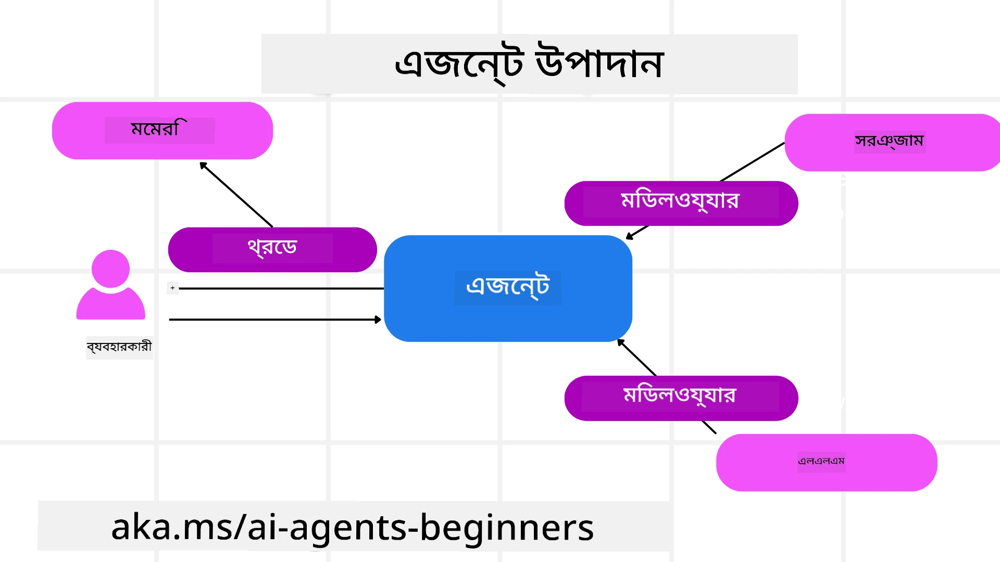

# মাইক্রোসফ্ট এজেন্ট ফ্রেমওয়ার্ক অন্বেষণ


### পরিচিতি

এই পাঠে আলোচনা করা হবে:

- মাইক্রোসফ্ট এজেন্ট ফ্রেমওয়ার্ক বোঝা: মূল বৈশিষ্ট্য এবং মূল্য  
- মাইক্রোসফ্ট এজেন্ট ফ্রেমওয়ার্কের মূল ধারণাগুলো অন্বেষণ
- অগ্রসর MAF প্যাটার্ন: ওয়ার্কফ্লো, মিডলওয়্যার এবং মেমরি

## শেখার লক্ষ্যসমূহ

এই পাঠ সম্পন্ন করার পরে, আপনি জানতে পারবেন কীভাবে:

- মাইক্রোসফ্ট এজেন্ট ফ্রেমওয়ার্ক ব্যবহার করে প্রোডাকশন রেডি AI এজেন্ট তৈরি করবেন
- আপনার এজেন্টিক ইউজ কেসগুলিতে মাইক্রোসফ্ট এজেন্ট ফ্রেমওয়ার্কের মূল বৈশিষ্ট্য প্রয়োগ করবেন
- অগ্রসর প্যাটার্নগুলি ব্যবহার করবেন, যেমন ওয়ার্কফ্লো, মিডলওয়্যার এবং অবজারভেবিলিটি

## কোড নমুনা

[Microsoft Agent Framework (MAF)](https://aka.ms/ai-agents-beginners/agent-framewrok) এর কোড নমুনা এই রিপোজিটরিতে `xx-python-agent-framework` এবং `xx-dotnet-agent-framework` ফাইলগুলোর মধ্যে পাওয়া যাবে।

## মাইক্রোসফ্ট এজেন্ট ফ্রেমওয়ার্ক বোঝা


[Microsoft Agent Framework (MAF)](https://aka.ms/ai-agents-beginners/agent-framewrok) হলো AI এজেন্ট তৈরি করার জন্য মাইক্রোসফ্টের ঐক্যবদ্ধ ফ্রেমওয়ার্ক। এটি প্রোডাকশন এবং গবেষণা উভয় পরিবেশে দেখা বিভিন্ন ধরণের এজেন্টিক ইউজ কেসের সমাধান করার নমনীয়তা প্রদান করে, যেমন:

- **ক্রমাগত এজেন্ট অর্কেস্ট্রেশন** যেখানে ধাপে ধাপে ওয়ার্কফ্লো প্রয়োজন।
- **সমান্তরাল অর্কেস্ট্রেশন** যেখানে এজেন্টরা একই সময়ে কাজ শেষ করতে হবে।
- **গ্রুপ চ্যাট অর্কেস্ট্রেশন** যেখানে এজেন্টরা একসাথে একটি কাজের জন্য সহযোগিতা করে।
- **হ্যান্ডঅফ অর্কেস্ট্রেশন** যেখানে সাবটাস্ক শেষ হলে এজেন্টরা একে অন্যকে কাজ হস্তান্তর করে।
- **ম্যাগনেটিক অর্কেস্ট্রেশন** যেখানে একটি ম্যানেজার এজেন্ট কাজের তালিকা তৈরি ও সংশোধন করে এবং সাবএজেন্টদের সমন্বয় করে কাজ সম্পন্ন করে।

প্রোডাকশনে AI এজেন্ট ডেলিভারির জন্য, MAF তে নিম্নলিখিত বৈশিষ্ট্যগুলো অন্তর্ভুক্ত করা হয়েছে:

- **অবজারভেবিলিটি** OpenTelemetry ব্যবহার করে, যেখানে AI এজেন্টের প্রতিটি কর্ম–যেমন টুল কল, অর্কেস্ট্রেশন ধাপ, যুক্তি প্রবাহ এবং পারফরম্যান্স মনিটারিং মাইক্রোসফ্ট ফাউন্ড্রি ড্যাশবোর্ডের মাধ্যমে ট্র্যাক করা হয়।
- **নিরাপত্তা** এজেন্টগুলো মাইক্রোসফ্ট ফাউন্ড্রিতে স্বদেশীভাবে হোস্ট করা হয়, যেখানে রোল-ভিত্তিক এক্সেস, প্রাইভেট ডেটা হ্যান্ডলিং এবং বিল্ট-ইন কন্টেন্ট সেফটিসহ নিরাপত্তা নিয়ন্ত্রণ থাকে।
- **দৃঢ়তা** কারণ এজেন্ট থ্রেড এবং ওয়ার্কফ্লো পজ, পুনরায় শুরু এবং ত্রুটি থেকে পুনরুদ্ধার করতে পারে, যা দীর্ঘমেয়াদী প্রসেস সমর্থন করে।
- **নিয়ন্ত্রণ** হিউম্যান ইন দ্য লুপ ওয়ার্কফ্লো সমর্থিত, যেখানে কাজগুলোকে মানব অনুমোদনের প্রয়োজন হিসেবে চিহ্নিত করা হয়।

মাইক্রোসফ্ট এজেন্ট ফ্রেমওয়ার্ক আন্তঃপরিচালনযোগ্য হওয়ার দিকেও মনোনিবেশ করে:

- **ক্লাউড-নিরপেক্ষ** - এজেন্টরা কন্টেইনার, অন-প্রিমিসেস এবং বিভিন্ন ক্লাউডে চলতে পারে।
- **প্রোভাইডার-নিরপেক্ষ** - এজেন্ট তৈরি করা যায় আপনার পছন্দের SDK ব্যবহার করে, যেমন Azure OpenAI এবং OpenAI
- **খোলা স্ট্যান্ডার্ড ইন্টিগ্রেশন** - এজেন্টরা Agent-to-Agent(A2A) এবং Model Context Protocol (MCP) এর মতো প্রোটোকল ব্যবহার করে অন্যান্য এজেন্ট ও টুল আবিষ্কার এবং ব্যবহার করতে পারে।
- **প্লাগইন ও কানেক্টর** - Microsoft Fabric, SharePoint, Pinecone এবং Qdrant-এর মতো ডেটা এবং মেমরি সার্ভিসের সাথে সংযোগ করা যায়।

চলুন দেখি কীভাবে এই বৈশিষ্ট্যগুলো মাইক্রোসফ্ট এজেন্ট ফ্রেমওয়ার্কের কিছু মূল ধারণায় প্রয়োগ করা হয়।

## মাইক্রোসফ্ট এজেন্ট ফ্রেমওয়ার্কের মূল ধারণাগুলো

### এজেন্ট



**এজেন্ট তৈরি করা**

এজেন্ট তৈরি করা হয় ইনফারেন্স সার্ভিস (LLM প্রোভাইডার), AI এজেন্টের জন্য নির্দেশাবলীর সেট, এবং একটি এসাইন করা `name` নির্ধারণ করে:

```python
agent = AzureOpenAIChatClient(credential=AzureCliCredential()).create_agent( instructions="You are good at recommending trips to customers based on their preferences.", name="TripRecommender" )
```

উপরের কোডে `Azure OpenAI` ব্যবহার করা হয়েছে, তবে এজেন্ট তৈরি করা যেতে পারে বিভিন্ন সার্ভিস ব্যবহার করে, যেমন `Microsoft Foundry Agent Service`:

```python
AzureAIAgentClient(async_credential=credential).create_agent( name="HelperAgent", instructions="You are a helpful assistant." ) as agent
```

OpenAI `Responses`, `ChatCompletion` API গুলো

```python
agent = OpenAIResponsesClient().create_agent( name="WeatherBot", instructions="You are a helpful weather assistant.", )
```

```python
agent = OpenAIChatClient().create_agent( name="HelpfulAssistant", instructions="You are a helpful assistant.", )
```

অথবা A2A প্রোটোকল ব্যবহার করে রিমোট এজেন্ট:

```python
agent = A2AAgent( name=agent_card.name, description=agent_card.description, agent_card=agent_card, url="https://your-a2a-agent-host" )
```

**এজেন্ট চালানো**

`.run` অথবা `.run_stream` পদ্ধতি ব্যবহার করে এজেন্ট চালানো হয়, যেটি স্ট্রিমিং অথবা নন-স্ট্রিমিং রেসপন্সের জন্য।

```python
result = await agent.run("What are good places to visit in Amsterdam?")
print(result.text)
```

```python
async for update in agent.run_stream("What are the good places to visit in Amsterdam?"):
    if update.text:
        print(update.text, end="", flush=True)

```

প্রতি এজেন্ট রানেও অপশন থাকতে পারে যেমন এজেন্টের ব্যবহৃত `max_tokens`, কল করতে সক্ষম `tools`, এবং এমনকি ব্যবহারকৃত `model` নিজেও কাস্টমাইজ করা যায়।

এটি বিশেষ কোনো মডেল বা টুল ব্যবহার করার প্রয়োজন হলে উপকারী।

**টুলস**

টুলগুলি এজেন্ট সংজ্ঞায়িত করার সময়ও নির্ধারণ করা যায়:

```python
def get_attractions( location: Annotated[str, Field(description="The location to get the top tourist attractions for")], ) -> str: """Get the top tourist attractions for a given location.""" return f"The top attractions for {location} are." 


# যখন সরাসরি একটি ChatAgent তৈরি করা হয়

agent = ChatAgent( chat_client=OpenAIChatClient(), instructions="You are a helpful assistant", tools=[get_attractions]

```

এবং এজেন্ট চালানোর সময়ও:

```python

result1 = await agent.run( "What's the best place to visit in Seattle?", tools=[get_attractions] # শুধুমাত্র এই রান-এর জন্য সরঞ্জাম প্রদান করা হয়েছে )
```

**এজেন্ট থ্রেডস**

এজেন্ট থ্রেড ব্যবহার করা হয় মাল্টি-টান কথোপকথন পরিচালনার জন্য। থ্রেড তৈরি করা যায়:

- `get_new_thread()` ব্যবহার করে, যা সময়ের সঙ্গে থ্রেড সংরক্ষণ সক্ষম করে।
- অথবা এজেন্ট চালানোর সময় স্বয়ংক্রিয়ভাবে থ্রেড তৈরি করে, যা চলতি রান পর্যন্ত সক্রিয় থাকে।

থ্রেড তৈরি করার কোডের উদাহরণ:

```python
# একটি নতুন থ্রেড তৈরি করুন।
thread = agent.get_new_thread() # থ্রেডের সাথে এজেন্ট চালান।
response = await agent.run("Hello, I am here to help you book travel. Where would you like to go?", thread=thread)

```

তারপর আপনি থ্রেড সিরিয়ালাইজ করে সংরক্ষণ করতে পারেন পরবর্তীতে ব্যবহারের জন্য:

```python
# একটি নতুন থ্রেড তৈরি করুন।
thread = agent.get_new_thread() 

# থ্রেড দিয়ে এজেন্ট চালান।

response = await agent.run("Hello, how are you?", thread=thread) 

# সংরক্ষণের জন্য থ্রেড সিরিয়ালাইজ করুন।

serialized_thread = await thread.serialize() 

# সংরক্ষণ থেকে লোড করার পরে থ্রেডের অবস্থা ডিজেরিয়ালাইজ করুন।

resumed_thread = await agent.deserialize_thread(serialized_thread)
```

**এজেন্ট মিডলওয়্যার**

এজেন্ট টুল এবং LLM এর সাথে যোগাযোগ করে ব্যবহারকারীর কাজ সম্পন্ন করে। কিছু পরিস্থিতিতে, এই ইন্টারঅ্যাকশনের মধ্যে কোন ক্রিয়া সম্পাদন বা ট্র্যাক করতে চাইলে এজেন্ট মিডলওয়্যার ব্যবহার করা হয়:

*ফাংশন মিডলওয়্যার*

এই মিডলওয়্যার আমাদের সাহায্য করে এজেন্ট এবং ফাংশন/টুলের মধ্যে কল করার সময় একটি কাজ সম্পাদনে। উদাহরণস্বরূপ, ফাংশন কল লগিং করা।

নীচের কোডে `next` নির্ধারণ করে পরবর্তী মিডলওয়্যার বা আসল ফাংশন কল হবে কিনা।

```python
async def logging_function_middleware(
    context: FunctionInvocationContext,
    next: Callable[[FunctionInvocationContext], Awaitable[None]],
) -> None:
    """Function middleware that logs function execution."""
    # প্রি-প্রসেসিং: ফাংশন 실행ের আগে লগ করুন
    print(f"[Function] Calling {context.function.name}")

    # পরবর্তী মিডলওয়্যার বা ফাংশন এক্সিকিউশনে যান
    await next(context)

    # পোস্ট-প্রসেসিং: ফাংশন এক্সিকিউশনের পরে লগ করুন
    print(f"[Function] {context.function.name} completed")
```

*চ্যাট মিডলওয়্যার*

এই মিডলওয়্যার আমাদের এজেন্ট এবং LLM এর মধ্যে অনুরোধসমূহের মধ্যে ক্রিয়া সম্পাদনা বা লগ করার সুযোগ দেয়।

এতে গুরুত্বপূর্ণ তথ্য থাকে, যেমন AI সার্ভিসে পাঠানো `messages`।

```python
async def logging_chat_middleware(
    context: ChatContext,
    next: Callable[[ChatContext], Awaitable[None]],
) -> None:
    """Chat middleware that logs AI interactions."""
    # পূর্বপ্রক্রিয়াকরণ: AI কলের আগে লগ করুন
    print(f"[Chat] Sending {len(context.messages)} messages to AI")

    # পরবর্তী মিডলওয়্যার বা AI সেবায় এগিয়ে যান
    await next(context)

    # পরবর্তীপ্রক্রিয়াকরণ: AI প্রতিক্রিয়ার পরে লগ করুন
    print("[Chat] AI response received")

```

**এজেন্ট মেমরি**

`Agentic Memory` পাঠে আলোচিত হয়েছে, মেমরি হলো গুরুত্বপূর্ণ উপাদান যা এজেন্টকে বিভিন্ন প্রসঙ্গের মাধ্যমে কাজ করার সক্ষমতা দেয়। MAF বিভিন্ন ধরনের মেমরি অফার করে:

*ইন-মেমরি স্টোরেজ*

এটি অ্যাপ্লিকেশন রানটাইমে থ্রেডে সংরক্ষিত মেমরি।

```python
# একটি নতুন থ্রেড তৈরি করুন।
thread = agent.get_new_thread() # থ্রেডটির সাথে এজেন্টটি চালান।
response = await agent.run("Hello, I am here to help you book travel. Where would you like to go?", thread=thread)
```

*টেকসই মেসেজ*

এটি বিভিন্ন সেশন জুড়ে কথোপকথনের ইতিহাস সংরক্ষণে ব্যবহৃত হয়। `chat_message_store_factory` ব্যবহার করে সংজ্ঞায়িত করা হয়:

```python
from agent_framework import ChatMessageStore

# একটি কাস্টম বার্তা স্টোর তৈরি করুন
def create_message_store():
    return ChatMessageStore()

agent = ChatAgent(
    chat_client=OpenAIChatClient(),
    instructions="You are a Travel assistant.",
    chat_message_store_factory=create_message_store
)

```

*ডায়নামিক মেমরি*

এজেন্ট চালানোর আগে প্রসঙ্গে যুক্ত করা হয় এমন মেমরি। এগুলো mem0-এর মতো বাইরের সার্ভিসে সংরক্ষিত হতে পারে:

```python
from agent_framework.mem0 import Mem0Provider

# উন্নত মেমরি সক্ষমতার জন্য Mem0 ব্যবহার করা হচ্ছে
memory_provider = Mem0Provider(
    api_key="your-mem0-api-key",
    user_id="user_123",
    application_id="my_app"
)

agent = ChatAgent(
    chat_client=OpenAIChatClient(),
    instructions="You are a helpful assistant with memory.",
    context_providers=memory_provider
)

```

**এজেন্ট অবজারভেবিলিটি**

বিশ্বাসযোগ্য এবং রক্ষণাবেক্ষণযোগ্য এজেন্টিক সিস্টেম তৈরিতে অবজারভেবিলিটি গুরুত্বপূর্ণ। MAF OpenTelemetry এর সাথে ইন্টিগ্রেট করে ট্রেসিং এবং মিটার প্রদান করে উন্নত অবজারভেবিলিটির জন্য।

```python
from agent_framework.observability import get_tracer, get_meter

tracer = get_tracer()
meter = get_meter()
with tracer.start_as_current_span("my_custom_span"):
    # কিছু করো
    pass
counter = meter.create_counter("my_custom_counter")
counter.add(1, {"key": "value"})
```

### ওয়ার্কফ্লো

MAF ওয়ার্কফ্লো প্রদান করে যা পূর্বনির্ধারিত ধাপগুলো অনুসরণ করে একটি কাজ সম্পন্ন করে এবং ওই ধাপগুলোতে AI এজেন্টকে উপাদান হিসেবে অন্তর্ভুক্ত করে।

ওয়ার্কফ্লো বিভিন্ন উপাদান নিয়ে গঠিত যা নিয়ন্ত্রণ প্রবাহ উন্নত করে। ওয়ার্কফ্লো **মাল্টি-এজেন্ট অর্কেস্ট্রেশন** এবং **চেকপয়েন্টিং** সক্ষম করে ওয়ার্কফ্লো অবস্থা সংরক্ষণের জন্য।

ওয়ার্কফ্লোর মূল উপাদানগুলো:

**এক্সিকিউটারস**

এক্সিকিউটার ইনপুট মেসেজ গ্রহণ করে, তাদের অসম্পন্ন কাজ সম্পাদন করে এবং আউটপুট মেসেজ উৎপন্ন করে। এটি ওয়ার্কফ্লোকে বড় কাজ সম্পন্ন করার দিকে এগিয়ে নিয়ে যায়। এক্সিকিউটার হতে পারে AI এজেন্ট বা কাস্টম লজিক।

**এজেস**

মেসেজ ফ্লো সংজ্ঞায়িত করার জন্য এজেস ব্যবহার করা হয়। এগুলো হতে পারে:

*ডাইরেক্ট এজেস* - এক্সিকিউটারের মধ্যে সরল এক থেকে এক সংযোগ:

```python
from agent_framework import WorkflowBuilder

builder = WorkflowBuilder()
builder.add_edge(source_executor, target_executor)
builder.set_start_executor(source_executor)
workflow = builder.build()
```

*শর্তাধীন এজেস* - নির্দিষ্ট শর্ত পূরণ হলে সক্রিয় হয়। উদাহরণস্বরূপ, যখন হোটেল রুম পাওয়া যায় না, তখন এক্সিকিউটার অন্য বিকল্প প্রস্তাব করতে পারে।

*সুইচ-কেস এজেস* - শর্ত অনুসারে বিভিন্ন এক্সিকিউটারে মেসেজ রুট করে। উদাহরণস্বরূপ, যাত্রী যদি প্রাধান্য পাওয়ার অ্যাক্সেস থাকে এবং তাদের কাজ অন্য ওয়ার্কফ্লোর মাধ্যমে পরিচালিত হয়।

*ফ্যান-আউট এজেস* - একটি মেসেজ একাধিক টার্গেটে পাঠায়।

*ফ্যান-ইন এজেস* - বিভিন্ন এক্সিকিউটার থেকে একাধিক মেসেজ সংগ্রহ করে একটি টার্গেটে পাঠায়।

**ইভেন্টস**

ওয়ার্কফ্লোতে উন্নত অবজারভেবিলিটির জন্য MAF বিল্ট-ইন ইভেন্ট প্রদান করে, যেমন:

- `WorkflowStartedEvent` - ওয়ার্কফ্লো শুরু হয়েছে
- `WorkflowOutputEvent` - ওয়ার্কফ্লো আউটপুট তৈরি করেছে
- `WorkflowErrorEvent` - ওয়ার্কফ্লো ত্রুটি পেয়েছে
- `ExecutorInvokeEvent` - এক্সিকিউটার কাজ শুরু করেছে
- `ExecutorCompleteEvent` - এক্সিকিউটার কাজ শেষ করেছে
- `RequestInfoEvent` - অনুরোধ ইস্যু করা হয়েছে

## অগ্রসর MAF প্যাটার্ন

উপরের বিভাগগুলো মাইক্রোসফ্ট এজেন্ট ফ্রেমওয়ার্কের মূল ধারণা আলোচনা করেছে। আরো জটিল এজেন্ট তৈরি করার সময়, কিছু অগ্রসর প্যাটার্ন বিবেচনা করুন:

- **মিডলওয়্যার কম্পোজিশন**: ফাংশন এবং চ্যাট মিডলওয়্যার ব্যবহার করে লগিং, অথেন্টিকেশন, রেট-লিমিটিং এর মতো বহু মিডলওয়্যার হ্যান্ডলার চেইন করুন এজেন্ট আচরণ সূক্ষ্ম নিয়ন্ত্রণের জন্য।
- **ওয়ার্কফ্লো চেকপয়েন্টিং**: ওয়ার্কফ্লো ইভেন্ট এবং সিরিয়ালাইজেশন ব্যবহার করে দীর্ঘমেয়াদী এজেন্ট প্রসেস সংরক্ষণ এবং পুনঃসূচনা করুন।
- **ডায়নামিক টুল সিলেকশন**: টুল বর্ণনার ওপর RAG এবং MAF এর টুল রেজিস্ট্রেশন মিলে শুধুমাত্র প্রাসঙ্গিক টুলগুলো প্রশ্ন অনুযায়ী প্রদর্শন করুন।
- **মাল্টি-এজেন্ট হ্যান্ডঅফ**: ওয়ার্কফ্লো এজ এবং শর্তাধীন রাউটিং ব্যবহার করে বিশেষায়িত এজেন্টদের মধ্যে হ্যান্ডঅফ অর্কেস্ট্রেট করুন।

## কোড নমুনা

মাইক্রোসফ্ট এজেন্ট ফ্রেমওয়ার্কের কোড নমুনা এই রিপোজিটরিতে `xx-python-agent-framework` এবং `xx-dotnet-agent-framework` ফাইলগুলোর মধ্যে পাওয়া যাবে।

## মাইক্রোসফ্ট এজেন্ট ফ্রেমওয়ার্ক সম্পর্কে আরও প্রশ্ন?

অন্য শিক্ষার্থীদের সাথে সাক্ষাৎ করতে, অফিস আওয়ার অংশ নিতে এবং আপনার AI এজেন্ট সম্পর্কিত প্রশ্নের উত্তর পেতে [Microsoft Foundry Discord](https://aka.ms/ai-agents/discord) এ যোগ দিন।

---

<!-- CO-OP TRANSLATOR DISCLAIMER START -->
**অস্বীকার**:
এই দলিলটি AI অনুবাদ সেবা [Co-op Translator](https://github.com/Azure/co-op-translator) ব্যবহার করে অনূদিত হয়েছে। আমরা যথাসাধ্য সঠিকতার প্রতি গুরুত্ব দিয়ে থাকি, তবে দয়া করে লক্ষ করুন যে স্বয়ংক্রিয় অনুবাদে ত্রুটি বা অসঙ্গতি থাকতে পারে। মূল ভাষায় থাকা নবীন কাগজটি কর্তৃত্বপ্রাপ্ত উৎস হিসেবে বিবেচনা করা উচিত। গুরুতর তথ্যের জন্য পেশাদার মানব অনুবাদ গ্রহণ করার পরামর্শ দেওয়া হয়। এই অনুবাদের ব্যবহারে উদ্ভূত কোনও ভুলবোঝাবুঝি বা ভুল ব্যাখ্যার জন্য আমরা দায়ী নই।
<!-- CO-OP TRANSLATOR DISCLAIMER END -->