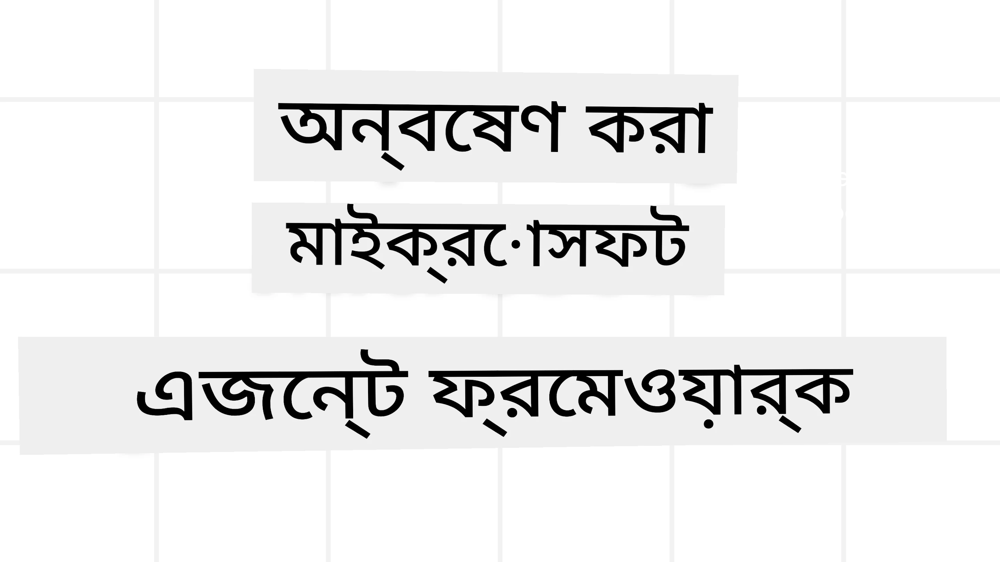
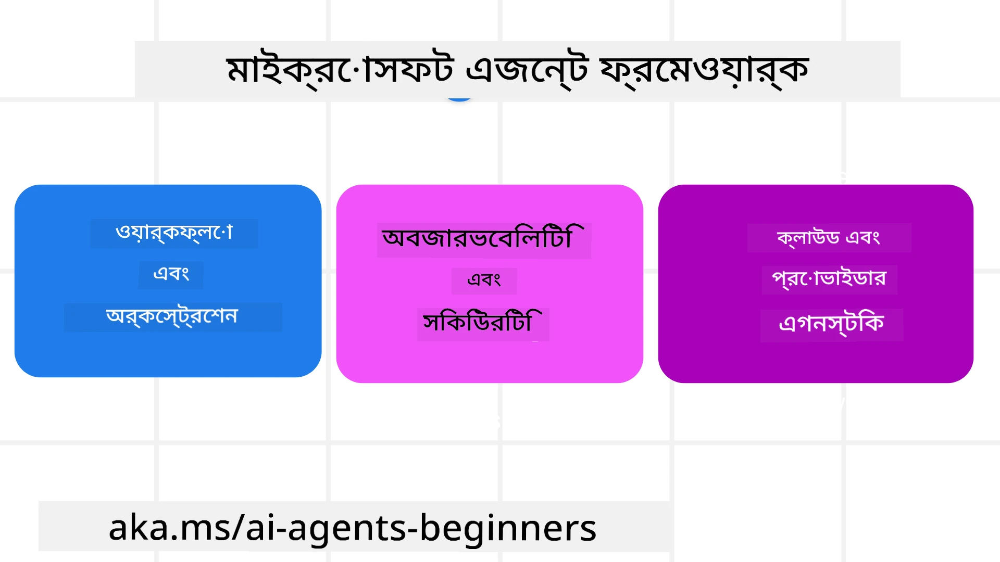
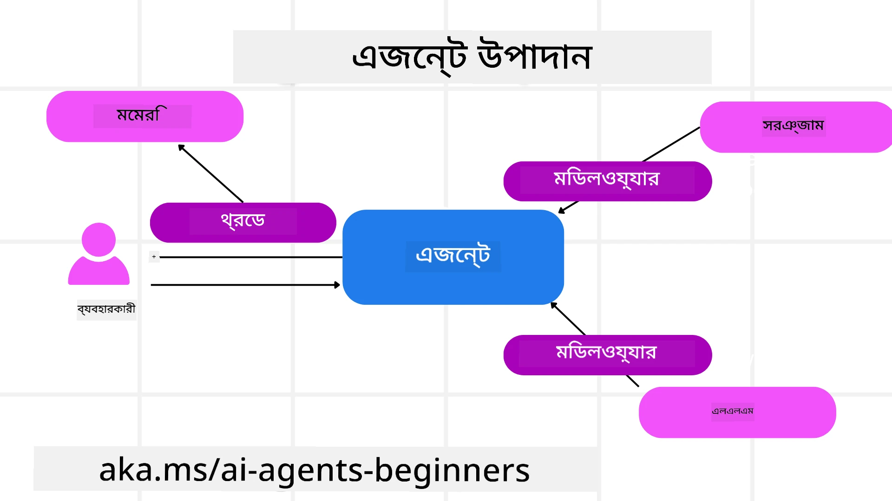

# মাইক্রোসফট এজেন্ট ফ্রেমওয়ার্ক অনুসন্ধান



### পরিচিতি

এই পাঠে আলোচনা করা হবে:

- মাইক্রোসফট এজেন্ট ফ্রেমওয়ার্ক বুঝতে পারা: মূল বৈশিষ্ট্য এবং মূল্য
- মাইক্রোসফট এজেন্ট ফ্রেমওয়ার্কের মূল ধারণাগুলি অন্বেষণ
- উন্নত MAF প্যাটার্ন: কাজের প্রবাহ, মিডলওয়্যার, এবং মেমোরি

## শেখার লক্ষ্য

এই পাঠ শেষ করার পর, আপনি জানতে পারবেন কীভাবে:

- মাইক্রোসফট এজেন্ট ফ্রেমওয়ার্ক ব্যবহার করে প্রস্তুত-প্রযোজনযোগ্য AI এজেন্ট তৈরি করবেন
- আপনার এজেন্টিক ব্যবহার ক্ষেত্রগুলিতে মাইক্রোসফট এজেন্ট ফ্রেমওয়ার্কের মূল বৈশিষ্ট্য প্রয়োগ করবেন
- উন্নত প্যাটার্নগুলি ব্যবহার করবেন, যেমন কাজের প্রবাহ, মিডলওয়্যার, এবং অবজারভেবিলিটি

## কোড নমুনা

[Microsoft Agent Framework (MAF)](https://learn.microsoft.com/en-us/agent-framework/overview/?wt.mc_id=youtube_26688_organicsocial_reactor&pivots=programming-language-python) এর কোড নমুনা এই রিপোজিটরির `xx-python-agent-framework` এবং `xx-dotnet-agent-framework` ফাইলগুলিতে পাওয়া যাবে।

## মাইক্রোসফট এজেন্ট ফ্রেমওয়ার্ক বোঝা



[Microsoft Agent Framework (MAF)](https://learn.microsoft.com/en-us/agent-framework/overview/?wt.mc_id=youtube_26688_organicsocial_reactor&pivots=programming-language-python) হল মাইক্রোসফটের একীকৃত ফ্রেমওয়ার্ক যা AI এজেন্ট তৈরি করার জন্য। এটি বিভিন্ন ধরণের এজেন্টিক ব্যবহার ক্ষেত্র মোকাবিলার জন্য নমনীয়তা প্রদান করে, যা সাধারণত উৎপাদন এবং গবেষণা পরিবেশ উভয়েই দেখা যায়, যেমন:

- **ক্রমাগত এজেন্ট সমন্বয়** এমন পরিস্থিতিতে যেখানে পদক্ষেপের ধাপে ধাপে কাজের প্রবাহ দরকার।
- **সমান্তরাল সমন্বয়** এমন পরিস্থিতিতে যেখানে এজেন্টদের একই সময়ে কাজ সম্পন্ন করতে হয়।
- **গ্রুপ চ্যাট সমন্বয়** এমন পরিস্থিতিতে যেখানে এজেন্টরা একসঙ্গে একটি কাজ করতে পারে।
- **হ্যান্ডঅফ সমন্বয়** এমন পরিস্থিতিতে যেখানে এজেন্টরা একটি কাজ শেষ করার সাথে সাথে কাজটি একে অপরের কাছে হস্তান্তর করে।
- **ম্যাগনেটিক সমন্বয়** এমন পরিস্থিতিতে যেখানে একটি ম্যানেজার এজেন্ট একটি কাজের তালিকা তৈরি ও সংশোধন করে এবং উপ-এজেন্টদের সমন্বয় পরিচালনা করে কাজ সম্পন্ন করে।

উৎপাদনে AI এজেন্ট সরবরাহের জন্য, MAF নিম্নলিখিত বৈশিষ্ট্যও অন্তর্ভুক্ত করেছে:

- **পর্যবেক্ষণযোগ্যতা** OpenTelemetry ব্যবহারের মাধ্যমে যেখানে AI এজেন্টের প্রতিটি ক্রিয়া যেমন টুল আহ্বান, সমন্বয় ধাপ, যুক্তি প্রবাহ এবং ব্যবস্থাপনার পর্যবেক্ষণ Microsoft Foundry ড্যাশবোর্ডের মাধ্যমে করা হয়।
- **নিরাপত্তা** Microsoft Foundry-তে স্বাভাবিকভাবে এজেন্ট হোস্ট করে, যেখানে ভূমিকা-ভিত্তিক 접근, ব্যক্তিগত তথ্য পরিচালনা এবং নির্মিত কনটেন্ট নিরাপত্তা যেমন নিরাপত্তা নিয়ন্ত্রণ অন্তর্ভুক্ত।
- **টেকসইতা** কারণ এজেন্ট থ্রেড এবং কাজের প্রবাহ বিরতি, পুনরায় শুরু এবং ত্রুটি থেকে পুনরুদ্ধার করতে পারে, যা দীর্ঘমেয়াদী প্রক্রিয়া চালানোর অনুমতি দেয়।
- **নিয়ন্ত্রণ** যেখানে মানব সম্পৃক্ত কাজের প্রবাহ সমর্থিত, যেখানে কাজগুলো মানব অনুমোদনের জন্য চিহ্নিত হয়।

মাইক্রোসফট এজেন্ট ফ্রেমওয়ার্ক অন্তঃক্রিয়াযোগ্য হওয়ার প্রতি দৃষ্টিপাত করে:

- **ক্লাউড-অ্যাগনোস্টিক হওয়া** - এজেন্টগুলি কন্টেইনার, অন-প্রিমিস এবং বিভিন্ন ক্লাউডে চলতে পারে।
- **প্রোভাইডার-অ্যাগনোস্টিক হওয়া** - আপনার পছন্দের SDK ব্যবহার করে এজেন্ট তৈরি করা যাবে, যেমন Azure OpenAI এবং OpenAI
- **ওপেন স্ট্যান্ডার্ড সংযোজন** - এজেন্টরা Agent-to-Agent (A2A) এবং Model Context Protocol (MCP) এর মতো প্রোটোকল ব্যবহার করে অন্য এজেন্ট এবং টুল আবিষ্কার এবং ব্যবহার করতে পারে।
- **প্লাগইন এবং সংযোগকারী** - Microsoft Fabric, SharePoint, Pinecone এবং Qdrant এর মতো ডেটা ও মেমোরি সার্ভিসের সাথে সংযোগ স্থাপন করা যায়।

আসুন দেখি কীভাবে এই বৈশিষ্ট্যগুলো Microsoft Agent Framework এর কিছু মূল ধারণায় প্রয়োগ করা হয়েছে।

## মাইক্রোসফট এজেন্ট ফ্রেমওয়ার্কের মূল ধারণাগুলি

### এজেন্টস



**এজেন্ট তৈরি করা**

এজেন্ট তৈরি করা হয় ইনফারেন্স সার্ভিস (LLM প্রদানকারী), AI এজেন্ট অনুসরণ করার জন্য নির্দেশাবলী এবং একটি নির্ধারিত `name` দিয়ে:


```python
agent = AzureOpenAIChatClient(credential=AzureCliCredential()).create_agent( instructions="You are good at recommending trips to customers based on their preferences.", name="TripRecommender" )
```

উপরের কোডে `Azure OpenAI` ব্যবহার করা হয়েছে, তবে বিভিন্ন সার্ভিস ব্যবহার করে এজেন্ট তৈরি করা যায়, যেমন `Microsoft Foundry Agent Service`:

```python
AzureAIAgentClient(async_credential=credential).create_agent( name="HelperAgent", instructions="You are a helpful assistant." ) as agent
```

OpenAI `Responses`, `ChatCompletion` API গুলি

```python
agent = OpenAIResponsesClient().create_agent( name="WeatherBot", instructions="You are a helpful weather assistant.", )
```

```python
agent = OpenAIChatClient().create_agent( name="HelpfulAssistant", instructions="You are a helpful assistant.", )
```

অথবা [MiniMax](https://platform.minimaxi.com/), যা OpenAI-সঙ্গত API প্রদান করে বড় কনটেক্সট উইন্ডো সহ (সর্বোচ্চ 204K টোকেন):

```python
agent = OpenAIChatClient(base_url="https://api.minimax.io/v1", api_key=os.environ["MINIMAX_API_KEY"], model_id="MiniMax-M3").create_agent( name="HelpfulAssistant", instructions="You are a helpful assistant.", )
```

অথবা দূরবর্তী এজেন্টরা A2A প্রোটোকল ব্যবহার করে:

```python
agent = A2AAgent( name=agent_card.name, description=agent_card.description, agent_card=agent_card, url="https://your-a2a-agent-host" )
```

**এজেন্ট চালানো**

এজেন্ট চলানো হয় `.run` অথবা `.run_stream` পদ্ধতি ব্যবহার করে, যা সংশ্লিষ্টভাবে নন-স্ট্রিমিং বা স্ট্রিমিং প্রতিক্রিয়া প্রদান করে।

```python
result = await agent.run("What are good places to visit in Amsterdam?")
print(result.text)
```

```python
async for update in agent.run_stream("What are the good places to visit in Amsterdam?"):
    if update.text:
        print(update.text, end="", flush=True)

```

প্রতিটি এজেন্ট চলানোর সময় বিকল্প দেওয়া যেতে পারে, যেমন এজেন্টের ব্যবহৃত `max_tokens`, এজেন্ট যে `tools` কল করতে পারে, এমনকি এজেন্টের জন্য ব্যবহৃত `model`।

এটি প্রয়োজনীয় যখন কোনো নির্দিষ্ট মডেল বা টুল ব্যবহার করে ব্যবহারকারীর কাজ সম্পন্ন করতে হয়।

**টুলস**

টুলস সংজ্ঞায়িত করা যায় এজেন্ট সংজ্ঞায়িত করার সময়:

```python
def get_attractions( location: Annotated[str, Field(description="The location to get the top tourist attractions for")], ) -> str: """Get the top tourist attractions for a given location.""" return f"The top attractions for {location} are." 


# যখন সরাসরি একটি ChatAgent তৈরি করা হয়

agent = ChatAgent( chat_client=OpenAIChatClient(), instructions="You are a helpful assistant", tools=[get_attractions]

```

এবং এজেন্ট চালানোর সময়ও:

```python

result1 = await agent.run( "What's the best place to visit in Seattle?", tools=[get_attractions] # এই রানটির জন্য শুধুমাত্র সরঞ্জাম প্রদান করা হয়েছে )
```

**এজেন্ট থ্রেডস**

এজেন্ট থ্রেডগুলি মাল্টি-টার্ন কথোপকথন পরিচালনার জন্য ব্যবহৃত হয়। থ্রেড তৈরি করা যায়:

- `get_new_thread()` ব্যবহার করে যেটি থ্রেড সংরক্ষণ করার সুযোগ দেয়
- এজেন্ট চালানোর সময় স্বয়ংক্রিয়ভাবে থ্রেড তৈরি করে যা কেবল চলমান সময় পর্যন্ত স্থায়ী থাকে।

থ্রেড তৈরি করার কোড এইরূপ:

```python
# একটি নতুন থ্রেড তৈরি করুন।
thread = agent.get_new_thread() # থ্রেডের সাথে এজেন্ট চালান।
response = await agent.run("Hello, I am here to help you book travel. Where would you like to go?", thread=thread)

```

পরে থ্রেড সিরিয়ালাইজ করে সংরক্ষণ করা যেতে পারে:

```python
# একটি নতুন থ্রেড তৈরি করুন।
thread = agent.get_new_thread() 

# থ্রেডের সাথে এজেন্ট চালান।

response = await agent.run("Hello, how are you?", thread=thread) 

# সঞ্চয়ের জন্য থ্রেড সিরিয়ালাইজ করুন।

serialized_thread = await thread.serialize() 

# সঞ্চয় থেকে লোড করার পর থ্রেড স্টেট ডেসিরিয়ালাইজ করুন।

resumed_thread = await agent.deserialize_thread(serialized_thread)
```

**এজেন্ট মিডলওয়্যার**

এজেন্ট ব্যবহারকারীর কাজ শেষে টুল এবং LLM-র সাথে যোগাযোগ করে। নির্দিষ্ট পরিস্থিতিতে, আমরা এই কথোপকথনের মধ্যে কিছু কাজ চালাতে বা ট্র্যাক করতে চাই। এজেন্ট মিডলওয়্যার আমাদের এটি করার অনুমতি দেয়:

*ফাংশন মিডলওয়্যার*

এই মিডলওয়্যার এজেন্ট এবং ফাংশন/টুলের মধ্যে কাজ করার জন্য ব্যবহৃত হয়। উদাহরণস্বরূপ, ফাংশন কলের সময় লগ করা।

নিচের কোডে `next` সংজ্ঞায়িত করে পরবর্তী মিডলওয়্যার বা আসল ফাংশন কল করা হবে কিনা।

```python
async def logging_function_middleware(
    context: FunctionInvocationContext,
    next: Callable[[FunctionInvocationContext], Awaitable[None]],
) -> None:
    """Function middleware that logs function execution."""
    # প্রি-প্রসেসিং: ফাংশন কার্যকর করার আগে লগ করুন
    print(f"[Function] Calling {context.function.name}")

    # পরবর্তী মিডলওয়্যার বা ফাংশন কার্যকর করার জন্য চালিয়ে যান
    await next(context)

    # পোস্ট-প্রসেসিং: ফাংশন কার্যকর করার পরে লগ করুন
    print(f"[Function] {context.function.name} completed")
```

*চ্যাট মিডলওয়্যার*

এই মিডলওয়্যার এজেন্ট এবং LLM-এর মধ্যে অনুরোধের সময় কাজ চালানো বা লগ করার জন্য ব্যবহৃত হয়।

এতে গুরুত্বপূর্ণ তথ্য থাকে যেমন AI সার্ভিসে প্রেরিত `messages`।

```python
async def logging_chat_middleware(
    context: ChatContext,
    next: Callable[[ChatContext], Awaitable[None]],
) -> None:
    """Chat middleware that logs AI interactions."""
    # প্রি-প্রসেসিং: AI কলের আগে লগ করুন
    print(f"[Chat] Sending {len(context.messages)} messages to AI")

    # পরবর্তী মিডলওয়্যার বা AI পরিষেবায় চালিয়ে যান
    await next(context)

    # পোস্ট-প্রসেসিং: AI প্রতিক্রিয়ার পরে লগ করুন
    print("[Chat] AI response received")

```

**এজেন্ট মেমোরি**

`Agentic Memory` পাঠে আলোচনা করা হয়েছে, মেমোরি হল এজেন্টকে বিভিন্ন প্রসঙ্গে কাজ করার জন্য গুরুত্বপূর্ণ উপাদান। MAF বিভিন্ন ধরনের মেমোরি প্রদান করে:

*ইন-মেমোরি স্টোরেজ*

এটি থ্রেডে রানটাইম চলাকালীন সংরক্ষিত মেমোরি।

```python
# একটি নতুন থ্রেড তৈরি করুন।
thread = agent.get_new_thread() # থ্রেডের সাথে এজেন্ট চালান।
response = await agent.run("Hello, I am here to help you book travel. Where would you like to go?", thread=thread)
```

*টেকসই বার্তা*

বিভিন্ন সেশনের মধ্যে কথোপকথনের ইতিহাস সংরক্ষণের জন্য ব্যবহৃত মেমোরি। এটি `chat_message_store_factory` দ্বারা সংজ্ঞায়িত:

```python
from agent_framework import ChatMessageStore

# একটি কাস্টম মেসেজ স্টোর তৈরি করুন
def create_message_store():
    return ChatMessageStore()

agent = ChatAgent(
    chat_client=OpenAIChatClient(),
    instructions="You are a Travel assistant.",
    chat_message_store_factory=create_message_store
)

```

*ডায়নামিক মেমোরি*

এজেন্ট চালানোর আগে প্রসঙ্গে সংযুক্ত করা হয়। এই মেমোরি বাহ্যিক সার্ভিসেও সংরক্ষণ করা যেতে পারে যেমন mem0:

```python
from agent_framework.mem0 import Mem0Provider

# উন্নত মেমোরি সক্ষমতার জন্য Mem0 ব্যবহার করা হচ্ছে
memory_provider = Mem0Provider(
    api_key="your-mem0-api-key",
    user_id="user_123",
    application_id="my_app"
)

agent = ChatAgent(
    chat_client=OpenAIChatClient(),
    instructions="You are a helpful assistant with memory.",
    context_providers=memory_provider
)

```

**এজেন্ট অবজারভেবিলিটি**

অবজারভেবিলিটি বিশ্বাসযোগ্য এবং রক্ষণাবেক্ষণযোগ্য এজেন্টিক সিস্টেম তৈরির জন্য গুরুত্বপূর্ণ। MAF OpenTelemetry এর সাথে সংযোজিত যা ট্রেসিং এবং মিটার সরবরাহ করে উন্নত অবজারভেবিলিটির জন্য।

```python
from agent_framework.observability import get_tracer, get_meter

tracer = get_tracer()
meter = get_meter()
with tracer.start_as_current_span("my_custom_span"):
    # কিছু কাজ করুন
    pass
counter = meter.create_counter("my_custom_counter")
counter.add(1, {"key": "value"})
```

### কাজের প্রবাহ

MAF কাজের প্রবাহ সরবরাহ করে যা পূর্ব নির্ধারিত ধাপ যা একটি কাজ সম্পন্ন করে এবং AI এজেন্টকে সেই ধাপগুলির উপাদান হিসেবে অন্তর্ভুক্ত করে।

কাজের প্রবাহ বিভিন্ন উপাদান নিয়ে গঠিত যা ভাল নিয়ন্ত্রণ প্রবাহ প্রদান করে। কাজের প্রবাহ **একাধিক এজেন্টের সমন্বয়** এবং **চেকপয়েন্টিং** সক্রিয় করে কাজের অবস্থা সংরক্ষণের জন্য।

কাজের প্রবাহের মূল উপাদানগুলি হল:

**কার্যকারীগণ (Executors)**

কার্যকারীগণ ইনপুট বার্তা গ্রহণ করে, নিযুক্ত কাজ সম্পাদন করে, এবং একটি আউটপুট বার্তা তৈরি করে। এটি কাজের প্রবাহকে অগ্রসর করে বৃহত্তর কাজ সম্পাদন toward। কার্যকারীগণ AI এজেন্ট বা কাস্টম লজিক হতে পারে।

**এজ**

এজগুলো কাজের প্রবাহে বার্তাগুলির প্রবাহ সংজ্ঞায়িত করতে ব্যবহৃত হয়। এগুলো হতে পারে:

*সরাসরি এজ* - কার্যকারীর মধ্যে সরল এক-থেকে-এক সংযোগ:

```python
from agent_framework import WorkflowBuilder

builder = WorkflowBuilder()
builder.add_edge(source_executor, target_executor)
builder.set_start_executor(source_executor)
workflow = builder.build()
```

*শর্তাধীন এজ* - নির্দিষ্ট শর্ত পূরণ হলে সক্রিয় হয়। উদাহরণস্বরূপ, যখন হোটেল রুমগুলি অনুপলব্ধ থাকে, তখন কার্যকারী অন্য বিকল্প প্রস্তাব দিতে পারে।

*স্বিচ-কেস এজ* - নির্ধারিত শর্ত অনুসারে বার্তাগুলি বিভিন্ন কার্যকারীর কাছে রাউট করে। উদাহরণস্বরূপ, যদি ভ্রমণ গ্রাহকের প্রাধান্য প্রবেশাধিকার থাকে, তাদের কাজ আলাদা কাজের প্রবাহের মাধ্যমে পরিচালিত হবে।

*ফ্যান-আউট এজ* - একটি বার্তা একাধিক গন্তব্যে পাঠায়।

*ফ্যান-ইন এজ* - বিভিন্ন কার্যকারীর কাছ থেকে একাধিক বার্তা সংগ্রহ করে এক গন্তব্যে পাঠায়।

**ইভেন্ট**

কাজের প্রবাহে উন্নত অবজারভেবিলিটির জন্য, MAF কাজের বিভিন্ন ইভেন্ট রেকর্ড করে, যেমন:

- `WorkflowStartedEvent`  - কাজের প্রবাহ শুরু হয়
- `WorkflowOutputEvent` - কাজের প্রবাহ আউটপুট দেয়
- `WorkflowErrorEvent` - কাজের প্রবাহে ত্রুটি ঘটে
- `ExecutorInvokeEvent`  - কার্যকারী কাজ শুরু করে
- `ExecutorCompleteEvent`  - কার্যকারী কাজ শেষ করে
- `RequestInfoEvent` - একটি অনুরোধ করা হয়

## উন্নত MAF প্যাটার্নসমূহ

উপরের অংশে মাইক্রোসফট এজেন্ট ফ্রেমওয়ার্কের মূল ধারণা আলোচনা করা হয়েছে। আরও জটিল এজেন্ট তৈরি করার সময় এই উন্নত প্যাটার্নগুলো বিবেচনা করুন:

- **মিডলওয়্যার কম্পোজিশন**: একাধিক মিডলওয়্যার হ্যান্ডলার (লগিং, অথ, রেট-লিমিটিং) চেইন করে ফাংশন এবং চ্যাট মিডলওয়্যার ব্যবহার করে এজেন্ট আচরণের সূক্ষ্ম নিয়ন্ত্রণ।
- **কাজের প্রবাহ চেকপয়েন্টিং**: কাজের প্রবাহের ইভেন্ট এবং সিরিয়ালাইজেশন ব্যবহার করে দীর্ঘমেয়াদি এজেন্ট প্রক্রিয়া সংরক্ষণ ও পুনরায় শুরু করা।
- **ডায়নামিক টুল নির্বাচন**: টুল বর্ণনাগুলির ওপরে RAG দ্বারা এবং MAF এর টুল রেজিস্ট্রেশন ব্যবহার করে শুধুমাত্র প্রাসঙ্গিক টুলগুলি প্রদর্শন।
- **বহু-এজেন্ট হ্যান্ডঅফ**: কাজের প্রবাহের এজ এবং শর্তাধীন রাউটিং ব্যবহার করে বিশেষায়িত এজেন্টদের মধ্যে হ্যান্ডঅফ সমন্বয়।

## মাইক্রোসফট ফাউন্ড্রিতে LangChain / LangGraph এজেন্ট হোস্ট করা

মাইক্রোসফট এজেন্ট ফ্রেমওয়ার্ক **ফ্রেমওয়ার্ক-অন্তরকযোগ্য** — আপনি শুধু MAF দিয়ে লেখা এজেন্টেই সীমাবদ্ধ নন। যদি আপনার কাছে ইতিমধ্যে **LangChain** অথবা **LangGraph** দিয়ে তৈরি এজেন্ট থাকে, আপনি সেটি **মাইক্রোসফট ফাউন্ড্রি হোস্টেড এজেন্ট** হিসেবে চালাতে পারেন যাতে Foundry রানটাইম, সেশন, স্কেলিং, পরিচয় এবং প্রোটোকল শেষ পয়েন্টগুলি পরিচালনা করে, আর আপনার এজেন্ট লজিক LangGraph এ থাকে।

এটি করা হয় `langchain_azure_ai.agents.hosting` প্যাকেজের সাহায্যে, যা একই প্রোটোকল ব্যবহার করে একটি কম্পাইল করা LangGraph গ্রাফ প্রকাশ করে যেগুলো Foundry হোস্টেড এজেন্ট ব্যবহার করে।

**1. হোস্টিং এক্সট্রা ইনস্টল করুন:**

```bash
pip install -U "langchain-azure-ai[hosting]>=1.2.4" azure-identity
```

`hosting` এক্সট্রা Foundry প্রোটোকল লাইব্রেরি গুলি ইনস্টল করে: `azure-ai-agentserver-responses` (OpenAI-সঙ্গত `/responses` এন্ডপয়েন্ট) এবং `azure-ai-agentserver-invocations` (সাধারণ `/invocations` এন্ডপয়েন্ট)।

**2. একটি হোস্টিং প্রোটোকল বাছুন:**

| প্রোটোকল | হোস্ট ক্লাস | এন্ডপয়েন্ট | ব্যবহার কখন |
|----------|-----------|----------|----------|
| **Responses** | `ResponsesHostServer` | `/responses` | আপনি OpenAI-সঙ্গত চ্যাট, স্ট্রিমিং, প্রতিক্রিয়া ইতিহাস এবং কথোপকথনের থ্রেডিং চান — কথোপকথন ভিত্তিক এজেন্টদের জন্য সুপারিশকৃত ডিফল্ট। |
| **Invocations** | `InvocationsHostServer` | `/invocations` | আপনি একটি কাস্টম JSON আকৃতি, ওয়েবহুক-স্টাইল এন্ডপয়েন্ট, বা অ-কথোপকথন প্রক্রিয়া চান। |

কারণ **Responses API হল Foundry তে এজেন্ট-স্টাইল উন্নয়নের প্রধান API**, বেশিরভাগ এজেন্টের জন্য `ResponsesHostServer` দিয়ে শুরু করুন।

**3. পরিবেশ ভেরিয়েবল কনফিগার করুন** (`az login` প্রথমে চালিয়ে `DefaultAzureCredential` প্রমাণীকরণ করুক):

```bash
export FOUNDRY_PROJECT_ENDPOINT="https://<resource>.services.ai.azure.com/api/projects/<project>"
export FOUNDRY_MODEL_NAME="gpt-5-mini"
```

যখন এজেন্ট পরবর্তীতে Foundry তে হোস্টেড এজেন্ট হিসেবে চালানো হবে, প্ল্যাটফর্ম স্বয়ংক্রিয়ভাবে `FOUNDRY_PROJECT_ENDPOINT` ইনজেক্ট করে।

**4. Responses প্রোটোকলের মাধ্যমে একটি LangGraph এজেন্ট প্রকাশ করুন:**

```python
import os

from azure.ai.projects import AIProjectClient
from azure.identity import DefaultAzureCredential, get_bearer_token_provider
from langchain.agents import create_agent
from langchain_openai import ChatOpenAI
from langchain_azure_ai.agents.hosting import ResponsesHostServer

_AZURE_AI_SCOPE = "https://ai.azure.com/.default"


def build_chat_model() -> ChatOpenAI:
    project_endpoint = os.environ["FOUNDRY_PROJECT_ENDPOINT"].rstrip("/")
    deployment = os.environ.get("FOUNDRY_MODEL_NAME", "gpt-5-mini")
    credential = DefaultAzureCredential()
    project = AIProjectClient(endpoint=project_endpoint, credential=credential)
    openai_client = project.get_openai_client()
    token_provider = get_bearer_token_provider(credential, _AZURE_AI_SCOPE)

    # এখানে ChatOpenAI Foundry প্রকল্পের OpenAI-সঙ্গতিপূর্ণ (প্রতিক্রিয়াসমূহ) এন্ডপয়েন্টকে লক্ষ্য করে।
    return ChatOpenAI(
        model=deployment,
        base_url=str(openai_client.base_url),
        api_key=token_provider,
    )


def main() -> None:
    graph = create_agent(build_chat_model(), tools=[])
    port = int(os.environ.get("PORT", "8088"))
    ResponsesHostServer(graph).run(port=port)


if __name__ == "__main__":
    main()
```

স্থানীয়ভাবে `python main.py` দিয়ে চালান, তারপর Responses অনুরোধ পাঠান `http://localhost:8088/responses` এ।

**মূল আচরণ:**

- **কথোপকথন**: ক্লায়েন্টরা `previous_response_id` বা `conversation` ID পাস করে কথোপকথন চালিয়ে যায়। আপনার গ্রাফ LangGraph চেকপয়েন্ট দিয়ে কম্পাইল করা হলে, Foundry কথোপকথন স্টেট চেকপয়েন্টে কী করে (উৎপাদনে একটি টেকসই চেকপয়েন্ট ব্যবহার করুন; স্থানীয় পরীক্ষার জন্য `MemorySaver` যথেষ্ট)।
- **মানব-সম্পৃক্ত**: যদি আপনার গ্রাফ LangGraph `interrupt()` ব্যবহার করে, `ResponsesHostServer` একটিভ ইন্টারাপটকে Responses `function_call` / `mcp_approval_request` আইটেম হিসেবে প্রকাশ করে, এবং ক্লায়েন্টরা মিলিত `function_call_output` / `mcp_approval_response` দিয়ে পুনরায় শুরু করে।
- **Foundry তে প্রকাশ**: Azure Developer CLI ব্যবহার করুন — `azd ext install azure.ai.agents`, `azd ai agent init -m <manifest>`, `azd ai agent run` (স্থানীয়, Docker প্রয়োজন), তারপর `azd provision` এবং `azd deploy`। হোস্টেড-এজেন্ট প্রকাশের জন্য **Foundry Project Manager** ভূমিকা প্রয়োজন।

এই উদাহরণের রানেবল সংস্করণ [code-samples/14-langchain-hosted-agent.py](../../../14-microsoft-agent-framework/code-samples/14-langchain-hosted-agent.py) এ পাওয়া যায়। সম্পূর্ণ ওয়াকথ্রু (Invocations প্রোটোকল, কাস্টম অনুরোধ স্কিমা এবং সমস্যা সমাধান) এর জন্য দেখুন [Host LangGraph agents as Foundry hosted agents](https://learn.microsoft.com/azure/foundry/how-to/develop/langchain-hosted-agents)।

## কোড নমুনা

মাইক্রোসফট এজেন্ট ফ্রেমওয়ার্কের কোড নমুনা এই রিপোজিটরির `xx-python-agent-framework` এবং `xx-dotnet-agent-framework` ফাইলগুলোতে পাওয়া যাবে।

## মাইক্রোসফট এজেন্ট ফ্রেমওয়ার্ক সম্পর্কে আরও প্রশ্ন আছে?

[Microsoft Foundry Discord](https://discord.com/invite/ATgtXmAS5D) এ যোগ দিয়ে অন্যান্য শিক্ষার্থীদের সঙ্গে সাক্ষাৎ করুন, অফিস আওয়ার এ অংশ নিন এবং আপনার AI এজেন্ট সম্পর্কিত প্রশ্নের উত্তর পান।
## পূর্ববর্তী পাঠ

[AI এজেন্টের জন্য মেমোরি](../13-agent-memory/README.md)

## পরবর্তী পাঠ

[কম্পিউটার ব্যবহারকারী এজেন্ট তৈরি করা (CUA)](../15-browser-use/README.md)

---

<!-- CO-OP TRANSLATOR DISCLAIMER START -->
**অস্বীকৃতি**:
এই নথিটি AI অনুবাদ পরিষেবা [Co-op Translator](https://github.com/Azure/co-op-translator) ব্যবহার করে অনূদিত হয়েছে। যদিও আমরা শুদ্ধতার জন্য চেষ্টা করি, অনুগ্রহ করে মনে রাখবেন যে স্বয়ংক্রিয় অনুবাদে ত্রুটি বা অসঙ্গতি থাকতে পারে। মূল নথিটি তার স্বভাষায় কর্তৃত্বপূর্ণ উৎস হিসেবে বিবেচিত হওয়া উচিত। গুরুত্বপূর্ণ তথ্যের জন্য পেশাদার মানব অনুবাদ সুপারিশ করা হয়। এই অনুবাদের ব্যবহারে প্রয়োজনীয় ভুল বোঝাবুঝি বা ভুল ব্যাখ্যার জন্য আমরা দায়বদ্ধ নই।
<!-- CO-OP TRANSLATOR DISCLAIMER END -->