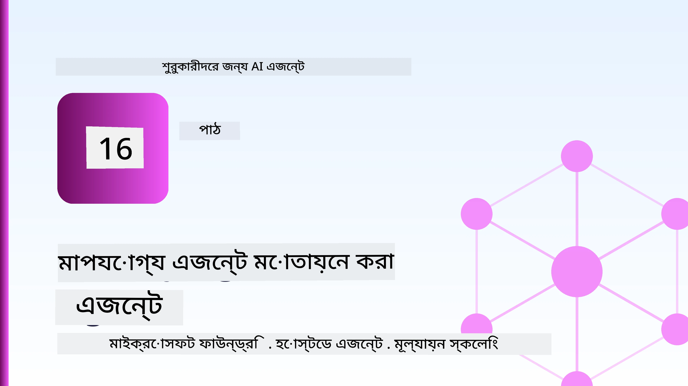
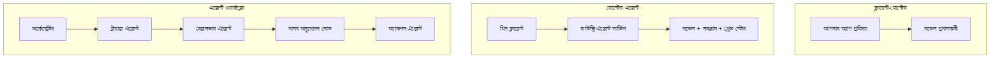
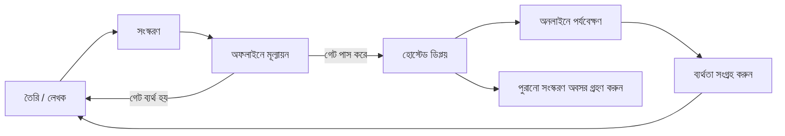
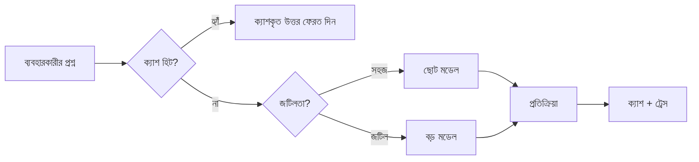
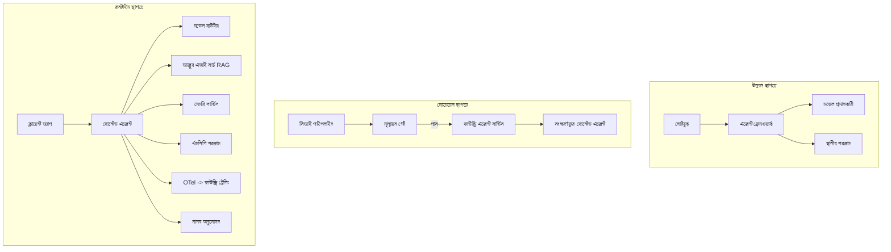

# Microsoft Foundry সহ স্কেলেবল এজেন্ট মোতায়েন করা



এই পর্যন্ত কোর্সে আপনি এমন এজেন্ট তৈরি করেছেন যা আপনার ল্যাপটপে, একটি নোটবুকে চলে, `az login` এবং কয়েকটি পরিবেশ পরিবর্তনশীল দ্বারা নিয়ন্ত্রিত। শিখতে এটি সঠিক উপায়। কিন্তু হাজার হাজার গ্রাহক তিনটায় নির্ভরশীল এমন একটি এজেন্ট চালানোর সঠিক উপায় এটি নয়।

এই পাঠ "এটি আমার যন্ত্রে কাজ করে" এবং "এটি উত্পাদনে নির্ভরযোগ্য এবং সাশ্রয়ী মূল্যে কাজ করে" এর মধ্যে ফারাক সম্পর্কে। আমরা এই ফারাকটি মেটাই **Microsoft Foundry** এবং **Microsoft Foundry Agent Service** ব্যবহার করে এবং একটি বাস্তব গ্রাহক সহায়তা এজেন্ট তৈরি করে যা টুলস, রিট্রিভাল, মেমরি, মূল্যায়ন এবং পর্যবেক্ষণের উপাদান রয়েছে।

## পরিচিতি

এই পাঠে থাকবে:

- একটি **প্রোটোটাইপ এজেন্ট** এবং একটি **প্রোডাকশন এজেন্টের** পার্থক্য, এবং কেন পরিবর্তনটি মূলত মডেলের *চাৰ্দিকে* সবকিছুর সঙ্গে সম্পর্কিত।
- এজেন্টদের জন্য **মোতায়েন প্যাটার্ন**: ক্লায়েন্ট-হোস্টেড, সার্ভিস-হোস্টেড (হোস্টেড এজেন্ট), এবং ওয়ার্কফ্লো-অর্কেস্ট্রেটেড।
- Microsoft Foundry তে **এজেন্ট লাইফসাইকেল** — তৈরি, সংস্করণ, মোতায়েন, মূল্যায়ন, পর্যবেক্ষণ, অবসান।
- **স্কেলিং কৌশল**: মডেল রাউটিং, ক্যাশিং, সমান্তরালতা, এবং স্টেটলেস ডিজাইন।
- OpenTelemetry এবং Foundry ট্রেসিং সহ **পর্যবেক্ষণযোগ্যতা**।
- মডেল নির্বাচন, রাউটিং, এবং মূল্যায়ন গেটের মাধ্যমে **খরচ অপ্টিমাইজেশন**।
- **এন্টারপ্রাইজ বিবেচনা**: গভর্ন্যান্স, মানব অনুমোদন, এবং MCP সার্ভারগুলোকে উত্পাদনে নিরাপদে চালানো।

## শেখার লক্ষ্য

এই পাঠ শেষ করার পর আপনি জানবেন কীভাবে:

- নির্দিষ্ট এজেন্ট ওয়ার্কলোডের জন্য সঠিক মোতায়েন প্যাটার্ন নির্বাচন করবেন।
- Microsoft Foundry Agent Service এ একটি এজেন্ট মোতায়েন করবেন যাতে এটি সংস্কৃত, গভর্নড এবং পর্যবেক্ষণযোগ্য হয়।
- প্রতিটি রিলিজের আগে চালানো একটি মূল্যায়ন পাইপলাইন ও ট্রেসিং এর জন্য এজেন্টকে ইনস্ট্রুমেন্টেশন করবেন।
- স্কেলে লেটেন্সি এবং খরচ নিয়ন্ত্রণে রাখার জন্য মডেল রাউটিং এবং ক্যাশিং প্রয়োগ করবেন।
- উচ্চ-ঝুঁকিপূর্ণ কার্যক্রমের জন্য মানব অনুমোদন গেট যোগ করবেন এবং MCP সার্ভারকে প্রোডাকশন-নিরাপদ উপায়ে সংযুক্ত করবেন।

## পূর্বপ্রয়োজনীয়তা

এই পাঠটি ধরে নিচ্ছে আপনি আগের পাঠগুলো সম্পন্ন করেছেন এবং নিম্নলিখিত বিষয়ে স্বাচ্ছন্দ্য বোধ করছেন:

- [Microsoft Agent Framework](../14-microsoft-agent-framework/README.md) দিয়ে এজেন্ট তৈরি (পাঠ ১৪)।
- [টুল ব্যবহারের](../04-tool-use/README.md) (পাঠ ৪) এবং [এজেন্টিক RAG](../05-agentic-rag/README.md) (পাঠ ৫)।
- [এজেন্ট মেমোরি](../13-agent-memory/README.md) (পাঠ ১৩) এবং [Agentic Protocols / MCP](../11-agentic-protocols/README.md) (পাঠ ১১)।
- [পর্যবেক্ষণযোগ্যতা এবং মূল্যায়ন](../10-ai-agents-production/README.md) (পাঠ ১০) — এই পাঠ সরাসরি এর উপর ভিত্তি করে তৈরি।

এছাড়াও আপনার দরকার:

- একটি **Azure সাবস্ক্রিপশন** এবং অন্তত একটি চালিত চ্যাট মডেলসহ একটি **Microsoft Foundry প্রকল্প**।
- **Azure CLI** ভেরিফাইড (`az login`)।
- পাইথন ৩.১২+ এবং রিপোজিটরির [`requirements.txt`](../../../requirements.txt) এ থাকা প্যাকেজ।

## প্রোটোটাইপ থেকে প্রোডাকশন: আসলে কী পরিবর্তিত হয়

একটি প্রোটোটাইপ এজেন্ট এবং একটি প্রোডাকশন এজেন্ট একই মূল লুপ ভাগ করে নেয় — কারণ নির্ণয়, টুলস কল, সাড়া প্রদান। পরিবর্তন হয় সেই লুপের চারপাশের সবকিছুতে। মডেল সম্ভবত একটি প্রোডাকশন এজেন্টের ২০% — বাকি ৮০% হল অপারেশনাল কাঠামো।

| বিষয় | প্রোটোটাইপ | প্রোডাকশন |
| --- | --- | --- |
| **হোস্টিং** | আপনার নোটবুকে চলে | হোস্টেড সার্ভিস হিসেবে চলে, সংস্কৃত এবং রোলড আউট |
| **পরিচয়** | আপনার `az login` টোকেন | স্কোপড RBAC সহ পরিচালিত পরিচয় |
| **স্টেট** | ইন-মেমরি, রিস্টার্টে হারায় | বাহ্যিকীকৃত (থ্রেড স্টোর, মেমরি সার্ভিস) |
| **ব্যর্থতা** | আপনি ট্রেসব্যাক দেখেন | পুনরায় চেষ্টা, ব্যাকআপ, ডেড-লেটার, অ্যালার্ট |
| **ব্যয়** | "কয়েক সেন্ট" | প্রতি রিকোয়েস্ট ট্র্যাক, রাউট, ক্যাশ, বাজেটেড |
| **গুণগত মান** | আপনি আউটপুট চোখে যাচাই করেন | প্রতিটি রিলিজের আগে স্বয়ংক্রিয় মূল্যায়ন |
| **বিশ্বাস** | আপনি প্রতিটি ক্রিয়া অনুমোদন করেন | রিস্কি কাজের জন্য পলিসি + মানব-মধ্যে-লুপ |

এই টেবিলটি মনে রাখুন। নিচের প্রতিটি বিভাগ এই সারিগুলোর একটি সাথে সম্পর্কিত।

## এজেন্ট মোতায়েন প্যাটার্নস

আপনি সাধারণত তিনটি প্যাটার্ন ব্যবহার করবেন, প্রায়ই সংমিশ্রণে।

### 1. ক্লায়েন্ট-হোস্টেড এজেন্টস

এজেন্ট অবজেক্ট আপনার অ্যাপ্লিকেশন প্রসেসের ভিতরে থাকে। আপনার কোড সরাসরি মডেল প্রদানকারীকে কল করে; কারণ নির্ণয় লুপ আপনার সার্ভিসে চলে। পূর্বের প্রতিটি পাঠে এভাবেই করা হয়েছে।

- **ব্যবহার করুন যখন** আপনি লুপের পূর্ণ নিয়ন্ত্রণ, কাস্টম মিডলওয়্যার চান, বা বিদ্যমান ব্যাকএন্ডের ভিতরে এজেন্ট এম্বেড করছেন।
- **ট্রেড-অফ**: স্কেলিং, স্টেট, এবং স্থিতিস্থাপকতা নিজে নিজের নিয়ন্ত্রণে।

### 2. হোস্টেড এজেন্টস (Foundry Agent Service)

এজেন্ট *Microsoft Foundry তে একটি রিসোর্স হিসাবে নিবন্ধিত* হয়। Foundry কারণ নির্ণয় লুপ হোস্ট করে, থ্রেডগুলি সংরক্ষণ করে, বিষয়বস্তু নিরাপত্তা ও RBAC প্রয়োগ করে, এবং এজেন্টকে Foundry পোর্টালে দৃশ্যমান করে তোলে। আপনার অ্যাপ একটি পাতলা ক্লায়েন্ট হয়ে ওঠে যা থ্রেড তৈরি করে এবং সাড়া পড়ে।

- **ব্যবহার করুন যখন** আপনি স্থায়িত্ব, বিল্ট-ইন পর্যবেক্ষণযোগ্যতা, গভর্ন্যান্স, এবং কম অপারেশনাল সারফেস এরিয়া চান।
- **ট্রেড-অফ**: পরিচালিত রানটাইমের বিনিময়ে কম নিম্নস্তরের নিয়ন্ত্রণ।

### 3. এজেন্ট ওয়ার্কফ্লোস

একাধিক এজেন্ট (এবং টুলস) একটি গ্রাফে একত্রিত হয় স্পষ্ট নিয়ন্ত্রণ প্রবাহের সাথে — ধারাবাহিক ধাপ, শাখা, মানব অনুমোদন নোড, এবং স্থায়ী চেকপয়েন্ট যা বিরতি এবং পুনরায় শুরু করতে পারে। এটি Microsoft Agent Framework এর **Workflows** ফিচার মোতায়েন স্কেলে প্রয়োগ।

- **ব্যবহার করুন যখন** একটি একক কাজ বিভিন্ন বিশেষায়িত এজেন্ট জুড়ে বিস্তৃত হয় বা মাঝে একটি অনুমোদন ধাপ প্রয়োজন।
- **ট্রেড-অফ**: বেশি সংকলন; অর্কেস্ট্রেশন-স্তরের পর্যবেক্ষণ দরকার।



## Microsoft Foundry তে এজেন্ট লাইফসাইকেল

একটি এজেন্ট মোতায়েন করা এককালীন `push` নয়। এটি একটি লুপ, এবং এটি সফ্টওয়্যার রিলিজ চক্রের মতো দেখতে কারণ সেটাই এটি।



মূল ধারণা [Lesson 10](../10-ai-agents-production/README.md) থেকে এসেছে: **অফলাইন মূল্যায়ন একটি গেট, পরবর্তী চিন্তা নয়।** একটি নতুন এজেন্ট সংস্করণ আপনার মূল্যায়ন থ্রেশহোল্ড পেরোয় না পর্যন্ত চালু হয় না। অনলাইন পর্যবেক্ষণ বাস্তব ব্যর্থতাগুলো আপনার অফলাইন টেস্ট সেটে ফেরত দেয়। এটাই পুরো লুপ।

## স্কেলিং কৌশলসমূহ

একটি এজেন্ট স্কেল করা একটি স্টেটলেস ওয়েব API এর স্কেলিং থেকে আলাদা, কারণ প্রতিটি রিকোয়েস্ট অনেক ব্যয়বহুল মডেল এবং টুল কল ট্রিগার করতে পারে। চারটি কৌশল মূল লোড বহন করে।

**স্টেটলেস রিকোয়েস্ট হ্যান্ডলিং।** আপনার প্রসেস মেমরিতে কোনো ব্যবহারকারীর স্টেট রাখবেন না। Foundry থ্রেড স্টোর বা মেমরি সার্ভিসে কথোপকথনের থ্রেডগুলো সংরক্ষণ করুন যাতে কোনো ইনস্ট্যান্স যেকোন রিকোয়েস্ট হ্যান্ডেল করতে পারে। এটাই আপনাকে অনুভূমিকভাবে স্কেল করতে দেয় — ইনস্ট্যান্স যোগ করুন, কোন স্টিকি সেশন দরকার নেই।

**মডেল রাউটিং।** সব রিকোয়েস্ট আপনার সবচেয়ে সক্ষম (এবং সবচেয়ে ব্যয়বহুল) মডেলের প্রয়োজন হয় না। সহজ রিকোয়েস্ট — উদ্দেশ্য শ্রেণীবিভাগ, সংক্ষিপ্ত তথ্যভিত্তিক উত্তর — একটি ছোট, দ্রুত মডেলের কাছে পাঠান, এবং বড় মডেল রাখুন প্রকৃত কারণ নির্ণয়ের জন্য। Foundry এর **Model Router** এ জন্য সাহায্য করে, অথবা আপনি নিজেই একটি হালকা ক্লাসিফায়ার তৈরি করতে পারেন। আপনি পরীক্ষাগারে DIY সংস্করণ তৈরি করবেন।

**রেসপন্স ক্যাশিং।** অনেক সমর্থন প্রশ্ন প্রায় অনুরূপ ("আমি কীভাবে আমার পাসওয়ার্ড রিসেট করব?")। সাধারণ প্রশ্নের উত্তর ক্যাশ করুন এবং মডেলকে ছুঁয়েও না সার্ভ করুন। একটি মাঝারি ক্যাশ হিট রেট খরচ এবং লেটেন্সি উল্লেখযোগ্যভাবে কমায়।

**সমান্তরালতা এবং ব্যাকপ্রেশার।** মডেল প্রদানকারীর রেট লিমিট আছে। আপনার সমান্তরালতা সীমাবদ্ধ করুন, এক্সপোনেনশিয়াল ব্যাকঅফ সহ পুনরায় চেষ্টা ব্যবহার করুন, এবং গ্রেসফুলি ব্যর্থ হন (একটি তালিকাভুক্ত "আমরা কাজ করছি" সাড়া ৫০০ এর থেকে উত্তম)।



## প্রোডাকশনে পর্যবেক্ষণযোগ্যতা

আপনি যা দেখতে পারেন না তা পরিচালনা করতে পারবেন না। পাঠ ১০ এ যেমন আলোচনা হয়েছে, Microsoft Agent Framework স্বাভাবিকভাবেই **OpenTelemetry** ট্রেস নির্গত করে — প্রতিটি মডেল কল, টুল আহ্বান, এবং অর্কেস্ট্রেশন ধাপ একটি স্প্যানে রূপান্তরিত হয়। প্রোডাকশনে আপনি ঐ স্প্যানগুলো Microsoft Foundry (অথবা যেকোন OTel-সঙ্গতিসাধক ব্যাকএন্ড) এ এক্সপোর্ট করেন যাতে আপনি পারেন:

- একক গ্রাহক অভিযোগ শুরু থেকে শেষ পর্যন্ত প্রতিটি মডেল ও টুল কলের মাধ্যমে ট্রেস করা।
- সময়ের সাথে প্রতি রিকোয়েস্টের p৫০/p৯৫ লেটেন্সি এবং খরচ পর্যবেক্ষণ করা।
- ব্যবহারকারী (অথবা আপনার অর্থ টিম) বুঝার আগেই ত্রুটি-দর বৃদ্ধি এবং খরচ অস্বাভাবিকতার জন্য সতর্ক করা।

```python
from agent_framework.observability import get_tracer

tracer = get_tracer()

with tracer.start_as_current_span("support_request") as span:
    span.set_attribute("customer.tier", "enterprise")
    span.set_attribute("routed.model", "gpt-5-nano")
    # এজেন্টের কার্যক্রম স্বয়ংক্রিয়ভাবে এই স্প্যানের ভিতরে ট্রেস করা হয়
```

`customer.tier` এবং `routed.model` এর মত অ্যাট্রিবিউট একটি ট্রেসের দেয়ালকে উত্তরযোগ্য প্রশ্নে পরিণত করে ("এন্টারপ্রাইজ গ্রাহকরা কি খুব বেশি ছোট মডেলে রাউট হচ্ছেন?")।

## খরচ অপ্টিমাইজেশন

প্রোডাকশন এজেন্টে খরচ মূলত টোকেন দ্বারা প্রভাবিত। তিনটি লিভার, প্রভাবের ক্রমে:

১। **মডেল সঠিক আকারে নির্বাচন।** একটি ছোট মডেল যা আপনার মূল্যায়ন গেট পেরিয়ে যায়, সাধারণত একটি বড় মডেলের চেয়ে সাশ্রয়ী যা পাশও করে। ছোট মডেল যথেষ্ট ভাল তা প্রমাণ করতে মূল্যায়ন ব্যবহার করুন বরং সুরক্ষার জন্য বৃহত্তম মডেলে ডিফল্ট না হয়ে।
২। **জটিলতা অনুযায়ী রাউটিং।** উপরে যেমন বলা হয়েছে — শুধুমাত্র যেগুলো বড় মডেল নির্ণয়ের প্রয়োজন তাদের জন্যই বড়-মডেল মূল্য পরামর্শ করুন।
৩। **ক্যাশিং এগ্রেসিভলি করুন।** সবচেয়ে সস্তা মডেল কল হল আপনি কখনো না করা কল।

মূল্যায়ন গেট এবং খরচ নিয়ন্ত্রণ একই ডিসিপ্লিন, দুটি দৃষ্টিভঙ্গি থেকে দেখা: মূল্যায়ন আপনাকে *গুণগত মানের স্তর* বলে দেয়, রাউটিং ও ক্যাশিং আপনাকে সেই স্তরের *ব্যয়ের* যতটা সম্ভব কাছাকাছি রাখে।

## এন্টারপ্রাইজ মোতায়েন বিবেচনা

**গভর্ন্যান্স।** হোস্টেড এজেন্টগুলো Foundry এর RBAC, বিষয়বস্তু নিরাপত্তা, এবং অডিট লগিং উত্তরাধিকার সূত্রে পায়। প্রতিটি এজেন্টকে একটি পরিচালিত পরিচয় দিন যার সর্বনিম্ন প্রয়োজনীয় অনুমতি আছে — কেবলমাত্র জ্ঞানভিত্তিক তথ্য পড়ার, টিকিটিং API তে স্কোপড অ্যাক্সেস, অতিরিক্ত কিছু নয়।

**মানব-মধ্যে-লুপ।** কিছু কাজ এত গুরুতর যে সরাসরি স্বয়ংক্রিয়করণ সঠিক নয় — ফেরত প্রদান, অ্যাকাউন্ট মুছে ফেলা, আইনি দলের কাছে অগ্রসর হওয়া। Microsoft Agent Framework সমর্থন করে **অনুমোদন-প্রয়োজনীয়** টুল: এজেন্ট ক্রিয়াটি প্রস্তাব করে, এক্সিকিউশন বিরত হয়, মানব অনুমোদন বা প্রত্যাখ্যান করে, ওয়ার্কফ্লো পুনরায় শুরু হয়। [Lesson 6](../06-building-trustworthy-agents/README.md) এ আপনি প্রিমিটিভ দেখেছেন; এখানে আপনি এটি মোতায়েন করবেন।

**প্রোডাকশনে MCP।** [MCP](../11-agentic-protocols/README.md) আপনার এজেন্টকে বাহ্যিক টুলগুলি একটি স্ট্যান্ডার্ড ইন্টারফেসের মাধ্যমে ব্যবহার করতে দেয়। প্রোডাকশনে, প্রতিটি MCP সার্ভারকে অবিশ্বাস্য সীমা হিসেবে বিবেচনা করুন: সার্ভার সংস্করণ পিন করুন, স্কোপড পরিচয়ে চালান, আউটপুট যাচাই করুন এবং কখনোই সিক্রেটস প্রকাশ করবেন না। MCP সার্ভার হলো একটি নির্ভরতা, যেগুলো প্যাচ, অডিট, এবং রেট-লিমিটেড হয়।



ওই তিনটি ডায়াগ্রাম — ডেভেলপমেন্ট, মোতায়েন, রানটাইম — একই এজেন্টের জীবনের তিনটি স্তর। পরবর্তী ল্যাব আপনাকে এটি নির্মাণে সাহায্য করবে।

## হাতেকলমে ল্যাব: প্রোডাকশন-রেডি গ্রাহক সাপোর্ট এজেন্ট

খুলুন [`code_samples/16-python-agent-framework.ipynb`](./code_samples/16-python-agent-framework.ipynb) এবং শুরু থেকে শেষ পর্যন্ত কাজ করুন। আপনি একটি **Contoso গ্রাহক সাপোর্ট এজেন্ট** তৈরি করবেন যেটিতে প্রতিটি প্রোডাকশন বিষয় অন্তর্ভুক্ত:

১। **টুল কলিং** — অর্ডার স্ট্যাটাস দেখুন এবং সাপোর্ট টিকিট খুলুন।
২। **RAG** — একটি জ্ঞানভিত্তিক নীতিমালা থেকে প্রশ্নের উত্তর দিন (Azure AI Search, একটি ইন-মেমরি ব্যাকআপসহ যাতে নোটবুক Resource ছাড়াই চলে)।
৩। **মেমোরি** — কথোপকথনের পর্যায়ে গ্রাহককে মনে রাখুন।
৪। **মডেল রাউটিং** — একটি জটিলতা শ্রেণীবিন্যাসকারী প্রতিটি রিকোয়েস্টকে ছোট বা বড় মডেলের কাছে পাঠায়।
৫। **রেসপন্স ক্যাশিং** — পুনরাবৃত্ত প্রশ্নগুলো ক্যাশ থেকে পরিবেশন করুন।
৬। **মানব অনুমোদন** — একটি থ্রেশহোল্ডের উপর ফেরতগুলো মানব অনুমোদনের জন্য বিরতি দেয়।
৭। **মূল্যায়ন পাইপলাইন** — একটি ছোট অফলাইন টেস্ট সেট এজেন্টের স্কোরিং করে এবং রিলিজ গেট হিসেবে কাজ করে।
৮। **পর্যবেক্ষণযোগ্যতা** — প্রতিটি রিকোয়েস্টের চারপাশে OpenTelemetry ট্রেসিং।

### ওয়াকথ্রু

নোটবুকটি এভাবে সংগঠিত যাতে প্রতিটি প্রোডাকশন বিষয় একটি স্বয়ংসম্পূর্ণ, রানযোগ্য বিভাগ। এর মূল হল রাউটিং-প্লাস-ক্যাশিং রিকোয়েস্ট হ্যান্ডলার:

```python
async def handle_support_request(query: str, customer_id: str) -> str:
    # ১. যখন সম্ভব ক্যাশ থেকে পরিবেশন করুন।
    cached = response_cache.get(normalize(query))
    if cached:
        return cached

    # ২. খরচ নিয়ন্ত্রণের জন্য জটিলতা অনুযায়ী রুট নির্ধারণ করুন।
    model = "gpt-5-nano" if is_simple(query) else "gpt-5-mini"

    # ৩. পর্যবেক্ষণযোগ্যতার জন্য ট্রেস স্প্যানে এজেন্ট চালান।
    with tracer.start_as_current_span("support_request") as span:
        span.set_attribute("routed.model", model)
        span.set_attribute("customer.id", customer_id)
        response = await support_agent.run(query, model=model)

    # ৪. ক্যাশ করুন এবং ফেরত দিন।
    response_cache.set(normalize(query), response.text)
    return response.text
```

রিলিজকে রক্ষা করা মূল্যায়ন গেট এরূপ:

```python
async def evaluation_gate(agent, test_cases, threshold: float = 0.8) -> bool:
    passed = 0
    for case in test_cases:
        result = await agent.run(case["input"])
        if score_response(result.text, case["expected"]) >= 0.8:
            passed += 1
    pass_rate = passed / len(test_cases)
    print(f"Evaluation pass rate: {pass_rate:.0%} (gate: {threshold:.0%})")
    return pass_rate >= threshold  # কেবল গেট পাস হলে ডিপ্লয় করুন
```

প্রতিটি লাইন পড়ুন — নোটবুক প্রিমিটিভগুলো সচেতনভাবে ছোট রেখে দেয় যাতে কোনো কিছু ফ্রেমওয়ার্ক কলের পেছনে লুকানো না থাকে।

## মোতায়েনকৃত এজেন্টের স্বীকৃতি স্মোক টেস্ট দিয়ে

উপরের মূল্যায়ন গেট আপনার এজেন্ট অবজেক্টের বিরুদ্ধে *অফলাইন* চলে। একবার এজেন্ট হোস্টেড এজেন্ট হিসাবে মোতায়েন হলে, আরেকটি, আরও সস্তা চেক দরকার: **মোতায়েনকৃত এন্ডপয়েন্ট সত্যিই সাড়া দিচ্ছে কি না?**

"সফলভাবে" মোতায়েন করা কেবল নিয়ন্ত্রণ প্লেন ডেফিনিশন গ্রহণ করেছে তা প্রমাণ করে — এটি প্রমাণ করে না এজেন্ট সাড়া দিচ্ছে। একটি অনুপস্থিত ডিপেন্ডেন্সি, একটি খারাপ মডেল রাউটিং, বা একটি মেয়াদোত্তীর্ণ সংযোগ একটি সবুজ মোতায়েন ফেলিয়ে দিতে পারে যা কিছুই ফেরত দেয় না। একটি **স্মোক টেস্ট** সেকেন্ডের মধ্যে এটি ধরতে পারে, প্রতিটি মোতায়েনে, সম্পূর্ণ মূল্যায়নের খরচ ছাড়াই।

এই রিপোজিটরিটি প্রস্তুত-ব্যবহারের জন্য একটি স্মোক-টেস্ট পাইপলাইন সরবরাহ করে যা [AI Smoke Test](https://github.com/marketplace/actions/ai-smoke-test) GitHub অ্যাকশনের উপর ভিত্তি করে:

- **ক্যাটালগ** — [`tests/lesson-16-smoke-tests.json`](../../../tests/lesson-16-smoke-tests.json) এ Contoso সাপোর্ট এজেন্টের প্রম্পট এবং অ্যাসারশন রয়েছে (স্থাপিত নীতি উত্তর, অর্ডার লুকআপ, সাপেক্ষতায় থাকা, এবং বহু-পর্বের থ্রেড ধারাবাহিকতা)। অন্যান্য পাঠের এজেন্টের ক্যাটালগ সেসবের পাশে রাখা হয়েছে — দেখুন [`tests/README.md`](../tests/README.md)।
- **ওয়ার্কফ্লো** — [`.github/workflows/smoke-test.yml`](../../../.github/workflows/smoke-test.yml) Azure OIDC দিয়ে লগইন করে এবং প্রতিটি প্রম্পট এজেন্টের Responses এন্ডপয়েন্টে POST করে, কোনো অ্যাসারশন নষ্ট হলে কাজটি ব্যর্থ বলে লোগ করে।

```yaml
- name: Smoke-test hosted agent
  uses: JFolberth/ai-smoketest@v1
  with:
    project_endpoint: ${{ inputs.project_endpoint }}
    agent_name: ContosoSupportAgent
    tests_file: tests/lesson-16-smoke-tests.json
```


আপনার এজেন্ট মোতায়েন করার পর **Actions** ট্যাব থেকে এটি চালান, আপনার Foundry প্রকল্পের endpoint এবং এজেন্ট নাম সরবরাহ করে। ফেডারেটেড আইডেন্টিটিকে Foundry প্রকল্পের স্কোপে **Azure AI User** ভূমিকা প্রয়োজন। স্তরগুলি একটি পিরামিডের মত ভাবুন: স্মোক টেস্ট (পৌঁছানো যাবে এবং প্রতিক্রিয়া দিচ্ছে?) প্রতিটি মোতায়েনের পরে চলে, অফলাইন মূল্যায়ন (পরিবহনের জন্য যথেষ্ট ভাল?) উন্নতির আগে চলে, এবং অনলাইন মূল্যায়ন (মাঠে এটি কেমন করছে?) ক্রমাগত চলে।

## জ্ঞান যাচাই

নিয়োগের আগে আপনার বোঝাপড়া পরীক্ষা করুন।

**১. প্রায় কতটুকু প্রোডাকশন এজেন্ট "মডেল" এবং বাকি অংশ কী?**

<details>
<summary>উত্তর</summary>

মডেল সিস্টেমের সংখ্যালঘু — প্রায় ২০% হিসেবে প্রায়ই বলা হয়ে থাকে। বাকি অংশ হল অপারেশনাল কঙ্কাল: হোস্টিং ও সংস্করণ নিয়ন্ত্রণ, পরিচয় ও RBAC, বাইরের অবস্থা, ত্রুটি পরিচালনা, খরচ ট্র্যাকিং, মূল্যায়ন, এবং মানব-ইন-দ্য-লুপ নিয়ন্ত্রণ। প্রোডাকশনে যাওয়া মূলত কারণগত লুপের *চাষাবাদ* করার চারপাশে সবকিছু তৈরি করা।
</details>

**২. কখন আপনি ক্লায়েন্ট-হোস্টেড এজেন্টের পরিবর্তে হোস্টেড এজেন্ট নির্বাচন করবেন?**

<details>
<summary>উত্তর</summary>

যখন আপনি একটি পরিচালিত রানটাইম চান যা বিল্ট-ইন টেকসইতা (সুতাগুলি যা বজায় থাকে এবং পুনরায় শুরু করতে পারে), পর্যবেক্ষণযোগ্যতা, বিষয়বস্তু নিরাপত্তা এবং RBAC থাকে, এবং আপনি কিছু নিম্ন-স্তরের নিয়ন্ত্রণ ত্যাগ করতে ইচ্ছুক যাতে অপারেশনাল এলাকা কম হয়। ক্লায়েন্ট-হোস্টেড বেশি ভাল যখন আপনি লুপের সম্পূর্ণ নিয়ন্ত্রণ চান বা এজেন্টকে একটি বিদ্যমান ব্যাকএন্ডে এমবেড করছেন।
</details>

**৩. কেন একটি স্কেলযোগ্য এজেন্টকে তার নিজস্ব প্রক্রিয়া মেমরি থেকে স্টেটলেস হতে হবে?**

<details>
<summary>উত্তর</summary>

যাতে যেকোন ইন্সট্যান্স যেকোন অনুরোধ পরিচালনা করতে পারে, যা হরিজন্টাল স্কেলিংকে অনুমতি দেয় স্টিকি সেশন ছাড়াই। প্রতি-ব্যবহারকারীর কথোপকথন অবস্থা একটি থ্রেড স্টোর বা মেমরি সার্ভিসে বাইরেরীকৃত হয়। যদি অবস্থা প্রক্রিয়া মেমরিতে থাকতো, তবে পুনরায় শুরু করলে তা হারিয়ে যেত এবং লোড মুক্তভাবে বিতরণ করা যেত না।
</details>

**৪. মডেল রাউটিং কী সমস্যা সমাধান করে, এবং এটি মূল্যায়নের সাথে কীভাবে সম্পর্কিত?**

<details>
<summary>উত্তর</summary>

রাউটিং সহজ অনুরোধগুলি ছোট, সস্তা, দ্রুত মডেলে পাঠায় এবং বড় মডেলটি প্রকৃত কারণবিদ্যার জন্য সংরক্ষণ করে, যা উভয়ই বিলম্বতা এবং খরচ নিয়ন্ত্রণ করে। এটি মূল্যায়নের সাথে সম্পর্কিত কারণ মূল্যায়নই প্রমাণ করে যে ছোট মডেল একটি অনুরোধের শ্রেণির জন্য যথেষ্ট ভাল — মূল্যায়ন ছাড়া রাউটিং হলো অনুমান।
</details>

**৫. "মূল্যায়ন গেট" কী এবং এটি জীবনচক্রের কোথায় থাকে?**

<details>
<summary>উত্তর</summary>

একটি মূল্যায়ন গেট একটি নতুন এজেন্ট সংস্করণের বিরুদ্ধে অফলাইন পরীক্ষা সেট চালায় এবং পাস রেট একটি থ্রেশহোল্ড অতিক্রম না করলে মোতায়েন বন্ধ করে দেয়। এটি জীবনচক্রে "সংস্করণ" এবং "মোতায়েন" এর মাঝে থাকে, মুক্তির আগে গুণমানকে পূর্বশর্ত করে তোলে, শিপিংয়ের পরে নয়।
</details>

**৬. কেন MCP সার্ভারকে প্রোডাকশনে অবিশ্বাস্য সীমানা হিসেবে বিবেচনা করা উচিত?**

<details>
<summary>উত্তর</summary>

কারণ এটি একটি বাইরের নির্ভরতা যা আপনার এজেন্ট কল করে। আপনাকে এর সংস্করণ পিন করতে হবে, একটি স্কোপড আইডেন্টিটির সাথে চালাতে হবে, এর আউটপুট যাচাই করতে হবে, রেট-লিমিট করতে হবে, এবং কখনই এটিকে গোপনীয়তা উন্মোচন করতে হবে না — ঠিক যেমনটি আপনি যেকোন তৃতীয়-পক্ষ নির্ভরতার ক্ষেত্রে করেন। এর আউটপুট আপনার এজেন্টের কারণবিজ্ঞানে প্রবাহিত হয়, তাই যাচাইকৃত না হওয়া বিশ্বাস একটি নিরাপত্তা ঝুঁকি।
</details>

**৭. কোন একক পরিবর্তন সাধারণত প্রোডাকশন এজেন্টের খরচে সবচেয়ে বড় প্রভাব ফেলে, এবং কেন?**

<details>
<summary>উত্তর</summary>

মডেলটির সঠিক মাপ নির্ধারণ — সবচেয়ে ছোট মডেল ব্যবহার করা যা এখনও আপনার মূল্যায়ন গেট পাস করে। খরচ মূলত টোকেন দ্বারা নিয়ন্ত্রিত হয়, এবং একটি ছোট মডেল যা মানের দণ্ড পূরণ করে প্রায়শই একটি বড় মডেলের চেয়ে সস্তা হয়। ক্যাশিং এবং রাউটিং তারপরে খরচ আরও কমায়, কিন্তু সঠিক বেস মডেল নির্বাচন করা সবচেয়ে বড় প্রথম-স্তরের প্রভাব ফেলে।
</details>

**৮. অবজার্ভেবলিতে `customer.tier` এবং `routed.model` এর মত স্প্যান অ্যাট্রিবিউট কী ভূমিকা পালন করে?**

<details>
<summary>উত্তর</summary>

এগুলো কাঁচা ট্রেসকে উত্তরব্যাঞ্জক ব্যবসায়িক প্রশ্নে পরিণত করে। অ্যাট্রিবিউট ছাড়া আপনার কাছে স্প্যানের একটি প্রাচীর থাকে; এর সঙ্গে আপনি জিজ্ঞেস করতে পারেন "এন্টারপ্রাইজ গ্রাহকদের কি খুব বেশি ছোট মডেলে রাউটিং করা হচ্ছে?" বা "আমাদের সবচেয়ে ধীর অনুরোধ কোন মডেল পরিচালনা করে?" অ্যাট্রিবিউট হলো আপনার অপারেশনের জন্য গুরুত্বপূর্ণ মাত্রাগুলির ভিত্তিতে টেলিমেট্রি ভাগ করার উপায়।
</details>

## নিয়োগ

ল্যাব থেকে গ্রাহক সাপোর্ট এজেন্ট নিয়ে এটি নির্দিষ্ট একটি পরিস্থিতির জন্য শক্তিশালী করুন: **একটি SaaS কোম্পানির সাবস্ক্রিপশন বিলিং সাপোর্ট এজেন্ট।**

আপনার জমাদান উচিত:

১. **সরঞ্জামগুলি প্রতিস্থাপন করুন** বিলিং-সংশ্লিষ্ট টুল দিয়ে: `get_subscription_status`, `get_invoice`, এবং `issue_credit` (৫০ ডলার উপরের ক্রেডিটে মানব অনুমোদন প্রয়োজন)।
২. **তিনটি RAG ডকুমেন্ট যুক্ত করুন** যা কোম্পানির রিফান্ড নীতি, বিলিং চক্র, এবং বাতিলকরণ নীতি কভার করে।
৩. **মূল্যায়ন সেট বিস্তৃত করুন** কমপক্ষে আটটি ঘটনা সহ, যার অন্তত দুইটি অবশ্যই মানব অনুমোদন পথ ট্রিগার করবে, এবং নিশ্চিত করুন আপনার মূল্যায়ন গেট সঠিকভাবে পাস বা ফেল করে।
৪. **একটি খরচ প্রতিবেদন যোগ করুন**: এজেন্টের মাধ্যমে দশটি মিশ্রিত ক্যোয়ারির পরে প্রিন্ট করুন কতগুলো ছোট মডেলে গিয়েছিল, কতগুলো বড় মডেলে, এবং কতগুলো ক্যাশ থেকে পরিবেশিত হয়েছিল।

একটি সংক্ষিপ্ত অনুচ্ছেদ (একটি মার্কডাউন সেলে) লিখুন যেখানে ব্যাখ্যা করবেন আপনি কোন মডেল-রাউটিং নিয়ম বেছে নিয়েছেন এবং আপনি কীভাবে বাস্তব ট্র্যাফিক দিয়ে এটি যাচাই করবেন। সঠিক উত্তর একক নয় — আপনাকে মূল্যায়ন করা হবে প্রোডাকশন উদ্বেগগুলি কতটা সঙ্গতিপূর্ণভাবে সংযুক্ত হয়েছে তার উপর।

## সারাংশ

এই পাঠে আপনি একটি এজেন্টকে Microsoft Foundry দিয়ে প্রোটোটাইপ থেকে প্রোডাকশনে নিয়ে গিয়েছেন:

- প্রোডাকশনে যাওয়া প্রধানত মডেলের চারপাশের **অপারেশনাল কঙ্কাল** নিয়ে — হোস্টিং, পরিচয়, অবস্থা, ত্রুটি পরিচালনা, খরচ, গুণমান, এবং বিশ্বাস।
- আপনি তিনটি **মোতায়েন প্যাটার্ন** শিখেছেন — ক্লায়েন্ট-হোস্টেড, হোস্টেড এজেন্ট, এবং এজেন্ট ওয়ার্কফ্লো — এবং কখন প্রতিটি উপযুক্ত।
- আপনি **এজেন্ট জীবনচক্র** অনুসরণ করেছেন, যেখানে অফলাইন **মূল্যায়ন একটি মুক্তির গেট হিসেবে কাজ করে** এবং অনলাইন পর্যবেক্ষণ ত্রুটিগুলিকে আবার পরীক্ষা সেটে পাঠায়।
- আপনি **স্কেলিং কৌশল** প্রয়োগ করেছেন — স্টেটলেস ডিজাইন, মডেল রাউটিং, ক্যাশিং, এবং সীমাবদ্ধ একই কনকারেন্সি — এবং এগুলিকে **খরচ অপ্টিমাইজেশনের সাথে** যুক্ত করেছেন।
- আপনি **এন্টারপ্রাইজ নিয়ন্ত্রণ প্রবাহ** সংযুক্ত করেছেন: RBAC, মানব-ইন-দ্য-লুপ অনুমোদন, এবং প্রোডাকশন-নিরাপদ MCP ইন্টিগ্রেশন।
- আপনি একটি **প্রোডাকশন-তৈয়ার গ্রাহক সাপোর্ট এজেন্ট** নির্মাণ করেছেন যা এই সব উদ্বেগকে রানযোগ্য কোডে সংযুক্ত করে।

পরবর্তী পাঠটি বিপরীত পথ গ্রহণ করবে: ক্লাউডে এজেন্ট স্কেল আপ করার পরিবর্তে, আপনি এগুলোকে *নিম্নে* নিয়ে একক ডেভেলপার মেশিনে সম্পূর্ণ স্থানীয়ভাবে চালাবেন।

## অতিরিক্ত সম্পদ

- <a href="https://learn.microsoft.com/azure/ai-foundry/what-is-azure-ai-foundry" target="_blank">Microsoft Foundry ডকুমেন্টেশন</a>
- <a href="https://learn.microsoft.com/azure/ai-foundry/agents/overview" target="_blank">Microsoft Foundry Agent Service ওভারভিউ</a>
- <a href="https://learn.microsoft.com/en-us/agent-framework/overview/?wt.mc_id=youtube_26688_organicsocial_reactor&pivots=programming-language-python" target="_blank">Microsoft Agent Framework</a>
- <a href="https://learn.microsoft.com/azure/ai-foundry/concepts/model-router" target="_blank">Microsoft Foundry তে Model Router</a>
- <a href="https://learn.microsoft.com/azure/search/search-what-is-azure-search" target="_blank">Azure AI Search</a>
- <a href="https://opentelemetry.io/" target="_blank">OpenTelemetry</a>
- <a href="https://github.com/marketplace/actions/ai-smoke-test" target="_blank">AI Smoke Test GitHub Action</a>
- <a href="https://modelcontextprotocol.io/" target="_blank">Model Context Protocol (MCP)</a>

## আগের পাঠ

[কোম্পিউটার ব্যবহার এজেন্ট তৈরি করা (CUA)](../15-browser-use/README.md)

## পরবর্তী পাঠ

[স্থানীয় AI এজেন্ট তৈরি করা](../17-creating-local-ai-agents/README.md)

---

<!-- CO-OP TRANSLATOR DISCLAIMER START -->
**অস্বীকৃতি**:
এই নথিটি AI অনুবাদ পরিষেবা [Co-op Translator](https://github.com/Azure/co-op-translator) ব্যবহার করে অনূদিত হয়েছে। যদিও আমরা শুদ্ধতার জন্য চেষ্টা করি, অনুগ্রহ করে মনে রাখবেন যে স্বয়ংক্রিয় অনুবাদে ত্রুটি বা অসঙ্গতি থাকতে পারে। মূল নথিটি তার স্বভাষায় কর্তৃত্বপূর্ণ উৎস হিসেবে বিবেচিত হওয়া উচিত। গুরুত্বপূর্ণ তথ্যের জন্য পেশাদার মানব অনুবাদ সুপারিশ করা হয়। এই অনুবাদের ব্যবহারে প্রয়োজনীয় ভুল বোঝাবুঝি বা ভুল ব্যাখ্যার জন্য আমরা দায়বদ্ধ নই।
<!-- CO-OP TRANSLATOR DISCLAIMER END -->