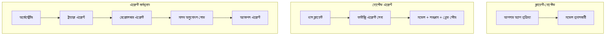
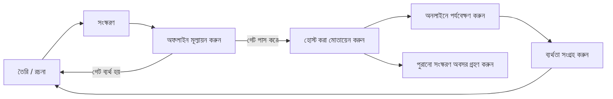
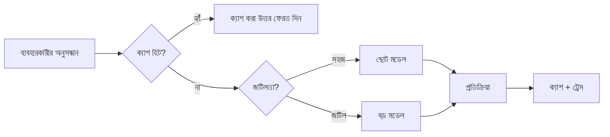
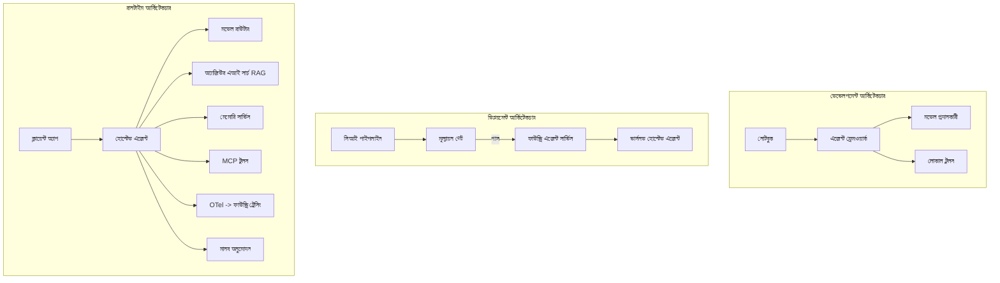

# Microsoft Foundry দিয়ে স্কেলেবল এজেন্ট স্থাপন


কোর্সের এই পর্যায়ে আপনি এমন এজেন্ট তৈরি করেছেন যা আপনার ল্যাপটপে, নোটবুকে চলে, `az login` ও কিছু পরিবেশ পরিবর্তনশীল দ্বারা চালিত। শেখার জন্য এটি ঠিকঠাক উপায়। তবে হাজার হাজার গ্রাহক যারা রাত ৩টায় এর উপর নির্ভর করে, তাদের জন্য এজেন্ট চালানোর সঠিক উপায় এটি নয়।

এই পাঠটি "এটি আমার মেশিনে কাজ করে" এবং "এটি বিশ্বস্ত এবং সাশ্রয়ীভাবে প্রোডাকশনে কাজ করে" এই পার্থক্যের সম্পর্কে। আমরা এই ব্যবধান বন্ধ করব **Microsoft Foundry** এবং **Microsoft Foundry Agent Service** ব্যবহার করে, এবং একটি বাস্তব গ্রাহক সাপোর্ট এজেন্ট তৈরি করে যা সরঞ্জাম, পুনরুদ্ধার, মেমোরি, মূল্যায়ন এবং পর্যবেক্ষণ আছে।

## পরিচিতি

এই পাঠে যা আলোচনা করা হবে:

- একটি **প্রোটোটাইপ এজেন্ট** এবং একটি **স্থাপিত এজেন্ট** এর মধ্যে পার্থক্য, এবং কেন রূপান্তর বেশিরভাগই মডেলের আশেপাশের সবকিছু নিয়ে।
- এজেন্টের জন্য **মাধ্যমিক স্থাপন প্যাটার্ন**: ক্লায়েন্ট-হোস্টেড, সার্ভিস-হোস্টেড (হোস্টেড এজেন্ট), এবং ওয়ার্কফ্লো-অর্কেস্ট্রেটেড।
- Microsoft Foundry এ **এজেন্ট জীবনচক্র** — তৈরি, ভার্সন, স্থাপন, মূল্যায়ন, পর্যবেক্ষণ, অবসর।
- **স্কেলিং কৌশল**: মডেল রাউটিং, ক্যাশিং, সমকালেরতা, এবং স্টেটলেস ডিজাইন।
- OpenTelemetry এবং Foundry ট্রেসিং এর মাধ্যমে **পর্যবেক্ষণযোগ্যতা**।
- মডেল নির্বাচন, রাউটিং, এবং মূল্যায়ন গেটের মাধ্যমে **ব্যয় অপ্টিমাইজেশন**।
- **এন্টারপ্রাইজ বিবেচনা**: গভর্নেন্স, মানব অনুমোদন, এবং প্রোডাকশনে MCP সার্ভার নিরাপদে চালানো।

## শেখার লক্ষ্যসমূহ

এই পাঠ সম্পন্ন করার পর আপনি জানতে পারবেন:

- নির্দিষ্ট এজেন্ট ওয়ার্কলোডের জন্য সঠিক স্থাপন প্যাটার্ন নির্বাচন করা।
- Microsoft Foundry Agent Service এ এজেন্ট স্থাপন করা যাতে এটি ভার্সন, গভর্ন এবং পর্যবেক্ষণযোগ্য হয়।
- ট্রেসিং এর জন্য এজেন্ট ইন্সট্রুমেন্ট করা এবং একটি মূল্যায়ন পাইপলাইন তৈরি করা যা প্রতিটি রিলিজের আগে চলে।
- স্কেলে বিলম্বতা এবং ব্যয় নিয়ন্ত্রণ রাখতে মডেল রাউটিং ও ক্যাশিং প্রয়োগ করা।
- উচ্চ ঝুঁকিপূর্ণ কাজের জন্য মানব অনুমোদন গেট যোগ করা এবং MCP সার্ভার প্রোডাকশন-নিরাপদ উপায়ে ইন্টিগ্রেট করা।

## পূর্বশর্তসমূহ

এই পাঠটি ধরে নেয় আপনি পূর্ববর্তী পাঠগুলো সম্পন্ন করেছেন এবং নিচের বিষয়ের সাথে পরিচিত:

- [Microsoft Agent Framework](../14-microsoft-agent-framework/README.md) দিয়ে এজেন্ট তৈরি (পাঠ ১৪)।
- [টুল ব্যবহার](../04-tool-use/README.md) (পাঠ ৪) এবং [এজেন্টিক RAG](../05-agentic-rag/README.md) (পাঠ ৫)।
- [এজেন্ট মেমোরি](../13-agent-memory/README.md) (পাঠ ১৩) এবং [এজেন্টিক প্রোটোকল / MCP](../11-agentic-protocols/README.md) (পাঠ ১১)।
- [পর্যবেক্ষণযোগ্যতা এবং মূল্যায়ন](../10-ai-agents-production/README.md) (পাঠ ১০) — এই পাঠ সরাসরি এর উপর ভিত্তি করে তৈরি।

আপনার প্রয়োজন হবে:

- একটি **Azure সাবস্ক্রিপশন** এবং অন্তত একটি স্থাপিত চ্যাট মডেল সহ **Microsoft Foundry প্রকল্প**।
- **Azure CLI** এ প্রমাণীকৃত (`az login`)।
- Python 3.12+ এবং রিপোজিটরির [`requirements.txt`](../../../requirements.txt) ফাইলে থাকা প্যাকেজগুলো।

## প্রোটোটাইপ থেকে প্রোডাকশনে: আসলে কী পরিবর্তন হয়

একটি প্রোটোটাইপ এজেন্ট এবং একটি প্রোডাকশন এজেন্ট একই মূল চক্র ভাগ করে — চিন্তা করা, টুল কল করা, সাড়া দেওয়া। যা পরিবর্তন হয় তা হলো সেই চক্রের আশেপাশের সবকিছু। মডেল সম্ভবত প্রোডাকশন এজেন্টের ২০%; বাকি ৮০% হলো অপারেশনাল কাঠামো।

| বিষয় | প্রোটোটাইপ | প্রোডাকশন |
| --- | --- | --- |
| **হোস্টিং** | আপনার নোটবুকে চলে | হোস্টেড সার্ভিস হিসেবে চলে, ভার্সন এবং রোল আউট করা হয় |
| **পরিচয়** | আপনার `az login` টোকেন | স্কোপ করা RBAC সহ ব্যবস্থাপিত পরিচয় |
| **অবস্থা** | ইন-মেমোরি, পুনরায় চালু হলে হারায় | বাহ্যিকীকৃত (থ্রেড স্টোর, মেমোরি সার্ভিস) |
| **ব্যর্থতা** | আপনি ট্রেসব্যাক দেখেন | পুনরায় চেষ্টা, বিকল্প, ডেড-লেটার, সতর্কবার্তা |
| **ব্যয়** | "কিছু সেন্ট মাত্র" | প্রতি অনুরোধ ট্র্যাক, রাউট, ক্যাশ, বাজেট |
| **গুণমান** | আপনি আউটপুট দেখে মূল্যায়ন করেন | প্রতি রিলিজ আগে স্বয়ংক্রিয়ভাবে মূল্যায়িত |
| **বিশ্বাস** | আপনি প্রত্যেক কাজ অনুমোদন করেন | ঝুঁকিপূর্ণ কাজের জন্য নীতি + মানব-ইন-লুপ |

এই টেবিলটি মনে রাখুন। নিচের প্রতিটি সেকশন এই সারিগুলোর একটি সঙ্গে সম্পর্কিত।

## এজেন্ট স্থাপনের প্যাটার্নসমূহ

আপনি তিনটি প্যাটার্ন ব্যবহার করবেন, প্রায়ই যৌথভাবে।

### ১. ক্লায়েন্ট-হোস্টেড এজেন্ট

এজেন্ট অবজেক্ট *আপনার* অ্যাপ্লিকেশন প্রসেসের ভিতরে থাকে। আপনার কোড সরাসরি মডেল প্রদানকারীর কাছে কল করে; রিজনিং লুপ আপনার সার্ভিসে চলে। পূর্ববর্তী সব পাঠ এটাই করেছে।

- **যখন ব্যবহার করবেন** আপনি লুপ সম্পূর্ণ নিয়ন্ত্রণ, কাস্টম মিডলওয়্যার চান, অথবা এজেন্টকে বিদ্যমান ব্যাকএন্ডে এম্বেড করছেন।
- **বিপরীতপ্রতিক্রিয়া**: স্কেলিং, অবস্থা, এবং স্থিতিশীলতা নিজেই আপনার দায়িত্ব।

### ২. হোস্টেড এজেন্ট (Foundry Agent Service)

এজেন্ট Microsoft Foundry তে *রিসোর্স হিসেবে নিবন্ধিত* হয়। Foundry রিজনিং লুপ হোস্ট করে, থ্রেড রাখে, কনটেন্ট নিরাপত্তা এবং RBAC প্রয়োগ করে, এবং এজেন্টকে Foundry পোর্টালে দৃশ্যমান করে তোলে। আপনার অ্যাপ একটি পাতলা ক্লায়েন্ট হিসেবে থ্রেড তৈরি করে এবং রিপন্স পড়ে।

- **যখন ব্যবহার করবেন** আপনিটিকৗক্ষমতা, অন্তর্নির্মিত পর্যবেক্ষণযোগ্যতা, গভর্নেন্স, এবং কম অপারেশনাল সারফেস এলাকা চান।
- **বিপরীতপ্রতিক্রিয়া**: পরিচালিত রানটাইমের বিনিময়ে কম নিম্নস্তরের নিয়ন্ত্রণ।

### ৩. এজেন্ট ওয়ার্কফ্লো

একাধিক এজেন্ট (এবং টুল) একটি গ্রাফে সংযুক্ত হয় যেখানে স্পষ্ট নিয়ন্ত্রণ প্রবাহ থাকে — ধারাবাহিক ধাপ, শাখা, মানব অনুমোদন নোড, এবং দীর্ঘস্থায়ী চেকপয়েন্ট যা বিরতি দিয়ে পুনরায় শুরু করা যায়। Microsoft Agent Framework এর **Workflows** ফিচার যা স্থাপন স্কেলে প্রয়োগ করা হয়।

- **যখন ব্যবহার করবেন** একটি একক টাস্ক বেশ কয়েকটি বিশেষায়িত এজেন্ট জুড়ে থাকে বা মাঝখানে অনুমোদন ধাপ প্রয়োজন।
- **বিপরীতপ্রতিক্রিয়া**: আরো বেশি চলমান অংশ; অর্কেস্ট্রেশনের পর্যবেক্ষণযোগ্যতা প্রয়োজন।



## Microsoft Foundry এ এজেন্ট জীবনচক্র

একটি এজেন্ট স্থাপন এককালীন `push` নয়। এটি একটি লুপ, এবং এটি অনেকটা সফটওয়্যার রিলিজ সাইকেলের মত কারণ এটাই আসলে।



মূল ধারণা, [Lesson 10](../10-ai-agents-production/README.md) থেকে নেয়া: **অফলাইন মূল্যায়ন হল একটি গেট, পরে ভাবনা নয়।** একটি নতুন এজেন্ট ভার্সন শিপ হয় না যতক্ষণ না এটা আপনার মূল্যায়ন সীমা পেরোয়। অনলাইন পর্যবেক্ষণ প্রকৃত ব্যর্থতাগুলোকে আপনার অফলাইন টেস্ট সেটে ফেরত পাঠায়। এটাই পুরো লুপ।

## স্কেলিং কৌশলসমূহ

একটি এজেন্ট স্কেল করা আলাদা স্টেটলেস ওয়েব API স্কেল করার থেকে, কারণ প্রতিটি অনুরোধ অনেক ব্যয়বহুল মডেল এবং টুল কল অনুপ্রাণিত করতে পারে। চারটি কৌশল মূল বোঝা বহন করে।

**স্টেটলেস অনুরোধ হ্যান্ডলিং।** আপনার প্রসেস মেমোরিতে ব্যবহারকারীর কোন অবস্থা রাখবেন না। কথোপকথন থ্রেডগুলি Foundry থ্রেড স্টোর বা একটি মেমোরি সার্ভিসে সংরক্ষণ করুন যাতে যেকোন ইনস্ট্যান্স যেকোন অনুরোধ হ্যান্ডল করতে পারে। এটি আপনাকে আড়াআড়ি স্কেলিং করতে দেয় — ইনস্ট্যান্স বাড়ান, স্টিকি সেশন নয়।

**মডেল রাউটিং।** প্রতিটি অনুরোধেই আপনার সবচেয়ে সক্ষম (এবং সবচেয়ে ব্যয়বহুল) মডেলের প্রয়োজন হয় না। সহজ অনুরোধ — উদ্দেশ্য শ্রেণীবিভাজন, সংক্ষিপ্ত তথ্যভিত্তিক উত্তর — একটি ছোট, দ্রুত মডেলে রুট করুন, এবং বড় মডেলটি আসল রিজনিংয়ের জন্য রাখুন। Foundry এর **Model Router** এটি করতে পারে, অথবা আপনি নিজেই একটি হালকা শ্রেণীবিভাজক বানাতে পারেন। আপনি ল্যাবে DIY সংস্করণটি তৈরি করবেন।

**রেসপন্স ক্যাশিং।** অনেক সাপোর্ট প্রশ্ন প্রায় একইরকম ("কিভাবে আমার পাসওয়ার্ড রিসেট করব?")। সাধারণ প্রশ্নের উত্তর ক্যাশ করুন এবং মডেল হিট না করেই পরিবেশন করুন। একটি মাঝারি ক্যাশ হিট রেটও ব্যয় ও বিলম্বতা অনেক কমায়।

**সমকালেরতা এবং ব্যাকপ্রেশার।** মডেল প্রদানকারীদের রয়েছে রেট লিমিট। আপনার সমকালেরতা বেধে দিন, এক্সপোনেনশিয়াল ব্যাকঅফ সহ পুনরায় চেষ্টা ব্যবহার করুন, এবং সুচারুভাবে ব্যর্থ হন (একটি সারিতে থাকা "আমরা কাজ করছি" উত্তর ৫০০ এরচেয়ে ভালো)।



## প্রোডাকশনে পর্যবেক্ষণযোগ্যতা

আপনি যা দেখতে পারেন না তা পরিচালনা করতে পারবেন না। পাঠ ১০ এ যেমন আলোচনা হয়েছে, Microsoft Agent Framework স্বাভাবিকভাবেই **OpenTelemetry** ট্রেস তৈরি করে — প্রতিটি মডেল কল, টুল অনুপ্রেরণা, এবং অর্কেস্ট্রেশন ধাপ একটি স্প্যান হিসেবে রেকর্ড হয়। প্রোডাকশনে আপনি ঐ স্প্যানগুলো Microsoft Foundry (বা যেকোন OTel-সঙ্গত ব্যাকএন্ড) এ এক্সপোর্ট করেন যাতে আপনি:

- একক গ্রাহকের অভিযোগ একেবারে শুরু থেকে শেষ প্রতিটি মডেল ও টুল কল অনুসরণ করতে পারেন।
- সময়ের সাথে p50/p95 বিলম্বতা এবং প্রতি অনুরোধ ব্যয় পর্যবেক্ষণ করতে পারেন।
- ত্রুটি-হার স্পাইক এবং ব্যয় অস্বাভাবিকতা সম্পর্কে সতর্কবার্তা পেতে পারেন, ব্যবহারকারী বা আপনার ফাইন্যান্স টিমের আগে।

```python
from agent_framework.observability import get_tracer

tracer = get_tracer()

with tracer.start_as_current_span("support_request") as span:
    span.set_attribute("customer.tier", "enterprise")
    span.set_attribute("routed.model", "gpt-5-nano")
    # এই স্প্যানের ভিতরে এজেন্ট এক্সিকিউশন স্বয়ংক্রিয়ভাবে ট্রেস করা হয়
```

`customer.tier` এবং `routed.model` মত বৈশিষ্ট্যগুলি দ্রুত ট্রেস গুলোকে উত্তরযোগ্য প্রশ্নে পরিণত করে ("এন্টারপ্রাইজ গ্রাহকদের কি খুব বেশি ছোট মডেলে রাউট করা হচ্ছে?")।

## ব্যয় অপ্টিমাইজেশন

প্রোডাকশন এজেন্টে ব্যয় প্রধানত টোকেন দ্বারা চাষা হয়। তিনটি প্রধান নিয়ন্ত্রণ হাতিয়ার:

১. **মডেল সাইজ ঠিক করা।** একটি ছোট মডেল যা আপনার মূল্যায়ন গেট পাস করে প্রায়শই একটি বড় মডেল থেকে সস্তা। মূল্যায়নের মাধ্যমে প্রমাণ করুন ছোট মডেল যথেষ্ট ভালো, বড় মডেল ব্যবহারের আগে সতর্কতা হিসেবে নয়।
২. **জটিলতা অনুসারে রাউটিং।** উপরের মতো — বড় মডেল মূল্য শুধু সেই অনুরোধের জন্য দিন যেগুলো বড় মডেল রিজনিং প্রয়োজন।
৩. **তীব্র ক্যাশিং।** সবচেয়ে সস্তা মডেল কল হলো আপনি কখনো কল না করা।

মূল্যায়ন গেট এবং ব্যয় নিয়ন্ত্রণ দুইটি ভিন্ন দিক থেকে একই বিষয়: মূল্যায়ন মানে *গুণমানের তল* জানায়, রাউটিং এবং ক্যাশিং আপনাকে সেই তল বরাবর যতটা সম্ভব *ব্যয়* কম রাখতে সাহায্য করে।

## এন্টারপ্রাইজ স্থাপন বিবেচনা

**গভর্নেন্স।** হোস্টেড এজেন্ট Foundry এর RBAC, কনটেন্ট নিরাপত্তা, এবং অডিট লগিং উত্তরাধিকার সূত্রে পায়। প্রতিটি এজেন্টকে এমন একটি ব্যবস্থাপিত পরিচয় দিন যার সর্বনিম্ন প্রিভিলেজ আছে — কেবল পড়ার অনুমতি জ্ঞানের ভাণ্ডারে, টিকেট API-এ স্কোপড অ্যাক্সেস, অন্য কিছু নয়।

**মানব-ইন-লুপ।** কিছু কাজ এত গুরুতর হয় যে স্বয়ংক্রিয় করা সম্ভব নয় — রিফান্ড ইস্যু করা, একটি অ্যাকাউন্ট মুছে ফেলা, আইনগত টিমে উৎসাহিত করা। Microsoft Agent Framework **অনুমোদন-প্রয়োজনীয়** টুল সমর্থন করে: এজেন্ট কাজ প্রস্তাব করে, প্রক্রিয়া থামে, মানব অনুমোদন বা প্রত্যাখ্যান করে, তারপর ওয়ার্কফ্লো পুনরায় চালু হয়। আপনি এই মৌলিক বিষয়টি [Lesson 6](../06-building-trustworthy-agents/README.md) এ দেখেছিলেন; এখানে আপনি এটি স্থাপন করবেন।

**প্রোডাকশনে MCP।** [MCP](../11-agentic-protocols/README.md) আপনার এজেন্টকে স্ট্যান্ডার্ড ইন্টারফেস দিয়ে বাহ্যিক টুল ব্যবহার করার সুযোগ দেয়। প্রোডাকশনে প্রতিটি MCP সার্ভারকে অবিশ্বাস্য সীমানা হিসেবে ভাবুন: সার্ভার ভার্সন পিন করুন, স্কোপড পরিচয়ে চালান, আউটপুট যাচাই করুন, এবং কখনো গোপন তথ্য প্রকাশ করা যাবে না। MCP সার্ভার একটি নির্ভরযোগ্যতা এবং নির্ভরতাসমূহ প্যাচ, অডিট এবং রেট-লিমিট হয়।



এই তিনটি চিত্র — উন্নয়ন, স্থাপন, রানটাইম — একই এজেন্টের জীবনের তিন ধাপ। পরের ল্যাব আপনাকে এটি তৈরি করতে সাহায্য করবে।

## হাতে-কলমে ল্যাব: একটি প্রোডাকশন-রেডি গ্রাহক সাপোর্ট এজেন্ট

খুলুন [`code_samples/16-python-agent-framework.ipynb`](./code_samples/16-python-agent-framework.ipynb) এবং সম্পূর্ণ কাজ করুন। আপনি একটি **কন্টোসো গ্রাহক সাপোর্ট এজেন্ট** তৈরি করবেন যার প্রতিটি প্রোডাকশন বিষয় যুক্ত থাকবে:

১. **টুল কলিং** — অর্ডার অবস্থা দেখুন এবং সাপোর্ট টিকিট খুলুন।
২. **RAG** — একটি জ্ঞানভাণ্ডার থেকে নীতি প্রশ্নের উত্তর দিন (Azure AI Search, একটি ইন-মেমোরি ব্যাকআপ সহ যাতে নোটবুক সার্চ রিসোর্স ছাড়া চলে)।
৩. **মেমোরি** — কথোপকথনের পালায় গ্রাহক মনে রাখুন।
৪. **মডেল রাউটিং** — একটি জটিলতা শ্রেণীবিভাজক প্রতি অনুরোধ একটি ছোট বা বড় মডেলে পাঠায়।
৫. **রেসপন্স ক্যাশিং** — পুনরাবৃত্ত প্রশ্ন ক্যাশ থেকে পরিবেশন।
৬. **মানব অনুমোদন** — নির্দিষ্ট থ্রেশহোল্ডের বাইরে রিফান্ড হলে মানব অনুমোদনের জন্য বিরতি হয়।
৭. **মূল্যায়ন পাইপলাইন** — একটি ছোট অফলাইন টেস্ট সেট এজেন্টকে স্কোর করে এবং রিলিজ গেট হিসেবে কাজ করে।
৮. **পর্যবেক্ষণযোগ্যতা** — প্রতি অনুরোধের চারপাশে OpenTelemetry ট্রেসিং।

### ওয়ার্কথ্রু

নোটবুকটি এমনভাবে সংগঠিত যাতে প্রতিটি প্রোডাকশন বিষয় একটি স্বতন্ত্র, চালানো সেকশন। এর হৃদয় হলো রাউটিং-প্লাস-ক্যাশিং অনুরোধ হ্যান্ডলার:

```python
async def handle_support_request(query: str, customer_id: str) -> str:
    # 1. যখন পারি ক্যাশ থেকে সার্ভ করুন।
    cached = response_cache.get(normalize(query))
    if cached:
        return cached

    # 2. খরচ নিয়ন্ত্রণের জন্য জটিলতা অনুযায়ী রুট নির্ধারণ করুন।
    model = "gpt-5-nano" if is_simple(query) else "gpt-5-mini"

    # 3. পর্যবেক্ষণযোগ্যতার জন্য একটি ট্রেস স্প্যানে এজেন্ট চালান।
    with tracer.start_as_current_span("support_request") as span:
        span.set_attribute("routed.model", model)
        span.set_attribute("customer.id", customer_id)
        response = await support_agent.run(query, model=model)

    # 4. ক্যাশ করুন এবং রিটার্ন করুন।
    response_cache.set(normalize(query), response.text)
    return response.text
```

রিলিজ রক্ষা করা মূল্যায়ন গেট এরকম দেখায়:

```python
async def evaluation_gate(agent, test_cases, threshold: float = 0.8) -> bool:
    passed = 0
    for case in test_cases:
        result = await agent.run(case["input"])
        if score_response(result.text, case["expected"]) >= 0.8:
            passed += 1
    pass_rate = passed / len(test_cases)
    print(f"Evaluation pass rate: {pass_rate:.0%} (gate: {threshold:.0%})")
    return pass_rate >= threshold  # শুধুমাত্র গেট সফল হলে ডিপ্লয় করুন
```

প্রতিটি লাইন পড়ুন — নোটবুকটি উদ্দেশ্যপ্রণোদিত ছোট রেখে ফ্রেমওয়ার্ক কলের আঙিনার বাইরে কিছুই লুকানো নেই।

## স্থাপিত এজেন্টকে স্মোক টেস্ট দিয়ে যাচাই করা

উপরের মূল্যায়ন গেট আপনার এজেন্ট অবজেক্টের বিরুদ্ধে *অফলাইন* চলে। একবার এজেন্ট একটি হোস্টেড এজেন্ট হিসেবে স্থাপিত হলে, আরেকটি, আরও সস্তা পরীক্ষা দরকার: **স্থাপিত এন্ডপয়েন্ট আসলে উত্তর দিচ্ছে কিনা?**

"সফলভাবে" স্থাপন শুধুমাত্র প্রমাণ করে কন্ট্রোল প্লেন সংজ্ঞাটি গ্রহণ করেছে — এটি এজেন্ট উত্তর দেয় তা প্রমাণ করে না। বিশেষ করে একটি অভাবিত নির্ভরতা, খারাপ মডেল রাউটিং, বা মেয়াদ শেষ সংযোগ একটি সবুজ স্থাপন রেখে কিছুই ফেরত দিতে নাও পারে। একটি **স্মোক টেস্ট** সেই সমস্যা সেকেন্ডের মধ্যে ধরতে পারে, প্রতিটি স্থাপনে, পূর্ণ মূল্যায়নের ব্যয় ছাড়াই।

এই রিপোজিটরিতে একটি ব্যবহার-সাজানো স্মোক-টেস্ট পাইপলাইন পাওয়া যায় যা তৈরি হয়েছে [AI Smoke Test](https://github.com/marketplace/actions/ai-smoke-test) GitHub Action এর উপর:

- **ক্যাটালগ** — [`tests/lesson-16-smoke-tests.json`](../../../tests/lesson-16-smoke-tests.json) কন্টোসো সাপোর্ট এজেন্টের জন্য প্রম্পট এবং নিশ্চয়তা রাখে (ভিত্তিপ্রাপ্ত নীতি উত্তর, অর্ডার অনুসন্ধান, বিষয়বস্তুর সদৃশতা রক্ষা, এবং বহু-পালার থ্রেড ধারাবাহিকতা)। অন্যান্য পাঠের এজেন্টের ক্যাটালগও এখানে আছে — দেখুন [`tests/README.md`](../tests/README.md)।
- **ওয়ার্কফ্লো** — [`.github/workflows/smoke-test.yml`](../../../.github/workflows/smoke-test.yml) Azure OIDC দিয়ে লগইন করে এবং প্রতিটি প্রম্পট এজেন্টের Responses এন্ডপয়েন্টে POST করে, যেকোন নিশ্চয়তা না মানলে কাজ ব্যর্থ করে।

```yaml
- name: Smoke-test hosted agent
  uses: JFolberth/ai-smoketest@v1
  with:
    project_endpoint: ${{ inputs.project_endpoint }}
    agent_name: ContosoSupportAgent
    tests_file: tests/lesson-16-smoke-tests.json
```


আপনার এজেন্ট মোতায়েন করার পর, **Actions** ট্যাব থেকে রান করুন, আপনার Foundry প্রকল্পের endpoint এবং এজেন্টের নাম দিন। ফেডারেটেড আইডেন্টিটির Foundry প্রকল্প স্কোপে **Azure AI User** ভূমিকা থাকতে হবে। লেয়ারগুলিকে একটি পিরামিডের মতো ভাবুন: ধোঁয়া পরীক্ষা (সরাসরি পৌঁছানো এবং সাড়া দিচ্ছে?) প্রতিটি ডিপ্লয়ের উপর চালানো হয়, অফলাইন মূল্যায়ন (প্রেরণের জন্য যথেষ্ট ভালো?) উন্নতির আগে চালানো হয়, এবং অনলাইন মূল্যায়ন (এটি বাস্তবে কেমন কাজ করছে?) ক্রমাগত চলে।

## জ্ঞান যাচাই

নিয়োগের আগে আপনার উপলব্ধি পরীক্ষা করুন।

**১. একটি প্রোডাকশন এজেন্টের প্রায় কত অংশ "মডেল," এবং বাকিটি কী?**

<details>
<summary>উত্তর</summary>

মডেলটি সিস্টেমের একটি সংখ্যালঘু অংশ — প্রায় ২০% হিসাবে উল্লেখ করা হয়। বাকিটা হল অপারেশনাল কাঠামো: হোস্টিং এবং ভার্সনিং, পরিচয় ও RBAC, বাহ্যিক অবস্থা, ব্যর্থতা পরিচালনা, খরচ ট্র্যাকিং, মূল্যায়ন এবং মানব-ইন-দ্য-লুপ নিয়ন্ত্রণ। প্রোডাকশনে যাওয়া মূলত যুক্তি লুপের চারপাশে সবকিছু তৈরি করার ব্যাপার।
</details>

**২. কখন আপনি ক্লায়েন্ট-হোস্টেড এজেন্টের পরিবর্তে হোস্টেড এজেন্ট নির্বাচন করবেন?**

<details>
<summary>উত্তর</summary>

যখন আপনি একটি ব্যবস্থাপনা রানটাইম চান, যার মধ্যে বিল্ট-ইন টেকসইতা (থ্রেড যা বজায় থাকে এবং পুনরায় চালু হতে পারে), পর্যবেক্ষণযোগ্যতা, কনটেন্ট সেফটি, এবং RBAC থাকে, এবং আপনি যুক্তি লুপের কিছু নিম্নস্তরের নিয়ন্ত্রণ কমাতে রাজি হন যাতে অপারেশনাল সারফেস এলাকা কম হয়। ক্লায়েন্ট-হোস্টেড তখনই ভালো যখন আপনি লুপের সম্পূর্ণ নিয়ন্ত্রণ চান অথবা এজেন্টকে বিদ্যমান ব্যাকএন্ডে এমবেড করছেন।
</details>

**৩. কেন একটি স্কেলযোগ্য এজেন্টকে তার নিজস্ব প্রক্রিয়া মেমরিতে স্টেটলেস থাকতে হবে?**

<details>
<summary>উত্তর</summary>

যাতে কোন ইনস্ট্যান্স যেকোন অনুরোধ হ্যান্ডেল করতে পারে, যা হরাইজন্টাল স্কেলিংকে অনুমতি দেয় স্টিকি সেশন ছাড়াই। ব্যবহারকারীর অনু কথোপকথনের অবস্থা থ্রেড স্টোর বা মেমরি সার্ভিসে বাহ্যিকীকৃত হয়। যদি অবস্থা প্রক্রিয়া মেমরিতে থাকত, তাহলে রিস্টার্টে তা হারাতেন এবং লোড বিতরণ মুক্তভাবে করতে পারতেন না।
</details>

**৪. মডেল রাউটিং কী সমস্যা সমাধান করে, এবং এটি মূল্যায়নের সাথে কীভাবে সম্পর্কিত?**

<details>
<summary>উত্তর</summary>

রাউটিং সরল অনুরোধগুলোকে একটি ছোট, সস্তা, দ্রুত মডেলে পাঠায় এবং বড় মডেলকে প্রকৃত যুক্তির জন্য সংরক্ষণ করে, যা ল্যাটেন্সি এবং খরচ উভয় নিয়ন্ত্রণ করে। এটি মূল্যায়নের সাথে সম্পর্কিত কারণ মূল্যায়নই প্রমাণ করে যে ছোট মডেল একটি শ্রেণীর অনুরোধের জন্য যথেষ্ট ভালো — মূল্যায়ন ছাড়া রাউটিং কেবল অনুমান।
</details>

**৫. "এভ্যালুয়েশন গেট" কী এবং এটি জীবনচক্রের কোথায় থাকে?**

<details>
<summary>উত্তর</summary>

একটি এভ্যালুয়েশন গেট নতুন এজেন্ট ভার্সনের বিরুদ্ধে অফলাইন পরীক্ষার সেট চালায় এবং পাস রেট সীমা অতিক্রম না হলে ডিপ্লয়মেন্ট ব্লক করে। এটি জীবনচক্রে "ভার্সন" এবং "ডিপ্লয়" এর মধ্যে থাকে, রিলিজের জন্য গুণমান একটি পূর্বশর্ত হিসেবে তৈরি করে, যাতে প্রেরণের পরে চেক করতে না হয়।
</details>

**৬. কেন একটি MCP সার্ভারকে প্রোডাকশনে অবিশ্বাসযোগ্য সীমানা হিসেবে বিবেচনা করা উচিত?**

<details>
<summary>উত্তর</summary>

কারণ এটি একটি বাহ্যিক নির্ভরতা যা আপনার এজেন্ট কল করে। আপনাকে এর ভার্সন পিন করতে হবে, স্কোপড পরিচয় নিয়ে চালাতে হবে, এর আউটপুট যাচাই করতে হবে, রেট-লিমিট করতে হবে, এবং কখনোই গোপনীয়তা প্রকাশ করতে হবে না — একই নিয়ম যা কোনও তৃতীয় পক্ষের উপর প্রযোজ্য। এর আউটপুট আপনার এজেন্টের যুক্তিতে প্রবাহিত হয়, তাই যাচাইহীন বিশ্বাস নিরাপত্তা ঝুঁকি।
</details>

**৭. সাধারণত কোন একক পরিবর্তন প্রোডাকশন এজেন্টের খরচে সবচেয়ে বড় প্রভাব ফেলে এবং কেন?**

<details>
<summary>উত্তর</summary>

মডেলটির সঠিক আকার নির্ধারণ — সবচেয়ে ছোট মডেল ব্যবহার করা যা এখনও আপনার এভ্যালুয়েশন গেট পাস করে। খরচ টোকেন দ্বারা প্রভাবিত হয়, এবং একটি ছোট মডেল যা গুণমানের মান পূরণ করে প্রায় সর্বদা বড় মডেলের চেয়ে সস্তা। ক্যাশিং ও রাউটিং তারপর খরচ আরও কমায়, কিন্তু সঠিক বেস মডেল নির্বাচনই সবচেয়ে বড় প্রাথমিক প্রভাব ফেলে।
</details>

**৮. `customer.tier` এবং `routed.model` এর মত স্প্যান এট্রিবিউট পর্যবেক্ষণীয়তায় কী ভূমিকা রাখে?**

<details>
<summary>উত্তর</summary>

তারা কাঁচা ট্রেসগুলিকে উত্তরযোগ্য ব্যবসায়িক প্রশ্নে পরিণত করে। এট্রিবিউট ছাড়া আপনার কাছে একটি স্প্যানের দেয়াল থাকে; এট্রিবিউট থাকলে আপনি প্রশ্ন করতে পারেন "এন্টারপ্রাইজ গ্রাহকদের কি খুব বেশি ছোট মডেলে রাউট করা হচ্ছে?" অথবা "কোন মডেল আমাদের সবচেয়ে ধীরে অনুরোধগুলি হ্যান্ডেল করে?" এট্রিবিউটগুলি হচ্ছে কীভাবে আপনি টেলিমেট্রি আপনার অপারেশনের জন্য গুরুত্বপূর্ণ মাত্রাগুলির দ্বারা ভাগ করেন।
</details>

## নিয়োগ

ল্যাব থেকে গ্রাহক সহায়তা এজেন্ট নিন এবং একটি নির্দিষ্ট পরিস্থিতির জন্য শক্তিশালী করুন: **একটি SaaS কোম্পানির সাবস্ক্রিপশন বিলিং সহায়তা এজেন্ট।**

আপনার জমা দেওয়ার মধ্যে থাকা উচিত:

১. **সরঞ্জামগুলি পরিবর্তন করুন** বিলিং-সম্পর্কিতগুলো দিয়ে: `get_subscription_status`, `get_invoice`, এবং `issue_credit` (৫০ ডলারের বেশি ক্রেডিটের জন্য মানব অনুমোদন প্রয়োজন)।
২. **তিনটি RAG ডকুমেন্ট যোগ করুন** যা কোম্পানির রিফান্ড নীতি, বিলিং চক্র এবং বাতিলকরণ নীতি কভার করে।
৩. **মূল্যায়ন সেট বৃদ্ধি করুন** অন্তত আটটি কেস পর্যন্ত, যার মধ্যে অন্তত দুটি হওয়া উচিত যা মানব অনুমোদন পথ ট্রিগার করবে, এবং নিশ্চিত করুন আপনার এভ্যালুয়েশন গেট সঠিকভাবে পাস বা ফেল করে।
৪. **একটি খরচ রিপোর্ট যোগ করুন**: দশটি মিশ্র প্রশ্ন এজেন্টের মাধ্যমে চালানোর পর, কতগুলি ছোট মডেলে গিয়েছে, কতগুলি বড় মডেলে, এবং কতগুলি ক্যাশ থেকে সেবা পাওয়া গেছে তা প্রিন্ট করুন।

একটি সংক্ষিপ্ত অনুচ্ছেদ লিখুন (মার্কডাউন সেলে) ব্যাখ্যা করে আপনি কোন মডেল-রাউটিং নিয়ম বেছে নিয়েছেন এবং এটি বাস্তব ট্রাফিক দিয়ে কিভাবে যাচাই করবেন। একক সঠিক উত্তর নেই — আপনার মূল্যায়ন হবে প্রোডাকশন উদ্বেগগুলি সংহতভাবে যুক্ত করার উপর।

## সারাংশ

এই পাঠে আপনি Microsoft Foundry দিয়ে একটি এজেন্টকে প্রোটোটাইপ থেকে প্রোডাকশনে নিয়ে গিয়েছেন:

- প্রোডাকশনে যাওয়াটা মূলত মডেলের চারপাশের **অপারেশনাল কাঠামোর** ব্যাপার — হোস্টিং, পরিচয়, অবস্থা, ব্যর্থতা পরিচালনা, খরচ, গুণমান এবং বিশ্বাস।
- আপনি তিনটি **ডিপ্লয়মেন্ট প্যাটার্ন** শিখেছেন — ক্লায়েন্ট-হোস্টেড, হোস্টেড এজেন্ট, এবং এজেন্ট ওয়ার্কফ্লো — এবং কখন কোনটি ফিট করে।
- আপনি **এজেন্ট জীবনচক্র** করেছেন, যেখানে অফলাইন **মূল্যায়ন একটি রিলিজ গেট হিসেবে কাজ করে** এবং অনলাইন পর্যবেক্ষণ ব্যর্থতাকে পরীক্ষার সেটে ফিড করে।
- আপনি **স্কেলিং কৌশল** প্রয়োগ করেছেন — স্টেটলেস ডিজাইন, মডেল রাউটিং, ক্যাশিং, এবং সীমিত সমান্তরালতা — এবং সেগুলোকে **খরচ অপ্টিমাইজেশনের সাথে** সংযুক্ত করেছেন।
- আপনি **এন্টারপ্রাইজ নিয়ন্ত্রণ** যুক্ত করেছেন: RBAC, মানব-ইন-দ্য-লুপ অনুমোদন, এবং প্রোডাকশন-সেফ MCP ইন্টিগ্রেশন।
- আপনি একটি **প্রোডাকশন-রেডি গ্রাহক সহায়তা এজেন্ট** নির্মাণ করেছেন যা এই সকল উদ্বেগ চালকোডে সংযুক্ত করে।

পরবর্তী পাঠটি বিপরীত যাত্রা নেবে: এজেন্টগুলিকে ক্লাউডে স্কেলিং করার পরিবর্তে, আপনি সেগুলোকে *নিচের দিকে* নিয়ে আসবেন একটি একক ডেভেলপার মেশিনে এবং সম্পূর্ণ স্থানীয়ভাবে চালাবেন।

## অতিরিক্ত সম্পদ

- <a href="https://learn.microsoft.com/azure/ai-foundry/what-is-azure-ai-foundry" target="_blank">Microsoft Foundry ডকুমেন্টেশন</a>
- <a href="https://learn.microsoft.com/azure/ai-foundry/agents/overview" target="_blank">Microsoft Foundry এজেন্ট সার্ভিস ওভারভিউ</a>
- <a href="https://learn.microsoft.com/en-us/agent-framework/overview/?wt.mc_id=youtube_26688_organicsocial_reactor&pivots=programming-language-python" target="_blank">Microsoft Agent Framework</a>
- <a href="https://learn.microsoft.com/azure/ai-foundry/concepts/model-router" target="_blank">Microsoft Foundry তে মডেল রাউটার</a>
- <a href="https://learn.microsoft.com/azure/search/search-what-is-azure-search" target="_blank">Azure AI Search</a>
- <a href="https://opentelemetry.io/" target="_blank">OpenTelemetry</a>
- <a href="https://github.com/marketplace/actions/ai-smoke-test" target="_blank">AI Smoke Test GitHub অ্যাকশন</a>
- <a href="https://modelcontextprotocol.io/" target="_blank">Model Context Protocol (MCP)</a>

## পূর্ববর্তী পাঠ

[কম্পিউটার ইউজ এজেন্ট তৈরী (CUA)](../15-browser-use/README.md)

## পরবর্তী পাঠ

[লোকাল AI এজেন্ট তৈরি](../17-creating-local-ai-agents/README.md)

---

<!-- CO-OP TRANSLATOR DISCLAIMER START -->
**অস্বীকৃতি**:
এই নথিটি AI অনুবাদ পরিষেবা [Co-op Translator](https://github.com/Azure/co-op-translator) ব্যবহার করে অনূদিত হয়েছে। যদিও আমরা শুদ্ধতার জন্য চেষ্টা করি, অনুগ্রহ করে মনে রাখবেন যে স্বয়ংক্রিয় অনুবাদে ত্রুটি বা অসঙ্গতি থাকতে পারে। মূল নথিটি তার স্বভাষায় কর্তৃত্বপূর্ণ উৎস হিসেবে বিবেচিত হওয়া উচিত। গুরুত্বপূর্ণ তথ্যের জন্য পেশাদার মানব অনুবাদ সুপারিশ করা হয়। এই অনুবাদের ব্যবহারে প্রয়োজনীয় ভুল বোঝাবুঝি বা ভুল ব্যাখ্যার জন্য আমরা দায়বদ্ধ নই।
<!-- CO-OP TRANSLATOR DISCLAIMER END -->