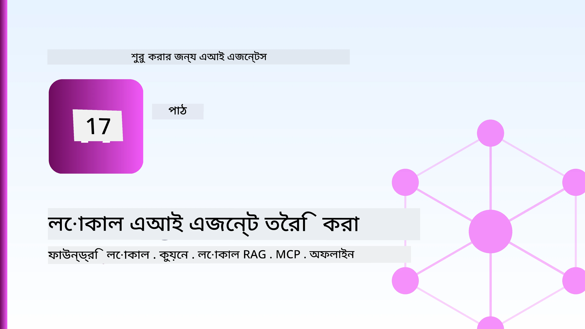
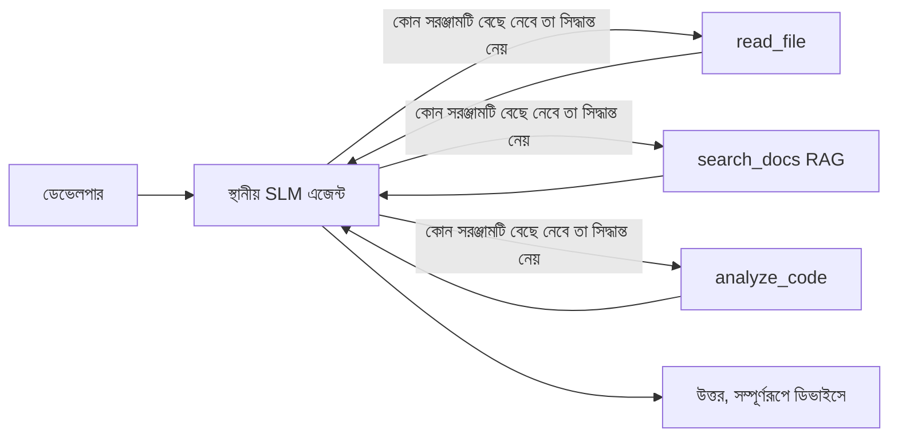
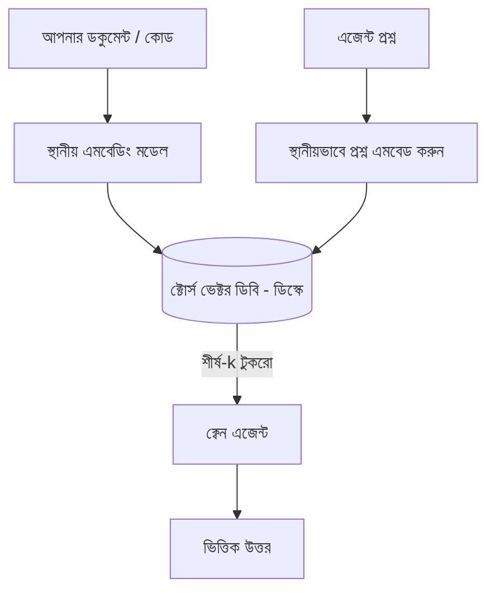
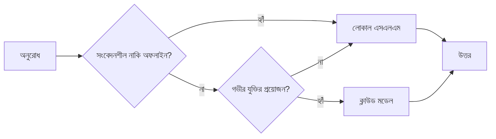

# মাইক্রোসফ্ট ফাউন্ড্রি লোকাল এবং কুইনের সাহায্যে লোকাল এআই এজেন্ট তৈরি করা



আগের পাঠে এজেন্টগুলি *আপ* করে ক্লাউডে নেয়া হয়েছিল। এই পাঠে সেগুলিকে একটি একক মেশিনে *ডাউন* আনা হচ্ছে। শেষ পর্যন্ত আপনার কাছে একটি কাজ করা প্রকৌশল সহকারী থাকবে যা যুক্তি দেয়, টুল কল করে, আপনার ফাইল পড়ে এবং আপনার ডকুমেন্টেশন অনুসন্ধান করে — **একটিও ক্লাউড ইনফারেন্স কল ছাড়াই।**

কেন আপনি এটি চান? প্রকৃত প্রকৌশল কাজের মধ্যে যা নিয়মিত উঠে আসে তার তিনটি কারণ:

- **গোপনীয়তা।** কোড এবং ডকুমেন্ট কখনোই মেশিন থেকে বের হয় না। কোন প্রম্পট, কোন স্নিপেট, কোন গ্রাহকের ডেটা নেটওয়ার্ক সীমানা ছাড়িয়ে যায় না।
- **খরচ।** লোকাল ইনফারেন্সে কোন প্রতি-টোকেন বিল নেই। আপনি দিনের পর দিন বিদ্যুতের খরচে পুনরাবৃত্তি করতে পারেন।
- **অফলাইন।** একটি বিমানে, সুরক্ষিত স্থানে, বা একটি আউটেজের সময়ও এজেন্ট কাজ করে।

ধরে নিন যে আপনি ফরন্টিয়ার ক্লাউড মডেলটি বদলে দিচ্ছেন একটি **ছোট ভাষা মডেল (SLM)** এর জন্য যা আপনার CPU, GPU, অথবা NPU তে চলে। এই পাঠটি সেই সীমানার মধ্যে *ভালো* কাজ করা এজেন্ট তৈরি করার ব্যাপারে, যেন সেই সীমাবদ্ধতা অদৃশ্য থাকে না।

## পরিচিতি

এই পাঠে যা আলোচনা হবে:

- **ছোট ভাষা মডেল (SLMs)** — কী তারা, কোথায় তারা ভালো, এবং কোথায় তারা নয়।
- **মাইক্রোসফ্ট ফাউন্ড্রি লোকাল** — একটি রানটাইম যা ডিভাইসে মডেল ডাউনলোড করে এবং **OpenAI-সঙ্গত এপিআই** মাধ্যমে সার্ভ করে।
- **কুইন ফাংশন-কলে সক্ষম মডেল** — SLM যা নির্ভরযোগ্যভাবে টুল কল উৎপন্ন করে, যা লোকাল *এজেন্ট* (শুধুমাত্র লোকাল চ্যাট নয়) সম্ভব করে।
- **লোকাল টুলস, লোকাল RAG, এবং লোকাল MCP** — এজেন্টকে ক্লাউড ছাড়াই ক্ষমতা প্রদান।
- **হাইব্রিড প্যাটার্ন** — কখন জিনিসগুলো লোকালে রাখতে এবং কখন ক্লাউডের সাহায্য নিতে হবে।

## শেখার লক্ষ্য

এই পাঠ শেষ করার পর আপনি জানতে পারবেন:

- SLMs এর ট্রেড-অফ ব্যাখ্যা করা এবং উপযুক্ত লোকাল-এজেন্ট ব্যবহারের ক্ষেত্র নির্বাচন করা।
- ফাউন্ড্রি লোকালের মাধ্যমে একটি কুইন মডেল লোকালে সার্ভ করা এবং OpenAI-সঙ্গত এন্ডপয়েন্টের মাধ্যমে সংযোগ স্থাপন করা।
- একটি টুল-কলে সক্ষম এজেন্ট তৈরি করা যা সম্পূর্ণরূপে আপনার ওয়ার্কস্টেশনে চলে।
- একটি লোকাল ভেক্টর ডাটাবেস (Chroma) ব্যবহার করে আপনার নিজস্ব ডকুমেন্টে লোকাল RAG যোগ করা।
--Agent কে একটি লোকাল MCP সার্ভারের সাথে সংযুক্ত করা এবং হাইব্রিড লোকাল/ক্লাউড ডিজাইনের বিষয়ে যুক্তি দেওয়া।

## পূর্বশর্ত

এই পাঠ ধরেই নিচ্ছে যে আপনি আগের পাঠগুলি সম্পন্ন করেছেন এবং নীচের বিষয়ে আরামদায়ক:

- [টুল ব্যবহার](../04-tool-use/README.md) (পাঠ ৪) এবং [এজেন্টিক RAG](../05-agentic-rag/README.md) (পাঠ ৫)।
- [এজেন্টিক প্রোটোকল / MCP](../11-agentic-protocols/README.md) (পাঠ ১১)।
- [মাইক্রোসফ্ট এজেন্ট ফ্রেমওয়ার্ক](../14-microsoft-agent-framework/README.md) (পাঠ ১৪)।

আপনাকে আরও প্রয়োজন:

- একটি ডেভেলপার ওয়ার্কস্টেশন। **৮ জিবি র‍্যাম বাস্তবসম্মত ন্যূনতম**; ১৬ জিবি+ আরামদায়ক। একটি GPU বা NPU সাহায্য করে কিন্তু আবশ্যক নয়।
- **মাইক্রোসফ্ট ফাউন্ড্রি লোকাল** ইনস্টল করা (নীচের সেটআপ বিভাগ দেখুন)।
- পাইথন ৩.১২+ এবং রিপোজিটরির প্যাকেজগুলো [`requirements.txt`](../../../requirements.txt), এছাড়া এই পাঠের জন্য `foundry-local-sdk`, `openai`, এবং `chromadb`।

## ছোট ভাষা মডেল: লোকাল কাজের সঠিক টুল

একটি ফরন্টিয়ার ক্লাউড মডেলের শত শত বিলিয়ন প্যারামিটার থাকে এবং এটি একটি ডেটা সেন্টার দ্বারা সাপোর্ট পায়। একটি SLM এর কয়েক বিলিয়ন প্যারামিটার থাকে এবং এটি আপনার ল্যাপটপের RAM এ ফিট করতে হয়। সেই পার্থক্য স্পষ্ট প্রত্যাশা সেট করে।

**SLM গুলো ভালো যা:**

- কাঠামোবদ্ধ, সীমিত কাজ — শ্রেণীবিভাগ, নির্যাস, পরিচিত ডকুমেন্টের সারাংশ।
- **টুল কল করা** — কোন ফাংশন কল করতে হবে এবং কি আর্গুমেন্ট দিতে হবে তা সিদ্ধান্ত নেওয়া।
- দ্রুত, সস্তা, ব্যক্তিগত পুনরাবৃত্তি আপনার নিজস্ব ডাটায়।

**SLMs দুর্বল যা:**

- অজস্র ধাপে যুক্তি তর্ক এবং বড় প্রেক্ষাপটে মুক্ত ফর্মের যুক্তি।
- বিস্তৃত বিশ্বজ্ঞান (তারা কম দেখে এবং বেশি ভুলে যায়)।

তাই লোকাল এজেন্টদের জন্য জয়ী কৌশল হলো: **SLM কে পরিচালনা করতে দিন, এবং টুলস কে ভারি কাজ করতে দিন।** মডেলকে আপনার কোডবেস *জানা* দরকার নেই—শুধুমাত্র জানাতে হবে কখন `read_file` এবং `search_docs` কল করতে হবে। এটি সোজাসুজি একটি SLM এর শক্তির সাথে মেলে।



## মাইক্রোসফ্ট ফাউন্ড্রি লোকাল

**মাইক্রোসফ্ট ফাউন্ড্রি লোকাল** একটি লাইটওয়েট রানটাইম যা মডেলগুলো সম্পূর্ণভাবে আপনার মেশিনে ডাউনলোড, পরিচালনা, এবং সার্ভ করে। আমাদের জন্য এর সবচেয়ে গুরুত্বপূর্ণ বৈশিষ্ট্য হলো এটি একটি **OpenAI-সঙ্গত HTTP এন্ডপয়েন্ট** প্রকাশ করে—যার মানে OpenAI SDK এবং মাইক্রোসফ্ট এজেন্ট ফ্রেমওয়ার্কের OpenAI ক্লায়েন্ট কেবল `base_url` পরিবর্তন করেই এটি ব্যবহার করতে পারে। এজেন্ট তৈরি নিয়ে আপনি যা শিখেছেন তা সরাসরি প্রয়োগ করা যাবে; কেবল এন্ডপয়েন্ট ক্লাউড থেকে `localhost` এ চলে এসেছে।

ফাউন্ড্রি লোকাল স্বয়ংক্রিয়ভাবে আপনার হার্ডওয়্যারের জন্য সেরা বিল্ড নির্বাচন করে — CPU বিল্ড, CUDA/GPU বিল্ড, বা NPU বিল্ড — তাই আপনাকে প্রতিটি মেশিনের জন্য আলাদাভাবে অপ্টিমাইজ করতে হবে না।

### সেটআপ

ফাউন্ড্রি লোকাল ইনস্টল করুন (আপনার অপারেটিং সিস্টেমের জন্য [ডকুমেন্টেশন](https://learn.microsoft.com/azure/ai-foundry/foundry-local/) দেখুন), তারপর নিশ্চিত করুন এটি কাজ করে:

```bash
# ইনস্টল করুন (উদাহরণস্বরূপ; আপনার প্ল্যাটফর্মের জন্য ডকুমেন্টেশন অনুসরণ করুন)
winget install Microsoft.FoundryLocal      # উইন্ডোজ
# brew install microsoft/foundrylocal/foundrylocal   # ম্যাকওএস

# একটি Qwen মডেল ডাউনলোড এবং চালান, তারপর লোকাল সার্ভিস শুরু করুন
foundry model run qwen2.5-7b-instruct
foundry service status
```

সার্ভিস চালু থাকলে আপনার একটি লোকাল, OpenAI-সঙ্গত এন্ডপয়েন্ট থাকে (সাধারণত `http://localhost:PORT/v1`)। নোটবুক `foundry-local-sdk` ব্যবহার করে এন্ডপয়েন্ট স্বয়ংক্রিয়ভাবে খুঁজে পায়, তাই আপনাকে পোর্ট হার্ড-কোড করতে হবে না।

## কুইন ফাংশন কলিং: কেন এটা গুরুত্বপূর্ণ

একটি এজেন্ট তখনই এজেন্ট যদি তা টুল কল করতে পারে। অনেক SLM চ্যাট করতে পারে কিন্তু অননুমোদিত, ভুল ফর্ম্যাটের টুল কল তৈরি করে। **কুইন** মডেলগুলি ফাংশন কল করার জন্য প্রশিক্ষিত এবং ধারাবাহিকভাবে সঠিক টুল-কল স্ট্রাকচার তৈরি করে — যা একটি লোকাল চ্যাট মডেলকে একটি লোকাল *এজেন্ট* এ পরিণত করে।

প্রবাহটি সেই স্ট্যান্ডার্ড টুল-কল লুপ যা আপনি ইতিমধ্যে জানেন, শুধু ডিভাইসে চলছে:


## লোকাল RAG

ডকুমেন্টেশন অনুসন্ধান হলো যেখানে লোকাল এজেন্টরা তাদের কাজ প্রমাণ করে। SLM আপনার ফ্রেমওয়ার্কের ডকুমেন্টেশন মনে রাখুক এর পরিবর্তে, আপনি সেগুলোকে একটি **লোকাল ভেক্টর ডাটাবেসে** এম্বেড করুন এবং এজেন্টকে দরকারি অংশগুলি আনার সুযোগ দিন।

আমরা **Chroma** ব্যবহার করি, একটি এম্বেড করা ভেক্টর স্টোর যা ইন-প্রসেস চলে এবং সার্ভার পরিচালনা করতে হয় না। পুরো পাইপলাইন সম্পূর্ণরূপে লোকাল: লোকাল এম্বেডিং মডেল → লোকাল ভেক্টর → লোকাল রিট্রিভাল → লোকাল SLM।



এটি পাঠ ৫-র Agentic RAG প্যাটার্নের মতই — পার্থক্য শুধুমাত্র প্রতিটি উপাদান এখন আপনার মেশিনে চলছে।

## লোকাল MCP সার্ভার

[MCP](../11-agentic-protocols/README.md) একটি ট্রান্সপোর্ট, ক্লাউড সেবা নয়। একটি MCP সার্ভার স্থানীয় প্রক্রিয়া হিসেবে `stdio` তে চলতে পারে, এজেন্টকে টুলস এক্সপোজ করে স্ট্যান্ডার্ড প্রোটোকলের মাধ্যমে। এভাবে আপনি MCP সার্ভারের বর্ধিত ইকোসিস্টেম পুনর্ব্যবহার করতে পারেন — ফাইল সিস্টেম অ্যাক্সেস, গিট অপারেশন, ডাটাবেস কুয়েরি — সম্পূর্ণরূপে অফলাইন।

নিরাপত্তার দৃষ্টিভঙ্গি ক্লাউডের থেকে আলাদা কিন্তু অনুপস্থিত নয়: একটি লোকাল MCP সার্ভার আপনাদের ব্যবহারকারীর অনুমতি নিয়ে চলে, তাই সেটি কী অ্যাক্সেস করবে (যেমন একটি প্রকল্প ডিরেক্টরি, সম্পূর্ণ হোম ফোল্ডার নয়) তা সীমাবদ্ধ করুন এবং এর আউটপুটকে ইনপুট হিসেবে যাচাই করুন।

## হাইব্রিড ক্লাউড-এবং-লোকাল প্যাটার্ন

লোকাল-প্রথম মানে শুধুমাত্র লোকাল নয়। পরিণত সিস্টেমগুলি সংবেদনশীলতা এবং জটিলতা অনুযায়ী রুট করে:

| পরিস্থিতি | কোথায় চলে |
| --- | --- |
| সংবেদনশীল কোড/ডাটা, অথবা অফলাইন | **লোকাল SLM** |
| সহজ, সীমিত কাজ | **লোকাল SLM** (সস্তা, দ্রুত) |
| কঠিন বহু-ধাপ যুক্তি অ-সংবেদনশীল ডাটায় | **ক্লাউড মডেল** |
| সব কিছু, আউটেজের সময় | **লোকাল SLM** (সৌম্য হ্রাস) |

এটি পাঠ ১৬-এর **মডেল রাউটিং** ধারাবাহিকতার মতো — শুধু এখানে "মডেলগুলোর" একটি আপনার নিজস্ব মেশিন। একটি মজবুত ডিজাইন ক্লাউড যখন অনুপলব্ধ তখন লোকালে ফিরে আসে, যাতে এজেন্ট গুণগত দিক থেকে একটু হ্রাস পায় কিন্তু সম্পূর্ণ ব্যর্থ হয় না।



## হ্যান্ডস-অন ল্যাব: একটি লোকাল ইঞ্জিনিয়ারিং সহকারী

খুলুন [`code_samples/17-local-agent-foundry-local.ipynb`](./code_samples/17-local-agent-foundry-local.ipynb) এবং ধাপে ধাপে এগিয়ে যান। আপনি তৈরি করবেন একটি **লোকাল ইঞ্জিনিয়ারিং সহকারী** যা পুরোপুরি আপনার ওয়ার্কস্টেশনে চলে এবং করতে পারে:

1. **টুল কল করা** — ফাউন্ড্রি লোকালের মাধ্যমে কুইন ফাংশন কলিং ব্যবহার করা।
2. **লোকাল ফাইল অপারেশন করা** — একটি প্রকল্প ডিরেক্টরির ফাইল তালিকা দেখানো ও পড়া।
3. **কোড বিশ্লেষণ করা** — একটি সোর্স ফাইলের মৌলিক পরিমাপ রিপোর্ট করা।
4. **ডকুমেন্টেশন অনুসন্ধান করা** — Chroma ব্যবহার করে একটি ডকস ফোল্ডারে লোকাল RAG।
5. **MCP ব্যবহার করা** — একটি লোকাল MCP সার্ভারের সাথে সংযোগ স্থাপন (যদি কনফিগার করা না থাকে তাহলে গ্রেসফুল স্কিপ)।

কোনো ক্লাউড ইনফারেন্স ব্যবহার করা হয় না।

### ওয়াকথ্রু

সহকারী OpenAI-সঙ্গত এন্ডপয়েন্টের মাধ্যমে ফাউন্ড্রি লোকালের সাথে সংযুক্ত হয়, তাই এজেন্ট কোড ক্লাউড পাঠের মতোই দেখায় — শুধু ক্লায়েন্ট পরিবর্তিত:

```python
from foundry_local import FoundryLocalManager
from openai import OpenAI

# Foundry Local মডেলটি আবিষ্কার করে/ডাউনলোড করে এবং আমাদের একটি লোকাল এন্ডপয়েন্ট দেয়।
manager = FoundryLocalManager(\"qwen2.5-7b-instruct\")
client = OpenAI(base_url=manager.endpoint, api_key=manager.api_key)  # api_key একটি লোকাল প্লেসবহোল্ডার।
```

টুলগুলি স্বাভাবিক পাইথন ফাংশন যা একটি প্রকল্প ডিরেক্টরির মধ্যে সীমাবদ্ধ:

```python
def read_file(path: str) -> str:
    \"\"\"Read a file, but only inside the sandboxed project directory.\"\"\"
    full = (PROJECT_ROOT / path).resolve()
    if PROJECT_ROOT not in full.parents and full != PROJECT_ROOT:
        return \"Access denied: path is outside the project directory.\"
    return full.read_text(encoding=\"utf-8\")
```

স্যান্ডবক্স চেক লক্ষ্য করুন — এমনকি লোকালেও, একটি টুল যা অনির্দিষ্ট পাথ পড়ে তা ঝুঁকিপূর্ণ। নোটবুক প্রতিটি টুলকে একটি প্রকল্প রুটে সীমাবদ্ধ রাখে।

## জ্ঞান যাচাই

অ্যাসাইনমেন্ট শুরু করার আগে আপনার বোধগম্যতা পরীক্ষা করুন।

**১। একটি এজেন্টকে লোকালে চালানোর দুইটি সুনির্দিষ্ট কারণ দিন, ক্লাউডের বদলে।**

<details>
<summary>উত্তর</summary>

যেকোন দুইটি: **গোপনীয়তা** (কোড ও ডেটা মেশিন থেকে বের হয় না), **খরচ** (প্রতি-টোকেন ইনফারেন্স বিল নেই), এবং **অফলাইন সক্ষমতা** (নেটওয়ার্ক ছাড়াই কাজ করে — একটি বিমানে, সুরক্ষিত জায়গায়, বা আউটেজের সময়)। ডেটা ডিভাইস থেকে পাঠানো নিষিদ্ধ এমন বিধিমালা/কমপ্লায়েন্স গোপনীয়তার প্রধান চালিকা শক্তি।
</details>

**২। একটি লোকাল এজেন্টে SLM এবং টুলদের মধ্যে শ্রম বিভাজন কী থাকা উচিত এবং কেন?**

<details>
<summary>উত্তর</summary>

SLM কে **পরিচালনা করতে দিন** (কোন টুল কল করতে হবে এবং কী আর্গুমেন্ট দিতে হবে সিদ্ধান্ত নেয়), এবং **টুলগুলিকে ভারি কাজ করতে দিন** (ফাইল পড়া, ডকস আনয়ন, ফলাফল গণনা)। SLM গুলো সীমিত সিদ্ধান্ত যেমন টুল নির্বাচন শক্তিশালী হলেও বিস্তৃত জ্ঞান এবং দীর্ঘ বহু-ধাপ যুক্তিতে দুর্বল, তাই টুলে নির্ভর করা তাদের শক্তি বাড়ায়।
</details>

**৩। ফাউন্ড্রি লোকালের মাধ্যমে ক্লাউড এজেন্ট কোড পুনর্ব্যবহার সম্ভব করার কারণ কী?**

<details>
<summary>উত্তর</summary>

ফাউন্ড্রি লোকাল একটি **OpenAI-সঙ্গত HTTP এন্ডপয়েন্ট** প্রকাশ করে। OpenAI SDK এবং এজেন্ট ফ্রেমওয়ার্কের OpenAI ক্লায়েন্ট কেবল `base_url` হারিয়ে (এবং একটি লোকাল প্লেসহোল্ডার API কী ব্যবহার করে) এটি ব্যবহার করে। বাকিটা এজেন্ট কোড ঠিক একই থাকে।
</details>

**৪। আমরা কেন বিশেষভাবে একটি কুইন ফাংশন-কলিং মডেল ব্যবহার করি, যে কোন SLM নয়?**

<details>
<summary>উত্তর</summary>

কারণ একটি এজেন্টকে নির্ভরযোগ্য, সঠিক গঠিত **টুল কল** তৈরি করতে হবে। অনেক SLM চ্যাট করতে পারে কিন্তু ত্রুটিপূর্ণ বা অসঙ্গত টুল-কলের স্ট্রাকচার তৈরি করে। কুইন মডেল ফাংশন কলিংয়ে প্রশিক্ষিত এবং ধারাবাহিক টুল কল তৈরি করে, যা একটি লোকাল চ্যাট মডেলকে কার্যকর লোকাল এজেন্টে রূপান্তর করে।
</details>

**৫। লোকাল RAG পাইপলাইনে কোন কোন উপাদান মেশিনে চলে?**

<details>
<summary>উত্তর</summary>

সবকিছু: এম্বেডিং মডেল, ভেক্টর ডাটাবেস (Chroma, ডিস্কে), রিট্রিভাল ধাপ, এবং SLM। ডকুমেন্ট গুলো লোকালেই এম্বেড, সংরক্ষিত, পুনরুদ্ধার এবং স্থানীয় মডেল দ্বারা বিশ্লেষণ করা হয়—কোন অংশ ক্লাউডে যায় না।
</details>

**৬। একটি লোকাল MCP সার্ভার আপনার মেশিনে চলে। এটির ফলে কি এটি স্বয়ংক্রিয়ভাবে নিরাপদ হয়? এখনো কী সাবধানতা নেয়া উচিত?**

<details>
<summary>উত্তর</summary>

না। একটি লোকাল MCP সার্ভার আপনার ব্যবহারকারীর অনুমতিতে চলে, তাই এটি আপনার সক্ষমতার সবকিছু স্পর্শ করতে পারে। এটি আপনি যা চান তার মধ্যে সীমাবদ্ধ করুন (যেমন একটি প্রকল্প ডিরেক্টরি, সম্পূর্ণ হোম ফোল্ডার নয়) এবং এর আউটপুটকে ইনপুট হিসেবে যাচাই করুন ব্যবহার করার আগে।
</details>

**৭। এমন একটি যুক্তিসঙ্গত হাইব্রিড রাউটিং বিধি বর্ণনা করুন যেখানে একটি লোকাল মডেল অন্তর্ভুক্ত থাকে।**

<details>
<summary>উত্তর</summary>

সংবেদনশীল বা অফলাইন অনুরোধ লোকাল SLM-এ পাঠান; সহজ সীমাবদ্ধ কাজ গুলিকে দ্রুততা এবং সাশ্রয়ের জন্য লোকাল SLM-এ পাঠান; কঠিন বহু-ধাপ যুক্তি অ-সংবেদনশীল ডাটায় ক্লাউড মডেলে পাঠান; এবং ক্লাউড অনুপলব্ধ হলে লোকাল SLM-এ ফিরে আসুন যাতে এজেন্ট সুশৃঙ্খলভাবে অবনমন হয় ব্যর্থ হয় না। এটি মডেল রাউটিং (পাঠ ১৬) যেখানে লোকাল মেশিন একটি মডেল।
</details>

**৮। এই পাঠে লোকাল এজেন্ট চালানোর জন্য বাস্তবসম্মত ন্যূনতম র‍্যাম কী, এবং বেশি র‍্যাম কিসের জন্য সাহায্য করে?**

<details>
<summary>উত্তর</summary>

প্রায় **৮ জিবি** একটি বাস্তবসম্মত ন্যূনতম; ১৬ জিবি+ আরামদায়ক। বেশি র‍্যাম আপনাকে বড়, বেশি ক্ষমতাসম্পন্ন মডেল চালাতে এবং বেশি প্রসঙ্গ স্মৃতিতে রাখতে সাহায্য করে। একটি GPU বা NPU ইনফারেন্স গতি বাড়ায় কিন্তু আবশ্যক নয় — ফাউন্ড্রি লোকাল যখন কোন অ্যাকসেলERATOR পাওয়া যায় না তখন CPU বিল্ড নির্বাচন করে।
</details>

## অ্যাসাইনমেন্ট

লোকাল ইঞ্জিনিয়ারিং সহকারীকে একটি **লোকাল ডকুমেন্টেশন রিভিউয়ার** এ প্রসারিত করুন আপনার পছন্দের একটি ছোট প্রকল্পের জন্য (আপনি চাইলে এই রিপোর পাঠ ফোল্ডারগুলোর কোনো একটি ব্যবহার করতে পারেন)।

আপনার জমা দেওয়ার মধ্যে থাকা উচিত:

১. একটি সত্যিকার ডকস/কোড ফোল্ডারকে Chroma তে ইনডেক্স করা (কমপক্ষে পাঁচটি ফাইল)।
২. একটি `find_todos` টুল যোগ করা যা প্রকল্পের `TODO`/`FIXME` মন্তব্যগুলো স্ক্যান করে এবং ফাইল ও লাইনের নম্বর সহ ফিরিয়ে দেয় — একই স্যান্ডবক্স চেক রেখে যেমন `read_file` এ আছে।

3. **এজেন্টকে তিনটি প্রশ্ন করা যা তাকে টুলগুলো একত্রিত করতে বাধ্য করে:** একটি খাঁটি RAG প্রশ্ন, একটি নির্দিষ্ট ফাইল পড়া প্রয়োজন এমন প্রশ্ন, এবং একটি TODO খুঁজে বের করার প্রশ্ন।
4. **মাপুন:** তিনটির প্রতিটি উত্তরের সময় পরিমাপ করুন এবং একটি মার্কডাউন সেলে নোট করুন। মন্তব্য করুন যে আপনার কাঙ্ক্ষিত ওয়ার্কফ্লোর জন্য লেটেন্সি গ্রহণযোগ্য কিনা।

তারপর একটি ছোট প্যারাগ্রাফ লিখুন যে **এই রিভিউয়ারের জন্য আপনি কী ক্লাউডে স্থানান্তর করবেন এবং কী লোকালেই রাখবেন**, এবং কেন। আপনার মূল্যায়ন হবে লোকাল উপাদানগুলো সঠিকভাবে যুক্ত হয়েছে কিনা এবং আপনার হাইব্রিড যুক্তি সঠিক কিনা — মডেল কোয়ালিটির উপর নয়।

## সারাংশ

এই পাঠে আপনি একটি এজেন্ট তৈরি করেছেন যা সম্পূর্ণভাবে আপনার নিজের মেশিনে চলে:

- **SLM গুলো** প্রাইভেসি, খরচ, এবং অফলাইন অপারেশনের জন্য ব্যাপ্তি কমিয়ে দেয় — এবং তারা **টুলগুলোকে অর্কেস্ট্রেট** করলে আলোকিত হয়, নিজেরাই সমস্ত জ্ঞান বহন করার চেয়ে।
- **Foundry Local** একটি **OpenAI-সঙ্গত এন্ডপয়েন্ট** এর পিছনে ডিভাইসে মডেল পরিবেশন করে, তাই আপনার ক্লাউড এজেন্ট কোড এক লাইন পরিবর্তন করে স্থানান্তরিত হয়।
- **Qwen ফাংশন-কলে সক্ষম মডেলগুলো** নির্ভরযোগ্য লোকাল টুল কলিং করে সম্ভব করে তোলে — এবং তাই লোকাল *এজেন্ট* গুলো।
- **লোকাল RAG** (Chroma) এবং **লোকাল MCP** এজেন্টকে মেশিন ছাড়া ক্ষমতা দেয় না।
- **হাইব্রিড প্যাটার্নগুলো** সংবেদনশীলতা এবং জটিলতার মাধ্যমে দিকনির্দেশনা দেয়, যেখানে লোকাল একটি অনুকূল ব্যাকআপ হিসেবে কাজ করে।

এটি পূরণ করে ডিপ্লয়মেন্ট আবর্তন: পাঠ ১৬ স্কেলেবল এজেন্টগুলোকে Microsoft Foundry তে নিয়ে গেছে, এবং এই পাঠটি সেগুলোকে একক ওয়ার্কস্টেশন এ স্কেল ডাউন করেছে। পরের পাঠটি কেন্দ্রীভূত ডিপ্লয়েড এজেন্ট গুলোকে সুরক্ষিত রাখার বিষয়ে।

## অতিরিক্ত সম্পদ

- <a href="https://learn.microsoft.com/azure/ai-foundry/foundry-local/" target="_blank">Microsoft Foundry Local ডকুমেন্টেশন</a>
- <a href="https://learn.microsoft.com/azure/ai-foundry/what-is-azure-ai-foundry" target="_blank">Microsoft Foundry ডকুমেন্টেশন</a>
- <a href="https://learn.microsoft.com/en-us/agent-framework/overview/?wt.mc_id=youtube_26688_organicsocial_reactor&pivots=programming-language-python" target="_blank">Microsoft Agent Framework</a>
- <a href="https://qwen.readthedocs.io/en/latest/framework/function_call.html" target="_blank">Qwen ফাংশন কলিং ডকুমেন্টেশন</a>
- <a href="https://modelcontextprotocol.io/" target="_blank">মডেল কনটেক্সট প্রোটোকল (MCP)</a>
- <a href="https://docs.trychroma.com/" target="_blank">Chroma ভেক্টর ডাটাবেস</a>

## পূর্ববর্তী পাঠ

[Deploying Scalable Agents](../16-deploying-scalable-agents/README.md)

## পরবর্তী পাঠ

[Securing AI Agents](../18-securing-ai-agents/README.md)

---

<!-- CO-OP TRANSLATOR DISCLAIMER START -->
**অস্বীকৃতি**:
এই নথিটি AI অনুবাদ পরিষেবা [Co-op Translator](https://github.com/Azure/co-op-translator) ব্যবহার করে অনূদিত হয়েছে। যদিও আমরা শুদ্ধতার জন্য চেষ্টা করি, অনুগ্রহ করে মনে রাখবেন যে স্বয়ংক্রিয় অনুবাদে ত্রুটি বা অসঙ্গতি থাকতে পারে। মূল নথিটি তার স্বভাষায় কর্তৃত্বপূর্ণ উৎস হিসেবে বিবেচিত হওয়া উচিত। গুরুত্বপূর্ণ তথ্যের জন্য পেশাদার মানব অনুবাদ সুপারিশ করা হয়। এই অনুবাদের ব্যবহারে প্রয়োজনীয় ভুল বোঝাবুঝি বা ভুল ব্যাখ্যার জন্য আমরা দায়বদ্ধ নই।
<!-- CO-OP TRANSLATOR DISCLAIMER END -->