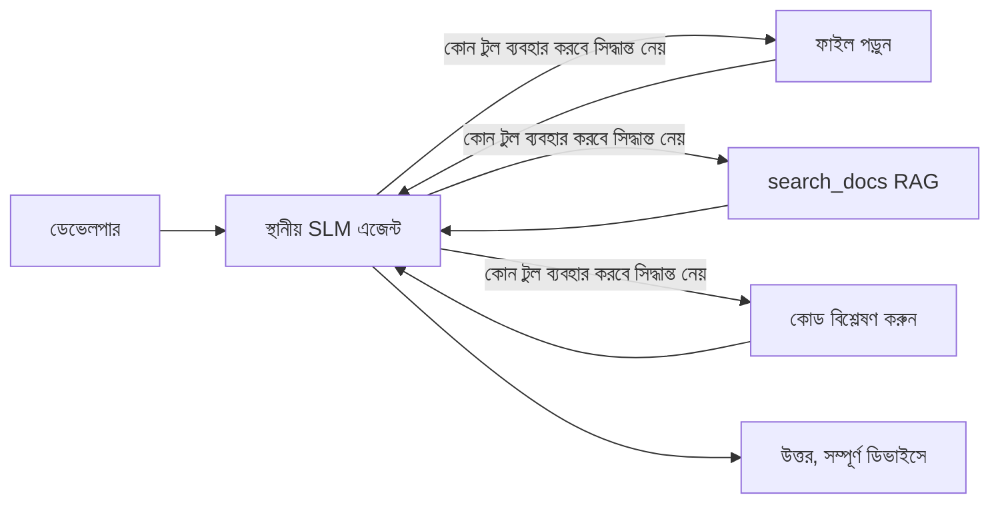
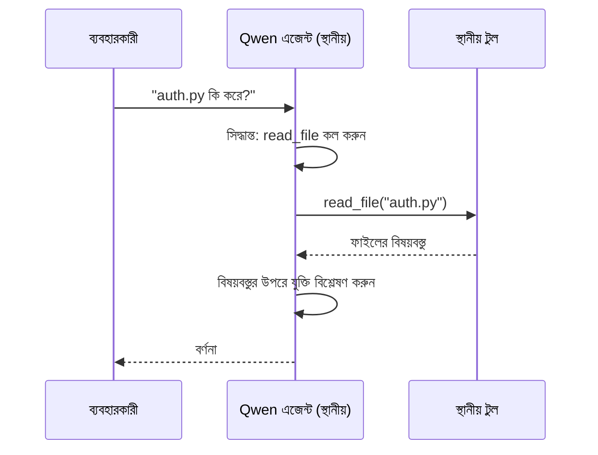
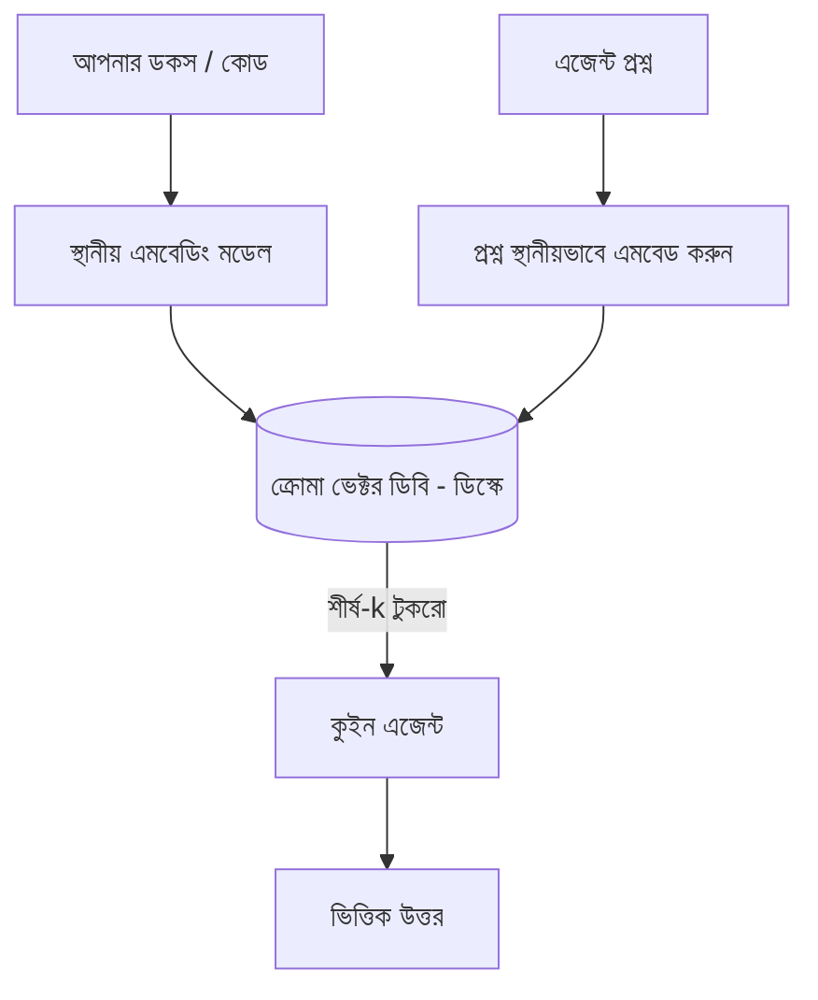
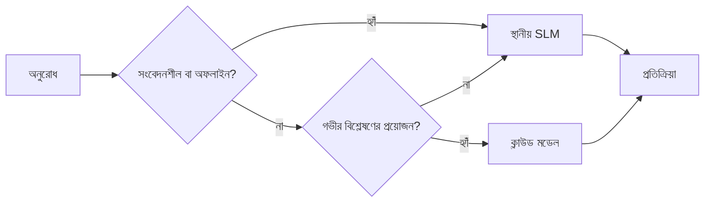

# Microsoft Foundry Local এবং Qwen ব্যবহার করে লোকাল AI এজেন্ট তৈরি


আগের পাঠে এজেন্টগুলো *ক্লাউডে* স্কেল করা হয়েছিল। এই পাঠে সেগুলোকে *একক যন্ত্রে* আনা হবে। শেষে আপনার কাছে এমন একটি প্রকৌশল সহকারী থাকবে যা যুক্তি করে, টুলস কল করে, আপনার ফাইল পড়ে এবং ডকুমেন্টেশন অনুসন্ধান করে — **একটিও ক্লাউড ইনফারেন্স কল ছাড়াই।**

আপনি কেন এটা চান? প্রকৌশল কাজের মধ্যে নিয়মিত তিনটি কারণ আসে:

- **গোপনীয়তা।** কোড এবং ডকুমেন্টগুলি কখনও মেশিন ছাড়ায় না। কোনো প্রম্পট, স্নিপেট, বা গ্রাহক ডেটা নেটওয়ার্ক সীমা অতিক্রম করে না।
- **খরচ।** লোকাল ইনফারেন্সে প্রতি-টোকেন বিল নেই। আপনি সারাদিন iter করতে পারেন বিদ্যুতের খরচ দিয়ে।
- **অফলাইন।** একটি প্লেনে, সুরক্ষিত সুবিধায়, বা আউটেজের সময়ে এজেন্ট এখনও কাজ করে।

তবে আপনি একটি frontier cloud মডেলকে tradeoff করছেন একটি **Small Language Model (SLM)** এর জন্য যা আপনার CPU, GPU, অথবা NPU তে চলে। এই পাঠে এমন এজেন্টগুলি তৈরি করা শিখবেন যা সেই সীমার মধ্যে *ভালো* পারফর্ম করে, বরং মনে করেন যে সীমাটি নেই।

## পরিচিতি

এই পাঠে আপনি শিখবেন:

- **Small Language Models (SLMs)** — কী, কোথায় ভাল, এবং কোথায় না।
- **Microsoft Foundry Local** — একটি runtime যা ডিভাইসে মডেলগুলি ডাউনলোড ও পরিবেশন করে, **OpenAI-সঙ্গত API** এর মাধ্যমে।
- **Qwen function-calling models** — SLM যা নির্ভরযোগ্যভাবে টুল কল তৈরি করে, যা পার্থক্য তৈরি করে লোকাল *এজেন্ট* (শুধু লোকাল চ্যাট নয়)।
- **লোকাল টুলস, লোকাল RAG এবং লোকাল MCP** — ক্লাউড ছাড়া এজেন্টের ক্ষমতা দেয়।
- **হাইব্রিড প্যাটার্ন** — কখন লোকাল রাখবেন এবং কখন ক্লাউড ব্যবহার করবেন।

## শেখার লক্ষ্য

এই পাঠ শেষ করার পরে, আপনি পারবেন:

- SLM-এর ট্রেড-অফ ব্যাখ্যা করা এবং সঠিক লোকাল এজেন্ট ব্যবহার নির্বাচন করা।
- Foundry Local ব্যবহার করে Qwen মডেল লোকালি সার্ভ করা এবং OpenAI-সঙ্গত endpoint এর সাথে সংযোগ করা।
- সম্পূর্ণরূপে আপনার ওয়ার্কস্টেশনে চলমান একটি টুল-কলিং এজেন্ট তৈরি করা।
- লোকাল ভেক্টর ডাটাবেস (Chroma) ব্যবহার করে আপনার নিজস্ব ডকুমেন্টে লোকাল RAG যোগ করা।
- একটি লোকাল MCP সার্ভারের সাথে এজেন্ট সংযোগ এবং হাইব্রিড লোকাল/ক্লাউড ডিজাইন নিয়ে যুক্তি করা।

## পূর্বপ্রয়োজনীয়তা

এই পাঠটি ধরে নেয় আপনি পূর্ববর্তী পাঠসমূহ সম্পন্ন করেছেন এবং পরিচিত:

- [Tool Use](../04-tool-use/README.md) (Lesson 4) এবং [Agentic RAG](../05-agentic-rag/README.md) (Lesson 5)।
- [Agentic Protocols / MCP](../11-agentic-protocols/README.md) (Lesson 11)।
- [Microsoft Agent Framework](../14-microsoft-agent-framework/README.md) (Lesson 14)।

এছাড়াও প্রয়োজন:

- একটি ডেভেলপার ওয়ার্কস্টেশন। **8 GB RAM হলো বাস্তবসম্মত সর্বনিম্ন**; 16 GB+ আরামদায়ক। GPU বা NPU সহায়ক তবে আবশ্যক নয়।
- **Microsoft Foundry Local** ইনস্টল করা (নিচের সেটআপ দেখুন)।
- Python 3.12+ এবং রিপোজিটরির [`requirements.txt`](../../../requirements.txt)-এ প্যাকেজ, সঙ্গে `foundry-local-sdk`, `openai`, এবং `chromadb` এই পাঠের জন্য।

## ছোট ল্যাঙ্গুয়েজ মডেল: লোকাল কাজের জন্য সঠিক টুল

একটি frontier ক্লাউড মডেল এর শত কোটি পরামিতি এবং একটি ডেটা সেন্টার থাকে। একটি SLM এর কয়েকশ কোটি পরামিতি থাকে এবং এটি আপনার ল্যাপটপের RAM-এ ঢোকে। সেই পার্থক্য স্পষ্ট প্রত্যাশা তৈরি করে।

**SLM ভালো:**

- গঠনমূলক, সীমানাবদ্ধ কাজ — শ্রেণীবিভাগ, নিষ্কাশন, পরিচিত ডকুমেন্টের সারাংশ।
- **টুল কলিং** — কোন ফাংশন কল করতে হবে এবং কী আর্গুমেন্ট সহ তা নির্ধারণ।
- দ্রুত, সস্তা, ব্যক্তিগত তথ্যের উপর বারংবার পরীক্ষণ।

**SLM দুর্বল:**

- ওপেন-এন্ডেড, বহু-হপ যুক্তি বড় প্রসঙ্গের মধ্যে।
- বিস্তৃত বিশ্ব জ্ঞান (তাদের কম দেখা হয়েছে, এবং তারা বেশি ভুলে যায়)।

তাই স্থানীয় এজেন্টদের জন্য বিজয়ী কৌশল হল: **SLM অর্সেস্ট্রেট করবে, আর টুলস ভারী কাজ করবে।** মডেলকে আপনার কোডবেস *জানা* দরকার নেই—তাকে জানতে হবে কখন `read_file` এবং `search_docs` কল করতে হয়। এটাই SLM-এর শক্তির সাথে খাপ খায়।



## Microsoft Foundry Local

**Microsoft Foundry Local** একটি হালকা-ওজনের runtime যা সম্পূর্ণরূপে আপনার মেশিনে মডেল ডাউনলোড, ম্যানেজ এবং সার্ভ করে। আমাদের জন্য এর সবচেয়ে গুরুত্বপূর্ণ বৈশিষ্ট্য হল এটি একটি **OpenAI-সঙ্গত HTTP endpoint** এক্সপোজ করে — অর্থাৎ OpenAI SDK এবং Microsoft Agent Framework এর OpenAI ক্লায়েন্ট শুধু `base_url` পরিবর্তন করে এটি ব্যবহার করতে পারে। এজেন্ট তৈরির সবকিছু একই রূপে থাকে; শুধু endpoint ক্লাউড থেকে `localhost` এ চলে আসে।

Foundry Local স্বয়ংক্রিয়ভাবে আপনার হার্ডওয়্যারের জন্য সেরা মডেল বিল্ড বেছে নেয় — CPU বিল্ড, CUDA/GPU বিল্ড, অথবা NPU বিল্ড — যাতে আপনি প্রতি মেশিনে হ্যান্ড-অপটিমাইজ করতে না হয়।

### সেটআপ

Foundry Local ইনস্টল করুন (আপনার OS এর জন্য [ডকুমেন্টেশন](https://learn.microsoft.com/azure/ai-foundry/foundry-local/) দেখুন), তারপর নিশ্চিত করুন এটি কাজ করছে:

```bash
# ইনস্টল করুন (উদাহরণস্বরূপ; আপনার প্ল্যাটফর্মের জন্য ডকুমেন্টেশন অনুসরণ করুন)
winget install Microsoft.FoundryLocal      # উইন্ডোজ
# brew install microsoft/foundrylocal/foundrylocal   # ম্যাকওএস

# একটি Qwen মডেল ডাউনলোড করুন এবং চালান, তারপর লোকাল সার্ভিস শুরু করুন
foundry model run qwen2.5-7b-instruct
foundry service status
```

সার্ভিস চালু হলে আপনার একটি লোকাল OpenAI-সঙ্গত endpoint থাকে (সাধারণত `http://localhost:PORT/v1`)। নোটবুকটি স্বয়ংক্রিয়ভাবে `foundry-local-sdk` ব্যবহার করে endpoint আবিষ্কার করে, তাই আপনাকে পোর্ট হার্ডকোড করতে হবে না।

## Qwen Function Calling: কেন গুরুত্বপূর্ণ

একটি এজেন্ট শুধু এজেন্ট যখন সেটি টুলস কল করতে পারে। অনেক SLM চ্যাট করতে পারে, কিন্তু অবিশ্বস্ত, ভুলগঠিত টুল কল তৈরি করে। **Qwen** মডেলগুলি function calling এর জন্য প্রশিক্ষিত এবং ধারাবাহিকভাবে সঠিক টুল কল গঠন তৈরি করে — যা একটি লোকাল চ্যাট মডেলকে একটি লোকাল *এজেন্ট* করে তোলে।

ফ্লো হল পরিচিত টুল কলিং লুপ, শুধু যেটা ডিভাইসে চলে:



## লোকাল RAG

ডকুমেন্টেশন অনুসন্ধান হলো সেই জায়গা যেখানে লোকাল এজেন্টরা তাদের মূল্য দেয়। SLM আপনার ফ্রেমওয়ার্কের ডক কি মনে করবে এ আশা করার পরিবর্তে, আপনি সেই ডকগুলো একটি **লোকাল ভেক্টর ডাটাবেসে** এম্বেড করেন এবং এজেন্ট প্রাসঙ্গিক অংশগুলো প্রয়োজন মতো আনে।

আমরা ব্যবহার করি **Chroma**, একটি এম্বেডেড ভেক্টর স্টোর যা প্রসেসের মধ্যে চলে, সার্ভার ব্যবস্থাপনা ছাড়া। পুরো পাইপলাইন লোকাল: লোকাল এম্বেডিং মডেল → লোকাল ভেক্টর → লোকাল রিট্রিভাল → লোকাল SLM।



এটি Lesson 5 এর Agentic RAG প্যাটার্নের মতোই — পার্থক্য শুধু যে প্রতিটি উপাদান আপনার মেশিনে চলে।

## লোকাল MCP সার্ভার

[MCP](../11-agentic-protocols/README.md) একটি পরিবহন, ক্লাউড সার্ভিস নয়। MCP সার্ভার একটি লোকাল প্রসেস হিসেবে `stdio` তে চলতে পারে, স্ট্যান্ডার্ড প্রোটোকলের মাধ্যমে টুলস আপনার এজেন্টের সামনে তুলে ধরে। এতে আপনি MCP সার্ভারের বাড়তে থাকা ইকোসিস্টেম পুনর্ব্যবহার করতে পারেন — ফাইলসিস্টেম অ্যাক্সেস, গিট অপারেশন, ডাটাবেস কোয়েরি — সম্পূর্ণরূপে অফলাইন।

নিরাপত্তার অবস্থা ক্লাউড থেকে ভিন্ন, তবে বিদ্যমান: একটি লোকাল MCP সার্ভার এখনও আপনার ব্যবহারকারীর অনুমতির সাথে চলে, তাই এটি কী কিছু অ্যাক্সেস করে তা সীমাবদ্ধ করুন (একটি প্রকল্প ডিরেক্টরি, পুরো হোম ফোল্ডার নয়) এবং এর আউটপুট যাচাই করে ইনপুট হিসেবে বিবেচনা করুন।

## হাইব্রিড ক্লাউড-অ্যান্ড-লোকাল প্যাটার্ন

লোকাল-ফার্স্ট মানে শুধুই লোকাল নয়। পরিণত সিস্টেমগুলো সংবেদনশীলতা ও কঠিনতার ওপর ভিত্তি করে রুট করে:

| পরিস্থিতি | কোথায় চলে |
| --- | --- |
| সংবেদনশীল কোড/ডেটা, অথবা অফলাইন | **লোকাল SLM** |
| সহজ, সীমানাবদ্ধ কাজ | **লোকাল SLM** (সস্তা, দ্রুত) |
| কঠিন বহু-হপ যুক্তি অ-সংবেদনশীল ডেটার ওপর | **ক্লাউড মডেল** |
| সবকিছু, আউটেজের সময় | **লোকাল SLM** (অনুকূল ক্রমহ্রাস) |

এটি Lesson 16 থেকে **মডেল রাউটিং** ধারনার মতো — পার্থক্য শুধু এক "মডেল" এখন আপনার নিজস্ব মেশিন। একটি মজবুত ডিজাইন ক্লাউড না থাকলে লোকালে ফিরে যায়, তাই এজেন্ট প্রত্যক্ষ ব্যর্থতার পরিবর্তে মানগত অবনতিতে পড়ে।



## হাতে কলমে ল্যাব: একটি লোকাল ইঞ্জিনিয়ারিং সহকারী

খোলুন [`code_samples/17-local-agent-foundry-local.ipynb`](./code_samples/17-local-agent-foundry-local.ipynb) এবং এটি অনুসরণ করুন। আপনি একটি **লোকাল ইঞ্জিনিয়ারিং সহকারী** তৈরি করবেন যা সম্পূর্ণরূপে আপনার ওয়ার্কস্টেশনে চলে এবং করতে পারে:

1. **টুল কল করা** — Foundry Local এর মাধ্যমে Qwen function calling ব্যবহার করে।
2. **লোকাল ফাইল অপারেশন সম্পাদন করা** — একটি প্রকল্প ডিরেক্টরিতে ফাইল তালিকাভুক্ত এবং পড়া।
3. **কোড বিশ্লেষণ করা** — একটি সোর্স ফাইলে মৌলিক পরিমাপ প্রতিবেদন।
4. **ডকুমেন্টেশন অনুসন্ধান** — Chroma সহ ডক ফোল্ডারের ওপর লোকাল RAG।
5. **MCP ব্যবহার করা** — একটি লোকাল MCP সার্ভারের সাথে সংযোগ (যদি না থাকে সুকৌশলে বাদ দেওয়া)।

কোনো ক্লাউড ইনফারেন্স ব্যবহার হয় না।

### ওয়াকথ্রু

সহকারী Foundry Local এর OpenAI-সঙ্গত endpoint এর মাধ্যমে সংযুক্ত হয়, তাই এজেন্ট কোড ক্লাউড পাঠের মতোই প্রায়ই একরকম দেখায় — শুধু ক্লায়েন্ট বদলায়:

```python
from foundry_local import FoundryLocalManager
from openai import OpenAI

# ফাউন্ড্রি লোকাল মডেল সনাক্ত করে/ডাউনলোড করে এবং আমাদের একটি লোকাল এন্ডপয়েন্ট দেয়।
manager = FoundryLocalManager(\"qwen2.5-7b-instruct\")
client = OpenAI(base_url=manager.endpoint, api_key=manager.api_key)  # api_key একটি স্থানীয় প্লেসহোল্ডার।
```

টুলগুলি প্রকল্প ডিরেক্টরিতে সীমাবদ্ধ সাধারণ Python ফাংশন:

```python
def read_file(path: str) -> str:
    \"\"\"Read a file, but only inside the sandboxed project directory.\"\"\"
    full = (PROJECT_ROOT / path).resolve()
    if PROJECT_ROOT not in full.parents and full != PROJECT_ROOT:
        return \"Access denied: path is outside the project directory.\"
    return full.read_text(encoding=\"utf-8\")
```

স্যান্ডবক্স চেক লক্ষ্য করুন—লোকাল হলেও এমন একটি টুল যা এলোমেলো পথ পড়ে সেটা ঝুঁকিপূর্ণ। নোটবুক প্রতিটি টুলকে একটি প্রকল্প রুটে সীমাবদ্ধ রাখে।

## জ্ঞান পরীক্ষা

অ্যাসাইনমেন্টে যাওয়ার আগে আপনার বোঝার পরীক্ষা করুন।

**1. একটি এজেন্ট লোকাল চালানোর দুইটি নির্দিষ্ট কারণ দিন ক্লাউডের পরিবর্তে।**

<details>
<summary>উত্তর</summary>

যেকোন দুইটি: **গোপনীয়তা** (কোড এবং ডেটা মেশিন থেকে বের হয় না), **খরচ** (প্রতি টোকেন ইনফারেন্স বিল নেই), এবং **অফলাইন সক্ষমতা** (নেটওয়ার্ক ছাড়া কাজ করে — প্লেনে, নিরাপদ স্থানে, বা আউটেজের সময়)। নিয়ন্ত্রক/কমপ্লায়েন্স বাধ্যবাধকতা ডেটা ডিভাইস থেকে পাঠানো নিষিদ্ধ করে, যা গোপনীয়তার কারণ।
</details>

**2. লোকাল এজেন্টে SLM এবং এর টুলগুলোর মধ্যে কীভাবে বরাদ্দ রাখা উচিত, এবং কেন?**

<details>
<summary>উত্তর</summary>

SLM কে **অর্সেস্ট্রেট** করতে দিন (কোন টুল কল হবে এবং কী আর্গুমেন্ট নিয়ে), এবং **টুলস ভারী কাজ করবে** (ফাইল পড়া, ডক আনাসন্ধান, ফলাফল হিসাব করা)। SLM সীমানাবদ্ধ সিদ্ধান্তে শক্তিশালী কিন্তু বিস্তৃত জ্ঞান ও দীর্ঘ যুক্তিতে দুর্বল, তাই টুলসের ওপর নির্ভরতাই তাদের শক্তি।
</details>

**3. Foundry Local সঙ্গে ক্লাউড এজেন্ট কোড পুনর্ব্যবহার সম্ভব করে কী?**

<details>
<summary>উত্তর</summary>

Foundry Local একটি **OpenAI-সঙ্গত HTTP endpoint** প্রদান করে। OpenAI SDK এবং Agent Framework-এর OpenAI ক্লায়েন্ট শুধু `base_url` পরিবর্তন (এবং লোকাল প্লেসহোল্ডার API কী ব্যবহার) করে এটিতে কাজ করে। এজেন্ট কোডের বাকি সব একই থাকে।
</details>

**4. আমরা কেন কোনো SLM নয়, বিশেষ করে Qwen function-calling মডেল ব্যবহার করি?**

<details>
<summary>উত্তর</summary>

কারণ একটি এজেন্টকে নির্ভরযোগ্য, সঠিক গঠনের **টুল কল** তৈরি করতে হয়। অনেক SLM চ্যাট করতে পারে কিন্তু ভুলগঠিত বা অসঙ্গত টুল-কলের স্ট্রাকচার তৈরি করে। Qwen মডেলগুলি function calling এর জন্য প্রশিক্ষিত এবং ধারাবাহিক টুল কল তৈরি করে, যা একটি লোকাল চ্যাট মডেলকে কাজ করা লোকাল এজেন্টে রূপান্তর করে।
</details>

**5. লোকাল RAG পাইপলাইনে কোন উপাদানগুলো মেশিনে চলে?**

<details>
<summary>উত্তর</summary>

সবগুলো: এম্বেডিং মডেল, ভেক্টর ডাটাবেস (Chroma, ডিস্কে), রিট্রিভাল ধাপ, এবং SLM। ডকুমেন্টগুলো লোকালি এম্বেড করা হয়, সংরক্ষণ করা হয়, স্থানীয়ভাবে আনা হয় এবং একটি লোকাল মডেল দিয়ে বিশ্লেষণ করা হয় — কোন অংশই ক্লাউড স্পর্শ করে না।
</details>

**6. একটি লোকাল MCP সার্ভার আপনার মেশিনে চালানো হচ্ছে। এটি কি স্বয়ংক্রিয়ভাবে নিরাপদ? কোন সাবধানতা নেওয়া উচিত?**

<details>
<summary>উত্তর</summary>

না। একটি লোকাল MCP সার্ভার আপনার ব্যবহারকারীর অনুমতির সঙ্গে চলে, তাই এটি আপনার মতো যেকোন বস্তুতে পৌঁছাতে পারে। এটি যতটুকু প্রয়োজন সেই অংশে সীমাবদ্ধ করুন (যেমন একটি প্রকল্প ডিরেক্টরি, পুরো হোম ফোল্ডার নয়) এবং এর আউটপুটের ইনপুট হিসেবে যাচাই করুন যেভাবে ব্যবহার করবেন।
</details>

**7. একটি বোধগম্য হাইব্রিড রাউটিং নিয়ম বর্ণনা করুন যেখানে একটি লোকাল মডেল অন্তর্ভুক্ত।**

<details>
<summary>উত্তর</summary>

সংবেদনশীল বা অফলাইন অনুরোধ লোকাল SLM-তে পাঠান; সহজ সীমানাবদ্ধ কাজ লোকাল SLM-তে দ্রুত আর সস্তায় পাঠান; কঠিন বহু-হপ যুক্তি অ-সংবেদনশীল ডেটা ক্লাউড মডেলে পাঠান; এবং যদি ক্লাউড পাওয়া না যায় তবে লোকাল SLM-তে ফিরে যান যাতে এজেন্ট অনাকাঙ্ক্ষিতভাবে ব্যর্থ না হয়ে মানসম্পন্ন অবনতিতে পড়ে। এটা Lesson 16-র মডেল রাউটিং, যেখানে স্থানীয় মেশিন এক মডেল।
</details>

**8. এ পাঠের লোকাল এজেন্ট চালানোর জন্য বাস্তবসম্মত সর্বনিম্ন RAM কত, এবং বেশি RAM কি দেয়?**

<details>
<summary>উত্তর</summary>

প্রায় **8 GB** হল বাস্তবসম্মত সর্বনিম্ন; 16 GB+ আরামদায়ক। বেশি RAM আপনাকে বড়, অধিক সক্ষম মডেল চালাতে এবং আরও প্রসঙ্গ মনে রাখতে দেয়। GPU বা NPU ইনফারেন্স দ্রুততর করে তবে আবশ্যক নয় — Foundry Local কোনো অ্যাক্সিলারেটর না পেলে CPU বিল্ড বেছে নেয়।
</details>

## অ্যাসাইনমেন্ট

লোকাল ইঞ্জিনিয়ারিং সহকারীকে **লোকাল ডকুমেন্টেশন রিভিউয়ার** এ সম্প্রসারিত করুন আপনার পছন্দের একটি ছোট প্রকল্পের জন্য (প্রয়োজনে এই রিপোর কোন লেসন ফোল্ডার ব্যবহার করুন)।

আপনার সাবমিশন হওয়া উচিত:

1. একটি বাস্তব ডকস/কোড ফোল্ডার Chroma তে ইনডেক্স করা (অন্তত পাঁচটি ফাইল)।
2. একটি `find_todos` টুল যোগ করা যা প্রকল্পের TODO/FIXME মন্তব্যগুলি স্ক্যান করে এবং ফাইল ও লাইন নম্বর সহ ফিরে দেয় — `read_file` এর স্যান্ডবক্স চেক একই থাকবে।

৩. **এজেন্টকে তিনটি প্রশ্ন করুন** যাতে এটি টুলগুলো একত্রিত করে: একটি খাঁটি RAG প্রশ্ন, একটি যা একটি নির্দিষ্ট ফাইল পড়া দরকার, এবং একটি যা TODO খুঁজে বের করার দরকার।
৪. **এটির মাপ নিন**: তিনটি প্রতিক্রিয়ার প্রত্যেকটির সময় পরিমাপ করুন এবং একটি মার্কডাউন সেলে নোট করুন। মন্তব্য করুন যে বিলম্ব আপনার পরিকল্পিত ওয়ার্কফ্লোর জন্য গ্রহণযোগ্য কিনা।

তারপরে একটি সংক্ষিপ্ত প্যারাগ্রাফ লিখুন **আপনি কী ক্লাউডে স্থানান্তর করবেন এবং কী স্থানীয়ভাবে রাখবেন** এই পর্যালোচনাকারীর জন্য, এবং কেন। আপনার মূল্যায়ন হবে স্থানীয় উপাদানগুলি সঠিকভাবে সংযুক্ত হয়েছে কিনা এবং আপনার হাইব্রিড যুক্তি যুক্তিসঙ্গত কিনা — মডেল গুণগত মানের উপর নয়।

## সারসংক্ষেপ

এই পাঠে আপনি একটি এজেন্ট তৈরি করেছেন যা সম্পূর্ণরূপে আপনার নিজস্ব মেশিনে চলে:

- **SLMs** গোপনীয়তা, খরচ, এবং অফলাইন অপারেশনের জন্য বিশালতা ত্যাগ করে — এবং তারা উজ্জ্বল হয় যখন তারা নিজেই সমস্ত জ্ঞান বহন করার পরিবর্তে **টুলস অর্কেস্ট্রেট করে**।
- **Foundry Local** একটি **OpenAI-অনুকূল এন্ডপয়েন্ট** এর পিছনে মডেল সরবরাহ করে, তাই আপনার ক্লাউড এজেন্ট কোড একটি এক লাইনের পরিবর্তনের মাধ্যমে সরানো যায়।
- **Qwen ফাংশন-কॉलিং মডেলগুলি** নির্ভরযোগ্য স্থানীয় টুল কলিং — এবং ফলে স্থানীয় *এজেন্টদের* — সম্ভাব্য করে তোলে।
- **Local RAG** (Chroma) এবং **local MCP** মেশিন ছাড়াই এজেন্ট সক্ষমতা প্রদান করে।
- **হাইব্রিড প্যাটার্নগুলো** সংবেদনশীলতা এবং কঠিনতার ভিত্তিতে রাউটিং করতে দেয়, স্থানীয় একটি নমনীয় বিকল্প হিসেবে থাকে।

এটি ডিপ্লয়মেন্ট চক্র সম্পন্ন করে: পাঠ ১৬ এ এজেন্টদের Microsoft Foundry তে স্কেল করা হয়েছে, এবং এই পাঠে একক ওয়ার্কস্টেশনে তাদের স্কেল করা হয়েছে। পরবর্তী পাঠে ডিপ্লয়ড এজেন্টদের সুরক্ষিত রাখা নিয়ে আলোচনা করা হবে।

## অতিরিক্ত সংস্থানসমূহ

- <a href="https://learn.microsoft.com/azure/ai-foundry/foundry-local/" target="_blank">Microsoft Foundry Local ডকুমেন্টেশন</a>
- <a href="https://learn.microsoft.com/azure/ai-foundry/what-is-azure-ai-foundry" target="_blank">Microsoft Foundry ডকুমেন্টেশন</a>
- <a href="https://learn.microsoft.com/en-us/agent-framework/overview/?wt.mc_id=youtube_26688_organicsocial_reactor&pivots=programming-language-python" target="_blank">Microsoft Agent Framework</a>
- <a href="https://qwen.readthedocs.io/en/latest/framework/function_call.html" target="_blank">Qwen ফাংশন কলিং ডকুমেন্টেশন</a>
- <a href="https://modelcontextprotocol.io/" target="_blank">Model Context Protocol (MCP)</a>
- <a href="https://docs.trychroma.com/" target="_blank">Chroma ভেক্টর ডেটাবেস</a>

## পূর্ববর্তী পাঠ

[Deploying Scalable Agents](../16-deploying-scalable-agents/README.md)

## পরবর্তী পাঠ

[Securing AI Agents](../18-securing-ai-agents/README.md)

---

<!-- CO-OP TRANSLATOR DISCLAIMER START -->
**অস্বীকৃতি**:
এই নথিটি AI অনুবাদ পরিষেবা [Co-op Translator](https://github.com/Azure/co-op-translator) ব্যবহার করে অনূদিত হয়েছে। যদিও আমরা শুদ্ধতার জন্য চেষ্টা করি, অনুগ্রহ করে মনে রাখবেন যে স্বয়ংক্রিয় অনুবাদে ত্রুটি বা অসঙ্গতি থাকতে পারে। মূল নথিটি তার স্বভাষায় কর্তৃত্বপূর্ণ উৎস হিসেবে বিবেচিত হওয়া উচিত। গুরুত্বপূর্ণ তথ্যের জন্য পেশাদার মানব অনুবাদ সুপারিশ করা হয়। এই অনুবাদের ব্যবহারে প্রয়োজনীয় ভুল বোঝাবুঝি বা ভুল ব্যাখ্যার জন্য আমরা দায়বদ্ধ নই।
<!-- CO-OP TRANSLATOR DISCLAIMER END -->