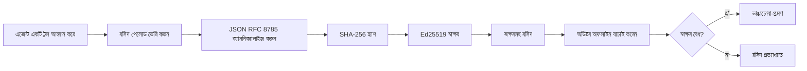
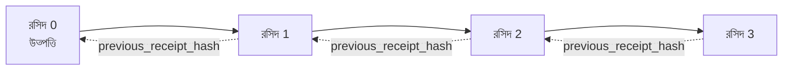

[লেসন ভিডিও দেখুন: ক্রিপ্টোগ্রাফিক রসীদ দিয়ে AI এজেন্ট সুরক্ষা](https://youtu.be/PLACEHOLDER_VIDEO_ID)

> _(মাইক্রোসফট কন্টেন্ট টিম মার্জের পর লেসন ভিডিও এবং থাম্বনেইল যুক্ত করবে, যা লেসন ১৪ / ১৫ প্যাটার্নের সাথে মেলাবে।)_

# ক্রিপ্টোগ্রাফিক রসীদ দিয়ে AI এজেন্ট সুরক্ষা

## পরিচিতি

এই লেসনে আলোচনা করা হবে:

- কেন AI এজেন্টের জন্য অডিট ট্রেইল কমপ্লায়েন্স, ডিবাগিং এবং বিশ্বাসযোগ্যতার জন্য গুরুত্বপূর্ণ।
- একটি ক্রিপ্টোগ্রাফিক রসীদ কী এবং এটি আনসাইনড লগ লাইনের থেকে কিভাবে ভিন্ন।
- কিভাবে একটি এজেন্টের টুল কলের জন্য সাইন করা রসীদ সাধারণ পাইটনে তৈরি করা যায়।
- কিভাবে একটি রসীদ অফলাইন যাচাই করা যায় এবং ছেঁড়াছেঁড়ি সনাক্ত করা যায়।
- কিভাবে রসীদ চেইন করা হয় যাতে একটি রসীদ মুছে ফেলা বা পুনঃক্রমবিন্যাস করলে চেইন ভেঙে যায়।
- রসীদ কী প্রমাণ করে এবং স্পষ্টভাবে কী প্রমাণ করে না।

## শিক্ষার লক্ষ্যসমূহ

এই লেসন সম্পন্ন করার পরে, আপনি জানতে পারবেন:

- এজেন্ট কার্যকলাপের জন্য ক্রিপ্টোগ্রাফিক উৎসের প্রেরণা কীভাবে ব্যর্থতার মোড শনাক্ত করতে হয়।
- Canonical JSON পে-লোডের উপর Ed25519 দ্বারা সাইন করা রসীদ কিভাবে তৈরি করতে হয়।
- শুধুমাত্র সইকারীর পাবলিক কী ব্যবহার করে রসীদ স্বতন্ত্রভাবে যাচাই করতে হয়।
- পরিবর্তিত রসীদ যাচাই পুনরায় চালিয়ে ছেঁড়াছেঁড়ি সনাক্ত করতে হয়।
- রসীদগুলোর হ্যাশ-চেইনড সিরিজ তৈরি করে ব্যাখ্যা দিতে হয় কেন চেইন গুরুত্বপূর্ণ।
- রসীদ কী প্রমাণ করে (অ্যাট্রিবিউশন, অখণ্ডতা, ক্রম) এবং কী প্রমাণ করে না (কার্যের সঠিকতা, নীতিমালা সাউন্ডনেস) তা বোঝা।

## সমস্যা: আপনার এজেন্টের অডিট ট্রেইল

ধরা যাক আপনি Contoso Travel-এর জন্য একটি AI এজেন্ট মোতায়েন করেছেন। এজেন্ট গ্রাহকের অনুরোধ পড়ে, ফ্লাইট API কল করে বিকল্প খোঁজে, এবং গ্রাহকের পক্ষ থেকে সিট বুক করে। গত ত্রৈমাসিকে এজেন্ট ৫০,০০০ টি বুকিং প্রক্রিয়া করেছে।

আজ একজন অডিটর আসেন। তারা একটি সহজ প্রশ্ন করেন: "আমার দেখাও তোমার এজেন্ট কী করেছে।"

আপনি আপনার লগ ফাইলগুলি হাতে দেন। অডিটর সেগুলো দেখে আরও কঠিন প্রশ্ন করেন: "কিভাবে আমি নিশ্চিত হবো এই লগগুলো সম্পাদিত হয়নি?"

এটাই অডিট-ট্রেইল সমস্যা। আজকের বেশিরভাগ এজেন্ট মোতায়েন:

- **অ্যাপ্লিকেশন লগ**: এজেন্ট নিজেই লিখে, যেকেউ ফাইল-সিস্টেম অ্যাক্সেস পেলে সম্পাদনা করতে পারে।
- **ক্লাউড লগিং সার্ভিস**: প্ল্যাটফর্ম স্তরে ট্যাম্পার-প্রমাণিত, কিন্তু কেবল তখনই কাজ করবে যখন অডিটর প্ল্যাটফর্ম অপারেটরের উপর বিশ্বাস করে।
- **ডাটাবেস ট্রানজেকশন লগ**: ডাটাবেস পরিবর্তনের জন্য উপযুক্ত, কিন্তু যেকোন টুল কলের জন্য নয়।

এইগুলোর কেউই অডিটরের প্রশ্নের উত্তর দিতে পারে না যদি না অডিটর কাউকে (আপনাকে, আপনার ক্লাউড প্রোভাইডার, ডাটাবেস বিক্রেতা) বিশ্বাস করেন। অভ্যন্তরীণ ব্যবহারের জন্য এই বিশ্বাস প্রায়শই যথেষ্ট। নিয়ন্ত্রিত ওয়ার্কলোডের জন্য (আর্থিক, স্বাস্থ্যসেবা, EU AI আইন অনুসারে) নয়।

ক্রিপ্টোগ্রাফিক রসীদ এই সমস্যা সমাধান করে কারণ প্রতিটি এজেন্ট ক্রিয়াকলাপ স্বাধীনভাবে যাচাইযোগ্য হয়। অডিটরের আপনার প্রতি বিশ্বাস প্রয়োজন হয় না। তাদের প্রয়োজন শুধুমাত্র আপনার পাবলিক কী এবং রসীদ।

## ক্রিপ্টোগ্রাফিক রসীদ কী?

রসীদ একটি JSON অবজেক্ট যা এজেন্টের করা কাজ রেকর্ড করে এবং ডিজিটাল সিগনেচার দিয়ে সই করা থাকে।



একটি ন্যূনতম রসীদ এরকম দেখায়:

```json
{
  "type": "agent.tool_call.v1",
  "agent_id": "contoso-travel-bot",
  "tool_name": "lookup_flights",
  "tool_args_hash": "sha256:a3f9c1...",
  "result_hash": "sha256:7b2e1d...",
  "policy_id": "contoso-travel-policy-v3",
  "timestamp": "2026-04-25T14:30:00Z",
  "sequence": 47,
  "previous_receipt_hash": "sha256:9d4e6a...",
  "signature": {
    "alg": "EdDSA",
    "sig": "c5af83...",
    "public_key": "8f3b2c..."
  }
}
```

তিনটি বৈশিষ্ট্য কাজটি সম্পাদন করে:

1. **সিগনেচার**। রসীদ এজেন্টের গেটওয়ে দ্বারা Ed25519 প্রাইভেট কী দিয়ে সই করা হয়। সংশ্লিষ্ট পাবলিক কী থাকা যেকেউ সিগনেচার অফলাইনে যাচাই করতে পারে। যেকোন ফিল্ডে ছেঁড়াছেঁড়ি সিগনেচারকে অবৈধ করে তোলে।

2. **ক্যানোনিকাল এনকোডিং**। সাইন করার আগে, রসীদ JSON ক্যানোনিকালাইজেশন স্কিম (JCS, RFC 8785) ব্যবহার করে সিরিয়ালাইজ করা হয়। এটি নিশ্চিত করে যে দুইটি ইমপ্লিমেন্টেশন একই লজিক্যাল রসীদ উৎপন্ন করলে একই বাইট-পরিচ্ছন্ন আউটপুট তৈরি করবে। ক্যানোনিকালাইজেশন ছাড়া, বিভিন্ন JSON সিরিয়ালাইজার একই সামগ্রীর জন্য ভিন্ন সিগনেচার তৈরি করবে।

3. **হ্যাশ চেইনিং**। `previous_receipt_hash` ফিল্ড প্রতিটি রসীদকে তার পূর্ববর্তী রসীদের সাথে সংযুক্ত করে। একটি রসীদ সরালে বা পুনরায় ক্রম পরিবর্তন করলে পরে আসা প্রতিটি রসীদ ভেঙে যাবে। ছেঁড়াছেঁড়ি চেইন স্তরে দৃশ্যমান হয় এমনকি যদি ব্যক্তিগত সিগনেচারগুলি বায়পাস করা হয়।

একসাথে এই বৈশিষ্ট্য তিনটি নিশ্চয়তা প্রদান করে:

- **অ্যাট্রিবিউশন**: এই কী এটি স্বাক্ষর করেছে।
- **অখণ্ডতা**: স্বাক্ষরের পর থেকে বিষয়বস্তু পরিবর্তিত হয়নি।
- **ক্রমবিন্যাস**: এই রসীদটি চেইনে ওই রসীদটির পরে এসেছে।

## পাইথনে রসীদ তৈরি করা

রসীদ তৈরি করতে বিশেষ কোনো লাইব্রেরির প্রয়োজন নেই। ক্রিপ্টোগ্রাফিক প্রিমিটিভস বিস্তৃতভাবে পাওয়া যায় এবং লজিকটি কয়েক ডজন লাইনের পাইথন কোড।

`code_samples/18-signed-receipts.ipynb` এ চর্চার ধাপগুলো পুরো ফ্লোতে দেখানো হয়েছে। সারাংশ ভার্সন:

```python
import json
import hashlib
import base64
from nacl import signing
from jcs import canonicalize  # RFC 8785 কাননিক্যাল JSON

def b64url_nopad(data: bytes) -> str:
    return base64.urlsafe_b64encode(data).decode("ascii").rstrip("=")

def sha256_canonical(obj) -> str:
    """SHA-256 of a Python object's JCS-canonical JSON form."""
    return f"sha256:{hashlib.sha256(canonicalize(obj)).hexdigest()}"

# একটি সাইনিং কী তৈরি করুন বা লোড করুন (প্রোডাকশনে, একটি কী ভল্টে সংরক্ষণ করুন)
signing_key = signing.SigningKey.generate()
verify_key = signing_key.verify_key

# রসিদ পে লোড তৈরি করুন (এখনও কোন সিগনেচার নেই)
tool_args = {"origin": "SYD", "destination": "LAX"}
tool_result = [{"flight": "QF11", "price": 1850, "stops": 0}]

payload = {
    "type": "agent.tool_call.v1",
    "agent_id": "contoso-travel-bot",
    "tool_name": "lookup_flights",
    "tool_args_hash": sha256_canonical(tool_args),
    "result_hash": sha256_canonical(tool_result),
    "policy_id": "contoso-travel-policy-v3",
    "timestamp": "2026-04-25T14:30:00Z",
    "sequence": 0,
    "previous_receipt_hash": None,
}

# কাননিক্যালাইজ করুন, হ্যাশ করুন, সাইন করুন।
canonical_bytes = canonicalize(payload)
message_hash = hashlib.sha256(canonical_bytes).digest()
signature_bytes = signing_key.sign(message_hash).signature

# একটি কাঠামোগত সিগনেচার অবজেক্ট সংযুক্ত করুন।
receipt = {
    **payload,
    "signature": {
        "alg": "EdDSA",
        "sig": b64url_nopad(signature_bytes),
        "public_key": b64url_nopad(bytes(verify_key)),
    },
}
```

এটাই সমগ্র সাইনিং পাইপলাইন। নোটবুকে প্রতিটি ধাপ বিস্তারিত আছে।

## রসীদ যাচাই ও ছেঁড়াছেঁড়ি সনাক্ত করা

যাচাই হল বিপরীত ক্রিয়া:

```python
import base64
import hashlib
from nacl import signing
from nacl.exceptions import BadSignatureError
from jcs import canonicalize

def b64url_decode(s: str) -> bytes:
    padding = "=" * ((4 - len(s) % 4) % 4)
    return base64.urlsafe_b64decode(s + padding)

def verify_receipt(receipt: dict) -> bool:
    # স্বাক্ষরটি একটি গঠনমূলক অবজেক্ট: {"alg", "sig", "public_key"}।
    sig_obj = receipt.get("signature")
    if not sig_obj or sig_obj.get("alg") != "EdDSA":
        return False

    # যেটি সত্যিই স্বাক্ষরিত হয়েছিল সেই পে-লোডটি পুনর্গঠন করুন (স্বাক্ষর ছাড়াও সবকিছু)।
    payload = {k: v for k, v in receipt.items() if k != "signature"}

    canonical_bytes = canonicalize(payload)
    message_hash = hashlib.sha256(canonical_bytes).digest()

    try:
        verify_key = signing.VerifyKey(b64url_decode(sig_obj["public_key"]))
        verify_key.verify(message_hash, b64url_decode(sig_obj["sig"]))
        return True
    except BadSignatureError:
        return False
```

এই ফাংশন একটি রসীদ নেয় এবং সিগনেচার বৈধ হলে `True` রিটার্ন করে, অন্যথায় `False`। কোনো নেটওয়ার্ক কল, সার্ভিস ডিপেনডেন্সি নেই, কোনো তৃতীয় পক্ষের উপর বিশ্বাস প্রয়োজন নেই।

ছেঁড়াছেঁড়ি সনাক্ত করার জন্য নোটবুকে:

1. একটি বৈধ রসীদ তৈরি করে যাচাই নিশ্চিত করা।
2. `tool_args_hash` ফিল্ডের একটি বাইট পরিবর্তন করা।
3. যাচাই পুনরায় চালিয়ে ব্যর্থতা দেখা।

এটাই প্রমাণ যে রসীদগুলো ট্যাম্পার-ইভিডেন্ট: যেকোনো ছোট পরিবর্তন সিগনেচার ভেঙে দেয়।

## মাল্টি-স্টেপ এজেন্টের জন্য রসীদ চেইনিং

একটি সাইন করা রসীদ একটি কাজ সুরক্ষিত করে। রসীদ চেইন একটি ক্রম সুরক্ষিত করে।



প্রতিটি রসীদ পূর্ববর্তী রসীদটির হ্যাশ রেকর্ড করে। একটি চেইনের মধ্য থেকে ২ নম্বর রসীদ ছুটে ফেলার জন্য, একজন আক্রমণকারীকে বা:

- রসীদ ৩-এর `previous_receipt_hash` ফিল্ড পরিবর্তন করতে হবে (রসীদ ৩-এর সিগনেচার ভেঙে যায়), অথবা
- রসীদ ৩-এর পরিবর্তিত রুপে নতুন সিগনেচার জাল করতে হবে (এজেন্টের প্রাইভেট কী প্রয়োজন)।

যদি প্রাইভেট কী হার্ডওয়্যার কী ভল্টে থাকে এবং আপনি প্রতিটি রসীদ সহ পাবলিক কী প্রকাশ করেন, তাহলে কোনো আক্রমণ অদৃশ্য ছাড়াই সম্ভব নয়।

নোটবুকে দেখানো হয়েছে:

1. তিনটি রসীদ চেইন তৈরি করা।
2. প্রতিটি রসীদ `previous_receipt_hash` যাচাই করা যে এটি প্রকৃত পূর্ববর্তী রসীদটির হ্যাশ মেলে।
3. চেইনের মাঝখানে একটি রসীদ পরিষ্কারভাবে ছেঁড়াছেঁড়ি করে চেইন ভাঙা দেখা।

এভাবেই আপনি একটি অডিট ট্রেইল তৈরি করেন যা বাহ্যিক অডিটর বিশ্বাস ছাড়াই যাচাই করতে পারে।

## রসীদ কী প্রমাণ করে (এবং কী করে না)

এই অংশ লেসনের সবচেয়ে গুরুত্বপূর্ণ। রসীদ শক্তিশালী কিন্তু তাদের ক্ষমতা সীমিত।

**রসীদ তিনটি বিষয় প্রমাণ করে:**

1. **অ্যাট্রিবিউশন**: একটি নির্দিষ্ট কী একটি নির্দিষ্ট পে-লোডে সাইন করেছে।
2. **অখণ্ডতা**: সাইন করার পর থেকে পে-লোড পরিবর্তিত হয়নি।
3. **ক্রমবিন্যাস**: এই রসীদ চেইনে ওই রসীদটির পরে এসেছে।

**রসীদ প্রমাণ করে না:**

1. **সঠিকতা**: যে এজেন্টের কাজ সঠিক ছিল। একটি রসীদ ভুল উত্তরের জন্যও পরিষ্কারভাবে সাইন হতে পারে।
2. **নীতিমালা সম্মতি**: `policy_id` এর নীতিমালা সত্যিই মূল্যায়ন করা হয়েছে বা পরীক্ষা করলে অনুমতি দিত কিনা। রসীদ যা দাবি করছে সেটাই রেকর্ড করে, পালন করা কি হয়নি।
3. **কী ছাড়া পরিচয়**: রসীদ বলে "এই কী এই বিষয়বস্তু সাইন করেছে"। বলে না "এই মানুষ অনুমোদন দিয়েছে"। কী থেকে ব্যক্তির বা সংস্থার সংযোগ আলাদা পরিচয় কাঠামোর দাবি করে (ডিরেক্টরি, পাবলিক কী রেজিস্ট্রি ইত্যাদি)।
4. **ইনপুটের সত্যতা**: যদি এজেন্ট একটি পরিবর্তিত প্রম্পট পায় ও সে অনুযায়ী কাজ করে, রসীদ কাজটি বিশ্বস্তভারে রেকর্ড করে। রসীদ ইনপুট যাচাইয়ের বিকল্প নয়।

এই সীমা গুরুত্বপূর্ণ কারণ:

- এটি বলে রসীদগুলো কী জন্য দরকারী: এজেন্ট আচরণ অডিটেবল এবং ট্যাম্পার-ইভিডেন্ট করা, এমনকি সাংগঠনিক সীমানার বাইরে।
- এটি বলে আপনি কী অতিরিক্ত স্তর প্রয়োজন: ইনপুট যাচাই (লেসন ৬), নীতিমালা প্রয়োগ (নিচে সংক্ষিপ্ত), এবং পরিচয় কাঠামো (এই লেসনের বাইরে)।

একটি সাধারণ ভুল ধারণা হলো "আমাদের রসীদ আছে" মানে "আমাদের শাসিত"। তা নয়। রসীদ হলো ভিত্তি। শাসন হলো সেই ব্যবস্থা যা আপনি তার উপরে তৈরি করেন।

## প্রোডাকশন রেফারেন্স

এই লেসনের পাইথন কোড ইচ্ছাকৃতভাবে সহজ করা, যাতে আপনি প্রতিটি লাইন পড়ে সঠিকভাবে বুঝতে পারেন। প্রোডাকশনে আপনার দুটি বিকল্প আছে:

1. **ক্রিপ্টোগ্রাফিক প্রিমিটিভস সরাসরি ব্যবহার করুন।** উপরে দেখানো ৫০ লাইন অনেক ব্যবহারকারীর জন্য যথেষ্ট। PyNaCl (Ed25519) এবং `jcs` প্যাকেজ (ক্যানোনিকাল JSON) ভাল রক্ষণাবেক্ষণ করা ও অডিট করা লাইব্রেরি।

2. **একটি প্রোডাকশন রসীদ লাইব্রেরি ব্যবহার করুন।** বেশ কয়েকটি ওপেন-সোর্স প্রকল্প একই প্যাটার্ন অন্যান্য বৈশিষ্ট্য (কী রোটেশন, ব্যাচ যাচাই, JWK সেট বিতরণ, নীতিমালা ইঞ্জিন ইন্টিগ্রেশন) সহ বাস্তবায়ন করে:
   - এই লেসনে ব্যবহৃত রসীদ ফরম্যাট একটি IETF ইন্টারনেট ড্রাফট অনুসরণ করে (`draft-farley-acta-signed-receipts`) যা বর্তমানে স্ট্যান্ডার্ড প্রক্রিয়াধীন।
   - Microsoft Agent Governance Toolkit রসীদকে সিডার ভিত্তিক নীতিমালা সিদ্ধান্তের সাথে সংযুক্ত করে; ওই রিপোজিটরির টিউটোরিয়াল ৩৩ এ একটি সম্পূর্ণ উদাহরণ আছে।
   - `protect-mcp` (npm) এবং `@veritasacta/verify` (npm) প্যাকেজগুলো Node-ভিত্তিক রসীদ সাইনিং ও অফলাইন যাচাই প্রদান করে, যেকোন MCP সার্ভারকে ট্যাম্পার-ইভিডেন্ট অডিট ট্রেইল দিয়ে মোড়াতে।
   - **[nobulex](https://github.com/arian-gogani/nobulex)** পাইথন SDK (`pip install nobulex`) একই Ed25519 + JCS সাইনিং প্যাটার্ন পাইথন-এ LangChain এবং CrewAI ইন্টিগ্রেশনের সাথে দেয়, প্রকাশিত ক্রস-ভ্যালিডেশন টেস্ট ভেক্টরস এবং [OWASP PR #2210](https://github.com/OWASP/CheatSheetSeries/pull/2210) এর মাধ্যমে কমপ্লায়েন্স ম্যাপিং দিয়ে।

নিজের JWT লাইব্রেরি লেখার এবং পরীক্ষিত একটি ব্যবহার করার তুলনা মত, নিজের রসীদ ইমপ্লিমেন্ট করা এবং একটি লাইব্রেরি ব্যবহার করার সিদ্ধান্তও একই: উভয়ই যুক্তিযুক্ত; লাইব্রেরি সময় বাঁচায় এবং অডিট সারফেস কমায়; from-scratch পন্থা সব প্রিমিটিভ বোঝার সুযোগ দেয়। এই লেসন from-scratch পদ্ধতি শেখায় যাতে যেকোনো পথের জন্য ভিত্তি থাকে।

## জ্ঞান যাচাই

চর্চার ধাপে যাওয়ার পূর্বে আপনার বোঝামত যাচাই করুন।

**১. একটি রসীদ এজেন্টের প্রাইভেট Ed25519 কী দিয়ে সাইন করা হয়। অডিটরের কাছে শুধুমাত্র পাবলিক কী আছে। অডিটার কি রসীদ অফলাইনে যাচাই করতে পারে?**

<details>
<summary>উত্তর</summary>

হ্যাঁ। Ed25519 যাচাইয়ের জন্য শুধুমাত্র পাবলিক কী এবং সাইনকৃত বাইট দরকার। কোনো নেটওয়ার্ক কল বা সার্ভিস নির্ভরতা নয়। এটি রসীদকে এয়ার-গ্যাপড, বহু-সংগঠন বা কম-বিশ্বাসযোগ্য অডিট পরিবেশে কার্যকর করে।
</details>

**২. একজন আক্রমণকারী একটি রসীদ এর `policy_id` ফিল্ড পরিবর্তন করে দাবি করে এটি একটি বেশি অনুমতিপ্রদানকারী নীতিমালা দ্বারা শাসিত ছিল। সিগনেচার মূল পে-লোডের উপর ছিল। যাচাইয়ের সময় কী হয়?**

<details>
<summary>উত্তর</summary>

যাচাই ব্যর্থ হয়। সিগনেচার মূল পে-লোডের ক্যানোনিক্যাল বাইটে গণনা করা হয়েছিল; কোনো ফিল্ড পরিবর্তন ক্যানোনিক্যাল বাইট পরিবর্তন করে, যা SHA-256 হ্যাশ পরিবর্তন করে, যা সিগনেচারকে অবৈধ করে। আক্রমণকারীকে একটি বৈধ নতুন সিগনেচার তৈরি করতে প্রাইভেট কী প্রয়োজন, যা তার নেই।
</details>

**৩. রসীদ `tool_args_hash` এবং `result_hash` অন্তর্ভুক্ত করে সরাসরি আর্গুমেন্ট এবং ফলাফল না দিয়ে কেন?**

<details>
<summary>উত্তর</summary>

দুই কারণ। প্রথম, রসীদ সংরক্ষিত বা পরিবহণকৃত হতে পারে এমন পরিবেশে যেখানে কাঁচা তথ্য (PII, ব্যবসায়িক তথ্য) ফাঁস হওয়া একটি সমস্যা। হ্যাশিং রসীদকে ছোট রাখে এবং বিষয়বস্তু গোপন রাখে; অডিটর যাচাই করে হ্যাশ মেলে প্রকৃত কন্টেন্টের আলাদা সংরক্ষিত কপির সাথে। দ্বিতীয়, হ্যাশের একটি নির্দিষ্ট আকার থাকে; ইনপুট আউটপুট যত বড় হোক না কেন হ্যাশসহ রসীদ আকারে সীমানাবদ্ধ থাকে।
</details>

**৪. `previous_receipt_hash` প্রতিটি রসীদকে তার পূর্বসূরীর সাথে যুক্ত করে। যদি একজন আক্রমণকারী চেইনের মাঝখান থেকে একটি রসীদ চুপচাপ মুছে ফেলে, তাহলে কী অবৈধ হয়ে যায়?**

<details>
<summary>উত্তর</summary>

মুছে ফেলা রসীদটির পরে থাকা প্রতিটি রসীদ। তাদের `previous_receipt_hash` ক্ষেত্র আর প্রকৃত চেইনের সাথে মিলে না (কারণ তারা যে রসীদটির উল্লেখ করেছিল তা আর নেই, অথবা চেইন এখন অন্য পূর্বসূরীতে নির্দেশ করে)। মুছে ফেলা লুকাতে আক্রমণকারীকে প্রতিটি পরবর্তী রসীদ পুনরায় সাইন করতে হবে, যার জন্য প্রাইভেট কী দরকার।
</details>

**৫. একটি রসীদ পরিষ্কারভাবে যাচাই করা হয়েছে। এটা কি প্রমাণ করে যে এজেন্টের কাজ সঠিক, সাউন্ড, বা নীতিমালা অনুসারে ছিল?**

<details>
<summary>উত্তর</summary>

না। একটি বৈধ রসীদ তিনটি বিষয় প্রমাণ করে: অ্যাট্রিবিউশন (এই কী এই বিষয়বস্তু সাইন করেছে), অখণ্ডতা (বিষয়বস্তু পরিবর্তিত হয়নি), এবং ক্রমবিন্যাস (এই রসীদ ঐ রসীদটির পরে হয়েছে)। এটা প্রমাণ করে না যে কাজটি সঠিক ছিল, `policy_id` এর নীতি প্রকৃতপক্ষে মূল্যায়িত হয়েছে, বা এজেন্ট সব নিয়ম অনুসরণ করেছে। রসীদ এজেন্ট আচরণ অডিটেবল করে, আর নিখুঁত নয়। এটি লেসনের সবচেয়ে গুরুত্বপূর্ণ সীমা।
</details>

## চর্চার অনুশীলন

`code_samples/18-signed-receipts.ipynb` খুলুন এবং চারটি সেকশন সম্পন্ন করুন:

1. **সেকশন ১**: আপনার প্রথম রসীদ সাইন করুন এবং যাচাই করুন।
2. **সেকশন ২**: রসীদটি ছেঁড়াছেঁড়ি করুন এবং যাচাই ব্যর্থ দেখুন।
3. **সেকশন ৩**: তিনটি রসীদ চেইন তৈরি করুন এবং চেইনের অখণ্ডতা যাচাই করুন।
4. **সেকশন ৪**: Microsoft Agent Framework দিয়ে নির্মিত একটি এজেন্টে প্যাটার্ন প্রয়োগ করুন: একটি টুল কল রসীদ সাইনিং দিয়ে মোড়ান, তারপর রসীদ স্বাধীনভাবে যাচাই করুন।
**স্ট্রেচ চ্যালেঞ্জ ১:** রসিদ স্কিমাতে আপনার নিজস্ব পছন্দের একটি অতিরিক্ত ক্ষেত্র যোগ করুন (উদাহরণস্বরূপ, ট্রেসিংয়ের জন্য একটি অনুরোধ আইডি), ক্যানোনিক্যাল সাইনিং লজিকে এটি অন্তর্ভুক্ত করার জন্য আপডেট করুন, এবং নিশ্চিত করুন যে রসিদ এখনও যাচাইয়ের মাধ্যমে সঠিকভাবে ফিরে আসছে। তারপর সাইন করার পরে ওই ক্ষেত্রটি পরিবর্তন করুন এবং নিশ্চিত করুন যাচাই ব্যর্থ হয়। এটি আপনাকে বুঝতে বাধ্য করবে ক্যানোনিক্যাল এনকোডিংয়ের প্রতিটি বাইট কিভাবে স্বাক্ষরে অবদান রাখে।

**স্ট্রেচ চ্যালেঞ্জ ২:** আপনার দুটি রসিদের SHA-256 হ্যাশ করুন (তাদের ক্যানোনিক্যাল বাইটসমূহ একটি নির্ধারিত ক্রমে সংযুক্ত করুন) এবং তৃতীয় রসিতে স্বাক্ষর করার আগে নতুন ক্ষেত্র হিসেবে প্রাপ্ত ডাইজেস্টটি এমবেড করুন। যাচাই করুন যে সব তিনটি রসিদ এখনও সঠিকভাবে যাচাই হচ্ছে। আপনি ঠিক এখনই একটি এক-ধাপের অন্তর্ভুক্তি প্রমাণ তৈরি করেছেন: তৃতীয় রসিদ যার কাছে আছে সে প্রথম দুইটি রসিদ সই করার সময় অবস্থিত ছিল তা প্রমাণ করতে পারে, তাদের বিষয়বস্তু প্রকাশ না করেই। এইটাই সেই প্যাটার্ন যা নির্বাচিত-বা-চাপান রসিদ বড় পরিসরে ব্যবহার করে (মার্কেল কমিটমেন্ট, RFC 6962)।

## উপসংহার

ক্রিপ্টোগ্রাফিক রসিদগুলি AI এজেন্টদের জন্য একটি অডিট ট্রেইল প্রদান করে যা:

- **স্বতন্ত্রভাবে যাচাইযোগ্য**: যেকোনো পক্ষের কাছে পাবলিক কী থাকলে যাচাই করতে পারে, কোনো সার্ভিস নির্ভরতা নেই।
- **তছনছ প্রমাণযোগ্য**: যেকোনো পরিবর্তন স্বাক্ষরকে অবৈধ করে তোলে।
- **পরিবহনযোগ্য**: একটি রসিদ একটি ছোট JSON ফাইল; এটিকে সংরক্ষণ, প্রেরণ এবং যেকোনো জায়গায় যাচাই করা যেতে পারে।
- **মানবদ্ধ মানানসই**: Ed25519 (RFC 8032), JCS (RFC 8785), এবং SHA-256 এর উপর নির্মিত, যা সবগুলি ব্যাপকভাবে প্রয়োগিত প্রিমিটিভ।

এসব ইনপুট যাচাই, নীতি প্রয়োগ বা পরিচয় পরিকাঠামোর বিকল্প নয়। এগুলো ঐ স্তরগুলোর ভিত্তি। যখন আপনি নিয়ন্ত্রিত ওয়ার্কলোডে, বহু-সংগঠনমূলক ওয়ার্কফ্লোতে, বা যেকোনো পরিবেশে যেখানে ভবিষ্যতের অডিটর আপনাকে বিশ্বাস করবে না, তখন রসিদই হবে যেভাবে আপনি অডিট ট্রেইলটিকে সৎ রাখতে পারবেন।

সবচেয়ে গুরুত্বপূর্ণ বিষয়: রসিদ প্রমাণ করে কে কি বলেছে, কখন। তারা প্রমাণ করে না যে যা বলা হয়েছে তা সত্য বা সঠিক। এই পার্থক্যটি কঠোরভাবে ধরুন। এটি সৎ উৎস পদ্ধতি এবং বিভ্রান্তিকর একটি ব্যবস্থার মধ্যে পার্থক্য।

## প্রোডাকশন চেকলিস্ট

এই পাঠ থেকে সন্ন্যাস নেয়ার পর যখন আপনি রসিদ-স্বাক্ষরযুক্ত এজেন্ট বাস্তব পরিবেশে মোতায়েন করবেন:

- [ ] **সাইনিং কী ডেভেলপার ল্যাপটপ থেকে সরান।** Azure Key Vault, AWS KMS, অথবা একটি হার্ডওয়্যার সিকিউরিটি মডিউল ব্যবহার করুন। আপনার রসিদগুলির স্বাক্ষরের জন্য ব্যক্তিগত কী কোন অবস্থাতেই সোর্স কন্ট্রোল বা অ্যাপ্লিকেশন মেশিনের প্লেইনটেক্সটে থাকা যাবে না।
- [ ] **যাচাইকরণের পাবলিক কী প্রকাশ করুন।** অডিটরদের অফলাইন যাচাই করার জন্য এটি প্রয়োজন। স্ট্যান্ডার্ড প্যাটার্ন হল একটি JWK সেট একটি সুপরিচিত URL এ (RFC 7517), যেমন `https://your-org.example.com/.well-known/agent-keys.json`।
- [ ] **চেইনটি বাহ্যিকভাবে অ্যাঙ্কর করুন।** সময়ে সময়ে সর্বশেষ চেইন হেড হ্যাশকে একটি ট্রান্সপারেন্সি লগে (Sigstore Rekor, RFC 3161 টাইমস্ট্যাম্প অথরিটি, অথবা একটি দ্বিতীয় অভ্যন্তরীণ সিস্টেম) লিখুন যাতে একটি বাহ্যিক পক্ষ নিশ্চিত করতে পারে "এই চেইনটি এই সময়ে বিদ্যমান ছিল।"
- [ ] **রসিদগুলি অপরিবর্তনীয়ভাবে সংরক্ষণ করুন।** কেবল যোগ করার ধরনের ব্লব স্টোরেজ (Azure Storage এর অপরিবর্তনীয় নীতিসহ, AWS S3 অবজেক্ট লক) স্টোরেজ স্তরে অভ্যন্তরীণ ব্যক্তি দ্বারা ইতিহাস পুনর্লেখা থেকে রক্ষা করে।
- [ ] **সংরক্ষণ সিদ্ধান্ত নিন।** অনেক কমপ্লায়েন্স ব্যবস্থা বহু-বছরের সংরক্ষণ দাবি করে। রসিদের বৃদ্ধি পরিকল্পনা করুন (প্রতি রসিদ ~৫০০ বাইট; একটি এজেন্ট দিনে ১০ হাজার কল করলে বছরে ~১.৮ GB উৎপন্ন করে)।
- [ ] **রসিদ কী কাভার করে না তা ডকুমেন্ট করুন।** রসিদ প্রমাণ করে স্বত্বাধিকার, অখণ্ডতা, এবং ক্রম। আপনার রানবুকে স্পষ্টভাবে তালিকা করুন অতিরিক্ত নিয়ন্ত্রণগুলি (ইনপুট যাচাই, নীতি প্রয়োগ, রেট লিমিটিং, পরিচয় পরিকাঠামো) যা রসিদের সাথে আপনার গভর্নেন্স অবস্থানে রয়েছে।

### AI এজেন্ট সুরক্ষার বিষয়ে আরও প্রশ্ন আছে?

অন্যান্য শিক্ষার্থীদের সাথে সাক্ষাৎ করার জন্য, অফিস আওয়ার এ অংশগ্রহণ করতে, এবং আপনার AI এজেন্ট সম্পর্কিত প্রশ্নের উত্তর পেতে [Microsoft Foundry Discord](https://aka.ms/ai-agents/discord) এ যোগ দিন।

## এই পাঠের বাইরেও

এই পাঠে একক-রসিদ সাইনিং এবং হ্যাশ-চেইনযুক্ত সিকুয়েন্স কভার করা হয়েছে। একই প্রিমিটিভগুলো আরও কয়েকটি উন্নত প্যাটার্নে গঠিত যা আপনি আপনার গভর্নেন্স অবস্থান পরিপক্ক হলে দেখতে পারেন:

- **নির্বাচিত প্রকাশ।** যখন একটি রসিদের ক্ষেত্রগুলি স্বতন্ত্রভাবে কমিট করা হয় (RFC 6962-শৈলী মার্কেল ট্রি), আপনি নির্দিষ্ট ক্ষেত্রগুলি নির্দিষ্ট অডিটরদের সামনে প্রকাশ করতে পারেন এবং বাকিগুলো অপরিবর্তিত থাকার প্রমাণ দিতে পারেন তাদের প্রকাশ না করেই। উপযোগী যখন একই রসিদকে সম্মানজনক অডিট (যা সম্পূর্ণতা চায়) এবং GDPR-এর মতো ডেটা-মিনিমাইজেশন নিয়মের (যা অডিটরকে যতটা সম্ভব কম দেখতে চায়) উভয় প্রয়োজন মেটাতে হয়।
- **রসিদ প্রত্যাহার।** যদি একটি সাইনিং কী কম্প্রোমাইজ হয়, আপনাকে একটি উপায় লাগবে ওই কী দ্বারা স্বাক্ষরিত সব রসিদ নির্দিষ্ট সময় থেকে অবিশ্বাস্য হিসেবে চিহ্নিত করার। স্ট্যান্ডার্ড প্যাটার্ন: স্বল্পমেয়াদী সাইনিং কী এবং প্রকাশিত প্রত্যাহার তালিকা, অথবা প্রত্যাহার এন্ট্রিসহ একটি ট্রান্সপারেন্সি লগ।
- **দ্বিপাক্ষিক / বিভক্ত-স্বাক্ষর রসিদ।** কিছু ইমপ্লিমেন্টেশন স্বাক্ষরিত পে-লোডকে পূর্ব-কর্মসংস্থান (`authorization_*`) এবং পর-কর্মসংস্থান (`result_*`) অর্ধেক আকারে ভাগ করে স্বতন্ত্র স্বাক্ষর নিয়ে, যা সাহায্য করে যখন অনুমোদন সিদ্ধান্ত এবং পর্যবেক্ষিত ফলাফল আলাদা অভিনেতা বা সময়ে উৎপন্ন হয়। এটি এই পাঠে শেখানো রসিদ ফরম্যাটের ওপর অতিরিক্ত সংযোজন।
- **পে-লোড সংযোজন।** রসিদ আপনার `result_hash` এ যা কিছু বাইট দেন তা সীল মুদ্রণ করে। বাস্তব পে-লোড প্রায়শই একক টুল কল রেজাল্টের চেয়েও সমৃদ্ধ: পূর্ব-সিদ্ধান্ত যুক্তি(মডেল অনুমান, বিবেচিত বিকল্প, প্রমাণ ও তার সম্পূর্ণতা, ঝুঁকি অবস্থা, দায়িত্ব চেইন, গেট আউটকাম) সবই পে-লোডের ভিতরে থাকতে পারে, যা একটি রসিদ দ্বারা সীলবদ্ধ। এটি রসিদ ফরম্যাটকে নূন্যতম রাখে এবং পে-লোড স্কিমাগুলো ডোমেনভিত্তিক বিকাশের সুযোগ দেয়।
- **ক্রস-ইমপ্লিমেন্টেশন সামঞ্জস্য।** একই রসিদ ফরম্যাটের বিভিন্ন স্বাধীন ইমপ্লিমেন্টেশন (Python, TypeScript, Rust, Go) শেয়ার করা টেস্ট ভেক্টর নিয়ে ক্রস-যাচাই করে। যদি আপনি নিজস্ব ইমপ্লিমেন্টেশন তৈরি করেন, প্রকাশিত ভেক্টরের বিরুদ্ধে যাচাইকরণ ওয়্যার সামঞ্জস্য নিশ্চিত করে।
- **পোস্ট-কোয়ান্টাম মাইগ্রেশন।** Ed25519 আজকাল ব্যাপকভাবে ব্যবহার হচ্ছে কিন্তু কোয়ান্টাম-প্রতিরোধী নয়। রসিদ ফরম্যাট অ্যালগরিদম-চরক: `signature.alg` ক্ষেত্র `ML-DSA-65` (নিস্ট পোস্ট-কোয়ান্টাম স্বাক্ষর স্ট্যান্ডার্ড) ধারণ করতে পারে যখন আপনি মাইগ্রেট করতে চান। একটি রূপান্তর সময়ের পরিকল্পনা করুন যেখানে রসিদ দ্বৈত স্বাক্ষরযুক্ত থাকবে।

## অতিরিক্ত সম্পদ

- <a href="https://datatracker.ietf.org/doc/draft-farley-acta-signed-receipts/" target="_blank">IETF ইন্টারনেট-ড্রাফট: মেশিন-টু-মেশিন অ্যাক্সেস কন্ট্রোলের জন্য স্বাক্ষরিত সিদ্ধান্ত রসিদ</a>
- <a href="https://learn.microsoft.com/azure/ai-studio/responsible-use-of-ai-overview" target="_blank">দায়িত্বশীল AI ওভারভিউ (Azure AI)</a>
- <a href="https://datatracker.ietf.org/doc/html/rfc8032" target="_blank">RFC 8032: এডওয়ার্ডস-কর্ভ ডিজিটাল স্বাক্ষর অ্যালগরিদম (EdDSA)</a>
- <a href="https://datatracker.ietf.org/doc/html/rfc8785" target="_blank">RFC 8785: JSON ক্যানোনিকালাইজেশন স্কিম (JCS)</a>
- <a href="https://datatracker.ietf.org/doc/html/rfc6962" target="_blank">RFC 6962: সার্টিফিকেট ট্রান্সপারেন্সি</a> (নির্বাচিত-প্রকাশ রসিদে ব্যবহৃত মার্কেল-ট্রি নির্মাণ)
- <a href="https://github.com/microsoft/agent-governance-toolkit/blob/main/docs/tutorials/33-offline-verifiable-receipts.md" target="_blank">মাইক্রোসফট এজেন্ট গভর্নেন্স টুলকিট, টিউটোরিয়াল ৩৩: অফলাইনে যাচাইযোগ্য সিদ্ধান্ত রসিদ</a>
- <a href="https://github.com/ScopeBlind/agent-governance-testvectors" target="_blank">এই পাঠে ব্যবহৃত রসিদ ফরম্যাটের জন্য ক্রস-ইমপ্লিমেন্টেশন সামঞ্জস্য টেস্ট ভেক্টর</a> (Apache-2.0)
- <a href="https://pynacl.readthedocs.io/" target="_blank">PyNaCl ডকুমেন্টেশন</a> (Python এ Ed25519)

## পূর্ববর্তী পাঠ

[কম্পিউটার ইউজ এজেন্ট নির্মাণ (CUA)](../15-browser-use/README.md)

## পরবর্তী পাঠ

_(পাঠক্রম রক্ষণাবেক্ষকদের দ্বারা নির্ধারিত হবে)_

---

<!-- CO-OP TRANSLATOR DISCLAIMER START -->
**অস্বীকৃতি**:
এই নথিটি AI অনুবাদ পরিষেবা [Co-op Translator](https://github.com/Azure/co-op-translator) ব্যবহার করে অনূদিত হয়েছে। যদিও আমরা শুদ্ধতার জন্য চেষ্টা করি, অনুগ্রহ করে মনে রাখবেন যে স্বয়ংক্রিয় অনুবাদে ত্রুটি বা অসঙ্গতি থাকতে পারে। মূল নথিটি তার স্বভাষায় কর্তৃত্বপূর্ণ উৎস হিসেবে বিবেচিত হওয়া উচিত। গুরুত্বপূর্ণ তথ্যের জন্য পেশাদার মানব অনুবাদ সুপারিশ করা হয়। এই অনুবাদের ব্যবহারে প্রয়োজনীয় ভুল বোঝাবুঝি বা ভুল ব্যাখ্যার জন্য আমরা দায়বদ্ধ নই।
<!-- CO-OP TRANSLATOR DISCLAIMER END -->