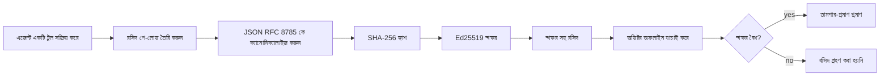
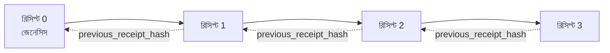

[পাঠের ভিডিও দেখুন: ক্রিপ্টোগ্রাফিক রসিদ দিয়ে AI এজেন্ট সুরক্ষিত করা](https://youtu.be/PLACEHOLDER_VIDEO_ID)

> _(Microsoft কনটেন্ট টিম মিশ্রণের পর পাঠের ভিডিও এবং থাম্বনেইল যোগ করবে, যা পাঠ ১৪ / ১৫ এর প্যাটার্নের সাথে মিলে যাবে)_

# ক্রিপ্টোগ্রাফিক রসিদ দিয়ে AI এজেন্ট সুরক্ষিত করা

## পরিচিতি

এই পাঠে আলোচনা করা হবে:

- সম্মতি, ডিবাগিং, এবং বিশ্বাসের জন্য AI এজেন্টের অডিট ট্রেইল কেন গুরুত্বপূর্ণ।
- একটি ক্রিপ্টোগ্রাফিক রসিদ কী এবং এটি একটি অসইন করা লগ লাইনের থেকে কিভাবে আলাদা।
- একটি এজেন্টের টুল কলের জন্য সাইন করা রসিদ প্লেইন পাইথনে কিভাবে তৈরি করবেন।
- অফলাইন রসিদ যাচাই এবং ট্যাম্পারিং সনাক্তকরণ কিভাবে করবেন।
- রসিদগুলি কিভাবে চেইন করবেন যাতে একটি রসিদ সরানো বা পুনঃক্রমবিন্যাস করলে চেইন ভেঙে যায়।
- রসিদগুলি কী প্রমাণ করে এবং কী স্পষ্টভাবে প্রমাণ করে না।

## শেখার লক্ষ্য

এই পাঠ শেষ করার পর, আপনি জানতে পারবেন কিভাবে:

- সেই ব্যর্থতা মোড চিনতে পারবেন যা এজেন্ট ক্রিয়াকলাপের ক্রিপ্টোগ্রাফিক উৎস অনুধাবনের জন্য প্রয়োজন।
- একটি স্বাক্ষরিত Ed25519 রসিদ কিভাবে একটি মৌলিক JSON পে-লোডে তৈরি করবেন।
- শুধুমাত্র সইকারীর পাবলিক কী ব্যবহার করে রসিদ স্বতন্ত্রভাবে যাচাই করবেন।
- পরিবর্তিত রসিদে যাচাই পুনরায় চালিয়ে ট্যাম্পারিং সনাক্ত করবেন।
- একটি হ্যাশ-চেইনকৃত রসিদ সিকোয়েন্স তৈরি করবেন এবং বুঝাবেন কেন চেইনটি গুরুত্বপূর্ণ।
- রসিদ যা প্রমাণ করে (স্বীকৃতি, অখণ্ডতা, ক্রম) এবং যা প্রমাণ করে না (কার্যকারিতা, নীতির সাউন্ডনেসবিলিটি) তার সীমানা চিনতে পারবেন।

## সমস্যা: আপনার এজেন্টের অডিট ট্রেইল

ভাবুন, আপনি কন্টোসো ট্রাভেলের জন্য একটি AI এজেন্ট স্থাপন করেছেন। এজেন্ট গ্রাহকের অনুরোধ পড়ে, ফ্লাইট API কল করে বিকল্প খোঁজে, এবং গ্রাহকের পক্ষ থেকে আসন বুক করে। গত ত্রৈমাসিকে, এজেন্ট ৫০,০০০টি বুকিং প্রক্রিয়া করেছে।

আজ একজন অডিটর উপস্থিত হয়। তারা একটি সরল প্রশ্ন করে: "আপনার এজেন্ট কী করেছে তা দেখান।"

আপনি আপনার লগ ফাইল হস্তান্তর করেন। অডিটর ফাইলগুলো দেখে কঠিন প্রশ্ন করে: "আমি কীভাবে নিশ্চিত হব যে এই লগগুলো সম্পাদিত হয়নি?"

এই হল অডিট-ট্রেইল সমস্যা। আজকের দিনটিতে অধিকাংশ এজেন্ট স্থাপন নির্ভরশীল:

- **অ্যাপ্লিকেশন লগস**: এজেন্ট নিজেই লিখে, যেকোন ফাইল-সিস্টেম অ্যাক্সেসের মাধ্যমে সম্পাদনাযোগ্য।
- **ক্লাউড লগিং সার্ভিসেস**: প্ল্যাটফর্ম স্তরে ট্যাম্পার-এভিডেন্ট, তবে শুধুমাত্র যদি অডিটর প্ল্যাটফর্ম অপারেটরকে বিশ্বাস করেন।
- **ডাটাবেস ট্রানজাকশন লগস**: ডাটাবেস পরিবর্তনের জন্য উপযুক্ত, কিন্তু যেকোনো টুল কলের জন্য নয়।

এগুলোর কোনোটাই অডিটরের প্রশ্নের উত্তর দিতে পারে না বশর্তে যে অডিটর কাউকে বিশ্বাস করতে হবে (আপনি, আপনার ক্লাউড প্রোভাইডার, বা ডাটাবেস বিক্রেতা)। অভ্যন্তরীণ ব্যবহারের জন্য, এই বিশ্বাস প্রায়শই গ্রহণযোগ্য। নিয়ন্ত্রিত কাজের জন্য (অর্থনীতি, স্বাস্থ্যসেবা, EU AI আইন প্রযোজ্য ক্ষেত্র), তা গ্রহণযোগ্য নয়।

ক্রিপ্টোগ্রাফিক রসিদগুলো এনেছে এমন ব্যবস্থা যা প্রতিটি এজেন্ট ক্রিয়াকলাপকে স্বতন্ত্রভাবে যাচাইযোগ্য করে তোলে। অডিটর আপনাকে বিশ্বাস করতে হবে না। ওদের কেবল আপনার পাবলিক কী এবং রসিদটাই দরকার।

## ক্রিপ্টোগ্রাফিক রসিদ কী?

রসিদ হল একটি JSON অবজেক্ট যা নির্দেশ করে এজেন্ট কী করেছে, ডিজিটাল স্বাক্ষর দিয়ে সই করা।



একটি ন্যূনতম রসিদ এরকম দেখায়:

```json
{
  "type": "agent.tool_call.v1",
  "agent_id": "contoso-travel-bot",
  "tool_name": "lookup_flights",
  "tool_args_hash": "sha256:a3f9c1...",
  "result_hash": "sha256:7b2e1d...",
  "policy_id": "contoso-travel-policy-v3",
  "timestamp": "2026-04-25T14:30:00Z",
  "sequence": 47,
  "previous_receipt_hash": "sha256:9d4e6a...",
  "signature": {
    "alg": "EdDSA",
    "sig": "c5af83...",
    "public_key": "8f3b2c..."
  }
}
```

তিনটি বৈশিষ্ট্য কাজ করছে:

1. **স্বাক্ষর**। রসিদটি এজেন্টের গেটওয়ে দ্বারা Ed25519 প্রাইভেট কী ব্যবহার করে সই করা হয়েছে। সংশ্লিষ্ট পাবলিক কী থাকা যেকেউ স্বাক্ষর অফলাইনে যাচাই করতে পারে। যেকোনো ক্ষেত্র পরিবর্তনে স্বাক্ষর অবৈধ হয়ে যায়।

2. **ক্যানোনিকাল এনকোডিং**। সই করার আগে, রসিদ JSON Canonicalization Scheme (JCS, RFC 8785) ব্যবহার করে সিরিয়ালাইজ করা হয়। এটি নিশ্চিত করে একটি যৌক্তিকভাবে সমান রসিদ উৎপাদনকারী দুইটি ইমপ্লিমেন্টেশন একই বাইট-পরিচিত আউটপুট তৈরি করে। ক্যানোনিকালাইজেশন ছাড়া বিভিন্ন JSON সিরিয়ালাইজার একই কন্টেন্টের জন্য ভিন্ন স্বাক্ষর তৈরি করবে।

3. **হ্যাশ চেইনিং**। `previous_receipt_hash` ক্ষেত্রটি প্রতিটি রসিদকে তার পূর্ববর্তী রসিদের সাথে যুক্ত করে। একটি রসিদ সরানো বা পুনঃক্রমবিন্যাস করলে তার পরবর্তী প্রতিটি রসিদের চেইন ভেঙে যায়। ট্যাম্পারিং চেইন স্তরে দৃশ্যমান হয় যদিও পৃথক স্বাক্ষর বাইপাস হয়।

এই গুণাবলীগুলো একত্রে তিনটি নিশ্চয়তা প্রদান করে:

- **স্বীকৃতি**: এই কী এই কন্টেন্টে সই করেছে।
- **অখণ্ডতা**: সাইন করার পর থেকে কন্টেন্ট অপরিবর্তিত আছে।
- **ক্রম**: এই রসিদটি চেইনে তার পূর্ববর্তী রসিদের পরে এসেছে।

## পাইথনে রসিদ তৈরি করা

রসিদ তৈরি করতে আপনার বিশেষ কোনো লাইব্রেরি দরকার নেই। ক্রিপ্টোগ্রাফিক প্রিমিটিভগুলো ব্যাপকভাবে উপলব্ধ এবং লজিকের মাত্র কয়েক ডজন লাইন পাইথন কোড।

`code_samples/18-signed-receipts.ipynb` এর হ্যান্ডস-অন অনুশীলনগুলো পুরো প্রক্রিয়া ব্যাখ্যা করে। সারাংশ:

```python
import json
import hashlib
import base64
from nacl import signing
from jcs import canonicalize  # RFC 8785 ক্যানোনিক্যাল JSON

def b64url_nopad(data: bytes) -> str:
    return base64.urlsafe_b64encode(data).decode("ascii").rstrip("=")

def sha256_canonical(obj) -> str:
    """SHA-256 of a Python object's JCS-canonical JSON form."""
    return f"sha256:{hashlib.sha256(canonicalize(obj)).hexdigest()}"

# একটি সাইনিং কী তৈরি অথবা লোড করুন (প্রোডাকশনে, কী ভল্টে সংরক্ষণ করুন)
signing_key = signing.SigningKey.generate()
verify_key = signing_key.verify_key

# রিসিপ্ট পে-লোড তৈরি করুন (এখনো সিগনেচার নেই)
tool_args = {"origin": "SYD", "destination": "LAX"}
tool_result = [{"flight": "QF11", "price": 1850, "stops": 0}]

payload = {
    "type": "agent.tool_call.v1",
    "agent_id": "contoso-travel-bot",
    "tool_name": "lookup_flights",
    "tool_args_hash": sha256_canonical(tool_args),
    "result_hash": sha256_canonical(tool_result),
    "policy_id": "contoso-travel-policy-v3",
    "timestamp": "2026-04-25T14:30:00Z",
    "sequence": 0,
    "previous_receipt_hash": None,
}

# ক্যানোনিক্যালাইজ করুন, হ্যাশ করুন, সাইন করুন।
canonical_bytes = canonicalize(payload)
message_hash = hashlib.sha256(canonical_bytes).digest()
signature_bytes = signing_key.sign(message_hash).signature

# একটি স্ট্রাকচার্ড সিগনেচার অবজেক্ট সংযুক্ত করুন।
receipt = {
    **payload,
    "signature": {
        "alg": "EdDSA",
        "sig": b64url_nopad(signature_bytes),
        "public_key": b64url_nopad(bytes(verify_key)),
    },
}
```

এটাই সম্পূর্ণ সাইনিং পাইপলাইন। নোটবুকের অনুশীলনগুলো প্রতিটি ধাপে আপনাকে পথ দেখাবে।

## রসিদ যাচাই এবং ট্যাম্পারিং সনাক্তকরণ

যাচাই প্রত্যাবর্তনীয় অপারেশন:

```python
import base64
import hashlib
from nacl import signing
from nacl.exceptions import BadSignatureError
from jcs import canonicalize

def b64url_decode(s: str) -> bytes:
    padding = "=" * ((4 - len(s) % 4) % 4)
    return base64.urlsafe_b64decode(s + padding)

def verify_receipt(receipt: dict) -> bool:
    # স্বাক্ষর একটি গঠিত অবজেক্ট: {"alg", "sig", "public_key"}.
    sig_obj = receipt.get("signature")
    if not sig_obj or sig_obj.get("alg") != "EdDSA":
        return False

    # আসলে যা স্বাক্ষরিত হয়েছে সেই পে-লোডটি পুনর্গঠন করুন (স্বাক্ষর ছাড়া সবকিছু).
    payload = {k: v for k, v in receipt.items() if k != "signature"}

    canonical_bytes = canonicalize(payload)
    message_hash = hashlib.sha256(canonical_bytes).digest()

    try:
        verify_key = signing.VerifyKey(b64url_decode(sig_obj["public_key"]))
        verify_key.verify(message_hash, b64url_decode(sig_obj["sig"]))
        return True
    except BadSignatureError:
        return False
```

এই ফাংশন একটি রসিদ নেয় এবং সোচ্চার `True` রিটার্ন করে যদি স্বাক্ষর বৈধ হয়, অন্যথায় `False`। কোন নেটওয়ার্ক কল, কোন সেবা নির্ভরতা বা তৃতীয় পক্ষের প্রতি বিশ্বাসের প্রয়োজন নেই।

ট্যাম্পারিং সনাক্তকরণের জন্য, নোটবুকটি দেখায়:

1. বৈধ রসিদ তৈরি এবং যাচাই নিশ্চিতকরণ।
2. `tool_args_hash` ক্ষেত্রের এক বাইট পরিবর্তন।
3. যাচাই পুনরায় চালিয়ে ব্যর্থতা দেখানো।

এটি বাস্তব প্রদর্শনী যে রসিদগুলো ট্যাম্পার-এভিডেন্ট: যেকোনো পরিবর্তন, যত ছোটই হোক, স্বাক্ষর ভেঙে দেয়।

## মাল্টি-স্টেপ এজেন্টের জন্য রসিদ চেইনিং

একটি স্বাক্ষরিত রসিদ একটি ক্রিয়া রক্ষা করে। রসিদগুলোর চেইন একটি সিকোয়েন্স রক্ষা করে।



প্রত্যেক রসিদ তার পূর্ববর্তী রসিদের হ্যাশ রেকর্ড করে। চেন থেকে রসিদ ২ নিশ্চুপে সরাতে একটি আক্রমণকারীকে করতে হবে:

- রসিদ ৩ এর `previous_receipt_hash` ক্ষেত্র পরিবর্তন করা (রসিদ ৩ এর স্বাক্ষর ভেঙে যাবে), অথবা
- পরিবর্তিত রসিদ ৩ তে নতুন স্বাক্ষর তৈরি করা (এজেন্টের প্রাইভেট কী প্রয়োজন)।

যদি প্রাইভেট কী হার্ডওয়্যার কী ভল্টে থাকে এবং আপনি প্রতিটি রসিদের সাথে পাবলিক কী প্রকাশ করেন, তবে কোনো ধরনের আক্রমণ সুস্পষ্ট ছাড়া সম্ভব নয়।

নোটবুক দেখায়:

1. তিনটি রসিদের চেইন তৈরি।
2. প্রতিটি রসিদের `previous_receipt_hash` পূর্ববর্তী রসিদের আসল হ্যাশের সাথে মেলানো যাচাই।
3. মাঝখানের একটি রসিদে ট্যাম্পারিং করে দেখানো চেইন অবিলম্বে ভেঙে যায়।

এইভাবে আপনি একটি অডিট ট্রেইল তৈরি করেন যা বাহ্যিক অডিটর আপনাকে বিশ্বাস না করেও যাচাই করতে পারে।

## রসিদ কী প্রমাণ করে (এবং কী প্রমাণ করে না)

এই পাঠের সবচেয়ে গুরুত্বপূর্ণ অংশ। রসিদ শক্তিশালী, কিন্তু সেই শক্তি সীমানাবদ্ধ।

**রসিদ তিনটি বিষয় প্রমাণ করে:**

1. **স্বীকৃতি**: একটি নির্দিষ্ট কী একটি নির্দিষ্ট পে-লোডে সই করেছে।
2. **অখণ্ডতা**: পে-লোডটি সই করার পর থেকে অপরিবর্তিত আছে।
3. **ক্রমবিন্যাস**: এই রসিদটি চেইনে ঐ রসিদের পরে এসেছে।

**রসিদ প্রমাণ করে না:**

1. **কার্যকারিতা**: যে এজেন্টের কাজটি সঠিক ছিল তা নয়। একটি ভুল উত্তরের জন্যও একইভাবে সই করা রসিদ হতে পারে।
2. **নীতিমালা সম্মতি**: `policy_id` তে উল্লেখিত নীতি বাস্তবায়িত হয়েছে কিনা বা নীতি চেক করে এই কাজ অনুমোদিত হতো কিনা রসিদ জানায় না। রসিদ শুধুমাত্র দাবি করে কী হয়েছে, বাস্তবায়িত কী হয়নি।
3. **কী ছাড়াও পরিচয়**: রসিদ বলে "এই কী এই কন্টেন্টে সই করেছে"। "এই মানুষ এটি অনুমোদন করেছে" বলে না। একটি কীকে ব্যক্তি বা প্রতিষ্ঠানের সাথে যুক্ত করতে আলাদা পরিচয় ব্যবস্থা দরকার (ডিরেক্টরি, পাবলিক কী রেজিস্ট্রি, ইত্যাদি)।
4. **ইনপুটের সত্যতা**: যদি এজেন্ট একটি বিকৃত প্রম্পট পায় এবং সেটি নিয়ে কাজ করে, রসিদ সেই কাজ বিশ্বস্তভাবে রেকর্ড করে। রসিদ ইনপুট যাচাইয়ের বিকল্প নয়, তা ইনপুট যাচাইয়ের পরে।

এই সীমানা দুটি কারণে গুরুত্বপূর্ণ:

- এটি বলে দেয় রসিদ কি কাজে লাগে: এজেন্টের আচরণ অডিটযোগ্য এবং ট্যাম্পার-এভিডেন্ট করা, এমনকি প্রতিষ্ঠানগত সীমানার বাইরে।
- এটি বলে দেয় কোন অতিরিক্ত স্তর এখনও দরকার: ইনপুট যাচাই (পাঠ ৬), নীতি প্রয়োগ (সঙ্কেতিতভাবে নিচে আলোচনা), এবং পরিচয় ব্যবস্থা (এই পাঠের বাইরে)।

একটি সাধারণ ভুল ধারণা হলো "আমাদের রসিদ আছে" মানে "আমরা শাসিত"। তা নয়। রসিদ হলো ভিত্তি। শাসন ব্যবস্থা আপনার তৈরি করা সিস্টেম।

## প্রোডাকশন রেফারেন্সসমূহ

এই পাঠের পাইথন কোড ইচ্ছাকৃতভাবে ন্যূনতম যাতে আপনি প্রতিটি লাইন পড়ে সম্পূর্ণ বুঝতে পারেন। প্রোডাকশনে আপনার দুটি বিকল্প আছে:

1. **ক্রিপ্টোগ্রাফিক প্রিমিটিভগুলো সরাসরি ব্যবহার করুন।** উপরোক্ত ৫০ লাইন অনেক ব্যবহারের জন্য যথেষ্ট। PyNaCl (Ed25519) এবং `jcs` প্যাকেজ (ক্যানোনিকাল JSON) ভালভাবে রক্ষণাবেক্ষণ ও নিরীক্ষণকৃত লাইব্রেরি।

2. **একটি প্রোডাকশন রসিদ লাইব্রেরি ব্যবহার করুন।** বেশ কয়েকটি ওপেন-সোর্স প্রকল্প ঐ প্যাটার্ন অতিরিক্ত বৈশিষ্ট্য (কী রোটেশন, ব্যাচ যাচাই, JWK সেট বিতরণ, নীতি ইঞ্জিনের সাথে ইন্টিগ্রেশন) নিয়ে বাস্তবায়ন করে:
   - এই পাঠে ব্যবহৃত রসিদ ফরম্যাট একটি IETF ইন্টারনেট-ড্রাফট (`draft-farley-acta-signed-receipts`), যা বর্তমানে স্ট্যান্ডার্ড প্রক্রিয়াধীন।
   - Microsoft Agent Governance Toolkit সিডার-ভিত্তিক নীতি সিদ্ধান্তের সাথে রসিদ উপাদান করে; ঐ রিপোজিটরির টিউটোরিয়াল ৩৩ দেখুন পূর্ণ উদাহরণের জন্য।
   - `protect-mcp` (npm) এবং `@veritasacta/verify` (npm) প্যাকেজগুলো Node-ভিত্তিক রসিদ সাইনিং এবং অফলাইন যাচাইয়ের বাস্তবায়ন দেয়, যেকোন MCP সার্ভারকে ট্যাম্পার-এভিডেন্ট অডিট ট্রেইল দিয়ে মোড়ানোর জন্য।

নিজে কোড লেখা ও লাইব্রেরি ব্যবহারের মধ্যে সিদ্ধান্ত JWT লাইব্রেরি ব্যবহারের মতো: দুটোই যুক্তিসঙ্গত; লাইব্রেরি সময় সাশ্রয় করে এবং অডিট পৃষ্ঠ কিছু কমায়; নতুন কোড বুঝতে বাধ্য করে আপনাকে প্রতিটি প্রিমিটিভ। এই পাঠ from-scratch পথ শেখায় যাতে আপনার কাছে যে কোনো বিকল্পের জন্য ভিত্তি থাকে।

## জ্ঞান পরীক্ষা

অনুশীলনে যাওয়ার আগে আপনার বোঝাপড়া পরীক্ষা করুন।

**১. একটি রসিদ এজেন্টের প্রাইভেট Ed25519 কী দিয়ে সই করা। অডিটরের কাছে কেবল পাবলিক কী আছে। অডিটর কি রসিদ অফলাইনে যাচাই করতে পারে?**

<details>
<summary>উত্তর</summary>

হ্যাঁ। Ed25519 যাচাই করতে হয় শুধু পাবলিক কী এবং সই করা বাইটই। কোনও নেটওয়ার্ক কল, কোনও পরিষেবা নির্ভরতা নেই। এটিই রসিদগুলিকে এয়ার-গ্যাপড, বহু-সংগঠন, বা কম-ভালোবাসার অডিট পরিবেশে উপযোগী করে তোলে।
</details>

**২. এক আক্রমণকারী একটি রসিদের `policy_id` ক্ষেত্র পরিবর্তন করেছে এবং দাবি করেছে এটি অধিক শিথিল নীতিবিধির অধীনে ছিল। স্বাক্ষর ছিল মূল পে-লোডে। যাচাই কল মাত্র কী হয়?**

<details>
<summary>উত্তর</summary>

যাচাই ব্যর্থ হয়। স্বাক্ষর মূল পে-লোডের ক্যানোনিকাল বাইটের ওপর হয়; কোনও ক্ষেত্র পরিবর্তিত হলে ক্যানোনিকাল বাইট পরিবর্তিত হয়, যা SHA-256 হ্যাশ পরিবর্তন করে, ফলে স্বাক্ষর অবৈধ হয়। আক্রমণকারী নতুন বৈধ স্বাক্ষর তৈরি করতে প্রাইভেট কী দরকার যা তার নেই।
</details>

**৩. রসিদ কেন কাঁচা আর্গুমেন্ট এবং ফলাফল না দিয়ে `tool_args_hash` এবং `result_hash` অন্তর্ভুক্ত করে?**

<details>
<summary>উত্তর</summary>

দুটি কারণ। প্রথমত, রসিদ সংরক্ষণ বা পরিবহন করার দের প্রয়োজন হতে পারে যেখানে কাঁচা তথ্য ফাঁস হওয়া সমস্যা (PII, ব্যবসায়িক তথ্য)। হ্যাশ রসিদটিকে ছোট এবং গোপন রাখে; অডিটর প্রমাণ করে হ্যাশ আলাদা সংরক্ষিত কন্টেন্টের সাথে মেলে। দ্বিতীয়ত, হ্যাশের একটানা আকার থাকে; রসিদ সর্বদা সীমিত আকারের হয় ইনপুট-আউটপুট আকার নির্বিশেষে।
</details>

**৪. `previous_receipt_hash` প্রতিটি রসিদকে পূর্ববর্তী রসিদের সাথে যুক্ত করে। যদি এক আক্রমণকারী চেইনের মাঝ থেকে নিঃশব্দে একটি রসিদ মুছে ফেলে, কী অবৈধ হবে?**

<details>
<summary>উত্তর</summary>

মুছে ফেলা রসিদের পরের প্রতিটি রসিদ অবৈধ হবে। তাদের `previous_receipt_hash` আর সঠিক চেইনের সাথে মেলে না (কারণ উল্লেখকৃত রসিদ এখন নেই, বা চেইন এখন ভিন্ন পূর্বসূরীর দিকে নির্দেশ করছে)। মোছাকে গোপন করতে, আক্রমণকারীকে পরবর্তী প্রতিটি রসিদ পুনঃস্বাক্ষর করতে হবে যা প্রাইভেট কী প্রয়োজন।
</details>

**৫. একটি রসিদ স্বচ্ছন্দে যাচাই হলো। এতে কি প্রমাণ হয় যে এজেন্টের কাজ সঠিক, সাউন্ড, বা নীতির সাথে সামঞ্জস্যপূর্ণ?**

<details>
<summary>উত্তর</summary>

না। বৈধ রসিদ তিনটি প্রমাণ করে: স্বীকৃতি (এই কী এই কন্টেন্টে সাকা করেছে), অখণ্ডতা (কোনো পরিবর্তন হয়নি), এবং ক্রম (এই রসিদ ইতিপূর্বের পরে এসেছে)। এটি প্রমাণ করে না কাজটি সঠিক ছিল বা `policy_id` তে উল্লেখিত নীতি মূল্যায়ন হয়েছে বা এজেন্ট সব নিয়ম অনুসরণ করেছে। রসিদ এজেন্ট আচরণকে অডিটযোগ্য করে, অপরিহার্য নয় সঠিক। এটি পাঠের সবচেয়ে গুরুত্বপূর্ণ সীমানা।
</details>

## অনুশীলন

`code_samples/18-signed-receipts.ipynb` খুলুন এবং চারটি অংশ সম্পন্ন করুন:

১. **অংশ ১**: আপনার প্রথম রসিদ সই করুন এবং যাচাই করুন।
২. **অংশ ২**: রসিদে ট্যাম্পার করুন এবং যাচাই ব্যর্থ দেখুন।
৩. **অংশ ৩**: তিনটি রসিদের চেইন তৈরি করুন এবং চেইন অখণ্ডতা যাচাই করুন।
৪. **অংশ ৪**: Microsoft Agent Framework দিয়ে একটি এজেন্টে প্যাটার্ন প্রয়োগ করুন: টুল কল রসিদ-সাইনে মোড়ান, তারপর রসিদ স্বতন্ত্রভাবে যাচাই করুন।

**স্ট্রেচ চ্যালেঞ্জ ১:** আপনার পছন্দসই অতিরিক্ত ক্ষেত্র দিয়ে রসিদ স্কিমা সম্প্রসারিত করুন (উদাহরণস্বরূপ, ট্রেসিংয়ের জন্য রিকোয়েস্ট আইডি), ক্যানোনিকাল সাইনিং লজিকে এটি যোগ করুন, এবং যাচাই নিশ্চিত করুন রসিদ এখনও সত্য সঞ্চার করে। তারপর সাইন করার পর ক্ষেত্রটি পরিবর্তন করুন এবং যাচাই ব্যর্থ দেখুন। এটি আপনাকে বুঝতে সাহায্য করবে কীভাবে ক্যানোনিকাল এনকোডিংয়ের প্রতিটি বাইট স্বাক্ষরের সাথে সম্পর্কিত।
**স্ট্রেচ চ্যালেঞ্জ ২:** আপনার দুটি রশিদ SHA-256 হ্যাশ করুন (তাদের ক্যানোনিকাল বাইটগুলি একটি নির্ধারিত ক্রমে সংযুক্ত করুন) এবং ফলাফল সংক্ষেপটিকে একটি তৃতীয় রশিদের উপর একটি নতুন ক্ষেত্র হিসাবে এম্বেড করুন তারপর এটি স্বাক্ষর করুন। নিশ্চিত করুন যে সমস্ত তিনটি রশিদ এখনও রাউন্ড-ট্রিপ হচ্ছে। আপনি ঠিকই একটি একধাপের অন্তর্ভুক্তি প্রমাণ তৈরি করেছেন: কেউ যিনি তৃতীয় রশিদটি ধারণ করেন তারা প্রমাণ করতে পারেন প্রথম দুটি তখনই বিদ্যমান ছিল যখন এটি স্বাক্ষরিত হয়েছিল, তাদের বিষয়বস্তু প্রকাশ না করিয়েই। এটি সেই প্যাটার্ন যা নির্বাচনী-উন্মোচন রশিদ বড় পরিসরে ব্যবহার করে (Merkle commitments, RFC 6962)।

## উপসংহার

ক্রিপ্টোগ্রাফিক রশিদগুলো এআই এজেন্টদের একটি অডিট ট্রেল প্রদান করে যা:

- **স্বাধীনভাবে যাচাইযোগ্য**: যে কোনও পক্ষ পাবলিক কী দিয়ে যাচাই করতে পারে, কোনো সার্ভিসের উপর নির্ভর নয়।
- **ছলনাপূর্ণতা-প্রমাণ**: কোনো পরিবর্তন স্বাক্ষর অবৈধ করে তোলে।
- **পরিবহনযোগ্য**: একটি রশিদ একটি ছোট JSON ফাইল; এটি আর্কাইভ করা, প্রেরণ এবং যেকোনো জায়গায় যাচাই করা যায়।
- **মান-সম্মত**: Ed25519 (RFC 8032), JCS (RFC 8785), এবং SHA-256 এর উপর নির্মিত, সবই ব্যাপকভাবে ব্যবহৃত প্রিমিটিভ।

এগুলো ইনপুট যাচাই, নীতি প্রয়োগ, বা পরিচয় অবকাঠামোর বিকল্প নয়। এরা সেই স্তরগুলোর ভিত্তি। যখন আপনি নিয়ন্ত্রিত ওয়ার্কলোডে, বহু-সংগঠন ওয়ার্কফ্লোতে, বা কোনো এমন পরিবেশে এজেন্ট প্রয়োগ করবেন যেখানে ভবিষ্যতের একজন অডিটর আপনাকে বিশ্বাস করবেন না, তখন রশিদ হল কীভাবে আপনি অডিট ট্রেলকে সৎ রাখবেন।

সবচেয়ে গুরুত্বপূর্ণ সার সংক্ষেপ: রশিদ প্রমাণ করে কে কি বলেছিল, কবে। তারা প্রমাণ করে না যে যা বলা হয়েছে তা সত্য বা সঠিক। এই পার্থক্যটি দৃঢ়ভাবে ধরে রাখুন। এটি একটি সৎ প্রমাণন ব্যবস্থা এবং বিভ্রান্তিকর ব্যবস্থার মধ্যে পার্থক্য।

## প্রোডাকশন চেকলিস্ট

যখন আপনি এই পাঠ থেকে গ্র্যাজুয়েট হয়ে রশিদ-স্বাক্ষরিত এজেন্ট বাস্তব পরিবেশে প্রয়োগ করতে প্রস্তুত:

- [ ] **সাইনিং কী ডেভেলপার ল্যাপটপ থেকে সরিয়ে নিন।** Azure Key Vault, AWS KMS, অথবা হার্ডওয়্যার সিকিউরিটি মডিউল ব্যবহার করুন। আপনার রশিদ স্বাক্ষর করার ব্যক্তিগত কী কখনো সোর্স কন্ট্রোল বা অ্যাপ্লিকেশন মেশিনে প্লেইনটেক্সটে থাকবে না।
- [ ] **যাচাইয়ের পাবলিক কী প্রকাশ করুন।** অডিটররা এটি ব্যবহার করে অফলাইন যাচাই করতে পারে। স্ট্যান্ডার্ড প্যাটার্ন হলো একটি JWK সেট একটি সুপরিচিত URL এ (RFC 7517), যেমন `https://your-org.example.com/.well-known/agent-keys.json`।
- [ ] **চেইন বাহ্যিকভাবে নোঙর করুন।** নিয়মিতভাবে সর্বশেষ চেইন হেড হ্যাশ একটি ট্রান্সপারেন্সি লগে (Sigstore Rekor, RFC 3161 টাইমস্ট্যাম্প অথরিটি, অথবা একটি দ্বিতীয় অভ্যন্তরীণ সিস্টেম) লিখুন যাতে একটি বাহ্যিক পক্ষ নিশ্চিত করতে পারে "এই চেইনটি এই সময়ে ছিল।"
- [ ] **রশিদগুলি অপরিবর্তনীয়ভাবে সংরক্ষণ করুন।** শুধুমাত্র সংযোজনযোগ্য ব্লব স্টোরেজ (Azure Storage with immutability policies, AWS S3 Object Lock) একটি অভ্যন্তরীণ ব্যক্তি স্টোরেজ স্তরে ইতিহাস পুনরায় লিখতে দেয় না।
- [ ] **রিটেনশন নিয়ে সিদ্ধান্ত নিন।** অনেক কমপ্লাইয়েন্স রেজিমে বহু বছর ধরে রিটেনশন প্রয়োজন। রশিদের বৃদ্ধির পরিকল্পনা করুন (প্রতি রশিদ প্রায় ৫০০ বাইট; একটি এজেন্ট যা প্রতিদিন ১০ হাজার কল করে বার্ষিক প্রায় ১.৮ গিগাবাইট উৎপন্ন করে)।
- [ ] **রশিদগুলি কী না করে তা ডকুমেন্ট করুন।** রশিদ প্রমাণ করে অ্যাট্রিবিউশন, অখণ্ডতা, এবং ক্রম। আপনার রুনবুকে স্পষ্টভাবে তালিকাভুক্ত করা উচিত কোন অতিরিক্ত নিয়ন্ত্রণ (ইনপুট যাচাই, নীতি প্রয়োগ, রেট সীমাবদ্ধতা, পরিচয় অবকাঠামো) রশিদের সাথে আপনার গভর্নেন্স অবস্থানে রয়েছে।

### আরো প্রশ্ন আছে এআই এজেন্ট সুরক্ষিত করার বিষয়ে?

অন্য শিক্ষার্থীদের সাথে দেখা করতে, অফিস আওয়ার এ অংশ নিতে, এবং আপনার AI এজেন্ট সম্পর্কিত প্রশ্নের উত্তর পেতে [Microsoft Foundry Discord](https://aka.ms/ai-agents/discord) এ যোগ দিন।

## এই পাঠের বাইরে

এই পাঠে একটি একক রশিদ স্বাক্ষর এবং হ্যাশ-চেইনড সিকোয়েন্স কভার করা হয়েছে। একই প্রিমিটিভগুলো একত্রিত হয়ে আরো উন্নত প্যাটার্ন তৈরি করে যা আপনি গভর্নেন্স অবস্থান মজবুত হওয়ার সাথে পেতে পারেন:

- **নির্বাচনী উন্মোচন।** যখন একটি রশিদের ক্ষেত্রগুলো স্বাধীনভাবে কমিট করা হয় (RFC 6962-স্টাইল Merkle গাছ), আপনি নির্দিষ্ট ক্ষেত্র নির্দিষ্ট অডিটরদের সামনে প্রকাশ করতে পারেন এবং বাকি ক্ষেত্র অপরিবর্তিত প্রমাণ করতে পারেন যেগুলো প্রকাশ করা হয় না। উপকারী যখন একই রশিদকে সম্পূর্ণ অডিটের সাথে (যা সম্পূর্ণতা চায়) এবং ডেটা-মিনিমাইজেশন নিয়মাবলী যেমন GDPR (যা অডিটরকে যতটা সম্ভব কম দেখতে দেয়) উভয়ের প্রয়োজন হয়।
- **রশিদ প্রত্যাহার।** যদি সাইনিং কী মারামারি হয়, আপনাকে একটি পদ্ধতি প্রয়োজন যাতে ঐ কী দিয়ে স্বাক্ষরিত সমস্ত রশিদকে নির্দিষ্ট সময় থেকে অবিশ্বস্ত হিসেবে চিহ্নিত করা যায়। স্ট্যান্ডার্ড প্যাটার্ন: স্বল্পজীবী সাইনিং কী এবং প্রকাশিত প্রত্যাহার তালিকা, অথবা প্রত্যাহার এন্ট্রিসহ একটি ট্রান্সপারেন্সি লগ।
- **দ্বিপাক্ষিক / বিভক্ত-সিগনেচার রশিদ।** কিছু বাস্তবায়ন স্বাক্ষরিত পেআলোডকে প্রাক-প্রযোজন (`authorization_*`) এবং পোস্ট-প্রযোজন (`result_*`) অর্ধেক ভাগ করে স্বাধীন স্বাক্ষরসহ প্রদান করে, যখন অনুমোদনের সিদ্ধান্ত এবং পরিণতি আলাদা নির্মাতাদের বা সময়ে তৈরি হয়। এটি এই পাঠে শেখানো রশিদ ফরম্যাটের উপরে সংযোজনীয়।
- **পেআলোড সংযোজন।** একটি রশিদ `result_hash`-এ যত বাইট দিয়েছেন তা সিল করে। বাস্তবায়নে পেআলোড অনেক বেশি বিস্তৃত হতে পারে: পূর্ব-সিদ্ধান্তযুক্ত যুক্তি (মডেল ভবিষ্যদ্বাণী, বিবেচিত বিকল্প, প্রমাণ এবং তার সম্পূর্ণতা, ঝুঁকি মনোভাব, দায়বদ্ধতা চেইন, গেট ফলাফল) সব একটি রশিদের অন্তর্ভুক্ত থাকতে পারে। এটি রশিদ ফরম্যাটকে ছোট রাখে এবং পেআলোড স্কিমাগুলোর ডোমেন-ভিত্তিক বিকাশ সম্ভব করে।
- **ক্রস-বাস্তবায়ন সম্মিলন।** একই রশিদ ফরম্যাটের বহু স্বাধীন বাস্তবায়ন (Python, TypeScript, Rust, Go) শেয়ার করা টেস্ট ভেক্টরের বিরুদ্ধে যাচাই করে। আপনার নিজস্ব বাস্তবায়ন তৈরি করলে প্রকাশিত ভেক্টরের সঙ্গে যাচাই ওয়্যার সামঞ্জস্য নিশ্চিত করে।
- **পোস্ট-কোয়ান্টাম স্থানান্তর।** Ed25519 আজকাল ব্যাপকভাবে ব্যবহৃত হলেও কোয়ান্টাম-প্রতিরোধী নয়। রশিদ ফরম্যাট অ্যালগরিদম-অ্যাজাইল: `signature.alg` ক্ষেত্র বহন করতে পারে `ML-DSA-65` (NIST পোস্ট-কোয়ান্টাম স্বাক্ষর স্ট্যান্ডার্ড) যখন স্থানান্তর দরকার হয়। একটি স্থানান্তর সময়সীমার পরিকল্পনা করুন যেখানে রশিদ দ্বি-স্বাক্ষরিত হবে।

## অতিরিক্ত সম্পদ

- <a href="https://datatracker.ietf.org/doc/draft-farley-acta-signed-receipts/" target="_blank">IETF ইন্টারনেট-ড্রাফ্ট: মেশিন-টু-মেশিন প্রবেশাধিকার নিয়ন্ত্রণের জন্য স্বাক্ষরিত সিদ্ধান্ত রশিদ</a>
- <a href="https://learn.microsoft.com/azure/ai-studio/responsible-use-of-ai-overview" target="_blank">দায়িত্বশীল AI ওভারভিউ (Azure AI)</a>
- <a href="https://datatracker.ietf.org/doc/html/rfc8032" target="_blank">RFC 8032: এডওয়ার্ডস-কর্ণার ডিজিটাল স্বাক্ষর অ্যালগরিদম (EdDSA)</a>
- <a href="https://datatracker.ietf.org/doc/html/rfc8785" target="_blank">RFC 8785: JSON ক্যানোনিক্যালাইজেশন স্কিম (JCS)</a>
- <a href="https://datatracker.ietf.org/doc/html/rfc6962" target="_blank">RFC 6962: সার্টিফিকেট ট্রান্সপারেন্সি</a> (নির্বাচনী-উন্মোচন রশিদে ব্যবহৃত Merkle-গাছ নির্মাণ)
- <a href="https://github.com/microsoft/agent-governance-toolkit/blob/main/docs/tutorials/33-offline-verifiable-receipts.md" target="_blank">মাইক্রোসফট এজেন্ট গভর্নেন্স টুলকিট, টিউটোরিয়াল ৩৩: অফলাইন-যাচাইযোগ্য সিদ্ধান্ত রশিদ</a>
- <a href="https://github.com/ScopeBlind/agent-governance-testvectors" target="_blank">এই পাঠে ব্যবহৃত রশিদ ফরম্যাটের জন্য ক্রস-বাস্তবায়ন সম্মিলন টেস্ট ভেক্টরসমূহ</a> (Apache-2.0)
- <a href="https://pynacl.readthedocs.io/" target="_blank">PyNaCl ডকুমেন্টেশন</a> (Python এ Ed25519)

## পূর্ববর্তী পাঠ

[কম্পিউটার ইউজ এজেন্ট তৈরি (CUA)](../15-browser-use/README.md)

## পরবর্তী পাঠ

_(কারিকুলাম রক্ষণাবেক্ষকরা নির্ধারণ করবেন)_

---

<!-- CO-OP TRANSLATOR DISCLAIMER START -->
**অস্বীকৃতি**:
এই নথিটি AI অনুবাদ পরিষেবা [Co-op Translator](https://github.com/Azure/co-op-translator) ব্যবহার করে অনূদিত হয়েছে। যদিও আমরা শুদ্ধতার জন্য চেষ্টা করি, অনুগ্রহ করে মনে রাখবেন যে স্বয়ংক্রিয় অনুবাদে ত্রুটি বা অসঙ্গতি থাকতে পারে। মূল নথিটি তার স্বভাষায় কর্তৃত্বপূর্ণ উৎস হিসেবে বিবেচিত হওয়া উচিত। গুরুত্বপূর্ণ তথ্যের জন্য পেশাদার মানব অনুবাদ সুপারিশ করা হয়। এই অনুবাদের ব্যবহারে প্রয়োজনীয় ভুল বোঝাবুঝি বা ভুল ব্যাখ্যার জন্য আমরা দায়বদ্ধ নই।
<!-- CO-OP TRANSLATOR DISCLAIMER END -->