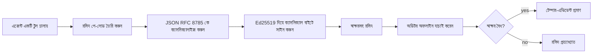

[পাঠ ভিডিও দেখুন: ক্রিপ্টোগ্রাফিক রসিদ সহ AI এজেন্ট সুরক্ষা](https://youtu.be/PLACEHOLDER_VIDEO_ID)

> _(পাঠ ভিডিও এবং থাম্বনেইল মাইক্রোসফ্ট কনটেন্ট টিম দ্বারা মার্জের পর যোগ করা হবে, যা পাঠ ১৪ / ১৫ প্যাটার্নের সাথে মেলে।)_

# ক্রিপ্টোগ্রাফিক রসিদ সহ AI এজেন্ট সুরক্ষা

## পরিচিতি

এই পাঠটিতে আলোচনা করা হবে:

- কেন AI এজেন্টের জন্য অডিট ট্রেইল সামঞ্জস্যতা, ডিবাগিং এবং বিশ্বাসের জন্য গুরুত্বপূর্ণ।
- ক্রিপ্টোগ্রাফিক রসিদ কী এবং এটি একটি অস্বাক্ষরিত লগ লাইনের থেকে কীভাবে আলাদা।
- সাধারণ পাইথন-এ এজেন্টের টুল কলের জন্য একটি স্বাক্ষরিত রসিদ কীভাবে তৈরি করবেন।
- কীভাবে রসিদ অফলাইনে যাচাই করবেন এবং টেম্পারিং সনাক্ত করবেন।
- কীভাবে রসিদগুলো চেইন করবেন যাতে একটি মুছে ফেলা বা পুনর্বিন্যাস করলে চেইন ভেঙে যায়।
- রসিদগুলো কী প্রমাণ করে এবং তারা স্পষ্টভাবে কী প্রমাণ করে না।

## শিক্ষার লক্ষ্য

এই পাঠটি শেষ করার পর আপনি জানতে পারবেন কীভাবে:

- এজেন্টের ক্রিয়াকলাপের জন্য ক্রিপ্টোগ্রাফিক প্রোভেন্যান্সকে উত্সাহিত করে এমন ব্যর্থতা মোড চিহ্নিত করতে।
- একটি ক্যানোনিক্যাল JSON পেইলোডের উপর Ed25519-স্বাক্ষরিত রসিদ তৈরি করতে।
- ছাপিকৃত ব্যক্তির পাবলিক কী ব্যবহার করে একটি রসিদ স্বাধীনভাবে যাচাই করতে।
- পরিবর্তিত রসিদে যাচাই পুনরায় চালিয়ে টেম্পারিং সনাক্ত করতে।
- রসিদের একটি হ্যাশ-চেইনড সিকোয়েন্স তৈরি করতে এবং কেন চেইন গুরুত্বপূর্ণ তা ব্যাখ্যা করতে।
- কী রসিদ প্রমাণ করে (অ্যাট্রিবিউশন, অখণ্ডতা, ক্রম), এবং কী তারা প্রমাণ করে না (কর্মের সঠিকতা, নীতির প্রামাণিকতা) তা চিনতে।

## সমস্যা: আপনার এজেন্টের অডিট ট্রেইল

ধরা যাক আপনি Contoso Travel-এর জন্য একটি AI এজেন্ট মোতায়েন করেছেন। এজেন্ট গ্রাহকের অনুরোধ পড়ে, ফ্লাইট API কল করে অপশন খোঁজে এবং গ্রাহকের পক্ষ থেকে আসন বুক করে। গত ত্রৈমাসিকে, এজেন্ট ৫০,০০০টি বুকিং সম্পন্ন করেছে।

আজ একজন অডিটর আসেন। তারা একটি সাধারণ প্রশ্ন করেন: "আমাকে দেখাও আপনার এজেন্ট কী করেছে।"

আপনি আপনার লগ ফাইলগুলি দেন। অডিটর সেগুলি দেখে একটি কঠিন প্রশ্ন করেন: "আমি কীভাবে জানব এই লগগুলি সম্পাদিত হয়নি?"

এই হলো অডিট-ট্রেইল সমস্যা। আজকের বেশিরভাগ এজেন্ট মোতায়েন সাধারণত নির্ভর করে:

- **অ্যাপ্লিকেশন লগসমূহ**: এজেন্ট নিজেই লেখে, যেকেউ ফাইল-সিস্টেমে প্রবেশাধিকার থাকলে সম্পাদনা করতে পারে।
- **ক্লাউড লগিং সার্ভিসসমূহ**: প্ল্যাটফর্ম স্তরে টেম্পার-এভিডেন্ট কিন্তু কেবলমাত্র অডিটর যদি প্ল্যাটফর্ম অপারেটরকে বিশ্বাস করে।
- **ডাটাবেস ট্রানজ্যাকশন লগসমূহ**: ডাটাবেস পরিবর্তনের জন্য উপযুক্ত কিন্তু যেকোনো টুল কলের জন্য নয়।

এরা কেউই অডিটরের প্রশ্নের উত্তর দিতে পারে না যদি না তারা কাউকে বিশ্বাস করার প্রয়োজন হয় (আপনি, আপনার ক্লাউড প্রদানকারী, আপনার ডাটাবেস বিক্রেতা)। অভ্যন্তরীণ ব্যবহারে সেই বিশ্বাস বেশ গ্রহণযোগ্য। নিয়ন্ত্রিত ওয়ার্কলোডের জন্য (আর্থিক, স্বাস্থ্যসেবা, EU AI অ্যাক্টের আওতাধীন যেকোনো কিছু), তা গ্রহণযোগ্য নয়।

ক্রিপ্টোগ্রাফিক রসিদ এটি সমাধান করে প্রতি এজেন্ট ক্রিয়াকলাপকে স্বাধীনভাবে যাচাইযোগ্য করে। অডিটর আপনাকে বিশ্বাস করার প্রয়োজন নেই। তাদের প্রয়োজন কেবল আপনার পাবলিক কী এবং রসিদ নিজেই।

## ক্রিপ্টোগ্রাফিক রসিদ কী?

একটি রসিদ হলো একটি JSON অবজেক্ট যা এজেন্ট কী করেছে তা রেকর্ড করে, একটি ডিজিটাল স্বাক্ষর দিয়ে স্বাক্ষরিত।


```mermaid
flowchart LR
    A[এজেন্ট একটি টুল চালায়] --> B[রসিদ পে-লোড তৈরি করুন]
    B --> C[JSON RFC 8785 কে ক্যাননিক্যালাইজ করুন]
    C --> E[Ed25519 দিয়ে ক্যাননিক্যাল বাইটে সাইন করুন]
    E --> F[স্বাক্ষরসহ রসিদ]
    F --> G[অডিটর অফলাইন যাচাই করেন]
    G --> H{স্বাক্ষর বৈধ?}
    H -- yes --> I[টেম্পার-এভিডেন্ট প্রমাণ]
    H -- no --> J[রসিদ প্রত্যাখ্যাত]
```

একটি ন্যূনতম রসিদ এই রকম দেখায়:

```json
{
  "type": "agent.tool_call.v1",
  "agent_id": "contoso-travel-bot",
  "tool_name": "lookup_flights",
  "tool_args_hash": "sha256:a3f9c1...",
  "result_hash": "sha256:7b2e1d...",
  "policy_id": "contoso-travel-policy-v3",
  "timestamp": "2026-04-25T14:30:00Z",
  "sequence": 47,
  "previous_receipt_hash": "sha256:9d4e6a...",
  "signature": {
    "alg": "EdDSA",
    "sig": "c5af83...",
    "public_key": "8f3b2c..."
  }
}
```

তিনটি গুণাবলী কাজ করছে:

১. **স্বাক্ষর**। রসিদটি এজেন্টের গেটওয়ে দ্বারা Ed25519 ব্যক্তিগত কী দিয়ে স্বাক্ষরিত। সংশ্লিষ্ট পাবলিক কী থাকা যেকেউ স্বাক্ষর অফলাইনে যাচাই করতে পারে। যেকোনো ক্ষেত্র পরিবর্তনে স্বাক্ষর অবৈধ হয়।

২. **ক্যানোনিক্যাল এনকোডিং**। স্বাক্ষরের আগে, রসিদ JSON Canonicalization Scheme (JCS, RFC ৮৭৮৫) ব্যবহার করে সিরিয়ালাইজ করা হয়। এটি নিশ্চিত করে যে একই রকজরত রসিদ তৈরি করার দুটি ইমপ্লিমেন্টেশন বাইট-পরিচিত আউটপুট তৈরি করবে। Canonicalization ছাড়া বিভিন্ন JSON সিরিয়ালাইজার একই বিষয়বস্তুর জন্য ভিন্ন স্বাক্ষর তৈরি করবে।

৩. **হ্যাশ চেইনিং**।  `previous_receipt_hash` ক্ষেত্রটি প্রতিটি রসিদকে এর পূর্ববর্তী রসিদের সাথে লিঙ্ক করে। একটি রসিদ মুছে ফেলা বা পুনর্বিন্যাস করলে সেটির পরের প্রতিটি রসিদ ভেঙে যাবে। চেইনে টেম্পারিং দৃশ্যমান হয় যদিও ব্যক্তিগত স্বাক্ষর পাশ কাটানো হয়।

একত্রে এই গুণাবলী তিনটি নিশ্চয়তা দেয়:

- **অ্যাট্রিবিউশন**: এই কী এই বিষয়বস্তুতে স্বাক্ষর করেছে।
- **অখণ্ডতা**: স্বাক্ষর করার পর বিষয়বস্তু পরিবর্তিত হয়নি।
- **ক্রম**: এই রসিদটি চেইনে ঐ রসিদের পরে এসেছে।

## পাইথনে রসিদ তৈরি করা

রসিদ তৈরি করতে কোনও বিশেষ লাইব্রেরির প্রয়োজন নেই। ক্রিপ্টোগ্রাফিক প্রিমিটিভগুলি সহজলভ্য এবং লজিকটি কয়েক ডজন পাইথন লাইনে সীমাবদ্ধ।

`code_samples/18-signed-receipts.ipynb`-এর হাতে-কলমে অনুশীলনগুলো সম্পূর্ণ প্রবাহ দেখায়। সংক্ষেপে:

```python
import json
import hashlib
import base64
from nacl import signing
from jcs import canonicalize  # RFC 8785 ক্যানোনিক্যাল JSON

def b64url_nopad(data: bytes) -> str:
    return base64.urlsafe_b64encode(data).decode("ascii").rstrip("=")

def sha256_canonical(obj) -> str:
    """SHA-256 of a Python object's JCS-canonical JSON form."""
    return f"sha256:{hashlib.sha256(canonicalize(obj)).hexdigest()}"

# একটি সাইনিং কী তৈরি করুন বা লোড করুন (প্রোডাকশনে, কী ভল্টে সংরক্ষণ করুন)
signing_key = signing.SigningKey.generate()
verify_key = signing_key.verify_key

# রসিদ পে-লোড তৈরি করুন (এখনও স্বাক্ষর নেই)
tool_args = {"origin": "SYD", "destination": "LAX"}
tool_result = [{"flight": "QF11", "price": 1850, "stops": 0}]

payload = {
    "type": "agent.tool_call.v1",
    "agent_id": "contoso-travel-bot",
    "tool_name": "lookup_flights",
    "tool_args_hash": sha256_canonical(tool_args),
    "result_hash": sha256_canonical(tool_result),
    "policy_id": "contoso-travel-policy-v3",
    "timestamp": "2026-04-25T14:30:00Z",
    "sequence": 0,
    "previous_receipt_hash": None,
}

# JCS বাইটগুলি সরাসরি ক্যানোনিক্যালাইজ এবং স্বাক্ষর করুন। PureEdDSA অভ্যন্তরীণভাবে হ্যাশ করে।
canonical_bytes = canonicalize(payload)
signature_bytes = signing_key.sign(canonical_bytes).signature

# একটি গঠিত স্বাক্ষর অবজেক্ট সংযুক্ত করুন।
receipt = {
    **payload,
    "signature": {
        "alg": "EdDSA",
        "sig": b64url_nopad(signature_bytes),
        "public_key": b64url_nopad(bytes(verify_key)),
    },
}
```

এটাই সম্পূর্ণ স্বাক্ষর প্রক্রিয়া। নোটবুকে প্রতিটি ধাপ ব্যাখ্যা করা হয়েছে।

## রসিদ যাচাই এবং টেম্পারিং সনাক্তকরণ

যাচাই বিপরীত অপারেশন:

```python
import base64
import hashlib
from nacl import signing
from nacl.exceptions import BadSignatureError
from jcs import canonicalize

def b64url_decode(s: str) -> bytes:
    padding = "=" * ((4 - len(s) % 4) % 4)
    return base64.urlsafe_b64decode(s + padding)

def verify_receipt(receipt: dict) -> bool:
    # স্বাক্ষর একটি কাঠামোগত অবজেক্ট: {"alg", "sig", "public_key"}.
    sig_obj = receipt.get("signature")
    if not sig_obj or sig_obj.get("alg") != "EdDSA":
        return False

    # আসলে যা সাইন করা হয়েছিল এমন পে-লোডটি পুনর্গঠন করুন (স্বাক্ষর ছাড়া সব কিছু).
    payload = {k: v for k, v in receipt.items() if k != "signature"}

    canonical_bytes = canonicalize(payload)

    try:
        verify_key = signing.VerifyKey(b64url_decode(sig_obj["public_key"]))
        verify_key.verify(canonical_bytes, b64url_decode(sig_obj["sig"]))
        return True
    except BadSignatureError:
        return False
```

এই ফাংশনটি একটি রসিদ নেয় এবং স্বাক্ষর বৈধ হলে `True`, অন্যথায় `False` রিটার্ন করে। কোনও নেটওয়ার্ক কল, পরিষেবা নির্ভরতা, তৃতীয় পক্ষের উপর اعتماد প্রয়োজন হয় না।

টেম্পারিং সনাক্তকরণ প্রদর্শনের জন্য, নোটবুকটি নিম্নলিখিত ধাপ দেখায়:

১। একটি বৈধ রসিদ তৈরি করা এবং যাচাই নিশ্চিত করা।
২। `tool_args_hash` ফিল্ডের এক বাইট পরিবর্তন করা।
৩। যাচাই পুনরায় চালিয়ে দেখা যায় ব্যর্থ।

এটি বাস্তবিক প্রমাণ যে রসিদগুলি টেম্পার-এভিডেন্ট: কোনও পরিবর্তন, যত ছোটই হোক, স্বাক্ষর ভেঙে দেয়।

## মাল্টি-স্টেপ এজেন্টের জন্য রসিদ চেইনিং

একটি স্বাক্ষরিত রসিদ একটি কাজ রক্ষা করে। একাধিক রসিদের চেইন একটি সিকোয়েন্স রক্ষা করে।


```mermaid
flowchart LR
    R0[রশিদ 0<br/>উত্পত্তি] --> R1[রশিদ 1]
    R1 --> R2[রশিদ 2]
    R2 --> R3[রশিদ 3]
    R1 -. previous_receipt_hash .-> R0
    R2 -. previous_receipt_hash .-> R1
    R3 -. previous_receipt_hash .-> R2
```

প্রতিটি রসিদ পূর্ববর্তী রসিদের হ্যাশ রেকর্ড করে। রসিদ ২ নিরপেক্ষভাবে মুছে ফেলার জন্য, কোনও আক্রমণকারীকে করতে হবে:

- রসিদ ৩ এর `previous_receipt_hash` ক্ষেত্র পরিবর্তন করা (রসিদ ৩ এর স্বাক্ষর ভাঙবে), অথবা
- পরিবর্তিত রসিদ ৩ উপর নতুন স্বাক্ষর তৈরি করা (এজেন্টের ব্যক্তিগত কী প্রয়োজন)।

যদি ব্যক্তিগত কী হার্ডওয়্যার কী ভল্টে থাকে এবং আপনি প্রতিটি রসিদসহ পাবলিক কী প্রকাশ করেন, তখন কোনও আক্রমণ সনাক্তকরণের বাইরে সম্ভব নয়।

নোটবুকটি দেখায়:

১। তিনটি রসিদের চেইন তৈরি করা।
২। যাচাই করা যে প্রতিটি রসিদের `previous_receipt_hash` পূর্ববর্তী রসিদের প্রকৃত হ্যাশের সাথে মেলে।
৩। মধ্যবর্তী একটি রসিদে টেম্পারিং করা এবং চেইন ভেঙে যাওয়া দেখতে।

এইভাবেই আপনি একটি অডিট ট্রেইল তৈরি করেন যা একটি বাইরের অডিটর আপনার উপর বিশ্বাস না করেও যাচাই করতে পারে।

## রসিদ কী প্রমাণ করে (এবং কী প্রমাণ করে না)

এই বিভাগটি এই পাঠের সবচেয়ে গুরুত্বপূর্ণ অংশ। রসিদ শক্তিশালী কিন্তু তাদের ক্ষমতা সীমাবদ্ধ।

**রসিদ তিনটি বিষয় প্রমাণ করে:**

১। **অ্যাট্রিবিউশন**: একটি নির্দিষ্ট কী একটি নির্দিষ্ট পেইলোডে স্বাক্ষর করেছে।
২। **অখণ্ডতা**: স্বাক্ষরের পর থেকে পেইলোড পরিবর্তিত হয়নি।
৩। **ক্রম**: এই রসিদ চেইনে ঐ রসিদের পরে এসেছে।

**রসিদ প্রমাণ করে না:**

১। **সঠিকতা**: যে এজেন্টের কাজ সঠিক কাজ ছিল। একটি ভুল উত্তরের জন্যও রসিদ স্বাক্ষরিত হতে পারে ঠিক যেমন সঠিক উত্তরের জন্য হয়।
২। **নীতি সামঞ্জস্যতা**: `policy_id`-এ উল্লেখিত নীতি সত্যিই মূল্যায়ন করা হয়েছে বা পরীক্ষা করলে এই কাজ অনুমোদিত হতো। রসিদে যা দাবী করা হয়েছে তা রেকর্ড করা হয়, যা প্রয়োগ করা হয়েছে তা নয়।
৩। **কীর বাইরে পরিচিতি**: রসিদ বলে "এই কী এই বিষয়বস্তুতে স্বাক্ষর করেছে।" এটি বলে না "এই মানুষ অনুমোদন করেছেন।" একটি কীকে একজন ব্যক্তি বা সংস্থার সাথে সংযুক্ত করতে আলাদা পরিচয় অবকাঠামো প্রয়োজন (ডিরেক্টরি, পাবলিক কী রেজিস্ট্রি ইত্যাদি)।
৪। **ইনপুটের সত্যতা**: যদি এজেন্ট ধোঁকাবাজ প্রম্পট পায় এবং তার ভিত্তিতে কাজ করে, রসিদ সেটি সঠিকভাবে রেকর্ড করে। রসিদ ইনপুট ভ্যালিডেশনের অধীনস্থ, এটি তার বিকল্প নয়।

এই সীমার দুইটি কারণ গুরুত্বপূর্ণ:

- এটি বলে রসিদ কোন কাজে ব্যবহারযোগ্য: এজেন্ট আচরণ অডিটযোগ্য এবং টেম্পার-এভিডেন্ট করা, এমনকি সংস্থাগত সীমানা ছাড়িয়ে।
- এটি বলে আপনার আরও কোন অতিরিক্ত স্তর দরকার: ইনপুট ভ্যালিডেশন (পাঠ ৬), নীতি প্রয়োগ (নীচে সংক্ষেপে আলোচনা), এবং পরিচয় অবকাঠামো (এই পাঠের আওতায় নয়)।

একটি সাধারণ ভুল হলো "আমাদের রসিদ আছে" মানে "আমরা শাসিত" এমন ধারণা করা। তা নয়। রসিদ হলো ভিত্তি। শাসন হলো আপনি গড়ে তোলেন এমন ব্যবস্থা।

## একটি মানুষের অনুমোদন প্রমাণ করা

উপরের আইটেম ৩ নিজেই একটি অংশের যোগ্য: একটি কর্মকাণ্ড রসিদ বলে "এই কী এই বিষয়বস্তুতে স্বাক্ষর করেছে," কখনও "একজন মানুষ অনুমোদন করেছেন" না। উচ্চ ঝুঁকিপূর্ণ কাজের জন্য (রিফান্ড, মোছা, ওয়্যার ট্রান্সফার), শাসন কাঠামো ক্রমশেই সেই অনুপস্থিত বিবৃতি চায়, এবং এটি আপনি ইতিমধ্যে এই পাঠে নির্মিত প্রিমিটিভ দিয়ে তৈরি করতে পারেন।

ফলো-অন নোটবুক `code_samples/human-authorization-receipts.ipynb` একটি দ্বিতীয় রসদের ধরন যোগ করে, `human.approval.v1`, যা পাঠের রসিদের মতো একই খামে (এড২৫৫১৯ দ্বারা স্বাক্ষরিত টাইপ করা পেইলোড, যার `signature` অবজেক্ট স্বাক্ষরিত বাইটের বাইরে)। একটি নাম করা অনুমোদক সম্পূর্ণ ক্যানোনিক্যাল ক্রিয়াকলাপ এবং তার ডাইজেস্ট স্বাক্ষর করে; এজেন্টের কর্ম রসিদ একই কাজের ডাইজেস্ট এবং একটি `parent_approval_ref`, অনুমোদনের `receipt_hash`, যা আপনি উপরে তৈরি চেইনের `previous_receipt_hash` এর মতো। একটি `verify_chain` উভয় আর্টিফ্যাক্ট পৃথক পিনকৃত কী রেজিস্ট্রির অধীনে যাচাই করে (অনুমোদক কী বনাম এজেন্ট কী), ফলে কোড একই কিন্তু কর্তৃপক্ষ কখনও নয়।

এটি যে গুণাবলী দেয়, সতর্কভাবে বলা: *মানুষ এই নির্দিষ্ট কাজ অনুমোদন করেছে, এবং এজেন্ট ঠিক তাই অনুমোদিত কাজটি সম্পাদন করেছে।* নোটবুকের প্রত্যাখ্যানের ফিক্সচারগুলি এই গুণাবলীকে বাস্তব করে:

- ক্লাসিক সেট: টেম্পারিং, বিভ্রান্ত ডেপুটি, পুনর্খেলা, উভয় পাশে ছদ্মবল কী, খারাপ ইনপুট;
- **জটিল কর্তৃত্ব**: এমন একটি স্বাক্ষর যা এখনও যাচাই হয়, কিন্তু প্রত্যাখ্যাত কারণ নীতি সংস্করণ সরেছে, অনুমোদক কী পিনড রেজিস্ট্রি থেকে সরানো হয়েছে, বা অনুমোদন কার্যকর হওয়ার আগে মেয়াদোত্তীর্ণ হয়েছে;
- **ডাইজেস্ট প্রতিস্থাপন**: বৈধ স্বাক্ষরযুক্ত কর্ম রসিদ যা একটি *বাস্তব* অনুমোদনের দিকে নির্দেশ করে যা একটি *ভিন্ন* ক্যানোনিক্যাল ক্রিয়াকলাপ বান্ধে।

প্রত্যেক ব্যর্থতা আলাদা কারণ জানান দেয়, তাই একটি অডিটর প্রত্যাখ্যান পড়ে বুঝতে পারে কর্তৃত্ব জটিল হলো নাকি করণীয় পরিবর্তিত হয়েছে। নোটবুক যা শিখায়: একটি স্বাক্ষরিত অনুমোদন নিজেই কর্তৃত্ব নয়। কর্তৃত্ব বিদ্যমান কেবল যদি উভয় রসিদ একই ক্যানোনিক্যাল কর্মের সাথে চলমান সময়ে বাঁধা থাকে। মানব-অনুমোদন রসিদ একটি শিক্ষামূলক সংযোজন যা এই পাঠ দ্বারা সংজ্ঞায়িত, `draft-farley-acta-signed-receipts` দ্বারা সংজ্ঞায়িত রসিদের ধরন নয়।

## প্রোডাকশন রেফারেন্স

এই পাঠের পাইথন কোড ইচ্ছাকৃতভাবে ন্যূনতম যাতে আপনি প্রতিটি লাইন পড়ে সঠিকভাবে বুঝতে পারেন কী ঘটছে। প্রোডাকশনে আপনি দুটি বিকল্প পাবেন:

১। **ক্রিপ্টোগ্রাফিক প্রিমিটিভ সরাসরি ব্যবহার করুন।** উপরে প্রদর্শিত ৫০ লাইন অনেক ব্যবহারের জন্য যথেষ্ট। PyNaCl (Ed25519) এবং `jcs` প্যাকেজ (ক্যানোনিক্যাল JSON) সুপরিচালিত ও অডিট করা লাইব্রেরি।

২। **একটি প্রোডাকশন রসিদ লাইব্রেরি ব্যবহার করুন।** কয়েকটি ওপেন সোর্স প্রকল্প একই প্যাটার্ন বাস্তবায়ন করে অতিরিক্ত বৈশিষ্ট্য সহ (কী রোটেশন, ব্যাচ যাচাই, JWK সেট বিতরণ, নীতি ইঞ্জিনের সাথে ইন্টিগ্রেশন):
   - স্বাক্ষর প্রক্রিয়াটি একটি স্বাধীন IETF ইন্টারনেট-ড্রাফ্ট ([`draft-farley-acta-signed-receipts`](https://datatracker.ietf.org/doc/draft-farley-acta-signed-receipts/), সংস্করণ ০২) এর JCS এবং স্বাক্ষর-স্কোপ রীতিনীতির ব্যবহার করে। এই পাঠের ফ্ল্যাট শিক্ষামূলক রসিদ ড্রাফ্টের `{payload, signature}` খামের থেকে আলাদা এবং এটি একটি সম্মত বাস্তবায়ন হিসেবে উপস্থাপিত নয়। ড্রাফ্ট তার তার তার তার তার তার তার তার তার তার তার তার তার তার তার তার তার তার তার তার তার তার তার তার তার তার তার তার ভাগ করে দেয় ([agent-governance-testvectors](https://github.com/ScopeBlind/agent-governance-testvectors)) তার তার তার তার তার তার তার তার তার তার তার তার তার তার তার তার তার তার তার তার তার তার তার তার তার তার তার তার তার তার তার তার তার তার তার তার তার তার তার তার তার তার তার তার তার তার তার এর জন্য।
   - মাইক্রোসফ্ট এজেন্ট গভর্নেন্স টুলকিট রসিদগুলোকে সিডার-ভিত্তিক নীতি সিদ্ধান্তের সাথে সম্মিলিত করে; সেই রেপোজিটরির টিউটোরিয়াল ৩৩ দেখুন একটি সম্পূর্ণ উদাহরণের জন্য।
   - `protect-mcp` (npm) এবং `@veritasacta/verify` (npm) প্যাকেজগুলো নোড ভিত্তিক রসিদ স্বাক্ষর এবং অফলাইন যাচাই সরবরাহ করে, যেটি যেকোন MCP সার্ভারের জন্য টেম্পার-এভিডেন্ট অডিট ট্রেইল প্যাকেজিংয়ের উদ্দেশ্যে, যার মধ্যে আছে একটি ধরে রাখা সহ-স্বাক্ষর প্রবাহ যেখানে বিরতকৃত কাজ একটি অনুমোদন রসিদ নির্গত করে যা কাজের ডাইজেস্টে বাঁধা (ডেস্কটপ প্রবাহে WebAuthn সমর্থিত), যা মানুষের অনুমোদন নোটবুকের মতো স্বাক্ষর-রসিদ প্যাটার্ন।
   - **[nobulex](https://github.com/arian-gogani/nobulex)** পাইথন SDK (`pip install nobulex`) পাইথনে একই Ed25519 + JCS স্বাক্ষর প্যাটার্ন LangChain এবং CrewAI ইন্টিগ্রেশনসহ প্রদান করে, প্রকাশিত ক্রস-ভ্যালিডেশন টেস্ট ভেক্টর এবং সামঞ্জস্য মানচিত্র সহ যা [OWASP PR #2210](https://github.com/OWASP/CheatSheetSeries/pull/2210) দ্বারা অবদান রাখা হয়েছে।

নিজে থেকে তৈরি করা এবং লাইব্রেরি ব্যবহারের সিদ্ধান্ত JWT লাইব্রেরি লেখার বা পরীক্ষিত একটি ব্যবহার করার সিদ্ধান্তের মতোই: উভয়ই যুক্তিযুক্ত; লাইব্রেরি সময় বাঁচায় এবং অডিট পৃষ্ঠতলের পরিমাণ কমায়; নিজে থেকেই তৈরি করা আপনাকে প্রতিটি প্রিমিটিভ বুঝতে বাধ্য করে। এই পাঠটি নিজে থেকে তৈরি পথ শেখায় যাতে উভয়ের জন্য ভিত্তি থাকে।

## জ্ঞান যাচাই

অনুশীলন করার আগে আপনার বোঝাপড়া পরীক্ষা করুন।

**১। একটি রসিদ এজেন্টের ব্যক্তিগত Ed25519 কী দিয়ে স্বাক্ষরিত। অডিটরের কাছে কেবলমাত্র পাবলিক কী আছে। কি অডিটর অফলাইনে রসিদ যাচাই করতে পারে?**

<details>
<summary>উত্তর</summary>

হ্যাঁ। Ed25519 যাচাইয়ের জন্য কেবল পাবলিক কী এবং স্বাক্ষরিত বাইট প্রয়োজন। কোনও নেটওয়ার্ক কল বা পরিষেবা নির্ভরতা লাগে না। এই গুণাবলী রসিদগুলোকে এয়ার-গ্যাপড, বহু-সংগঠন বা কম-আস্থা সম্পন্ন অডিটিং সেটিংসে ব্যবহারযোগ্য করে তোলে।
</details>

**২। একজন আক্রমণকারী একটি রসিদের `policy_id` ক্ষেত্র পরিবর্তন করে দাবি করে এটি একটি বেশি শিথিল নীতির অধীনে নিয়ন্ত্রিত ছিল। স্বাক্ষর মূল পেইলোডে ছিল। যাচাইকালে কী ঘটে?**

<details>
<summary>উত্তর</summary>


যাচাই ব্যর্থ হয়। স্বাক্ষরটি মূল পেলোডের ক্যানোনিক্যাল বাইটের উপর গণনা করা হয়েছিল; কোন ক্ষেত্র পরিবর্তন করলে সেই বাইটগুলি পরিবর্তিত হয়, যা স্বাক্ষরকে অবৈধ করে তোলে। আক্রমণকারীকে একটি নতুন বৈধ স্বাক্ষর তৈরি করার জন্য ব্যক্তিগত চাবি প্রয়োজন, যা তাদের নেই।
</details>

**৩. রসিদে কেন কাঁচা আর্গুমেন্ট এবং ফলাফলের পরিবর্তে `tool_args_hash` এবং `result_hash` অন্তর্ভুক্ত করা হয়?**

<details>
<summary>উত্তর</summary>

দুটি কারণ। প্রথমত, রসিদটি এমন পরিবেশে সংরক্ষণ বা প্রেরণ করা হতে পারে যেখানে কাঁচা বিষয়বস্তু (PII, ব্যবসায়িক ডেটা) ফাঁস হওয়া একটি সমস্যা। হ্যাশিং রসিদকে ছোট এবং বিষয়বস্তুকে গোপন রাখে; অডিটর যাচাই করে যে হ্যাশটি বাস্তব বিষয়বস্তু স্টোর করা আলাদা কপির সাথে মিলে কিনা। দ্বিতীয়ত, হ্যাশের একটি নির্দিষ্ট মাপ থাকে; হ্যাশ সহ রসিদের আকার ইনপুট এবং আউটপুট যত বড় হোক না কেন সীমাবদ্ধ থাকে।
</details>

**৪. `previous_receipt_hash` ক্ষেত্র প্রতিটি রসিদকে এর পূর্বসূরীর সাথে যুক্ত করে। যদি একজন আক্রমণকারী চেনের মাঝ থেকে একটি রসিদ নির্বিঘ্নে মুছে ফেলে, তাহলে কী অবৈধ হয়ে পড়ে?**

<details>
<summary>উত্তর</summary>

মুছে ফেলা রসিদের পরবর্তী প্রতিটি রসিদ অবৈধ হয়ে যায়। তাদের `previous_receipt_hash` ক্ষেত্রগুলি প্রকৃত চেনের সাথে মেলে না (কারণ তারা যে রসিদটি উল্লেখ করেছিল সেটি আর নেই, অথবা চেনটি এখন ভিন্ন পূর্বসূরীর দিকে নির্দেশ করছে)। মুছে ফেলা লুকানোর জন্য, আক্রমণকারীকে পরবর্তী প্রত্যেক রসিদ পুনরায় স্বাক্ষর করতে হবে, যা ব্যক্তিগত চাবি প্রয়োজন।
</details>

**৫. একটি রসিদ পরিষ্কারভাবে যাচাই হয়ে যায়। এটি কি প্রমাণ করে যে এজেন্টের কর্ম সঠিক, সাউন্ড, বা নীতিমালা অনুসারে ছিল?**

<details>
<summary>উত্তর</summary>

না। একটি বৈধ রসিদ তিনটি বিষয় প্রমাণ করে: অ্যাট্রিবিউশন (এই চাবি এই বিষয়বস্তুতে স্বাক্ষর করেছে), অখণ্ডতা (বিষয়বস্তু পরিবর্তিত হয়নি), এবং ক্রম (এই রসিদটি ঐ রসিদের পর এসেছে)। এটি প্রমাণ করে না যে কর্মটি সঠিক ছিল, `policy_id` তে নামকৃত নীতিমালা আসলেই মূল্যায়িত হয়েছিল, অথবা এজেন্ট প্রতিটি নিয়ম অনুসরণ করেছে। রসিদগুলোর মাধ্যমে এজেন্টের আচরণ অডিটযোগ্য হয়, তাও প্রয়োজনীয়ভাবে সঠিক নয়। এটি এই পাঠের সবচেয়ে গুরুত্বপূর্ণ সীমানা।
</details>

## চর্চার ব্যায়াম

`code_samples/18-signed-receipts.ipynb` খুলে সব চারটি সেকশন সম্পন্ন করুন:

১. **সেকশন ১**: আপনার প্রথম রসিদে স্বাক্ষর করুন এবং যাচাই করুন।
২. **সেকশন ২**: রসিদে ছিন্নছাড়া করুন এবং যাচাই ব্যর্থ দেখুন।
৩. **সেকশন ৩**: তিনটি রসিদের চেন তৈরি করুন এবং চেনের অখণ্ডতা যাচাই করুন।
৪. **সেকশন ৪**: Microsoft Agent Framework দিয়ে নির্মিত একটি এজেন্টে প্যাটার্নটি প্রয়োগ করুন: একটি টুল কল রসিদ-স্বাক্ষরে মোড়ান, তারপর রসিদটি স্বাধীনভাবে যাচাই করুন।

**স্ট্রেচ চ্যালেঞ্জ ১:** আপনার পছন্দমত একটি অতিরিক্ত ক্ষেত্র যুক্ত করে রসিদ স্কিমাটি সম্প্রসারণ করুন (উদাহরণস্বরূপ, ট্রেসিংয়ের জন্য একটি রিকোয়েস্ট আইডি), ক্যানোনিক্যাল স্বাক্ষর লজিক আপডেট করুন তা অন্তর্ভুক্ত করতে, এবং নিশ্চিত করুন রসিদ এখনও যাচাই হয়ে যায়। তারপর স্বাক্ষর করার পর ক্ষেত্রটি পরিবর্তন করুন এবং নিশ্চিত করুন যাচাই ব্যর্থ হয়। এটি আপনাকে শেখায় ক্যানোনিক্যাল এনকোডিং এর প্রতিটি বাইট কিভাবে স্বাক্ষরে প্রভাব ফেলে।

**স্ট্রেচ চ্যালেঞ্জ ২:** আপনার দুটি রসিদের একসঙ্গে SHA-256 হ্যাশ করুন (নির্ণায়ক ক্রমে তাদের ক্যানোনিক্যাল বাইট সংযুক্ত করুন) এবং সৃষ্ট ডাইজেস্টটি তৃতীয় রসিদের নতুন একটি ক্ষেত্র হিসেবে সংযোজন করুন স্বাক্ষর করার আগে। যাচাই করুন যে তিনটি রসিদ এখনও সঠিকভাবে যাচাই হয়। আপনি মাত্রই এক ধাপে অন্তর্ভুক্তি প্রমাণ তৈরি করেছেন: যিনি তৃতীয় রসিদটি রাখেন, তারা প্রমাণ করতে পারেন প্রথম দুইটি স্বাক্ষরের সময় উপস্থিত ছিল, তাদের বিষয়বস্তু প্রকাশ না করেই। এটিই সেই প্যাটার্ন যা নির্বাচনী প্রকাশ রসিদগুলো ব্যাপকভাবে ব্যবহার করে (মার্কেল কমিটমেন্ট, RFC 6962)।

## উপসংহার

ক্রিপ্টোগ্রাফিক রসিদ এআই এজেন্টদের একটি অডিট ট্রেল দেয় যা:

- **স্বাধীনভাবে যাচাইযোগ্য:** যেকোনো পক্ষ পাবলিক কী দিয়ে যাচাই করতে পারে, কোন সেবা নির্ভরতা নেই।
- **ছিন্নছাড়া প্রতিরোধী:** কোন পরিবর্তন করলে স্বাক্ষর অবৈধ হয়।
- **বহনযোগ্য:** একটি রসিদ একটি ছোট JSON ফাইল; এটি সংরক্ষণ, প্রেরণ, এবং যেকোনো জায়গায় যাচাই করা যায়।
- **স্ট্যান্ডার্ড সমর্থিত:** Ed25519 (RFC 8032), JCS (RFC 8785), এবং SHA-256 এর উপর নির্মিত, সবই ব্যাপকভাবে ব্যবহৃত প্রিমিটিভ।

এগুলো ইনপুট যাচাই, নীতি বাস্তবায়ন, বা পরিচয় অবকাঠামোর বিকল্প নয়। এগুলো ঐ স্তরগুলোর জন্য একটি ভিত্তি। যখন আপনি রেগুলেটেড ওয়ার্কলোড, বহু-সংগঠন কর্মপ্রবাহ, বা এমন কোনো পরিবেশে এজেন্ট স্থাপন করেন যেখানে ভবিষ্যৎ কোনো অডিটর আপনার প্রতি বিশ্বাসযোগ্য নাও হতে পারে, তখন রসিদই হল সৎ অডিট ট্রেল তৈরির উপায়।

সবচেয়ে গুরুত্বপূর্ণ শিক্ষা: রসিদ প্রমাণ করে কে কখন কি বলেছে। তারা প্রমাণ করে না যে বলা হয়েছে তা সঠিক বা সত্য। এই পার্থক্যটি কঠোরভাবে বুঝে রাখা জরুরি। এটি সতর্ক উৎপত্তি ব্যবস্থা এবং বিভ্রান্তিকর ব্যবস্থার মধ্যে পার্থক্য।

## প্রোডাকশন চেকলিস্ট

যখন আপনি এই পাঠ থেকে গ্র্যাজুয়েট হয়ে একটি বাস্তব পরিবেশে রসিদ-স্বাক্ষরিত এজেন্ট মোতায়েন করতে প্রস্তুত:

- [ ] **ডেভেলপার ল্যাপটপ থেকে স্বাক্ষর চাবি সরান।** Azure Key Vault, AWS KMS, অথবা হার্ডওয়্যার সিকিউরিটি মডিউল ব্যবহার করুন। আপনার রসিদে স্বাক্ষরকারী ব্যক্তিগত চাবিটি কখনো সোর্স কন্ট্রোল বা অ্যাপ্লিকেশন মেশিনে খোলাখুলিভাবে থাকা যাবে না।
- [ ] **যাচাই পাবলিক কী প্রকাশ করুন।** অডিটররা অফলাইন যাচাই করার জন্য এটিকে প্রয়োজন। মানক প্যাটার্ন হ’ল একটি JWK সেট ভালোভাবে পরিচিত URL-এ (RFC 7517), যেমন `https://your-org.example.com/.well-known/agent-keys.json`।
- [ ] **চেন বাইরের কাছে আঙ্কর করুন।** নিয়মিত সর্বশেষ চেন হেড হ্যাশটি একটি ট্রান্সপারেন্সি লগে লিখুন (Sigstore Rekor, RFC 3161 টাইমস্ট্যাম্প অথরিটি, অথবা একটি দ্বিতীয় অভ্যন্তরীণ সিস্টেম) যাতে বাহ্যিক পক্ষ নিশ্চিত করতে পারে "এই চেনটি সেই সময় ছিল।"
- [ ] **রসিদগুলি অপরিবর্তনীয়ভাবে সংরক্ষণ করুন।** অ্যাপেন্ড-অনলি ব্লব স্টোরেজ (Azure Storage with immutability policies, AWS S3 Object Lock) অভ্যন্তরীণ কাউকে স্টোরেজ স্তরে ইতিহাস পুনঃলিখন থেকে আটকায়।
- [ ] **সংরক্ষণের সিদ্ধান্ত নিন।** অনেক কমপ্লায়েন্স নিয়মাবলী বহু বছরের সংরক্ষণ দাবি করে। রসিদের বৃদ্ধি পরিকল্পনা করুন (প্রতিটি রসিদের আকার প্রায় ৫০০ বাইট; যিনি দিনে ১০ হাজার কল করেন তার এজেন্ট বছরে প্রায় ১.৮ জিবি তৈরি করে)।
- [ ] **রসিদ যা কভার করে না তা ডকুমেন্ট করুন।** রসিদ অ্যাট্রিবিউশন, অখণ্ডতা, এবং ক্রম প্রমাণ করে। আপনার রাণবুক স্পষ্টভাবে তালিকা করবে আরো কোন নিয়ন্ত্রণ (ইনপুট যাচাই, নীতি বাস্তবায়ন, রেট লিমিটিং, পরিচয় অবকাঠামো) রসিদের governance অবস্থানের সাথে একসাথে দাঁড়ায়।

### AI এজেন্ট নিরাপত্তা সম্পর্কে আরও প্রশ্ন আছে?

[Microsoft Foundry Discord](https://aka.ms/ai-agents/discord) এ যোগ দিন অন্য শিক্ষার্থীদের সঙ্গে মেলামেশা করতে, অফিস আওয়ার এ অংশ নিতে, এবং আপনার AI এজেন্ট সংক্রান্ত প্রশ্নগুলোর উত্তর পেতে।

## এই পাঠের পরবর্তী

এই পাঠ কভার করে একক রসিদ স্বাক্ষর এবং হ্যাশ-চেইন সিকোয়েন্স। একই প্রিমিটিভস কিছুকিছু আরো উন্নত প্যাটার্নে গঠিত যা আপনার governance অবস্থান উন্নত হওয়ার সাথে দেখা যাবে:

- **নির্বাচনী প্রকাশ।** যখন একটি রসিদের ক্ষেত্রগুলি স্বাধীনভাবে কমিট করা হয় (RFC 6962-স্টাইল মার্কেল ট্রি), আপনি নির্দিষ্ট ক্ষেত্র নির্দিষ্ট অডিটরকে প্রকাশ করতে পারেন এবং বাকি অপরিবর্তিত প্রমাণ করতে পারেন, প্রকাশ না করে। কাজে লাগে যখন একই রসিদ একটি ব্যাপক অডিট (সম্পূর্ণতা চায়) এবং ডেটা-সীমাবদ্ধতা নিয়মাবলী যেমন GDPR (যা অডিটরকে কম দেখাতে চায়) একসঙ্গে পূরণ করতে হয়।
- **রসিদ বাতিল।** যদি স্বাক্ষর চাবি দুর্বল হয়ে যায়, আপনাকে একটি উপায় প্রয়োজন যাতে ঐ চাবি দ্বারা স্বাক্ষরিত সব রসিদ নির্দিষ্ট সময় থেকে অবিশ্বস্ত বলে চিহ্নিত করা যায়। স্ট্যান্ডার্ড প্যাটার্ন: স্বল্পকালীন স্বাক্ষর চাবি ও প্রকাশিত বাতিল তালিকা, অথবা বাতিল এন্ট্রি সহ একটি ট্রান্সপারেন্সি লগ।
- **দ্বিপাক্ষিক / বিভক্ত-স্বাক্ষর রসিদ।** কিছু বাস্তবায়নে স্বাক্ষরিত পেলোডটি প্রি-এক্সিকিউশন (`authorization_*`) এবং পোস্ট-এক্সিকিউশন (`result_*`) অংশে বিভক্ত হয় স্বাধীন স্বাক্ষর সহ, কাজে লাগে যখন অনুমোদন সিদ্ধান্ত এবং পর্যবেক্ষিত ফলাফল ভিন্ন অভিনেতা বা সময়ে তৈরি হয়। এটি এই পাঠে শেখানো রসিদ বিন্যাসের উপরে অতিরিক্ত রূপে গঠিত হয়।
- **পেলোড রচনা।** একটি রসিদ যা মূল্যমান আপনি `result_hash`-এ রাখেন সিল করে। বাস্তব পেলোডগুলো একক টুল কল ফলাফলের চাইতে ধনী: পূর্ব-সিদ্ধান্ত যুক্তি (মডেল পূর্বাভাস, বিবেচিত অপশন, প্রমাণ এবং তার পূর্ণতা, ঝুঁকি অবস্থান, জবাবদিহিতা চেইন, গেট আউটকাম) সব পেলোডের ভিতরে থাকতে পারে, একটি একক রসিদ দ্বারা সিল্ড। এটি রসিদ বিন্যাসকে ন্যূনতম রাখে, কিন্তু ক্ষেত্র স্কিমা যথাযথভাবে ডোমেইন অনুযায়ী পরিবর্তিত হতে দেয়।
- **ক্রস-বাস্তবায়ন সামঞ্জস্যতা।** একই রসিদ বিন্যাসের একাধিক স্বাধীন বাস্তবায়ন (Python, TypeScript, Rust, Go) সাধারণ টেস্ট ভেক্টরের বিরুদ্ধে পারস্পরিক যাচাই করে। আপনি যদি নিজের বাস্তবায়ন তৈরি করেন, প্রকাশিত ভেক্টরের বিরুদ্ধে যাচাই করলে তার সংযোগ সামঞ্জস্য নিশ্চিত হয়।
- **পোস্ট-কোয়ান্টাম মাইগ্রেশন।** Ed25519 আজ ব্যাপকভাবে ব্যবহৃত হলেও কোয়ান্টাম-প্রতিরোধী নয়। রসিদ বিন্যাস অ্যালগরিদম-সক্ষম: `signature.alg` ক্ষেত্রটি ধারণ করতে পারে `ML-DSA-65` (NIST পোস্ট-কোয়ান্টাম স্বাক্ষর স্ট্যান্ডার্ড) যখন আপনি স্থানান্তর করতে চান। একটি স্থানান্তর সময়কাল পরিকল্পনা করুন যেখানে রসিদগুলি দ্বৈত-স্বাক্ষরিত হয়।

## অতিরিক্ত উৎস

- <a href="https://datatracker.ietf.org/doc/draft-farley-acta-signed-receipts/" target="_blank">IETF Internet-Draft: Signed Decision Receipts for Machine-to-Machine Access Control</a>
- <a href="https://learn.microsoft.com/azure/ai-studio/responsible-use-of-ai-overview" target="_blank">দায়িত্বশীল AI ওভারভিউ (Azure AI)</a>
- <a href="https://datatracker.ietf.org/doc/html/rfc8032" target="_blank">RFC 8032: এডওয়ার্ডস-কাভার ডিজিটাল স্বাক্ষর অ্যালগরিদম (EdDSA)</a>
- <a href="https://datatracker.ietf.org/doc/html/rfc8785" target="_blank">RFC 8785: JSON ক্যানোনিক্যালাইজেশন স্কিম (JCS)</a>
- <a href="https://datatracker.ietf.org/doc/html/rfc6962" target="_blank">RFC 6962: সার্টিফিকেট ট্রান্সপারেন্সি</a> (নির্বাচনী প্রকাশ রসিদে ব্যবহৃত মার্কেল-ট্রি নির্মাণ)
- <a href="https://github.com/microsoft/agent-governance-toolkit/blob/main/docs/tutorials/33-offline-verifiable-receipts.md" target="_blank">Microsoft Agent Governance Toolkit, টিউটোরিয়াল ৩৩: অফলাইন-যাচাইযোগ্য সিদ্ধান্ত রসিদ</a>
- <a href="https://github.com/ScopeBlind/agent-governance-testvectors" target="_blank">ক্রস-বাস্তবায়ন সামঞ্জস্যতা টেস্ট ভেক্টর</a> এই পাঠে ব্যবহৃত রসিদ বিন্যাসের জন্য (Apache-2.0)
- <a href="https://pynacl.readthedocs.io/" target="_blank">PyNaCl ডকুমেন্টেশন</a> (Python এ Ed25519)

## পূর্ববর্তী পাঠ

[লোকাল AI এজেন্ট তৈরি](../17-creating-local-ai-agents/README.md)

---

<!-- CO-OP TRANSLATOR DISCLAIMER START -->
**অস্বীকৃতি**:
এই নথিটি AI অনুবাদ পরিষেবা [Co-op Translator](https://github.com/Azure/co-op-translator) ব্যবহার করে অনূদিত হয়েছে। যদিও আমরা শুদ্ধতার জন্য চেষ্টা করি, অনুগ্রহ করে মনে রাখবেন যে স্বয়ংক্রিয় অনুবাদে ত্রুটি বা অসঙ্গতি থাকতে পারে। মূল নথিটি তার স্বভাষায় কর্তৃত্বপূর্ণ উৎস হিসেবে বিবেচিত হওয়া উচিত। গুরুত্বপূর্ণ তথ্যের জন্য পেশাদার মানব অনুবাদ সুপারিশ করা হয়। এই অনুবাদের ব্যবহারে প্রয়োজনীয় ভুল বোঝাবুঝি বা ভুল ব্যাখ্যার জন্য আমরা দায়বদ্ধ নই।
<!-- CO-OP TRANSLATOR DISCLAIMER END -->