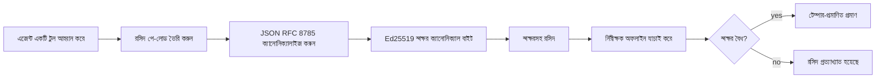
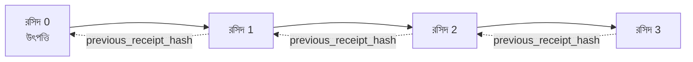

[পাঠের ভিডিও দেখুন: ক্রিপ্টোগ্রাফিক রসিদ সহ AI এজেন্ট নিরাপত্তা](https://youtu.be/PLACEHOLDER_VIDEO_ID)

> _(পাঠের ভিডিও এবং থাম্বনেইল মাইক্রোসফট কন্টেন্ট টিম ফিউশনের পর যোগ করবে, পাঠ ১৪ / ১৫ প্যাটার্ন অনুযায়ী।)_

# ক্রিপ্টোগ্রাফিক রসিদ দিয়ে AI এজেন্ট সুরক্ষিতকরণ

## পরিচিতি

এই পাঠে নিম্নলিখিত বিষয়গুলি আলোচনা করা হবে:

- AI এজেন্টদের জন্য অডিট ট্রেইল কেন সম্মতি, ত্রুটি-নিবারণ এবং বিশ্বাসের জন্য গুরুত্বপূর্ণ।
- ক্রিপ্টোগ্রাফিক রসিদ কী এবং এটি কীভাবে অপরিসংখ্যক লগ লাইনের থেকে ভিন্ন।
- সাদাসিধে পাইথনে এজেন্টের টুল কলের জন্য একটি স্বাক্ষরিত রসিদ তৈরি করার পদ্ধতি।
- অফলাইনে রসিদ যাচাই এবং বদলির সনাক্তকরণ।
- কীভাবে রসিদগুলিকে চেইনে বেঁধে রাখা যায় যাতে একটিকে সরানো বা পুনঃক্রমিত করলে চেইন ভেঙে যায়।
- রসিদ কী প্রমাণ করে এবং স্পষ্টতই কী প্রমাণ করে না।

## শেখার লক্ষ্য

এই পাঠ শেষ করার পর আপনি জানতে পারবেন কীভাবে:

- এজেন্ট কর্মের জন্য ক্রিপ্টোগ্রাফিক উৎস সৃষ্টির ব্যর্থতা মোড সনাক্ত করবেন।
- একটি ক্যাননিক্যাল JSON পে-লোডের উপর Ed25519-স্বাক্ষরিত রসিদ তৈরি করবেন।
- স্বাক্ষরের পাবলিক কী ব্যবহার করে স্বাধীনভাবে একটি রসিদ যাচাই করবেন।
- পরিবর্তিত রসিদের যাচাই পুনরায় চালিয়ে বদলির সনাক্তকরণ করবেন।
- রসিদগুলির হ্যাশ-চেইনড সিকোয়েন্স তৈরি করবেন এবং কেন চেইন গুরুত্বপূর্ণ তা ব্যাখ্যা করবেন।
- রসিদ কী প্রমাণ করে (অ্যাট্রিবিউশন, অখণ্ডতা, ক্রম) এবং কী প্রমাণ করে না (কর্মের সঠিকতা, নীতির সাউন্ডনেস) সেগুলির সীমানা চিনতে পারবেন।

## সমস্যা: আপনার এজেন্টের অডিট ট্রেইল

কল্পনা করুন, আপনি Contoso Travel এর জন্য একটি AI এজেন্ট স্থাপন করেছেন। এজেন্ট গ্রাহকের অনুরোধ পড়ে, ফ্লাইটস API কল করে বিকল্পগুলি খুঁজে বের করে এবং গ্রাহকের পক্ষ থেকে আসন বুক করে। শেষ ত্রৈমাসিকে এজেন্ট ৫০,০০০টি বুকিং সম্পন্ন করেছে।

আজ একটি নিরীক্ষক আসে। তিনি একটি সহজ প্রশ্ন করেন: "আমাকে দেখান আপনার এজেন্ট কী করেছিল।"

আপনি আপনার লগ ফাইলগুলো দেন। নিরীক্ষক সেগুলো দেখে আরও কঠিন প্রশ্ন করেন: "আমি কীভাবে জানব এই লগগুলো পরিবর্তন করা হয়নি?"

এটাই অডিট-ট্রেইল সমস্যা। অধিকাংশ এজেন্ট স্থাপন আজ নিম্নোক্ত পদ্ধতির উপর নির্ভরশীল:

- **অ্যাপ্লিকেশন লগ**: এজেন্ট নিজেই লিখে, যেকেউ ফাইল সিস্টেম অ্যাক্সেস পেলে সম্পাদনা করতে পারে।
- **ক্লাউড লগিং সার্ভিস**: প্ল্যাটফর্ম স্তরে বদলি-উপাত্ত দেখায় তবে কতক্ষণ নিরীক্ষক প্ল্যাটফর্ম অপারেটরকে বিশ্বাস করেন তার উপর নির্ভর করে।
- **ডাটাবেস ট্রানজেকশন লগ**: ডাটাবেস পরিবর্তনের জন্য উপযুক্ত তবে যে কোনও টুল কলের জন্য নয়।

এগুলোর কোনওটাই নিরীক্ষকের প্রশ্নের উত্তর দেয় না যদি নিরীক্ষক কারো প্রতি বিশ্বাস না করে (আপনার, আপনার ক্লাউড প্রদানকারী, আপনার ডাটাবেস বিক্রেতার)। অভ্যন্তরীণ ব্যবহারের জন্য সে বিশ্বাস সাধারণত গ্রহণযোগ্য। নিয়ন্ত্রিত কাজের জন্য (আর্থিক, স্বাস্থ্যসেবা, ইউরোপীয় AI আইনবিধির অধীন) তা নয়।

ক্রিপ্টোগ্রাফিক রসিদগুলি প্রতিটি এজেন্ট ক্রিয়াকলাপকে স্বাধীনভাবে যাচাইযোগ্য করে তোলে। নিরীক্ষক আপনার উপর বিশ্বাস করার দরকার নেই। তাদের শুধু আপনার পাবলিক কী এবং রসিদটির প্রয়োজন।

## ক্রিপ্টোগ্রাফিক রসিদ কী?

একটি রসিদ হল একটি JSON অবজেক্ট যা একটি এজেন্ট কী করেছিল তা রেকর্ড করে, যা একটি ডিজিটাল স্বাক্ষর দিয়ে স্বাক্ষরিত।


```mermaid
flowchart LR
    A[এজেন্ট একটি টুল আহ্বান করে] --> B[রসিদ পে-লোড তৈরি করুন]
    B --> C[JSON RFC 8785 ক্যানোনিক্যালাইজ করুন]
    C --> E[Ed25519 স্বাক্ষর ক্যানোনিক্যাল বাইট]
    E --> F[স্বাক্ষরসহ রসিদ]
    F --> G[নিরীক্ষক অফলাইন যাচাই করে]
    G --> H{স্বাক্ষর বৈধ?}
    H -- yes --> I[টেম্পার-প্রমাণিত প্রমাণ]
    H -- no --> J[রসিদ প্রত্যাখ্যাত হয়েছে]
```

একটি নূন্যতম রসিদ এরকম দেখায়:

```json
{
  "type": "agent.tool_call.v1",
  "agent_id": "contoso-travel-bot",
  "tool_name": "lookup_flights",
  "tool_args_hash": "sha256:a3f9c1...",
  "result_hash": "sha256:7b2e1d...",
  "policy_id": "contoso-travel-policy-v3",
  "timestamp": "2026-04-25T14:30:00Z",
  "sequence": 47,
  "previous_receipt_hash": "sha256:9d4e6a...",
  "signature": {
    "alg": "EdDSA",
    "sig": "c5af83...",
    "public_key": "8f3b2c..."
  }
}
```

কাজটি করছে এমন তিনটি গুণাবলি:

১. **স্বাক্ষর**। রসিদটি এজেন্টের গেটওয়ে দ্বারা Ed25519 প্রাইভেট কী ব্যবহার করে স্বাক্ষরিত হয়। সঙ্গত পাবলিক কী সহ যে কেউ স্বাক্ষর অফলাইনে যাচাই করতে পারে। যেকোনো ক্ষেত্র বদলালে স্বাক্ষর অবৈধ হয়ে যায়।

২. **ক্যাননিক্যাল এনকোডিং**। স্বাক্ষরের আগে, রসিদ JSON ক্যাননিক্যালাইজেশন স্কিম (JCS, RFC 8785) ব্যবহার করে সিরিয়ালাইজ করা হয়। এটি নিশ্চিত করে যে দুইটি আলাদা ইমপ্লেমেন্টেশন একই যৌক্তিক রসিদ থেকে একদম একই বাইট আউটপুট দেয়। ক্যাননিক্যালাইজেশন না থাকলে, আলাদা JSON সিরিয়ালাইজার একই সামগ্রীর জন্য ভিন্ন স্বাক্ষর তৈরি করত।

৩. **হ্যাশ চেইনিং**। `previous_receipt_hash` ক্ষেত্রটি প্রতিটি রসিদকে এর পূর্ববর্তী রসিদের সাথে যুক্ত করে। একটি রসিদ অপসারণ বা পুনর্বিন্যাস করলে তার পরবর্তী প্রতিটি রসিদের স্বাক্ষর ভেঙে পড়ে। স্বাক্ষরগুলি পাস করলে ও চেইনে বদলি দৃশ্যমান হয়।

একসাথে এই গুণাবলিগুলো তিনটি নিশ্চয়তা দেয়:

- **অ্যাট্রিবিউশন**: এই কী এই সামগ্রীতে স্বাক্ষর করেছে।
- **অখণ্ডতা**: স্বাক্ষর করার পর সামগ্রী পরিবর্তিত হয়নি।
- **ক্রম**: এই রসিদটি চেইনে ওই রসিদের পর এসেছে।

## পাইথনে একটি রসিদ তৈরি

একটি রসিদ তৈরি করতে আপনার বিশেষ কোনো লাইব্রেরি দরকার নেই। ক্রিপ্টোগ্রাফিক প্রিমিটিভগুলি সহজলভ্য এবং যুক্তি কয়েক ডজন পাইথন লাইনের।

`code_samples/18-signed-receipts.ipynb`-এর হাতে-কলমে অনুশীলনগুলো পূর্ণ প্রক্রিয়া দেখায়। সারসংক্ষেপ:

```python
import json
import hashlib
import base64
from nacl import signing
from jcs import canonicalize  # RFC 8785 প্রামাণিক JSON

def b64url_nopad(data: bytes) -> str:
    return base64.urlsafe_b64encode(data).decode("ascii").rstrip("=")

def sha256_canonical(obj) -> str:
    """SHA-256 of a Python object's JCS-canonical JSON form."""
    return f"sha256:{hashlib.sha256(canonicalize(obj)).hexdigest()}"

# একটি সাইনিং কী তৈরি করুন বা লোড করুন (প্রোডাকশনে, একটি কী ভল্টে সংরক্ষণ করুন)
signing_key = signing.SigningKey.generate()
verify_key = signing_key.verify_key

# রসিদ পে-লোড তৈরি করুন (এখনো স্বাক্ষর নেই)
tool_args = {"origin": "SYD", "destination": "LAX"}
tool_result = [{"flight": "QF11", "price": 1850, "stops": 0}]

payload = {
    "type": "agent.tool_call.v1",
    "agent_id": "contoso-travel-bot",
    "tool_name": "lookup_flights",
    "tool_args_hash": sha256_canonical(tool_args),
    "result_hash": sha256_canonical(tool_result),
    "policy_id": "contoso-travel-policy-v3",
    "timestamp": "2026-04-25T14:30:00Z",
    "sequence": 0,
    "previous_receipt_hash": None,
}

# সরাসরি JCS বাইটগুলি প্রামাণিক করুন এবং স্বাক্ষর করুন। PureEdDSA অভ্যন্তরীণভাবে হ্যাশ করে।
canonical_bytes = canonicalize(payload)
signature_bytes = signing_key.sign(canonical_bytes).signature

# একটি গঠনমূলক স্বাক্ষর অবজেক্ট সংযুক্ত করুন।
receipt = {
    **payload,
    "signature": {
        "alg": "EdDSA",
        "sig": b64url_nopad(signature_bytes),
        "public_key": b64url_nopad(bytes(verify_key)),
    },
}
```

এটিই সম্পূর্ণ স্বাক্ষর প্রক্রিয়া। নোটবুকে প্রতিটি ধাপ বিস্তারিত অতিক্রম করা হয়েছে।

## রসিদ যাচাই এবং বদলি সনাক্তকরণ

যাচাই হল বিপরীত প্রক্রিয়া:

```python
import base64
import hashlib
from nacl import signing
from nacl.exceptions import BadSignatureError
from jcs import canonicalize

def b64url_decode(s: str) -> bytes:
    padding = "=" * ((4 - len(s) % 4) % 4)
    return base64.urlsafe_b64decode(s + padding)

def verify_receipt(receipt: dict) -> bool:
    # স্বাক্ষর একটি সংগঠিত অবজেক্ট: {"alg", "sig", "public_key"}।
    sig_obj = receipt.get("signature")
    if not sig_obj or sig_obj.get("alg") != "EdDSA":
        return False

    # যে পে-লোডটি আসলেই স্বাক্ষরিত হয়েছিল তা পুনর্গঠন করুন (স্বাক্ষর ব্যতীত সবকিছু)।
    payload = {k: v for k, v in receipt.items() if k != "signature"}

    canonical_bytes = canonicalize(payload)

    try:
        verify_key = signing.VerifyKey(b64url_decode(sig_obj["public_key"]))
        verify_key.verify(canonical_bytes, b64url_decode(sig_obj["sig"]))
        return True
    except BadSignatureError:
        return False
```

এই ফাংশনটি একটি রসিদ নেয় এবং স্বাক্ষর বৈধ হলে `True`, নাহলে `False` রিটার্ন করে। কোনো নেটওয়ার্ক কল বা সার্ভিস নির্ভরতা নেই, তৃতীয় পক্ষের প্রতি বিশ্বাসের দরকার নেই।

বদলির সনাক্তকরণ দেখার জন্য নোটবুকে করণীয়:

১. একটি বৈধ রসিদ তৈরি ও যাচাই নিশ্চিত করা।
২. `tool_args_hash` ক্ষেত্রের একটি বাইট পরিবর্তন করা।
৩. যাচাই পুনরায় চালিয়ে ব্যর্থতা দেখা।

এটি প্রমাণ করে রসিদ বদলি-উপাত্ত (tamper-evident): যেকোনো ছোট পরিবর্তন স্বাক্ষর ভেঙে দেয়।

## মাল্টি-স্টেপ এজেন্টের জন্য রসিদ চেইনিং

একক স্বাক্ষরিত রসিদ একটি কর্ম রক্ষিত করে। একটি রসিদের চেইন ক্রমান্বয়ে কর্ম রক্ষিত করে।


```mermaid
flowchart LR
    R0[রসিদ 0<br/>উৎপত্তি] --> R1[রসিদ 1]
    R1 --> R2[রসিদ 2]
    R2 --> R3[রসিদ 3]
    R1 -. previous_receipt_hash .-> R0
    R2 -. previous_receipt_hash .-> R1
    R3 -. previous_receipt_hash .-> R2
```

প্রতিটি রসিদ তার পূর্ববর্তী রসিদটির হ্যাশ রেকর্ড করে। চুপ করে রসিদ ২ সরাতে হলে আক্রমণকারীকে করতে হবে:

- রসিদ ৩-এর `previous_receipt_hash` ক্ষেত্র পরিবর্তন (রসিদ ৩-এর স্বাক্ষর ভঙ্গ), অথবা
- পরিবর্তিত রসিদ ৩-এর উপর নতুন স্বাক্ষর তৈরি (এজেন্টের প্রাইভেট কী প্রয়োজন)।

যদি প্রাইভেট কী হার্ডওয়্যার কী ভল্টে থাকে এবং আপনি প্রতিটি রসিদ সহ পাবলিক কী প্রকাশ করেন, তবে কোন আক্রমণ সনাক্ত হওয়ার ছাড়া সম্ভব নয়।

নোটবুকে করণীয়:

১. তিনটি রসিদের চেইন তৈরি করা।
২. প্রতিটি রসিদের `previous_receipt_hash` এর সামঞ্জস্য যাচাই করা।
৩. মাঝের একটি রসিদে বদলি করে চেইন ভেঙে যাওয়া দেখা।

এভাবে আপনি এমন একটি অডিট ট্রেইল তৈরি করেন যেটি একটি বহিরাগত নিরীক্ষক যাচাই করতে পারে আপনার প্রতি বিশ্বাস ছাড়াই।

## রসিদ কী প্রমাণ করে (এবং কী প্রমাণ করে না)

এটি এই পাঠের সবচেয়ে গুরুত্বপূর্ণ অংশ। রসিদ শক্তিশালী কিন্তু এর ক্ষমতা সীমাবদ্ধ।

**রসিদ তিনটি জিনিস প্রমাণ করে:**

১. **অ্যাট্রিবিউশন**: একটি নির্দিষ্ট কী একটি নির্দিষ্ট পে-লোডে স্বাক্ষর করেছে।
২. **অখণ্ডতা**: পে-লোড স্বাক্ষর করার পর থেকে পরিবর্তন হয়নি।
৩. **ক্রম**: এই রসিদ হ্যাশ চেইনে ওই রসিদের পরে এসেছে।

**রসিদ প্রমাণ করে না:**

১. **সঠিকতা**: এজেন্টের ক্রিয়া সঠিক ছিল কিনা। একটি ভুল উত্তরের জন্যও রসিদ স্বাক্ষরিত হতে পারে সঠিক উত্তর যেভাবে।
২. **নীতির সম্মতি**: `policy_id` তে উল্লেখিত নীতি প্রকৃতপক্ষে মূল্যায়িত হয়েছে কিনা বা পরীক্ষা হলে অনুমতি দিত কিনা। রসিদ কী দাবি করেছে তা রেকর্ড করে, কী প্রয়োগ হয়েছে না।
৩. **কী ছাড়াও পরিচয়**: রসিদ বলে "এই কী এই সামগ্রীতে স্বাক্ষর করেছে।" এটি বলে না "এই মানুষ অনুমোদন দিয়েছে।" একটি কীকে ব্যক্তি বা সংস্থার সাথে যুক্ত করতে আলাদা পরিচয় অবকাঠামো দরকার (ডিরেক্টরি, পাবলিক কী রেজিস্ট্রি ইত্যাদি)।
৪. **ইনপুটের সঠিকতা**: যদি এজেন্ট একটি পরিবর্তিত প্রম্পট পায় এবং তার ভিত্তিতে কাজ করে, রসিদ সেই কর্ম বিশ্বস্তভাবে রেকর্ড করে। রসিদ ইনপুট যাচাইকরণের পরিবর্তে ইনপুট যাচাই করার পরবর্তী ধাপ।

এই সীমানাটি দুই কারণে গুরুত্বপূর্ণ:

- এটি বলে রসিদ প্রধানত কী জন্য ব্যবহারযোগ্য: এজেন্ট আচরণ অডিটেবল ও বদলি-উপাত্তযুক্ত করা, এমনকি সংস্থাগত সীমানা পার হওয়া যাক।
- এটি বলে আপনি আরো কী স্তর দরকার: ইনপুট যাচাইকরণ (পাঠ ৬), নীতি প্রয়োগ (নীচে সংক্ষেপে), এবং পরিচয় অবকাঠামো (এই পাঠের বাইরে)।

একটি সাধারণ ভুল হল ধরে নেওয়া "আমাদের রসিদ আছে" মানে "আমরা শাসিত।" তা নয়। রসিদ হলো ভিত্তি। শাসন ব্যবস্থা আপনি তার ওপর নির্মাণ করেন।

## মানুষের অনুমোদিত প্রকৃত কর্ম প্রমাণ করা

উপরের আইটেম ৩ নিজস্ব অংশ প্রাপ্য: একটি কর্ম রসিদ বলে "এই কী এই সামগ্রীতে স্বাক্ষর করেছে," কখনো "একজন মানুষ অনুমোদন দিয়েছে না।" উচ্চ-ঝুঁকিপূর্ণ কাজের জন্য (রিফান্ড, মুছে ফেলা, ওয়্যার ট্রান্সফার), শাসন কাঠামো সেই অনুপস্থিত বিবৃতিটি চেয়ে থাকে, এবং একই প্রিমিটিভ ব্যবহার করে উৎপাদনযোগ্য যা আপনি এই পাঠে তৈরি করেছেন।

অনুবর্তী নোটবুক `code_samples/human-authorization-receipts.ipynb` যোগ করে দ্বিতীয় রসিদ ধরনের, `human.approval.v1`, একই এনভেলপ আকারে যেমন পাঠের রসিদ (টাইপড পে-লোড Ed25519 দ্বারা স্বাক্ষরিত তার ক্যাননিক্যাল JCS বাইটে, এবং `signature` অবজেক্ট স্বাক্ষরের বাইরের)। একটি মনোনীত অনুমোদক সম্পূর্ণ ক্যাননিক্যাল কর্ম ও তার ডাইজেস্ট স্বাক্ষর করে কার্যকর করার আগে; এজেন্টের কর্ম রসিদ বহন করে **একই কর্মের ডাইজেস্ট** এবং একটি `parent_approval_ref`, অনুমোদনের `receipt_hash`, `previous_receipt_hash` এর মত। একটি `verify_chain` উভয় অবজেক্ট আলাদা পিন্ড কী রেজিস্ট্রি (অনুমোদক কী বনাম এজেন্ট কী) দিয়ে পরীক্ষা করে; কোড পথ শেয়ার হয় কিন্তু কর্তৃপক্ষ নয়।

এটি যে গুণ দেয়, সাবধানে বলা: *মানুষ এই নির্দিষ্ট কর্ম অনুমোদন করেছে, এবং এজেন্ট ঠিক সেই অনুমোদিত কর্মটি সম্পাদন করেছে।* নোটবুকের প্রত্যাখ্যান (refusal) ফিক্সচারগুলো এই গুণ বাস্তব করে তোলে, শুধু দাবি নয়:

- প্রচলিত সেট: বদলি, বিভ্রান্ত ডেপুটি, রিপ্লে, উভয় পক্ষের ভুয়া কী, ভুল ইনপুট;
- **পুরোনো কর্তৃপক্ষ**: একটি স্বাক্ষর যা এখনও যাচাই হয় কিন্তু প্রত্যাখ্যাত কারণ নীতি সংস্করণ পরিবর্তিত, অনুমোদক কী পিন্ড রেজিস্ট্রি থেকে সরানো, অথবা অনুমোদন কার্যকর হওয়ার পূর্বে মেয়াদোত্তীর্ণ;
- **ডাইজেস্ট বদল**: একটি বৈধভাবে স্বাক্ষরিত কর্ম রসিদ যা একটি *বিভিন্ন* ক্যাননিক্যাল কর্ম সাপেক্ষে একটি *বাস্তব* অনুমোদনের দিকে ইঙ্গিত করে।

প্রতি ব্যর্থতা আলাদা কারণ প্রদান করে, তাই একটি নিরীক্ষক প্রত্যাখ্যান পড়ে বুঝতে পারে কর্তৃপক্ষ পুরোনো হয়েছে কিনা বা সম্পাদিত কর্ম পরিবর্তিত হয়েছে। নোটবুক শেখায়: একটি স্বাক্ষরিত অনুমোদন নিজে কর্তৃপক্ষ নয়। কর্তৃপক্ষ তখনই আছে যদি উভয় রসিদ একই ক্যাননিক্যাল কর্মের সাথে কার্যকর সময় বাঁধা থাকে। মানব-অনুমোদন রসিদ একটি শিক্ষামূলক সংযোজন যা এই পাঠে সংজ্ঞায়িত, `draft-farley-acta-signed-receipts` দ্বারা সংজ্ঞায়িত রসিদ টাইপ নয়।

## প্রোডাকশন রেফারেন্স

এই পাঠের পাইথন কোড সচেতনভাবে ন্যূনতম যাতে আপনি প্রতিটি লাইন পড়ে ঠিক কী হচ্ছে বুঝতে পারেন। প্রোডাকশনে আপনার দুইটি অপশন আছে:

১. **ক্রিপ্টোগ্রাফিক প্রিমিটিভের উপর সরাসরি নির্মাণ।** উপরোক্ত ৫০ লাইন অনেক ব্যবহার ক্ষেত্রের জন্য পর্যাপ্ত। PyNaCl (Ed25519) এবং `jcs` প্যাকেজ (ক্যাননিক্যাল JSON) ভালভাবে রক্ষণাবেক্ষণ ও অডিটেড লাইব্রেরি।

২. **একটি প্রোডাকশন রসিদ লাইব্রেরি ব্যবহার।** বেশ কিছু ওপেন-সোর্স প্রকল্প একই প্যাটার্ন বাস্তবায়ন করে অতিরিক্ত ফিচারসহ (কী রোটেশন, ব্যাচ যাচাই, JWK সেট বিতরণ, নীতি ইঞ্জিনে সংযোজন):
   - স্বাক্ষর পাইপলাইন JCS এবং স্বাক্ষর-স্কোপ রীতি ব্যবহার করে স্বাধীন IETF ইন্টারনেট-ড্রাফটে ([`draft-farley-acta-signed-receipts`](https://datatracker.ietf.org/doc/draft-farley-acta-signed-receipts/), সংস্করণ ০২)। এই পাঠের সাধারণ শিক্ষামূলক রসিদ ড্রাফটের `{payload, signature}` এনভেলপ থেকে আলাদা এবং একটি সাবলীল ইমপ্লিমেন্টেশন নয়। ড্রাফট একটি ভাগ করা সম্মতি স্যুট প্রকাশ করে ([agent-governance-testvectors](https://github.com/ScopeBlind/agent-governance-testvectors)) তার ওয়্যার ফরম্যাটের জন্য।
   - মাইক্রোসফট এজেন্ট গভর্নেন্স টুলকিট সিডার-ভিত্তিক নীতি সিদ্ধান্ত দিয়ে রসিদ কম্পোজ করে; সেই রিপোজিটরির টিউটোরিয়াল ৩৩ এ পূর্ণ উদাহরণ দেখুন।
   - `protect-mcp` (npm) এবং `@veritasacta/verify` (npm) প্যাকেজগুলো একটি নোড-ভিত্তিক রসিদ স্বাক্ষর এবং অফলাইন যাচাই ইমপ্লিমেন্টেশন দেয়, যেটি MCP সার্ভারকে তাম্পার-ইভিডেন্ট অডিট ট্রেইল দিয়ে মোড়ানোর জন্য নির্মিত, যার মধ্যে একটি হোল্ড-ফর-কো-সাইন প্রবাহও রয়েছে যেখানে বিরতি থাকা কাজ অনুমোদন রসিদ ইস্যু করে যা WebAuthn-সমর্থিত ডেস্কটপ প্রবাহে। উপরের মানব-অনুমোদন নোটবুকের সাথে একই অনুমোদন-রসিদ প্যাটার্ন।
   - **[nobulex](https://github.com/arian-gogani/nobulex)** পাইথন SDK (`pip install nobulex`) একই Ed25519 + JCS স্বাক্ষর প্যাটার্ন পাইথনে LangChain এবং CrewAI সংযোজনসহ দেয়, প্রকাশিত ক্রস-ভ্যালিডেশন টেস্ট ভেক্টর এবং একটি সম্মতি ম্যাপিং [OWASP PR #2210](https://github.com/OWASP/CheatSheetSeries/pull/2210) থেকে।

নিজের তৈরি করা এবং লাইব্রেরি ব্যবহারের মধ্যে সিদ্ধান্ত JWT লাইব্রেরি লেখার ও পরীক্ষিত একটি ব্যবহার করার সিদ্ধান্তের মত: উভয়ই যুক্তিসঙ্গত; লাইব্রেরি সময় বাঁচায় এবং অডিট সাইট কমায়; নিজস্ব নির্মাণ আপনাকে প্রতিটি প্রিমিটিভ বুঝতে বাধ্য করে। এই পাঠ নিজস্ব নির্মাণ পথ শেখায় যাতে আপনার কাছে উভয়ের জন্য ভিত্তি থাকে।

## জ্ঞান পরীক্ষা

অনুশীলন করার আগে আপনার বোঝাপড়া পরীক্ষা করুন।

**১. একটি রসিদ এজেন্টের প্রাইভেট Ed25519 কী দিয়ে স্বাক্ষরিত। নিরীক্ষকের কাছে শুধু পাবলিক কী আছে। নিরীক্ষক কি রসিদ অফলাইনে যাচাই করতে পারবে?**

<details>
<summary>উত্তর</summary>

হ্যাঁ। Ed25519 যাচাইয়ের জন্য শুধু পাবলিক কী এবং স্বাক্ষরিত বাইটই লাগে। কোনো নেটওয়ার্ক কল বা সার্ভিস নির্ভরতা নেই। এটি সেই গুণ যা রসিদকে এয়ার-গ্যাপ, মাল্টি-অর্গানাইজেশন, অথবা কম-বিশ্বাসের অডিট সেটিংসেও উপযোগী করে তোলে।
</details>

**২. একজন আক্রমণকারী একটি রসিদের `policy_id` ক্ষেত্র পরিবর্তন করে দাবী করে যে এটি একটি আরো অনুকূল নীতির অধীনে ছিল। স্বাক্ষর মূল পে-লোডের ওপর ছিল। যাচাইয়ের সময় কী হয়?**

<details>
<summary>উত্তর</summary>


যাচাইকরণ ব্যর্থ হয়। সিগনেচারটি মূল পে-লোডের কাঙ্গালিক বাইটগুলোর উপর গণনা করা হয়েছিল; যেকোনো ক্ষেত্র পরিবর্তন এই বাইটগুলোর পরিবর্তন ঘটায়, যা সিগনেচারটি অবৈধ করে তোলে। আক্রমণকারীকে একটি নতুন বৈধ সিগনেচার তৈরির জন্য ব্যক্তিগত কী প্রয়োজন হবে, যা তাদের নেই।
</details>

**৩. রসিদে `tool_args_hash` এবং `result_hash` থাকার কারণ কী, কেন কাঁচা আর্গুমেন্ট এবং ফলাফল নয়?**

<details>
<summary>উত্তর</summary>

দুটি কারণ আছে। প্রথমত, রসিদগুলোকে সংরক্ষণ বা পরিবহন করতে হতে পারে এমন পরিবেশ যেখানে কাঁচা বিষয়বস্তু (PII, ব্যবসায়িক ডেটা) ফাঁস হওয়া একটি সমস্যা। হ্যাশিং রসিদটিকে ছোট এবং বিষয়বস্তু গোপন রাখে; অডিটর যাচাই করে যে হ্যাশটি একটি পৃথক সংরক্ষিত আসল বিষয়বস্তু কপির সাথে মেলে। দ্বিতীয়ত, হ্যাশের একটি নির্দিষ্ট আকার থাকে; রসিদে হ্যাশ থাকলে আকার ইনপুট ও আউটপুটের সাইজ যাই হোক না কেন সীমাবদ্ধ থাকে।
</details>

**৪. `previous_receipt_hash` ক্ষেত্রটি প্রতিটি রসিদকে তার পূর্ববর্তী রসিদের সাথে যুক্ত করে। যদি একজন আক্রমণকারী চেইনের মাঝ থেকে একটি রসিদ চুপচাপ মুছে দেয়, তাহলে কী অবৈধ হয়?**

<details>
<summary>উত্তর</summary>

মুছে ফেলা রসিদের পরে আসা প্রতিটি রসিদ। তাদের `previous_receipt_hash` ক্ষেত্রগুলি বর্তমানে আসল চেইনের সঙ্গে মেলে না (কারণ তারা যেই রসিদকে উল্লেখ করেছে তা আর নেই, অথবা চেইনে এখন অন্য পূর্বসূরী নির্দেশ করে)। মুছে ফেলা লুকাতে আক্রমণকারীকে পরবর্তীতে প্রতিটি রসিদ পুনরায় স্বাক্ষর করতে হবে, যা ব্যক্তিগত কী প্রয়োজন হয়।
</details>

**৫. একটি রসিদ পরিষ্কারভাবে যাচাই হয়। এটা কি প্রমাণ করে যে এজেন্টের কাজ সঠিক, সাউন্ড, অথবা নীতিমালা অনুযায়ী?**

<details>
<summary>উত্তর</summary>

নয়। একটি বৈধ রসিদ তিনটি বিষয় প্রমাণ করে: অ্যাট্রিবিউশন (এই কী এই বিষয়বস্তুতে স্বাক্ষর করেছে), অখণ্ডতা (বিষয়বস্তু পরিবর্তন হয়নি), এবং বিন্যাস (এই রসিদটি ওই রসিদের পরে এসেছে)। এটি প্রমাণ করে না যে কাজটি সঠিক ছিল, `policy_id`-তে উল্লেখিত নীতি আসলে মূল্যায়িত হয়েছে, বা এজেন্ট প্রতিটি নিয়ম অনুসরণ করেছে। রসিদগুলো এজেন্টের আচরণ পরিদর্শনযোগ্য করে তোলে, কিন্তু অবশ্যই সঠিক নয়। এটি পাঠের সবচেয়ে গুরুত্বপূর্ণ সীমারেখা।
</details>

## অনুশীলনী

`code_samples/18-signed-receipts.ipynb` খুলে চারটি সেকশন সম্পূর্ণ করুন:

১. **সেকশন ১**: আপনার প্রথম রসিদ স্বাক্ষর করুন এবং যাচাই করুন।
২. **সেকশন ২**: রসিদে ছাড়াছাড়া করুন এবং যাচাইকরণ ব্যর্থ হওয়া দেখুন।
৩. **সেকশন ৩**: তিনটি রসিদের একটি চেইন তৈরি করুন এবং চেইনের অখণ্ডতা যাচাই করুন।
৪. **সেকশন ৪**: মাইক্রোসফট এজেন্ট ফ্রেমওয়ার্ক দিয়ে নির্মিত একটি এজেন্টে প্যাটার্ন প্রয়োগ করুন: রসিদ-স্বাক্ষরণ সহ একটি টুল কল মোড়ানো, তারপরে রসিদ স্বতন্ত্রভাবে যাচাই করুন।

**স্ট্রেচ চ্যালেঞ্জ ১:** রসিদ স্কিমায় আপনার পছন্দের অতিরিক্ত একটি ক্ষেত্র যোগ করুন (যেমন, ট্রেসিংয়ের জন্য একটি রিকোয়েস্ট আইডি), কাঙ্খিত স্বাক্ষর লজিকে এটি অন্তর্ভুক্ত করুন, এবং নিশ্চিত করুন যে রসিদ এখনও যাচাইকরণ দিয়ে সঠিকভাবে যায়। তারপর স্বাক্ষরের পর ক্ষেত্রটি পরিবর্তন করে যাচাইকরণ ব্যর্থ হয় কিনা নিশ্চিত করুন। এতে আপনি বুঝতে পারবেন কাঙ্খিত কোডের প্রতিটি বাইট কীভাবে সিগনেচারে অবদান রাখে।

**স্ট্রেচ চ্যালেঞ্জ ২:** আপনার দুটি রসিদের SHA-256 হ্যাশ একসাথে করুন (তাদের কাঙ্গালিক বাইটগুলিকে একটি ঠিকঠাক ক্রমে সংযুক্ত করুন) এবং যে তৃতীয় রসিদে স্বাক্ষর করবেন তার একটি নতুন ক্ষেত্র হিসাবে হ্যাশ যুক্ত করুন। নিশ্চিত করুন যে তিনটি রসিও রাউন্ড-ট্রিপ যাচাই করছে। আপনি একধাপীয় অন্তর্ভুক্তির প্রমাণ তৈরি করেছেন: যেকোনো ব্যক্তি তৃতীয় রসিদ ধরে ধরে প্রথম দুইটি সিগনেচার সঠিক সময়ে বিদ্যমান ছিল বলে প্রমাণ করতে পারে, তাদের বিষয়বস্তু উন্মোচন না করেই। এটি সেই প্যাটার্ন যা স্কেল-এ সিলেকটিভ ডিসক্লোজার রসিদ ব্যবহার করে (Merkle কমিটমেন্ট, RFC 6962)।

## উপসংহার

ক্রিপ্টোগ্রাফিক রসিদগুলি AI এজেন্টদের একটি নিরীক্ষণ ট্রেইল দেয় যা:

- **স্বতন্ত্রভাবে যাচাইযোগ্য**: যে কেউ পাবলিক কী দিয়ে যাচাই করতে পারে, কোনো সার্ভিস নির্ভরতা নেই।
- **ছ্যাড়া প্রতিরোধী**: যেকোনো পরিবর্তন সিগনেচার অবৈধ করে দেয়।
- **বহনযোগ্য**: রসিদ একটি ছোট JSON ফাইল; এটিকে সংরক্ষণ, প্রেরণ, এবং যেকোনো জায়গায় যাচাই করা যায়।
- **মান সংগত**: Ed25519 (RFC 8032), JCS (RFC 8785), এবং SHA-256 এর উপর নির্মিত, যা ব্যাপকভাবে প্রয়োগিত।

এগুলো ইনপুট যাচাই, নীতি প্রয়োগ, বা পরিচয় কাঠামোর বিকল্প নয়। এগুলো সেই স্তরগুলোর ভিত্তি। যখন আপনি নিয়ন্ত্রিত পরিবেশে, বহু-সংস্থার কর্মপ্রবাহে, অথবা এমন কোনো পরিবেশে এজেন্ট মোতায়েন করছেন যেখানে ভবিষ্যতের নিরীক্ষক আপনাকে বিশ্বাস করবেন না, তখন রসিদই হয় যেখানে আপনি নিরীক্ষণ ট্রেইলকে সৎ রাখেন।

সবচেয়ে গুরুত্বপূর্ণ শিক্ষা: রসিদ প্রমাণ করে কে কখন কী বলেছে। তারা প্রমাণ করে না কী বলা হয়েছিল তা সত্য বা সঠিক ছিল। এই পার্থক্যটি দৃঢ়ভাবে ধারণ করুন। এটি সততাযোগ্য উৎস সিস্টেম এবং বিভ্রান্তিকর সিস্টেমের মধ্যে পার্থক্য।

## প্রোডাকশন চেকলিস্ট

যখন আপনি বাস্তব পরিবেশে রসিদ-স্বাক্ষরিত এজেন্ট মোতায়েন করার জন্য প্রস্তুত হবেন:

- [ ] **ডেভেলপার ল্যাপটপ থেকে স্বাক্ষর কী সরিয়ে নিন।** Azure Key Vault, AWS KMS, বা হার্ডওয়্যার সিকিউরিটি মডিউল ব্যবহার করুন। আপনার রসিদ স্বাক্ষরের ব্যক্তিগত কী কখনো সোর্স কন্ট্রোল অথবা অ্যাপ্লিকেশন মেশিনে প্লেইনটেক্সটে থাকা উচিত নয়।
- [ ] **যাচাইকরণ পাবলিক কী প্রকাশ করুন।** অডিটররা অফলাইনে যাচাই করতে এটি প্রয়োজন। স্ট্যান্ডার্ড প্যাটার্ন একটি JWK সেট একটি সুপরিচিত URL-এ (RFC 7517), উদাহরণস্বরূপ, `https://your-org.example.com/.well-known/agent-keys.json`।
- [ ] **চেইনটিকে বাইরের জন্য এনকর করুন।** নিয়মিতভাবে সর্বশেষ চেইন হেড হ্যাশ একটি ট্রান্সপারেন্সি লগে (Sigstore Rekor, RFC 3161 টাইমস্ট্যাম্প অথরিটি, অথবা একটি দ্বিতীয় অভ্যন্তরীণ সিস্টেম) লিখুন যেন বাইরের পক্ষ নিশ্চিত করতে পারে "এই চেইনটি ওই সময়ে ছিল।"
- [ ] **রসিদ সমূহ অপরিবর্তনীয়ভাবে সংরক্ষণ করুন।** Append-only ব্লব স্টোরেজ (Azure Storage যাদের অপরিবর্তনীয় নীতি রয়েছে, AWS S3 Object Lock) অভ্যন্তরীণ ব্যক্তিকে ইতিহাস পুনলিখনের থেকে রক্ষা করে।
- [ ] **সংরক্ষণ নির্ধারিত করুন।** অনেক কমপ্লায়েন্স রেজিম বহু-বার্ষিক সংরক্ষণ দাবি করে। রসিদের বৃদ্ধিকে পরিকল্পনা করুন (প্রতি রসিদ প্রায় ৫০০ বাইট; একটি এজেন্ট দিনে ১০ হাজার কল করলে বছরে প্রায় ১.৮ জিবি ডেটা জমা হয়)।
- [ ] **রসিদ যা কাভার করে না তা নথিভুক্ত করুন।** রসিদ প্রমাণ দেয় অ্যাট্রিবিউশন, অখণ্ডতা, এবং বিন্যাস। আপনার রানবুকে স্পষ্টভাবে তালিকাভুক্ত থাকুক কোন অতিরিক্ত নিয়ন্ত্রণ (ইনপুট যাচাই, নীতি প্রয়োগ, রেট সীমা, পরিচয় কাঠামো) রসিদের পাশাপাশি আপনার পরিচালন কাঠামোতে কাজ করে।

### AI এজেন্টগুলি সুরক্ষিত করার বিষয়ে আরও প্রশ্ন আছে?

[Microsoft Foundry Discord](https://aka.ms/ai-agents/discord) -এ যোগ দিন অন্য শিক্ষার্থী এবং অফিস আওয়ারদের সাথে দেখা করার জন্য এবং আপনার AI এজেন্ট সম্পর্কিত প্রশ্নের উত্তর পেতে।

## এই পাঠের পরবর্তী অংশ

এই পাঠে একক রসিদ স্বাক্ষর এবং হ্যাশ চেইনযুক্ত ক্রমের আলোচনা করা হয়েছে। একই প্রিমিটিভগুলি একত্রে আরও উন্নত প্যাটার্ন গঠন করে যা আপনি আপনার পরিচালন কাঠামো পরিপক্ক হতে গিয়ে দেখতে পারেন:

- **নির্বাচনী প্রকাশ।** যখন রসিদের ক্ষেত্রগুলো স্বাধীনভাবে প্রতিশ্রুতিবদ্ধ হয় (RFC 6962-শৈলী মারকল গাছ), আপনি নির্দিষ্ট ক্ষেত্র নির্দিষ্ট অডিটারের কাছে প্রকাশ করতে পারেন এবং বাকি অপরিবর্তিত রয়েছে প্রমাণ করতে পারেন, তাদের বিষয়বস্তু প্রকাশ না করেই। দরকারী যখন একই রসিদ সম্পূর্ণতাবাদী অডিট (যা পূর্ণতা চায়) এবং তথ্য সংক্ষিপ্তকরণ নিয়ম (যেমন GDPR, যেখানে অডিটর যতটুকু প্রয়োজন ততটুকুই দেখতে চায়) উভয়কে সন্তুষ্ট করতে হয়।
- **রসিদ বাতিলকরণ।** যদি একটি স্বাক্ষর কী কম্প্রোমাইজ হয়, আপনাকে একটি পদ্ধতি প্রয়োজন যেখানে সেই কী দিয়ে স্বাক্ষরিত সমস্ত রসিদ একটি নির্দিষ্ট সময় থেকে অবিশ্বাসযোগ্য হিসেবে চিহ্নিত করা যায়। স্ট্যান্ডার্ড প্যাটার্ন: স্বল্পমেয়াদি স্বাক্ষর কী এবং একটি প্রকাশিত বাতিল তালিকা, অথবা বাতিল নথিগুলির সাথে একটি ট্রান্সপারেন্সি লগ।
- **দ্বিপাক্ষিক / বিভক্ত-স্বাক্ষরযুক্ত রসিদ।** কিছু বাস্তবায়নে স্বাক্ষরকৃত পে-লোডকে প্রাক-কার্যকরী (`authorization_*`) এবং পর-কার্যকরী (`result_*`) অর্ধেক ভাগ করা হয় স্বতন্ত্র সিগনেচারসহ, যা কাজে আসে যখন অনুমোদন সিদ্ধান্ত এবং পর্যবেক্ষিত ফল একজনের দ্বারা বা ভিন্ন সময়ে উত্পাদিত হয়। এটি এই পাঠে শেখানো রসিদ ফরম্যাটের ওপর অতিরিক্তভাবে একত্রিত হয়।
- **পে-লোড সংযোজন।** একটি রসিদে আপনি `result_hash`-এ যা রাখেন তা সীলমোহর করে। প্রকৃত পে-লোড সাধারণত একটি টুল কল ফলাফল থেকে সমৃদ্ধ: পূর্ব-সিদ্ধান্ত যুক্তি (মডেল ভবিষ্যদ্বাণী, বিবেচিত বিকল্প, প্রমাণ এবং দক্ষতা, ঝুঁকি মাপকাঠি, দায়িত্ব চেইন, গেট পরিণতি) সব পে-লোডের ভিতরে থাকতে পারে, একটি একক রসিদ দ্বারা সীলমোহরিত। এটি রসিদ ফরম্যাটকে ন্যূনতম রাখে এবং ডোমেইন অনুযায়ী পে-লোড স্কিমাগুলো বিকশিত হতে দেয়।
- **ক্রস-বাস্তবায়ন সঙ্গতি।** একই রসিদ ফরম্যাটের একাধিক স্বাধীন বাস্তবায়ন (পাইথন, টাইপস্ক্রিপ্ট, রাষ্ট, গো) শেয়ার করা টেস্ট ভেক্টরের বিরুদ্ধে ক্রস যাচাই করে। আপনি নিজে বাস্তবায়ন করলে প্রকাশিত ভেক্টরগুলোর বিরুদ্ধে যাচাই করা তার তারের সামঞ্জস্য নিশ্চিত করে।
- **পোস্ট-কোয়ান্টাম মাইগ্রেশন।** Ed25519 আজ ব্যাপক প্রয়োগিত হলেও কোয়ান্টাম-প্রতিরোধী নয়। রসিদ ফরম্যাট অ্যালগরিদম-নমনীয়: `signature.alg` ক্ষেত্র `ML-DSA-65` বহন করতে পারে (নিস্ট পোস্ট-কোয়ান্টাম স্বাক্ষর স্ট্যান্ডার্ড) যখন আপনি মাইগ্রেট করতে চান। দ্বৈত-স্বাক্ষরযুক্ত রসিদের একটি স্থানান্তর সময় নিশ্চিত করুন।

## অতিরিক্ত সম্পদ

- <a href="https://datatracker.ietf.org/doc/draft-farley-acta-signed-receipts/" target="_blank">IETF ইন্টারনেট-ড্রাফ্ট: মেশিন-টু-মেশিন অ্যাকসেস নিয়ন্ত্রণের জন্য স্বাক্ষরিত সিদ্ধান্ত রসিদ</a>
- <a href="https://learn.microsoft.com/azure/ai-studio/responsible-use-of-ai-overview" target="_blank">দায়িত্বশীল AI ওভারভিউ (Azure AI)</a>
- <a href="https://datatracker.ietf.org/doc/html/rfc8032" target="_blank">RFC 8032: এডওয়ার্ডস-কার্ভ ডিজিটাল সিগনেচার অ্যালগরিদম (EdDSA)</a>
- <a href="https://datatracker.ietf.org/doc/html/rfc8785" target="_blank">RFC 8785: JSON কাঙ্খিত রূপান্তর প্রণালী (JCS)</a>
- <a href="https://datatracker.ietf.org/doc/html/rfc6962" target="_blank">RFC 6962: সার্টিফিকেট ট্রান্সপারেন্সি</a> (Merkle-গাছ নির্মাণ ব্যবহার করে সিলেকটিভ ডিসক্লোজার রসিদ)
- <a href="https://github.com/microsoft/agent-governance-toolkit/blob/main/docs/tutorials/33-offline-verifiable-receipts.md" target="_blank">Microsoft Agent Governance Toolkit, টিউটোরিয়াল ৩৩: অফলাইন-যাচাইকরণযোগ্য সিদ্ধান্ত রসিদ</a>
- <a href="https://github.com/ScopeBlind/agent-governance-testvectors" target="_blank">ক্রস-বাস্তবায়ন সঙ্গতি টেস্ট ভেক্টর</a> এই পাঠে ব্যবহৃত রসিদ ফরম্যাটের জন্য (Apache-2.0)
- <a href="https://pynacl.readthedocs.io/" target="_blank">PyNaCl ডকুমেন্টেশন</a> (Python এ Ed25519)

## পূর্ববর্তী পাঠ

[লোকাল এআই এজেন্ট তৈরি করা](../17-creating-local-ai-agents/README.md)

---

<!-- CO-OP TRANSLATOR DISCLAIMER START -->
**অস্বীকৃতি**:
এই নথিটি AI অনুবাদ পরিষেবা [Co-op Translator](https://github.com/Azure/co-op-translator) ব্যবহার করে অনূদিত হয়েছে। যদিও আমরা শুদ্ধতার জন্য চেষ্টা করি, অনুগ্রহ করে মনে রাখবেন যে স্বয়ংক্রিয় অনুবাদে ত্রুটি বা অসঙ্গতি থাকতে পারে। মূল নথিটি তার স্বভাষায় কর্তৃত্বপূর্ণ উৎস হিসেবে বিবেচিত হওয়া উচিত। গুরুত্বপূর্ণ তথ্যের জন্য পেশাদার মানব অনুবাদ সুপারিশ করা হয়। এই অনুবাদের ব্যবহারে প্রয়োজনীয় ভুল বোঝাবুঝি বা ভুল ব্যাখ্যার জন্য আমরা দায়বদ্ধ নই।
<!-- CO-OP TRANSLATOR DISCLAIMER END -->