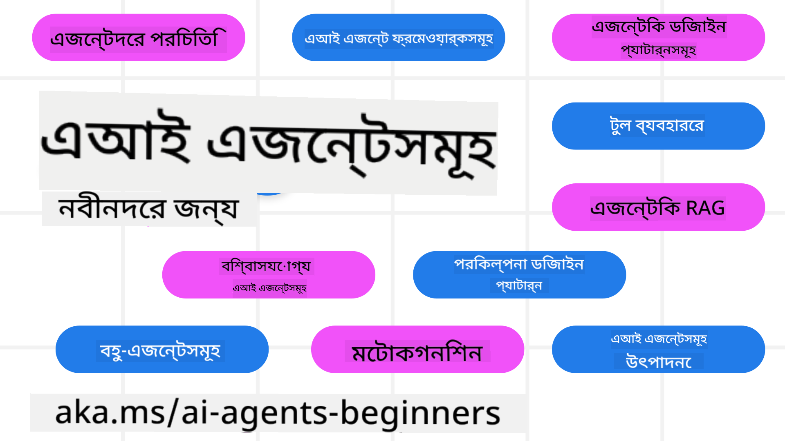

<!--
CO_OP_TRANSLATOR_METADATA:
{
  "original_hash": "9b4c2650691b24b20e0c912d01a466a2",
  "translation_date": "2025-08-21T12:11:54+00:00",
  "source_file": "README.md",
  "language_code": "bn"
}
-->
# AI এজেন্টস ফর বিগিনার্স - একটি কোর্স

## ১১টি পাঠ যা আপনাকে AI এজেন্ট তৈরি শুরু করার জন্য প্রয়োজনীয় সবকিছু শেখাবে

### 🌐 বহু ভাষার সমর্থন

#### GitHub Action এর মাধ্যমে সমর্থিত (স্বয়ংক্রিয় এবং সর্বদা আপডেটেড)

[French](../fr/README.md) | [Spanish](../es/README.md) | [German](../de/README.md) | [Russian](../ru/README.md) | [Arabic](../ar/README.md) | [Persian (Farsi)](../fa/README.md) | [Urdu](../ur/README.md) | [Chinese (Simplified)](../zh/README.md) | [Chinese (Traditional, Macau)](../mo/README.md) | [Chinese (Traditional, Hong Kong)](../hk/README.md) | [Chinese (Traditional, Taiwan)](../tw/README.md) | [Japanese](../ja/README.md) | [Korean](../ko/README.md) | [Hindi](../hi/README.md) | [Bengali](./README.md) | [Marathi](../mr/README.md) | [Nepali](../ne/README.md) | [Punjabi (Gurmukhi)](../pa/README.md) | [Portuguese (Portugal)](../pt/README.md) | [Portuguese (Brazil)](../br/README.md) | [Italian](../it/README.md) | [Polish](../pl/README.md) | [Turkish](../tr/README.md) | [Greek](../el/README.md) | [Thai](../th/README.md) | [Swedish](../sv/README.md) | [Danish](../da/README.md) | [Norwegian](../no/README.md) | [Finnish](../fi/README.md) | [Dutch](../nl/README.md) | [Hebrew](../he/README.md) | [Vietnamese](../vi/README.md) | [Indonesian](../id/README.md) | [Malay](../ms/README.md) | [Tagalog (Filipino)](../tl/README.md) | [Swahili](../sw/README.md) | [Hungarian](../hu/README.md) | [Czech](../cs/README.md) | [Slovak](../sk/README.md) | [Romanian](../ro/README.md) | [Bulgarian](../bg/README.md) | [Serbian (Cyrillic)](../sr/README.md) | [Croatian](../hr/README.md) | [Slovenian](../sl/README.md) | [Ukrainian](../uk/README.md) | [Burmese (Myanmar)](../my/README.md)

**যদি আপনি অতিরিক্ত ভাষার অনুবাদ চান, সমর্থিত ভাষার তালিকা [এখানে](https://github.com/Azure/co-op-translator/blob/main/getting_started/supported-languages.md) পাওয়া যাবে।**

## 🌱 শুরু করা

এই কোর্সে ১১টি পাঠ রয়েছে যা AI এজেন্ট তৈরি করার মৌলিক বিষয়গুলো কভার করে। প্রতিটি পাঠ একটি নির্দিষ্ট বিষয় নিয়ে আলোচনা করে, তাই আপনি যেকোনো জায়গা থেকে শুরু করতে পারেন!

এই কোর্সে বহু ভাষার সমর্থন রয়েছে। আমাদের [উপলব্ধ ভাষাগুলোর তালিকা এখানে](../..) দেখুন।

যদি এটি আপনার প্রথমবার হয় Generative AI মডেল নিয়ে কাজ করার, তাহলে আমাদের [Generative AI For Beginners](https://aka.ms/genai-beginners) কোর্সটি দেখুন, যেখানে GenAI নিয়ে কাজ করার জন্য ২১টি পাঠ রয়েছে।

এই রিপোজিটরিকে [স্টার (🌟) দিন](https://docs.github.com/en/get-started/exploring-projects-on-github/saving-repositories-with-stars?WT.mc_id=academic-105485-koreyst) এবং কোড চালানোর জন্য [ফর্ক করুন](https://github.com/microsoft/ai-agents-for-beginners/fork)।

### আপনার যা প্রয়োজন

এই কোর্সের প্রতিটি পাঠে কোড উদাহরণ রয়েছে, যা code_samples ফোল্ডারে পাওয়া যাবে। আপনি [এই রিপোজিটরিকে ফর্ক করুন](https://github.com/microsoft/ai-agents-for-beginners/fork) আপনার নিজের কপি তৈরি করতে।

এই অনুশীলনের কোড উদাহরণগুলো Azure AI Foundry এবং GitHub Model Catalogs ব্যবহার করে Language Models এর সাথে ইন্টারঅ্যাক্ট করে:

- [Github Models](https://aka.ms/ai-agents-beginners/github-models) - বিনামূল্যে / সীমিত
- [Azure AI Foundry](https://aka.ms/ai-agents-beginners/ai-foundry) - Azure অ্যাকাউন্ট প্রয়োজন

এই কোর্সে Microsoft এর নিম্নলিখিত AI এজেন্ট ফ্রেমওয়ার্ক এবং সার্ভিসগুলো ব্যবহার করা হয়েছে:

- [Azure AI Agent Service](https://aka.ms/ai-agents-beginners/ai-agent-service)
- [Semantic Kernel](https://aka.ms/ai-agents-beginners/semantic-kernel)
- [AutoGen](https://aka.ms/ai-agents/autogen)

এই কোর্সের কোড চালানোর বিষয়ে আরও তথ্যের জন্য [Course Setup](./00-course-setup/README.md) দেখুন।

## 🙏 সাহায্য করতে চান?

আপনার কোনো পরামর্শ আছে বা বানান বা কোডের ত্রুটি খুঁজে পেয়েছেন? [একটি ইস্যু তুলুন](https://github.com/microsoft/ai-agents-for-beginners/issues?WT.mc_id=academic-105485-koreyst) অথবা [একটি পুল রিকোয়েস্ট তৈরি করুন](https://github.com/microsoft/ai-agents-for-beginners/pulls?WT.mc_id=academic-105485-koreyst)।

যদি আপনি আটকে যান বা AI এজেন্ট তৈরি করার বিষয়ে কোনো প্রশ্ন থাকে, আমাদের [Azure AI Foundry Community Discord](https://discord.gg/kzRShWzttr) এ যোগ দিন।

যদি আপনার প্রোডাক্ট ফিডব্যাক থাকে বা কোনো ত্রুটি পান, আমাদের [Azure AI Foundry Developer Forum](https://aka.ms/azureaifoundry/forum) দেখুন।

## 📂 প্রতিটি পাঠে রয়েছে

- README-তে একটি লিখিত পাঠ এবং একটি সংক্ষিপ্ত ভিডিও
- Azure AI Foundry এবং Github Models (বিনামূল্যে) সমর্থনকারী Python কোড উদাহরণ
- আপনার শেখা চালিয়ে যাওয়ার জন্য অতিরিক্ত রিসোর্সের লিঙ্ক

## 🗃️ পাঠসমূহ

| **পাঠ**                                  | **টেক্সট ও কোড**                                  | **ভিডিও**                                                  | **অতিরিক্ত শেখা**                                                                     |
|------------------------------------------|----------------------------------------------------|------------------------------------------------------------|----------------------------------------------------------------------------------------|
| AI এজেন্টস এবং এজেন্ট ব্যবহারের ক্ষেত্রে পরিচিতি | [লিঙ্ক](./01-intro-to-ai-agents/README.md)         | [ভিডিও](https://youtu.be/3zgm60bXmQk?si=z8QygFvYQv-9WtO1)  | [লিঙ্ক](https://aka.ms/ai-agents-beginners/collection?WT.mc_id=academic-105485-koreyst) |
| AI এজেন্টিক ফ্রেমওয়ার্ক অন্বেষণ          | [লিঙ্ক](./02-explore-agentic-frameworks/README.md) | [ভিডিও](https://youtu.be/ODwF-EZo_O8?si=Vawth4hzVaHv-u0H)  | [লিঙ্ক](https://aka.ms/ai-agents-beginners/collection?WT.mc_id=academic-105485-koreyst) |
| AI এজেন্টিক ডিজাইন প্যাটার্ন বোঝা         | [লিঙ্ক](./03-agentic-design-patterns/README.md)    | [ভিডিও](https://youtu.be/m9lM8qqoOEA?si=BIzHwzstTPL8o9GF)  | [লিঙ্ক](https://aka.ms/ai-agents-beginners/collection?WT.mc_id=academic-105485-koreyst) |
| টুল ব্যবহারের ডিজাইন প্যাটার্ন             | [লিঙ্ক](./04-tool-use/README.md)                   | [ভিডিও](https://youtu.be/vieRiPRx-gI?si=2z6O2Xu2cu_Jz46N)  | [লিঙ্ক](https://aka.ms/ai-agents-beginners/collection?WT.mc_id=academic-105485-koreyst) |
| এজেন্টিক RAG                              | [লিঙ্ক](./05-agentic-rag/README.md)                | [ভিডিও](https://youtu.be/WcjAARvdL7I?si=gKPWsQpKiIlDH9A3)  | [লিঙ্ক](https://aka.ms/ai-agents-beginners/collection?WT.mc_id=academic-105485-koreyst) |
| বিশ্বাসযোগ্য AI এজেন্ট তৈরি করা            | [লিঙ্ক](./06-building-trustworthy-agents/README.md)| [ভিডিও](https://youtu.be/iZKkMEGBCUQ?si=jZjpiMnGFOE9L8OK ) | [লিঙ্ক](https://aka.ms/ai-agents-beginners/collection?WT.mc_id=academic-105485-koreyst) |
| পরিকল্পনার ডিজাইন প্যাটার্ন                | [লিঙ্ক](./07-planning-design/README.md)            | [ভিডিও](https://youtu.be/kPfJ2BrBCMY?si=6SC_iv_E5-mzucnC)  | [লিঙ্ক](https://aka.ms/ai-agents-beginners/collection?WT.mc_id=academic-105485-koreyst) |
| মাল্টি-এজেন্ট ডিজাইন প্যাটার্ন             | [লিঙ্ক](./08-multi-agent/README.md)                | [ভিডিও](https://youtu.be/V6HpE9hZEx0?si=rMgDhEu7wXo2uo6g)  | [লিঙ্ক](https://aka.ms/ai-agents-beginners/collection?WT.mc_id=academic-105485-koreyst) |
| মেটাকগনিশন ডিজাইন প্যাটার্ন                | [লিঙ্ক](./09-metacognition/README.md)              | [ভিডিও](https://youtu.be/His9R6gw6Ec?si=8gck6vvdSNCt6OcF)  | [লিঙ্ক](https://aka.ms/ai-agents-beginners/collection?WT.mc_id=academic-105485-koreyst) |
| প্রোডাকশনে AI এজেন্টস                     | [লিঙ্ক](./10-ai-agents-production/README.md)       | [ভিডিও](https://youtu.be/l4TP6IyJxmQ?si=31dnhexRo6yLRJDl)  | [লিঙ্ক](https://aka.ms/ai-agents-beginners/collection?WT.mc_id=academic-105485-koreyst) |
| MCP সহ AI এজেন্টস                         | [লিঙ্ক](./11-mcp/README.md)                        |                                                            | [লিঙ্ক](https://aka.ms/mcp-for-beginners)                                               |

## 🎒 অন্যান্য কোর্স

আমাদের টিম অন্যান্য কোর্সও তৈরি করে! দেখুন:
- [**নতুন** মডেল কনটেক্সট প্রোটোকল (MCP) শিক্ষার্থীদের জন্য](https://github.com/microsoft/mcp-for-beginners?WT.mc_id=academic-105485-koreyst)  
- [.NET ব্যবহার করে শিক্ষার্থীদের জন্য জেনারেটিভ এআই](https://github.com/microsoft/Generative-AI-for-beginners-dotnet?WT.mc_id=academic-105485-koreyst)  
- [শিক্ষার্থীদের জন্য জেনারেটিভ এআই](https://github.com/microsoft/generative-ai-for-beginners?WT.mc_id=academic-105485-koreyst)  
- [জাভা ব্যবহার করে শিক্ষার্থীদের জন্য জেনারেটিভ এআই](https://github.com/microsoft/generative-ai-for-beginners-java?WT.mc_id=academic-105485-koreyst)  
- [শিক্ষার্থীদের জন্য মেশিন লার্নিং](https://aka.ms/ml-beginners?WT.mc_id=academic-105485-koreyst)  
- [শিক্ষার্থীদের জন্য ডেটা সায়েন্স](https://aka.ms/datascience-beginners?WT.mc_id=academic-105485-koreyst)  
- [শিক্ষার্থীদের জন্য কৃত্রিম বুদ্ধিমত্তা](https://aka.ms/ai-beginners?WT.mc_id=academic-105485-koreyst)  
- [শিক্ষার্থীদের জন্য সাইবার সিকিউরিটি](https://github.com/microsoft/Security-101??WT.mc_id=academic-96948-sayoung)  
- [শিক্ষার্থীদের জন্য ওয়েব ডেভেলপমেন্ট](https://aka.ms/webdev-beginners?WT.mc_id=academic-105485-koreyst)  
- [শিক্ষার্থীদের জন্য ইন্টারনেট অফ থিংস (IoT)](https://aka.ms/iot-beginners?WT.mc_id=academic-105485-koreyst)  
- [শিক্ষার্থীদের জন্য এক্সআর ডেভেলপমেন্ট](https://github.com/microsoft/xr-development-for-beginners?WT.mc_id=academic-105485-koreyst)  
- [এআই পেয়ারড প্রোগ্রামিংয়ের জন্য গিটহাব কোপাইলট আয়ত্ত করা](https://aka.ms/GitHubCopilotAI?WT.mc_id=academic-105485-koreyst)  
- [C#/.NET ডেভেলপারদের জন্য গিটহাব কোপাইলট আয়ত্ত করা](https://github.com/microsoft/mastering-github-copilot-for-dotnet-csharp-developers?WT.mc_id=academic-105485-koreyst)  
- [আপনার নিজস্ব কোপাইলট অ্যাডভেঞ্চার বেছে নিন](https://github.com/microsoft/CopilotAdventures?WT.mc_id=academic-105485-koreyst)  

## 🌟 কমিউনিটির প্রতি কৃতজ্ঞতা

[শিভাম গোয়াল](https://www.linkedin.com/in/shivam2003/) কে ধন্যবাদ, যিনি এজেন্টিক RAG প্রদর্শনের জন্য গুরুত্বপূর্ণ কোড নমুনা প্রদান করেছেন।  

## অবদান রাখা

এই প্রকল্পে অবদান এবং পরামর্শকে স্বাগত জানানো হয়। বেশিরভাগ অবদানের জন্য আপনাকে একটি  
Contributor License Agreement (CLA) স্বাক্ষর করতে হবে, যা নিশ্চিত করে যে আপনার অবদানের অধিকার রয়েছে এবং আপনি আমাদের তা ব্যবহারের অনুমতি দিচ্ছেন। বিস্তারিত জানতে দেখুন  
<https://cla.opensource.microsoft.com>।  

যখন আপনি একটি পুল রিকোয়েস্ট জমা দেবেন, একটি CLA বট স্বয়ংক্রিয়ভাবে নির্ধারণ করবে যে আপনাকে CLA প্রদান করতে হবে কিনা এবং PR-এ প্রাসঙ্গিক নির্দেশনা যোগ করবে (যেমন, স্ট্যাটাস চেক, মন্তব্য)। বট প্রদত্ত নির্দেশাবলী অনুসরণ করুন। আপনাকে এটি শুধুমাত্র একবার করতে হবে, সমস্ত রিপোজিটরির জন্য যেখানে আমাদের CLA প্রয়োজন।  

এই প্রকল্পটি [মাইক্রোসফট ওপেন সোর্স কোড অফ কন্ডাক্ট](https://opensource.microsoft.com/codeofconduct/) গ্রহণ করেছে।  
আরও তথ্যের জন্য দেখুন [কোড অফ কন্ডাক্ট FAQ](https://opensource.microsoft.com/codeofconduct/faq/) অথবা  
[opencode@microsoft.com](mailto:opencode@microsoft.com)-এ যোগাযোগ করুন যেকোনো অতিরিক্ত প্রশ্ন বা মন্তব্যের জন্য।  

## ট্রেডমার্ক

এই প্রকল্পে প্রকল্প, পণ্য বা পরিষেবার ট্রেডমার্ক বা লোগো থাকতে পারে। মাইক্রোসফটের  
ট্রেডমার্ক বা লোগো ব্যবহারের অনুমোদিত ব্যবহার অবশ্যই [মাইক্রোসফটের ট্রেডমার্ক ও ব্র্যান্ড নির্দেশিকা](https://www.microsoft.com/legal/intellectualproperty/trademarks/usage/general) অনুসরণ করতে হবে।  
এই প্রকল্পের পরিবর্তিত সংস্করণে মাইক্রোসফটের ট্রেডমার্ক বা লোগো ব্যবহার এমন বিভ্রান্তি সৃষ্টি করতে পারবে না বা মাইক্রোসফটের পৃষ্ঠপোষকতার ইঙ্গিত দিতে পারবে না।  
তৃতীয় পক্ষের ট্রেডমার্ক বা লোগো ব্যবহারের ক্ষেত্রে সেই তৃতীয় পক্ষের নীতিমালা প্রযোজ্য।  

**অস্বীকৃতি**:  
এই নথিটি AI অনুবাদ পরিষেবা [Co-op Translator](https://github.com/Azure/co-op-translator) ব্যবহার করে অনুবাদ করা হয়েছে। আমরা যথাসম্ভব সঠিক অনুবাদের চেষ্টা করি, তবে অনুগ্রহ করে মনে রাখবেন যে স্বয়ংক্রিয় অনুবাদে ত্রুটি বা অসঙ্গতি থাকতে পারে। নথিটির মূল ভাষায় লেখা সংস্করণটিকেই প্রামাণিক উৎস হিসেবে বিবেচনা করা উচিত। গুরুত্বপূর্ণ তথ্যের জন্য, পেশাদার মানব অনুবাদ ব্যবহার করার পরামর্শ দেওয়া হচ্ছে। এই অনুবাদ ব্যবহারের ফলে সৃষ্ট কোনো ভুল বোঝাবুঝি বা ভুল ব্যাখ্যার জন্য আমরা দায়ী নই।