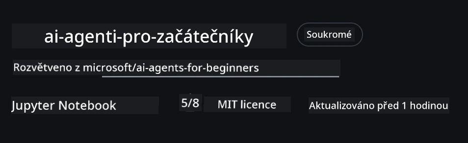

# Nastavení kurzu

## Úvod

Tato lekce ukáže, jak spustit ukázkové kódy z tohoto kurzu.

## Přidejte se k ostatním studentům a získejte pomoc

Před tím, než začnete klonovat své úložiště, připojte se k [kanálu Discord AI Agents For Beginners](https://aka.ms/ai-agents/discord) pro pomoc s nastavením, otázky ke kurzu nebo propojení s ostatními studenty.

## Naklonujte nebo vytvořte fork tohoto repozitáře

Začněte klonováním nebo vytvořením forku GitHub repozitáře. Tím získáte vlastní verzi materiálů kurzu, kterou můžete spouštět, testovat a upravovat kód!

This can be done by clicking the link to <a href="https://github.com/microsoft/ai-agents-for-beginners/fork" target="_blank">vytvořit fork repozitáře</a>

You should now have your own forked version of this course in the following link:



### Mělké klonování (doporučeno pro workshop / Codespaces)

  >Celé úložiště může být velké (~3 GB), pokud stáhnete kompletní historii a všechny soubory. Pokud se účastníte pouze workshopu nebo potřebujete jen několik složek s lekcemi, mělké klonování (nebo částečné klonování) se vyhne většině tohoto stahování tím, že zkrátí historii a/nebo přeskočí blob objekty.

#### Rychlé mělké klonování — minimální historie, všechny soubory

Replace `<your-username>` in the below commands with your fork URL (or the upstream URL if you prefer).

To clone only the latest commit history (small download):

```bash|powershell
git clone --depth 1 https://github.com/<your-username>/ai-agents-for-beginners.git
```

To clone a specific branch:

```bash|powershell
git clone --depth 1 --branch <branch-name> https://github.com/<your-username>/ai-agents-for-beginners.git
```

#### Částečné (sparse) klonování — minimální bloby + jen vybrané složky

This uses partial clone and sparse-checkout (requires Git 2.25+ and recommended modern Git with partial clone support):

```bash|powershell
git clone --depth 1 --filter=blob:none --sparse https://github.com/<your-username>/ai-agents-for-beginners.git
```

Traverse into the repo folder:

```bash|powershell
cd ai-agents-for-beginners
```

Then specify which folders you want (example below shows two folders):

```bash|powershell
git sparse-checkout set 00-course-setup 01-intro-to-ai-agents
```

After cloning and verifying the files, if you only need files and want to free space (no git history), please delete the repository metadata (💀nevratné — přijdete o veškerou funkčnost Gitu: žádné commity, pully, push nebo přístup k historii).

```bash
# zsh/bash
rm -rf .git
```

```powershell
# PowerShell
Remove-Item -Recurse -Force .git
```

#### Použití GitHub Codespaces (doporučeno k vyhnutí se velkým lokálním stahováním)

- Vytvořte nový Codespace pro tento repozitář přes [GitHub UI](https://github.com/codespaces).  

- V terminálu nově vytvořeného Codespace spusťte jeden z výše uvedených příkazů pro mělké/částečné klonování, abyste přenesli pouze složky lekcí, které potřebujete, do pracovního prostoru Codespace.
- Volitelné: po klonování uvnitř Codespaces odstraňte .git pro uvolnění místa (viz příkazy pro odstranění výše).
- Poznámka: Pokud dáváte přednost otevření repozitáře přímo v Codespaces (bez dalšího klonování), vězte, že Codespaces vytvoří devcontainer prostředí a může stále připravit více, než potřebujete. Klonování mělké kopie uvnitř nového Codespace vám dává větší kontrolu nad využitím disku.

#### Tipy

- Vždy nahraďte URL pro klonování URL vašeho forku, pokud chcete upravovat/commitovat.
- Pokud později budete potřebovat více historie nebo souborů, můžete je stáhnout pomocí fetch nebo upravit sparse-checkout, aby zahrnoval další složky.

## Spuštění kódu

Tento kurz obsahuje sérii Jupyter Notebooků, které můžete spustit pro praktické získání zkušeností s vytvářením AI agentů.

Ukázkové kódy používají **Microsoft Agent Framework (MAF)** s `AzureAIProjectAgentProvider`, který se připojuje k **Azure AI Agent Service V2** (Responses API) prostřednictvím **Microsoft Foundry**.

Všechny Python notebooky jsou označeny `*-python-agent-framework.ipynb`.

## Požadavky

- Python 3.12+
  - **POZNÁMKA**: Pokud nemáte nainstalovaný Python 3.12, nainstalujte ho. Poté vytvořte virtuální prostředí pomocí python3.12, aby se z requirements.txt nainstalovaly správné verze.
  
    >Příklad

    Vytvořte adresář pro Python venv:

    ```bash|powershell
    python -m venv venv
    ```

    Poté aktivujte virtuální prostředí pro:

    ```bash
    # zsh/bash
    source venv/bin/activate
    ```
  
    ```dos
    # Command Prompt for Windows
    venv\Scripts\activate
    ```

- .NET 10+: Pro ukázkové kódy používající .NET si nainstalujte [.NET 10 SDK](https://dotnet.microsoft.com/download/dotnet/10.0) nebo novější. Poté zkontrolujte verzi nainstalovaného .NET SDK:

    ```bash|powershell
    dotnet --list-sdks
    ```

- **Azure CLI** — Vyžadováno pro autentizaci. Nainstalujte z [aka.ms/installazurecli](https://aka.ms/installazurecli).
- **Azure Subscription** — Pro přístup k Microsoft Foundry a Azure AI Agent Service.
- **Microsoft Foundry Project** — Projekt s nasazeným modelem (např. `gpt-4o`). Viz [Krok 1](../../../00-course-setup) níže.

V kořeni tohoto repozitáře jsme zahrnuli soubor `requirements.txt`, který obsahuje všechny požadované Python balíčky pro spuštění ukázkových kódů.

Nainstalujete je spuštěním následujícího příkazu v terminálu v kořenovém adresáři repozitáře:

```bash|powershell
pip install -r requirements.txt
```

Doporučujeme vytvořit Python virtuální prostředí, abyste se vyhnuli konfliktům a potížím.

## Nastavení VSCode

Ujistěte se, že ve VSCode používáte správnou verzi Pythonu.


## Nastavení Microsoft Foundry a Azure AI Agent Service

### Krok 1: Vytvořte projekt v Microsoft Foundry

Potřebujete v Azure AI Foundry **hub** a **projekt** s nasazeným modelem pro spuštění notebooků.

1. Přejděte na [ai.azure.com](https://ai.azure.com) a přihlaste se svým Azure účtem.
2. Vytvořte **hub** (nebo použijte existující). Viz: [Přehled zdrojů hubu](https://learn.microsoft.com/azure/ai-foundry/concepts/ai-resources).
3. V rámci hubu vytvořte **projekt**.
4. Nasadte model (např. `gpt-4o`) z **Models + Endpoints** → **Deploy model**.

### Krok 2: Získání koncového bodu projektu a názvu nasazení modelu

Z vašeho projektu v Microsoft Foundry portálu:

- **Project Endpoint** — Přejděte na stránku **Overview** a zkopírujte URL koncového bodu.


- **Model Deployment Name** — Přejděte na **Models + Endpoints**, vyberte nasazený model a poznamenejte si **Deployment name** (např. `gpt-4o`).

### Krok 3: Přihlaste se do Azure pomocí `az login`

Všechny notebooky používají pro autentizaci **`AzureCliCredential`** — žádné API klíče k spravování. To vyžaduje, abyste byli přihlášeni přes Azure CLI.

1. **Nainstalujte Azure CLI**, pokud jej ještě nemáte: [aka.ms/installazurecli](https://aka.ms/installazurecli)

2. **Přihlaste se** spuštěním:

    ```bash|powershell
    az login
    ```

    Nebo pokud jste v remote/Codespace prostředí bez prohlížeče:

    ```bash|powershell
    az login --use-device-code
    ```

3. **Vyberte svůj subscription** pokud budete vyzváni — zvolte ten obsahující váš Foundry projekt.

4. **Ověřte**, že jste přihlášeni:

    ```bash|powershell
    az account show
    ```

> **Proč `az login`?** Notebooky se autentizují pomocí `AzureCliCredential` z balíčku `azure-identity`. To znamená, že vaše Azure CLI relace poskytuje přihlašovací údaje — žádné API klíče nebo tajemství ve vašem souboru `.env`. Toto je [osvědčený bezpečnostní postup](https://learn.microsoft.com/azure/developer/ai/keyless-connections).

### Krok 4: Vytvořte svůj soubor `.env`

Zkopírujte ukázkový soubor:

```bash
# zsh/bash
cp .env.example .env
```

```powershell
# PowerShell
Copy-Item .env.example .env
```

Otevřete `.env` a vyplňte tyto dvě hodnoty:

```env
AZURE_AI_PROJECT_ENDPOINT=https://<your-project>.services.ai.azure.com/api/projects/<your-project-id>
AZURE_AI_MODEL_DEPLOYMENT_NAME=gpt-4o
```

| Proměnná | Kde ji najít |
|----------|-----------------|
| `AZURE_AI_PROJECT_ENDPOINT` | Foundry portal → váš projekt → stránka **Overview** |
| `AZURE_AI_MODEL_DEPLOYMENT_NAME` | Foundry portal → **Models + Endpoints** → název vašeho nasazeného modelu |

To je vše pro většinu lekcí! Notebooky se budou autentizovat automaticky přes vaši relaci `az login`.

### Krok 5: Instalace Python závislostí

```bash|powershell
pip install -r requirements.txt
```

Doporučujeme tento příkaz spustit uvnitř virtuálního prostředí, které jste si vytvořili dříve.

## Další nastavení pro Lekci 5 (Agentic RAG)

Lekce 5 používá **Azure AI Search** pro retrieval-augmented generation. Pokud plánujete spustit tuto lekci, přidejte tyto proměnné do souboru `.env`:

| Proměnná | Kde ji najít |
|----------|-----------------|
| `AZURE_SEARCH_SERVICE_ENDPOINT` | Azure portal → váš zdroj **Azure AI Search** → **Overview** → URL |
| `AZURE_SEARCH_API_KEY` | Azure portal → váš zdroj **Azure AI Search** → **Settings** → **Keys** → primární admin klíč |

## Další nastavení pro Lekce 6 a 8 (GitHub Models)

Některé notebooky v lekcích 6 a 8 používají místo Azure AI Foundry **GitHub Models**. Pokud plánujete spustit tyto ukázky, přidejte tyto proměnné do souboru `.env`:

| Proměnná | Kde ji najít |
|----------|-----------------|
| `GITHUB_TOKEN` | GitHub → **Settings** → **Developer settings** → **Personal access tokens** |
| `GITHUB_ENDPOINT` | Použijte `https://models.inference.ai.azure.com` (výchozí hodnota) |
| `GITHUB_MODEL_ID` | Název modelu k použití (např. `gpt-4o-mini`) |

## Další nastavení pro Lekci 8 (Bing Grounding Workflow)

Podmíněný workflow notebook v lekci 8 používá **Bing grounding** přes Azure AI Foundry. Pokud plánujete spustit tento příklad, přidejte tuto proměnnou do souboru `.env`:

| Proměnná | Kde ji najít |
|----------|-----------------|
| `BING_CONNECTION_ID` | Azure AI Foundry portal → váš projekt → **Management** → **Connected resources** → vaše Bing připojení → zkopírujte connection ID |

## Odstraňování problémů

### Chyby ověřování SSL certifikátů na macOS

Pokud jste na macOS a narazíte na chybu jako:

```plaintext
ssl.SSLCertVerificationError: [SSL: CERTIFICATE_VERIFY_FAILED] certificate verify failed: self-signed certificate in certificate chain
```

Toto je známý problém Pythonu na macOS, kde nejsou systémové SSL certifikáty automaticky důvěryhodné. Vyzkoušejte následující řešení v uvedeném pořadí:

**Možnost 1: Spusťte skript Install Certificates pro Python (doporučeno)**

```bash
# Nahraďte 3.XX verzí Pythonu, kterou máte nainstalovanou (např. 3.12 nebo 3.13):
/Applications/Python\ 3.XX/Install\ Certificates.command
```

**Možnost 2: Použijte `connection_verify=False` ve vašem notebooku (pouze pro notebooky s GitHub Models)**

V notebooku Lekce 6 (`06-building-trustworthy-agents/code_samples/06-system-message-framework.ipynb`) je již zahrnuto workaround v komentáři. Odkomentujte `connection_verify=False` při vytváření klienta:

```python
client = ChatCompletionsClient(
    endpoint=endpoint,
    credential=AzureKeyCredential(token),
    connection_verify=False,  # Deaktivujte ověřování SSL, pokud narazíte na chyby certifikátu
)
```

> **⚠️ Upozornění:** Vypnutí ověřování SSL (`connection_verify=False`) snižuje bezpečnost tím, že přeskočí validaci certifikátů. Používejte to pouze jako dočasné řešení v testovacích/development prostředích, nikdy v produkci.

**Možnost 3: Nainstalujte a použijte `truststore`**

```bash
pip install truststore
```

Poté přidejte následující na začátek vašeho notebooku nebo skriptu před provedením jakýchkoli síťových volání:

```python
import truststore
truststore.inject_into_ssl()
```

## Zasekl jste se někde?

Máte-li nějaké problémy s tímto nastavením, přidejte se na náš <a href="https://discord.gg/kzRShWzttr" target="_blank">Azure AI Community Discord</a> nebo <a href="https://github.com/microsoft/ai-agents-for-beginners/issues?WT.mc_id=academic-105485-koreyst" target="_blank">vytvořte issue</a>.

## Další lekce

Nyní jste připraveni spustit kód tohoto kurzu. Přejeme příjemné učení a objevování světa AI agentů! 

[Úvod do AI agentů a případů použití agentů](../01-intro-to-ai-agents/README.md)

---

<!-- CO-OP TRANSLATOR DISCLAIMER START -->
**Upozornění**:
Tento dokument byl přeložen pomocí AI překladatelské služby [Co-op Translator](https://github.com/Azure/co-op-translator). Přestože usilujeme o přesnost, mějte prosím na paměti, že automatické překlady mohou obsahovat chyby nebo nepřesnosti. Původní dokument v jeho originálním jazyce by měl být považován za závazný zdroj. Pro kritické informace se doporučuje profesionální lidský překlad. Nezodpovídáme za jakákoli nedorozumění nebo chybné výklady vzniklé v důsledku použití tohoto překladu.
<!-- CO-OP TRANSLATOR DISCLAIMER END -->