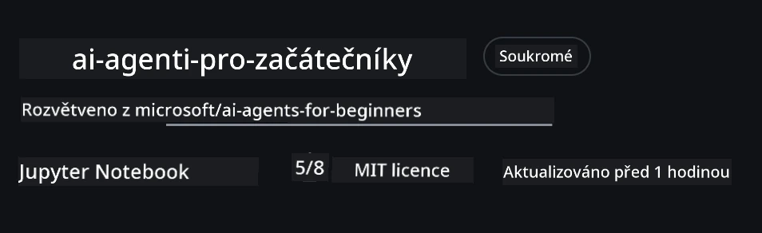
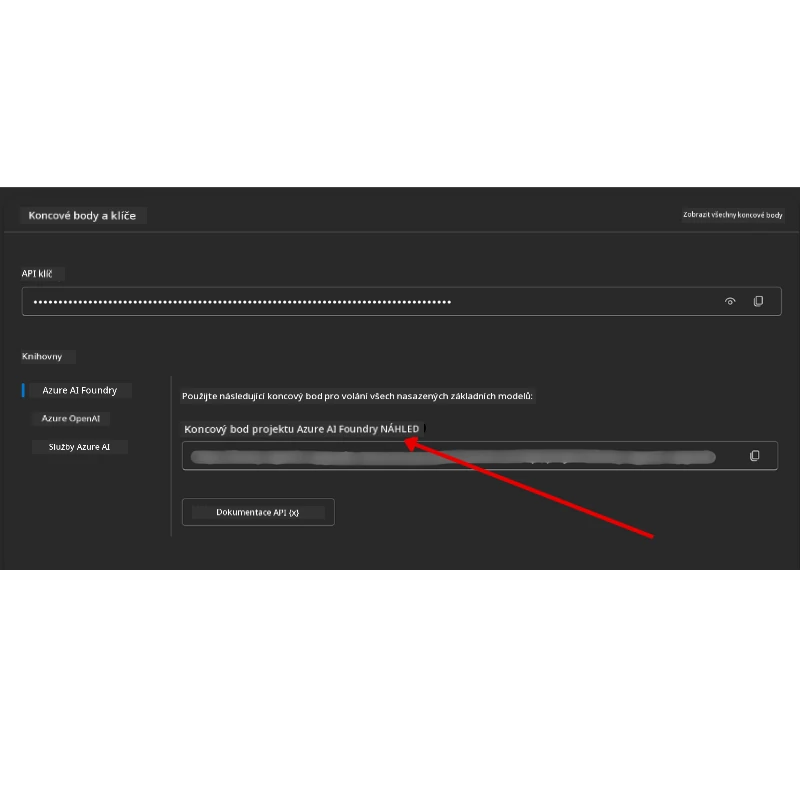

# Nastavení kurzu

## Úvod

Tato lekce pokryje, jak spustit ukázky kódu tohoto kurzu.

## Připojte se k ostatním studentům a získejte pomoc

Než začnete klonovat svůj repozitář, připojte se k [Discord kanálu AI Agents For Beginners](https://aka.ms/ai-agents/discord), kde můžete získat pomoc s nastavením, jakékoli dotazy k kurzu nebo na spojení s ostatními studenty.

## Klonujte nebo forkněte tento repozitář

Nejprve prosím naklonujte nebo forkněte GitHub repozitář. To vám vytvoří vaši vlastní verzi materiálů kurzu, takže můžete kód spouštět, testovat a upravovat!

To lze udělat kliknutím na odkaz <a href="https://github.com/microsoft/ai-agents-for-beginners/fork" target="_blank">forknout repozitář</a>

Nyní byste měli mít vlastní forknutou verzi tohoto kurzu na následujícím odkazu:



### Shallow Clone (doporučeno pro workshop / Codespaces)

  >Celý repozitář může být velký (~3 GB), pokud stáhnete celou historii a všechny soubory. Pokud se účastníte pouze workshopu nebo potřebujete jen některé složky lekcí, shallow clone (nebo sparse clone) stáhne mnohem méně.

#### Rychlý shallow clone — minimální historie, všechny soubory

Nahraďte `<your-username>` v níže uvedených příkazech URL vašeho forku (nebo upstream URL, pokud chcete).

Pro naklonování pouze nejnovější historie commitu (malé stažení):

```bash
git clone --depth 1 https://github.com/<your-username>/ai-agents-for-beginners.git
```

Pro naklonování konkrétní větve:

```bash
git clone --depth 1 --branch <branch-name> https://github.com/<your-username>/ai-agents-for-beginners.git
```

#### Částečný (sparse) clone — minimální blobs + vybrané složky

Toto používá partial clone a sparse-checkout (vyžaduje Git 2.25+ a doporučený moderní Git s podporou partial clone):

```bash
git clone --depth 1 --filter=blob:none --sparse https://github.com/<your-username>/ai-agents-for-beginners.git
```

Přesuňte se do složky repozitáře:

```bash
cd ai-agents-for-beginners
```

Pak určete, které složky chcete (příklad níže ukazuje dvě složky):

```bash
git sparse-checkout set 00-course-setup 01-intro-to-ai-agents
```

Po naklonování a ověření souborů, pokud potřebujete pouze soubory a chcete uvolnit místo (bez git historie), prosím smažte metadata repozitáře (💀nevratné — ztratíte veškerou funkčnost Git):

```bash
# zsh/bash
rm -rf .git
```

```powershell
# PowerShell
Remove-Item -Recurse -Force .git
```

#### Použití GitHub Codespaces (doporučené k vyhnutí se velkým lokálním stahováním)

- Vytvořte nový Codespace pro tento repozitář pomocí [GitHub UI](https://github.com/codespaces).  

- V terminálu nově vytvořeného codespace spusťte jeden z příkazů pro shallow/sparse clone výše, aby se stáhly pouze potřebné složky lekcí do pracovního prostoru Codespace.
- Volitelné: po naklonování uvnitř Codespaces odstraňte .git, abyste uvolnili místo (viz příkazy pro odstranění výše).
- Poznámka: Pokud chcete otevřít repozitář přímo v Codespaces (bez dalšího klonování), mějte na paměti, že Codespaces vytvoří devcontainer prostředí a může stále poskytnout více, než potřebujete.

#### Tipy

- Vždy nahraďte URL klonu URL vašeho forku, pokud chcete upravovat/commitovat.
- Pokud později budete potřebovat více historie nebo souborů, můžete je stáhnout nebo upravit sparse-checkout, aby zahrnoval další složky.

## Spuštění kódu

Tento kurz nabízí řadu Jupyter Notebooků, které můžete spouštět a získat tak praktické zkušenosti s tvorbou AI agentů.

Ukázky kódu používají **Microsoft Agent Framework (MAF)** s `FoundryChatClient`, který se připojuje ke **Microsoft Foundry Agent Service V2** (Responses API) přes **Microsoft Foundry**.

Všechny Python notebooky jsou označeny `*-python-agent-framework.ipynb`.

## Požadavky

- Python 3.12+
  - **POZNÁMKA**: Pokud nemáte nainstalovaný Python3.12, ujistěte se, že jej nainstalujete. Pak vytvořte venv pomocí python3.12, aby se nainstalovaly správné verze z requirements.txt.
  
    >Příklad

    Vytvoření adresáře Python venv:

    ```bash
    python -m venv venv
    ```

    Pak aktivujte venv prostředí pro:

    ```bash
    # zsh/bash
    source venv/bin/activate
    ```
  
    ```dos
    # Command Prompt for Windows
    venv\Scripts\activate
    ```

- .NET 10+: Pro ukázkové kódy používající .NET si nainstalujte [.NET 10 SDK](https://dotnet.microsoft.com/download/dotnet/10.0) nebo novější. Pak zkontrolujte svou nainstalovanou verzi .NET SDK:

    ```bash
    dotnet --list-sdks
    ```

- **Azure CLI** — Potřebné pro autentizaci. Instalujte z [aka.ms/installazurecli](https://aka.ms/installazurecli).
- **Azure Subscription** — Pro přístup k Microsoft Foundry a Microsoft Foundry Agent Service.
- **Microsoft Foundry Project** — Projekt s nasazeným modelem (např. `gpt-5-mini`). Viz [Krok 1](#krok-1-vytvořte-projekt-microsoft-foundry) níže.

V této složce repozitáře najdete soubor `requirements.txt`, který obsahuje všechny požadované Python balíčky pro spuštění ukázek kódu.

Ty můžete nainstalovat spuštěním následujícího příkazu v terminálu v kořenové složce repozitáře:

```bash
pip install -r requirements.txt
```

Doporučujeme vytvořit si Python virtuální prostředí, abyste se vyhnuli konfliktům a problémům.

## Nastavení VSCode

Ujistěte se, že používáte správnou verzi Pythonu ve VSCode.


## Nastavení Microsoft Foundry a Microsoft Foundry Agent Service

### Krok 1: Vytvořte projekt Microsoft Foundry

Pro spuštění notebooků potřebujete **hub** a **projekt** Microsoft Foundry s nasazeným modelem.

1. Navštivte [ai.azure.com](https://ai.azure.com) a přihlaste se se svým Azure účtem.
2. Vytvořte **hub** (nebo použijte existující). Viz: [Přehled zdrojů hubu](https://learn.microsoft.com/azure/ai-foundry/concepts/ai-resources).
3. V hubu vytvořte **projekt**.
4. Nasadte model (např. `gpt-5-mini`) přes **Models + Endpoints** → **Deploy model**.

### Krok 2: Získejte adresu endpoint projektu a název nasazení modelu

Ve svém projektu v portálu Microsoft Foundry:

- **Project Endpoint** — Přejděte na stránku **Overview** a zkopírujte URL endpointu.



- **Model Deployment Name** — Přejděte na **Models + Endpoints**, vyberte nasazený model a poznamenejte si **Deployment name** (např. `gpt-5-mini`).

### Krok 3: Přihlaste se do Azure pomocí `az login`

Většina notebooků autentizuje přes vaše **přihlášení Azure CLI** — pomocí `AzureCliCredential` nebo `DefaultAzureCredential` (oba využívají vaši `az login` relaci) z balíčku `azure-identity` — takže nepoužívají API klíče. Několik lekcí a volitelných integrací používá API klíče; ověřte požadavky každé lekce pro případné další proměnné prostředí. Vyžaduje to, abyste byli přihlášeni přes Azure CLI.

1. **Nainstalujte Azure CLI**, pokud jste tak ještě neučinili: [aka.ms/installazurecli](https://aka.ms/installazurecli)

2. **Přihlaste se** spuštěním:

    ```bash
    az login
    ```

    Nebo pokud jste v remote/Codespace prostředí bez prohlížeče:

    ```bash
    az login --use-device-code
    ```

3. **Vyberte svůj subscription**, pokud budete vyzváni — zvolte ten, který obsahuje váš Foundry projekt.

4. **Ověřte** vaše přihlášení:

    ```bash
    az account show
    ```

> **Proč `az login`?** Notebooky se autentizují pomocí `AzureCliCredential` (nebo `DefaultAzureCredential`, které také zachytí vaše přihlášení Azure CLI) z balíčku `azure-identity`. To znamená, že vaše relace Azure CLI poskytuje přihlašovací údaje — žádné API klíče nebo tajemství v souboru `.env`. Toto je [doporučený bezpečnostní postup](https://learn.microsoft.com/azure/developer/ai/keyless-connections).

### Krok 4: Vytvořte soubor `.env`

Zkopírujte vzorový soubor:

```bash
# zsh/bash
cp .env.example .env
```

```powershell
# PowerShell
Copy-Item .env.example .env
```

Otevřete `.env` a vyplňte tyto dvě hodnoty:

```env
AZURE_AI_PROJECT_ENDPOINT=https://<your-project>.services.ai.azure.com/api/projects/<your-project-id>
AZURE_AI_MODEL_DEPLOYMENT_NAME=gpt-5-mini
```

| Proměnná | Kde ji najít |
|----------|--------------|
| `AZURE_AI_PROJECT_ENDPOINT` | Foundry portál → váš projekt → stránka **Overview** |
| `AZURE_AI_MODEL_DEPLOYMENT_NAME` | Foundry portál → **Models + Endpoints** → název vašeho nasazeného modelu |

To je vše pro většinu lekcí! Notebooky se autentizují automaticky přes vaši `az login` relaci.

### Krok 5: Nainstalujte Python závislosti

```bash
pip install -r requirements.txt
```

Doporučujeme spustit toto uvnitř virtuálního prostředí, které jste si vytvořili dříve.

## Volitelné nastavení: Azure AI Search (Lekce 5 a 16)

Notebooky v lekci 5 (Agentic RAG) a lekci 16 fungují okamžitě s **paměťovou znalostní bází** — není potřeba žádných dalších Azure zdrojů. Pokud je chcete podpořit skutečným indexem **Azure AI Search**, vezměte na vědomí, že **notebook lekce 16 aktuálně používá autentizaci na základě klíče**: přepíná z paměťového vyhledávání na Azure AI Search pouze pokud jsou nastaveny **obě** proměnné `AZURE_SEARCH_SERVICE_ENDPOINT` **a** `AZURE_SEARCH_API_KEY`, jinak zůstává u paměťového vyhledávání — takže pro spuštění proti skutečnému indexu musíte také nastavit administrátorský klíč. Autentizace bez klíče pomocí Microsoft Entra ID (RBAC) je doporučený přístup pro váš vlastní produkční kód, v souladu s `az login` procesem používaným v tomto kurzu.

Kroky RBAC níže platí pro vzorové příklady v příručce a váš vlastní kód. Neumožňují však bezklíčovou autentizaci v notebooku lekce 16; lekce 16 stále vyžaduje jak endpoint, tak administrátorský klíč pro použití Azure AI Search.

1. **Povolte řízení přístupu na základě rolí (RBAC)** na vaší vyhledávací službě:

    ```bash
    az search service update --name <service-name> --resource-group <resource-group> --auth-options aadOrApiKey
    ```

2. **Přiřaďte si požadované role** (vytváření/načítání indexů a dotazování):

    ```bash
    az role assignment create --assignee <your-user-or-principal-id> --role "Search Service Contributor" --scope $(az search service show -g <resource-group> -n <service-name> --query id -o tsv)
    az role assignment create --assignee <your-user-or-principal-id> --role "Search Index Data Contributor" --scope $(az search service show -g <resource-group> -n <service-name> --query id -o tsv)
    ```

3. **Přidejte endpoint** do vašeho `.env` souboru:

| Proměnná | Kde ji najít |
|----------|--------------|
| `AZURE_SEARCH_SERVICE_ENDPOINT` | Azure portál → vaše **Azure AI Search** služba → **Overview** → URL |
| `AZURE_SEARCH_API_KEY` | Povinné (spolu s endpointem) pro zapnutí Azure AI Search v notebooku lekce 16, který používá autentizaci na základě klíče. Azure portál → **Settings** → **Keys** → primární administrátorský klíč |

> **Proč bez klíče?** Admin klíče mají plný přístup pro zápis do vaší vyhledávací služby a mohou uniknout přes `.env` soubory. S RBAC se místo nich používá vaše identita z `az login` — stejný bezklíčový Entra ID vzor, který používají notebooky v kurzu (pomocí `AzureCliCredential` / `DefaultAzureCredential`). Viz [Připojení k Azure AI Search pomocí rolí](https://learn.microsoft.com/azure/search/search-security-rbac).

Pro kompletní příklady vytvoření indexů v Pythonu a .NET navštivte [Azure AI Search setup guide](./AzureSearch.md).

## Další nastavení pro lekce, které přímo volají Azure OpenAI (Lekce 6 a 8)

Některé notebooky v lekcích 6 a 8 volají **Azure OpenAI** přímo (pomocí **Responses API**) místo přes Microsoft Foundry projekt. Tyto ukázky dříve používaly GitHub Models, což je deprecated a nepodporuje Responses API. Přidejte tyto proměnné do .env souboru:

| Proměnná | Kde ji najít |
|----------|--------------|
| `AZURE_OPENAI_ENDPOINT` | Azure portál → vaše **Azure OpenAI** služba → **Keys and Endpoint** → Endpoint (např. `https://<vas-resources>.openai.azure.com`) |
| `AZURE_OPENAI_DEPLOYMENT` | Název vašeho nasazeného modelu (např. `gpt-5-mini`) podporujícího Responses API |
| `AZURE_OPENAI_API_KEY` | Volitelné — pouze pokud používáte autentizaci na základě klíče místo `az login` / Entra ID |

> Responses API používá stabilní `/openai/v1/` endpoint, takže není potřeba `api-version`. Pro bezklíčovou autentizaci použijte `az login`.

## Alternativní poskytovatel: MiniMax (kompatibilní s OpenAI)

[MiniMax](https://platform.minimaxi.com/) poskytuje modely s velkým kontextem (až 204K tokenů) přes API kompatibilní s OpenAI. Protože `OpenAIChatClient` v Microsoft Agent Framework funguje s jakýmkoli endpointem kompatibilním s OpenAI, můžete použít MiniMax jako náhradu pro lekce používající `OpenAIChatClient`.

Přidejte tyto proměnné do `.env` souboru:

| Proměnná | Kde ji najít |
|----------|--------------|
| `MINIMAX_API_KEY` | [MiniMax Platform](https://platform.minimaxi.com/) → API Keys |
| `MINIMAX_BASE_URL` | Použijte `https://api.minimax.io/v1` (výchozí hodnota) |
| `MINIMAX_MODEL_ID` | Název modelu k použití (např. `MiniMax-M3`) |

**Příklad modelů**: `MiniMax-M3` (doporučeno), `MiniMax-M2.7`, `MiniMax-M2.7-highspeed` (rychlejší odpovědi). Název modelů a dostupnost se může v průběhu času měnit a přístup k danému modelu závisí na vašem účtu.

Ukázky kódu používající `OpenAIChatClient` (např. workflow pro rezervaci hotelu v lekci 14) automaticky detekují a použijí konfiguraci MiniMax, pokud je nastaveno `MINIMAX_API_KEY`.


## Alternativní poskytovatel: Foundry Local (Spouštění modelů přímo na zařízení)

[Foundry Local](https://foundrylocal.ai) je lehké runtime prostředí, které stahuje, spravuje a poskytuje jazykové modely **zcela na vašem vlastním zařízení** přes OpenAI-kompatibilní API — bez potřeby cloudu.

Protože `OpenAIChatClient` v Microsoft Agent Framework funguje s jakýmkoli OpenAI-kompatibilním koncovým bodem, je Foundry Local jednoduchou lokální alternativou k Azure OpenAI.

**1. Nainstalujte Foundry Local**

```bash
# Windows
winget install Microsoft.FoundryLocal

# macOS
brew install foundrylocal
```

**2. Stáhněte a spusťte model** (tím se také spustí lokální služba):

```bash
foundry model list          # zobrazit dostupné modely
foundry model run phi-4-mini
```

**3. Nainstalujte Python SDK** používané k nalezení lokálního koncového bodu:

```bash
pip install foundry-local-sdk
```

**4. Nastavte Microsoft Agent Framework na váš lokální model:**

```python
from foundry_local import FoundryLocalManager
from agent_framework.openai import OpenAIChatClient

# Stáhne (pokud je potřeba) a spustí model lokálně, poté zjistí koncový bod/port.
manager = FoundryLocalManager("phi-4-mini")

chat_client = OpenAIChatClient(
    base_url=manager.endpoint,      # např. http://localhost:<port>/v1
    api_key=manager.api_key,        # vždy "not-required" pro Foundry Local
    model_id=manager.get_model_info("phi-4-mini").id,
)

agent = chat_client.as_agent(
    name="LocalAgent",
    instructions="You are a helpful assistant running fully on-device.",
)
```

> **Poznámka:** Foundry Local vystavuje OpenAI-kompatibilní koncový bod **Chat Completions**. Používejte jej pro lokální vývoj a offline scénáře. Pro plnou sadu funkcí **Responses API** (stavové konverzace atd.) použijte Azure OpenAI nebo projekt Microsoft Foundry.

## Další nastavení pro Lekci 8 (Pracovní postup Bing Grounding)

Podmíněný pracovní postup v lekci 8 používá **Bing grounding** přes Microsoft Foundry. Pokud plánujete spustit tento příklad, přidejte do svého `.env` souboru tuto proměnnou:

| Proměnná | Kde ji najít |
|----------|--------------|
| `BING_CONNECTION_ID` | Microsoft Foundry portál → váš projekt → **Management** → **Connected resources** → vaše Bing připojení → zkopírujte ID připojení |

## Řešení problémů

### Chyby při ověřování SSL certifikátu na macOS

Pokud jste na macOS a objeví se chyba jako:

```plaintext
ssl.SSLCertVerificationError: [SSL: CERTIFICATE_VERIFY_FAILED] certificate verify failed: self-signed certificate in certificate chain
```

Toto je známý problém Pythonu na macOS, kde systémové SSL certifikáty nejsou automaticky důvěryhodné. Vyzkoušejte následující řešení v pořadí:

**Možnost 1: Spusťte Python skript Install Certificates (doporučeno)**

```bash
# Nahraďte 3.XX verzí Pythonu, kterou máte nainstalovanou (např. 3.12 nebo 3.13):
/Applications/Python\ 3.XX/Install\ Certificates.command
```

**Možnost 2: Použijte `connection_verify=False` ve vašem notebooku (pouze pro GitHub Models notebooky)**

V notebooku Lekce 6 (`06-building-trustworthy-agents/code_samples/06-system-message-framework.ipynb`) je již zahrnut komentovaný workaround. Odkomentujte `connection_verify=False`, když narazíte na chyby certifikátu:

```python
client = ChatCompletionsClient(
    endpoint=endpoint,
    credential=AzureKeyCredential(token),
    connection_verify=False,  # Vypněte ověřování SSL, pokud narazíte na chyby certifikátu
)
```

> **⚠️ Varování:** Zakázání ověřování SSL (`connection_verify=False`) snižuje bezpečnost tím, že přeskočí validaci certifikátu. Používejte to pouze jako dočasné řešení ve vývojovém prostředí. Nikdy to nepoužívejte v produkci.

**Možnost 3: Nainstalujte a používejte `truststore`**

```bash
pip install truststore
```

Poté přidejte následující na začátek vašeho notebooku nebo skriptu před jakýmikoliv síťovými voláními:

```python
import truststore
truststore.inject_into_ssl()
```

## Uvízli jste někde?

Pokud máte jakýkoliv problém s tímto nastavením, připojte se na náš <a href="https://discord.gg/kzRShWzttr" target="_blank">Azure AI Community Discord</a> nebo <a href="https://github.com/microsoft/ai-agents-for-beginners/issues?WT.mc_id=academic-105485-koreyst" target="_blank">vytvořte issue</a>.

## Další lekce

Nyní jste připraveni spustit kód tohoto kurzu. Přejeme vám hodně úspěchů při objevování světa AI agentů!

[Úvod do AI agentů a případů použití agentů](../01-intro-to-ai-agents/README.md)

---

<!-- CO-OP TRANSLATOR DISCLAIMER START -->
**Prohlášení o omezení odpovědnosti**:
Tento dokument byl přeložen pomocí AI překladatelské služby [Co-op Translator](https://github.com/Azure/co-op-translator). Přestože usilujeme o co největší přesnost, mějte prosím na paměti, že automatizované překlady mohou obsahovat chyby nebo nepřesnosti. Originální dokument v jeho mateřském jazyce by měl být považován za autoritativní zdroj. Pro kritické informace se doporučuje profesionální lidský překlad. Nejsme odpovědní za jakékoli nedorozumění nebo nesprávné interpretace vzniklé použitím tohoto překladu.
<!-- CO-OP TRANSLATOR DISCLAIMER END -->